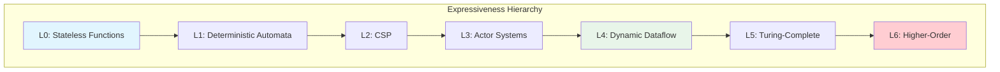

# Unified Streaming Theory

> **Stage**: Struct | **Prerequisites**: None (foundational layer) | **Formalization Level**: L6 (Turing-complete)
> **Translation Date**: 2026-04-21

## Abstract

This document presents the **Unified Streaming Theory Meta-Model (USTM)**, integrating four major paradigms—Actor, CSP, Dataflow, and Petri nets—into a single formal framework. It establishes a six-level expressiveness hierarchy and proves compositional properties of unified streaming systems.

---

## 1. Definitions

### 1.1 Core Meta-Model

A **Unified Streaming System** $\mathcal{U}$ is defined as:

$$\mathcal{U} = (\mathcal{P}, \mathcal{C}, \mathcal{T}, \mathcal{K}, \prec)$$

where:

- $\mathcal{P}$: set of processors (computational units)
- $\mathcal{C}$: set of channels (communication media)
- $\mathcal{T}: \mathcal{P} \times \mathcal{C} \to \{\text{read}, \text{write}, \bot\}$: connection relation
- $\mathcal{K}$: state space (keyed or operator-local)
- $\prec$: happens-before partial order on events

### 1.2 Six-Level Expressiveness Hierarchy

| Level | Name | Characteristics | Example Systems |
|-------|------|-----------------|-----------------|
| L0 | Stateless Functions | No memory, pure functions | AWS Lambda |
| L1 | Deterministic Automata | Finite state, no non-determinism | SDF, regular expressions |
| L2 | Communicating Sequential Processes | Synchronous communication, choice | CSP, Go channels |
| L3 | Actor Systems | Asynchronous messaging, location transparency | Akka, Erlang |
| L4 | Dynamic Dataflow | Dynamic rates, event-time semantics | Flink, Dataflow |
| L5 | Turing-Complete Networks | Full computability, arbitrary recursion | KPN, general Petri nets |
| L6 | Higher-Order Systems | Code as data, self-modification | Reflective systems |

**Strict inclusion**: $L_0 \subset L_1 \subset L_2 \subset L_3 \subset L_4 \subset L_5 \subset L_6$

### 1.3 Processor Formalization

A processor $p \in \mathcal{P}$ is:

$$p = (\text{Beh}_p, \sigma_p, I_p, O_p)$$

where:

- $\text{Beh}_p$: behavior function (may be stateful)
- $\sigma_p$: local state
- $I_p \subseteq \mathcal{C}$: input channels
- $O_p \subseteq \mathcal{C}$: output channels

### 1.4 Channel Formalization

A channel $c \in \mathcal{C}$ is:

$$c = (B_c, \text{ord}_c, \text{cap}_c)$$

where:

- $B_c$: buffer (ordered multiset of messages)
- $\text{ord}_c \in \{\text{FIFO}, \text{LIFO}, \text{unordered}\}$: ordering discipline
- $\text{cap}_c \in \mathbb{N} \cup \{\infty\}$: capacity

### 1.5 Time Model

**Event time**: $t_e: \text{Event} \to \mathbb{T}_{\text{event}}$

**Processing time**: $t_p: \text{Event} \to \mathbb{T}_{\text{proc}}$

**Ingestion time**: $t_i: \text{Event} \to \mathbb{T}_{\text{ingest}}$

**Ordering**: $e_1 \prec e_2 \iff t_e(e_1) < t_e(e_2)$

### 1.6 Unified Concurrency Model (UCM)

The UCM unifies four paradigms via encoding:

| Paradigm | Key Feature | UCM Encoding |
|----------|-------------|--------------|
| Actor | Asynchronous send | Channel with $\text{cap}=\infty$, unordered write |
| CSP | Synchronous rendezvous | Channel with $\text{cap}=0$, blocking read/write |
| Dataflow | Token-based firing | Channel with FIFO, token consumption |
| Petri Net | Place-transition firing | Channel as place, processor as transition |

---

## 2. Properties

### 2.1 Meta-Model Consistency

The USTM meta-model is internally consistent: all four paradigms can be expressed without contradiction.

### 2.2 Mapping Transitivity

If model $A$ encodes model $B$, and $B$ encodes $C$, then $A$ encodes $C$.

### 2.3 Complete Lattice Structure

The six expressiveness levels form a complete lattice under the "can simulate" relation.

### 2.4 Time Model Partial Order

Event time induces a partial order; processing time induces a total order. The mapping $t_e \mapsto t_p$ is order-preserving but not injective.

---

## 3. Relations

### 3.1 Expressiveness Relations

```
CSP --can simulate--> SDF
  |
  v
Actor --can simulate--> CSP (with buffering)
  |
  v
Dataflow --can simulate--> Actor (with channel encoding)
  |
  v
Petri Net --can simulate--> Dataflow (with place/transition mapping)
```

### 3.2 Model-to-Implementation Mapping

| Theory | Apache Flink | Apache Kafka | Akka |
|--------|--------------|--------------|------|
| Processor | Task / Operator | Consumer Group | Actor |
| Channel | Network Buffer | Partition | Mailbox |
| State | KeyedState / OperatorState | Offset | Actor State |
| Time | Watermark | Log Timestamp | Actor-local |

---

## 4. Proofs

### Thm-S-01-01 (Compositional Correctness)

If $\mathcal{U}_1$ and $\mathcal{U}_2$ are correct unified streaming systems (satisfy their specifications), and their channel interfaces are compatible, then $\mathcal{U}_1 \parallel \mathcal{U}_2$ is correct.

**Proof Sketch.** By compatibility, the parallel composition preserves channel invariants. By correctness of components, internal behavior satisfies specifications. The composition does not introduce new behaviors (no shared state). ∎

### Thm-S-01-02 (Expressiveness Level Decision)

For any program $P$, its expressiveness level $L(P)$ can be decided by checking:

1. Does $P$ use unbounded recursion? → $L \geq L_5$
2. Does $P$ use dynamic channel creation? → $L \geq L_3$
3. Does $P$ use asynchronous communication? → $L \geq L_3$
4. Does $P$ use synchronous choice? → $L \geq L_2$
5. Is $P$ stateless? → $L = L_0$

---

## 5. Examples

### 5.1 Flink as USTM Instance

```
Processors: SourceOperator, MapOperator, KeyedProcessOperator, SinkOperator
Channels: Network buffers (bounded, FIFO)
State: KeyedState (ValueState, ListState, MapState)
Time: Event time with Watermark
Level: L4 (Dynamic Dataflow)
```

### 5.2 Actor System Mapping

```
Processors: Actors (behaviors)
Channels: Mailboxes (unbounded, per-actor FIFO)
State: Actor-local state
Time: Actor-local logical time
Level: L3 (Actor Systems)
```

---

## 6. Visualizations



---

## 7. References
