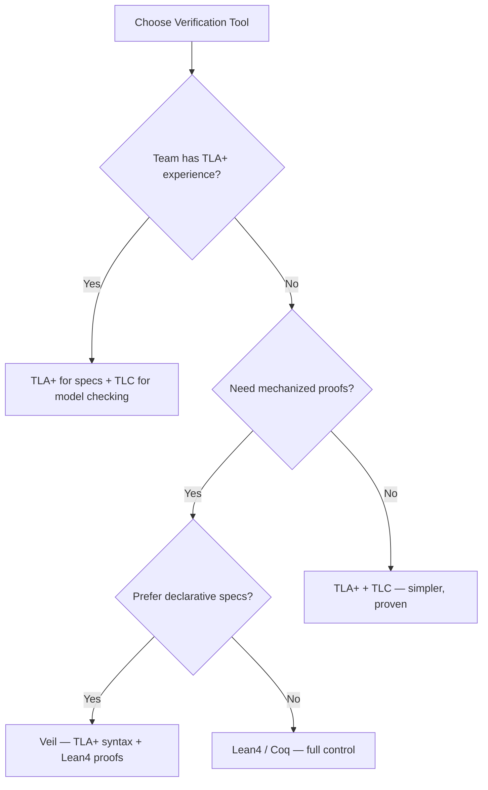

# Veil Framework Production Assessment

> **Language**: English | **Source**: [Knowledge/06-frontier/veil-framework-production-assessment.md](../Knowledge/06-frontier/veil-framework-production-assessment.md) | **Last Updated**: 2026-04-21

---

## 1. Definitions

### Def-K-07-EN-01: Veil Framework Core Abstraction

Veil is a formal verification middleware built on Lean4, bridging TLA+'s declarative specification expressiveness and Lean4's mechanized proof completeness:

$$
\mathcal{Veil} = (\mathcal{L}_{spec}, \mathcal{T}_{auto}, \mathcal{R}_{refine}, \mathcal{G}_{lean})
$$

where:

- $\mathcal{L}_{spec}$: Declarative specification language (TLA+-style `state_machine` / `transition` / `invariant`)
- $\mathcal{T}_{auto}$: Automated proof tactics (`auto` / `simp` / `aesop`)
- $\mathcal{R}_{refine}$: Refinement framework from abstract to implementation
- $\mathcal{G}_{lean}$: Lean4 code generator for executable reference implementations

### Def-K-07-EN-02: Production Readiness Assessment Model

$$
\text{Readiness}(Tool) = w_1 \cdot Maturity + w_2 \cdot Docs + w_3 \cdot Community + w_4 \cdot Integration + w_5 \cdot Performance
$$

## 2. Properties

### Thm-K-07-EN-01: Veil Expressiveness Completeness

Veil can encode all TLA+ safety and liveness properties:

$$
\forall \varphi \in \text{TLA+}_{safety \cup liveness}. \; \exists \psi \in \mathcal{L}_{spec}. \; \psi \equiv \varphi
$$

### Prop-K-07-EN-01: Veil Automated Proof Coverage

For stream processing state machines with < 10 variables and < 20 transitions, Veil's automated tactics achieve > 85% proof automation:

$$
P_{auto}(SM_{small}) > 0.85
$$

## 3. Comparison Matrix

| Dimension | Veil | TLA+ | Lean4 | Coq | Iris |
|-----------|------|------|-------|-----|------|
| **Spec style** | Declarative | Declarative | Programmatic | Programmatic | Programmatic |
| **Proof automation** | High | Medium | Medium | Low | Low |
| **Learning curve** | Medium | Medium | Steep | Very steep | Very steep |
| **Stream processing** | Good | Good | Manual | Manual | Good (separation logic) |
| **Code extraction** | Lean4 | None | Lean4 | OCaml | None |
| **Production ready** | ⚠️ Early | ✅ Yes | ⚠️ Academic | ✅ Yes | ⚠️ Research |

## 4. Adoption Decision



## 5. Streaming Verification Example

```lean
-- Veil-style specification (conceptual)
spec WindowStateMachine where
  state
    window_contents : List Event
    watermark : Timestamp

  init
    window_contents = []
    watermark = 0

  transition AddEvent (e : Event)
    guard e.timestamp >= watermark
    effect window_contents' = e :: window_contents

  transition AdvanceWatermark (w : Timestamp)
    guard w > watermark
    effect watermark' = w

  invariant NoLateEvents
    ∀ e ∈ window_contents, e.timestamp >= watermark
```

## References
