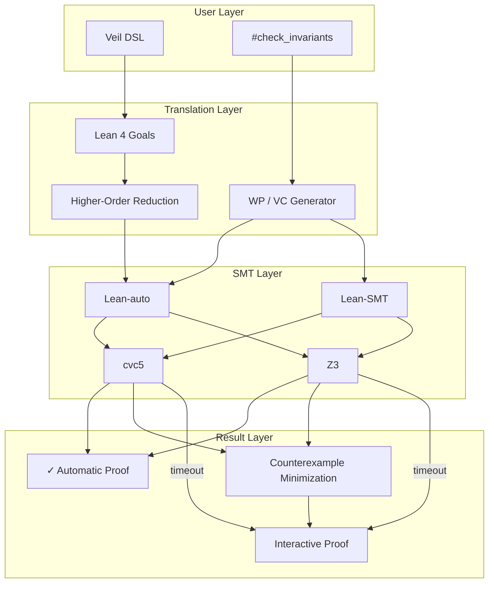
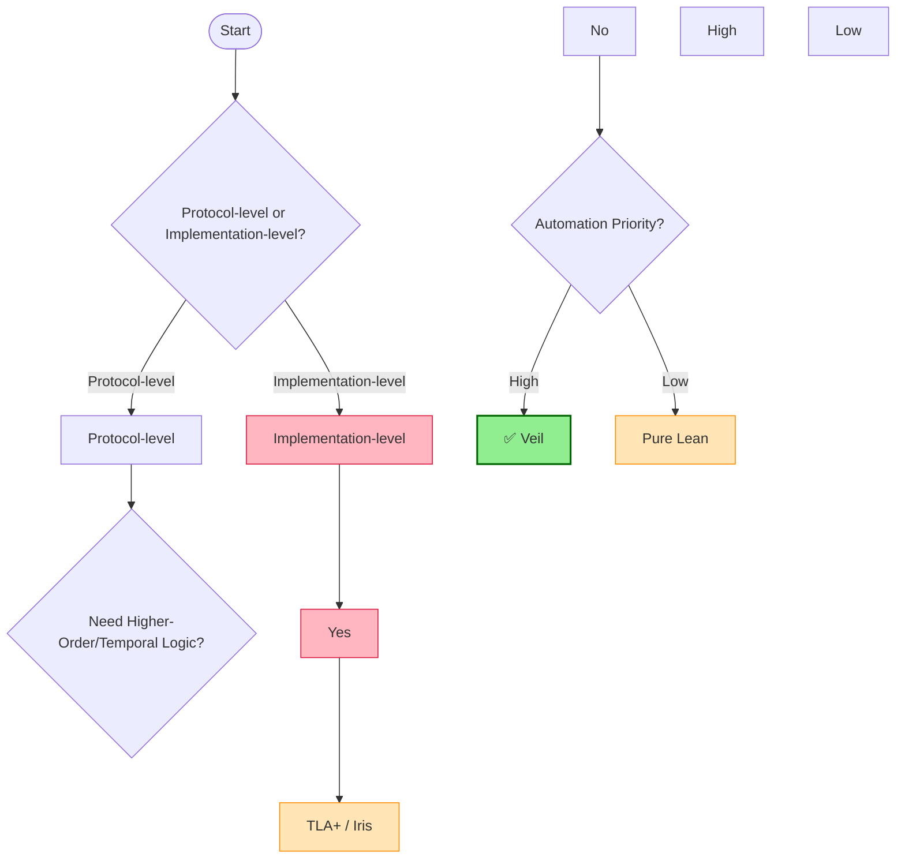

# Veil Framework Production-Grade Formal Verification Assessment (CAV 2025 Update)

> **Stage**: Struct/ | **Prerequisites**: [Struct/07-tools/00-INDEX.md](../Struct/07-tools/00-INDEX.md) | **Formality Level**: L3-L4

## 1. Definitions

### Def-S-VL-01: Veil Transition System (VTS)

A Veil transition system is a quintuple $\mathcal{V} = (S, A, I, T, \Phi)$, where:

- $S \subseteq \Sigma_1 \times \cdots \times \Sigma_n$ is the state space, where each $\Sigma_i$ corresponds to the carrier set of a sort;
- $A = \{a_1, \dots, a_m\}$ is a finite set of actions, where each action $a_k$ is a state transition relation $a_k \subseteq S \times S$;
- $I \subseteq S$ is the set of initial states, characterized by a first-order logic formula $\phi_I$;
- $T: S \times A \rightarrow 2^S$ is the deterministic or non-deterministic transition function;
- $\Phi = \{\phi_1, \dots, \phi_p\}$ is the set of invariants, where each $\phi_j$ is a first-order logic safety property.

**Intuitive Explanation**: Veil models distributed protocols as transition systems. Developers declare state variables, actions, and invariants through an imperative-style DSL, and Veil automatically converts them into formal objects in Lean 4. State variables correspond to mutable configurations in the protocol (such as node roles, log indices), actions correspond to protocol events (such as vote requests), and invariants encode safety properties (such as "at most one Leader per term").

### Def-S-VL-02: Decidable Automated Verification Fragment (DAVF)

A Veil specification $\mathcal{V}$ is said to be in the **Decidable Automated Verification Fragment** if and only if its generated verification conditions (VCs) satisfy:

1. All quantifiers appear only in prefix position in first-order logic;
2. No higher-order quantification is involved (such as universal/existential quantifiers over relations);
3. The cardinality of sorts is finite or decidable by SMT solver-supported theory fragments (such as EPR, UF, LIA);
4. The transition relation $T$ and invariants $\Phi$ can be encoded in quantifier-free or limited-quantifier form.

Within this fragment, Veil can achieve "one-click" automatic proof via SMT solvers (default cvc5, fallback Z3). The CAV 2025 evaluation shows that DAVF covers approximately 87.5% of typical safety property verification needs in the distributed protocols literature.

## 2. Properties

### Prop-S-VL-01: Soundness of Veil VC Generator

**Proposition**: Let $\mathcal{V}$ be any Veil transition system and $\text{VCGen}(\mathcal{V}, \phi)$ be the set of verification conditions generated for invariant $\phi$. If all $\text{VC} \in \text{VCGen}(\mathcal{V}, \phi)$ are proven in Lean 4, then $\phi$ is an inductive invariant of $\mathcal{V}$.

**Derivation Sketch**: Veil's VC generator implements meta-theory in Lean 4 with an accompanying soundness proof. This proof guarantees that the transformation from action semantics to weakest precondition preserves logical entailment; the encoding of initialization conditions and preservation conditions correctly corresponds to the two subgoals of an inductive invariant. Since Lean 4's core logic is Constructive Inductive Calculus (CIC) and the VC generator itself is proven in Lean, there is no "verifier bug" risk common to external verification tools.

### Lemma-S-VL-01: Auto-Interactive Completeness

**Lemma**: For any Veil specification $\mathcal{V}$, if its invariant $\phi$ is provable in Lean 4, then there exists a degradation path from automatic verification to interactive verification: when the SMT solver times out and cannot prove a VC, that VC is preserved as a Lean proof goal, and the user can switch to interactive mode to complete the proof.

**Proof**: By Veil's embedding architecture (Lean DSL + SMT tactics), all verification conditions exist as Lean proof goals. The `veil_check` tactic first attempts the `auto` tactic (calling Lean-auto/Lean-SMT translation to SMT-LIB); if it returns `unknown` or `timeout`, the goal remains open. The user can then use standard Lean tactics (such as `intro`, `apply`, `induction`) to continue the proof. Since Lean 4's metaprogramming framework supports preserving unclosed goals after tactic execution, the degradation path is always technically feasible. ∎

## 3. Relations

### 3.1 Veil vs. Existing Tools Comparison Mapping

| Dimension | Veil | TLA+ / TLAPS | Ivy | Dafny | Pure Lean / Iris |
|-----------|------|-------------|-----|-------|-----------------|
| **Automation Level** | High (one-click SMT) | Medium (manual proof) | High (limited EPR) | High (general programs) | Low (fully interactive) |
| **Expressiveness** | First-order + higher-order fallback | Higher-order temporal logic | Limited EPR/finite model | General imperative | Higher-order separation logic |
| **Verification Foundation** | Lean 4 + SMT | ZFC + temporal logic | Z3 + manual assist | Dafny VC + Z3 | CIC + custom |
| **Target Domain** | Distributed protocols | General concurrent/distributed | Distributed protocols | General software | Any formalization |
| **Composability** | Strong (Lean libraries) | Weak | Weak | Medium | Strong |
| **Counterexample Feedback** | Model minimization | TLC explicit state | Finite model | General | Manual construction |

### 3.2 Formal Relations

**Encoding Relation**: Any Ivy specification within the EPR fragment can be mechanically translated into an equivalent Veil specification. Veil supports non-EPR protocols (such as specifications containing function symbols or arithmetic), whereas Ivy requires finite model construction or user assistance for such specifications. The CAV 2025 benchmark shows that Ivy timed out after 300 seconds on 2 non-EPR benchmarks (including the Rabia protocol), while Veil succeeded in automatic verification.

**Refinement Relation**: Veil's DSL can be viewed as a refinement of TLA+ Action syntax: Veil state variables correspond to TLA+ state functions, Veil actions correspond to TLA+ Actions, and Veil invariants correspond to TLA+ State Predicates. However, Veil does not directly support temporal operators (such as $\Box, \Diamond$); safety properties must be explicitly encoded as inductive invariants. Veil is a DSL extension of Lean 4, and all its objects ultimately unfold into Lean terms, thus inheriting Lean's entire ecosystem (Mathlib, Lake, VS Code extensions), forming an architectural-level difference from Dafny (standalone language) and Ivy (standalone toolchain).

## 4. Argumentation

### 4.1 Boundary Analysis of Automatic Verification

Veil's automatic verification capability is limited by the following boundaries:

1. **EPR Boundary**: Although Veil supports non-EPR specifications, when specifications enter non-EPR territory (such as mixing uninterpreted functions and linear arithmetic), SMT solvers may return `unknown`. The CAV 2025 evaluation shows that 87.5% of cases complete automatically within 15 seconds; remaining cases (such as the Rabia protocol) require extending the per-query timeout to 120 seconds.

2. **Higher-Order Quantification Boundary**: If protocol specifications require higher-order quantification (such as "for all possible message handler configurations"), Veil's tactics must decompose higher-order structures into first-order components. This process is theoretically incomplete: certain higher-order properties cannot be automatically reduced and must switch to interactive mode. For example, describing "message sequences of arbitrary length preserve causal consistency" involves induction over lists, which is outside the scope of DAVF.

3. **State Space Explosion**: The TLC-style explicit-state model checker introduced in Veil 2.0 Preview can handle finite-state instances, but for large-scale parameterized protocols (such as Raft with arbitrary node counts), inductive invariants rather than model checking are still required.

### 4.2 Constructive Explanation of Counterexample Minimization

When the SMT solver returns a counterexample model $M$, Veil performs model minimization through incremental SMT queries: first reduce the interpretation domain $|\sigma^M|$ for each sort $\sigma$; then, after fixing sort cardinalities, minimize the number of true tuples in each relation interpretation; finally, convert the minimized model into protocol-level terminology for presentation to the user. This process draws on mypyvy's model minimization technology, but because it is embedded in Lean, the minimized counterexample can be directly used to construct auxiliary lemmas in interactive proofs.

### 4.3 Adaptability Discussion with Stream Computing Semantics

The core semantics of stream computing systems (such as Apache Flink) involve time models, window operators, fault tolerance mechanisms (checkpoint consistency), and backpressure mechanisms (backpressure liveness). These concepts require temporal logic, higher-order types, and real-time/hybrid system theory. Veil's transition system model can describe operator state transitions, but watermark monotonicity, checkpoint exactly-once semantics, etc. require richer formalization frameworks. Therefore, for formal verification of Flink's core engine, Veil is suitable as a **component-level tool** (verifying distributed coordination sub-protocols), not as a **system-level framework** (covering the complete DataStream API semantics).

## 5. Proof / Engineering Argument

### 5.1 Meta-Theory Soundness of Veil VC Generator

Veil's core soundness guarantee comes from the meta-theory proof in its Lean 4 implementation:

**Theorem (VCGen Soundness)**: Let `act` be an action defined in Veil DSL, `wp(act, φ)` be the weakest precondition computation, and `vc_init` and `vc_pres` be the initialization condition and preservation condition respectively. Then:

$$
\frac{\vdash \text{vc\_init} \rightarrow \phi(\text{init}) \quad \vdash \text{vc\_pres} \rightarrow \forall s, s'.\, T(s, a, s') \land \phi(s) \rightarrow \phi(s')}{\vdash \phi \text{ is an inductive invariant of } \mathcal{V}}
$$

This theorem is formally proven in `Veil/DSL/Action/Theory.lean`, relying on: Lean 4's metaprogramming framework (`MetaM`/`TacticM` Monad) for DSL unfolding; structural recursive definition of `wp` preserving logical equivalence; Hoare-style axiomatization of action semantics. This soundness proof means Veil's "trusted base" is minimal—only Lean 4 kernel (approximately 10K lines of C++) and the SMT solver need to be trusted, eliminating the "verifier correctness" risk common in traditional program verification tools.

### 5.2 Production-Grade Applicability Engineering Argument

| Evaluation Dimension | Score | Argument |
|---------------------|-------|----------|
| **Verification Throughput** | 4/5 | 16 protocols fully automatically verified, 87.5% < 15s, suitable for CI integration. |
| **Learning Curve** | 3/5 | Requires Lean 4 basics, but DSL is simpler than pure Lean. |
| **Ecosystem Maturity** | 2/5 | Open-sourced April 2025, community still forming. |
| **Proof Maintainability** | 4/5 | Lean libraries are composable, proofs are reusable. |
| **Distance to Code** | 3/5 | Verifies abstract protocol models, not directly executable code. |
| **Stream Processing Applicability** | 2/5 | Transition systems can describe operator state machines, but Watermark, Checkpoint, etc. require extensive manual encoding. |

**Overall Conclusion**: Veil has quasi-production-grade verification capabilities for distributed consensus protocols (Raft, Paxos), distributed lock services (Chubby-style), and replicated state machines (KV Store). For complex stream processing semantics (such as Flink Checkpoint consistency, Backpressure liveness), Veil's first-order fragment expressiveness is insufficient, requiring higher-order logic or temporal logic. Such scenarios should select TLA+ (system-level specification) or Iris (higher-order concurrent separation logic).

## 6. Examples

### 6.1 Raft Consensus Protocol Verification Overview

Raft protocol safety properties include Leader Completeness and State Machine Safety. The core snippet for verifying Leader Completeness in Veil:

```lean
type node
type term
immutable relation member : node → Prop
mutable relation leader : node → term → Prop
mutable relation voted_for : node → node → term → Prop

invariant leader_unique :
  ∀ (n1 n2 : node) (t : term),
    leader n1 t → leader n2 t → n1 = n2

action request_vote (c : node) (t : term) = {
  require member c
  require ¬(∃ n, leader n t)
  leader c t := True
}

#check_invariants
```

After executing `#check_invariants`, Veil automatically generates initialization VCs and preservation VCs. In the CAV 2025 experimental environment (2024 MacBook Pro M4, 32GB RAM, cvc5 1.2.1), cvc5 automatically proves all VCs in < 5s.

### 6.2 Non-EPR Protocol: Rabia Performance Boundary

The Rabia protocol (SOSP 2021) specification involves linear arithmetic constraints (such as quorum size calculation), exceeding the pure EPR fragment. In the CAV 2025 evaluation: Ivy could not complete verification within the 300s timeout (EPR limitation); Veil succeeded in automatic verification after setting per-query timeout to 120s; total verification time approximately 95s. This case proves that Veil's non-EPR support is not merely a theoretical feature but has practical usability.

### 6.3 Interactive Degradation: Custom Inductive Invariants

When automatic verification fails due to a non-inductive invariant, Veil allows users to supplement auxiliary invariants and prove them interactively:

```lean
#check_invariants

invariant log_matching_aux :
  ∀ (n1 n2 : node) (t : term),
    leader n1 t → log_term n2 t → voted_for n2 n1 t

lemma leader_election_vote_lock {n1 n2 : node} {t : term} :
  leader n1 t → log_term n2 t → voted_for n2 n1 t := by
  veil_automation
  intro h_leader h_log
  exact vote_agreement (quorum_property h_leader) n2 h_log

#check_invariants
```

This workflow embodies Veil's "automation first, interactive fallback" design philosophy: approximately 80% of VCs are automatically discharged by SMT, while the remaining 20% of non-inductive invariants are handled manually through Lean's interactive proof infrastructure.

## 7. Visualizations

### 7.1 Veil Architecture Hierarchy Diagram



The above diagram shows Veil's core data flow: users write protocol specifications via DSL, Veil unfolds them into Lean proof goals; the VC generator computes weakest preconditions; higher-order reduction transforms them into first-order logic; Lean-auto/Lean-SMT translates to SMT-LIB; finally solved by cvc5/Z3. If successful, a proof is returned; if a counterexample is returned, model minimization is triggered; if timeout, open goals are preserved for interactive proof.

### 7.2 Formal Tool Selection Decision Tree



This decision tree reveals Veil's "sweet spot": protocol-level, first-order expressible, automation-priority verification tasks. For implementation-level verification of stream computing systems, Veil can serve as a verification tool for protocol sub-components, but needs to be combined with TLA+ system-level specification and Iris implementation-level verification.

## 8. References
