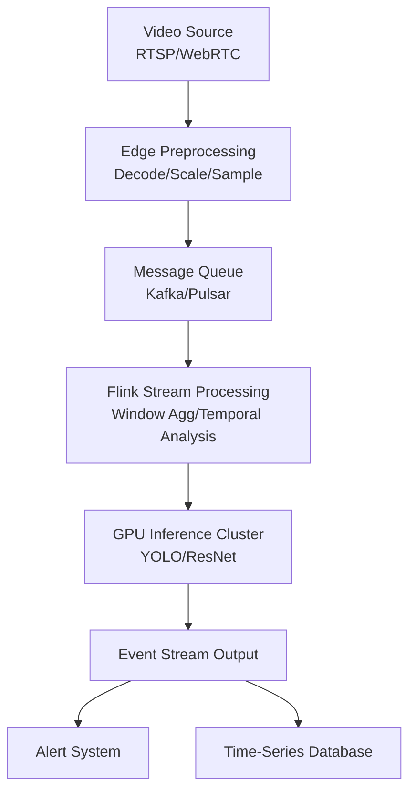

# Real-Time Video Stream Analytics

> **Language**: English | **Source**: [Knowledge/06-frontier/video-stream-analytics.md](../Knowledge/06-frontier/video-stream-analytics.md) | **Last Updated**: 2026-04-21

---

## 1. Definitions

**Def-K-Video-EN-01: Real-Time Video Stream Analytics**

Stream computing applications that perform low-latency frame extraction, object detection, behavior recognition, event triggering, and response decision-making on continuous video streams (e.g., surveillance cameras, live streams, drone feeds). The core goal is to produce actionable analysis results within seconds or even milliseconds after video capture.

**Def-K-Video-EN-02: Frame Sampling Strategy**

Due to extremely high raw data rates (1080p@30fps ≈ 373MB/s uncompressed), stream systems typically do not process every frame. Instead, they use skip frames, I-frame extraction, or adaptive sampling (dynamically adjusting the sampling rate based on scene change rate) to reduce computational load.

**Def-K-Video-EN-03: Edge-Cloud Collaborative Inference**

Deploy lightweight video preprocessing (decoding, scaling, background subtraction) on edge devices, while offloading complex deep learning inference (object detection, face recognition) to cloud GPU clusters. Stream computing frameworks (e.g., Flink) orchestrate tasks and aggregate results.

## 2. Properties

**Lemma-K-Video-EN-01: Frame Sampling Rate vs. Detection Accuracy**

In scenes with continuously moving objects, reducing sampling from 30fps to 5fps decreases recall by < 5% for targets moving < 5 pixels/frame, but may decrease recall by 20%-40% for fast targets moving > 20 pixels/frame.

**Lemma-K-Video-EN-02: Inference Batch Size Latency-Throughput Tradeoff**

For GPU inference engines, increasing batch size from 1 to 8 typically improves throughput by 3-5×, but end-to-end latency increases from 20-50ms per frame to 80-200ms. Stream systems must select optimal batch size based on SLA.

**Prop-K-Video-EN-01: Scene-Change-Driven Adaptive Sampling is Optimal**

In static monitoring scenes with long-term no change in fixed regions, sampling rate can be reduced to 1fps. In high-event regions (e.g., intersections), it should be increased to 15-30fps. Adaptive sampling saves 60%-90% of computational resources compared to fixed sampling.

## 3. Architecture

## 4. Sampling Strategy Comparison

| Strategy | Compute Cost | Latency | Use Case |
|----------|-------------|---------|----------|
| Skip (fixed interval) | Low | Low | Uniform motion scenes |
| I-Frame only | Very low | Very low | Static background monitoring |
| Adaptive (scene-based) | Medium | Medium | Complex dynamic scenes |
| Full frame | Very high | High | High-precision requirements |

## References
