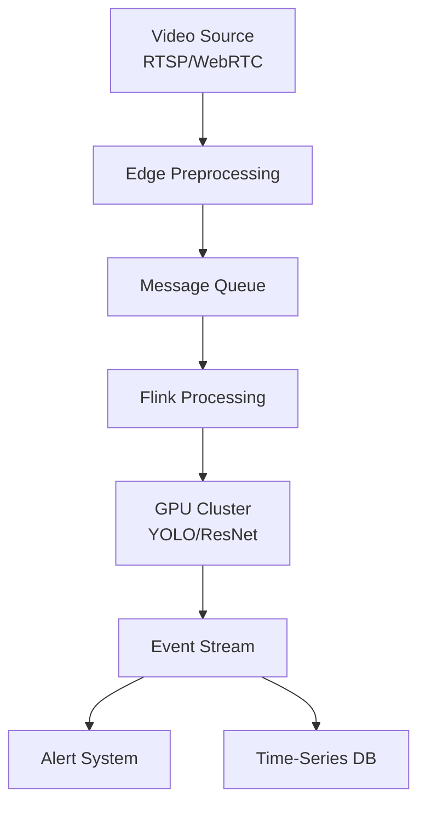

# Real-Time Video Stream Analytics

> **Stage**: Knowledge/06-frontier | **Prerequisites**: [Multimodal Stream Processing](multimodal-stream-processing.md) | **Formalization Level**: L4
> **Translation Date**: 2026-04-21

## Abstract

Real-time video stream analytics processes continuous video feeds (surveillance, live streaming, drone footage) with low-latency frame extraction, object detection, behavior recognition, and event triggering.

---

## 1. Definitions

### Def-K-Video-01 (Real-Time Video Stream Analytics)

**Real-time video stream analytics** processes continuous video streams with sub-second or millisecond latency for actionable insights.

### Def-K-Video-02 (Frame Sampling Strategy)

Due to high raw data rates (1080p@30fps ≈ 373MB/s uncompressed), systems use:

- **Skip sampling**: Process every Nth frame
- **I-Frame extraction**: Use key frames only
- **Adaptive sampling**: Dynamic rate based on scene change

### Def-K-Video-03 (Edge-Cloud Collaborative Inference)

Lightweight preprocessing (decode, resize, background subtraction) at the edge; complex deep learning (object detection, face recognition) in cloud GPU clusters, orchestrated by Flink.

---

## 2. Properties

### Lemma-K-Video-01 (Sampling Rate vs Detection Accuracy)

At 30fps → 5fps sampling:

- Slow targets (< 5 px/frame): recall drop < 5%
- Fast targets (> 20 px/frame): recall drop 20-40%

### Lemma-K-Video-02 (Batch Size Latency-Throughput Trade-off)

GPU batch size 1 → 8:

- Throughput: 3-5x improvement
- Latency: 20-50ms → 80-200ms

### Prop-K-Video-01 (Adaptive Sampling is Optimal)

Adaptive sampling saves 60-90% compute vs fixed sampling:

- Static scenes: 1fps
- Event-heavy areas (crossroads): 15-30fps

---

## 3. Architecture

---

## 4. References
