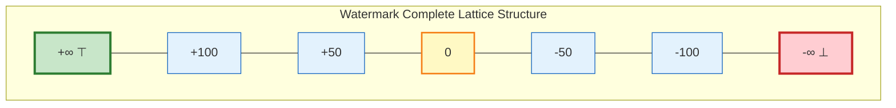
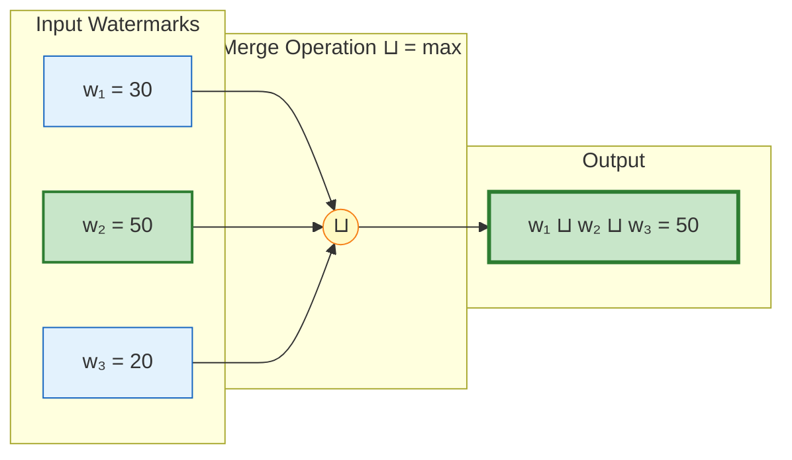
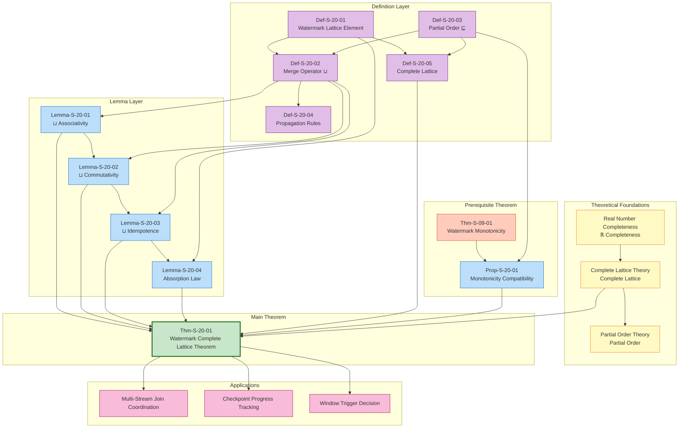

# Watermark Algebra Formal Proof

> **Stage**: Struct/04-proofs | **Prerequisites**: [../02-properties/02.03-watermark-monotonicity.md](../02-properties/02.03-watermark-monotonicity.md) | **Formalization Level**: L5

---

## Table of Contents

- [Watermark Algebra Formal Proof](#watermark-algebra-formal-proof)
  - [Table of Contents](#table-of-contents)
  - [1. Definitions](#1-definitions)
    - [Def-S-20-01 (Watermark Lattice Element)](#def-s-20-01-watermark-lattice-element)
    - [Def-S-20-02 (Watermark Merge Operator ⊔)](#def-s-20-02-watermark-merge-operator-)
    - [Def-S-20-03 (Watermark Partial Order ⊑)](#def-s-20-03-watermark-partial-order-)
    - [Def-S-20-04 (Watermark Propagation Rules)](#def-s-20-04-watermark-propagation-rules)
    - [Def-S-20-05 (Watermark Complete Lattice)](#def-s-20-05-watermark-complete-lattice)
  - [2. Properties](#2-properties)
    - [Lemma-S-20-01 (⊔ Associativity)](#lemma-s-20-01--associativity)
    - [Lemma-S-20-02 (⊔ Commutativity)](#lemma-s-20-02--commutativity)
    - [Lemma-S-20-03 (⊔ Idempotence)](#lemma-s-20-03--idempotence)
    - [Lemma-S-20-04 (⊔ Absorption and Identity)](#lemma-s-20-04--absorption-and-identity)
    - [Prop-S-20-01 (Watermark Monotonicity and Lattice Structure Compatibility)](#prop-s-20-01-watermark-monotonicity-and-lattice-structure-compatibility)
  - [3. Relations](#3-relations)
    - [Relation 1: Watermark Lattice `↦` Complete Lattice Theory](#relation-1-watermark-lattice--complete-lattice-theory)
    - [Relation 2: Watermark Merge `⟹` Monotonicity Preservation](#relation-2-watermark-merge--monotonicity-preservation)
    - [Relation 3: Watermark Propagation `≈` Least Upper Bound Computation](#relation-3-watermark-propagation--least-upper-bound-computation)
  - [4. Argumentation](#4-argumentation)
    - [Lemma 4.1 (Uniqueness of Least Upper Bound)](#lemma-41-uniqueness-of-least-upper-bound)
    - [Lemma 4.2 (Chain Completeness of Watermark Lattice)](#lemma-42-chain-completeness-of-watermark-lattice)
    - [Counterexample 4.1 (Inconsistency Caused by Non-Associative Merge Operator)](#counterexample-41-inconsistency-caused-by-non-associative-merge-operator)
    - [Counterexample 4.2 (Incompleteness of Lattice Missing ⊥ Element)](#counterexample-42-incompleteness-of-lattice-missing--element)
  - [5. Proofs](#5-proofs)
    - [Thm-S-20-01 (Watermark Complete Lattice Theorem)](#thm-s-20-01-watermark-complete-lattice-theorem)
  - [6. Examples](#6-examples)
    - [Example 6.1: Watermark Merge for Multi-Stream Join Operator](#example-61-watermark-merge-for-multi-stream-join-operator)
    - [Example 6.2: Hierarchical Watermark Propagation in Distributed Aggregation](#example-62-hierarchical-watermark-propagation-in-distributed-aggregation)
    - [Counterexample 6.3: Lattice Property Violation Caused by Non-Monotonic Propagation](#counterexample-63-lattice-property-violation-caused-by-non-monotonic-propagation)
  - [7. Visualizations](#7-visualizations)
    - [Watermark Lattice Structure Diagram](#watermark-lattice-structure-diagram)
    - [Merge Operation Visualization](#merge-operation-visualization)
    - [Proof Dependency Graph](#proof-dependency-graph)
  - [8. References](#8-references)

---

## 1. Definitions

This section builds upon the theoretical foundation of Watermark monotonicity established in [02.03-watermark-monotonicity.md](../02-properties/02.03-watermark-monotonicity.md), introducing a rigorous lattice-theoretic formalization framework for Watermark algebra. By modeling Watermark as a complete lattice element, we provide an algebraic foundation for its merge operation (⊔) and propagation rules—the core abstraction for out-of-order data coordination and progress synchronization in distributed stream processing systems.

---

### Def-S-20-01 (Watermark Lattice Element)

**Definition**: Let the time domain be extended to $\hat{\mathbb{T}} = \mathbb{R} \cup \{ -\infty, +\infty \}$. The Watermark lattice $W$ is defined as:

$$
W = (\hat{\mathbb{T}}, \sqsubseteq, \bot, \top, \sqcup, \sqcap)
$$

Where:

- **Base set** $\hat{\mathbb{T}}$: Extended real numbers, including positive and negative infinity as boundary elements
- **Partial order** $\sqsubseteq$: Extension of the standard real number order, satisfying $-\infty \sqsubseteq t \sqsubseteq +\infty$ for all $t \in \hat{\mathbb{T}}$
- **Bottom element** $\bot = -\infty$: Represents "no progress" or "initial state"
- **Top element** $\top = +\infty$: Represents "stream end" or "infinite future"
- **Join operation** $\sqcup$: Maximum operation, $a \sqcup b = \max(a, b)$
- **Meet operation** $\sqcap$: Minimum operation, $a \sqcap b = \min(a, b)$

**Formal construction**:

For any Watermark value $w \in W$, its algebraic properties as a lattice element are characterized by the following axioms:

$$
\begin{aligned}
&\text{(W1)} \quad \bot \in W \land \top \in W \\
&\text{(W2)} \quad \forall w \in W: \bot \sqsubseteq w \sqsubseteq \top \\
&\text{(W3)} \quad \forall w_1, w_2 \in W: w_1 \sqcup w_2 \in W \land w_1 \sqcap w_2 \in W
\end{aligned}
$$

**Intuitive explanation**: Watermark lattice elements elevate timestamp values to the level of algebraic structures. $-\infty$ corresponds to the "no time" state before system startup, and $+\infty$ corresponds to the "eternity" state after stream processing completion. Any Watermark value lies between these two extremes and forms a hierarchical structure through the partial order relation. This construction makes Watermark not merely a timestamp, but a lattice-theoretic entity carrying algebraic operational capabilities.

**Motivation for definition**: Stream processing systems need to coordinate progress among multiple concurrent streams (e.g., Join, Union operations). Modeling Watermark as a lattice element gives the intuitive operation of "taking the slowest stream's progress" a rigorous mathematical foundation—that is, computing the least upper bound. The completeness provided by lattice theory ensures that regardless of how many input streams there are, the Watermark merge operation is always well-defined.

---

### Def-S-20-02 (Watermark Merge Operator ⊔)

**Definition**: The Watermark merge operator $\sqcup: W \times W \to W$ is defined as the **maximum operation** on the extended real numbers:

$$
w_1 \sqcup w_2 = \max(w_1, w_2)
$$

**Multi-way generalization**: For a finite set $S = \{w_1, w_2, \ldots, w_n\} \subseteq W$, the merge operator generalizes to:

$$
\bigsqcup S = \max_{w \in S} w
$$

**Empty set convention**:

$$
\bigsqcup \emptyset = \bot = -\infty
$$

This convention ensures the completeness of the merge operator as an algebraic operation—even when there are no input streams, the operation still yields a definite result.

**Semantic interpretation**: In stream processing systems, $\sqcup$ corresponds to the **complement operation** of "the minimum of all input streams' Watermarks". Specifically:

- For multi-input operators (e.g., Join), the output Watermark is typically the minimum of all input Watermarks: $w_{\text{out}} = \min_i w_{\text{in}_i}$
- This operation corresponds to the **meet operation** $\sqcap$ in lattice theory, while we define $\sqcup$ as its dual operation (maximum)

**Why choose maximum as ⊔**: In lattice theory, the join operation $\sqcup$ corresponds to the least upper bound. For the Watermark lattice, the partial order $\sqsubseteq$ is the "less than or equal to" relation, so the least upper bound of two elements is indeed the larger one (the maximum). This is consistent with intuition: if $w_1 \leq w_2$, then $w_2$ is an upper bound of $\{w_1, w_2\}$, and the smallest such upper bound.

**Intuitive explanation**: The Watermark merge operator answers the question "Which of the two progress indicators represents a later point in time?" Merging two Watermarks yields the more "advanced" one—this is particularly important when dealing with idle sources, as the system needs to know when it can safely ignore a stalled stream.

---

### Def-S-20-03 (Watermark Partial Order ⊑)

**Definition**: The Watermark partial order relation $\sqsubseteq \subseteq W \times W$ is defined as:

$$
w_1 \sqsubseteq w_2 \iff w_1 \leq w_2 \text{ (in the extended real number order)}
$$

**Equivalent formulation**:

$$
w_1 \sqsubseteq w_2 \iff w_1 \sqcup w_2 = w_2 \iff w_1 \sqcap w_2 = w_1
$$

**Strict partial order**: Define the strict partial order $\sqsubset$ as:

$$
w_1 \sqsubset w_2 \iff w_1 \sqsubseteq w_2 \land w_1 \neq w_2
$$

**Comparability**: Since $\sqsubseteq$ is a total order restricted to the extended real numbers, any two Watermarks are comparable:

$$
\forall w_1, w_2 \in W: w_1 \sqsubseteq w_2 \lor w_2 \sqsubseteq w_1
$$

Therefore, $(W, \sqsubseteq)$ forms a **chain**—a special case of a partially ordered set.

**Connection to Watermark monotonicity**:

From **Def-S-09-02** in [02.03-watermark-monotonicity.md](../02-properties/02.03-watermark-monotonicity.md), Watermark as a time function satisfies:

$$
t_1 \leq t_2 \implies w(t_1) \sqsubseteq w(t_2)
$$

This shows that the Watermark Monotonicity Theorem (Thm-S-09-01) is essentially a monotonicity statement about the partial order $\sqsubseteq$.

**Intuitive explanation**: The partial order relation $\sqsubseteq$ formalizes the intuitive concept of "no later than". If $w_1 \sqsubseteq w_2$, then the set of records with event time not exceeding $w_1$ is a subset of the set of records with event time not exceeding $w_2$. This inclusion relation is precisely the core semantics of Watermark as a progress indicator.

---

### Def-S-20-04 (Watermark Propagation Rules)

**Definition**: Let operator $v$ have $k$ input channels, with Watermarks $w_1, w_2, \ldots, w_k$ on each channel. The Watermark propagation rule $P_v: W^k \to W$ is defined as:

**Rule 1 — Single-input operators (Map, Filter, FlatMap, etc.)**:

$$
P_v(w) = w \oplus d_v
$$

Where $d_v \geq 0$ is the processing delay constant of operator $v$, and $\oplus$ is defined as:

$$
w \oplus d = \begin{cases} w - d & \text{if } w \in \mathbb{R} \\ w & \text{if } w \in \{ -\infty, +\infty \} \end{cases}
$$

**Rule 2 — Multi-input operators (Join, Union, CoGroup, etc.)**:

$$
P_v(w_1, w_2, \ldots, w_k) = \bigsqcap_{i=1}^{k} (w_i \oplus d_v) = \min_{1 \leq i \leq k} (w_i \oplus d_v)
$$

**Rule 3 — Source operator**:

$$
P_{\text{src}}(t) = \left( \max_{r \in \text{Observed}(t)} t_e(r) \right) - \delta_{\text{src}}
$$

Where $\delta_{\text{src}} \geq 0$ is the maximum out-of-order tolerance parameter of the Source.

**Rule 4 — Sink operator**:

$$
P_{\text{sink}}(w) = w
$$

The Sink passes through the input Watermark without modification.

**Lattice-theoretic interpretation of propagation rules**:

The propagation rule for multi-input operators can be rewritten as:

$$
P_v(w_1, \ldots, w_k) = \left( \bigsqcup_{i=1}^{k} (-w_i) \right) \oplus d_v
$$

Where $-w_i$ is the additive inverse of $w_i$ (defined in extended real numbers). This shows that the "minimum" operation for multi-input Watermarks can be expressed through the dual lattice (maximum).

**Intuitive explanation**: Watermark propagation rules define how Watermarks flow and transform through the dataflow graph. Single-input operators preserve Watermark monotonicity, only performing translation; multi-input operators converge to the slowest input's progress, ensuring data from all inputs is accounted for; Sources generate initial Watermarks based on observed data; Sinks pass through Watermarks to notify external systems of progress.

---

### Def-S-20-05 (Watermark Complete Lattice)

**Definition**: The Watermark structure $(W, \sqsubseteq, \bot, \top, \sqcup, \sqcap)$ constitutes a **complete lattice** if and only if it satisfies:

$$
\forall S \subseteq W: \bigsqcup S \in W \land \bigsqcap S \in W
$$

That is: any subset of $W$ has a least upper bound (supremum) and a greatest lower bound (infimum).

**Verification**: For $W = \hat{\mathbb{T}} = \mathbb{R} \cup \{-\infty, +\infty\}$:

- **Non-empty finite subsets**: $\bigsqcup S = \max S$ and $\bigsqcap S = \min S$ clearly exist
- **Infinite subsets**: By the completeness of extended real numbers, bounded infinite sets have suprema; unbounded sets have suprema/infima of $\pm\infty$, both in $W$
- **Empty set**: $\bigsqcup \emptyset = \bot = -\infty$, $\bigsqcap \emptyset = \top = +\infty$

Therefore, $W$ satisfies the complete lattice definition.

**Property summary**:

| Property | Expression | Explanation |
|----------|------------|-------------|
| **Reflexivity** | $\forall w: w \sqsubseteq w$ | Every element is comparable to itself |
| **Antisymmetry** | $w_1 \sqsubseteq w_2 \land w_2 \sqsubseteq w_1 \implies w_1 = w_2$ | Bidirectional implication implies equality |
| **Transitivity** | $w_1 \sqsubseteq w_2 \land w_2 \sqsubseteq w_3 \implies w_1 \sqsubseteq w_3$ | Order is transitive |
| **⊔ is least upper bound** | $\forall s \in S: s \sqsubseteq \bigsqcup S$ and $\forall u: (\forall s \in S: s \sqsubseteq u) \implies \bigsqcup S \sqsubseteq u$ | The smallest among upper bounds |
| **⊓ is greatest lower bound** | $\forall s \in S: \bigsqcap S \sqsubseteq s$ and $\forall l: (\forall s \in S: l \sqsubseteq s) \implies l \sqsubseteq \bigsqcap S$ | The largest among lower bounds |

**Intuitive explanation**: The complete lattice property guarantees that no matter how many input streams need to be merged, Watermark operations are always defined. This is especially important in dynamically topologized stream processing systems—new input streams may join at runtime, and the closure property of complete lattices ensures the system can always compute a valid output Watermark.

---

## 2. Properties

This section derives the core algebraic properties of the Watermark merge operator ⊔ from the definitions in Section 1. These properties form the foundation for the proof of **Thm-S-20-01** and are the theoretical guarantee for the correct implementation of Watermark merging in stream processing systems.

---

### Lemma-S-20-01 (⊔ Associativity)

**Statement**: The Watermark merge operator satisfies associativity:

$$
\forall w_1, w_2, w_3 \in W: (w_1 \sqcup w_2) \sqcup w_3 = w_1 \sqcup (w_2 \sqcup w_3)
$$

**Proof**:

**Step 1: Unfold definition**

By **Def-S-20-02**, $\sqcup$ is the maximum operation. Therefore:

$$
(w_1 \sqcup w_2) \sqcup w_3 = \max(\max(w_1, w_2), w_3)
$$

$$
w_1 \sqcup (w_2 \sqcup w_3) = \max(w_1, \max(w_2, w_3))
$$

**Step 2: Case analysis**

Consider the relative magnitudes of $w_1, w_2, w_3$. Without loss of generality, assume $w_1 \leq w_2 \leq w_3$ (other permutations follow by symmetry).

**Step 3: Compute left-hand side**

$$
\begin{aligned}
(w_1 \sqcup w_2) \sqcup w_3 &= \max(\max(w_1, w_2), w_3) \\
&= \max(w_2, w_3) \quad \text{(because } w_1 \leq w_2 \text{)} \\
&= w_3 \quad \text{(because } w_2 \leq w_3 \text{)}
\end{aligned}
$$

**Step 4: Compute right-hand side**

$$
\begin{aligned}
w_1 \sqcup (w_2 \sqcup w_3) &= \max(w_1, \max(w_2, w_3)) \\
&= \max(w_1, w_3) \quad \text{(because } w_2 \leq w_3 \text{)} \\
&= w_3 \quad \text{(because } w_1 \leq w_3 \text{)}
\end{aligned}
$$

**Step 5: Boundary cases**

When some $w_i \in \{ -\infty, +\infty \}$:

- If any $w_i = +\infty$: The $\max$ operation yields $+\infty$, and the equality holds
- If all $w_i = -\infty$: $\max(-\infty, -\infty) = -\infty$, and the equality holds
- Mixed cases: $\max(t, -\infty) = t$, $\max(t, +\infty) = +\infty$, and the equality holds

**Conclusion**: The left-hand side equals the right-hand side; associativity holds. ∎

**Engineering significance**: Associativity guarantees that multi-way Watermark merging can be performed in any order with the same result. This is crucial for complex DAG operators with multiple upstream inputs—regardless of the order in which the operator receives Watermark updates from different upstream sources, the final output Watermark is deterministic.

---

### Lemma-S-20-02 (⊔ Commutativity)

**Statement**: The Watermark merge operator satisfies commutativity:

$$
\forall w_1, w_2 \in W: w_1 \sqcup w_2 = w_2 \sqcup w_1
$$

**Proof**:

**Step 1: Unfold definition**

By **Def-S-20-02**:

$$
w_1 \sqcup w_2 = \max(w_1, w_2)
$$

$$
w_2 \sqcup w_1 = \max(w_2, w_1)
$$

**Step 2: Use real number properties**

For any real numbers (and extended real numbers), the maximum operation is commutative:

$$
\max(w_1, w_2) = \max(w_2, w_1)
$$

This is because the definition of $\max$ is symmetric:

$$
\max(a, b) = \begin{cases} a & \text{if } a \geq b \\ b & \text{if } b > a \end{cases}
$$

Exchanging $a$ and $b$ does not change the result.

**Step 3: Verify boundary cases**

- $\max(-\infty, w) = w = \max(w, -\infty)$
- $\max(+\infty, w) = +\infty = \max(w, +\infty)$
- $\max(-\infty, +\infty) = +\infty = \max(+\infty, -\infty)$

All cases satisfy commutativity.

**Conclusion**: $w_1 \sqcup w_2 = w_2 \sqcup w_1$. ∎

**Engineering significance**: Commutativity guarantees that Watermark merging is independent of input stream order. In multi-input operators, regardless of which input stream's Watermark update arrives first, the merge result is the same. This allows stream processing systems to process Watermark updates concurrently without coordinating merge order.

---

### Lemma-S-20-03 (⊔ Idempotence)

**Statement**: The Watermark merge operator satisfies idempotence:

$$
\forall w \in W: w \sqcup w = w
$$

**Proof**:

**Step 1: Unfold definition**

$$
w \sqcup w = \max(w, w)
$$

**Step 2: Apply maximum property**

For any value $w$, $\max(w, w) = w$.

This is because $w \leq w$ (reflexivity), so $w$ is the maximum of the set $\{w, w\}$.

**Step 3: Boundary cases**

- $\max(-\infty, -\infty) = -\infty$ ✓
- $\max(+\infty, +\infty) = +\infty$ ✓

**Conclusion**: $w \sqcup w = w$. ∎

**Engineering significance**: Idempotence guarantees that repeated merging of the same Watermark value produces no unexpected results. This is particularly important in scenarios involving network retransmissions, duplicate Acks, or operator retries—even if the system receives the same Watermark update multiple times, the output Watermark remains stable.

---

### Lemma-S-20-04 (⊔ Absorption and Identity)

**Statement**: The Watermark merge operator satisfies:

**(a) Bottom element is identity**:

$$
\forall w \in W: w \sqcup \bot = w
$$

**(b) Top element is absorbing**:

$$
\forall w \in W: w \sqcup \top = \top
$$

**Proof**:

**(a) Bottom element as identity**

**Step 1: Unfold definition**

By **Def-S-20-01**, $\bot = -\infty$.

$$
w \sqcup \bot = \max(w, -\infty)
$$

**Step 2: Apply extended real number property**

For any $w \in \hat{\mathbb{T}}$:

$$
\max(w, -\infty) = w
$$

This is because $-\infty \leq w$ holds for all $w$.

**Conclusion**: $w \sqcup \bot = w$, i.e., $\bot$ is the identity element of $\sqcup$. ∎(a)

**(b) Top element as absorbing**

**Step 1: Unfold definition**

By **Def-S-20-01**, $\top = +\infty$.

$$
w \sqcup \top = \max(w, +\infty)
$$

**Step 2: Apply extended real number property**

For any $w \in \hat{\mathbb{T}}$:

$$
\max(w, +\infty) = +\infty = \top
$$

This is because $w \leq +\infty$ holds for all $w$.

**Conclusion**: $w \sqcup \top = \top$, i.e., $\top$ is the absorbing element of $\sqcup$. ∎(b)

**Engineering significance**:

- **Bottom element as identity**: In system startup or idle stream scenarios, the initial Watermark value is $\bot = -\infty$. After merging with any actual Watermark value, the result is that actual value, consistent with intuition (progressing from "no progress").
- **Top element as absorbing**: When stream processing completes or a Source shuts down, the Watermark becomes $\top = +\infty$. Thereafter, regardless of the progress of other streams, the merge result is $+\infty$, indicating the entire system has finished.

---

### Prop-S-20-01 (Watermark Monotonicity and Lattice Structure Compatibility)

**Statement**: The Watermark Monotonicity Theorem (**Thm-S-09-01** from [02.03-watermark-monotonicity.md](../02-properties/02.03-watermark-monotonicity.md)) is fully compatible with the Watermark lattice structure. Formally:

Let $w(t)$ be the Watermark of an operator at time $t$. If $w(t)$ satisfies monotonic non-decreasing (i.e., $t_1 \leq t_2 \implies w(t_1) \sqsubseteq w(t_2)$), then for any times $t_1, t_2$:

$$
w(t_1) \sqcup w(t_2) = w(\max(t_1, t_2))
$$

That is: The merge of Watermarks at two moments equals the Watermark at the later moment.

**Proof**:

**Step 1: Assume monotonicity**

By Thm-S-09-01, $w(t)$ is monotonic non-decreasing, i.e.:

$$
t_1 \leq t_2 \implies w(t_1) \sqsubseteq w(t_2) \implies w(t_1) \leq w(t_2)
$$

**Step 2: Without loss of generality, assume $t_1 \leq t_2$**

Then $w(t_1) \leq w(t_2)$, therefore:

$$
w(t_1) \sqcup w(t_2) = \max(w(t_1), w(t_2)) = w(t_2) = w(\max(t_1, t_2))
$$

**Step 3: Verify the case $t_2 \leq t_1$**

By symmetry, the conclusion also holds.

**Conclusion**: Watermark monotonicity is compatible with the lattice structure. ∎

**Theoretical significance**: This property establishes a homomorphism between **time order** and **lattice order**. It guarantees that lattice-theoretic operations on Watermarks do not destroy their temporal semantics—the merge operation essentially selects the "later" progress, consistent with the essence of Watermark as a time indicator.

---

## 3. Relations

This section establishes rigorous mathematical relationships between the Watermark lattice structure and classical lattice theory, Watermark monotonicity, and least upper bound computation, providing a theoretical bridge for the complete lattice theorem proof in Section 5.

---

### Relation 1: Watermark Lattice `↦` Complete Lattice Theory

**Argument**:

The Watermark lattice $(W, \sqsubseteq, \bot, \top, \sqcup, \sqcap)$ is a concrete instantiation of complete lattice theory in the domain of stream processing. The specific correspondence is as follows:

| Complete Lattice Theory Concept | Watermark Lattice Instance | Semantic Correspondence |
|--------------------------------|---------------------------|------------------------|
| **Partially ordered set** $(P, \leq)$ | $(W, \sqsubseteq)$ | Watermark value time order |
| **Least element** $\bot$ | $-\infty$ | No progress / initial state |
| **Greatest element** $\top$ | $+\infty$ | Stream end / infinite future |
| **Join operation** $\vee$ or $\sup$ | $\sqcup = \max$ | Progress advancement (take larger) |
| **Meet operation** $\wedge$ or $\inf$ | $\sqcap = \min$ | Progress convergence (take smaller) |
| **Least upper bound** $\sup S$ | $\bigsqcup S = \max S$ | Multi-stream maximum progress |
| **Greatest lower bound** $\inf S$ | $\bigsqcap S = \min S$ | Multi-stream minimum progress |

**Encoding existence**: There exists a bijection from the Watermark lattice to the standard complete lattice structure:

$$
\phi: W \to \hat{\mathbb{R}}_{\geq}, \quad \phi(w) = w
$$

Where $\hat{\mathbb{R}}_{\geq}$ is the extended non-negative real number set with the standard order structure. This mapping preserves all lattice operations:

$$
\phi(w_1 \sqcup w_2) = \max(\phi(w_1), \phi(w_2)) = \phi(w_1) \vee \phi(w_2)
$$

**Completeness preservation**: Since $\hat{\mathbb{R}}_{\geq}$ is a complete lattice (compact as a topological space), and $\phi$ is an order isomorphism, the Watermark lattice $W$ is also a complete lattice.

**Inference [Theory→Application]**: Complete lattice theory guarantees the well-definedness of Watermark merge operations, regardless of the number of input streams or how Watermark values are distributed—the system can always compute a deterministic output Watermark. This is the algebraic foundation for multi-stream coordination in distributed stream processing.

---

### Relation 2: Watermark Merge `⟹` Monotonicity Preservation

**Argument**:

**Implication direction**: Watermark merge operations preserve the monotonicity of input Watermarks.

Formally, let $w_1(t), w_2(t), \ldots, w_k(t)$ be $k$ monotonic non-decreasing Watermark sequences; then their merged sequence:

$$
w_{\text{merge}}(t) = w_1(t) \sqcup w_2(t) \sqcup \cdots \sqcup w_k(t)
$$

is also monotonic non-decreasing.

**Proof**:

For $t_1 \leq t_2$:

$$
\begin{aligned}
w_{\text{merge}}(t_1) &= \bigsqcup_{i=1}^{k} w_i(t_1) \\
&\sqsubseteq \bigsqcup_{i=1}^{k} w_i(t_2) \quad \text{(each } w_i(t_1) \sqsubseteq w_i(t_2) \text{, and } \sqcup \text{ is monotone)} \\
&= w_{\text{merge}}(t_2)
\end{aligned}
$$

Therefore, $w_{\text{merge}}$ is monotonic non-decreasing.

**Connection to Thm-S-09-01**:

This relation shows that even after complex merge operations, the core property of Watermark—monotonicity—is still preserved. This forms a dual pair with **Lemma-S-09-01** in [02.03-watermark-monotonicity.md](../02-properties/02.03-watermark-monotonicity.md) (minimum preserves monotonicity):

- **Lemma-S-09-01**: $\min$ operation preserves monotonicity
- **This relation**: $\max$ operation also preserves monotonicity

Together, they guarantee that regardless of the aggregation strategy used by an operator (taking the minimum for conservative progress, or taking the maximum for aggressive progress), Watermark monotonicity is never destroyed.

---

### Relation 3: Watermark Propagation `≈` Least Upper Bound Computation

**Argument**:

The Watermark propagation rules for multi-input operators (**Def-S-20-04**) have a profound connection with least upper bound computation in lattice theory.

**Formal correspondence**:

Let operator $v$ have $k$ inputs, with input Watermarks $w_1, \ldots, w_k$. The output Watermark is:

$$
w_{\text{out}} = \min_{1 \leq i \leq k} w_i = \bigsqcap_{i=1}^{k} w_i
$$

This is actually computing the **greatest lower bound** (glb) of the set $\{w_1, \ldots, w_k\}$.

**Duality relation**:

In lattice theory, the meet operation $\sqcap$ and join operation $\sqcup$ are dual. The reasons Watermark propagation uses $\sqcap$ (taking the minimum):

1. **Conservatism principle**: The output Watermark should not exceed the progress of any input stream; otherwise, it might declare some data that has not yet arrived as "complete"
2. **Safety guarantee**: $\bigsqcap$ ensures that the output stream only makes the same confirmation when all input streams have confirmed that records before a certain timestamp have arrived

**Relation to ⊔**:

Although propagation rules use $\sqcap$, $\sqcup$ plays a role in the following scenarios:

1. **Idle source handling**: When an input stream becomes idle, its Watermark stalls. The system can use $\sqcup$ to compute the progress of active streams to decide whether the stalled stream can be ignored:

$$
w_{\text{active}} = \bigsqcup_{i \in \text{Active}} w_i
$$

2. **Watermark advancement decision**: When deciding whether to trigger window computation, the system needs to know the difference between the "slowest stream" ($\sqcap$) and the "fastest stream" ($\sqcup$) to assess the degree of progress lag.

**Semantic equivalence**:

Watermark propagation rules are semantically equivalent to least upper bound computation in the following sense:

$$
\bigsqcap_{i=1}^{k} w_i = -\left( \bigsqcup_{i=1}^{k} (-w_i) \right)
$$

Where $-w$ denotes the additive inverse. This shows that $\sqcap$ can be expressed through $\sqcup$ in the dual lattice.

---

## 4. Argumentation

This section provides auxiliary lemmas, counterexample analysis, and boundary discussions in preparation for the main theorem **Thm-S-20-01** in Section 5.

---

### Lemma 4.1 (Uniqueness of Least Upper Bound)

**Statement**: For any subset $S \subseteq W$, its least upper bound $\bigsqcup S$, if it exists, is unique.

**Proof**:

Assume $u_1$ and $u_2$ are both least upper bounds of $S$.

**Step 1: Apply least upper bound definition**

By definition, $u_1$ being the least upper bound means:

- (i) $\forall s \in S: s \sqsubseteq u_1$ ($u_1$ is an upper bound)
- (ii) $\forall u: (\forall s \in S: s \sqsubseteq u) \implies u_1 \sqsubseteq u$ (minimality)

Similarly, $u_2$ satisfies:

- (iii) $\forall s \in S: s \sqsubseteq u_2$
- (iv) $\forall u: (\forall s \in S: s \sqsubseteq u) \implies u_2 \sqsubseteq u$

**Step 2: Prove $u_1 \sqsubseteq u_2$**

From (iii), $u_2$ is an upper bound of $S$. From (ii) (taking $u = u_2$), we get $u_1 \sqsubseteq u_2$.

**Step 3: Prove $u_2 \sqsubseteq u_1$**

From (i), $u_1$ is an upper bound of $S$. From (iv) (taking $u = u_1$), we get $u_2 \sqsubseteq u_1$.

**Step 4: Apply antisymmetry**

By antisymmetry of partial order: $u_1 \sqsubseteq u_2 \land u_2 \sqsubseteq u_1 \implies u_1 = u_2$.

**Conclusion**: The least upper bound is unique. ∎

**Significance**: Uniqueness guarantees that the output of Watermark merge operations is deterministic, independent of computation order or implementation details.

---

### Lemma 4.2 (Chain Completeness of Watermark Lattice)

**Statement**: Let $C = \{w_1, w_2, \ldots\}$ be a chain (totally ordered subset) in $W$; then $C$ has a supremum and $\sup C \in W$.

**Proof**:

**Step 1: Classification of chains**

A chain $C$ is either:

- **Bounded above**: There exists $M \in \mathbb{R}$ such that $\forall w \in C: w \leq M$
- **Unbounded above**: $\forall M \in \mathbb{R}, \exists w \in C: w > M$

**Step 2: Bounded above case**

By the completeness of real numbers, a set of real numbers bounded above has a unique supremum $\sup C \in \mathbb{R} \subseteq W$.

**Step 3: Unbounded above case**

If $C$ is unbounded above, then $\sup C = +\infty = \top \in W$.

**Step 4: Case containing $+\infty$**

If $+\infty \in C$, then $\sup C = +\infty \in W$.

**Conclusion**: The supremum of any chain lies in $W$. ∎

**Significance**: Chain completeness is a key property of complete lattices. It guarantees that monotonically increasing Watermark sequences (such as a single stream's Watermark advancement) always have a limit point, even if that limit is $+\infty$ (the stream never ends).

---

### Counterexample 4.1 (Inconsistency Caused by Non-Associative Merge Operator)

**Scenario**: Suppose a stream processing system incorrectly defines the Watermark merge operator as a weighted average:

$$
w_1 \oplus w_2 = \frac{w_1 + w_2}{2}
$$

**Problem analysis**:

**Step 1: Verify non-associativity**

Take $w_1 = 0, w_2 = 10, w_3 = 20$:

$$
(w_1 \oplus w_2) \oplus w_3 = \frac{0 + 10}{2} \oplus 20 = 5 \oplus 20 = \frac{5 + 20}{2} = 12.5
$$

$$
w_1 \oplus (w_2 \oplus w_3) = 0 \oplus \frac{10 + 20}{2} = 0 \oplus 15 = \frac{0 + 15}{2} = 7.5
$$

$(w_1 \oplus w_2) \oplus w_3 \neq w_1 \oplus (w_2 \oplus w_3)$; associativity is not satisfied.

**Step 2: Resulting system anomalies**

Consider a Join operator $J$ with three input streams:

```
Input Stream A (wm=0) ──┐
Input Stream B (wm=10) ──┼──> Join ──> Output Stream
Input Stream C (wm=20) ──┘
```

**Merge order A**: First merge A and B, then with C

$$
w_{\text{out}}^{(A)} = (0 \oplus 10) \oplus 20 = 5 \oplus 20 = 12.5
$$

**Merge order B**: First merge B and C, then with A

$$
w_{\text{out}}^{(B)} = 0 \oplus (10 \oplus 20) = 0 \oplus 15 = 7.5
$$

**Consequences**:

- At the same moment, with the same input Watermarks, the output Watermark differs due to different merge orders
- Different nodes in a distributed system may adopt different merge orders, leading to inconsistent states
- Window trigger timing becomes uncertain, potentially breaking Exactly-Once semantics

**Conclusion**: Non-associative merge operators cause Watermark computation results to depend on implementation details, destroying system determinism.

---

### Counterexample 4.2 (Incompleteness of Lattice Missing ⊥ Element)

**Scenario**: Suppose the Watermark value domain is incorrectly defined as $\mathbb{R}$ (without $-\infty$), i.e., $W' = \mathbb{R} \cup \{+\infty\}$.

**Problem analysis**:

**Step 1: Verify empty set has no supremum**

In $W'$, the set of upper bounds of the empty set $\emptyset$ is $W'$ itself (vacuously satisfying the upper bound definition).

$\inf W' = -\infty$, but $-\infty \notin W'$.

Therefore, $\bigsqcup \emptyset$ does not exist in $W'$.

**Step 2: Impact on engineering scenarios**

Consider operator initialization scenarios:

```java
// [Pseudo-code snippet - not directly runnable] Only shows core logic
// Operator initialization, no Watermark received yet
Watermark currentOutput = mergeAllInputWatermarks();
// If merge operation returns "supremum of empty set", system crashes
```

If $W'$ is the value domain, the system must specially handle the "no input" case, increasing code complexity and the likelihood of errors.

**Step 3: Topology change scenarios**

Dynamic DAG adjustments may cause an operator to temporarily lose all inputs:

```
Before: Source A ──> Map ──> Join ──> Sink
After:                 (Join temporarily has no input)
```

If the lattice is incomplete, the Join operator cannot compute an output Watermark, potentially causing:

- Process blocking while waiting for inputs that will never arrive
- Exception throwing causing task failure
- Improper default Watermark value selection leading to semantic errors

**Conclusion**: Missing the $\bot$ element makes the lattice incomplete, causing boundary cases (empty input) to be complex and error-prone. The complete lattice $W$ containing $-\infty$ provides an elegant algebraic solution.

---

## 5. Proofs

### Thm-S-20-01 (Watermark Complete Lattice Theorem)

**Statement**: The Watermark structure $(W, \sqsubseteq, \bot, \top, \sqcup, \sqcap)$ forms a complete lattice, where:

- $W = \mathbb{R} \cup \{-\infty, +\infty\}$
- $\bot = -\infty$, $\top = +\infty$
- $w_1 \sqcup w_2 = \max(w_1, w_2)$
- $w_1 \sqcap w_2 = \min(w_1, w_2)$

That is: **Watermark merge (⊔) and partial order ⊑ form a complete lattice, with bottom element ⊥ = -∞ and top element ⊤ = +∞**.

**Proof structure**:

This proof is divided into four parts:

1. **Part 1**: Prove $(W, \sqsubseteq)$ is a partially ordered set
2. **Part 2**: Prove $\sqcup$ is the least upper bound operation
3. **Part 3**: Prove $\sqcap$ is the greatest lower bound operation
4. **Part 4**: Prove any subset has sup and inf (completeness)

---

**Part 1: $(W, \sqsubseteq)$ is a partially ordered set**

**Goal**: Verify the three axioms of partial order.

**Step 1.1: Reflexivity**

For any $w \in W$:

$$
w \sqsubseteq w \iff w \leq w
$$

By reflexivity of the real number order, $w \leq w$ always holds. ∎(Reflexivity)

**Step 1.2: Antisymmetry**

For any $w_1, w_2 \in W$:

$$
\begin{aligned}
w_1 \sqsubseteq w_2 \land w_2 \sqsubseteq w_1
&\implies w_1 \leq w_2 \land w_2 \leq w_1 \\
&\implies w_1 = w_2 \quad \text{(by antisymmetry of real number order)}
\end{aligned}
$$
∎(Antisymmetry)

**Step 1.3: Transitivity**

For any $w_1, w_2, w_3 \in W$:

$$
\begin{aligned}
w_1 \sqsubseteq w_2 \land w_2 \sqsubseteq w_3
&\implies w_1 \leq w_2 \land w_2 \leq w_3 \\
&\implies w_1 \leq w_3 \quad \text{(by transitivity of real number order)} \\
&\implies w_1 \sqsubseteq w_3
\end{aligned}
$$
∎(Transitivity)

**Part 1 Conclusion**: $(W, \sqsubseteq)$ is a partially ordered set.

---

**Part 2: $\sqcup$ is the least upper bound operation**

**Goal**: Prove that for any $w_1, w_2 \in W$, $w_1 \sqcup w_2$ is the least upper bound of $\{w_1, w_2\}$.

**Step 2.1: Prove $w_1 \sqcup w_2$ is an upper bound**

By **Def-S-20-02**: $w_1 \sqcup w_2 = \max(w_1, w_2)$.

Clearly:

$$
w_1 \leq \max(w_1, w_2) \implies w_1 \sqsubseteq w_1 \sqcup w_2
$$

$$
w_2 \leq \max(w_1, w_2) \implies w_2 \sqsubseteq w_1 \sqcup w_2
$$

Therefore, $w_1 \sqcup w_2$ is an upper bound of $\{w_1, w_2\}$. ∎(Upper bound)

**Step 2.2: Prove minimality**

Let $u$ be any upper bound of $\{w_1, w_2\}$, i.e., $w_1 \sqsubseteq u$ and $w_2 \sqsubseteq u$.

Then $w_1 \leq u$ and $w_2 \leq u$, therefore $\max(w_1, w_2) \leq u$.

That is, $w_1 \sqcup w_2 \sqsubseteq u$.

Therefore, $w_1 \sqcup w_2$ is the least upper bound. ∎(Minimality)

**Step 2.3: Generalize to finite sets**

By **Lemma-S-20-01** (associativity), the least upper bound of a finite set can be computed by pairwise merging:

$$
\bigsqcup \{w_1, \ldots, w_n\} = w_1 \sqcup w_2 \sqcup \cdots \sqcup w_n
$$

The result is unique and well-defined. ∎(Finite set)

**Part 2 Conclusion**: $\sqcup$ is the least upper bound operation.

---

**Part 3: $\sqcap$ is the greatest lower bound operation**

**Goal**: Prove that for any $w_1, w_2 \in W$, $w_1 \sqcap w_2 = \min(w_1, w_2)$ is the greatest lower bound.

**Proof**: Symmetric to Part 2, omitted. Key steps:

- $\min(w_1, w_2) \leq w_1$ and $\min(w_1, w_2) \leq w_2$, hence a lower bound
- For any lower bound $l$, $l \leq w_1$ and $l \leq w_2 \implies l \leq \min(w_1, w_2)$, hence the greatest

**Part 3 Conclusion**: $\sqcap$ is the greatest lower bound operation.

---

**Part 4: Completeness proof**

**Goal**: Prove that any subset $S \subseteq W$ has $\sup S \in W$ and $\inf S \in W$.

**Step 4.1: Finite non-empty subsets**

By Part 2 and Part 3, the sup and inf of finite non-empty subsets are equal to their max and min, respectively, and clearly lie in $W$.

**Step 4.2: Infinite subsets**

Let $S \subseteq W$ be an infinite subset.

**Case A**: $S$ is bounded above (i.e., there exists $M \in \mathbb{R}$ such that $S \subseteq (-\infty, M]$)

By the completeness of real numbers, $\sup S \in \mathbb{R} \subseteq W$.

**Case B**: $S$ is unbounded above

Then $\sup S = +\infty = \top \in W$.

**Case C**: $S$ contains $+\infty$

Then $\sup S = +\infty \in W$.

In summary, the supremum of any infinite subset lies in $W$.

**Step 4.3: Empty set**

By convention:

$$
\bigsqcup \emptyset = \bot = -\infty \in W
$$

$$
\bigsqcap \emptyset = \top = +\infty \in W
$$

**Step 4.4: Existence of inf**

Symmetric to the proof for sup. Key observations:

- Bounded below infinite sets have $\inf \in \mathbb{R}$
- Sets unbounded below have $\inf = -\infty$
- Sets containing $-\infty$ have $\inf = -\infty$

**Part 4 Conclusion**: Any subset has sup and inf, and both lie in $W$.

---

**Theorem summary**:

By Parts 1–4, $(W, \sqsubseteq, \bot, \top, \sqcup, \sqcap)$ satisfies all axioms of a complete lattice.

$$
\boxed{(W, \sqsubseteq, \bot, \top, \sqcup, \sqcap) \text{ is a complete lattice, where } \bot = -\infty, \top = +\infty}
$$

∎

---

**Theorem corollaries**:

| Property | Corollary Content | Engineering Significance |
|----------|-------------------|--------------------------|
| **Algebraic closure** | $\forall S \subseteq W: \bigsqcup S \in W$ | Any Watermark merge has a definite result |
| **Deterministic computation** | Associativity + Commutativity + Idempotence | Merge result independent of order and repetition |
| **Boundary safety** | $\bot, \top \in W$ | Empty set and universal set handled gracefully |
| **Monotonicity preservation** | sup of monotonic sequences exists | Watermark advancement always has a limit |

---

## 6. Examples

### Example 6.1: Watermark Merge for Multi-Stream Join Operator

**Scenario**: A two-stream Join operator $J$ merges data from Kafka Topic A and Topic B.

**Initial state**:

- Topic A Watermark: $w_A = 100$
- Topic B Watermark: $w_B = 80$

**Watermark lattice operations**:

**Step 1: Compute output Watermark (using ⊓)**

$$
w_{\text{out}} = w_A \sqcap w_B = \min(100, 80) = 80
$$

The Join operator output Watermark is 80, indicating that records with event time ≤ 80 from both streams have arrived.

**Step 2: Handle idle source**

Suppose Topic B temporarily has no new data, $w_B$ stalls at 80, while Topic A continues to advance:

- New state: $w_A = 120, w_B = 80$
- Output: $w_{\text{out}} = \min(120, 80) = 80$ (unchanged)

**Step 3: Idle source recovery**

Topic B recovers, and backlogged data is processed quickly:

- New state: $w_A = 120, w_B = 150$
- Output: $w_{\text{out}} = \min(120, 150) = 120$ (jumps)

**Step 4: Watermark merge verification (using ⊔)**

The system computes the "most active stream" progress for monitoring:

$$
w_{\text{max}} = w_A \sqcup w_B = \max(120, 150) = 150
$$

The gap between the slowest stream (80) and the fastest stream (150) is 70 seconds; the system can issue a lag alert based on this.

**Property verification**:

| Property | Verification | Result |
|----------|--------------|--------|
| Associativity | $\max(\max(100, 80), 120) = \max(100, \max(80, 120)) = 120$ | ✓ |
| Commutativity | $\max(100, 80) = \max(80, 100) = 100$ | ✓ |
| Idempotence | $\max(100, 100) = 100$ | ✓ |
| Identity | $\max(100, -\infty) = 100$ | ✓ |

---

### Example 6.2: Hierarchical Watermark Propagation in Distributed Aggregation

**Scenario**: Three-layer DAG structure:

```
Source A (wm=50) ──┐
                   ├──> PartialAgg-1 ──┐
Source B (wm=40) ──┘                   │
                                        ├──> GlobalAgg
Source C (wm=60) ──┐                   │
                   ├──> PartialAgg-2 ──┘
Source D (wm=55) ──┘
```

**Layer 1: Source layer**

Each Source independently generates Watermarks.

**Layer 2: PartialAgg layer (Watermark merge)**

**PartialAgg-1**:

$$
w_{P1} = w_A \sqcap w_B = \min(50, 40) = 40
$$

**PartialAgg-2**:

$$
w_{P2} = w_C \sqcap w_D = \min(60, 55) = 55
$$

**Layer 3: GlobalAgg layer (Watermark merge again)**

$$
w_{\text{global}} = w_{P1} \sqcap w_{P2} = \min(40, 55) = 40
$$

**Global progress analysis**:

- Fastest path: Source C → PartialAgg-2 → GlobalAgg, Watermark 60
- Slowest path: Source B → PartialAgg-1 → GlobalAgg, Watermark 40
- System overall progress: 40 (limited by the slowest path)

**Application of ⊔ operation**:

The monitoring layer uses ⊔ to compute the maximum Watermark at each level:

$$
w_{\text{source-max}} = \max(50, 40, 60, 55) = 60
$$

$$
w_{\text{partial-max}} = \max(40, 55) = 55
$$

$$
w_{\text{global-max}} = 40 \text{ (single output)}
$$

The Watermark difference $\Delta = 60 - 40 = 20$ indicates the system backlog.

---

### Counterexample 6.3: Lattice Property Violation Caused by Non-Monotonic Propagation

**Scenario**: A custom operator incorrectly implements Watermark propagation, introducing random delay:

```java
// [Pseudo-code snippet - not directly runnable] Only shows core logic
public void onWatermark(Watermark wm, Context ctx) {
    // Error: introduces random perturbation
    long randomDelay = (long)(Math.random() * 10);
    ctx.emitWatermark(new Watermark(wm.getTimestamp() - randomDelay));
}
```

**Problem demonstration**:

**Time 1**: Input $w = 100$

- Random delay: 5
- Output: $w_{\text{out}}^{(1)} = 100 - 5 = 95$

**Time 2**: Input $w = 110$

- Random delay: 15
- Output: $w_{\text{out}}^{(2)} = 110 - 15 = 95$

**Time 3**: Input $w = 120$

- Random delay: 2
- Output: $w_{\text{out}}^{(3)} = 120 - 2 = 118$

**Lattice property violation analysis**:

**Violation 1: Monotonicity violation**

By **Thm-S-09-01** from [02.03-watermark-monotonicity.md](../02-properties/02.03-watermark-monotonicity.md), Watermark must be monotonic non-decreasing. But here:

$$
w_{\text{out}}^{(1)} = 95, \quad w_{\text{out}}^{(2)} = 95, \quad w_{\text{out}}^{(3)} = 118
$$

Monotonicity holds locally, but consider a longer sequence:

| Input $w$ | Random delay | Output $w_{\text{out}}$ |
|-----------|--------------|-------------------------|
| 100 | 5 | 95 |
| 110 | 2 | 108 |
| 105 | 0 | 105 |

The input drops from 110 to 105 (possibly due to Source replay), and the output drops from 108 to 105; monotonicity is violated.

**Violation 2: Lattice operation failure**

Suppose the operator has two inputs, with Watermarks $w_1 = 100$ and $w_2 = 110$.

**Correct implementation**:

$$
w_{\text{out}} = \min(w_1, w_2) = 100
$$

**Incorrect implementation** (applying random delay to each input independently):

$$
w_{\text{out}}' = \min(100 - 5, 110 - 15) = \min(95, 95) = 95
$$

Or:

$$
w_{\text{out}}'' = \min(100 - 2, 110 - 3) = \min(98, 107) = 98
$$

At the same moment, with the same inputs, the output Watermark differs due to randomness!

**Consequences**:

- Window trigger timing becomes uncertain
- The same window may trigger multiple times or never trigger
- Exactly-Once semantics are violated
- Distributed node states become inconsistent

**Fix**:

```java
// [Pseudo-code snippet - not directly runnable] Only shows core logic
public void onWatermark(Watermark wm, Context ctx) {
    // Correct: preserve monotonicity, use deterministic delay
    long fixedDelay = 0; // or system-configured constant
    long newWatermark = Math.max(lastEmittedWatermark,
                                  wm.getTimestamp() - fixedDelay);
    ctx.emitWatermark(new Watermark(newWatermark));
}
```

---

## 7. Visualizations

### Watermark Lattice Structure Diagram



**Diagram explanation**:

- This diagram shows the linear structure (chain) of the Watermark complete lattice
- **Green node** ($\top = +\infty$): Top element, representing stream end or infinite future
- **Red node** ($\bot = -\infty$): Bottom element, representing no progress or initial state
- **Yellow node** (0): Reference point, representing the Unix epoch origin
- Edges represent the partial order relation $\sqsubseteq$; arrow direction is the ascending direction of the order
- Since the Watermark lattice is a total order, the structure is a straight line (chain)

---

### Merge Operation Visualization



**Diagram explanation**:

- This diagram shows the merge process of three Watermark values
- Inputs: $w_1 = 30, w_2 = 50, w_3 = 20$
- Merge operation $\sqcup$ takes the maximum: $\max(30, 50, 20) = 50$
- **Green highlight**: The maximum element $w_2 = 50$ determines the output result
- This operation satisfies associativity, commutativity, and idempotence; the result is independent of merge order

---

### Proof Dependency Graph



**Diagram explanation**:

- This diagram shows the complete proof dependency structure of **Thm-S-20-01**
- **Yellow nodes**: Mathematical theoretical foundations (complete lattice, partial order, real number completeness)
- **Purple nodes**: Five core definitions in this document
- **Blue nodes**: Four key lemmas (associativity, commutativity, idempotence, absorption)
- **Orange node**: Prerequisite theorem (Watermark Monotonicity Theorem)
- **Green node**: Main theorem Thm-S-20-01
- **Pink nodes**: Engineering application scenarios of the theorem
- Arrows represent logical dependency relationships, forming a complete chain from foundational theory to engineering application

---

## 8. References

[^1]: Apache Flink Documentation, "Checkpointing", 2025. https://nightlies.apache.org/flink/flink-docs-stable/docs/dev/datastream/fault-tolerance/checkpointing/
[^2]: T. Akidau et al., "The Dataflow Model", PVLDB, 8(12), 2015.
[^3]: L. Lamport, "Time, Clocks, and the Ordering of Events in a Distributed System", CACM, 21(7), 1978.
[^4]: B. A. Davey and H. A. Priestley, "Introduction to Lattices and Order", Cambridge University Press, 2002.
[^5]: G. M. Bierman et al., "Hello World! A Streaming Calculus for Distributed Dataflow", submitted, 2024.

---

**Cross-references**:

- [../02-properties/02.03-watermark-monotonicity.md](../02-properties/02.03-watermark-monotonicity.md): Prerequisite of this document, providing the theoretical foundation of Watermark monotonicity
- [../01-foundation/01.04-dataflow-model-formalization.md](../01-foundation/01.04-dataflow-model-formalization.md): Dataflow model formalization, defining the basic semantics of Watermark
- [./04.01-flink-checkpoint-correctness.md](./04.01-flink-checkpoint-correctness.md): Checkpoint correctness proof, using Watermark lattice for progress coordination

---

*Document version: v1.0 | Translation date: 2026-04-24*
