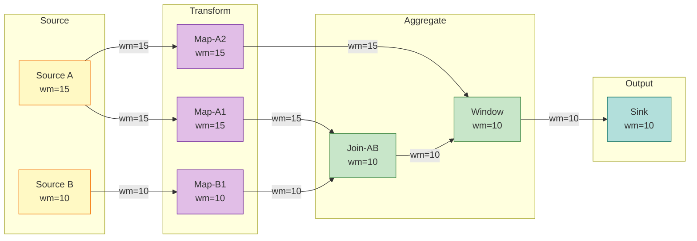

# Watermark Monotonicity Theorem

> Stage: Struct/02-properties | Prerequisites: [01.04-dataflow-model-formalization.md](../Struct/01-foundation/01.04-dataflow-model-formalization.md) | Formalization Level: L5

---

## Table of Contents

- [Watermark Monotonicity Theorem](#watermark-monotonicity-theorem)
  - [Table of Contents](#table-of-contents)
  - [1. Definitions](#1-definitions)
    - [Def-S-09-01 (Event Time)](#def-s-09-01-event-time)
    - [Def-S-09-02 (Watermark)](#def-s-09-02-watermark)
    - [Late Data](#late-data)
    - [Window Trigger](#window-trigger)
  - [2. Properties](#2-properties)
    - [Lemma-S-09-01 (Minimum Preserves Monotonicity)](#lemma-s-09-01-minimum-preserves-monotonicity)
  - [3. Relations](#3-relations)
    - [Relation 1: Watermark Monotonicity and Dataflow Model Formalization](#relation-1-watermark-monotonicity-and-dataflow-model-formalization)
    - [Relation 2: Watermark Monotonicity and Kahn Process Network Partial Order](#relation-2-watermark-monotonicity-and-kahn-process-network-partial-order)
    - [Relation 3: Watermark Monotonicity and Checkpoint Consistency](#relation-3-watermark-monotonicity-and-checkpoint-consistency)
  - [4. Argumentation](#4-argumentation)
    - [4.1 Partial-Order Induction Framework Based on Stream Prefixes](#41-partial-order-induction-framework-based-on-stream-prefixes)
    - [4.2 Boundary Discussion on Idle Sources and Watermark Progression](#42-boundary-discussion-on-idle-sources-and-watermark-progression)
    - [4.3 Counterexample Construction Violating Monotonicity](#43-counterexample-construction-violating-monotonicity)
  - [5. Proof / Engineering Argument](#5-proof--engineering-argument)
    - [Thm-S-09-01 (Watermark Monotonicity Theorem)](#thm-s-09-01-watermark-monotonicity-theorem)
    - [Step 1: Base Case — Source Operator Watermark Monotonicity](#step-1-base-case--source-operator-watermark-monotonicity)
    - [Step 2: Inductive Hypothesis](#step-2-inductive-hypothesis)
    - [Step 3: Inductive Step — Monotonicity Preservation for the $k$-th Operator](#step-3-inductive-step--monotonicity-preservation-for-the-k-th-operator)
      - [Case A: Single-Input Single-Output Operators (Map, Filter, FlatMap, etc.)](#case-a-single-input-single-output-operators-map-filter-flatmap-etc)
      - [Case B: Multi-Input Single-Output Operators (Join, Union, CoGroup, etc.)](#case-b-multi-input-single-output-operators-join-union-cogroup-etc)
    - [Step 4: Conclusion](#step-4-conclusion)
    - [Corollaries](#corollaries)
  - [6. Examples](#6-examples)
    - [Example 6.1: Monotonic Watermark Progression in a Three-Operator DAG](#example-61-monotonic-watermark-progression-in-a-three-operator-dag)
    - [Counterexample 6.2: Non-Monotonic Watermark Causes Repeated Window Triggering](#counterexample-62-non-monotonic-watermark-causes-repeated-window-triggering)
  - [7. Visualizations](#7-visualizations)
  - [8. References](#8-references)

## 1. Definitions

This section establishes a rigorous formal foundation for the Watermark Monotonicity Theorem. All definitions are based on event-time semantics and directly serve the subsequent lemma derivations and theorem proofs.

### Def-S-09-01 (Event Time)

Let $\text{Record}$ be the set of all possible records in the stream, and $\mathbb{T} = \mathbb{R}_{\geq 0}$ be the time domain. Event time is a mapping from records to the time domain:

$$
t_e: \text{Record} \to \mathbb{T}
$$

For any record $r \in \text{Record}$, $t_e(r)$ denotes the timestamp at which the record was generated in the business logic. It is attached by the data source when the record is created and cannot be modified by the stream processing system in subsequent processing.

**Intuitive Explanation**: Event time is the "business occurrence time" carried by the data itself, completely decoupled from when the data arrives at the system or when it is processed. It is the only reliable time basis for ensuring deterministic results on out-of-order streams [^1][^3].

**Motivation for Definition**: In distributed environments, network latency, backpressure, and retransmission cause the physical arrival order of records to differ from their event-time order. Event time decouples computation semantics from physical transmission and is a necessary prerequisite for stream processing correctness.

---

### Def-S-09-02 (Watermark)

A Watermark is a special progress indicator injected by the stream processing system into the data flow, formalized as a monotonic function from the data stream to the time domain:

$$
wm: \text{Stream} \to \mathbb{T} \cup \{+\infty\}
$$

Let the currently observed watermark value be $w$. Its semantic assertion is:

$$
\forall r \in \text{Stream}_{\text{future}}. \; t_e(r) \geq w \lor \text{Late}(r, w)
$$

That is: all records with event time strictly less than $w$ have either already arrived and been processed, or have been classified as "late" by the system and are no longer accepted by the target window.

**Watermark Generation Strategy**: At the Source side, the most common periodic generation strategy is

$$
wm(t) = \max_{r \in \text{Observed}(t)} t_e(r) - \delta
$$

where $\delta \geq 0$ is the maximum out-of-orderness tolerated by the system, and $\text{Observed}(t)$ denotes the set of all records received by the Source up to processing time $t$.

**Intuitive Explanation**: A Watermark is a "progress signal" issued by the system, telling downstream operators that "data with event time less than or equal to the current Watermark will not arrive normally anymore" [^1][^2].

**Motivation for Definition**: On an unbounded stream, the system can never be certain whether "even older data might still arrive." Watermark introduces a bounded uncertainty assumption, transforming infinite waiting into a decidable progress mechanism, so that windows can trigger and output results within finite latency.

---

### Late Data

Given a configured allowed lateness parameter $L \geq 0$, the "late" classification predicate for a record $r$ relative to the current watermark $w$ is defined as:

$$
\text{Late}(r, w) \iff t_e(r) \leq w - L
$$

When $L = 0$, the condition simplifies to $t_e(r) \leq w$. When $L > 0$, the system retains a grace period after the watermark passes the window end time, allowing records with event times in the range $[w-L, w]$ to be re-incorporated into window computation [^2][^3].

---

### Window Trigger

Let window $W$ be a left-closed, right-open interval on the event-time axis $W = [t_{\text{start}}, t_{\text{end}}) \subseteq \mathbb{T}$. The Watermark-based window trigger $Tr$ is the predicate that decides when a window transitions from the "active" state to the "emit-ready" state:

$$
Tr(W, w) \in \{\text{FIRE}, \text{CONTINUE}\}
$$

Its formal definition is:

$$
Tr(W, w) = \text{FIRE} \iff w \geq t_{\text{end}}(W) + L
$$

where $L$ is the allowed lateness parameter. The trigger depends only on the current watermark value $w$ and the window's own end time $t_{\text{end}}(W)$, and is independent of processing time and arrival order.

**Intuitive Explanation**: The trigger is the "alarm clock" for the window, determining when the system sends the aggregated results within the window downstream. Watermark monotonicity guarantees that this "alarm" only rings once, thereby ensuring result uniqueness [^1][^3].

---

## 2. Properties

### Lemma-S-09-01 (Minimum Preserves Monotonicity)

Let $A^{(1)}, A^{(2)}, \ldots, A^{(n)}$ be $n$ monotonically non-decreasing sequences, where $A^{(i)} = \langle a^{(i)}_1, a^{(i)}_2, \ldots \rangle$ satisfies $\forall k: a^{(i)}_k \leq a^{(i)}_{k+1}$. Define sequence $C = \langle c_1, c_2, \ldots \rangle$ as:

$$
c_k = \min_{1 \leq i \leq n} a^{(i)}_k
$$

Then $C$ is also a monotonically non-decreasing sequence, i.e., $\forall k: c_k \leq c_{k+1}$.

**Proof**:

For any moments $k$ and $k+1$:

1. By assumption, each input sequence is monotonically non-decreasing, so $\forall i: a^{(i)}_k \leq a^{(i)}_{k+1}$.
2. Consider $c_k = \min_i a^{(i)}_k$. Without loss of generality, let this minimum be attained at some index $j$, i.e., $c_k = a^{(j)}_k$.
3. Then $c_k = a^{(j)}_k \leq a^{(j)}_{k+1}$.
4. And $c_{k+1} = \min_i a^{(i)}_{k+1} \leq a^{(j)}_{k+1}$.
5. Combining steps 3 and 4, we obtain $c_k \leq c_{k+1}$.

By the arbitrariness of $k$, $C$ is monotonically non-decreasing. ∎

**Semantic Explanation**: In Flink and other multi-input operators, the output Watermark is typically the minimum of all input Watermarks. This lemma guarantees that even when multiple upstream streams progress asynchronously, the minimum operation itself does not destroy Watermark monotonicity.

---

## 3. Relations

### Relation 1: Watermark Monotonicity and Dataflow Model Formalization

The Watermark Monotonicity Theorem in this document is a rigorous refinement and independent proof of **Def-S-04-04** and **Lemma-S-04-02** in [01.04-dataflow-model-formalization.md](../Struct/01-foundation/01.04-dataflow-model-formalization.md).

- **Encoding Existence**: Def-S-04-04 defines Watermark as a progress indicator $w: \text{Stream} \to \mathbb{T} \cup \{+\infty\}$. Def-S-09-02 in this document explicitly introduces the late-data predicate and allowed-lateness parameter on this basis, making the semantic assertion more complete.
- **Separation Result**: Lemma-S-04-02 derives the monotonic non-decreasing property of Watermark in the Dataflow graph via topological-order induction. Thm-S-09-01 in this document further provides a **stream-prefix-based inductive proof** for Source operators, elevating the monotonicity guarantee to formalization level L5.

> **Inference [Model→Property]**: The Watermark semantic constraints in the Dataflow model (Def-S-04-04), together with operator local determinism (Lemma-S-04-01), jointly imply global Watermark monotonicity (Thm-S-09-01), and global monotonicity is in turn one of the key premises of **Thm-S-04-01** (Dataflow Determinism Theorem).

### Relation 2: Watermark Monotonicity and Kahn Process Network Partial Order

**Argument**:

The determinism of Kahn Process Networks (KPN) is built on FIFO channels and continuous process functions. After the Dataflow model introduces the event-time partial order, the physical arrival order may be inconsistent with the event-time partial order. Watermark monotonicity can be regarded as a **scalar lower-bound synchronization mechanism** on the event-time partial order, explicitly transforming the partial-order progression on infinite streams into a monotonically non-decreasing scalar sequence.

Therefore, Watermark monotonicity is a necessary extension of KPN deterministic semantics to stream processing scenarios that **allow finite out-of-orderness**. Without the monotonicity guarantee, window trigger timing would depend on the specific timing of out-of-order arrivals, thereby destroying result determinism.

### Relation 3: Watermark Monotonicity and Checkpoint Consistency

**Argument**:

Flink's Checkpoint mechanism is based on the Chandy-Lamport distributed snapshot algorithm. In the snapshot, each operator must persist its current Watermark $w_{\text{checkpointed}}$, and upon recovery $w_{\text{recovered}} = w_{\text{checkpointed}}$.

If the recovered Watermark could restart from a value smaller than $w_{\text{checkpointed}}$, already triggered windows might trigger again, causing duplicate output and violating Exactly-Once semantics. Therefore, Checkpoint consistency requires that Watermark monotonicity must be **persisted into the checkpoint state** [^2][^3].

---

## 4. Argumentation

This section provides auxiliary lemmas, counterexample analysis, and boundary discussions to prepare for the rigorous proof of the Watermark Monotonicity Theorem.

### 4.1 Partial-Order Induction Framework Based on Stream Prefixes

Let $R(t) \subseteq \text{Record}$ be the set of records observed by Source $s$ before processing time $t$. Since the system continuously receives new data, $R(t)$ expands monotonically with time: $t_1 < t_2 \implies R(t_1) \subseteq R(t_2)$. For the periodic Watermark generation strategy $\wm_s(t) = \max_{r \in R(t)} t_e(r) - \delta$, the function $g(R) = \max_{r \in R} t_e(r)$ is monotonic with respect to set inclusion. Therefore, $\wm_s(t)$ is monotonically non-decreasing with respect to processing time $t$. This observation constitutes the core of the "base case" in the subsequent theorem proof — we will prove the monotonicity of Source Watermark by induction on stream prefixes.

### 4.2 Boundary Discussion on Idle Sources and Watermark Progression

In multi-input operators, the output Watermark is typically defined as the minimum of all active input Watermarks: $\wm_{\text{out}}(t) = \min_{j \in \text{Active}(t)} \wm_{\text{in}_j}(t)$. If an input source $k$ produces no output during the interval $[t_0, t_0 + \Delta]$, the system may mark it as idle and remove it from the minimum computation.

**Boundary Analysis**:

- If idle sources are not removed, their stagnant Watermarks propagate through the minimum operation and block progress for the entire DAG, causing the watermark to remain unchanged for a long time and preventing downstream windows from triggering.
- As long as the active input Watermarks are monotonically non-decreasing, Lemma-S-09-01 still applies. Therefore, the idle-source mechanism is a necessary compensation strategy to **prevent global progress from being dragged down by local silence**, and it does not destroy the monotonicity guarantee.

### 4.3 Counterexample Construction Violating Monotonicity

**Counterexample**: Suppose an operator incorrectly implements Watermark propagation logic, making its output Watermark equal to the input Watermark minus a random perturbation $\epsilon(t) > 0$: $\wm_{\text{out}}(t) = \wm_{\text{in}}(t) - \epsilon(t)$.

Consider $t_1 < t_2$: the input watermark increases from 10 to 12; if $\epsilon(t_1)=1, \epsilon(t_2)=5$, then the output watermark drops from 9 to 7, and monotonicity is violated.

**Consequences**: When the Watermark regresses, downstream windows may have already triggered output for $[0, 9)$ based on $w=9$. If the Watermark falls back to $w=7$, the system either retriggers the window causing duplicate output (violating Exactly-Once), or ignores the regression leading to a contradiction between the semantic assertion and the already triggered window. Therefore, monotonic non-decreasing Watermark is a **core invariant** for stream processing system state consistency [^1][^2].

---

## 5. Proof / Engineering Argument

### Thm-S-09-01 (Watermark Monotonicity Theorem)

Let $\mathcal{G} = (V, E, P, \Sigma, \mathbb{T})$ be a Dataflow directed acyclic graph using event-time semantics (satisfying all constraints of Def-S-04-01 in [01.04-dataflow-model-formalization.md](../Struct/01-foundation/01.04-dataflow-model-formalization.md)). For any operator $v \in V$ in the graph, let its output Watermark sequence be $\{w_v(t)\}_{t \in \mathbb{T}}$ (where $t$ is processing time or a discrete stream prefix index); then this sequence satisfies monotonic non-decreasing:

$$
\forall v \in V, \; \forall t_1 \leq t_2: \quad w_v(t_1) \leq w_v(t_2)
$$

That is: **Watermarks generated by Sources are monotonically non-decreasing, and this property is preserved after flowing through any operator.**

---

**Proof**:

We use **structural induction** on the topological order of Dataflow graph $\mathcal{G}$. Let $v_1, v_2, \ldots, v_{|V|}$ be a topological order of $\mathcal{G}$ (guaranteed to exist by the acyclicity of Def-S-04-01).

### Step 1: Base Case — Source Operator Watermark Monotonicity

Consider any Source operator $s \in V_{\text{src}}$. Let $R_s(t)$ be the set of records observed by Source $s$ up to processing time $t$. According to Def-S-09-02, the periodic Watermark generation strategy for the Source is $w_s(t) = \max_{r \in R_s(t)} t_e(r) - \delta_s$, where $\delta_s \geq 0$ is a fixed maximum out-of-orderness tolerance parameter.

**Induction on stream prefixes**:

- **Base Case**: When $t = t_0$ (system startup time), $R_s(t_0) = \emptyset$, $w_s(t_0) = -\infty$. For any $t \geq t_0$, $w_s(t) \geq w_s(t_0)$ obviously holds.
- **Inductive Step**: Suppose monotonicity holds at time $t$. Consider the newly received record set $\Delta R = R_s(t+\Delta t) \setminus R_s(t)$.
  - If $\Delta R = \emptyset$, then $w_s(t+\Delta t) = w_s(t)$.
  - If $\Delta R \neq \emptyset$, then $\max_{r \in R_s(t+\Delta t)} t_e(r) \geq \max_{r \in R_s(t)} t_e(r)$; subtracting $\delta_s$ from both sides yields $w_s(t+\Delta t) \geq w_s(t)$.

By induction, the Watermark sequence of Source operators is monotonically non-decreasing. ∎(Base Case)

### Step 2: Inductive Hypothesis

Assume that for the first $k-1$ operators $v_1, v_2, \ldots, v_{k-1}$ in the topological order, their output Watermarks all satisfy the monotonic non-decreasing property. That is,

$$
\forall j < k, \; \forall t_1 \leq t_2: \quad w_{v_j}(t_1) \leq w_{v_j}(t_2)
$$

### Step 3: Inductive Step — Monotonicity Preservation for the $k$-th Operator

Consider the $k$-th operator $v_k$. According to operator type, we discuss two cases.

#### Case A: Single-Input Single-Output Operators (Map, Filter, FlatMap, etc.)

Let the unique upstream input of $v_k$ be $u$. According to Def-S-04-02, such operators do not reorder records in time; the propagation rule is $w_{v_k}(t) = w_u(t) - d_{\text{proc}}$, where $d_{\text{proc}} \geq 0$ is a fixed processing delay.

By the inductive hypothesis, $w_u(t)$ is monotonically non-decreasing. For any $t_1 \leq t_2$: $w_u(t_1) \leq w_u(t_2) \implies w_{v_k}(t_1) \leq w_{v_k}(t_2)$.

Therefore, single-input operators preserve Watermark monotonicity. ∎(Case A)

#### Case B: Multi-Input Single-Output Operators (Join, Union, CoGroup, etc.)

Let $v_k$ have $m \geq 2$ upstream inputs $u_1, \ldots, u_m$. According to Def-S-04-04, the output Watermark of a multi-input operator is the minimum of all inputs: $w_{v_k}(t) = \min_i w_{u_i}(t)$.

By the inductive hypothesis, each $w_{u_i}(t)$ is monotonically non-decreasing. According to **Lemma-S-09-01**, $w_{v_k}(t)$ is also a monotonically non-decreasing sequence. ∎(Case B)

### Step 4: Conclusion

By mathematical induction, for every operator $v_k$ in the topological order, its output Watermark is monotonically non-decreasing. Therefore:

$$
\boxed{\forall v \in V, \; \forall t_1 \leq t_2: \quad w_v(t_1) \leq w_v(t_2)}
$$

∎

---

### Corollaries

The following important conclusions follow directly from Thm-S-09-01:

**Corollary 1 (Window Trigger Uniqueness)**: If window $W$ triggers based on Watermark ($\text{Trigger}(W, w) = \text{FIRE} \iff w \geq t_{\text{end}}(W) + L$), then after the window first triggers, it will not re-trigger the first output for the same window due to further Watermark progression.

*Proof*: Let the window first trigger at $w_k$; then $w_k \geq t_{\text{end}}(W) + L$. By Thm-S-09-01, for all subsequent watermarks $w_j$ ($j > k$), we have $w_j \geq w_k \geq t_{\text{end}}(W) + L$. Once the trigger condition is satisfied, it remains permanently true, and the same window result will not be output again as a "first trigger." ∎

**Corollary 2 (Result Completeness)**: If Watermark $w$ satisfies the completeness assertion (Def-S-09-02), and window $W$ triggers when $w \geq t_{\text{end}}(W) + L$, then the window result contains all records whose event times fall within $W$ and have not been classified as late.

*Proof*: For any record $r$ satisfying $t_{\text{start}}(W) \leq t_e(r) < t_{\text{end}}(W) \leq w$. By the Watermark assertion, $t_e(r) < w$ implies that $r$ has already arrived or has been classified as late. If $r$ has not been classified as late, it has already been assigned to window $W$ and participated in the aggregation computation. ∎

**Corollary 3 (Checkpoint Recovery Safety)**: Under Flink's Checkpoint mechanism, the recovered Watermark will not regress; therefore, already triggered windows will not be output again repeatedly, and Exactly-Once semantics are preserved [^2][^3].

---

## 6. Examples

### Example 6.1: Monotonic Watermark Progression in a Three-Operator DAG

Consider a simplified event-time stream processing job whose Dataflow graph contains Source-1 ($S_1$), Map-1 ($M_1$), and Window-Aggregate-1 ($W_1$). The Source uses a periodic Watermark strategy with $\delta = 2$ seconds; Map passes through the Watermark unchanged; Window is a tumbling window $[0, 10)$ with $L = 0$.

| $t$ | Record | $t_e$ | $\max t_e$ | $w_{S_1}$ | $w_{M_1}$ | State |
|----|--------|-------|------------|-----------|-----------|-------|
| 0 | $r_1$ | 3 | 3 | 1 | 1 | [0,10) accumulating |
| 1 | $r_2$ | 5 | 5 | 3 | 3 | [0,10) accumulating |
| 2 | $r_3$ | 7 | 7 | 5 | 5 | [0,10) accumulating |
| 3 | $r_4$ | 4 | 7 | 5 | 5 | [0,10) accumulating (out-of-order arrival but no regression) |
| 4 | $r_5$ | 9 | 9 | 7 | 7 | [0,10) accumulating |
| 5 | $r_6$ | 11 | 11 | 9 | 9 | [0,10) not triggered |
| 6 | $r_7$ | 12 | 12 | 10 | 10 | **[0,10) triggers** |

**Analysis**: At $t=3$, $r_4$ arrives out of order, but $\max t_e$ remains 7, and the Watermark does not regress, demonstrating monotonicity. At $t=6$, $w=10$ first satisfies the trigger condition, and the window outputs its result. By Thm-S-09-01, subsequent Watermarks will not fall below 10, so the window will not re-trigger.

### Counterexample 6.2: Non-Monotonic Watermark Causes Repeated Window Triggering

Suppose a developer incorrectly sets the output Watermark in a custom `ProcessFunction` to the current record's event time minus a random value:

```java
// [Pseudocode snippet - not directly runnable] Core logic demonstration only
// Erroneous implementation example
public void onWatermark(Watermark wm, Context ctx, Collector<Out> out) {
    long randomDelay = (long)(Math.random() * 5);
    ctx.emitWatermark(new Watermark(currentElementTimestamp - randomDelay));
}
```

| Step | Upstream $w$ | Element $t_e$ | Random Delay | Output $w$ | Consequence |
|------|-------------|---------------|--------------|-----------|-------------|
| 1 | 10 | 12 | 2 | 10 | Window [0,10) triggers |
| 2 | 11 | 13 | 4 | 9 | **Watermark regresses!** |
| 3 | 12 | 14 | 1 | 13 | May re-trigger |

**Analysis**: In step 2, the Watermark regresses from 10 to 9, causing the state of the already triggered window to contradict the progress indicator semantics. In step 3, if the system does not defend against re-triggering, Exactly-Once semantics are violated. Therefore, any custom operator emitting Watermarks must guarantee that the output value is not less than the maximum value previously emitted [^2][^3].

---

## 7. Visualizations

The following diagram illustrates Watermark propagation in a typical Dataflow DAG. Yellow nodes are Sources, purple are Maps, green are Join/Window, and cyan is Sink.



**Figure Description**: Source A has Watermark 15, and Source B has Watermark 10. Map operators pass through the input Watermark unchanged. Join-AB, as a multi-input operator, outputs Watermark equal to the minimum $\min(15, 10) = 10$. After receiving multiple inputs, the Window operator also converges to 10. The Sink receives Watermark 10, indicating that records with event time $\leq 10$ have been completely processed. This figure intuitively demonstrates the engineering realization of **Thm-S-09-01**: although different branches in the DAG progress at different rates, the local Watermark sequence at each node remains monotonically non-decreasing.

---

## 8. References

[^1]: T. Akidau et al., "The Dataflow Model: A Practical Approach to Balancing Correctness, Latency, and Cost in Massive-Scale, Unbounded, Out-of-Order Data Processing," *PVLDB*, 8(12), 2015.

[^2]: Apache Flink Documentation, "Event Time and Watermarks," 2025. <https://nightlies.apache.org/flink/flink-docs-stable/docs/concepts/time/>

[^3]: P. Carbone et al., "Apache Flink: Stream and Batch Processing in a Single Engine," *IEEE Data Engineering Bulletin*, 38(4), 2015.

---

*Document version: v1.0 | Translation date: 2026-04-24*
