# Window Concepts

> **Stage**: Knowledge/01-concept-atlas | **Prerequisites**: [Time Semantics](time-semantics.md) | **Formalization Level**: L3-L4
> **Translation Date**: 2026-04-21

## Abstract

Windows partition infinite data streams into finite chunks for computation. This document formalizes window types, trigger conditions, eviction policies, and their relationships to watermark semantics and late data handling.

---

## 1. Definitions

### Def-K-03-01 (Window)

A **window** is a finite subset of a data stream, partitioning the infinite stream into computable chunks:

$$W: S \to 2^S, \quad W(S) = \{ w_1, w_2, \ldots, w_n \}$$

Each window $w_i$ satisfies:

- **Finiteness**: $|w_i| < \infty$ (time-based) or explicit count limit
- **Disjoint or Overlapping**: depending on window type
- **Coverage**: $\bigcup_i w_i \subseteq S$ (for arrived data)

### Def-K-03-02 (Time Window)

A **time window** is an interval in event time domain $\mathbb{T}$:

$$\text{win}_{time} = [t_{start}, t_{end}) \subseteq \mathbb{T}$$

Events in the window:

$$\text{Events}(\text{win}_{time}) = \{ e \in S \mid t_{event}(e) \in [t_{start}, t_{end}) \}$$

### Def-K-03-03 (Count Window)

A **count window** is based on element count:

$$\text{win}_{count} = \{ e_i \in S \mid i \in [n \cdot N, (n+1) \cdot N) \}$$

where $N$ is the window size (element count) and $n$ is the window index.

### Def-K-03-04 (Tumbling Window)

**Tumbling windows** divide the time axis into fixed, non-overlapping, contiguous intervals:

$$\text{win}_{tumbling}(k) = [k \cdot \Delta t, (k+1) \cdot \Delta t), \quad k \in \mathbb{N}$$

**Disjointness**: $\forall i \neq j: \text{win}_{tumbling}(i) \cap \text{win}_{tumbling}(j) = \emptyset$

### Def-K-03-05 (Sliding Window)

**Sliding windows** advance by a fixed step, with potential overlap:

$$\text{win}_{sliding}(k) = [k \cdot \Delta s, k \cdot \Delta s + \Delta w), \quad k \in \mathbb{N}$$

where $\Delta s$ is the slide step and $\Delta w$ is the window size.

**Overlap condition**: $\Delta s < \Delta w$

### Def-K-03-06 (Session Window)

**Session windows** dynamically group events by activity gaps:

$$\text{win}_{session} = [t_{first}, t_{last} + \Delta g)$$

where $\Delta g$ is the session gap. A new session starts when the gap between consecutive events exceeds $\Delta g$.

### Def-K-03-07 (Trigger)

A **trigger** determines when a window's results are emitted:

$$\text{Trigger}: \text{Window} \times \text{Watermark} \times \text{Element} \to \{\text{FIRE}, \text{CONTINUE}, \text{PURGE}\}$$

### Def-K-03-08 (Allowed Lateness)

**Allowed lateness** specifies how late data is still processed:

$$\text{AllowedLateness} = \Delta l \geq 0$$

A window with end time $t_{end}$ accepts data with event time $t_e$ where:

$$t_e < t_{end} + \Delta l$$

---

## 2. Properties

### Lemma-K-03-01 (Tumbling Window Completeness)

For tumbling windows with size $\Delta t$, every event with timestamp $t_e$ belongs to exactly one window:

$$\exists! k: t_e \in \text{win}_{tumbling}(k)$$

**Proof.** $k = \lfloor t_e / \Delta t \rfloor$ uniquely identifies the window. ∎

### Lemma-K-03-02 (Sliding Window Count Bound)

An event belongs to at most $\lceil \Delta w / \Delta s \rceil$ sliding windows.

**Proof.** Each event "participates" in windows whose start times fall within $[t_e - \Delta w, t_e]$. The number of such windows is bounded by the ratio of window size to slide step. ∎

---

## 3. Window Types Comparison

| Type | Trigger | Use Case | Overlap |
|------|---------|----------|---------|
| Tumbling | Time / Count | Periodic aggregations | None |
| Sliding | Time / Count | Moving averages | Yes |
| Session | Gap timeout | User behavior analysis | Dynamic |
| Global | Special | Full-stream computations | All data |

---

## 4. Late Data Handling

### 4.1 Watermark + Allowed Lateness

```
Window [0, 10):
  - Watermark reaches 10 → FIRE (first result)
  - Watermark reaches 10 + Δl → PURGE (window state cleaned)
  - Data with t_e < 10 arriving between watermark 10 and 10+Δl: processed, result UPDATED
  - Data with t_e < 10 arriving after watermark 10+Δl: DROPPED (or sent to side output)
```

### 4.2 Side Output for Late Data

```java
// Flink: Route late data to side output
OutputTag<Event> lateDataTag = new OutputTag<Event>("late-data"){};

WindowedStream<Event, Key, TimeWindow> windowed = stream
    .keyBy(Event::getKey)
    .window(TumblingEventTimeWindows.of(Time.minutes(5)))
    .allowedLateness(Time.minutes(2))
    .sideOutputLateData(lateDataTag);

// Collect late data
DataStream<Event> lateData = windowed.getSideOutput(lateDataTag);
```

---

## 5. Visualizations

```mermaid
gantt
    title Window Types Timeline
    dateFormat X
    axisFormat %s

    section Tumbling
    Window 1 : 0, 10
    Window 2 : 10, 20
    Window 3 : 20, 30

    section Sliding
    Window 1 : 0, 15
    Window 2 : 5, 20
    Window 3 : 10, 25

    section Session
    Session A : 0, 12
    Session B : 15, 28
```



**Tumbling windows**: disjoint, fixed-size. **Sliding windows**: overlapping, fixed-size with step. **Session windows**: dynamic, gap-based.

---

## 6. References
