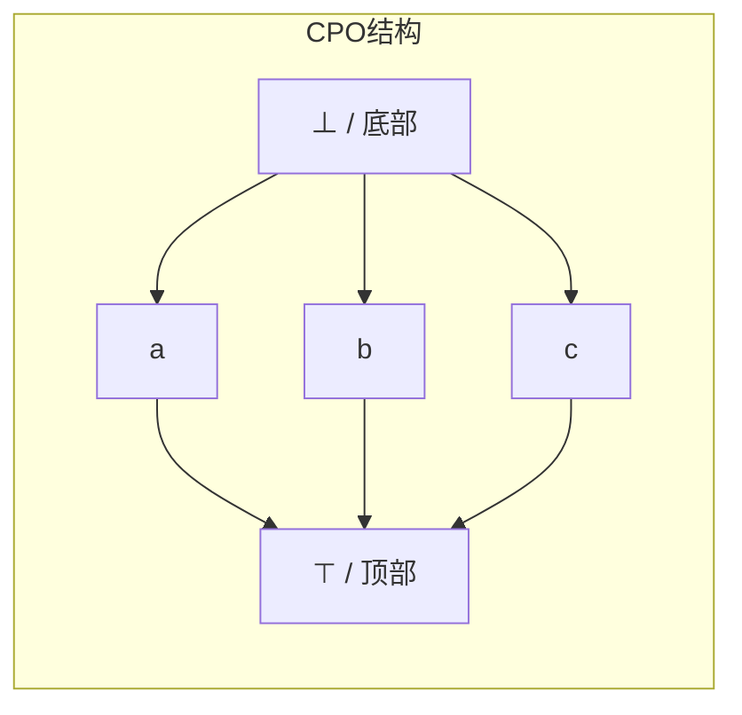
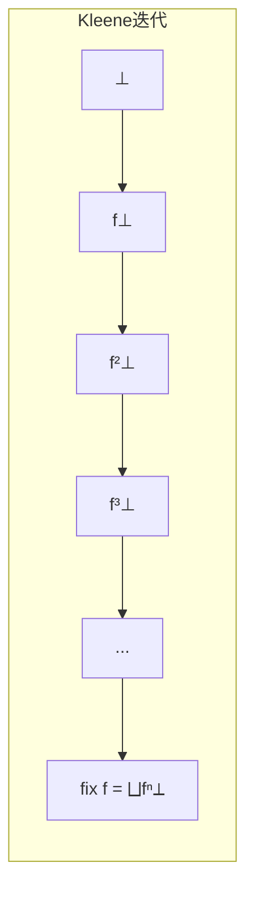
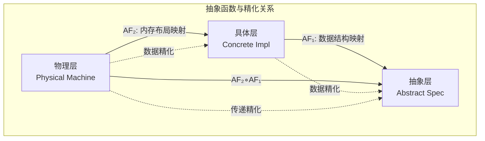
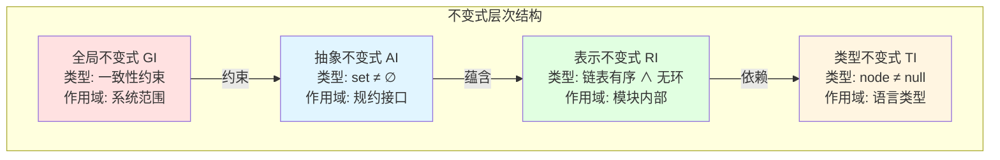
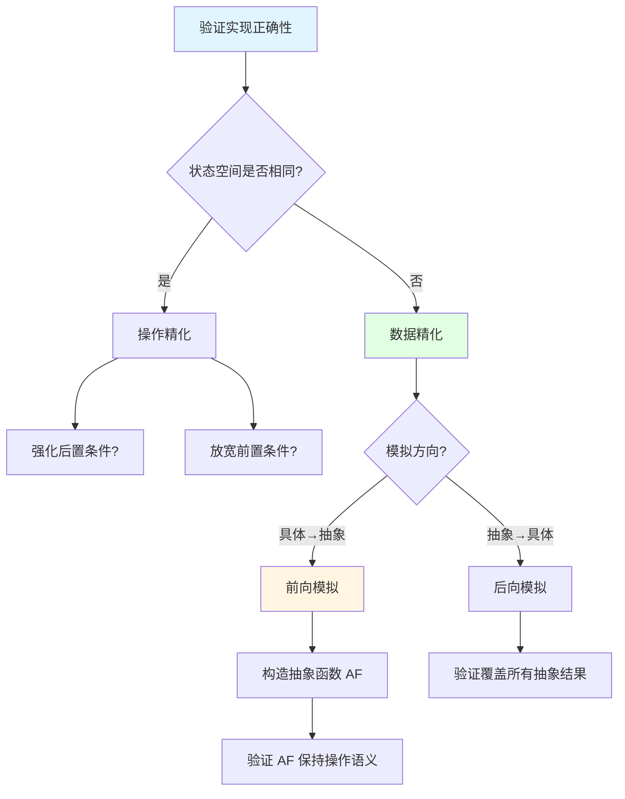

# 序理论 (Order Theory)

> **所属单元**: 01-foundations | **前置依赖**: 无 | **形式化等级**: L1

## 1. 概念定义

### 1.1 偏序集 (Partially Ordered Set, Poset)

**Def-F-01-01: 偏序集**

偏序集是一个二元组 $(D, \sqsubseteq)$，其中 $D$ 是集合，$\sqsubseteq$ 是 $D$ 上的二元关系，满足：

1. **自反性**: $\forall x \in D, x \sqsubseteq x$
2. **反对称性**: $\forall x, y \in D, x \sqsubseteq y \land y \sqsubseteq x \Rightarrow x = y$
3. **传递性**: $\forall x, y, z \in D, x \sqsubseteq y \land y \sqsubseteq z \Rightarrow x \sqsubseteq z$

### 1.2 完全偏序 (Complete Partial Order, CPO)

**Def-F-01-02: 完全偏序 (CPO)**

完全偏序 $(D, \sqsubseteq)$ 是一个偏序集，满足：

1. **有底元**: 存在 $\bot \in D$，使得 $\forall x \in D, \bot \sqsubseteq x$
2. **定向完备**: 每个定向子集 $S \subseteq D$ 都有最小上界 (LUB) $\bigsqcup S$

其中，子集 $S$ 是**定向的**当且仅当：
$$\forall x, y \in S, \exists z \in S: x \sqsubseteq z \land y \sqsubseteq z$$

### 1.3 链与完全格

**Def-F-01-03: 链 (Chain)**

链是偏序集中全序的子集，即 $C \subseteq D$ 满足：
$$\forall x, y \in C: x \sqsubseteq y \lor y \sqsubseteq x$$

**Def-F-01-04: 完全格 (Complete Lattice)**

完全格是偏序集 $(L, \sqsubseteq)$，其中每个子集 $S \subseteq L$ 都有最小上界和最大下界。

### 1.4 抽象函数 (Abstraction Function) — MIT 6.826核心

**Def-F-01-05: 抽象函数 (Abstraction Function, AF)**

抽象函数是从具体状态空间到抽象状态空间的映射：

$$AF: ConcreteState \to AbstractState$$

其中：

- $ConcreteState$ 是实现层面的状态集合
- $AbstractState$ 是规约层面的状态集合
- $AF$ 通常是多对一的满射（多个具体状态映射到同一抽象状态）

**性质**：

- **确定性**: 每个具体状态对应唯一的抽象状态
- **可满足性**: 抽象状态 captures 具体状态的核心语义

**在规约和验证中的应用**：

抽象函数是连接实现与规约的桥梁，用于证明实现的正确性：

1. **表示暴露 (Representation Exposure)**: 通过 AF 检测实现是否泄露内部细节
2. **操作正确性**: 证明具体操作在 AF 下保持规约语义
3. **等价类划分**: 将具体状态划分为行为等价的抽象等价类

**与 Galois 连接的关系**：

抽象函数与 Galois 连接形成对偶框架：

| 概念 | 方向 | 作用 |
|------|------|------|
| $AF: C \to A$ | 具体 → 抽象 | 信息压缩，保留关键性质 |
| $\gamma: A \to C$ (concretization) | 抽象 → 具体 | 解释抽象为具体集合 |
| $(\alpha, \gamma)$ 形成 Galois 连接 | 双向 | 保证抽象与具体的一致性 |

**Def-F-01-06: Galois 连接**

给定偏序集 $(C, \sqsubseteq_C)$ 和 $(A, \sqsubseteq_A)$，函数对 $(\alpha, \gamma)$ 形成 Galois 连接，记作 $C \xleftarrow{\gamma}{\xrightarrow{\alpha}} A$，当且仅当：

$$\forall c \in C, a \in A: \alpha(c) \sqsubseteq_A a \Leftrightarrow c \sqsubseteq_C \gamma(a)$$

其中 $\alpha = AF$ 是抽象函数，$\gamma$ 是具体化函数。

### 1.5 不变式 (Invariants) — MIT 6.826核心

不变式是程序执行过程中始终保持的性质，是模块化验证的基础。

**Def-F-01-07: 表示不变式 (Representation Invariant, RI)**

表示不变式是具体状态上的谓词，刻画了合法表示状态：

$$RI: ConcreteState \to \{true, false\}$$

**作用**：

- 定义具体状态空间的有效子集
- 排除实现层面的非法/不一致状态
- 是证明操作保持性质的前提条件

**示例**：在集合的链表实现中，RI 可能要求：

- 链表无环
- 元素按特定顺序排列（即使抽象层不关心顺序）
- 无重复元素

**Def-F-01-08: 抽象不变式 (Abstract Invariant, AI)**

抽象不变式是抽象状态上的谓词，表达规约层面的性质：

$$AI: AbstractState \to \{true, false\}$$

**关系**：
$$RI(c) \land c \in dom(AF) \Rightarrow AI(AF(c))$$

即：满足表示不变式的具体状态，其抽象映射必然满足抽象不变式。

**Def-F-01-09: 不变式层级**

| 层级 | 名称 | 作用域 | 典型形式 |
|------|------|--------|----------|
| L1 | 类型不变式 | 编译期 | 类型检查约束 |
| L2 | 表示不变式 | 模块内部 | $RI(concrete)$ |
| L3 | 抽象不变式 | 抽象接口 | $AI(abstract)$ |
| L4 | 全局不变式 | 系统范围 | 一致性约束 |

### 1.6 精化关系 (Refinement) — MIT 6.826

精化是规约之间的偏序关系，表示 "更具体的实现"。

**Def-F-01-10: 规约精化 (Specification Refinement)**

规约 $S_2$ 精化规约 $S_1$，记作 $S_2 \sqsubseteq S_1$，当且仅当：

$$\forall \sigma, \sigma': S_2(\sigma, \sigma') \Rightarrow S_1(\sigma, \sigma')$$

其中 $S(\sigma, \sigma')$ 表示从状态 $\sigma$ 执行后到达 $\sigma'$ 满足规约 $S$。

**直觉**: $S_2$ 比 $S_1$ "更强"——$S_2$ 允许的行为是 $S_1$ 的子集。

**Def-F-01-11: 数据精化 (Data Refinement)**

给定抽象规约 $(AState, AOps)$ 和具体规约 $(CState, COps)$，数据精化通过抽象函数 $AF: CState \to AState$ 建立关系：

操作 $CO$ 数据精化操作 $AO$（在 $AF$ 下），当且仅当：

$$\forall c, c' \in CState: RI(c) \land CO(c, c') \Rightarrow AI(AF(c)) \land AO(AF(c), AF(c'))$$

**前向模拟 (Forward Simulation)**：

$$\forall c \in CState, a \in AState: RI(c) \land AF(c) = a \land CO(c, c')$$
$$\Rightarrow \exists a': AO(a, a') \land AF(c') = a' \land RI(c')$$

前向模拟验证：具体操作的每一步都能在抽象层找到对应。

**Def-F-01-12: 操作精化 (Operation Refinement)**

在同一状态空间上，操作 $OP_2$ 精化操作 $OP_1$：

$$pre(OP_1) \Rightarrow pre(OP_2) \quad \text{(前置条件放宽)}$$
$$pre(OP_1) \land OP_2(\sigma, \sigma') \Rightarrow OP_1(\sigma, \sigma') \quad \text{(后置条件强化)}$$

**Def-F-01-13: 后向模拟 (Backward Simulation)**

$$\forall c' \in CState, a' \in AState: RI(c') \land AF(c') = a' \land AO(a, a')$$
$$\Rightarrow \exists c: CO(c, c') \land AF(c) = a \land RI(c)$$

后向模拟验证：抽象操作的每个结果都能找到具体实现。

**定理**：若存在抽象函数 $AF$ 使得前向模拟成立，则数据精化关系成立。

## 2. 属性推导

### 2.1 单调性与连续性

**Def-F-01-14: 单调函数**

函数 $f: D \to E$ 是单调的，当且仅当：
$$x \sqsubseteq y \Rightarrow f(x) \sqsubseteq f(y)$$

**Def-F-01-15: 连续函数**

函数 $f: D \to E$ 是连续的，当且仅当：

1. $f$ 是单调的
2. 对所有定向集 $S$: $f(\bigsqcup S) = \bigsqcup f(S)$

**Lemma-F-01-01: 连续性蕴含单调性**

若 $f$ 连续，则 $f$ 单调。

*证明*: 设 $x \sqsubseteq y$，则 $\{x, y\}$ 是定向集，$\bigsqcup\{x,y\} = y$。由连续性：
$$f(y) = f(\bigsqcup\{x,y\}) = \bigsqcup\{f(x), f(y)\}$$
因此 $f(x) \sqsubseteq f(y)$。∎

### 2.2 精化关系的序性质

**Lemma-F-01-02: 精化的偏序性**

规约精化关系 $\sqsubseteq$ 构成偏序：

1. **自反**: $S \sqsubseteq S$ (每个规约精化自身)
2. **传递**: $S_3 \sqsubseteq S_2 \land S_2 \sqsubseteq S_1 \Rightarrow S_3 \sqsubseteq S_1$
3. **反对称**: $S_2 \sqsubseteq S_1 \land S_1 \sqsubseteq S_2 \Rightarrow S_1 = S_2$ (行为等价)

**Lemma-F-01-03: 精化与并/交**

设 $S_1 \sqsubseteq S$ 且 $S_2 \sqsubseteq S$，则 $S_1 \sqcap S_2 \sqsubseteq S$。

即：精化规约的 "交" 仍然是原规约的精化。

**Lemma-F-01-04: 抽象函数的单调性**

若 $c_1 \sqsubseteq_C c_2$，则 $AF(c_1) \sqsubseteq_A AF(c_2)$。

即：抽象函数保持序结构。

### 2.3 不变式保持的充分条件

**Lemma-F-01-05: 操作保持不变式**

若对操作 $Op$ 满足：
$$\forall c: RI(c) \land pre_{Op}(c) \Rightarrow RI(Op(c))$$

则 $RI$ 是操作 $Op$ 的不变式。

**Lemma-F-01-06: 归纳不变式**

要证明 $RI$ 是所有操作的不变式，只需证明：

1. **初始化**: $RI(Init)$
2. **保持性**: $\forall Op \in Ops: RI(c) \land pre_{Op}(c) \Rightarrow RI(Op(c))$

### 2.4 Galois 连接的性质

**Lemma-F-01-07: Galois 连接的基本性质**

若 $(\alpha, \gamma)$ 形成 Galois 连接，则：

1. $\alpha$ 单调且 $\gamma$ 单调
2. $\alpha \circ \gamma \sqsubseteq id_A$ (抽象-具体-抽象 ≤ 恒等)
3. $id_C \sqsubseteq \gamma \circ \alpha$ (恒等 ≤ 具体-抽象-具体)
4. $\alpha = \alpha \circ \gamma \circ \alpha$ (幂等性质)
5. $\gamma = \gamma \circ \alpha \circ \gamma$ (幂等性质)

## 3. 关系建立

### 3.1 与域论的关系

序理论是域论的基础。详细域论内容参见 [域论](../98-appendices/wikipedia-concepts/24-domain-theory.md)。在形式语义学中：

| 概念 | 语义解释 |
|------|----------|
| $\bot$ (底元) | 未定义/非终止计算 |
| $x \sqsubseteq y$ | $y$ 比 $x$ 有更多定义信息 |
| $\bigsqcup S$ | 信息的极限/并集 |
| 连续函数 | 可计算函数 |

### 3.2 在分布式系统中的应用

**Prop-F-01-01: Kahn语义中的序**

在Kahn进程网中，流的前缀序定义为：
$$s \sqsubseteq t \Leftrightarrow s \text{是} t \text{的前缀}$$

$(D^\omega, \sqsubseteq)$ 构成CPO，其中：

- $\bot = \langle\rangle$ (空序列)
- $\bigsqcup$ 对应流的极限

### 3.3 抽象函数与精化的统一框架

MIT 6.826 中，抽象函数和精化关系形成统一的验证框架：

```
实现层:     Concrete State ──COps──► Concrete State'
              │ AF                    │ AF
              ▼                       ▼
规约层:     Abstract State ──AOps──► Abstract State'
```

**Prop-F-01-02: 精化的组合性**

若 $S_2 \xrightarrow{AF_2} S_1$ 且 $S_3 \xrightarrow{AF_3} S_2$，则 $S_3 \xrightarrow{AF_2 \circ AF_3} S_1$。

即：精化关系可传递组合。

### 3.4 不变式与精化的关系

| 关系类型 | 定义 | 验证重点 |
|----------|------|----------|
| 数据精化 | 通过 $AF$ 连接不同状态空间 | 状态映射的一致性 |
| 操作精化 | 同一状态空间上的规约细化 | 前后置条件的强化 |
| 不变式保持 | 操作前后性质保持 | 归纳证明 |

## 4. 论证过程

### 4.1 为什么需要CPO？

分布式系统中的递归定义（如递归进程、流）需要数学基础来保证语义良定义。

**例**: 递归进程 $P = \text{in}(x).P$ 的语义是什么？

通过CPO上的不动点，可以给出严格定义。

### 4.2 证明不变式保持的技术

#### 4.2.1 结构归纳法

对于递归数据结构（如树、链表），使用结构归纳：

1. **基例**: 证明空结构满足不变式
2. **归纳步**: 假设子结构满足不变式，证明组合结构满足

#### 4.2.2 操作归纳法

对于状态转换系统：

1. **初始化**: 证明初始状态满足 $RI$
2. **归纳步**: 对每种操作 $Op$，证明 $RI(s) \Rightarrow RI(Op(s))$

#### 4.2.3 依赖图方法

对于复杂不变式，构建变量依赖图：

- 节点：状态变量
- 边：变量间的约束关系
- 环检测：识别循环依赖，确保约束可解

### 4.3 精化的判定策略

**策略1: 直接证明**

通过语义蕴含直接证明 $S_2 \Rightarrow S_1$。

**策略2: 模拟关系**

构造前向/后向模拟关系 $R \subseteq CState \times AState$，证明：

- 初始状态相关
- 操作保持相关性

**策略3: 抽象函数验证**

验证 $AF$ 满足：

1. $RI(c) \Rightarrow AI(AF(c))$
2. $CO(c, c') \land RI(c) \Rightarrow AO(AF(c), AF(c'))$

### 4.4 递归定义与CPO的关系

**Prop-F-01-03: 递归类型作为不动点**

递归类型 $\mu X.F(X)$ 定义为函数 $F$ 的最小不动点：

$$\mu X.F(X) = \text{fix}(\lambda X.F(X)) = \bigsqcup_{n \geq 0} F^n(\bot)$$

**直觉**: 递归类型是有限逼近的极限。

### 4.5 Scott拓扑基础

**Def-F-01-16: Scott拓扑**

CPO $(D, \sqsubseteq)$ 上的 Scott 拓扑由以下开集定义：

$U \subseteq D$ 是开集，当且仅当：

1. **上集**: $x \in U \land x \sqsubseteq y \Rightarrow y \in U$
2. **不可达性**: 对定向集 $S$，$\bigsqcup S \in U \Rightarrow S \cap U \neq \emptyset$

**性质**：

- 连续函数在 Scott 拓扑下是拓扑连续的
- $f$ 连续 $\Leftrightarrow$ $f^{-1}$ 保持开集

## 5. 形式证明 / 工程论证

### 5.1 Kleene不动点定理

**Thm-F-01-01: Kleene不动点定理**

设 $(D, \sqsubseteq)$ 是CPO，$f: D \to D$ 是连续函数，则 $f$ 有最小不动点：

$$\text{fix}(f) = \bigsqcup_{n \geq 0} f^n(\bot)$$

*证明*:

**步骤1**: 证明 $\{f^n(\bot) \mid n \geq 0\}$ 是链。

- $f^0(\bot) = \bot \sqsubseteq f(\bot) = f^1(\bot)$ (底元性质)
- 归纳：若 $f^n(\bot) \sqsubseteq f^{n+1}(\bot)$，由单调性：
  $$f^{n+1}(\bot) = f(f^n(\bot)) \sqsubseteq f(f^{n+1}(\bot)) = f^{n+2}(\bot)$$

**步骤2**: 设 $x^* = \bigsqcup_{n \geq 0} f^n(\bot)$，证明 $f(x^*) = x^*$。

$$f(x^*) = f(\bigsqcup_{n \geq 0} f^n(\bot)) = \bigsqcup_{n \geq 0} f(f^n(\bot)) = \bigsqcup_{n \geq 0} f^{n+1}(\bot) = x^*$$

**步骤3**: 证明最小性。设 $y$ 是任意不动点，则 $\bot \sqsubseteq y$，由归纳：
$$f^n(\bot) \sqsubseteq f^n(y) = y$$
因此 $x^* = \bigsqcup f^n(\bot) \sqsubseteq y$。∎

### 5.2 数据精化正确性定理

**Thm-F-01-02: 前向模拟蕴含数据精化**

若存在抽象函数 $AF$ 使得前向模拟条件成立，则具体规约数据精化抽象规约。

*证明*:

给定 $c \in CState$ 满足 $RI(c)$，设 $CO(c, c')$。

由前向模拟，存在 $a'$ 使得：

1. $AO(AF(c), a')$
2. $AF(c') = a'$
3. $RI(c')$

因此 $CO$ 的行为被 $AO$ 涵盖，数据精化成立。∎

### 5.3 工程应用

在流计算系统中，Kleene定理保证：

- 递归流定义有唯一最小解
- 可以通过迭代逼近语义

**应用：验证分布式集合实现**

假设抽象规约定义集合操作（add, remove, contains），具体实现使用哈希表：

1. 定义 $RI$: 哈希表无冲突或冲突已解决
2. 定义 $AF$: 哈希表内容 → 集合元素
3. 证明 add/remove 操作保持 $RI$
4. 证明在 $AF$ 下，操作语义与规约一致

## 6. 实例验证

### 6.1 示例：流的CPO结构

设 $D = \{0, 1\}$，$D^\omega$ 是有限和无限二进制序列。

- $\bot = \epsilon$ (空序列)
- $0 \sqsubseteq 00 \sqsubseteq 001 \sqsubseteq \cdots$
- $\bigsqcup\{0, 00, 000, \ldots\} = 0^\omega$ (无限个0)

### 6.2 示例：连续函数

流操作 $f(s) = 0:s$ (在头部添加0) 是连续的：

$$f(\bigsqcup S) = 0:\bigsqcup S = \bigsqcup\{0:s \mid s \in S\} = \bigsqcup f(S)$$

### 6.3 示例：集合实现的抽象函数

**抽象规约**: 数学集合 $S \subseteq \mathbb{N}$

**具体实现**: 有序链表，节点 $(value, next)$

**抽象函数 $AF$**: 遍历链表，收集值为集合元素

$$AF(node) = \{v \mid \exists n: n \text{ reachable from } node \land n.value = v\}$$

**表示不变式 $RI$**:

1. 链表无环（可通过快慢指针验证）
2. 元素按升序排列
3. 无重复元素

**验证 add 操作**:

- 假设 $RI$ 在操作前成立
- 插入操作保持升序
- 若元素已存在，链表不变，$RI$ 保持
- 若插入新元素，更新指针，无环性保持

### 6.4 示例：栈的精化链

```
数学栈 (规约层)
    ↑ AF1: 栈顶元素映射
数组+指针实现
    ↑ AF2: 连续存储映射
链表+节点池实现 (物理层)
```

每层通过抽象函数与上层关联，形成精化链。

## 7. 可视化

### 7.1 CPO结构示意



### 7.2 不动点逼近过程



### 7.3 抽象函数与精化关系图



**图说明**：展示三层规约（抽象规约、具体实现、物理机器）之间通过抽象函数 $AF$ 建立的精化关系。数据精化通过前向/后向模拟验证，精化关系具有传递性。

### 7.4 不变式层次结构图



**图说明**：展示四类不变式（抽象、表示、类型、全局）的层次关系。抽象不变式依赖于表示不变式，表示不变式依赖于类型不变式，全局不变式跨层约束系统性质。

### 7.5 精化证明策略决策树



**图说明**：验证实现正确性的决策流程。首先判断状态空间是否相同以选择精化类型，然后根据验证需求选择模拟方向，最后构造抽象函数或验证覆盖性。

## 8. 引用参考
