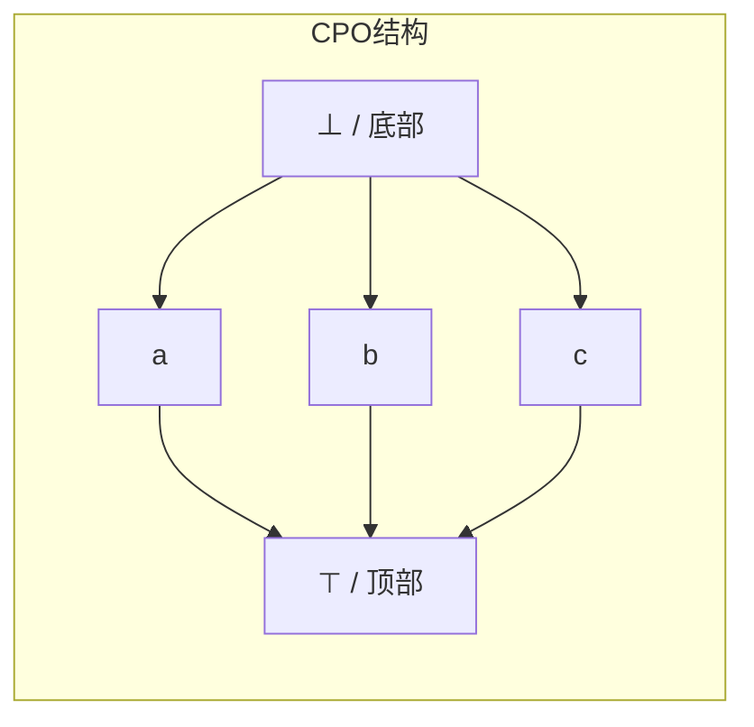
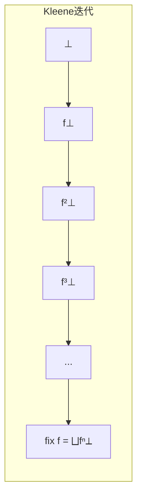

# 序理论 (Order Theory)

> **所属单元**: 01-foundations | **前置依赖**: 无 | **形式化等级**: L1

## 1. 概念定义

### 1.1 偏序集 (Partially Ordered Set, Poset)

**Def-F-01-01: 偏序集**

偏序集是一个二元组 $(D, \sqsubseteq)$，其中 $D$ 是集合，$\sqsubseteq$ 是 $D$ 上的二元关系，满足：

1. **自反性**: $\forall x \in D, x \sqsubseteq x$
2. **反对称性**: $\forall x, y \in D, x \sqsubseteq y \land y \sqsubseteq x \Rightarrow x = y$
3. **传递性**: $\forall x, y, z \in D, x \sqsubseteq y \land y \sqsubseteq z \Rightarrow x \sqsubseteq z$

### 1.2 完全偏序 (Complete Partial Order, CPO)

**Def-F-01-02: 完全偏序 (CPO)**

完全偏序 $(D, \sqsubseteq)$ 是一个偏序集，满足：

1. **有底元**: 存在 $\bot \in D$，使得 $\forall x \in D, \bot \sqsubseteq x$
2. **定向完备**: 每个定向子集 $S \subseteq D$ 都有最小上界 (LUB) $\bigsqcup S$

其中，子集 $S$ 是**定向的**当且仅当：
$$\forall x, y \in S, \exists z \in S: x \sqsubseteq z \land y \sqsubseteq z$$

### 1.3 链与完全格

**Def-F-01-03: 链 (Chain)**

链是偏序集中全序的子集，即 $C \subseteq D$ 满足：
$$\forall x, y \in C: x \sqsubseteq y \lor y \sqsubseteq x$$

**Def-F-01-04: 完全格 (Complete Lattice)**

完全格是偏序集 $(L, \sqsubseteq)$，其中每个子集 $S \subseteq L$ 都有最小上界和最大下界。

## 2. 属性推导

### 2.1 单调性与连续性

**Def-F-01-05: 单调函数**

函数 $f: D \to E$ 是单调的，当且仅当：
$$x \sqsubseteq y \Rightarrow f(x) \sqsubseteq f(y)$$

**Def-F-01-06: 连续函数**

函数 $f: D \to E$ 是连续的，当且仅当：

1. $f$ 是单调的
2. 对所有定向集 $S$: $f(\bigsqcup S) = \bigsqcup f(S)$

**Lemma-F-01-01: 连续性蕴含单调性**

若 $f$ 连续，则 $f$ 单调。

*证明*: 设 $x \sqsubseteq y$，则 $\{x, y\}$ 是定向集，$\bigsqcup\{x,y\} = y$。由连续性：
$$f(y) = f(\bigsqcup\{x,y\}) = \bigsqcup\{f(x), f(y)\}$$
因此 $f(x) \sqsubseteq f(y)$。∎

## 3. 关系建立

### 3.1 与域论的关系

序理论是域论的基础。在形式语义学中：

| 概念 | 语义解释 |
|------|----------|
| $\bot$ (底元) | 未定义/非终止计算 |
| $x \sqsubseteq y$ | $y$ 比 $x$ 有更多定义信息 |
| $\bigsqcup S$ | 信息的极限/并集 |
| 连续函数 | 可计算函数 |

### 3.2 在分布式系统中的应用

**Prop-F-01-01: Kahn语义中的序**

在Kahn进程网中，流的前缀序定义为：
$$s \sqsubseteq t \Leftrightarrow s \text{是} t \text{的前缀}$$

$(D^\omega, \sqsubseteq)$ 构成CPO，其中：

- $\bot = \langle\rangle$ (空序列)
- $\bigsqcup$ 对应流的极限

## 4. 论证过程

### 4.1 为什么需要CPO？

分布式系统中的递归定义（如递归进程、流）需要数学基础来保证语义良定义。

**例**: 递归进程 $P = \text{in}(x).P$ 的语义是什么？

通过CPO上的不动点，可以给出严格定义。

## 5. 形式证明 / 工程论证

### 5.1 Kleene不动点定理

**Thm-F-01-01: Kleene不动点定理**

设 $(D, \sqsubseteq)$ 是CPO，$f: D \to D$ 是连续函数，则 $f$ 有最小不动点：

$$\text{fix}(f) = \bigsqcup_{n \geq 0} f^n(\bot)$$

*证明*:

**步骤1**: 证明 $\{f^n(\bot) \mid n \geq 0\}$ 是链。

- $f^0(\bot) = \bot \sqsubseteq f(\bot) = f^1(\bot)$ (底元性质)
- 归纳：若 $f^n(\bot) \sqsubseteq f^{n+1}(\bot)$，由单调性：
  $$f^{n+1}(\bot) = f(f^n(\bot)) \sqsubseteq f(f^{n+1}(\bot)) = f^{n+2}(\bot)$$

**步骤2**: 设 $x^* = \bigsqcup_{n \geq 0} f^n(\bot)$，证明 $f(x^*) = x^*$。

$$f(x^*) = f(\bigsqcup_{n \geq 0} f^n(\bot)) = \bigsqcup_{n \geq 0} f(f^n(\bot)) = \bigsqcup_{n \geq 0} f^{n+1}(\bot) = x^*$$

**步骤3**: 证明最小性。设 $y$ 是任意不动点，则 $\bot \sqsubseteq y$，由归纳：
$$f^n(\bot) \sqsubseteq f^n(y) = y$$
因此 $x^* = \bigsqcup f^n(\bot) \sqsubseteq y$。∎

### 5.2 工程应用

在流计算系统中，Kleene定理保证：

- 递归流定义有唯一最小解
- 可以通过迭代逼近语义

## 6. 实例验证

### 6.1 示例：流的CPO结构

设 $D = \{0, 1\}$，$D^\omega$ 是有限和无限二进制序列。

- $\bot = \epsilon$ (空序列)
- $0 \sqsubseteq 00 \sqsubseteq 001 \sqsubseteq \cdots$
- $\bigsqcup\{0, 00, 000, \ldots\} = 0^\omega$ (无限个0)

### 6.2 示例：连续函数

流操作 $f(s) = 0:s$ (在头部添加0) 是连续的：

$$f(\bigsqcup S) = 0:\bigsqcup S = \bigsqcup\{0:s \mid s \in S\} = \bigsqcup f(S)$$

## 7. 可视化

### CPO结构示意

### 不动点逼近过程

## 8. 引用参考
