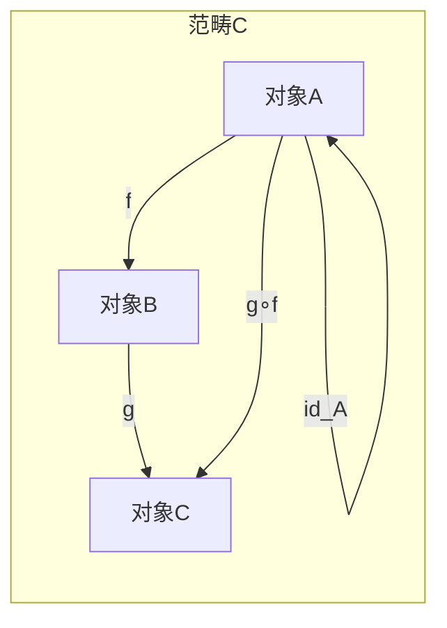
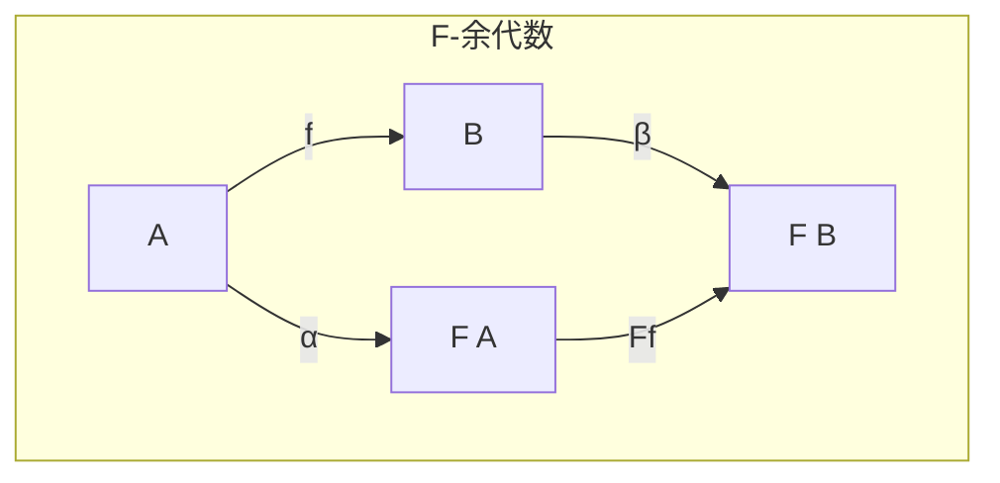
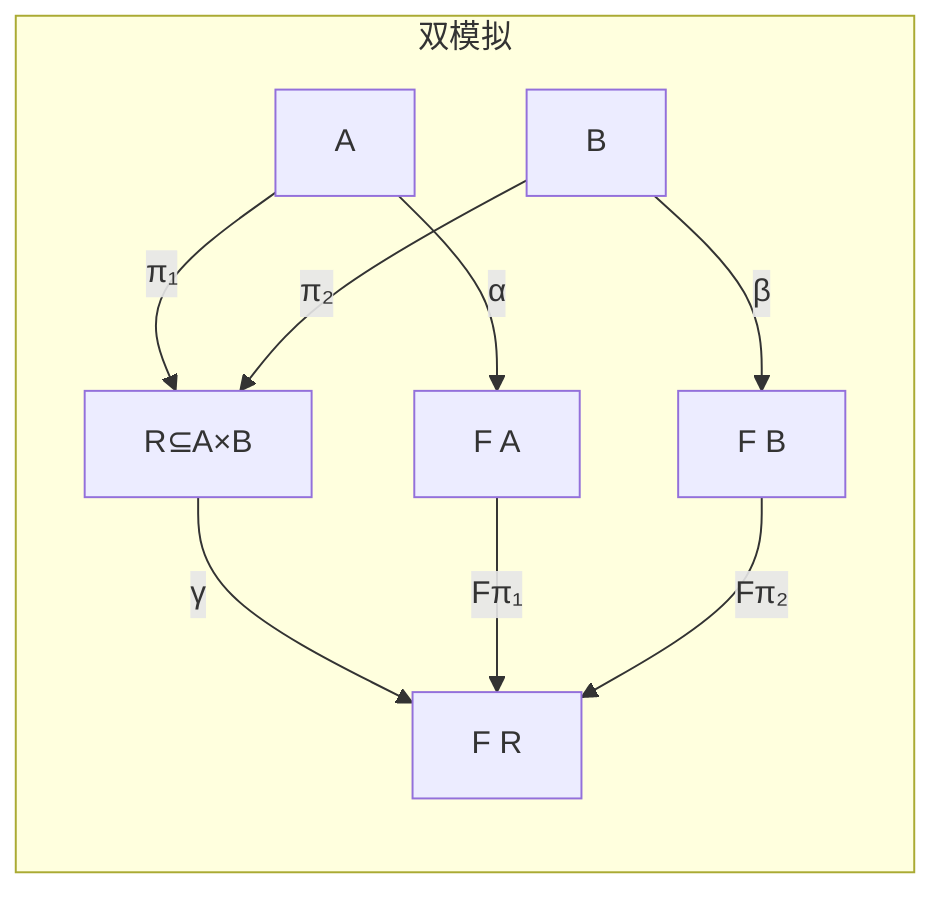

# 范畴论 (Category Theory)

> **所属单元**: 01-foundations | **前置依赖**: 01-order-theory.md | **形式化等级**: L2

## 1. 概念定义

### 1.1 范畴 (Category)

**Def-F-02-01: 范畴**

范畴 $\mathcal{C}$ 由以下组成：

1. **对象类** $\text{Obj}(\mathcal{C})$
2. **态射类** $\text{Hom}(\mathcal{C})$，其中每个态射 $f: A \to B$ 有源对象 $A$ 和目标对象 $B$
3. **复合运算** $\circ: \text{Hom}(B, C) \times \text{Hom}(A, B) \to \text{Hom}(A, C)$，满足：
   - **结合律**: $(h \circ g) \circ f = h \circ (g \circ f)$
   - **单位元**: 对每个对象 $A$，存在 $id_A: A \to A$，使得 $f \circ id_A = f$ 且 $id_B \circ f = f$

### 1.2 函子 (Functor)

**Def-F-02-02: 函子**

函子 $F: \mathcal{C} \to \mathcal{D}$ 是两个范畴之间的映射，满足：

1. **对象映射**: $A \mapsto F(A)$
2. **态射映射**: $(f: A \to B) \mapsto (F(f): F(A) \to F(B))$
3. **保持复合**: $F(g \circ f) = F(g) \circ F(f)$
4. **保持单位元**: $F(id_A) = id_{F(A)}$

### 1.3 自然变换 (Natural Transformation)

**Def-F-02-03: 自然变换**

自然变换 $\alpha: F \Rightarrow G$ 是两个函子 $F, G: \mathcal{C} \to \mathcal{D}$ 之间的映射，为每个对象 $A \in \mathcal{C}$ 指定一个态射 $\alpha_A: F(A) \to G(A)$，使得以下图表交换：

$$
\begin{array}{ccc}
F(A) & \xrightarrow{\alpha_A} & G(A) \\
F(f) \downarrow & & \downarrow G(f) \\
F(B) & \xrightarrow{\alpha_B} & G(B)
\end{array}
$$

即：$G(f) \circ \alpha_A = \alpha_B \circ F(f)$

## 2. 属性推导

### 2.1 余代数 (Coalgebra)

**Def-F-02-04: F-余代数**

给定 endofunctor $F: \mathcal{C} \to \mathcal{C}$，$F$-余代数是一个对 $(A, \alpha)$，其中：

- $A$ 是载体对象
- $\alpha: A \to F(A)$ 是结构映射

**Def-F-02-05: 余代数同态**

余代数同态 $f: (A, \alpha) \to (B, \beta)$ 是满足以下条件的态射 $f: A \to B$：
$$F(f) \circ \alpha = \beta \circ f$$

**Lemma-F-02-01: 余代数终对象存在性**

在一定条件下，$F$-余代数范畴有终对象 $(\nu F, \text{out})$，称为 $F$ 的**终余代数**。

### 2.2 双模拟 (Bisimulation)

**Def-F-02-06: 双模拟关系**

设 $(A, \alpha)$ 和 $(B, \beta)$ 是 $F$-余代数，关系 $R \subseteq A \times B$ 是双模拟，如果存在 $\gamma: R \to F(R)$ 使得投影是同态：

$$
\begin{array}{ccc}
A & \xleftarrow{\pi_1} & R & \xrightarrow{\pi_2} & B \\
\alpha \downarrow & & \downarrow \gamma & & \downarrow \beta \\
F(A) & \xleftarrow{F(\pi_1)} & F(R) & \xrightarrow{F(\pi_2)} & F(B)
\end{array}
$$

**Prop-F-02-01: 双模拟的等价刻画**

在终余代数 $(\nu F, \text{out})$ 中，两个状态 $a, b$ 双模拟等价当且仅当：
$$\text{out}^\infty(a) = \text{out}^\infty(b)$$

其中 $\text{out}^\infty$ 是到终余代数的唯一同态。

## 3. 关系建立

### 3.1 余代数与无限结构

余代数提供了描述**无限结构**的数学框架：

| 结构 | 余代数定义 | 终余代数 |
|------|-----------|----------|
| 流 (Stream) | $A^\omega \cong A \times A^\omega$ | $A^\omega$ 本身 |
| 树 (Tree) | $T \cong A \times T^*$ | 所有 $A$-标记树 |
| 进程 | $P \cong \mathcal{P}(A \times P)$ | 所有进程行为 |

### 3.2 与序理论的联系

**Prop-F-02-02: CPO作为范畴**

CPO和连续函数构成范畴 $\mathbf{CPO}$：

- 对象: CPO $(D, \sqsubseteq)$
- 态射: 连续函数
- 终对象: 单点CPO $\{*\}$

**Prop-F-02-03: 余代数与CPO**

在 $\mathbf{CPO}$ 中，很多函子的终余代数可以通过**序极限**构造。

## 4. 论证过程

### 4.1 为什么使用余代数？

**归纳 vs 共归纳**:

| 特征 | 归纳 (Algebra) | 共归纳 (Coalgebra) |
|------|---------------|-------------------|
| 构造方向 | 从基础构造 | 从行为观察 |
| 典型结构 | 自然数、列表 | 流、进程、状态机 |
| 证明原理 | 结构归纳 | 双模拟 |
| 语义 | 初始代数 | 终余代数 |

分布式系统中的**状态机**、**进程**、**流**都是共归纳结构。

## 5. 形式证明 / 工程论证

### 5.1 流作为终余代数

**Thm-F-02-01: 流的终余代数刻画**

设 $F(X) = A \times X$ 是乘积函子，则 $F$-余代数 $(S, \langle h, t \rangle)$ 满足：

- $h: S \to A$ (head)
- $t: S \to S$ (tail)

终余代数 $(A^\omega, \langle \text{hd}, \text{tl} \rangle)$ 其中：

- $\text{hd}(a:s) = a$
- $\text{tl}(a:s) = s$

*证明概要*:

对任意余代数 $(S, \langle h, t \rangle)$，定义唯一同态 $\phi: S \to A^\omega$：
$$\phi(s) = h(s) : \phi(t(s))$$

这是良定义的（通过共归纳原理），且是唯一的。∎

### 5.2 双模拟作为余等价

**Thm-F-02-02: 双模拟=同态核**

在终余代数中，双模拟关系恰好是同态映射的核：
$$a \sim b \Leftrightarrow \exists f, g: f(a) = g(b)$$

## 6. 实例验证

### 6.1 示例：流的同态

定义流操作 $\text{zeros}: 1 \to A^\omega$，满足：
$$\text{zeros}(*) = 0 : \text{zeros}(*)$$

这是从终余代数 $(1, id)$ 到 $(A^\omega, \langle hd, tl \rangle)$ 的唯一同态。

### 6.2 示例：进程的双模拟

进程 $P = a.P + b.0$ 和 $Q = a.(b.0 + a.Q)$ 是双模拟的，可以构造双模拟关系：
$$R = \{(P, Q), (P, b.0 + a.Q), (0, 0)\}$$

## 7. 可视化

### 范畴基本结构

### 余代数结构

### 双模拟关系

## 8. 引用参考
