# 逻辑基础 (Logic Foundations)

> **所属单元**: 01-foundations | **前置依赖**: 无 | **形式化等级**: L1-L3

## 1. 概念定义

### 1.1 时序逻辑 (Temporal Logic)

**Def-F-03-01: 线性时序逻辑 (LTL)**

LTL公式在计算路径上解释，语法：
$$\phi ::= p \mid \neg \phi \mid \phi \lor \phi \mid \bigcirc \phi \mid \phi \mathcal{U} \phi$$

其中：

- $p$: 原子命题
- $\bigcirc$: Next (下一时刻)
- $\mathcal{U}$: Until (直到)

**派生算子**:

- $\Diamond \phi \equiv \top \mathcal{U} \phi$ (Eventually / 最终)
- $\square \phi \equiv \neg \Diamond \neg \phi$ (Globally / 总是)

**Def-F-03-02: 计算树逻辑 (CTL)**

CTL公式在状态上解释，语法：
$$\phi ::= p \mid \neg \phi \mid \phi \lor \phi \mid \mathbf{A}\psi \mid \mathbf{E}\psi$$
$$\psi ::= \bigcirc \phi \mid \phi \mathcal{U} \phi$$

其中：

- $\mathbf{A}$: All paths (所有路径)
- $\mathbf{E}$: Exists path (存在路径)

### 1.2 霍尔逻辑 (Hoare Logic)

**Def-F-03-03: 霍尔三元组**

霍尔三元组 $\{P\} C \{Q\}$ 表示：
> 若程序 $C$ 执行前前置条件 $P$ 成立，则执行后后置条件 $Q$ 成立。

**Def-F-03-04: 霍尔演算规则**

| 规则 | 形式 |
|------|------|
| 赋值 | $\{P[e/x]\} x := e \{P\}$ |
| 顺序 | $\frac{\{P\} C_1 \{R\}, \{R\} C_2 \{Q\}}{\{P\} C_1; C_2 \{Q\}}$ |
| 条件 | $\frac{\{P \land b\} C_1 \{Q\}, \{P \land \neg b\} C_2 \{Q\}}{\{P\} \text{if } b \text{ then } C_1 \text{ else } C_2 \{Q\}}$ |
| 循环 | $\frac{\{P \land b\} C \{P\}}{\{P\} \text{while } b \text{ do } C \{P \land \neg b\}}$ |
| 推论 | $\frac{P \Rightarrow P', \{P'\} C \{Q'\}, Q' \Rightarrow Q}{\{P\} C \{Q\}}$ |

### 1.3 分离逻辑 (Separation Logic)

**Def-F-03-05: 分离逻辑断言**

扩展霍尔逻辑，增加堆/内存操作：
$$P, Q ::= emp \mid x \mapsto y \mid P * Q \mid P \wand Q \mid \ldots$$

其中：

- $emp$: 空堆
- $x \mapsto y$: 地址 $x$ 存储值 $y$
- $P * Q$: $P$ 和 $Q$ 的堆不相交且都成立 (Separating conjunction)
- $P \wand Q$: $P$ 分离蕴含 (Separating implication)

**Def-F-03-06: 分离逻辑规则**

| 规则 | 形式 |
|------|------|
| 帧 | $\frac{\{P\} C \{Q\}}{\{P * R\} C \{Q * R\}}$ ($C$ 不修改 $R$ 的内存) |
| 分配 | $\{emp\} x := \text{alloc}(n) \{x \mapsto \_ * (x+1) \mapsto \_ * \cdots * (x+n-1) \mapsto \_\}$ |
| 释放 | $\{x \mapsto \_\} \text{free}(x) \{emp\}$ |

## 2. 属性推导

### 2.1 LTL与CTL表达能力对比

**Prop-F-03-01: LTL与CTL表达能力**

- **LTL**: 路径公式，表达路径性质
  - 例: $\square \Diamond p$ (无限频繁访问 $p$)

- **CTL**: 分支时间，表达分支性质
  - 例: $\mathbf{AGEF} p$ (从所有状态都可到达 $p$)

**Prop-F-03-02: CTL* 统一框架**

CTL* 同时包含路径量词和时序算子，LTL和CTL都是其子集：
$$\text{LTL} \subset \text{CTL} \subset \text{CTL*}$$

### 2.2 霍尔逻辑的完备性

**Prop-F-03-03: 相对完备性**

霍尔逻辑对 while-程序是**相对完备**的：
> 若 $\{P\} C \{Q\}$ 语义有效，则在能证明所有真断言的算术前提下，可推导。

**Lemma-F-03-01: 最弱前置条件 (WP)**

对每个命令 $C$ 和后置条件 $Q$，存在最弱前置条件 $wp(C, Q)$ 使得：
$$\{P\} C \{Q\} \text{ 有效} \Leftrightarrow P \Rightarrow wp(C, Q)$$

## 3. 关系建立

### 3.1 逻辑与计算模型的对应

**扩展阅读**: [抽象解释理论](../../03-model-taxonomy/02-computation-models/abstract-interpretation.md) - 程序静态分析的形式化基础

| 计算模型 | 验证逻辑 | 典型性质 |
|----------|----------|----------|
| 顺序程序 | 霍尔逻辑 | 部分正确性 |
| 并发程序 | 分离逻辑 | 无数据竞争 |
| 反应式系统 | LTL | 活性、安全性 |
| 分支系统 | CTL | 可达性、控制策略 |
| 实时系统 | TCTL | 截止时间 |
| 概率系统 | PCTL | 概率保证 |

### 3.2 与范畴论的联系

**Prop-F-03-04: 霍尔逻辑的范畴语义**

在范畴论中，霍尔三元组对应**可交换图表**:

$$
\begin{array}{ccc}
P & \xrightarrow{\text{包含}} & \text{State} \\
\downarrow & & \downarrow \llbracket C \rrbracket \\
Q & \xrightarrow{\text{包含}} & \text{State}
\end{array}
$$

## 4. 论证过程

### 4.1 安全性和活性的形式化

**安全性 (Safety)**: "坏事情不会发生"
$$\square \neg \text{bad}$$

**活性 (Liveness)**: "好事情最终会发生"
$$\square \Diamond \text{good}$$

**公平性 (Fairness)**:

- **弱公平**: $\square \Diamond \text{enabled} \to \square \Diamond \text{executed}$
- **强公平**: $\Diamond \square \text{enabled} \to \square \Diamond \text{executed}$

### 4.2 分离逻辑的动机

传统霍尔逻辑难以处理**指针别名**问题：

```
{x = y} x.f := 5 {x.f = 5 ∧ y.f = ?}
```

分离逻辑通过 $*$ 算子显式指定内存分离：
$$\{x \mapsto \_ * y \mapsto \_\} x := 5 \{x \mapsto 5 * y \mapsto \_\}$$

## 5. 形式证明 / 工程论证

### 5.1 LTL模型检测复杂度

**Thm-F-03-01: LTL模型检测复杂度**

对有限状态系统 $M$ 和 LTL 公式 $\phi$：
$$M \models \phi \text{ 可在 } O(|M| \cdot 2^{|\phi|}) \text{ 时间内判定}$$

*证明概要*:

1. 构造 $\neg \phi$ 的 Büchi 自动机 $A_{\neg \phi}$
2. 计算乘积自动机 $M \times A_{\neg \phi}$
3. 检查接受循环 (NP完全子问题)

### 5.2 分离逻辑的局部推理

**Thm-F-03-02: 帧规则的安全性**

若 $\{P\} C \{Q\}$ 且 $C$ 的修改足迹在 $P$ 中，则：
$$\{P * R\} C \{Q * R\}$$

这使得大程序的验证可以**模块化**进行。

## 6. 实例验证

### 6.1 示例：互斥协议验证

**规范**: 两个进程不能同时进入临界区

**LTL公式**:
$$\square \neg (pc_1 = \text{critical} \land pc_2 = \text{critical})$$

### 6.2 示例：链表反转

**霍尔三元组**:
$$\{l = L\} \text{reverse}(l) \{l = \text{rev}(L)\}$$

**分离逻辑断言** (链表):
$$\text{list}(x, \alpha) \equiv (x = \text{null} \land \alpha = \epsilon) \lor (\exists y, \beta. \alpha = a :: \beta \land x \mapsto a, y * \text{list}(y, \beta))$$

## 7. 可视化

### LTL语义时间线

```mermaid
gantt
    title LTL算子语义示意
    dateFormat X
    axisFormat %s

    section 状态
    p成立       :0, 2
    p不成立     :2, 3
    p成立       :3, 5

    section 算子
    ◇p(最终)    :crit, 0, 1
    □p(总是)    :crit, 0, 2
    ○p(下一)    :crit, 1, 2
    pUq(直到)   :crit, 0, 3
```



### 霍尔逻辑推导树

```mermaid
graph TD
    A[{x≥0} x:=x+1 {x≥1}] --> B[{x≥0} x:=x+1;y:=x*2 {y≥2}]
    C[{y≥1} y:=x*2 {y≥2}] --> B
    D[顺序组合规则] --> A
    D --> C
```

## 8. 引用参考
