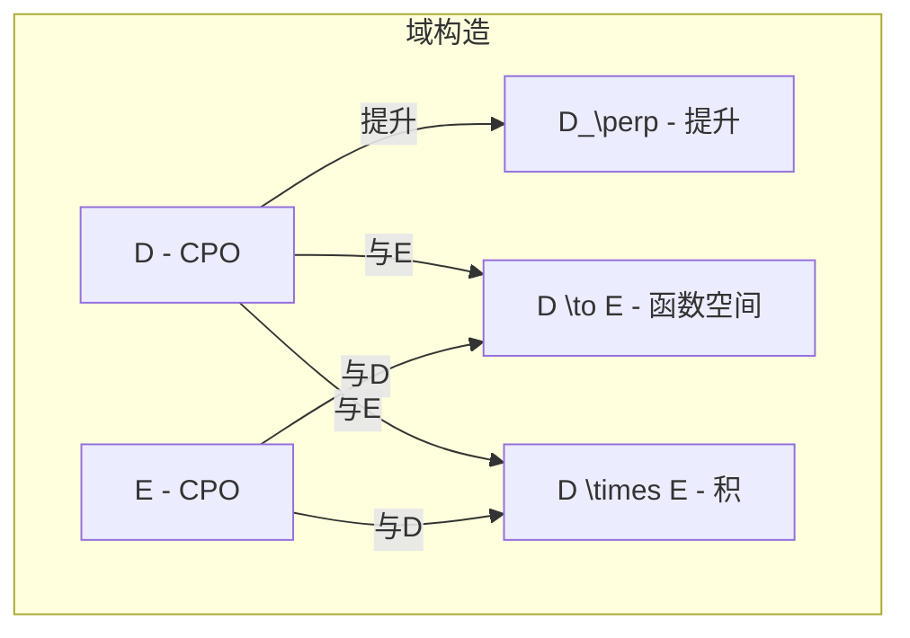
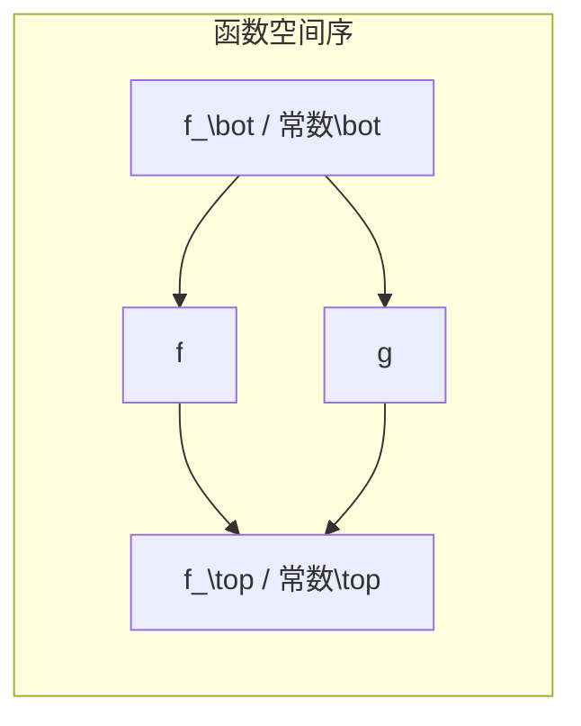

# 域论进阶 (Domain Theory Advanced)

> **所属单元**: 01-foundations | **前置依赖**: 01-order-theory.md | **形式化等级**: L2-L3

## 1. 概念定义

### 1.1 函数域 (Function Space)

**Def-F-04-01: 连续函数空间**

设 $D$ 和 $E$ 是CPO，$D  o E$ 表示从 $D$ 到 $E$ 的连续函数集合。函数空间上的序关系定义为逐点序：

$$f  rianglelefteq g  riangleq \forall x \in D. f(x) \sqsubseteq_E g(x)$$

**Def-F-04-02: 函数空间的CPO结构**

若 $D$ 和 $E$ 是CPO，则 $(D \to E, \trianglelefteq)$ 也是CPO：

1. **底元**: $\bot_{D \to E}(x) = \bot_E$
2. **最小上界**: $(\bigsqcup F)(x) = \bigsqcup_{f \in F} f(x)$

### 1.2 提升 (Lifting) 构造

**Def-F-04-03: 提升构造 (Lifting)**

对任意集合 $D$，其提升 $D_\perp$ 定义为：

$$D_\perp = D \cup \{\perp\}$$

序关系定义为：
$$x \sqsubseteq_{D_\perp} y \triangleq (x = \perp) \lor (x = y \land x, y \in D)$$

**Def-F-04-04: 提升函子**

提升运算可视为函子 $(-)_\perp: \mathbf{Set} \to \mathbf{CPO}$：

- 对象: $D \mapsto D_\perp$
- 态射: $f: D \to E$ 映射为 $f_\perp: D_\perp \to E_\perp$
  $$f_\perp(x) = \begin{cases} \perp & x = \perp \\ f(x) & \text{otherwise} \end{cases}$$

### 1.3 积 (Product) 构造

**Def-F-04-05: 域的笛卡尔积**

设 $D_1, \ldots, D_n$ 是CPO，笛卡尔积 $D_1 \times \cdots \times D_n$ 定义为：

$$(x_1, \ldots, x_n) \sqsubseteq (y_1, \ldots, y_n) \triangleq \bigwedge_{i=1}^n x_i \sqsubseteq_{D_i} y_i$$

**Def-F-04-06: 投影与配对**

- 投影: $\pi_i: D_1 \times \cdots \times D_n \to D_i$，$\pi_i(x_1, \ldots, x_n) = x_i$
- 配对: $\langle f_1, \ldots, f_n \rangle: A \to D_1 \times \cdots \times D_n$，$\langle f_1, \ldots, f_n \rangle(a) = (f_1(a), \ldots, f_n(a))$

### 1.4 严格性分析 (Strictness Analysis)

**Def-F-04-07: 严格函数**

函数 $f: D \to E$ 是**严格的**，当且仅当：
$$f(\bot_D) = \bot_E$$

**Def-F-04-08: 严格性类型系统**

引入严格性注释类型：

$$\tau ::= \tau^S \mid \tau^L$$

其中 $S$ 表示严格，$L$ 表示惰性。严格性约束规则：

- 若 $f: \sigma^S \to \tau$，则 $f$ 是严格函数
- 若 $f: \sigma^L \to \tau$，则 $f$ 可为非严格函数

### 1.5 完全格与不动点组合子

**Def-F-04-09: 完全格 (Complete Lattice)**

完全格 $(L, \sqsubseteq)$ 满足每个子集 $S \subseteq L$ 都有最小上界 $\bigsqcup S$ 和最大下界 $\sqcap S$。

**Def-F-04-10: 不动点组合子**

**Y组合子**在域论语义中定义为：
$$\text{fix}: (D \to D) \to D$$
$$\text{fix}(f) = \bigsqcup_{n \geq 0} f^n(\bot)$$

**Def-F-04-11: 最小与最大不动点**

对单调函数 $f: L \to L$ 在完全格上：

- 最小不动点: $\mu f = \bigsqcup_{n \geq 0} f^n(\bot)$
- 最大不动点: $\nu f = \sqcap_{n \geq 0} f^n(\top)$

## 2. 属性推导

### 2.1 函数空间的连续性

**Lemma-F-04-01: 函数空间上的连续性保持**

若 $D, E$ 是CPO，则 $\lambda f. f(x): (D \to E) \to E$ 对每个固定的 $x \in D$ 是连续的。

*证明*: 设 $F \subseteq (D \to E)$ 是定向集。

$$(\bigsqcup F)(x) = \bigsqcup_{f \in F} f(x) = \bigsqcup \{f(x) \mid f \in F\}$$

这正是连续性定义。∎

**Lemma-F-04-02: 应用函数的连续性**

应用函数 $\text{apply}: (D \to E) \times D \to E$，定义为 $\text{apply}(f, x) = f(x)$，是连续的。

*证明*: 需要证明 $\text{apply}(\bigsqcup F, \bigsqcup S) = \bigsqcup_{f \in F, x \in S} \text{apply}(f, x)$。

由于连续函数保持定向集的LUB：
$$\text{apply}(\bigsqcup F, \bigsqcup S) = (\bigsqcup F)(\bigsqcup S) = \bigsqcup_{f \in F} f(\bigsqcup S) = \bigsqcup_{f \in F} \bigsqcup_{x \in S} f(x) = \bigsqcup_{f, x} f(x)$$∎

### 2.2 提升与积的性质

**Prop-F-04-01: 提升的泛性质**

提升 $D_\perp$ 满足以下泛性质：对任意CPO $E$ 和偏函数 $f: D \rightharpoonup E$，存在唯一的连续函数 $\bar{f}: D_\perp \to E$ 使得下图交换：

```
f
D -----> E
|       /
|      /
η|    /  ∃! \bar{f}
|   /
|  /
v /
D_\perp
```

其中 $\eta: D \to D_\perp$ 是自然包含映射。

**Prop-F-04-02: 积的投影连续性**

投影函数 $\pi_i: D_1 \times D_2 \to D_i$ 是连续的。

*证明*: 设 $S \subseteq D_1 \times D_2$ 是定向集，$S_i = \{\pi_i(s) \mid s \in S\}$。

$$\pi_i(\bigsqcup S) = \pi_i(\bigsqcup S_1, \bigsqcup S_2) = \bigsqcup S_i = \bigsqcup \pi_i(S)$$∎

### 2.3 严格性分析的精化

**Lemma-F-04-03: 严格性传播的充分条件**

若 $f: D \to E$ 和 $g: E \to F$ 都是严格的，则 $g \circ f: D \to F$ 也是严格的。

*证明*: $(g \circ f)(\bot_D) = g(f(\bot_D)) = g(\bot_E) = \bot_F$。∎

**Prop-F-04-03: 条件表达式的严格性**

设 $\text{if}: \mathbb{B}_\perp \times D \times D \to D$ 定义为：
$$\text{if}(b, x, y) = \begin{cases} x & b = \text{true} \\ y & b = \text{false} \\ \bot & b = \bot \end{cases}$$

则 $\text{if}$ 在其第一个参数上是严格的。

## 3. 关系建立

### 3.1 域构造的代数结构

| 构造 | 范畴论视角 | 域论语义 |
|------|-----------|---------|
| 提升 $D_\perp$ | 左伴随于遗忘函子 | 偏计算/异常处理 |
| 积 $D \times E$ | 范畴积 | 元组/多参数函数 |
| 函数空间 $D \to E$ | 指数对象 | 高阶函数 |
| 和 $D + E$ | 余积 | 变体类型 |

### 3.2 严格性与惰性求值

**Prop-F-04-04: 严格性分析的应用**

在函数式语言实现中，严格性分析允许编译器优化求值策略：

- **严格参数**: 使用传值调用 (call-by-value)
- **惰性参数**: 使用传名调用 (call-by-name) 或按需调用 (call-by-need)

这直接影响流处理系统中**反压 (backpressure)** 的实现策略。

### 3.3 不动点与递归语义

**Prop-F-04-05: 不动点的序关系**

对单调函数 $f: L \to L$：
$$\mu f \sqsubseteq \nu f$$

且若 $f$ 是连续的，则两者之间的所有不动点构成完全格。

## 4. 论证过程

### 4.1 为什么需要函数空间？

在高阶函数式语言中，函数是一等公民。函数空间 $D \to E$ 的CPO结构保证了：

1. **高阶递归**: 如 $Y$ 组合子的语义良定义
2. **柯里化**: $(D \times E) \to F \cong D \to (E \to F)$
3. **不动点归纳**: 证明递归程序的性质

### 4.2 提升的语义解释

提升构造 $D_\perp$ 在语义学中表示：

- $\perp$: 未定义/非终止计算
- $x \in D$: 正常终止并返回值 $x$

这与编程语言中的 `Option<T>` 或 `Maybe` 类型对应。

### 4.3 严格性分析的复杂度

**复杂度权衡**:

- 精确严格性分析是不可判定的 (可归约到停机问题)
- 实用系统使用**抽象解释**获得安全近似
- 4-元素严格性格是最常用的折中方案

## 5. 形式证明 / 工程论证

### 5.1 函数空间的CPO完备性

**Thm-F-04-01: 函数空间的CPO结构**

若 $D$ 和 $E$ 是CPO，则 $(D \to E, \trianglelefteq)$ 也是CPO。

*证明*:

**步骤1**: 证明有底元。

定义 $\bot_{D \to E}(x) = \bot_E$。对任意 $f \in (D \to E)$：
$$\bot_{D \to E}(x) = \bot_E \sqsubseteq f(x)$$
故 $\bot_{D \to E} \trianglelefteq f$。

**步骤2**: 证明定向集有LUB。

设 $F \subseteq (D \to E)$ 是定向集。定义：
$$(\bigsqcup F)(x) = \bigsqcup_{f \in F} f(x)$$

需要验证：

1. $\bigsqcup F$ 是良定义的 (每个 $x$ 处的LUB存在)
2. $\bigsqcup F$ 是连续的

**步骤3**: 证明 $\bigsqcup F$ 连续。

设 $S \subseteq D$ 是定向集：
$$(\bigsqcup F)(\bigsqcup S) = \bigsqcup_{f \in F} f(\bigsqcup S) = \bigsqcup_{f \in F} \bigsqcup_{x \in S} f(x)$$

由于CPO中LUB可交换：
$$= \bigsqcup_{x \in S} \bigsqcup_{f \in F} f(x) = \bigsqcup_{x \in S} (\bigsqcup F)(x)$$∎

### 5.2 最小不动点的唯一性

**Thm-F-04-02: Tarski-Knaster不动点定理**

设 $L$ 是完全格，$f: L \to L$ 是单调函数，则：

$$\mu f = \bigsqcup \{x \in L \mid x \sqsubseteq f(x)\}$$

是 $f$ 的最小不动点。

*证明*:

设 $S = \{x \in L \mid x \sqsubseteq f(x)\}$，$u = \bigsqcup S$。

**步骤1**: 证明 $u$ 是不动点。

对任意 $x \in S$，$x \sqsubseteq u$，故 $f(x) \sqsubseteq f(u)$。由于 $x \sqsubseteq f(x)$，有 $x \sqsubseteq f(u)$。

因此 $u = \bigsqcup S \sqsubseteq f(u)$。于是 $f(u) \sqsubseteq f(f(u))$，即 $f(u) \in S$，故 $f(u) \sqsubseteq u$。

结合两者：$u = f(u)$。

**步骤2**: 证明最小性。

设 $v$ 是任意不动点，则 $v \sqsubseteq f(v) = v$，故 $v \in S$，因此 $u \sqsubseteq v$。∎

### 5.3 严格性分析的正确性

**Thm-F-04-03: 抽象严格性分析的安全性**

设 $A$ 是严格性抽象域，$\alpha: \mathcal{P}(D) \to A$ 是抽象函数，$\gamma: A \to \mathcal{P}(D)$ 是具体化函数。若 $f^\#: A \to A$ 是 $f$ 的合理抽象，则：

$$\text{if } f^\#(\alpha(\{\bot\})) = \bot_A \text{ then } f \text{ is strict}$$

*证明概要*: 由伽罗瓦连接的性质，$\alpha(\{\bot\}) \sqsubseteq a$ 蕴含 $\bot \in \gamma(a)$。若 $f^\#(\alpha(\{\bot\})) = \bot_A$，则 $f(\bot) \in \gamma(\bot_A) = \{\bot\}$。∎

## 6. 实例验证

### 6.1 示例：流处理算子的严格性

考虑流处理中的 `map` 算子：
$$\text{map}(f)([x_1, x_2, \ldots]) = [f(x_1), f(x_2), \ldots]$$

- $\text{map}(f)$ 对输入流是**严格**的 (必须检查流是否为空)
- $\text{map}(f)$ 对 $f$ 是**非严格**的 (惰性求值每个元素)

### 6.2 示例：递归定义的语义

考虑递归函数 $F(f)(n) = \text{if } n = 0 \text{ then } 1 \text{ else } n \cdot f(n-1)$。

其语义为不动点：
$$\text{fact} = \text{fix}(F) = \bigsqcup_{k \geq 0} F^k(\bot)$$

计算前几项：

- $F^0(\bot)(n) = \bot$
- $F^1(\bot)(n) = \text{if } n = 0 \text{ then } 1 \text{ else } \bot$
- $F^2(\bot)(n) = \text{if } n \in \{0,1\} \text{ then } n! \text{ else } \bot$

### 6.3 示例：函数空间的柯里化同构

$$\text{curry}: ((D \times E) \to F) \to (D \to (E \to F))$$
$$\text{curry}(f)(x)(y) = f(x, y)$$

这是CPO之间的同构，保持所有序结构。

## 7. 可视化

### 域构造层级图



### 严格性分析格

```mermaid
graph BT
    subgraph 4-元素严格性格
    TOP[\top / 可能非终止]
    S[STRICT / 严格]
    L[LENIENT / 惰性]
    BOT[\bot / 必定终止]

    BOT --> S
    BOT --> L
    S --> TOP
    L --> TOP
    end
```

### 不动点逼近过程

```mermaid
graph LR
    subgraph Kleene链
    BOT[\bot] --> F1[f\bot]
    F1 --> F2[f\sup 2\bot]
    F2 --> F3[f\sup 3\bot]
    F3 --> D[...]
    D --> MU[\mu f = \bigsqcup f\sup n\bot]
    MU --> TOP[\top]
    TOP --> NU[\nu f = \sqcap f\sup n\top]
    end
```

### 函数空间结构



## 8. 引用参考
