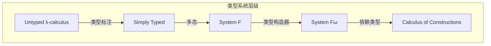
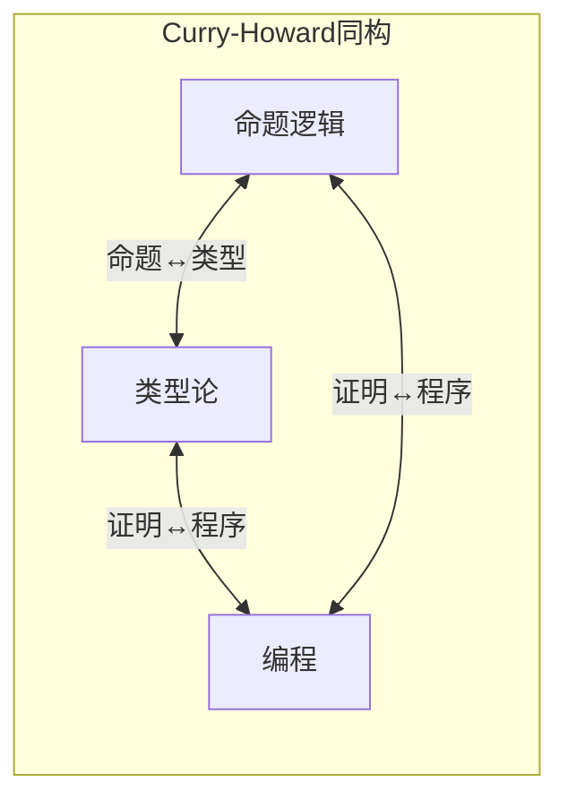
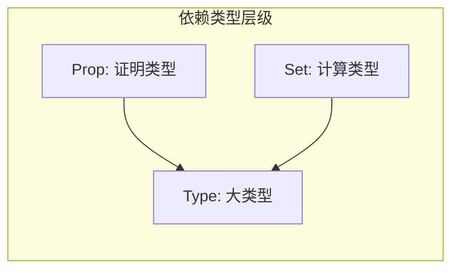

# 类型理论基础 (Type Theory Foundations)

> **所属单元**: 01-foundations | **前置依赖**: 04-domain-theory.md | **形式化等级**: L2-L4

## 1. 概念定义

### 1.1 简单类型λ演算 (Simply Typed Lambda Calculus)

**Def-F-05-01: 简单类型**

简单类型由以下文法生成：
$$\sigma, \tau ::= b \mid \sigma \to \tau$$

其中 $b$ 是基本类型 (如 $\text{Int}$, $\text{Bool}$)，$\sigma \to \tau$ 是函数类型。

**Def-F-05-02: 类型上下文**

类型上下文 $\Gamma$ 是变量-类型对的有限序列：
$$\Gamma ::= \emptyset \mid \Gamma, x: \sigma$$

**Def-F-05-03: 类型判断**

类型判断的形式为 $\Gamma \vdash M: \sigma$，表示在上下文 $\Gamma$ 中项 $M$ 具有类型 $\sigma$。

类型规则：

| 规则 | 名称 | 形式 |
|------|------|------|
| 变量 | Var | $\frac{}{\Gamma, x:\sigma \vdash x:\sigma}$ |
| 抽象 | Abs | $\frac{\Gamma, x:\sigma \vdash M:\tau}{\Gamma \vdash \lambda x.M : \sigma \to \tau}$ |
| 应用 | App | $\frac{\Gamma \vdash M:\sigma \to \tau \quad \Gamma \vdash N:\sigma}{\Gamma \vdash M\,N : \tau}$ |

### 1.2 多态类型系统 (System F)

**Def-F-05-04: 多态类型**

System F 类型扩展为：
$$\sigma, \tau ::= b \mid \alpha \mid \sigma \to \tau \mid \forall \alpha. \sigma$$

其中 $\alpha$ 是类型变量，$\forall \alpha. \sigma$ 是全称量化类型。

**Def-F-05-05: 类型抽象与应用**

- 类型抽象: 若 $\Gamma \vdash M: \sigma$ 且 $\alpha$ 不在 $\Gamma$ 中自由出现，则 $\Gamma \vdash \Lambda \alpha. M : \forall \alpha. \sigma$
- 类型应用: 若 $\Gamma \vdash M : \forall \alpha. \sigma$，则 $\Gamma \vdash M[\tau] : \sigma[\tau/\alpha]$

**Def-F-05-06: 类型擦除与实例化**

类型擦除 $|\cdot|$ 将 System F 项映射到无类型λ演算：

- $|\Lambda \alpha. M| = |M|$
- $|M[\tau]| = |M|$

### 1.3 依赖类型入门

**Def-F-05-07: 依赖类型系统 (LF/λP)**

依赖类型允许类型依赖于项：
$$\sigma, \tau ::= b \mid \Pi x:\sigma. \tau \mid \Sigma x:\sigma. \tau$$

其中：

- $\Pi x:\sigma. \tau$ 是依赖函数类型 (若 $x$ 不在 $\tau$ 中自由出现，则退化为 $\sigma \to \tau$)
- $\Sigma x:\sigma. \tau$ 是依赖对类型 (若 $x$ 不在 $\tau$ 中自由出现，则退化为 $\sigma \times \tau$)

**Def-F-05-08: 类型作为命题**

在依赖类型论中：

- 命题是类型
- 证明是项
- 证明检查是类型检查

### 1.4 Curry-Howard对应

**Def-F-05-09: Curry-Howard同构**

命题逻辑与简单类型λ演算的对应：

| 逻辑 | 类型论 | 编程 |
|------|--------|------|
| 命题 $A$ | 类型 $A$ | 数据类型 |
| 证明 | 项 $M: A$ | 程序 |
| $A \Rightarrow B$ | 函数类型 $A \to B$ | 函数 |
| $A \land B$ | 积类型 $A \times B$ | 元组 |
| $A \lor B$ | 和类型 $A + B$ | 变体/枚举 |
| $\forall x. A(x)$ | 依赖类型 $\Pi x:\sigma. A(x)$ | 泛型/参数化 |
| $\exists x. A(x)$ | 存在类型 $\Sigma x:\sigma. A(x)$ | 依赖对 |

**Def-F-05-10: 构造演算 (Calculus of Constructions)**

构造演算统一了：

- 类型作为项: $\ast$ (Prop) 和 $\square$ (Type)
- 依赖乘积: $\Pi x:A. B$ 涵盖 $\forall$ 和 $\to$
- 类型转换规则: $(*, *, \to)$, $(\square, *, \forall)$, $(\square, \square, \to')$, $(*, \square, \Pi')$

## 2. 属性推导

### 2.1 类型安全基本定理

**Lemma-F-05-01: 替换引理 (Substitution)**

若 $\Gamma, x:\sigma \vdash M:\tau$ 且 $\Gamma \vdash N:\sigma$，则 $\Gamma \vdash M[N/x]:\tau$。

*证明概要*: 对 $M$ 的推导进行归纳。

**Lemma-F-05-02: 类型保持 (Preservation)**

若 $\Gamma \vdash M:\sigma$ 且 $M \to_\beta M'$，则 $\Gamma \vdash M':\sigma$。

*证明概要*: 对归约关系 $\to_\beta$ 进行归纳。

**Lemma-F-05-03: 进展 (Progress)**

若 $\vdash M:\sigma$ 且 $M$ 是闭项，则要么 $M$ 是值，要么存在 $M'$ 使得 $M \to M'$。

*证明概要*: 对 $M$ 的类型推导进行归纳。

### 2.2 多态性的表达能力

**Prop-F-05-01: Church编码**

在 System F 中可编码：

- 自然数: $\mathbb{N} = \forall \alpha. (\alpha \to \alpha) \to \alpha \to \alpha$
  - $0 = \Lambda \alpha. \lambda f. \lambda x. x$
  - $\text{succ} = \lambda n. \Lambda \alpha. \lambda f. \lambda x. f\,(n[\alpha]\,f\,x)$

- 布尔值: $\mathbb{B} = \forall \alpha. \alpha \to \alpha \to \alpha$
  - $\text{true} = \Lambda \alpha. \lambda t. \lambda f. t$
  - $\text{false} = \Lambda \alpha. \lambda t. \lambda f. f$

**Prop-F-05-02: 参数多态性**

参数多态性保证：多态函数必须"统一地"对待所有类型实例。

形式化 (Reynolds): 自然变换性质
$$\forall f: \sigma \to \tau.\; g_\tau \circ \text{map}(f) = f \circ g_\sigma$$

### 2.3 依赖类型的规约性质

**Prop-F-05-03: 强归约性**

构造演算具有强归约性：所有良类型项都有有限归约序列。

**Prop-F-05-04: 类型检查的可判定性**

对纯构造演算，类型检查是：

- **可判定的** (给定完整类型标注)
- **不可判定的** (类型重构)

## 3. 关系建立

### 3.1 类型系统与范畴论语义

**Prop-F-05-05: CCC与简单类型**

笛卡尔闭范畴 (CCC) 是简单类型λ演算的语义模型：

| 类型论 | 范畴论 |
|--------|--------|
| 类型 $A$ | 对象 $A$ |
| 函数类型 $A \to B$ | 指数对象 $B^A$ |
| 积类型 $A \times B$ | 范畴积 $A \times B$ |
| 项 $x:A \vdash M:B$ | 态射 $f: A \to B$ |
| 替换 | 复合 |
| $\beta$-归约 | 态射相等 |

**Prop-F-05-06: 多态性的范畴语义**

System F 的语义需要**索引范畴**或**多范畴 (multicategory)**。

### 3.2 类型理论与形式化验证

| 类型系统 | 验证能力 | 工具代表 |
|----------|---------|----------|
| 简单类型 | 基础程序正确性 | OCaml, Haskell |
| System F | 参数化抽象 | 泛型库验证 |
| 依赖类型 | 完整规范证明 | Coq, Agda, Lean |
| 线性类型 | 资源管理 | Rust, Linear Haskell |
| 会话类型 | 协议合规 | Chorλ, Rusty Variation |

### 3.3 类型与流处理系统

**Prop-F-05-07: 流类型的形式化**

流类型可编码为：
$$\text{Stream}(A) = \nu X. A \times X$$

这是 $A$-标记无限流的余代数类型。

## 4. 论证过程

### 4.1 为什么需要多态性？

**代码复用**: 单一实现适用于所有类型
$$\text{id} = \Lambda \alpha. \lambda x:\alpha. x : \forall \alpha. \alpha \to \alpha$$

**类型安全**: 消除类型转换的 runtime 开销

**抽象**: 隐藏实现细节，只暴露接口类型

### 4.2 依赖类型的实用性挑战

**优势**:

- 规范即类型，证明即程序
- 完全可验证的软件系统

**挑战**:

- 证明负担重
- 类型推断困难
- 编译时间长

**工业实践**:

- Coq: 数学证明 (四色定理、CompCert编译器)
- Agda: 依赖类型编程
- Lean: 数学形式化与教学
- F*: 验证加密协议

### 4.3 Curry-Howard的工程意义

Curry-Howard 对应使得：

- 类型系统 = 轻量级形式化验证
- 类型检查 = 自动化证明检查
- 类型推断 = 证明自动化

这是现代类型安全语言 (Rust, Swift, Scala 3) 的理论基础。

## 5. 形式证明 / 工程论证

### 5.1 类型安全性定理

**Thm-F-05-01: 类型安全性 (Type Safety)**

对简单类型λ演算，若 $\vdash M:\sigma$ 且 $M \to^* N$，则：

1. **保持性**: $\vdash N:\sigma$
2. **进展性**: $N$ 是值，或存在 $N'$ 使得 $N \to N'$

*证明*: 由引理 F-05-02 (保持) 和引理 F-05-03 (进展) 组合。

**Thm-F-05-02: 强归约性 (Strong Normalization)**

所有良类型的简单类型λ演算项都是强归约的。

*证明概要* (Girard 的可约性方法):

**步骤1**: 定义可约性候选集 $\text{RED}_\sigma$。

- $\text{RED}_b$: 强归约的基类型项
- $\text{RED}_{\sigma \to \tau}$: 将 $\text{RED}_\sigma$ 映射到 $\text{RED}_\tau$ 的项

**步骤2**: 证明所有可约项都是强归约的。

**步骤3**: 证明所有良类型项都是可约的 (对推导归纳)。∎

### 5.2 System F 的一致性与表达能力

**Thm-F-05-03: System F 的一致性**

System F 是逻辑一致的：不存在闭项 $M$ 使得 $\vdash M : \forall \alpha. \alpha$。

*证明*: 由强归约性，若存在这样的 $M$，则对任意类型 $\sigma$，$M[\sigma]$ 必须归约到该类型的值。但不同类型有不同的值集合，矛盾。∎

**Thm-F-05-04: Girard-Reynolds 同构**

System F 的语法模型与范畴模型之间存在同构：
$$\llbracket \sigma \rrbracket_\eta = \llbracket \tau \rrbracket_\eta \Rightarrow \sigma = \alpha \tau$$

其中 $=_\alpha$ 是 $\alpha$-等价。

### 5.3 依赖类型的元理论

**Thm-F-05-05: 构造演算的一致性**

构造演算是强归约的，因此是一致的。

*证明概要* (Coquand): 使用 Tait-Girard 可约性方法的扩展版本。

关键观察：

1. 类型层级 $(*, \square)$ 避免了罗素悖论
2. 依赖乘积的规约保持类型正确性
3. 所有证明项都归约到规范形式

## 6. 实例验证

### 6.1 示例：类型化流处理算子

在简单类型λ演算中定义流操作：

```
head : Stream(A) → A
head = λs. π₁(unfold s)

tail : Stream(A) → Stream(A)
tail = λs. π₂(unfold s)

map : (A → B) → Stream(A) → Stream(B)
map = λf. λs. fold (f (head s), map f (tail s))
```

### 6.2 示例：多态列表操作

在 System F 中：

```
List(A) = ∀α. (A → α → α) → α → α

nil : ∀A. List(A)
nil = ΛA. Λα. λc. λn. n

cons : ∀A. A → List(A) → List(A)
cons = ΛA. λx. λxs. Λα. λc. λn. c x (xs[α] c n)

length : ∀A. List(A) → ℕ
length = ΛA. λxs. xs[ℕ] (λx. λn. succ n) 0
```

### 6.3 示例：带长度的向量类型

在依赖类型中：

```
Vec : Type → ℕ → Type
Vec A 0 = Unit
Vec A (n+1) = A × Vec A n

head : ∀A. ∀n:ℕ. Vec A (n+1) → A
head = λA. λn. λv. π₁ v

append : ∀A. ∀m,n:ℕ. Vec A m → Vec A n → Vec A (m+n)
```

类型保证 `head` 不会被应用到空向量。

### 6.4 示例：Curry-Howard证明构造

证明 $A \Rightarrow (B \Rightarrow A)$：

```
proof : A → (B → A)
proof = λa:A. λb:B. a
```

对应于直觉主义逻辑中的蕴涵引入规则。

## 7. 可视化

### 类型系统层级



### Curry-Howard对应



### 类型推导树示例

```mermaid
graph TD
    subgraph 类型推导
    A[Γ, x:σ ⊢ x:σ] --> B[Γ ⊢ λx.x : σ→σ]
    B --> C[Γ ⊢ (λx.x) y : σ]
    D[Γ ⊢ y:σ] --> C
    end
```

### 依赖类型结构



## 8. 引用参考
