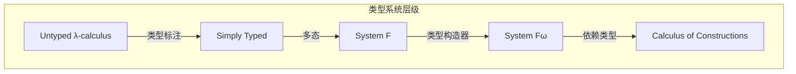
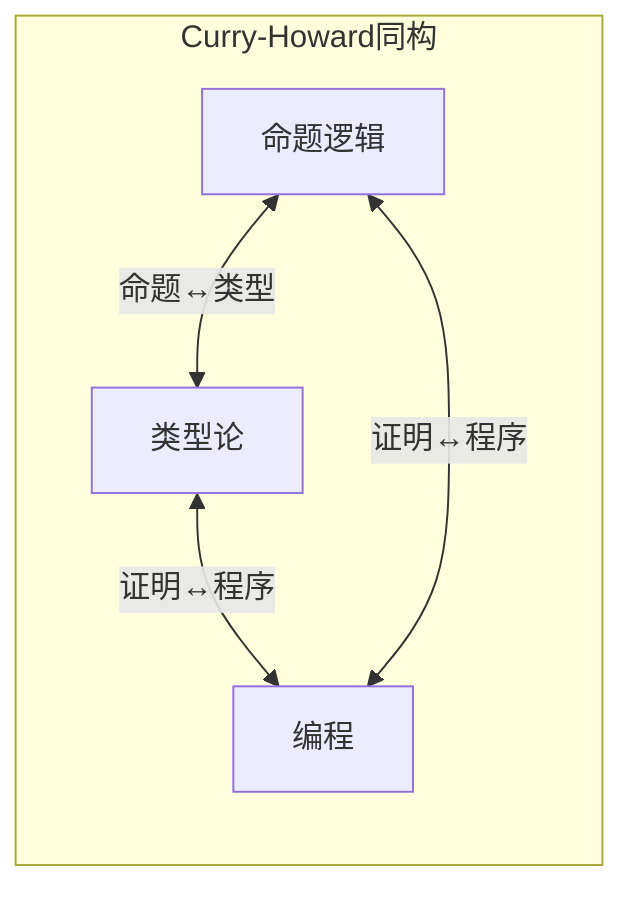
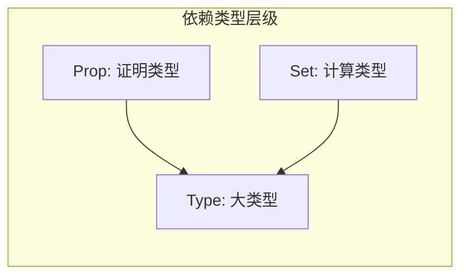
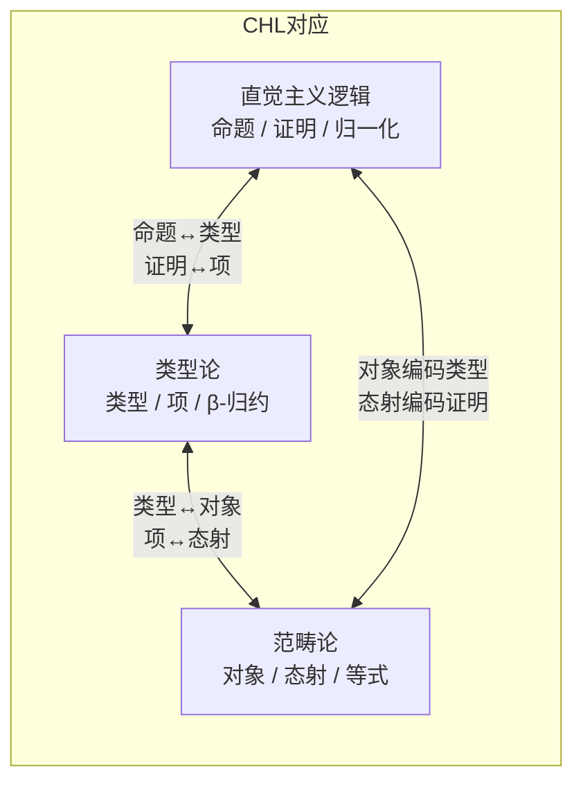
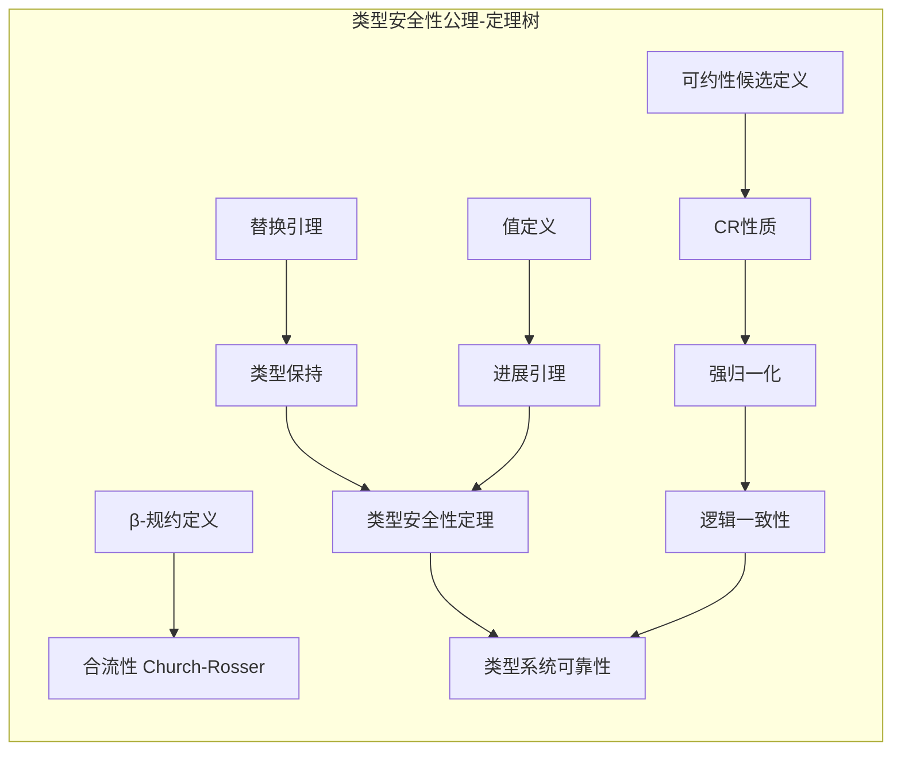
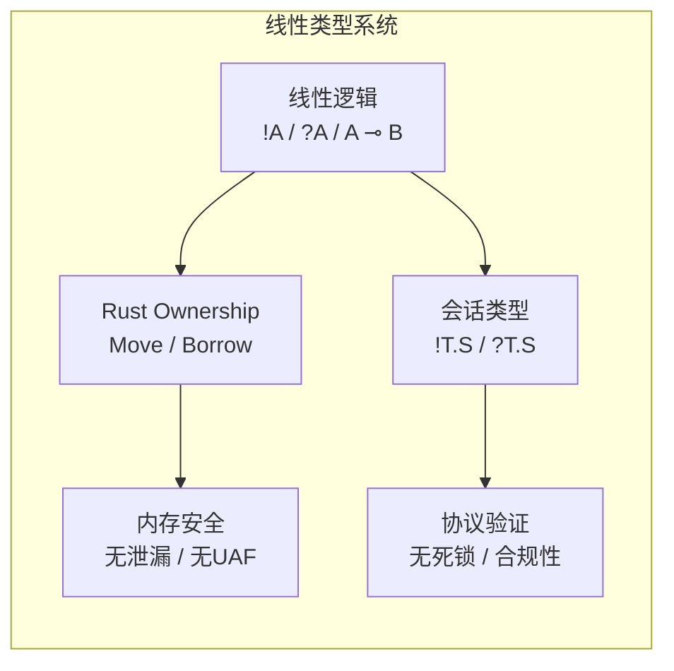

# 类型论基础 (Type Theory Foundations)

> **所属单元**: 01-foundations | **前置依赖**: 04-domain-theory.md | **形式化等级**: L2-L4

## 1. 概念定义

### 1.1 简单类型λ演算 (Simply Typed Lambda Calculus)

**Def-F-05-01: 简单类型**

简单类型由以下文法生成：
$$\sigma, \tau ::= b \mid \sigma \to \tau$$

其中 $b$ 是基本类型 (如 $\text{Int}$, $\text{Bool}$)，$\sigma \to \tau$ 是函数类型。

**Def-F-05-02: 类型上下文**

类型上下文 $\Gamma$ 是变量-类型对的有限序列：
$$\Gamma ::= \emptyset \mid \Gamma, x: \sigma$$

**Def-F-05-03: 类型判断**

类型判断的形式为 $\Gamma \vdash M: \sigma$，表示在上下文 $\Gamma$ 中项 $M$ 具有类型 $\sigma$。

类型规则：

| 规则 | 名称 | 形式 |
|------|------|------|
| 变量 | Var | $\frac{}{\Gamma, x:\sigma \vdash x:\sigma}$ |
| 抽象 | Abs | $\frac{\Gamma, x:\sigma \vdash M:\tau}{\Gamma \vdash \lambda x.M : \sigma \to \tau}$ |
| 应用 | App | $\frac{\Gamma \vdash M:\sigma \to \tau \quad \Gamma \vdash N:\sigma}{\Gamma \vdash M\,N : \tau}$ |

### 1.2 多态类型系统 (System F)

**Def-F-05-04: 多态类型**

System F 类型扩展为：
$$\sigma, \tau ::= b \mid \alpha \mid \sigma \to \tau \mid \forall \alpha. \sigma$$

其中 $\alpha$ 是类型变量，$\forall \alpha. \sigma$ 是全称量化类型。

**Def-F-05-05: 类型抽象与应用**

- 类型抽象: 若 $\Gamma \vdash M: \sigma$ 且 $\alpha$ 不在 $\Gamma$ 中自由出现，则 $\Gamma \vdash \Lambda \alpha. M : \forall \alpha. \sigma$
- 类型应用: 若 $\Gamma \vdash M : \forall \alpha. \sigma$，则 $\Gamma \vdash M[\tau] : \sigma[\tau/\alpha]$

**Def-F-05-06: 类型擦除与实例化**

类型擦除 $|\cdot|$ 将 System F 项映射到无类型λ演算：

- $|\Lambda \alpha. M| = |M|$
- $|M[\tau]| = |M|$

### 1.3 依赖类型入门

**Def-F-05-07: 依赖类型系统 (LF/λP)**

依赖类型允许类型依赖于项：
$$\sigma, \tau ::= b \mid \Pi x:\sigma. \tau \mid \Sigma x:\sigma. \tau$$

其中：

- $\Pi x:\sigma. \tau$ 是依赖函数类型 (若 $x$ 不在 $\tau$ 中自由出现，则退化为 $\sigma \to \tau$)
- $\Sigma x:\sigma. \tau$ 是依赖对类型 (若 $x$ 不在 $\tau$ 中自由出现，则退化为 $\sigma \times \tau$)

**Def-F-05-08: 类型作为命题**

在依赖类型论中：

- 命题是类型
- 证明是项
- 证明检查是类型检查

### 1.4 Curry-Howard对应

**Def-F-05-09: Curry-Howard同构**

命题逻辑与简单类型λ演算的对应：

| 逻辑 | 类型论 | 编程 |
|------|--------|------|
| 命题 $A$ | 类型 $A$ | 数据类型 |
| 证明 | 项 $M: A$ | 程序 |
| $A \Rightarrow B$ | 函数类型 $A \to B$ | 函数 |
| $A \land B$ | 积类型 $A \times B$ | 元组 |
| $A \lor B$ | 和类型 $A + B$ | 变体/枚举 |
| $\forall x. A(x)$ | 依赖类型 $\Pi x:\sigma. A(x)$ | 泛型/参数化 |
| $\exists x. A(x)$ | 存在类型 $\Sigma x:\sigma. A(x)$ | 依赖对 |

**Def-F-05-10: 构造演算 (Calculus of Constructions)**

构造演算统一了：

- 类型作为项: $\ast$ (Prop) 和 $\square$ (Type)
- 依赖乘积: $\Pi x:A. B$ 涵盖 $\forall$ 和 $\to$
- 类型转换规则: $(*, *, \to)$, $(\square, *, \forall)$, $(\square, \square, \to')$, $(*, \square, \Pi')$

---

## 1.5 深入：Curry-Howard同构详解 (CMU 15-814 核心)

### 1.5.1 命题即类型的完整对应表

**Def-F-05-21: Curry-Howard-Lambek 对应（三元对应）**

Curry-Howard-Lambek 对应建立了逻辑、类型论和范畴论之间的深层联系：

| 直觉主义逻辑 | 简单类型λ演算 | 笛卡尔闭范畴 (CCC) |
|-------------|--------------|-------------------|
| 命题 $A$ | 类型 $A$ | 对象 $A$ |
| 证明 $p : A$ | 项 $t : A$ | 态射 $f : 1 \to A$ |
| $A \to B$ (蕴涵) | 函数类型 $A \to B$ | 指数对象 $B^A$ |
| $A \land B$ (合取) | 积类型 $A \times B$ | 范畴积 $A \times B$ |
| $A \lor B$ (析取) | 和类型 $A + B$ | 余积 $A + B$ |
| $\top$ (真) | 单位类型 $1$ (Unit) | 终对象 $1$ |
| $\bot$ (假) | 空类型 $0$ (Void) | 始对象 $0$ |
| $\neg A$ (否定) | $A \to \bot$ | $0^A$ |

**Def-F-05-22: 归一化与证明简化**

- **证明的归一化** ↔ **程序的求值** ↔ **范畴中的等式变换**
- **切消定理 (Cut Elimination)** ↔ **β-归约** ↔ **态射复合的结合律**

### 1.5.2 证明即程序的代码示例

**Coq 示例：证明作为程序**

```coq
(* 命题 A -> (B -> A) 的证明 *)
Theorem implication_intro : forall A B : Prop, A -> (B -> A).
Proof.
  intros A B HA HB.
  exact HA.
Qed.

(* 对应的程序（ML风格表示） *)
(* fun (A : Prop) (B : Prop) (HA : A) (HB : B) => HA *)
(* 即: λA.λB.λHA.λHB. HA *)

(* 合取引入：A -> B -> (A /\ B) *)
Theorem conj_intro : forall A B : Prop, A -> B -> (A /\ B).
Proof.
  intros A B HA HB.
  split.
  - exact HA.
  - exact HB.
Qed.

(* 对应程序: λA.λB.λHA.λHB. (HA, HB) *)

(* 析取消去：(A \/ B) -> (A -> C) -> (B -> C) -> C *)
Theorem disj_elim : forall A B C : Prop, (A \/ B) -> (A -> C) -> (B -> C) -> C.
Proof.
  intros A B C HAB HAC HBC.
  destruct HAB as [HA | HB].
  - apply HAC; exact HA.
  - apply HBC; exact HB.
Qed.

(* 对应程序:
   λHAB.λHAC.λHBC. case HAB of
     inl HA => HAC HA
   | inl HB => HBC HB *)
```

**Lean 4 示例：Curry-Howard 实战**

```lean
-- 自然演绎对应λ项
namespace CurryHoward

-- A → A （恒等函数）
def identity (A : Prop) : A → A :=
  λ a : A => a

-- 交换律：A ∧ B → B ∧ A （交换函数参数）
def and_comm (A B : Prop) : A ∧ B → B ∧ A :=
  λ h : A ∧ B => And.intro h.right h.left

-- 结合律：(A ∧ B) ∧ C → A ∧ (B ∧ C)
def and_assoc (A B C : Prop) : (A ∧ B) ∧ C → A ∧ (B ∧ C) :=
  λ h : (A ∧ B) ∧ C =>
    And.intro h.left.left (And.intro h.left.right h.right)

-- 分配律：A ∧ (B ∨ C) → (A ∧ B) ∨ (A ∧ C)
def distr_and_or (A B C : Prop) : A ∧ (B ∨ C) → (A ∧ B) ∨ (A ∧ C) :=
  λ h : A ∧ (B ∨ C) =>
    match h.right with
    | Or.inl b => Or.inl (And.intro h.left b)
    | Or.inr c => Or.inr (And.intro h.left c)

end CurryHoward

-- 类型族与依赖函数
def Vec (α : Type) (n : Nat) := { l : List α // l.length = n }

-- 证明长度在类型中
def vec_head {α : Type} {n : Nat} (v : Vec α (n + 1)) : α :=
  v.val.head (by simp [Vec] at v; have := v.property; omega)
```

**Haskell 示例：类型即命题**

```haskell
{-# LANGUAGE RankNTypes #-}

-- A -> (B -> A) 对应 const 函数
const :: a -> (b -> a)
const a = \_ -> a

-- (A -> B -> C) -> (A -> B) -> A -> C 对应 S-组合子
sCombinator :: (a -> b -> c) -> (a -> b) -> a -> c
sCombinator f g x = f x (g x)

-- 皮尔斯定律 (经典逻辑) 对应 call/cc
-- ((A -> B) -> A) -> A  -- 仅在经典逻辑中成立
peirce :: forall a b. ((a -> b) -> a) -> a
peirce = error "Requires continuations (classical logic)"

-- 排中律 A ∨ ¬A 对应 Either a (a -> Void)
excludedMiddle :: forall a. Either a (a -> Void)
excludedMiddle = error "Not provable in intuitionistic logic"

-- 双重否定消去 ¬¬A → A 也是经典的
doubleNegElim :: forall a. ((a -> Void) -> Void) -> a
doubleNegElim = error "Classical logic only"
```

### 1.5.3 同构的形式化证明

**Thm-F-05-07: Curry-Howard 同构定理**

设 $\mathcal{L}$ 为直觉主义命题逻辑，$\Lambda$ 为简单类型λ演算，则：

$$\Gamma \vdash_{\mathcal{L}} A \text{ 可证 } \iff \exists t. \Gamma \vdash_{\Lambda} t : A$$

且证明的归一化与程序的求值一一对应。

*证明概要*：

**方向1 (⇒): 逻辑到类型** - 对证明推导进行归纳：

- 公理 $A \vdash A$ 对应变量规则 $\Gamma, x:A \vdash x:A$
- 蕴涵引入 $\frac{\Gamma, A \vdash B}{\Gamma \vdash A \to B}$ 对应抽象规则
- 蕴涵消去 $\frac{\Gamma \vdash A \to B \quad \Gamma \vdash A}{\Gamma \vdash B}$ 对应应用规则

**方向2 (⇐): 类型到逻辑** - 对类型推导进行归纳，提取证明项。

**对应保持性**：

- β-归约 ↔ 证明的切消
- 范式 ↔ 切自由证明
- 强归一化 ↔ 证明的终止性 ∎

---

## 1.6 深入：System F（多态λ演算）

### 1.6.1 全称量词的表示

**Def-F-05-23: System F 的语法（Girard-Reynolds）**

$$\begin{aligned}
\text{Types: } & \tau ::= \alpha \mid \tau \to \tau \mid \forall \alpha. \tau \\
\text{Terms: } & t ::= x \mid \lambda x:\tau.t \mid t\,t \mid \Lambda \alpha.t \mid t[\tau]
\end{aligned}$$

其中：
- $\Lambda \alpha.t$ 是类型抽象（全称引入）
- $t[\tau]$ 是类型实例化（全称消去）

**Def-F-05-24: System F 的类型规则**

| 规则 | 形式 | 逻辑对应 |
|------|------|----------|
| 类型抽象 | $\frac{\Gamma \vdash t : \tau \quad \alpha \notin FV(\Gamma)}{\Gamma \vdash \Lambda \alpha.t : \forall \alpha.\tau}$ | $\forall$-引入 |
| 类型应用 | $\frac{\Gamma \vdash t : \forall \alpha.\tau}{\Gamma \vdash t[\sigma] : \tau[\sigma/\alpha]}$ | $\forall$-消去 |

**与逻辑对应**：System F 对应**二阶直觉主义逻辑** (System $\lambda2$)，其中：
- 类型变量 $\alpha$ 对应命题变量
- $\forall \alpha.\tau$ 对应二阶全称量词

### 1.6.2 参数多态性的形式化

**Def-F-05-25: Reynolds 关系参数性 (Relational Parametricity)**

Reynolds (1983) 证明：System F 中的多态函数满足**关系参数性**，即它们必须以统一方式处理所有类型。

形式化：对任意类型环境 $\eta$ 将类型变量映射到关系，定义逻辑关系 $\mathcal{R}_{\tau,\eta} \subseteq \llbracket \tau \rrbracket_\eta \times \llbracket \tau \rrbracket_\eta$：

- $\mathcal{R}_{\alpha,\eta} = \eta(\alpha)$ （关系本身）
- $\mathcal{R}_{\sigma \to \tau,\eta} = \{(f, g) \mid \forall (x,y) \in \mathcal{R}_{\sigma,\eta}. (f x, g y) \in \mathcal{R}_{\tau,\eta}\}$
- $\mathcal{R}_{\forall \alpha.\tau,\eta} = \{(u, v) \mid \forall R \in Rel(A,B). (u_A, v_B) \in \mathcal{R}_{\tau,\eta[\alpha \mapsto R]}\}$

**Thm-F-05-08: 基本定理 (Fundamental Theorem)**

若 $\Gamma \vdash t : \tau$，则对所有满足 $\Gamma$ 的替换 $\rho$，有 $(t_\rho, t_\rho) \in \mathcal{R}_{\tau,\rho}$。

**Thm-F-05-09: 自由定理 (Free Theorems)**

从参数性可推导出"自由定理"。例如，对 $\text{map} : \forall \alpha\beta.(\alpha \to \beta) \to \text{List}\,\alpha \to \text{List}\,\beta$：

$$\forall f, g.\, g \circ \text{map}\,f = \text{map}\,f \circ g \text{ 当 } g \text{ 是同态时}$$

更著名的自由定理：
- 对 $\text{id} : \forall \alpha.\alpha \to \alpha$，必有 $\text{id} = \Lambda \alpha.\lambda x:\alpha.x$ （ Church 定理）
- 对 $\text{filter} : \forall \alpha.(\alpha \to \text{Bool}) \to \text{List}\,\alpha \to \text{List}\,\alpha$，保持顺序且输出是子序列

### 1.6.3 System F 的强归一化定理详细证明

**Thm-F-05-10: System F 强归一化 (Girard, 1972)**

所有良类型的 System F 项都是强归约的（不存在无限归约序列）。

*详细证明* (Girard 的可约性候选方法)：

**步骤1: 可约性候选的定义**

对每个类型 $\tau$，定义集合 $\text{RED}_\tau \subseteq \{t \mid t : \tau\}$：

- **基类型** (如 Nat): $\text{RED}_{\text{Nat}}$ 是所有强归约的自然数项
- **函数类型**: $t \in \text{RED}_{\sigma \to \tau}$ 当且仅当对所有 $u \in \text{RED}_\sigma$，有 $t\,u \in \text{RED}_\tau$
- **全称类型**: $t \in \text{RED}_{\forall \alpha.\tau}$ 当且仅当对所有类型 $\sigma$，有 $t[\sigma] \in \text{RED}_{\tau[\sigma/\alpha]}$

**步骤2: 可约性候选的性质 (CR1-CR3)**

对任意 $\text{RED}_\tau$：
- **(CR1)** 若 $t \in \text{RED}_\tau$，则 $t$ 是强归约的
- **(CR2)** 若 $t \in \text{RED}_\tau$ 且 $t \to t'$，则 $t' \in \text{RED}_\tau$
- **(CR3)** 若 $t$ 是中性项（neither redex nor abstraction）且所有一步归约 $t \to t'$ 都有 $t' \in \text{RED}_\tau$，则 $t \in \text{RED}_\tau$

**步骤3: 关键引理**

*引理1*: 若 $t[\sigma/\alpha]$ 强归约且 $t$ 中性，则 $\Lambda \alpha.t$ 强归约。

*引理2* (替换): 若 $u \in \text{RED}_\sigma$，则 $t[u/x] \in \text{RED}_\tau$ 当 $t \in \text{RED}_\tau$ 且 $x:\sigma$。

**步骤4: 主归纳**

对推导 $\Gamma \vdash t : \tau$ 进行结构归纳，证明：

> 对所有满足 $\gamma \in \text{RED}_\Gamma$ 的替换，有 $t[\gamma] \in \text{RED}_\tau$。

基本情况（变量、λ-抽象、应用）同简单类型λ演算。

全称情况：
- 对 $\Lambda \alpha.t : \forall \alpha.\tau$，需证对所有 $\sigma$，$(\Lambda \alpha.t)[\gamma][\sigma] \in \text{RED}_{\tau[\sigma/\alpha]}$
- 即 $t[\gamma][\sigma/\alpha] \in \text{RED}_{\tau[\sigma/\alpha]}$，由归纳假设成立

**结论**: 所有良类型项属于某 $\text{RED}_\tau$，故强归约。∎

**推论**: System F 是**逻辑一致的**（无通用类型 $\forall \alpha.\alpha$ 的 inhabitant）。

---

## 1.7 深入：依赖类型详解

### 1.7.1 Π类型和Σ类型的完整形式化

**Def-F-05-26: Π类型（依赖函数类型）**

设 $A$ 是类型，$B(x)$ 是依赖于 $x:A$ 的类型族，则：

$$\Pi x:A. B(x) = \{ f \mid \forall x:A, f(x) : B(x) \}$$

类型规则：

$$\frac{\Gamma, x:A \vdash b : B(x)}{\Gamma \vdash \lambda x.b : \Pi x:A.B(x)} \text{ (Π-intro)} \quad
\frac{\Gamma \vdash f : \Pi x:A.B(x) \quad \Gamma \vdash a : A}{\Gamma \vdash f(a) : B[a/x]} \text{ (Π-elim)}$$

**与逻辑对应**: $\Pi x:A. B(x)$ 对应**全称量词** $\forall x:A. B(x)$

**Def-F-05-27: Σ类型（依赖对/存在类型）**

$$\Sigma x:A. B(x) = \{ (a, b) \mid a : A \text{ 且 } b : B(a) \}$$

构造与消去：

$$\frac{\Gamma \vdash a : A \quad \Gamma \vdash b : B(a)}{\Gamma \vdash (a, b) : \Sigma x:A.B(x)} \text{ (Σ-intro)}$$

$$\frac{\Gamma \vdash p : \Sigma x:A.B(x)}{\Gamma \vdash \pi_1(p) : A} \text{ (Σ-elim-1)} \quad
\frac{\Gamma \vdash p : \Sigma x:A.B(x)}{\Gamma \vdash \pi_2(p) : B(\pi_1(p))} \text{ (Σ-elim-2)}$$

**与逻辑对应**: $\Sigma x:A. B(x)$ 对应**存在量词** $\exists x:A. B(x)$
- $(a, b) : \Sigma x:A.B(x)$ 对应存在引入：见证 $a$ 和证明 $b$
- 依赖消除对应存在消去

### 1.7.2 与一阶逻辑的量词对应

**Prop-F-05-11: 依赖类型中的量词规则**

| 一阶逻辑 | 依赖类型 | 说明 |
|---------|---------|------|
| $\forall$-intro | $\Pi$-intro | 从 $B(x)$ 构造 $\Pi x:A.B(x)$ |
| $\forall$-elim | $\Pi$-elim / 应用 | 全称实例化 $f(a) : B(a)$ |
| $\exists$-intro | $\Sigma$-intro | 配对构造 $(a, b)$ |
| $\exists$-elim | $\Sigma$-elim（依赖消去）| 模式匹配提取见证和证明 |

**Thm-F-05-11: 量词的Curry-Howard对应**

$$\begin{aligned}
\Gamma \vdash \forall x:A. B(x) &\Leftrightarrow \Gamma \vdash \Pi x:A. B(x) \text{ 有 inhabitant} \\
\Gamma \vdash \exists x:A. B(x) &\Leftrightarrow \Gamma \vdash \Sigma x:A. B(x) \text{ 有 inhabitant}
\end{aligned}$$

**唯一性量词**：
- 在依赖类型中，$\exists! x:A. B(x)$ 编码为 $\Sigma x:A. (B(x) \times \Pi y:A. B(y) \to x =_A y)$
- 即：见证 + 证明 + 唯一性证明

### 1.7.3 Coq的CIC演算详细说明

**Def-F-05-28: 归纳构造演算 (CIC)**

Coq 基于**归纳构造演算** (Calculus of Inductive Constructions)，是 Coquand-Huet 构造演算的扩展：

**类型层级 (Universe)**：

$$\text{Sort} ::= \text{Prop} \mid \text{Set} \mid \text{Type}_i \ (i \in \mathbb{N})$$

- **Prop**: 证明类型（逻辑命题），属于计算无关的宇宙
- **Set**: 计算类型（程序数据）
- **Type_i**: 类型构造器的类型层级，满足 $\text{Prop}, \text{Set} : \text{Type}_0 : \text{Type}_1 : \cdots$

**公理规则 (Axioms)**：

$$\frac{}{\text{Prop} : \text{Type}_0} \quad \frac{}{\text{Set} : \text{Type}_0} \quad \frac{}{\text{Type}_i : \text{Type}_{i+1}}$$

**乘积规则 (Products)**：

| 规则 | $s_1$ | $s_2$ | $(s_1, s_2)$ | 说明 |
|------|-------|-------|--------------|------|
| $(*, *, \to)$ | Set | Set | Set | 普通函数 |
| $(\square, *, \forall)$ | Type | Set | Set | 多态函数 |
| $(\square, \square, \to')$ | Type | Type | Type | 类型级函数 |
| $(*, \square, \Pi')$ | Set | Type | Type | 谓词/关系 |
| $(\square, \text{Prop}, \forall_\text{P})$ | Type | Prop | Prop | 全称量词 |
| $(\text{Prop}, *, \to_\text{P})$ | Prop | Set | Set | 逻辑蕴含提取信息 |

**Def-F-05-29: 归纳类型**

CIC 允许定义归纳类型：

```coq
Inductive Nat : Set :=
  | O : Nat
  | S : Nat -> Nat.
```

形式化：$\text{Nat} = \mu X. 1 + X$ （最小不动点）

**归纳原理**（自动生成）：

$$\forall P:\text{Nat} \to \text{Prop}.\, P(O) \to (\forall n.\, P(n) \to P(S(n))) \to \forall n.\, P(n)$$

**Def-F-05-30: 共归纳类型**

Coq 支持共归纳类型（最大不动点）：

```coq
CoInductive Stream (A : Type) : Type :=
  | Cons : A -> Stream A -> Stream A.
```

共归纳原理允许构造和观察无限结构。

---

## 1.8 深入：子类型和面向对象

### 1.8.1 子类型关系的形式化

**Def-F-05-31: 子类型关系 (Subtyping)**

子类型关系 $\sigma <: \tau$ 表示"$\sigma$ 是 $\tau$ 的子类型"（任何 $\sigma$ 值都可用作 $\tau$ 值）。

基本规则：

| 规则 | 形式 | 名称 |
|------|------|------|
| 自反 | $\frac{}{\tau <: \tau}$ | Refl |
| 传递 | $\frac{\sigma <: \tau \quad \tau <: \rho}{\sigma <: \rho}$ | Trans |
| 函数逆变/协变 | $\frac{\tau_1 <: \sigma_1 \quad \sigma_2 <: \tau_2}{\sigma_1 \to \sigma_2 <: \tau_1 \to \tau_2}$ | Arrow |

**Liskov替换原则 (LSP)**：若 $\sigma <: \tau$，则任何期望 $\tau$ 的上下文 $C[\cdot]$ 可被 $\sigma$ 值安全替换而不改变行为。

### 1.8.2 记录类型和宽度/深度子类型

**Def-F-05-32: 记录类型**

记录类型 $\{l_1:\tau_1, \ldots, l_n:\tau_n\}$ 表示具有标记字段的乘积。

**宽度子类型 (Width Subtyping)**：

$$\frac{}{\{l_1:\tau_1, \ldots, l_n:\tau_n, l_{n+1}:\tau_{n+1}\} <: \{l_1:\tau_1, \ldots, l_n:\tau_n\}} \text{ (Width)}$$

即：更多字段的子类型可以替换更少字段的超类型。

**深度子类型 (Depth Subtyping)**：

$$\frac{\sigma_1 <: \tau_1 \quad \cdots \quad \sigma_n <: \tau_n}{\{l_1:\sigma_1, \ldots, l_n:\sigma_n\} <: \{l_1:\tau_1, \ldots, l_n:\tau_n\}} \text{ (Depth)}$$

即：字段类型可子类型化。

**排列子类型 (Permutation)**：

$$\frac{\pi \text{ 是 } \{1,\ldots,n\} \text{ 的排列}}{\{l_1:\tau_1, \ldots, l_n:\tau_n\} <: \{l_{\pi(1)}:\tau_{\pi(1)}, \ldots, l_{\pi(n)}:\tau_{\pi(n)}\}} \text{ (Perm)}$$

**Def-F-05-33: 递归类型与子类型**

对象类型常涉及递归：

$$\mu X.\{ \text{method}_1 : \tau_1, \text{method}_2 : X \to \tau_2 \}$$

子类型规则需处理**展开后的等价性**（Amber规则）。

### 1.8.3 与面向对象语言类型的关系

**Prop-F-05-12: 面向对象类型构造的编码**

| OO 概念 | 类型论编码 | 说明 |
|--------|-----------|------|
| 类/接口 | 记录类型 + 存在类型 | 隐藏实现 |
| 继承 | 记录组合 + 子类型 | 代码复用 |
| 多态 | 全称类型 + 有界量化 | $\forall \alpha <: \tau.\sigma$ |
| 虚方法 | 高阶函数 + 记录 | vtable 编码 |
| Self 类型 | 递归类型 | $\mu X.\{\ldots, \text{self}: X\}$ |

**Def-F-05-34: 有界多态 (Bounded Polymorphism)**

F-有界子类型：$\forall \alpha <: \tau.\sigma$ 要求类型参数 $\alpha$ 必须是 $\tau$ 的子类型。

用于表达：
```java
// [伪代码片段 - 不可直接运行] 仅展示核心逻辑
<T extends Comparable<T>> T max(T a, T b)
```

**Thm-F-05-12: 子类型与多态的交互**

**反变与协变**（函数子类型）：
- 参数位置：逆变（Contravariant）
- 返回位置：协变（Covariant）

形式化：
$$\frac{\sigma' <: \sigma \quad \tau <: \tau'}{\sigma \to \tau <: \sigma' \to \tau'}$$

这与面向对象中方法重写的类型检查一致。

**与 System F 的扩展 (System $F_{<:}$)**：

$$\tau ::= \ldots \mid \forall \alpha <: \tau.\tau \mid \alpha$$

子类型关系在类型变量上传播：
$$\frac{\alpha <: \tau \in \Gamma}{\Gamma \vdash \alpha <: \tau}$$

---

## 1.9 深入：线性类型和会话类型

### 1.9.1 线性逻辑基础

**Def-F-05-35: 线性逻辑 (Girard, 1987)**

线性逻辑区分**线性资源**（必须恰好使用一次）和**指数资源**（可任意复制/丢弃）。

**线性命题连接词**：

| 连接词 | 记法 | 含义 | 对应 |
|--------|------|------|------|
| 线性蕴涵 | $A \multimap B$ | 消耗A产生B | 线性函数 |
| 张量积 | $A \otimes B$ | 同时使用A和B | 线性对 |
| 张量单位 | $1$ | 空资源 | Unit |
| 余积 | $A \oplus B$ | 选择A或B | 变体 |
| 合取 | $A \& B$ | 提供两者选择 | 内部选择 |
| 指数 | $!A$ | 可复制的A | 指数模态 |
| 指数 | $?A$ | 可丢弃的A | 余指数 |

**线性规则（与直觉主义逻辑对比）**：

- **弱化** (Weakening): 在直觉主义中允许，在线性中禁止（除非使用 $?A$）
- **收缩** (Contraction): 在直觉主义中允许，在线性中禁止（除非使用 $!A$）
- **交换** (Exchange): 两者都允许

**Def-F-05-36: 线性类型系统**

类型上下文 $\Gamma$ 现在是**多集**，每个假设恰好使用一次：

$$\frac{}{x:A \vdash x : A} \text{ (Var)}$$

$$\frac{\Gamma, x:A \vdash t : B}{\Gamma \vdash \lambda x.t : A \multimap B} \text{ (L-Abs)}$$

$$\frac{\Gamma_1 \vdash t : A \multimap B \quad \Gamma_2 \vdash u : A}{\Gamma_1, \Gamma_2 \vdash t(u) : B} \text{ (L-App)}$$

注意：在应用规则中，上下文被分割（$\Gamma_1$ 和 $\Gamma_2$），确保资源不重复。

### 1.9.2 资源敏感的类型系统

**Def-F-05-37: 仿射类型 (Affine Types)**

仿射类型允许**丢弃**（weakening）但不允许**复制**（contraction）：

$$\frac{\Gamma \vdash t : B}{\Gamma, x:A \vdash t : B} \text{ (Affine-Weak)}$$

**应用**：Rust 的 ownership 系统使用仿射类型保证内存安全。

**Def-F-05-38: 分级类型 (Graded Types)**

更精细的资源追踪，用量词 $r \in \mathcal{R}$ 标记：

$$\Gamma = x_1 :_{r_1} A_1, \ldots, x_n :_{r_n} A_n$$

用量可以是：$0$（不使用）、$1$（恰好一次）、$\omega$（任意次数）、$[0..1]$（可选）等。

**规则示例**：
$$\frac{\Gamma_1 \vdash t : A \quad \Gamma_2 \vdash u : B \quad r = r_1 + r_2}{\Gamma_1 + \Gamma_2 \vdash (t, u) : A \otimes B}$$

### 1.9.3 会话类型用于并发验证

**Def-F-05-39: 会话类型 (Session Types)**

会话类型描述通信协议，由类型确保进程遵守协议[^1]。

**基本会话类型**：

$$S ::= \text{end} \mid {?T}.S \mid {!T}.S \mid \oplus\{l_1:S_1, \ldots, l_n:S_n\} \mid \&\{l_1:S_1, \ldots, l_n:S_n\} \mid \mu X.S \mid X$$

- ${?T}.S$：接收类型 $T$ 后继续 $S$
- ${!T}.S$：发送类型 $T$ 后继续 $S$
- $\oplus\{\ldots\}$：选择分支（外部选择）
- $\&\{\ldots\}$：提供分支（内部选择）
- $\mu X.S$：递归协议

**示例 - 队列协议**：

```
QueueServer = &{ enq: ?Int.QueueServer
               , deq: ⊕{ some: !Int.QueueServer
                       , none: QueueServer }
               , quit: end }
```

**对偶性 (Duality)**：

每个会话类型 $S$ 有对偶 $\overline{S}$（角色互换）：

$$\overline{{?T}.S} = {!T}.\overline{S} \quad \overline{{!T}.S} = {?T}.\overline{S} \quad \overline{\oplus\{l_i:S_i\}} = \&\{l_i:\overline{S_i}\}$$

**Thm-F-05-13: 会话类型安全性**

若进程 $P$ 具有会话类型 $S$ 且 $Q$ 具有 $\overline{S}$，则：
1. 通信不会卡住（进展性）
2. 不会违反协议（保型性）
3. 通道最终关闭（终止性，若为递归良定义）

**Def-F-05-40: 多通道会话类型**

扩展至多个通道（MPST - Multiparty Session Types）：

$$\text{Global}: G ::= p \to q : \{l_i(T_i).G_i\} \mid \mu X.G \mid X \mid \text{end}$$

全局类型投影到各参与者的本地类型，确保分布式一致性。

---

## 2. 属性推导

### 2.1 类型安全基本定理

**Lemma-F-05-01: 替换引理 (Substitution)**

若 $\Gamma, x:\sigma \vdash M:\tau$ 且 $\Gamma \vdash N:\sigma$，则 $\Gamma \vdash M[N/x]:\tau$。

*证明概要*: 对 $M$ 的推导进行归纳。

**Lemma-F-05-02: 类型保持 (Preservation)**

若 $\Gamma \vdash M:\sigma$ 且 $M \to_\beta M'$，则 $\Gamma \vdash M':\sigma$。

*证明概要*: 对归约关系 $\to_\beta$ 进行归纳。

**Lemma-F-05-03: 进展 (Progress)**

若 $\vdash M:\sigma$ 且 $M$ 是闭项，则要么 $M$ 是值，要么存在 $M'$ 使得 $M \to M'$。

*证明概要*: 对 $M$ 的类型推导进行归纳。

### 2.2 多态性的表达能力

**Prop-F-05-01: Church编码**

在 System F 中可编码：

- 自然数: $\mathbb{N} = \forall \alpha. (\alpha \to \alpha) \to \alpha \to \alpha$
  - $0 = \Lambda \alpha. \lambda f. \lambda x. x$
  - $\text{succ} = \lambda n. \Lambda \alpha. \lambda f. \lambda x. f\,(n[\alpha]\,f\,x)$

- 布尔值: $\mathbb{B} = \forall \alpha. \alpha \to \alpha \to \alpha$
  - $\text{true} = \Lambda \alpha. \lambda t. \lambda f. t$
  - $\text{false} = \Lambda \alpha. \lambda t. \lambda f. f$

**Prop-F-05-02: 参数多态性**

参数多态性保证：多态函数必须"统一地"对待所有类型实例。

形式化 (Reynolds): 自然变换性质
$$\forall f: \sigma \to \tau.\; g_\tau \circ \text{map}(f) = f \circ g_\sigma$$

### 2.3 依赖类型的规约性质

**Prop-F-05-03: 强归约性**

构造演算具有强归约性：所有良类型项都有有限归约序列。

**Prop-F-05-04: 类型检查的可判定性**

对纯构造演算，类型检查是：

- **可判定的** (给定完整类型标注)
- **不可判定的** (类型重构)

### 2.4 线性类型性质

**Lemma-F-05-04: 线性唯一性**

在线性类型系统中，若 $\Gamma \vdash t : A$ 且 $x :_1 B \in \Gamma$，则 $x$ 在 $t$ 中恰好出现一次。

**Prop-F-05-13: 资源守恒**

线性程序的资源使用可静态预测：无内存泄漏（不能丢弃）和无使用-after-free（不能复制）。

---

## 3. 关系建立

### 3.1 类型系统与范畴论语义

**Prop-F-05-05: CCC与简单类型**

笛卡尔闭范畴 (CCC) 是简单类型λ演算的语义模型：

| 类型论 | 范畴论 |
|--------|--------|
| 类型 $A$ | 对象 $A$ |
| 函数类型 $A \to B$ | 指数对象 $B^A$ |
| 积类型 $A \times B$ | 范畴积 $A \times B$ |
| 项 $x:A \vdash M:B$ | 态射 $f: A \to B$ |
| 替换 | 复合 |
| $\beta$-归约 | 态射相等 |

**Prop-F-05-06: 多态性的范畴语义**

System F 的语义需要**索引范畴**或**多范畴 (multicategory)**。

**Prop-F-05-14: 依赖类型的范畴语义（局部积闭范畴）**

| 依赖类型 | 范畴论构造 |
|---------|-----------|
| $\Pi x:A.B(x)$ | 右伴随 $\prod_f$ (依赖积) |
| $\Sigma x:A.B(x)$ | 左伴随 $\sum_f$ (依赖和) |
| 类型族 | 纤维化 (Fibration) |
| 恒等类型 $x =_A y$ | 路径对象 / 对角映射 |

### 3.2 类型论与形式化验证

| 类型系统 | 验证能力 | 工具代表 |
|----------|---------|----------|
| 简单类型 | 基础程序正确性 | OCaml, Haskell |
| System F | 参数化抽象 | 泛型库验证 |
| 依赖类型 | 完整规范证明 | Coq, Agda, Lean |
| 线性类型 | 资源管理 | Rust, Linear Haskell |
| 会话类型 | 协议合规 | Chorλ, Rusty Variation |

### 3.3 类型与流处理系统

**Prop-F-05-07: 流类型的形式化**

流类型可编码为：
$$\text{Stream}(A) = \nu X. A \times X$$

这是 $A$-标记无限流的余代数类型。

---

## 4. 论证过程

### 4.1 为什么需要多态性？

**代码复用**: 单一实现适用于所有类型
$$\text{id} = \Lambda \alpha. \lambda x:\alpha. x : \forall \alpha. \alpha \to \alpha$$

**类型安全**: 消除类型转换的 runtime 开销

**抽象**: 隐藏实现细节，只暴露接口类型

### 4.2 依赖类型的实用性挑战

**优势**:

- 规范即类型，证明即程序
- 完全可验证的软件系统

**挑战**:

- 证明负担重
- 类型推断困难
- 编译时间长

**工业实践**:

- Coq: 数学证明 (四色定理、CompCert编译器)
- Agda: 依赖类型编程
- Lean: 数学形式化与教学
- F*: 验证加密协议

### 4.3 Curry-Howard的工程意义

Curry-Howard 对应使得：

- 类型系统 = 轻量级形式化验证
- 类型检查 = 自动化证明检查
- 类型推断 = 证明自动化

这是现代类型安全语言 (Rust, Swift, Scala 3) 的理论基础。

### 4.4 线性类型与资源管理

**Rust 的 ownership 系统**本质上是一种**仿射类型系统**：

```rust
// 所有权转移（线性）
let s1 = String::from("hello");
let s2 = s1;  // s1 被移动，之后不可用
// println!("{}", s1);  // 编译错误！

// 借用（共享/可变借用规则）
fn borrow(s: &String) -> usize { s.len() }
```

**会话类型与流处理**：
- 确保算子连接符合协议
- 编译时检测死锁/活锁
- 自动推断缓冲区需求

---

## 5. 形式证明 / 工程论证

### 5.1 类型安全性定理

**Thm-F-05-01: 类型安全性 (Type Safety)**

对简单类型λ演算，若 $\vdash M:\sigma$ 且 $M \to^* N$，则：

1. **保持性**: $\vdash N:\sigma$
2. **进展性**: $N$ 是值，或存在 $N'$ 使得 $N \to N'$

*证明*: 由引理 F-05-02 (保持) 和引理 F-05-03 (进展) 组合。

**Thm-F-05-02: 强归约性 (Strong Normalization)**

所有良类型的简单类型λ演算项都是强归约的。

*证明概要* (Girard 的可约性方法):

**步骤1**: 定义可约性候选集 $\text{RED}_\sigma$。

- $\text{RED}_b$: 强归约的基类型项
- $\text{RED}_{\sigma \to \tau}$: 将 $\text{RED}_\sigma$ 映射到 $\text{RED}_\tau$ 的项

**步骤2**: 证明所有可约项都是强归约的。

**步骤3**: 证明所有良类型项都是可约的 (对推导归纳)。∎

### 5.2 System F 的一致性与表达能力

**Thm-F-05-03: System F 的一致性**

System F 是逻辑一致的：不存在闭项 $M$ 使得 $\vdash M : \forall \alpha. \alpha$。

*证明*: 由强归约性，若存在这样的 $M$，则对任意类型 $\sigma$，$M[\sigma]$ 必须归约到该类型的值。但不同类型有不同的值集合，矛盾。∎

**Thm-F-05-04: Girard-Reynolds 同构**

System F 的语法模型与范畴模型之间存在同构：
$$\llbracket \sigma \rrbracket_\eta = \llbracket \tau \rrbracket_\eta \Rightarrow \sigma =_\alpha \tau$$

其中 $=_\alpha$ 是 $\alpha$-等价。

### 5.3 依赖类型的元理论

**Thm-F-05-05: 构造演算的一致性**

构造演算是强归一化的，因此是一致的。

*证明概要* (Coquand): 使用 Tait-Girard 可约性方法的扩展版本。

关键观察：

1. 类型层级 $(*, \square)$ 避免了罗素悖论
2. 依赖乘积的规约保持类型正确性
3. 所有证明项都归约到规范形式

### 5.4 线性类型安全性

**Thm-F-05-14: 线性程序无泄漏**

若 $\vdash t : A$ 在线性类型系统中，且 $t$ 归约完成，则所有线性资源恰好被消耗一次。

*证明*: 由上下文分割规则确保资源线性使用。∎

---

## 6. 实例验证

### 6.1 示例：类型化流处理算子

在简单类型λ演算中定义流操作：

```
head : Stream(A) → A
head = λs. π₁(unfold s)

tail : Stream(A) → Stream(A)
tail = λs. π₂(unfold s)

map : (A → B) → Stream(A) → Stream(B)
map = λf. λs. fold (f (head s), map f (tail s))
```

### 6.2 示例：多态列表操作

在 System F 中：

```
List(A) = ∀α. (A → α → α) → α → α

nil : ∀A. List(A)
nil = ΛA. Λα. λc. λn. n

cons : ∀A. A → List(A) → List(A)
cons = ΛA. λx. λxs. Λα. λc. λn. c x (xs[α] c n)

length : ∀A. List(A) → ℕ
length = ΛA. λxs. xs[ℕ] (λx. λn. succ n) 0
```

### 6.3 示例：带长度的向量类型

在依赖类型中：

```
Vec : Type → ℕ → Type
Vec A 0 = Unit
Vec A (n+1) = A × Vec A n

head : ∀A. ∀n:ℕ. Vec A (n+1) → A
head = λA. λn. λv. π₁ v

append : ∀A. ∀m,n:ℕ. Vec A m → Vec A n → Vec A (m+n)
```

类型保证 `head` 不会被应用到空向量。

### 6.4 示例：Curry-Howard证明构造

证明 $A \Rightarrow (B \Rightarrow A)$：

```
proof : A → (B → A)
proof = λa:A. λb:B. a
```

对应于直觉主义逻辑中的蕴涵引入规则。

### 6.5 扩展：System Fω 完整定义

**Def-F-05-11: System Fω 的类型层级 (CMU 15-814)**

System Fω 引入类型构造器的 kind 层级：

$$\kappa ::= * \mid \kappa_1 \to \kappa_2$$

- $*$: 具体类型 (如 `Int`, `Bool`)
- $\kappa_1 \to \kappa_2$: 类型构造器 (如 `List`, `Tree`)

**Def-F-05-12: System Fω 语法**

$$\begin{aligned}
\text{Kinds: } & \kappa ::= * \mid \kappa \to \kappa \\
\text{Types: } & \tau ::= \alpha \mid \tau \to \tau \mid \forall \alpha:\kappa.\tau \mid \lambda \alpha:\kappa.\tau \mid \tau\,\tau \\
\text{Terms: } & e ::= x \mid \lambda x:\tau.e \mid e\,e \mid \Lambda \alpha:\kappa.e \mid e[\tau]
\end{aligned}$$

**Def-F-05-13: 高阶类型实例**

| 类型 | Kind | 说明 |
|------|------|------|
| `Int` | $*$ | 具体类型 |
| `List` | $* \to *$ | 一阶构造器 |
| `Functor` | $(* \to *) \to *$ | 高阶构造器 |
| `Monad` | $(* \to *) \to *$ | 高阶构造器 |

### 6.6 扩展：归纳类型与共归纳类型

**Def-F-05-14: 归纳类型 (Inductive Types)**

归纳类型由构造器定义，是最小不动点 $\mu X.F(X)$：

$$\text{Inductive } T \text{ where } \{c_i : F_i(T) \to T\}_{i=1}^n$$

**示例 - 自然数**:
```
Inductive Nat :=
  | O : Nat
  | S : Nat -> Nat
```

语义：$\mathbb{N} = \mu X. 1 + X$

**Def-F-05-15: 共归纳类型 (Coinductive Types)**

共归纳类型由观察器定义，是最大不动点 $\nu X.F(X)$：

$$\text{CoInductive } C \text{ where } \{obs_i : C \to T_i\}_{i=1}^n$$

**示例 - 无限流**:
```
CoInductive Stream(A) :=
  | head : Stream A -> A
  | tail : Stream A -> Stream A
```

语义：$\text{Stream}(A) = \nu X. A \times X$

**Prop-F-05-08: 归纳 vs 共归纳**

| 特性 | 归纳类型 | 共归纳类型 |
|------|----------|-----------|
| 不动点 | 最小 ($\mu$) | 最大 ($\nu$) |
| 引入方式 | 构造器 | 观察器 |
| 递归 | 结构递归 (必须终止) | Guarded 递归 (必须产出) |
| 示例 | 自然数、有限列表 | 无限流、进程 |

### 6.7 扩展：依赖模式匹配

**Def-F-05-16: 依赖模式匹配 (Dependent Pattern Matching)**

依赖模式匹配允许类型随模式分支细化：

```agda
append : ∀{A}{m n : ℕ} → Vec A m → Vec A n → Vec A (m + n)
append []        ys = ys                    -- m = 0, 返回 Vec A n
append (x :: xs) ys = x :: append xs ys     -- m = suc m', 返回 Vec A (suc (m' + n))
```

**Def-F-05-17: 统一化在模式匹配中的作用**

在分支内部，类型系统从模式约束中推导出等式：

- 模式 `[]` 统一 `m` 与 `0`
- 模式 `(x :: xs)` 统一 `m` 与 `suc m'`

这允许类型检查器验证 `append` 返回类型的正确性。

### 6.8 扩展：类型族 (Type Families)

**Def-F-05-18: 类型族定义**

类型族是从值到类型的映射：

$$F : \Pi x:A. *$$

**示例 - 有限类型**:
```agda
Fin : ℕ → Set
Fin 0       = ⊥           -- 空类型
Fin (suc n) = ⊤ + Fin n   -- 单位类型与 Fin n 的和
```

**Def-F-05-19: 索引类型族 (Inductive Families)**

索引类型族是依赖于参数的归纳定义：

```agda
data Vec (A : Set) : ℕ → Set where
  nil  : Vec A 0
  cons : ∀{n} → A → Vec A n → Vec A (suc n)
```

这里 `Vec A` 是一个类型族，`n : ℕ` 是索引。

**Def-F-05-20: 类型族的应用**

| 应用 | 类型族 | 说明 |
|------|--------|------|
| 定长向量 | `Vec A n` | 长度在类型中 |
| 类型安全查找 | `lookup : ∀{n} → Fin n → Vec A n → A` | 索引在范围内 |
| 排序列表 | `SortedList A` | 元素有序 |
| 平衡树 | `AVL A h` | 高度在类型中 |

**Thm-F-05-06: 依赖类型消除运行时检查**

使用类型族可以在编译时证明性质，消除运行时检查：

```agda
-- 传统方式: 可能抛出异常
head : List a -> a

-- 依赖类型方式: 类型保证安全
head : Vec a (suc n) -> a
```

第二种形式的 `head` 无法应用于空列表，类型检查会拒绝。

### 6.9 线性类型示例

**Rust 风格的线性类型**：

```rust
// 线性资源：文件句柄
fn process_file() {
    let file = File::open("data.txt");  // 获得所有权
    let contents = read_to_string(file); // 移动所有权
    // file 不再可用！
}

// 会话类型：通信协议
type Client = !String.?Int.end;  // 发送String，接收Int，结束
type Server = ?String.!Int.end;  // 接收String，发送Int，结束

fn client_send(c: Client, msg: String) -> ?Int.end {
    send(c, msg)  // 类型变为 ?Int.end
}
```

---

## 7. 可视化

### 7.1 类型系统层级



### 7.2 Curry-Howard对应



### 7.3 类型推导树示例

```mermaid
graph TD
    subgraph 类型推导
    A[Γ, x:σ ⊢ x:σ] --> B[Γ ⊢ λx.x : σ→σ]
    B --> C[Γ ⊢ (λx.x) y : σ]
    D[Γ ⊢ y:σ] --> C
    end
```

### 7.4 依赖类型结构



### 7.5 Curry-Howard-Lambek 三元对应



### 7.6 类型系统安全性定理链（八维表征）



### 7.7 线性逻辑与资源类型



### 7.8 CCC与类型对应图

```mermaid
graph TD
    subgraph 笛卡尔闭范畴
    direction TB

    Prod[积 A×B<br/>范畴积<br/>terminal 1] --> CCC[笛卡尔闭范畴]
    Exp[指数 Bᴬ<br/>curry/uncurry] --> CCC

    CCC --> STLC[简单类型λ演算<br/>Product / Function]
    CCC --> CCCProps[性质:<br/> curry(f) = λx.λy.f(x,y)<br/> eval ∘ (curry(f)×id) = f]
    end
```

---

## 8. 引用参考

[^1]: K. Honda, "Types for Dyadic Interaction", CONCUR 1993.
[^2]: B. Pierce, "Types and Programming Languages", MIT Press, 2002. (TAPL)
[^3]: R. Harper, "Practical Foundations for Programming Languages", Cambridge, 2016. (PFPL)
[^4]: J.-Y. Girard, "Proofs and Types", Cambridge, 1989.
[^5]: J.C. Reynolds, "Types, Abstraction and Parametric Polymorphism", 1983.
[^6]: T. Coquand & G. Huet, "The Calculus of Constructions", 1988.
[^7]: CMU 15-814: Type Systems for Programming Languages, Fall 2023.
[^8]: U. Norell, "Dependently Typed Programming in Agda", 2009.
[^9]: L. de Moura et al., "The Lean 4 Theorem Prover", 2021.
[^10]: P. Wadler, "Propositions as Types", Communications of the ACM, 2015.
[^11]: F. Pfenning, "Lecture Notes on Linear Logic", CMU.
[^12]: G. Plotkin, "Lambda-definability in the Full Type Hierarchy", 1973.
[^13]: S. Mac Lane, "Categories for the Working Mathematician", 1978.
[^14]: P.-A. Melliès, "Categorical Semantics of Linear Logic", 2009.
