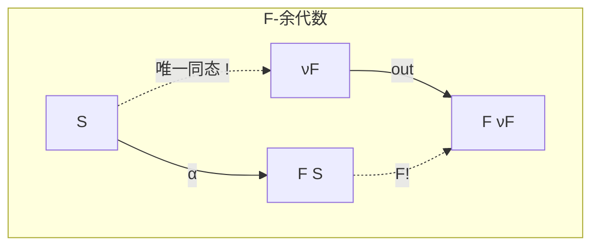
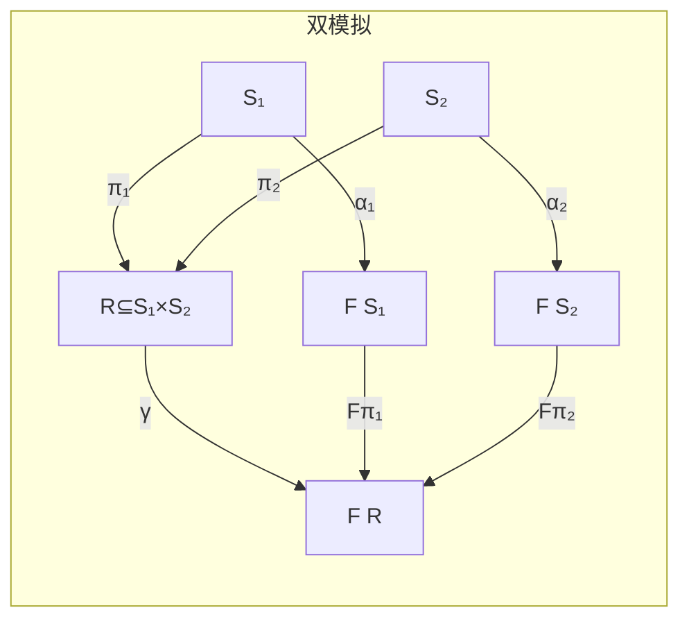
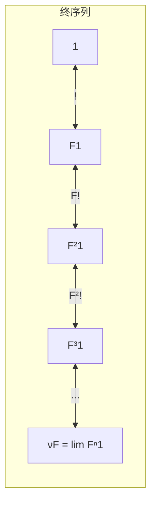
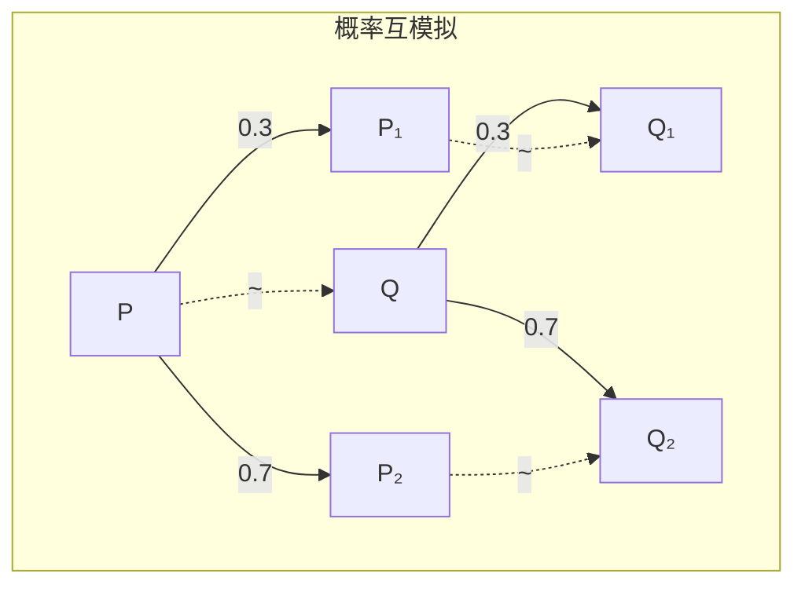

# 余代数进阶 (Coalgebra Advanced)

> **所属单元**: 01-foundations | **前置依赖**: 02-category-theory.md | **形式化等级**: L3-L4

## 1. 概念定义

### 1.1 终余代数与行为等价

**Def-F-06-01: 终余代数 (Terminal Coalgebra)**

设 $F: \mathcal{C} \to \mathcal{C}$ 是 endofunctor。$F$-余代数 $(\nu F, \text{out})$ 是终的，如果对任意 $F$-余代数 $(A, \alpha)$，存在唯一的同态 $!_A: A \to \nu F$ 使得下图交换：

$$
\begin{array}{ccc}
A & \xrightarrow{!_A} & \nu F \\
\alpha \downarrow & & \downarrow \text{out} \\
F(A) & \xrightarrow{F(!_A)} & F(\nu F)
\end{array}
$$

**Def-F-06-02: 行为等价 (Behavioral Equivalence)**

两个状态 $a \in A$ 和 $b \in B$ 是行为等价的，记作 $a \sim b$，如果它们在终余代数中被映射到同一元素：
$$a \sim b \triangleq !_A(a) = !_B(b)$$

**Def-F-06-03: 余代数双模拟 (Coalgebraic Bisimulation)**

关系 $R \subseteq A \times B$ 是 $F$-双模拟，如果存在 $\gamma: R \to F(R)$ 使得投影是同态：

$$
\begin{array}{ccc}
A & \xleftarrow{\pi_1} & R & \xrightarrow{\pi_2} & B \\
\alpha \downarrow & & \downarrow \gamma & & \downarrow \beta \\
F(A) & \xleftarrow{F(\pi_1)} & F(R) & \xrightarrow{F(\pi_2)} & F(B)
\end{array}
$$

### 1.2 余代数模 (Coalgebra Modalities)

**Def-F-06-04: 余代数模态逻辑语法**

余代数模态逻辑的公式：
$$\phi ::= p \mid \neg \phi \mid \phi \land \phi \mid [\lambda]\phi$$

其中 $[\lambda]$ 是模态算子，由谓词提升 $\lambda$ 定义。

**Def-F-06-05: 谓词提升 (Predicate Lifting)**

对函子 $F: \mathbf{Set} \to \mathbf{Set}$，$F$ 的谓词提升是自然变换：
$$\lambda: \mathcal{P} \Rightarrow \mathcal{P} \circ F$$

其中 $\mathcal{P}$ 是幂集函子。

**Def-F-06-06: 模态语义**

对余代数 $\alpha: A \to F(A)$，模态 $[\lambda]$ 的语义：
$$[\lambda]\phi = \{a \in A \mid \alpha(a) \in \lambda_A([\phi])\}$$

### 1.3 时序 Coalgebra

**Def-F-06-07: 时序系统作为余代数**

时序系统建模为余代数 $\alpha: S \to T(S)$，其中 $T$ 是时序函子：

- **离散时间**: $T(S) = \mathcal{P}(A \times S)$ (标记转移系统)
- **连续时间**: $T(S) = (S \to \mathbb{R}_{\geq 0}) \to S$ (流)

**Def-F-06-08: 时序算子的余代数解释**

| 时序算子 | 余代数语义 |
|----------|-----------|
| $\bigcirc \phi$ (Next) | $\{s \mid \forall s'. s \to s' \Rightarrow s' \models \phi\}$ |
| $\Diamond \phi$ (Eventually) | $\mu Z. \phi \lor \bigcirc Z$ |
| $\square \phi$ (Always) | $\nu Z. \phi \land \bigcirc Z$ |

### 1.4 概率 Coalgebra

**Def-F-06-09: 概率转移系统**

离散时间马尔可夫链 (DTMC) 是余代数：
$$\alpha: S \to \mathcal{D}(S)$$

其中 $\mathcal{D}(S) = \{\mu: S \to [0,1] \mid \sum_{s \in S} \mu(s) = 1\}$ 是分布函子。

**Def-F-06-10: 标记概率系统**

标记马尔可夫决策过程 (MDP) 是余代数：
$$\alpha: S \to \mathcal{P}(A \times \mathcal{D}(S))$$

**Def-F-06-11: 概率互模拟**

关系 $R \subseteq S \times S$ 是概率互模拟，如果 $s \mathrel{R} t$ 蕴含：
$$\forall a \in A. \alpha(s)(a)(R[X]) = \alpha(t)(a)(R[X])$$

其中 $R[X] = \{t \mid \exists s \in X. s \mathrel{R} t\}$。

## 2. 属性推导

### 2.1 终余代数的唯一性与存在性

**Lemma-F-06-01: 终余代数的唯一性**

若 $(\nu_1 F, \text{out}_1)$ 和 $(\nu_2 F, \text{out}_2)$ 都是终余代数，则它们同构。

*证明*: 由终性，存在互逆的唯一同态：
$$!_1: \nu_2 F \to \nu_1 F, \quad !_2: \nu_1 F \to \nu_2 F$$
$$!_1 \circ !_2 = \text{id}_{\nu_1 F}, \quad !_2 \circ !_1 = \text{id}_{\nu_2 F}$$∎

**Lemma-F-06-02: Lambek引理**

若 $(\nu F, \text{out})$ 是终余代数，则 $\text{out}: \nu F \to F(\nu F)$ 是同构。

*证明*: 考虑 $F(\nu F)$ 上的余代数结构 $F(\text{out}): F(\nu F) \to F(F(\nu F))$。

由终性，存在唯一的 $h: F(\nu F) \to \nu F$ 使得：
$$\text{out} \circ h = F(h) \circ F(\text{out})$$

又 $\text{out} \circ h \circ \text{out} = F(h) \circ F(\text{out}) \circ \text{out} = F(h \circ \text{out}) \circ \text{out}$

由终性的唯一性，$h \circ \text{out} = \text{id}_{\nu F}$。

类似可证 $\text{out} \circ h = \text{id}_{F(\nu F)}$。∎

### 2.2 双模拟的等价刻画

**Prop-F-06-01: 双模拟与行为等价**

$s \sim t$ (行为等价) 当且仅当存在双模拟 $R$ 使得 $s \mathrel{R} t$。

*证明概要*:

$(\Rightarrow)$: 若 $s \sim t$，则关系 $R = \{(a,b) \mid !_A(a) = !_B(b)\}$ 是双模拟。

$(\Leftarrow)$: 若 $R$ 是双模拟且 $s \mathrel{R} t$，则 $!_A(s) = !_B(t)$ (由余代数同态的交换图)。∎

**Prop-F-06-02: 互模拟是等价关系**

对任意余代数类，行为等价 $\sim$ 是等价关系。

### 2.3 模态逻辑的表达力

**Prop-F-06-03: Hennessy-Milner定理 (Coalgebraic版本)**

若 $F$ 是有限分支的 (image-finite)，则：
$$s \sim t \Leftrightarrow \forall \phi. s \models \phi \Leftrightarrow t \models \phi$$

即模态逻辑完全刻画行为等价。

## 3. 关系建立

### 3.1 余代数与各种系统模型

| 系统类型 | 函子 $F$ | 余代数 $\alpha: S \to F(S)$ | 终余代数 |
|----------|---------|---------------------------|---------|
| 确定性自动机 | $F(X) = 2 \times X^A$ | $\langle o, \delta \rangle$ | 语言 $A^* \to 2$ |
| 标记转移系统 | $F(X) = \mathcal{P}(A \times X)$ | 转移关系 | 进程 (Pomset) |
| 概率系统 | $F(X) = \mathcal{D}(X)$ | 转移分布 | 概率行为树 |
| 流 | $F(X) = A \times X$ | $\langle h, t \rangle$ | $A^\omega$ |
| 树 | $F(X) = A \times X^*$ | 节点+子树 | 所有 $A$-树 |

### 3.2 余代数与归纳/共归纳

**Prop-F-06-04: 归纳 vs 共归纳**

| 方面 | 代数 (Algebra) | 余代数 (Coalgebra) |
|------|---------------|-------------------|
| 构造 | 从基本元素合成 | 从观察分解 |
| 典型结构 | 自然数、列表、表达式 | 流、进程、状态机 |
| 证明原理 | 结构归纳 | 双模拟/共归纳 |
| 语义对象 | 初始代数 | 终余代数 |
| 递归 | 原始递归 | 共递归 (guarded) |

### 3.3 概率余代数与度量空间

**Prop-F-06-05: 概率互模拟的度量刻画**

在概率系统上，可以定义行为度量：
$$d(s, t) = \sup_{\phi} |\mathbb{P}(s \models \phi) - \mathbb{P}(t \models \phi)|$$

概率互模拟是 $d(s, t) = 0$ 的关系。

## 4. 论证过程

### 4.1 为什么需要余代数？

**统一框架**: 余代数为各种状态系统提供统一数学框架。

**行为视角**: 关注"可观察行为"而非"内部结构"。

**模块化**: 函子组合对应系统组合：

- $F + G$: 选择和类型 (Variant)
- $F \times G$: 并行组合 (Product)
- $F \circ G$: 分层组合 (Composition)

### 4.2 终余代数的构造

对 $\omega$-连续函子 $F$，终余代数可通过终序列构造：
$$1 \xleftarrow{!} F(1) \xleftarrow{F(!)} F^2(1) \xleftarrow{F^2(!)} \cdots$$

极限 $\nu F = \lim_{\leftarrow} F^n(1)$ 给出终余代数。

### 4.3 时序逻辑与余代数

时序逻辑算子可统一定义为余代数模态：

- $[\lambda_{\bigcirc}]\phi$: 所有下一状态满足 $\phi$
- $\mu Z. \phi \lor [\lambda_{\bigcirc}]Z$: 可达性
- $\nu Z. \phi \land [\lambda_{\bigcirc}]Z$: 安全性

## 5. 形式证明 / 工程论证

### 5.1 终余代数的存在性定理

**Thm-F-06-01: Adámek定理**

设 $\mathcal{C}$ 是有序极限的范畴，$F: \mathcal{C} \to \mathcal{C}$ 保持序极限，则 $F$ 有终余代数。

*证明概要*:

**步骤1**: 构造终序列。

定义 $F^0 = 1$ (终对象)，$F^{n+1} = F(F^n)$，连接态射 $f_n: F^{n+1} \to F^n$。

**步骤2**: 取极限。

设 $\nu F = \lim_{\leftarrow} F^n$ 有序极限，投影为 $p_n: \nu F \to F^n$。

**步骤3**: 构造余代数结构。

由 $F$ 保持极限，$F(\nu F) = \lim_{\leftarrow} F(F^n) = \lim_{\leftarrow} F^{n+1}$。

定义 $\text{out}: \nu F \to F(\nu F)$ 为唯一的使得 $p_{n+1} = F(p_n) \circ \text{out}$ 的态射。

**步骤4**: 证明终性。

对任意余代数 $(A, \alpha)$，归纳构造 $h_n: A \to F^n$：

- $h_0: A \to 1$ (唯一)
- $h_{n+1} = F(h_n) \circ \alpha$

由极限的泛性质，存在唯一的 $h: A \to \nu F$ 使得 $p_n \circ h = h_n$。验证 $h$ 是同态。∎

### 5.2 双模拟证明原理

**Thm-F-06-02: 共归纳证明原理**

要证明 $s \sim t$，只需构造一个包含 $(s, t)$ 的双模拟关系。

*证明*: 由 Prop-F-06-01，双模拟关系中的元素行为等价。∎

**Thm-F-06-03: 概率互模拟的逼近**

对有限状态概率系统，概率互模拟可在多项式时间内判定。

*证明概要* (Baier-Zhang算法):

**步骤1**: 初始化划分 $\mathcal{P}_0 = \{S\}$。

**步骤2**: 迭代精化：
$$\mathcal{P}_{i+1} = \{[s]_{\mathcal{P}_i} \cap \alpha^{-1}(\lambda([\phi])) \mid s \in S, \phi \in \mathcal{L}(\mathcal{P}_i)\}$$

**步骤3**: 当 $\mathcal{P}_{i+1} = \mathcal{P}_i$ 时停止，得到最大互模拟。

复杂度：$O(|S|^3 \cdot |A|)$。∎

### 5.3 时序逻辑的模型检验

**Thm-F-06-04: Coalgebraic μ-演算模型检验**

对有限状态系统和封闭公式，Coalgebraic μ-演算的模型检验是多项式时间可解的 (假设 $F$ 的谓词提升可有效计算)。

*证明概要*:

**步骤1**: 将公式转换为交替自动机。

**步骤2**: 在余代数上运行自动机 emptiness 检查。

**步骤3**: 利用 $F$ 的结构计算固定点。∎

## 6. 实例验证

### 6.1 示例：流作为终余代数

流函子 $F(X) = A \times X$ 的终余代数是 $(A^\omega, \langle \text{hd}, \text{tl} \rangle)$。

对任意余代数 $(S, \langle h, t \rangle)$，唯一同态 $!: S \to A^\omega$：
$$!(s) = h(s) : !(t(s))$$

这是流的共递归定义。

### 6.2 示例：互斥协议的余代数建模

两个进程的互斥系统：

- 状态: $\{(p_1, p_2) \mid p_i \in \{\text{idle}, \text{wait}, \text{critical}\}\}$
- 转移: 由互斥约束决定

验证安全性：$\square \neg (p_1 = \text{critical} \land p_2 = \text{critical})$

在余代数模型中，这对应于检查所有可达状态满足约束。

### 6.3 示例：概率系统的互模拟

考虑两个概率进程：

- $P = a.(0.3 \cdot P_1 + 0.7 \cdot P_2)$
- $Q = a.(0.3 \cdot Q_1 + 0.7 \cdot Q_2)$

若 $P_1 \sim Q_1$ 且 $P_2 \sim Q_2$，则 $P \sim Q$。

关系 $R = \{(P, Q), (P_1, Q_1), (P_2, Q_2)\}$ 是概率互模拟。

### 6.4 示例：模态逻辑的模型检验

对余代数 $\alpha: S \to \mathcal{P}(A \times S)$ (标记转移系统)：

模态 $[a]$ (对所有 $a$-转移) 定义为：
$$[a]\phi = \{s \in S \mid \forall s'. (a, s') \in \alpha(s) \Rightarrow s' \in \phi\}$$

这是经典的 Hennessy-Milner 逻辑。

## 7. 可视化

### 余代数基本结构



### 双模拟关系图



### 终序列构造



### 概率系统互模拟



### Coalgebraic模态逻辑语义

```mermaid
graph LR
    subgraph 模态语义
    PHI[φ的语义] -->|λ提升| FPHI[F[φ]]
    A[S] -->|α| FS[F S]
    FS -.->|包含检查| FPHI

    RESULT[[λ]φ = α⁻¹λ[φ]]
    end
```

## 8. 引用参考
