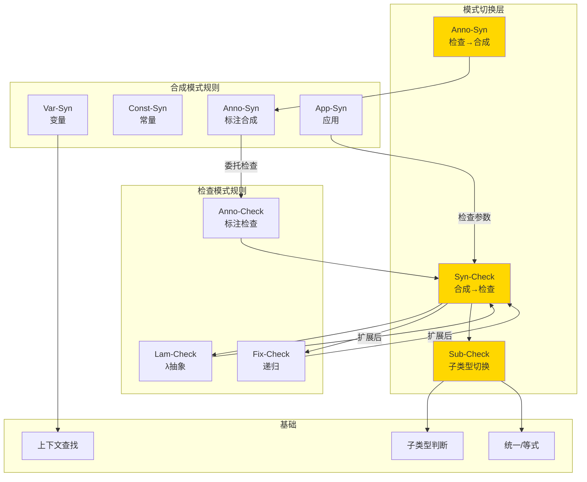
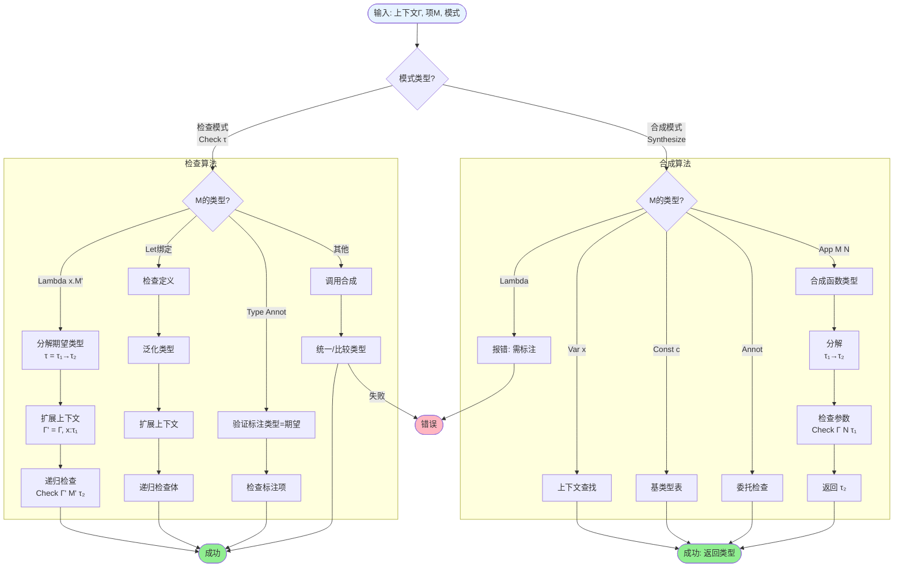
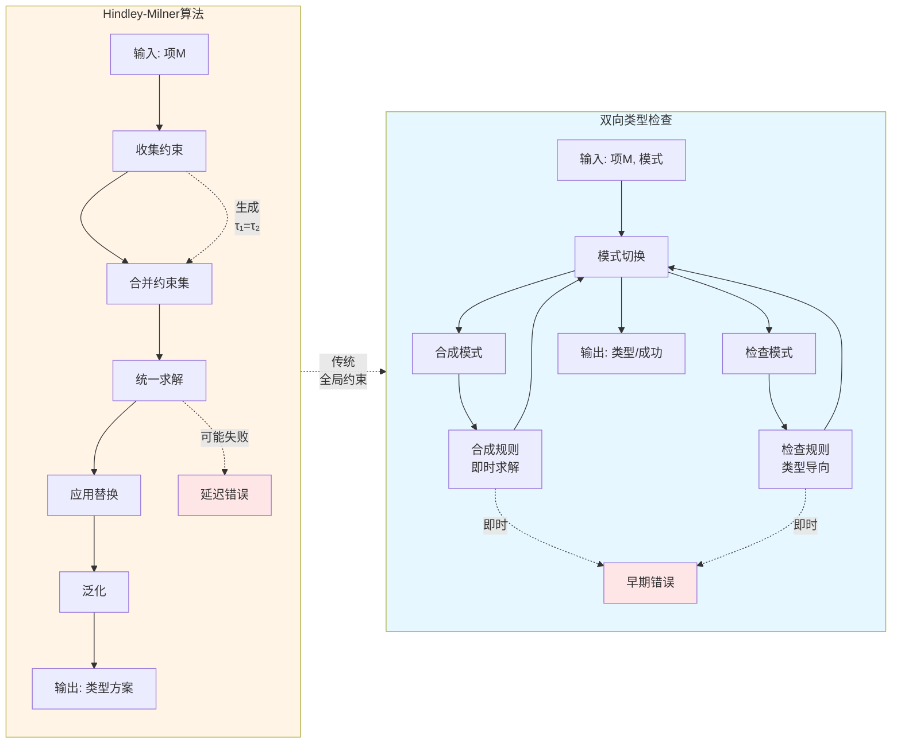

# 双向类型检查 (Bidirectional Typechecking)

> **所属阶段**: formal-methods/01-foundations | **前置依赖**: 05-type-theory.md | **形式化等级**: L3-L5

## 1. 概念定义 (Definitions)

### 1.1 类型推断问题概述

**Def-F-07-01: 类型推断问题 (Type Inference Problem)**

给定一个无类型标注的项 $M$，类型推断问题要求找到一个类型 $ au$ 和上下文 $ riangle$ 使得 $ riangle  riangleright M :  au$ 成立，或确定不存在这样的类型。

形式化定义为：
$$ ext{Infer}(M) = \begin{cases}
\tau & \text{若 } \exists \triangle. \triangle \triangleright M : \tau \\
\text{fail} & \text{否则}
\end{cases}$$

**类型推断的复杂性谱系**：

| 类型系统 | 推断可判定性 | 算法复杂度 | 典型代表 |
|---------|------------|-----------|---------|
| 简单类型λ演算 | 不可判定 | - | 基础理论 |
| Hindley-Milner | 可判定 | DEXPTIME | ML, Haskell |
| System F | 不可判定 | - | 多态核心 |
| 依赖类型 | 不可判定 | - | Coq, Agda, Lean |
| 子类型系统 | 通常不可判定 | 各种 | OO语言 |

**Def-F-07-02: 类型重构 (Type Reconstruction)**

类型重构是类型推断的扩展，允许部分类型标注。给定带有**类型洞**（type holes）的项 $M[\square]$，重构要求填充所有洞使得结果良类型：

$$\text{Reconstruct}(M[\square]) = \sigma \text{ 使得 } M[\sigma] \text{ 良类型}$$

### 1.2 双向类型检查的核心思想

**Def-F-07-03: 双向类型检查 (Bidirectional Typechecking)**

双向类型检查将类型判断分为两种**模式**（modes）：

1. **合成模式**（Synthesis Mode）：$\Gamma \vdash M \Rightarrow \tau$
   - 给定项 $M$，**合成**（推导）其类型 $\tau$
   - 读取："$M$ 合成类型 $\tau$"

2. **检查模式**（Checking Mode）：$\Gamma \vdash M \Leftarrow \tau$
   - 给定类型 $\tau$，**检查**项 $M$ 是否具有该类型
   - 读取："$M$ 检查为类型 $\tau$"

**核心洞察**：

> 某些构造自然地"向外"提供类型信息（合成），而另一些构造自然地"向内"接收类型信息（检查）。通过显式区分这两种模式，可以：
> - 减少需要标注的位置
> - 产生更好的错误信息
> - 处理更复杂的类型特征（如依赖类型）

**历史背景**：双向类型检查的思想最早由 de Bruijn (1970s) 在 Automath 项目中使用，后由 Pierce 和 Turner (1998) 系统化提出，成为现代类型系统实现的标准技术。

### 1.3 合成(Synthesis)与检查(Checking)模式

**Def-F-07-04: 合成模式的形式化**

合成判断 $\Gamma \vdash M \Rightarrow \tau$ 表示：在上下文 $\Gamma$ 中，项 $M$ 的类型可被**自动推导**为 $\tau$。

**合成模式的特征**：
- 需要足够的结构信息来确定类型
- 通常用于：变量、构造函数、带有显式类型标注的项
- 是信息**产生者**（producers）

**Def-F-07-05: 检查模式的形式化**

检查判断 $\Gamma \vdash M \Leftarrow \tau$ 表示：在上下文 $\Gamma$ 中，项 $M$ 可验证为具有类型 $\tau$。

**检查模式的特征**：
- 类型 $\tau$ 作为输入，用于指导项的检查
- 通常用于：λ-抽象、let-绑定、类型转换
- 是信息**消费者**（consumers）

**模式切换的关键**：双向系统的核心在于两种模式之间的**切换规则**，允许在适当的位置从一种模式转换到另一种。

### 1.4 与Hindley-Milner推断的关系

**Def-F-07-06: Hindley-Milner 类型系统**

Hindley-Milner (HM) 系统是带有**参数多态性**的简单类型扩展，其语法：

$$\begin{aligned}
\text{Types } \tau &::= \alpha \mid \tau \to \tau \mid C(\tau, \ldots, \tau) \\
\text{Type Schemes } \sigma &::= \tau \mid \forall \alpha. \sigma
\end{aligned}$$

其中类型方案（type schemes）支持全称量化。

**Def-F-07-07: W算法与双向方法的对比**

| 特征 | Hindley-Milner (W算法) | 双向类型检查 |
|-----|---------------------|------------|
| 主要操作 | 统一（Unification） | 模式切换（Mode switching） |
| 约束生成 | 全局收集后求解 | 局部即时求解 |
| 多态处理 | 泛化/实例化 | 显式标注或子顶检查 |
| 错误定位 | 后期（统一失败时） | 早期（检查失败时） |
| 可扩展性 | 难以扩展至依赖类型 | 可扩展至复杂类型特征 |
| 类型注释要求 | 最少 | 中等（关键位置） |

**Prop-F-07-01: HM与双向的等价性**

对于纯HM片段（无依赖类型、无复杂特征），存在一个从HM推断到双向检查的转换：

$$\Gamma \vdash_{HM} M : \sigma \iff \Gamma \vdash_{bidir} M \Rightarrow \tau \text{ 其中 } \tau \text{ 是 } \sigma \text{ 的实例}$$

**关键区别**：HM算法通过**统一变量**（unification variables）进行全局类型推断，而双向检查依赖于**局部的、类型导向的**（type-directed）语法分析。

---

## 2. 形式化规则 (Formal Rules)

### 2.1 合成模式规则

**Def-F-07-08: 变量合成**

变量从上下文中查找其类型：

$$\frac{(x : \tau) \in \Gamma}{\Gamma \vdash x \Rightarrow \tau} \text{ (Var-Syn)}$$

**Def-F-07-09: 应用合成**

函数应用首先合成函数的类型，然后检查参数：

$$\frac{\Gamma \vdash M \Rightarrow \tau_1 \to \tau_2 \quad \Gamma \vdash N \Leftarrow \tau_1}{\Gamma \vdash M\,N \Rightarrow \tau_2} \text{ (App-Syn)}$$

**Def-F-07-10: 带标注项的合成**

显式类型标注允许从检查切换到合成：

$$\frac{\Gamma \vdash M \Leftarrow \tau}{\Gamma \vdash (M : \tau) \Rightarrow \tau} \text{ (Anno-Syn)}$$

**Def-F-07-11: 原语合成**

常量和原语类型具有预定义的类型：

$$\frac{c \text{ 具有基类型 } b}{\Gamma \vdash c \Rightarrow b} \text{ (Const-Syn)}$$

### 2.2 检查模式规则

**Def-F-07-12: λ-抽象的检查**

λ-抽象的检查利用函数类型的结构：

$$\frac{\Gamma, x : \tau_1 \vdash M \Leftarrow \tau_2}{\Gamma \vdash \lambda x. M \Leftarrow \tau_1 \to \tau_2} \text{ (Lam-Check)}$$

**注释**：这是双向系统的关键规则——函数类型 $\tau_1 \to \tau_2$ 指导了参数 $x$ 的类型。

**Def-F-07-13: 递归定义的检查**

let-递归绑定在扩展上下文中检查：

$$\frac{\Gamma, f : \tau_1 \to \tau_2, x : \tau_1 \vdash M \Leftarrow \tau_2}{\Gamma \vdash \text{fix } f\,x. M \Leftarrow \tau_1 \to \tau_2} \text{ (Fix-Check)}$$

### 2.3 模式切换规则

**Def-F-07-14: 检查到合成的切换（子顶规则）**

当项可以合成类型时，可切换到检查模式：

$$\frac{\Gamma \vdash M \Rightarrow \tau' \quad \tau' \preceq \tau}{\Gamma \vdash M \Leftarrow \tau} \text{ (Sub-Check)}$$

其中 $\preceq$ 是子类型或实例化关系。

**特殊情况——直接切换**：

$$\frac{\Gamma \vdash M \Rightarrow \tau}{\Gamma \vdash M \Leftarrow \tau} \text{ (Syn-Check)}$$

这是子顶规则的退化情况（当 $\preceq$ 是相等关系时）。

**Def-F-07-15: 合成到检查的切换**

在某些系统中，检查位置可以通过提供类型标注来允许合成：

$$\frac{\Gamma \vdash M \Rightarrow \tau}{\Gamma \vdash (M : \tau) \Leftarrow \tau} \text{ (Anno-Check)}$$

### 2.4 类型-directed的转换

**Def-F-07-16: 条件表达式的类型导向规则**

$$\frac{\Gamma \vdash M \Rightarrow \text{Bool} \quad \Gamma \vdash N_1 \Leftarrow \tau \quad \Gamma \vdash N_2 \Leftarrow \tau}{\Gamma \vdash \text{if } M \text{ then } N_1 \text{ else } N_2 \Rightarrow \tau} \text{ (If-Syn)}$$

注意：$N_1$ 和 $N_2$ 的检查使用从上下文中推断的分支类型 $\tau$。

**Def-F-07-17: 模式匹配的类型导向规则**

$$\frac{\Gamma \vdash M \Rightarrow \tau_1 \quad \Gamma, x_i : \tau_{1i} \vdash N_i \Leftarrow \tau \text{ (对每个分支)}}{\Gamma \vdash \text{case } M \text{ of } \{p_i \to N_i\} \Rightarrow \tau} \text{ (Case-Syn)}$$

其中 $p_i : \tau_1 \leadsto \Gamma_i$ 是模式匹配生成的扩展。

**完整规则汇总表**：

| 规则名 | 模式 | 形式 | 说明 |
|-------|-----|------|-----|
| Var-Syn | 合成 | $(x:\tau) \in \Gamma \vdash x \Rightarrow \tau$ | 变量查找 |
| Const-Syn | 合成 | $\vdash c \Rightarrow b$ | 常量类型 |
| Anno-Syn | 合成 | $\frac{M \Leftarrow \tau}{(M:\tau) \Rightarrow \tau}$ | 类型标注 |
| App-Syn | 合成 | $\frac{M \Rightarrow \tau_1 \to \tau_2 \quad N \Leftarrow \tau_1}{M\,N \Rightarrow \tau_2}$ | 函数应用 |
| Lam-Check | 检查 | $\frac{\Gamma, x:\tau_1 \vdash M \Leftarrow \tau_2}{\lambda x.M \Leftarrow \tau_1 \to \tau_2}$ | 抽象检查 |
| Fix-Check | 检查 | $\frac{\Gamma, f:\tau, x:\tau_1 \vdash M \Leftarrow \tau_2}{\text{fix } f\,x.M \Leftarrow \tau_1 \to \tau_2}$ | 递归定义 |
| Syn-Check | 切换 | $\frac{M \Rightarrow \tau}{M \Leftarrow \tau}$ | 合成转检查 |
| Sub-Check | 切换 | $\frac{M \Rightarrow \tau' \quad \tau' \preceq \tau}{M \Leftarrow \tau}$ | 子顶切换 |

---

## 3. 算法详解 (Algorithm)

### 3.1 双向类型检查算法

**Def-F-07-18: 双向类型检查算法框架**

算法维护两个互递归函数：

```
function Check(Γ, M, τ):
    // 检查 M 是否具有类型 τ
    match M with
    | λx.M' when τ = τ₁ → τ₂:
        return Check(Γ, x:τ₁, M', τ₂)
    | M' : τ':
        if τ' = τ then
            return Check(Γ, M', τ)
        else
            return fail
    | _:
        τ' ← Synthesize(Γ, M)
        if τ' = τ then return success
        else return fail

function Synthesize(Γ, M):
    // 合成 M 的类型
    match M with
    | x where (x:τ) ∈ Γ:
        return τ
    | c where c 是常量:
        return BaseType(c)
    | M' : τ:
        if Check(Γ, M', τ) then return τ
        else return fail
    | M₁ M₂:
        τ₁→τ₂ ← Synthesize(Γ, M₁)
        if Check(Γ, M₂, τ₁) then return τ₂
        else return fail
    | _:
        return fail
```

**Prop-F-07-02: 算法终止性**

双向类型检查算法在有限步骤内终止，因为每次递归调用都在结构归纳意义上减小了项的大小。

### 3.2 类型约束生成

**Def-F-07-19: 类型约束**

类型约束 $\mathcal{C}$ 是类型等式或子类型关系的集合：

$$\mathcal{C} ::= \emptyset \mid \mathcal{C} \cup \{\tau_1 \doteq \tau_2\} \mid \mathcal{C} \cup \{\tau_1 \preceq \tau_2\}$$

**约束生成算法**：

对于扩展的双向系统（支持类型变量），算法生成约束而非立即检查：

```
function SynthesizeWithConstraints(Γ, M):
    match M with
    | x where (x:τ) ∈ Γ:
        return (τ, ∅)
    | λx.M':
        α, β ← fresh variables
        (τ, C) ← SynthesizeWithConstraints(Γ, x:α, M')
        return (α → β, C ∪ {τ ≐ β})
    | M₁ M₂:
        (τ₁, C₁) ← SynthesizeWithConstraints(Γ, M₁)
        (τ₂, C₂) ← SynthesizeWithConstraints(Γ, M₂)
        α ← fresh variable
        return (α, C₁ ∪ C₂ ∪ {τ₁ ≐ τ₂ → α})
```

### 3.3 约束求解

**Def-F-07-20: 统一算法 (Unification)**

统一算法求解类型等式约束：

$$\text{Unify}(\tau_1 \doteq \tau_2) = \theta \text{ (替换) 或 fail}$$

**Robinson 统一算法**：

```
function Unify(C):
    if C = ∅ then return id
    else let C = {τ₁ ≐ τ₂} ∪ C'

    if τ₁ = τ₂ then
        return Unify(C')
    else if τ₁ = α and α ∉ FV(τ₂) then
        θ ← Unify(C'[α ↦ τ₂])
        return θ ∘ [α ↦ τ₂]
    else if τ₂ = α and α ∉ FV(τ₁) then
        θ ← Unify(C'[α ↦ τ₁])
        return θ ∘ [α ↦ τ₁]
    else if τ₁ = τ₁₁ → τ₁₂ and τ₂ = τ₂₁ → τ₂₂ then
        return Unify(C' ∪ {τ₁₁ ≐ τ₂₁, τ₁₂ ≐ τ₂₂})
    else
        return fail
```

**Thm-F-07-01: 统一算法正确性**

若 $\text{Unify}(C) = \theta$，则：
1. **可靠性**: $\theta$ 是 $C$ 的解
2. **完备性**: 对 $C$ 的任意解 $\theta'$，存在 $\theta''$ 使得 $\theta' = \theta'' \circ \theta$
3. **最一般性**: $\theta$ 是最一般合一子（mgu）

### 3.4 错误定位

**Def-F-07-21: 类型错误定位**

双向类型检查的一个主要优势是**精确的错误定位**。错误信息包含：
- 错误发生的**源位置**
- **期望类型**（来自检查模式）
- **实际类型**（来自合成模式）
- 模式切换的**上下文**

**错误定位策略**：

| 错误类型 | 定位策略 | 示例信息 |
|---------|---------|---------|
| 应用不匹配 | 函数位置 | "期望函数类型，得到 Int" |
| 参数类型错误 | 参数位置 | "期望 Int，得到 Bool" |
| 抽象缺少标注 | λ位置 | "无法推断 λ 的参数类型" |
| 分支类型不一致 | case位置 | "分支类型不匹配: Int ≠ Bool" |

**Def-F-07-22: 错误恢复机制**

实现中的错误恢复技术：
1. **错误类型**（Error type）：标记失败位置，允许继续检查
2. **延迟报告**：收集多个错误后一起报告
3. **建议生成**：基于类型相似度提供修复建议

---

## 4. 扩展 (Extensions)

### 4.1 多态双向类型检查

**Def-F-07-23: 多态类型方案**

扩展双向系统支持参数多态：

$$\sigma ::= \tau \mid \forall \alpha. \sigma$$

**多态合成规则**：

$$\frac{(x : \sigma) \in \Gamma \quad \sigma \succ \tau}{\Gamma \vdash x \Rightarrow \tau} \text{ (VarPoly-Syn)}$$

其中 $\sigma \succ \tau$ 表示 $\sigma$ 实例化为 $\tau$（替换全称量化的变量）。

**多态检查规则**：

$$\frac{\Gamma, x : \sigma \vdash M \Leftarrow \tau}{\Gamma \vdash (\lambda x. M) \Leftarrow \sigma \to \tau} \text{ (LamPoly-Check)}$$

**泛化与实例化**：

$$\frac{\Gamma \vdash M \Rightarrow \tau \quad \alpha \notin \text{fv}(\Gamma)}{\Gamma \vdash M \Rightarrow \forall \alpha. \tau} \text{ (Gen)}$$

### 4.2 依赖类型的双向检查

**Def-F-07-24: 依赖类型的双向规则**

依赖函数类型的检查：

$$\frac{\Gamma, x : A \vdash M \Leftarrow B(x)}{\Gamma \vdash \lambda x. M \Leftarrow \Pi x:A. B(x)} \text{ (Pi-Check)}$$

依赖应用合成：

$$\frac{\Gamma \vdash M \Rightarrow \Pi x:A. B(x) \quad \Gamma \vdash N \Leftarrow A}{\Gamma \vdash M\,N \Rightarrow B[N/x]} \text{ (DepApp-Syn)}$$

**关键挑战**：依赖类型中，类型可能包含可规约的项，需要**类型等式**而非**语法相等**：

$$\frac{\Gamma \vdash M \Rightarrow A \quad A \equiv_\beta B}{\Gamma \vdash M \Leftarrow B} \text{ (Conv-Check)}$$

### 4.3 隐式参数

**Def-F-07-25: 隐式参数（Implicit Arguments）**

隐式参数允许省略可由上下文推断的参数：

$$M @ \tau \quad \text{（显式应用）} \quad vs. \quad M \quad \text{（隐式应用）}$$

**隐式参数的双向规则**：

$$\frac{\Gamma \vdash M \Rightarrow \forall \{x : A\}. B(x) \quad \Gamma \vdash \text{resolve } x \Leftarrow A}{\Gamma \vdash M \Rightarrow B(\text{value})} \text{ (Impl-Syn)}$$

**解析策略**：
- **统一变量实例化**：用统一变量替换隐式参数
- **类型类解析**：Haskell风格的类型类实例查找
- **作用域内名称查找**：在上下文中查找匹配值

### 4.4 类型注释的作用

**Def-F-07-26: 最小标注原则**

双向类型检查的目标是实现**局部类型推断**（Local Type Inference），仅在最需要的位置要求标注。

**必须标注的位置**：
1. **顶层定义**：模块级函数
2. **递归绑定**：递归函数的类型
3. **复杂多态位置**：高阶多态函数参数

**可选标注的位置**：
1. λ-抽象参数（当函数类型可从上下文推断）
2. 局部变量（通常可推断）
3. 简单的函数应用

**类型注释的语法形式**：

```
M : τ        // 后缀标注 (Haskell, OCaml风格)
(τ) M        // 前缀标注
λ(x:τ). M    // 参数标注
let x:τ = M  // 绑定标注
```

---

## 5. 形式证明 (Proofs)

### 5.1 定理: 双向类型检查的正确性

**Thm-F-07-02: 双向类型检查的正确性 (Soundness)**

若双向类型系统推导出 $\Gamma \vdash M \Rightarrow \tau$ 或 $\Gamma \vdash M \Leftarrow \tau$，则在标准类型系统中 $\Gamma \vdash M : \tau$。

*证明*：

对双向推导的结构进行归纳。

**基本情况**：
- **Var-Syn**: 若 $(x:\tau) \in \Gamma$，标准系统直接有 $\Gamma \vdash x : \tau$ (Var规则)。
- **Const-Syn**: 常量类型由定义确定，标准系统同样适用。

**归纳步骤**：

*应用合成规则 (App-Syn)*：
假设前提：
- $\Gamma \vdash_{bidir} M \Rightarrow \tau_1 \to \tau_2$ （归纳假设）$\Rightarrow \Gamma \vdash M : \tau_1 \to \tau_2$
- $\Gamma \vdash_{bidir} N \Leftarrow \tau_1$ （归纳假设）$\Rightarrow \Gamma \vdash N : \tau_1$

由标准系统的应用规则：
$$\frac{\Gamma \vdash M : \tau_1 \to \tau_2 \quad \Gamma \vdash N : \tau_1}{\Gamma \vdash M\,N : \tau_2}$$

*抽象检查规则 (Lam-Check)*：
假设前提：
- $\Gamma, x:\tau_1 \vdash_{bidir} M \Leftarrow \tau_2$ （归纳假设）$\Rightarrow \Gamma, x:\tau_1 \vdash M : \tau_2$

由标准系统的抽象规则：
$$\frac{\Gamma, x:\tau_1 \vdash M : \tau_2}{\Gamma \vdash \lambda x.M : \tau_1 \to \tau_2}$$

*模式切换规则 (Syn-Check)*：
由归纳假设直接可得。∎

### 5.2 定理: 完备性

**Thm-F-07-03: 双向类型检查的完备性 (Completeness)**

对于标准类型系统中可推导的 $\Gamma \vdash M : \tau$，若 $M$ 满足**标注条件**（在适当位置有类型标注），则双向系统可推导出 $\Gamma \vdash M \Rightarrow \tau$ 或 $\Gamma \vdash M \Leftarrow \tau$。

*证明概要*：

定义**标注条件**：
- 每个合成分式位置的 λ-抽象有类型标注
- 递归定义有显式类型签名

对标准推导的结构进行归纳，同时维护标注条件。

**关键观察**：标准系统中的抽象规则：
$$\frac{\Gamma, x:\tau_1 \vdash M : \tau_2}{\Gamma \vdash \lambda x.M : \tau_1 \to \tau_2}$$

要求我们知道 $\tau_1$。在双向系统中，这由检查模式提供（$\lambda x.M \Leftarrow \tau_1 \to \tau_2$）。若 $M$ 在合成位置，则需要 $(\lambda x.M) : (\tau_1 \to \tau_2)$ 形式的标注。∎

### 5.3 定理: 与标准类型系统的对应

**Thm-F-07-04: 系统对应定理**

设 $\mathcal{T}$ 为标准类型系统，$\mathcal{B}$ 为对应的双向类型系统：

1. **向下封闭性**：$\mathcal{B} \vdash M \Rightarrow \tau \Rightarrow \mathcal{T} \vdash M : \tau$
2. **向上可达成性**：若 $\mathcal{T} \vdash M : \tau$，则存在标注版本 $M'$ 使得 $\mathcal{B} \vdash M' \Rightarrow \tau$

**Prop-F-07-03: 标注最小化**

对于HM片段，所需标注的数量与递归函数数量成正比，通常为 $O(n)$ 其中 $n$ 是顶层定义数。

---

## 6. 实现案例 (Examples)

### 6.1 OCaml中的实现

OCaml编译器使用双向类型检查处理其表达式语言：

```ocaml
(* OCaml 风格的双向类型检查伪代码 *)

type mode = Check of typ | Synthesize

type expr =
  | Var of string
  | Lambda of string * expr
  | App of expr * expr
  | Annot of expr * typ

let rec typecheck (env: env) (mode: mode) (e: expr) : typ =
  match mode, e with
  (* 检查模式：λ-抽象 *)
  | Check (Fun (t1, t2)), Lambda (x, body) ->
      let env' = extend env x t1 in
      typecheck env' (Check t2) body;
      Fun (t1, t2)

  (* 检查模式：类型标注 *)
  | Check tau, Annot (e', tau') ->
      if tau = tau' then
        typecheck env (Check tau) e'
      else
        type_error "Annotation mismatch"

  (* 检查模式：切换回合成 *)
  | Check tau, e ->
      let tau' = typecheck env Synthesize e in
      if subtype tau' tau then tau
      else type_error "Type mismatch"

  (* 合成模式：变量 *)
  | Synthesize, Var x ->
      (match lookup env x with
       | Some t -> t
       | None -> type_error "Unbound variable")

  (* 合成模式：类型标注 *)
  | Synthesize, Annot (e', tau) ->
      typecheck env (Check tau) e';
      tau

  (* 合成模式：应用 *)
  | Synthesize, App (f, arg) ->
      (match typecheck env Synthesize f with
       | Fun (t1, t2) ->
           typecheck env (Check t1) arg;
           t2
       | _ -> type_error "Expected function")

  (* 合成模式：λ需要标注 *)
  | Synthesize, Lambda _ ->
      type_error "Cannot synthesize type for unannotated lambda"
```

**OCaml的实际实现特点**：
1. 使用**局部类型推断**（对应双向检查）
2. 支持**多态方法**的显式标注
3. 第一模块的**显式签名**要求

### 6.2 Rust中的实现

Rust的类型系统结合双向检查与**类型约束收集**：

```rust
// Rust编译器双向检查的概念性表示

enum Ty<'tcx> {
    Bool,
    Int,
    Fn(&'tcx Ty<'tcx>, &'tcx Ty<'tcx>),
    Var(TyVar),
}

struct TypeChecker<'tcx> {
    tcx: TyCtxt<'tcx>,
    constraints: Vec<Constraint<'tcx>>,
}

impl<'tcx> TypeChecker<'tcx> {
    // 合成模式
    fn synthesize(&mut self, expr: &Expr) -> Ty<'tcx> {
        match expr.kind {
            ExprKind::Path(ref qpath) => {
                // 变量查找
                self.resolve_path(qpath)
            }
            ExprKind::Call(ref func, ref args) => {
                let func_ty = self.synthesize(func);
                match func_ty {
                    Ty::Fn(arg_tys, ret_ty) => {
                        // 检查参数
                        for (arg, expected) in args.iter().zip(arg_tys.iter()) {
                            self.check(arg, expected);
                        }
                        ret_ty
                    }
                    _ => self.tcx.ty_error()
                }
            }
            ExprKind::Closure(ref decl, ref body) => {
                // 闭包：通常需要上下文类型
                self.synthesize_closure(decl, body)
            }
            _ => {
                // 尝试从上下文中推断
                self.fallback_synthesize(expr)
            }
        }
    }

    // 检查模式
    fn check(&mut self, expr: &Expr, expected: Ty<'tcx>) {
        match expr.kind {
            ExprKind::Closure(ref decl, ref body) => {
                if let Ty::Fn(arg_ty, ret_ty) = expected {
                    // 使用期望类型指导参数类型
                    let body_env = self.enter_scope(decl.inputs, arg_ty);
                    self.check(body, ret_ty);
                }
            }
            ExprKind::Block(ref stmts, ref tail) => {
                for stmt in stmts {
                    self.check_stmt(stmt);
                }
                if let Some(ref expr) = tail {
                    self.check(expr, expected);
                }
            }
            _ => {
                // 切换到合成模式并统一
                let found = self.synthesize(expr);
                self.constrain(found, expected);
            }
        }
    }
}
```

**Rust的双向检查特点**：
1. **期望类型**（expected type）机制驱动检查模式
2. **方法调用的双相查找**：首先合成receiver类型，然后解析方法
3. **闭包参数类型的上下文推断**

### 6.3 Haskell中的实现

GHC（Glasgow Haskell Compiler）使用**带有约束生成的双向检查**：

```haskell
-- Haskell/GHC 类型检查概念

data TcMode = Check TcType | Infer (IORef TcType)

tcExpr :: TcMode -> HsExpr GhcRn -> TcM (HsExpr GhcTcId, TcType)

-- 检查模式
tcExpr (Check expected_ty) expr = case expr of
    HsLam (MG _ [L _ match]) -> do
        -- 期望函数类型
        (exp_arg_ty, exp_res_ty) <- unifyFun expected_ty
        -- 检查lambda体
        tcLambdaMatch match exp_arg_ty exp_res_ty

    HsLet binds body -> do
        -- 检查绑定，然后检查体
        binds' <- tcLocalBinds binds
        (body', body_ty) <- tcExpr (Check expected_ty) body
        return (HsLet binds' body', expected_ty)

    -- 切换到推断模式
    _ -> do
        (expr', actual_ty) <- tcExpr (Infer ref) expr
        unify actual_ty expected_ty
        return (expr', expected_ty)

-- 推断模式
tcExpr (Infer ref) expr = case expr of
    HsVar (L _ name) -> do
        ty <- tcLookupId name
        writeIORef ref ty
        return (HsVar ..., ty)

    HsApp fun arg -> do
        (fun', fun_ty) <- tcExpr (Infer fun_ref) fun
        (arg_ty, res_ty) <- unifyFun fun_ty
        (arg', _) <- tcExpr (Check arg_ty) arg
        writeIORef ref res_ty
        return (HsApp fun' arg', res_ty)

    ExprWithTySig expr sig -> do
        sig_ty <- tcHsSigType sig
        (expr', _) <- tcExpr (Check sig_ty) expr
        writeIORef ref sig_ty
        return (ExprWithTySig expr' sig, sig_ty)
```

**GHC的扩展特性**：
1. **局部性约束**：延迟到最外层求解
2. **类型族**：需要类型等式约束
3. **GADTs**：模式匹配引入局部类型等式

### 6.4 伪代码示例

**完整的双向类型检查器伪代码**：

```
// 完整的双向类型检查器

type Type =
  | TBase of string
  | TFun of Type * Type
  | TVar of string
  | TForall of string * Type

type Mode = Infer | Check of Type

type Context = Map<string, TypeScheme>

// 主类型检查函数
function typecheck(ctx: Context, mode: Mode, expr: Expr): Result<Type, Error> =
  match (mode, expr) with

  // ========== 检查模式 ==========

  // λ-抽象：使用期望类型指导
  | Check(TFun(argTy, retTy)), Lambda(x, body) =>
      let ctx' = extend(ctx, x, monomorphic(argTy))
      typecheck(ctx', Check(retTy), body)
      Ok(TFun(argTy, retTy))

  // let-绑定：多态泛化
  | Check(bodyTy), Let(x, defn, body) =>
      let (defnTy, defn') = synthesize(ctx, defn)
      let scheme = generalize(ctx, defnTy)
      let ctx' = extend(ctx, x, scheme)
      typecheck(ctx', Check(bodyTy), body)

  // 类型标注：验证并传播
  | Check(expected), Annot(expr', ty) =>
      match typecheck(ctx, Check(ty), expr') with
      | Ok _ -> Ok(ty)
      | Error e -> Error(TypeAnnotationMismatch(e, expected, ty))

  // 切换到推断模式
  | Check(expected), expr =>
      match synthesize(ctx, expr) with
      | Ok(actual, expr') when actual = expected -> Ok(actual)
      | Ok(actual, _) -> Error(TypeMismatch(expected, actual))
      | Error e -> Error(e)

  // ========== 推断模式 ==========

  // 变量：从上下文查找
  | Infer, Var(x) =>
      match lookup(ctx, x) with
      | Some(scheme) ->
          let ty = instantiate(scheme)
          Ok(ty, Var(x, ty))
      | None -> Error(UnboundVariable(x))

  // 常量：预定义类型
  | Infer, Const(n) when isInt(n) -> Ok(TBase("Int"), Const(n))
  | Infer, Const(b) when isBool(b) -> Ok(TBase("Bool"), Const(b))

  // 类型标注：使用标注类型
  | Infer, Annot(expr', ty) =>
      match typecheck(ctx, Check(ty), expr') with
      | Ok _ -> Ok(ty, Annot(expr', ty))
      | Error e -> Error(e)

  // 函数应用：合成函数类型，检查参数
  | Infer, App(func, arg) =>
      match synthesize(ctx, func) with
      | Ok(TFun(argTy, retTy), func') ->
          match typecheck(ctx, Check(argTy), arg) with
          | Ok _ -> Ok(retTy, App(func', arg, retTy))
          | Error e -> Error(ArgumentTypeMismatch(e, argTy))
      | Ok(other, _) -> Error(NotAFunction(other))
      | Error e -> Error(e)

  // λ-抽象在推断模式：需要标注
  | Infer, Lambda(_, _) ->
      Error(CannotInferLambda)

// 辅助：合成并生成注解项
and synthesize(ctx, expr) =
  match typecheck(ctx, Infer, expr) with
  | Ok(ty) -> Ok(ty, annotate(expr, ty))
  | Error(e) -> Error(e)

// 辅助：多态泛化
function generalize(ctx, ty) =
  let freeInCtx = freeVars(ctx)
  let freeInTy = freeVars(ty)
  let genVars = Set.difference(freeInTy, freeInCtx)
  TForall(Set.toList(genVars), ty)

// 辅助：实例化
function instantiate(TForall(vars, body)) =
  let subst = Map.ofList(List.map (v -> (v, freshVar())) vars)
  applySubst(subst, body)
function instantiate(ty) = ty
```

**扩展：支持模式匹配的双向检查**：

```
// 模式匹配的双向检查

function checkPattern(ctx: Context, pat: Pattern, ty: Type): Context =
  match (pat, ty) with
  | PVar(x), ty -> extend(ctx, x, monomorphic(ty))
  | PWildcard, _ -> ctx
  | PTuple(pats), TTuple(tys) when length(pats) = length(tys) ->
      fold(checkPattern, ctx, zip(pats, tys))
  | PConstruct(ctor, pats), ty ->
      let ctorTy = lookupConstructor(ctor)
      let (argTys, retTy) = unfoldFunctionType(ctorTy)
      if retTy = ty then
        fold(checkPattern, ctx, zip(pats, argTys))
      else
        error "Constructor type mismatch"

function checkMatch(ctx: Context, scrut: Expr, branches: List<Branch>, expected: Type) =
  let (scrutTy, scrut') = synthesize(ctx, scrut)

  for Branch(pat, guard, body) in branches do
    let patCtx = checkPattern(ctx, pat, scrutTy)
    if guard then
      check(patCtx, Check(TBase("Bool")), guard)
    check(patCtx, Check(expected), body)

  Ok(expected)
```

---

## 7. 可视化 (Visualizations)

### 7.1 双向检查流程图

以下Mermaid图展示了双向类型检查的流程，从顶层判断开始，根据语法结构和上下文在合成与检查模式之间切换：

```mermaid
flowchart TD
    Start([开始类型检查]) --> {模式?}

    {模式?} -->|合成模式| SynthPath
    {模式?} -->|检查模式| CheckPath

    subgraph 合成路径 [合成模式: 推导类型]
        SynthPath{项类型?}
        SynthPath -->|变量| VarSynth[查找上下文<br/>返回绑定类型]
        SynthPath -->|常量| ConstSynth[返回预定义基类型]
        SynthPath -->|标注| AnnoSynth[检查项<br/>返回标注类型]
        SynthPath -->|应用| AppSynth[合成函数类型<br/>检查参数<br/>返回返回类型]
        SynthPath -->|λ| LambdaSynth[错误: 无法推断<br/>需要标注]
    end

    subgraph 检查路径 [检查模式: 验证类型]
        CheckPath{项类型?}
        CheckPath -->|λ| LambdaCheck[检查期望类型<br/>是否为函数类型<br/>扩展上下文<br/>递归检查体]
        CheckPath -->|标注| AnnoCheck[验证标注=期望<br/>检查项]
        CheckPath -->|其他| SwitchToSynth[切换到合成模式<br/>验证合成类型=期望]
    end

    VarSynth --> Success([成功: 返回类型])
    ConstSynth --> Success
    AnnoSynth --> Success
    AppSynth --> Success
    LambdaCheck --> Success
    AnnoCheck --> Success
    SwitchToSynth --> Success

    LambdaSynth --> ErrorLambda([错误: 无法推断])

    style Start fill:#90EE90
    style Success fill:#90EE90
    style ErrorLambda fill:#FFB6C1
```

### 7.2 规则依赖图

此图展示了双向类型检查规则之间的依赖关系，显示哪些规则调用其他规则，以及模式切换的方向：



### 7.3 算法流程图

此图展示了完整的双向类型检查算法控制流，包括输入输出和决策点：



### 7.4 与HM算法对比图

此图对比了双向类型检查与传统Hindley-Milner算法的结构和流程差异：



---

## 8. 引用参考 (References)

[^1]: Benjamin C. Pierce. *Types and Programming Languages*. MIT Press, 2002. 第22章详细讨论了类型推断和Hindley-Milner系统，是类型系统的经典教材。

[^2]: Joshua Dunfield and Neel Krishnaswami. "Bidirectional Typing". *ACM Computing Surveys*, 54(5), 2021. 这篇综述论文全面回顾了双向类型检查的理论、实现和应用，涵盖了从基础到依赖类型的各种扩展。

[^3]: Joshua Dunfield. "Elaborating Evaluation-Order Polymorphism". *Proceedings of the ACM on Programming Languages*, 4(ICFP), 2020. 讨论了在双向框架中处理求值序多态性的技术。

[^4]: Jana Dunfield and Neelakantan R. Krishnaswami. "Complete and Easy Bidirectional Typechecking for Higher-Rank Polymorphism". *ICFP 2013*. 这篇论文提出了处理高阶多态性的完整双向类型检查算法。

[^5]: Thierry Coquand. "An Algorithm for Type-Checking Dependent Types". *Science of Computer Programming*, 26(1-3), 1996. 描述了在依赖类型设置中的类型检查算法，包括类型转换规则。

[^6]: Conor McBride. "First-Order Unification by Structural Recursion". *Journal of Functional Programming*, 13(6), 2003. 提出了结构递归的统一算法实现。

[^7]: Martin Odersky, Christoph Zenger, and Matthias Zenger. "Colored Local Type Inference". *POPL 2001*. 介绍了彩色局部类型推断，扩展了双向检查处理更复杂的多态场景。

[^8]: Ulf Norell. "Towards a Practical Programming Language Based on Dependent Type Theory". PhD Thesis, Chalmers University, 2007. Agda语言的设计和实现，展示了双向类型检查在依赖类型语言中的应用。

[^9]: J. A. Robinson. "A Machine-Oriented Logic Based on the Resolution Principle". *Journal of the ACM*, 12(1), 1965. 经典论文，介绍了统一算法的基础原理。

[^10]: Luis Damas and Robin Milner. "Principal Type-Schemes for Functional Programs". *POPL 1982*. 原始HM算法的论文，奠定了现代函数式语言类型推断的基础。

[^11]: Robert Harper. *Practical Foundations for Programming Languages*. Cambridge University Press, 2013. 特别是第21-25章讨论了类型推断和多态性。

[^12]: Derek Dreyer. "Understanding and Evolving the ML Module System". PhD Thesis, CMU-CS-07-139, 2007. CMU关于ML模块系统和类型检查的深入研究。

[^13]: Frank Pfenning. "Lecture Notes on Bidirectional Type Checking". CMU 15-814: Type Systems for Programming Languages, Fall 2015. CMU课程讲义，提供了双向类型检查的教学级解释。

[^14]: J. Roger Hindley. "The Principal Type-Scheme of an Object in Combinatory Logic". *Transactions of the American Mathematical Society*, 146, 1969. 原始的类型推断理论研究。

[^15]: Peter J. Landin. "The Mechanical Evaluation of Expressions". *Computer Journal*, 6(4), 1964. 早期关于表达式求值和类型理论的奠基性工作。

---

*文档生成时间: 2026-04-10*
*版本: 1.0*
*形式化等级: L3-L5 (中等至高等形式化)*
