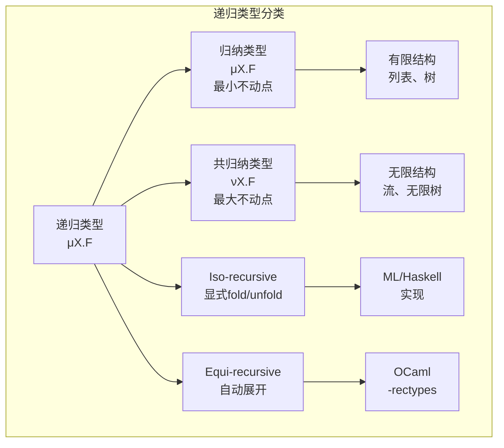
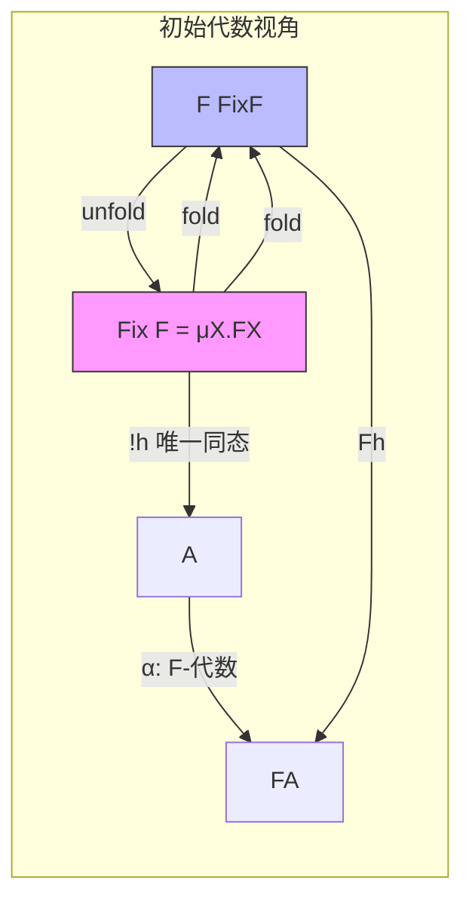

# 递归类型 (Recursive Types)

> **所属单元**: 01-foundations | **前置依赖**: 05-type-theory.md, 04-domain-theory.md | **形式化等级**: L2-L4

## 1. 概念定义

### 1.1 递归类型概述

递归类型允许类型定义引用自身，是表示无限数据结构（如列表、树、流）的基础。

**Def-F-08-01: 递归类型**

递归类型是通过自身定义的类型。给定类型构造器 $F(X)$，递归类型 $ au$ 满足同构关系：

$$\tau \cong F(\tau)$$

**直观解释**: 递归类型类似于数学中的递归定义。例如，自然数列表可以定义为"空列表或一个元素后跟一个列表"。

---

### 1.2 μ算子 (Mu Operator)

**Def-F-08-02: μ算子 (类型不动点)**

μ算子用于显式构造递归类型：

$$\mu X. F(X)$$

其中：

- $X$ 是类型变量（绑定变量）
- $F(X)$ 是类型表达式（类型构造器）
- $\mu$ 表示**最小不动点** (least fixed point)

**语义**: $\mu X. F(X)$ 是满足 $X \cong F(X)$ 的最小类型（在包含序下）。

**展开规则 (Unfolding)**:

$$\mu X. F(X) = F(\mu X. F(X))$$

**Def-F-08-03: 展开与折叠**

对递归类型 $\tau = \mu X. F(X)$：

- **展开 (Unfold)**: $\text{unfold}: \tau \to F(\tau)$
- **折叠 (Fold)**: $\text{fold}: F(\tau) \to \tau$

这两个操作互为逆运算（在同构意义下）。

---

### 1.3 Iso-recursive vs Equi-recursive

递归类型有两种主要处理方式：

**Def-F-08-04: Iso-recursive 类型 (同构递归)**

在 iso-recursive 方法中，递归类型与其展开式**同构但不等价**：

$$\mu X. F(X) \cong F(\mu X. F(X)) \quad \text{(但 } \neq \text{)}$$

需要显式的 `fold` 和 `unfold` 操作在两者之间转换。

**特点**:

- 类型检查相对简单
- 显式的转换操作使语义清晰
- ML、Haskell 等语言采用此方式

**Def-F-08-05: Equi-recursive 类型 (等价递归)**

在 equi-recursive 方法中，递归类型与其展开式**等价**：

$$\mu X. F(X) = F(\mu X. F(X))$$

不需要显式转换，类型自动与其展开式互换。

**特点**:

- 更自然的编程体验
- 类型检查更复杂（需要检查无限类型的等价性）
- OCaml 的某些扩展、部分研究语言采用此方式

**对比表**:

| 特性 | Iso-recursive | Equi-recursive |
|------|---------------|----------------|
| 类型与展开式关系 | 同构 ($\cong$) | 等价 ($=$) |
| 显式 fold/unfold | 需要 | 不需要 |
| 类型检查复杂度 | 低 | 高 |
| 类型表示大小 | 有界 | 可能无限 |
| 典型实现 | ML, Haskell | OCaml (-rectypes) |

---

### 1.4 递归类型与归纳类型

**Def-F-08-06: 归纳类型 (Inductive Types)**

归纳类型是**最小不动点**，对应良基数据结构（所有元素都通过有限步构造）：

$$\text{Inductive}:\quad \mu X. F(X)$$

**特点**:

- 所有值都是有限的
- 支持归纳证明（结构归纳）
- 例子: 有限列表、有限树、自然数

**Def-F-08-07: 共归纳类型 (Coinductive Types)**

共归纳类型是**最大不动点**，允许无限数据结构：

$$\text{Coinductive}:\quad \nu X. F(X)$$

**特点**:

- 允许无限值（流、无限树）
- 支持共归纳证明（双模拟）
- 例子: 流 (Stream)、无限树、延迟列表

**Def-F-08-08: 不动点层级关系**

在完全格中，对连续函数 $F$：

$$\mu X. F(X) \sqsubseteq \nu X. F(X)$$

最小不动点 $\mu$ 对应归纳，最大不动点 $\nu$ 对应共归纳。

**Def-F-08-09: 多项式类型构造器**

递归类型常由**多项式类型构造器**生成：

$$F(X) = C_1 \times X^{n_1} + C_2 \times X^{n_2} + \cdots + C_k \times X^{n_k}$$

其中 $+$ 是和类型（变体），$\times$ 是积类型（元组）。

---

## 2. 形式化理论

### 2.1 类型语法

**Def-F-08-10: 带递归类型的λ演算语法**

类型：
$$\tau, \sigma ::= b \mid \alpha \mid \tau \to \sigma \mid \tau + \sigma \mid \tau \times \sigma \mid \mu \alpha. \tau \mid \nu \alpha. \tau$$

项：
$$t, u ::= x \mid \lambda x:\tau.t \mid t\,u \mid \text{fold}_{\mu \alpha.\tau}\,t \mid \text{unfold}_{\mu \alpha.\tau}\,t \mid \langle t, u \rangle \mid \pi_1 t \mid \pi_2 t \mid \text{inl}\,t \mid \text{inr}\,t \mid \text{case}\,t\,\text{of}\,\text{inl}\,x \Rightarrow u \mid \text{inr}\,y \Rightarrow v$$

其中：

- $\mu \alpha.\tau$: 递归类型（归纳）
- $\nu \alpha.\tau$: 共递归类型（共归纳）
- $\text{fold}/\text{unfold}$: iso-recursive 的显式转换

### 2.2 展开操作

**Def-F-08-11: 类型展开 (Type Unrolling)**

对递归类型 $\mu X. F(X)$，定义 $n$ 层展开：

$$\begin{aligned}
F^0(X) &= X \\
F^{n+1}(X) &= F(F^n(X)) \\
\text{unroll}_n(\mu X. F(X)) &= F^n(\mu X. F(X))
\end{aligned}$$

**无限展开**:

$$F^\omega = \lim_{n \to \infty} F^n(\bot)$$

对连续函子 $F$，有 $\mu X. F(X) = F^\omega$。

**Prop-F-08-01: 展开的同构性质**

在 iso-recursive 系统中：

$$\text{unfold}: \mu X. F(X) \cong F(\mu X. F(X)): \text{fold}$$

满足：
- $\text{unfold} \circ \text{fold} = \text{id}_{F(\mu X. F(X))}$
- $\text{fold} \circ \text{unfold} = \text{id}_{\mu X. F(X)}$

### 2.3 等价关系

**Def-F-08-12: 递归类型等价 ($\equiv$)**

在 equi-recursive 系统中，定义类型等价关系：

1. **自反性**: $\tau \equiv \tau$
2. **对称性**: 若 $\tau \equiv \sigma$，则 $\sigma \equiv \tau$
3. **传递性**: 若 $\tau \equiv \sigma$ 且 $\sigma \equiv \rho$，则 $\tau \equiv \rho$
4. **展开规则**: $\mu X. \tau \equiv \tau[\mu X. \tau / X]$
5. **同余规则**:
   - 若 $\tau_1 \equiv \tau_2$ 且 $\sigma_1 \equiv \sigma_2$，则 $\tau_1 \to \sigma_1 \equiv \tau_2 \to \sigma_2$
   - 类似规则适用于和、积类型

**Prop-F-08-02: 等价判定的复杂性**

递归类型等价判定：
- 对简单类型构造器：可在多项式时间内判定
- 对带函数类型的构造器：PSPACE-完全
- 对带子类型的构造器：不可判定（一般情况下）

### 2.4 子类型关系

**Def-F-08-13: 递归子类型 (Amber Rules)**

对递归类型的子类型判断，使用 **Amber 规则**（Amadio & Cardelli, 1993）：

$$\frac{\Gamma, \alpha <: \beta \vdash \tau <: \sigma}{\Gamma \vdash \mu \alpha. \tau <: \mu \beta. \sigma} \quad \text{(Amber)}$$

其中 $\Gamma$ 记录递归类型变量间的假设关系。

**子类型展开**:

$$\frac{\tau[\mu \alpha. \tau / \alpha] <: \sigma[\mu \beta. \sigma / \beta]}{\mu \alpha. \tau <: \mu \beta. \sigma} \quad \text{(Unroll)}$$

**Prop-F-08-03: 递归子类型的安全性**

若 $\tau <: \sigma$，则任何 $\tau$ 值可以安全地在期望 $\sigma$ 的上下文中使用（Liskov 替换原则）。

---

## 3. 类型安全性

### 3.1 类型判断规则

**Def-F-08-14: Iso-recursive 类型规则**

$$\frac{\Gamma \vdash t : \tau[\mu \alpha. \tau / \alpha]}{\Gamma \vdash \text{fold}_{\mu \alpha.\tau}\,t : \mu \alpha. \tau} \quad \text{(Fold)}$$

$$\frac{\Gamma \vdash t : \mu \alpha. \tau}{\Gamma \vdash \text{unfold}_{\mu \alpha.\tau}\,t : \tau[\mu \alpha. \tau / \alpha]} \quad \text{(Unfold)}$$

**Def-F-08-15: Equi-recursive 类型规则**

在 equi-recursive 系统中，没有显式的 fold/unfold 操作，类型规则简化为：

$$\frac{\Gamma \vdash t : \tau \quad \tau \equiv \sigma}{\Gamma \vdash t : \sigma} \quad \text{(Equiv)}$$

### 3.2 Fold/Unfold 操作

**Prop-F-08-04: Fold/Unfold 的语义**

在 iso-recursive 系统中：

1. **fold** 将 $F(\mu X. F(X))$ 包装为 $\mu X. F(X)$ 的值
2. **unfold** 暴露 $\mu X. F(X)$ 值的内部结构

**计算规则**:

$$\text{unfold}(\text{fold}\,v) \to v$$

$$\text{fold}(\text{unfold}\,v) \to v \quad \text{(若 } v \text{ 是递归类型值)}$$

**Def-F-08-16: 递归值的构造模式**

典型的递归值构造遵循模式：

```
构造值: fold (Constructor (fold (Constructor ...)))
消费值: case unfold v of Constructor x => ...
```

### 3.3 递归类型的值

**Def-F-08-17: 规范形式 (Canonical Forms)**

对递归类型 $\mu X. F(X)$：

- **值**形如：$\text{fold}\,v$，其中 $v$ 是 $F(\mu X. F(X))$ 的值
- **归纳值**: 有限次 fold 构造的值
- **共归纳值**: 可能无限构造的值（流）

**Prop-F-08-05: 值的结构**

若 $v : \mu X. F(X)$ 是规范形式，则 $v = \text{fold}\,v'$，其中：
- 若 $F(X) = 1 + X$（如自然数），$v'$ 是 `inl ()` 或 `inr v''`
- 若 $F(X) = A \times X + 1$（如列表），$v'$ 是 `inl (a, v'')` 或 `inr ()`

### 3.4 类型保持性

**Lemma-F-08-01: 替换引理 (Substitution Lemma)**

若 $\Gamma, x:\tau \vdash t : \sigma$ 且 $\Gamma \vdash v : \tau$（$v$ 是值），则 $\Gamma \vdash t[v/x] : \sigma$。

*证明概要*: 对 $t$ 的推导进行结构归纳。

**Lemma-F-08-02: 类型保持 (Preservation)**

若 $\Gamma \vdash t : \tau$ 且 $t \to t'$，则 $\Gamma \vdash t' : \tau$。

*证明概要*: 对求值关系进行归纳，关键情况是 fold/unfold 规约：

- 若 $t = \text{unfold}(\text{fold}\,v)$，则 $t' = v$
- 由规则知 $\text{fold}\,v : \mu X. F(X)$，故 $v : F(\mu X. F(X))$
- 因此 $t' : F(\mu X. F(X)) = \tau[\mu X. \tau / X]$

**Lemma-F-08-03: 进展 (Progress)**

若 $\vdash t : \tau$ 且 $t$ 是闭项，则要么 $t$ 是值，要么存在 $t'$ 使得 $t \to t'$。

*证明概要*: 对 $t$ 的类型推导进行归纳。

**关键观察**: 递归类型值总是形如 `fold v`，其中 `v` 是结构的一部分。

---

## 4. 实现技术

### 4.1 递归类型表示

**Def-F-08-18: 递归类型的内存表示**

递归类型的值通常表示为**带标签的联合体**或**指针结构**。

**示例：列表的表示**

```c
// 列表类型: μX. (A × X) + 1
typedef struct ListNode {
    enum { CONS, NIL } tag;
    union {
        struct { A head; struct ListNode* tail; } cons;
    } data;
} List;
```

**指针 vs 内联**:
- **Boxed**: 递归出现使用指针（通用但间接开销）
- **Unboxed**: 内联展开（有限深度，可能无限大小）

**Def-F-08-19: 递归标记**

编译器内部使用**递归标记**处理类型：

```
List(A) = μX. (A × X) + 1
        → Rec(X, (A × Var(X)) + 1)
```

`Rec` 节点标记递归 binder，`Var(X)` 标记递归引用。

### 4.2 内存布局

**Prop-F-08-06: 列表的内存布局**

```
空列表 (nil):    [TAG=0]

非空列表 (cons): [TAG=1 | HEAD | PTR->TAIL]
                  1 word   A    1 word
```

**树结构的布局**:

```
Tree(A) = μX. A + (X × X)  // 叶子或分支

叶子: [TAG=0 | VALUE]
分支: [TAG=1 | PTR-LEFT | PTR-RIGHT]
```

**Def-F-08-20: 递归类型的对齐要求**

由于递归类型可能包含自身，对齐必须保持一致：

$$\text{align}(\mu X. F(X)) = \text{align}(F(\text{ptr}))$$

其中 `ptr` 是指针类型的大小和对齐。

### 4.3 惰性展开

**Def-F-08-21: 按需展开策略**

Equi-recursive 系统需要比较可能无限的类型，采用**惰性展开**：

1. 比较两个递归类型时，首先检查变量假设
2. 若无假设，添加 $\alpha \equiv \beta$ 假设
3. 递归比较展开后的类型
4. 若再次遇到相同对，返回成功（由假设保证）

**算法 (Bisimulation)**:

```
equiv(μα.τ, μβ.σ, seen) =
    if (μα.τ, μβ.σ) in seen: return true
    add (μα.τ, μβ.σ) to seen
    return equiv(τ[μα.τ/α], σ[μβ.σ/β], seen)
```

**Prop-F-08-07: 展开终止性**

若类型构造器 $F$ 是**收缩的** (contractive)，即 $F$ 在其参数位置上至少引入一个类型构造器，则惰性展开算法终止。

### 4.4 优化技术

**Def-F-08-22: 尾部递归优化 (Tail Recursion)**

递归类型的**迭代器**可优化为循环：

```haskell
-- 原始递归定义
length :: List a -> Int
length Nil = 0
length (Cons _ xs) = 1 + length xs

-- 优化为尾递归
length' :: List a -> Int -> Int
length' Nil acc = acc
length' (Cons _ xs) acc = length' xs (acc + 1)
```

**Def-F-08-23: 融合优化 (Fusion)**

递归类型的转换组合可融合为单次遍历：

```haskell
-- 组合操作
map f . map g = map (f . g)

foldr f z . map g = foldr (f . g) z
```

**Def-F-08-24: 共享与持久化**

不可变递归数据结构天然支持**结构共享**：

```
原始列表: [1] -> [2] -> [3] -> Nil
           |
新列表:   [0] -> +
```

修改操作只创建变化的部分，共享未变化的部分。

---

## 5. 形式证明

### 5.1 定理: 递归类型的类型安全性

**Thm-F-08-01: 类型安全性定理**

对带 iso-recursive 类型的λ演算，若 $\vdash t : \tau$，则：

1. **保持性**: 若 $t \to^* t'$，则 $\vdash t' : \tau$
2. **进展性**: $t$ 是值，或存在 $t'$ 使得 $t \to t'$，或 $t$ 无限规约

*证明*:

**保持性** 由引理 F-08-02 通过归纳可得。

**进展性** 证明（结构归纳）：

- 基本情况：$t$ 是值，满足
- 归纳情况：对 $t$ 的形式分析
  - $t = \text{fold}\,u$: 若 $u$ 是值，则 $t$ 是值；否则 $u \to u'$
  - $t = \text{unfold}\,u$:
    - 若 $u = \text{fold}\,v$，则 $t \to v$（由计算规则）
    - 否则由归纳假设，$u$ 可规约
  - 应用、配对等其他情况类似标准证明 ∎

### 5.2 定理: 强归一化

**Thm-F-08-02: 递归类型的强归一化**

若所有基础类型都是强归一化的，且递归类型构造器 $F$ 保持强归一化，则 $\mu X. F(X)$ 的项也是强归一化的。

*证明概要* (基于可约性候选方法):

**步骤1**: 定义递归类型的可约性候选。

对 $\tau = \mu X. F(X)$，定义：

$$\text{RED}_\tau = \{ t \mid \text{unfold}\,t \in \text{RED}_{F(\tau)} \}$$

**步骤2**: 证明 RED 集合的性质。

- **(CR1)**: 若 $t \in \text{RED}_\tau$，则 $t$ 强归一化
- **(CR2)**: 若 $t \in \text{RED}_\tau$ 且 $t \to t'$，则 $t' \in \text{RED}_\tau$
- **(CR3)**: 若 $t$ 中性且所有一步归约都在 $\text{RED}_\tau$ 中，则 $t \in \text{RED}_\tau$

**步骤3**: 主归纳。

对推导 $\Gamma \vdash t : \tau$ 进行归纳，证明：对所有满足 $\gamma \in \text{RED}_\Gamma$ 的替换，$t[\gamma] \in \text{RED}_\tau$。

- fold 情况：若 $u[\gamma] \in \text{RED}_{F(\tau)}$，则 $\text{fold}\,u[\gamma] \in \text{RED}_\tau$（由定义）
- unfold 情况：若 $t[\gamma] \in \text{RED}_\tau$，则 $\text{unfold}\,t[\gamma] \in \text{RED}_{F(\tau)}$（由定义）∎

### 5.3 定理: 同构原理

**Thm-F-08-03: Iso-recursive 同构定理**

在 iso-recursive 系统中：

$$\mu X. F(X) \cong F(\mu X. F(X))$$

即存在双射 $\phi: \mu X. F(X) \to F(\mu X. F(X))$ 和 $\psi: F(\mu X. F(X)) \to \mu X. F(X)$ 使得：

$$\phi \circ \psi = \text{id}_{F(\mu X. F(X))} \quad \text{和} \quad \psi \circ \phi = \text{id}_{\mu X. F(X)}$$

*证明*:

定义 $\phi = \text{unfold}$，$\psi = \text{fold}$。

由计算规则：
- $\text{unfold}(\text{fold}\,v) \to v$，故 $\phi \circ \psi = \text{id}$
- 对 $v : \mu X. F(X)$，$v = \text{fold}\,u$ 对某个 $u$，故 $\text{fold}(\text{unfold}\,v) = \text{fold}(\text{unfold}(\text{fold}\,u)) \to \text{fold}\,u = v$ ∎

**Thm-F-08-04: 初始代数语义**

$\mu X. F(X)$ 是函子 $F$ 的**初始代数** (Initial Algebra)。

即对任意 $F$-代数 $(A, \alpha: F(A) \to A)$，存在唯一的同态 $h: \mu X. F(X) \to A$ 使得下图交换：

```
F(μX.F(X)) ----F(h)----> F(A)
    |                      |
  fold|                      | α
    v                      v
μX.F(X) --------h------> A
```

*证明*:

定义 $h$ 为递归函数：

$$h(\text{fold}\,x) = \alpha(F(h)(x))$$

**存在性**: 由不动点定理保证。

**唯一性**: 设另一同态 $k$，证明 $h = k$。

对 $v : \mu X. F(X)$，$v = \text{fold}\,x$，有：

$$h(v) = \alpha(F(h)(x))$$
$$k(v) = \alpha(F(k)(x))$$

由结构归纳，$F(h) = F(k)$，故 $h = k$ ∎

---

## 6. 案例

### 6.1 列表类型

**Def-F-08-25: 列表类型定义**

列表类型是经典的递归类型：

$$\text{List}(A) = \mu X. (A \times X) + 1$$

或写作：

```haskell
data List a = Nil | Cons a (List a)
```

**操作实现**:

```haskell
-- 构造
nil : List A
nil = fold (inr ())

cons : A -> List A -> List A
cons x xs = fold (inl (x, xs))

-- 解构
isNil : List A -> Bool
isNil xs = case unfold xs of
    inl _ -> false
    inr _ -> true

head : List A -> A
head xs = case unfold xs of
    inl (x, _) -> x

-- 递归操作（结构归纳）
length : List A -> Nat
length xs = case unfold xs of
    inr () -> 0
    inl (_, xs') -> 1 + length xs'

map : (A -> B) -> List A -> List B
map f xs = case unfold xs of
    inr () -> nil
    inl (x, xs') -> cons (f x) (map f xs')
```

**类型检查示例**:

```
nil : μX.(A×X)+1
    = fold (inr ()) : μX.(A×X)+1

    inr () : 1 = (A × μX.(A×X)+1) + 1 [1/μX...]
    fold : (A × μX.(A×X)+1) + 1 -> μX.(A×X)+1
    -------------------------------------------------
    fold (inr ()) : μX.(A×X)+1
```

### 6.2 树类型

**Def-F-08-26: 二叉树类型**

$$\text{Tree}(A) = \mu X. A + (X \times X)$$

```haskell
data Tree a = Leaf a | Branch (Tree a) (Tree a)
```

**操作**:

```haskell
leaf : A -> Tree A
leaf a = fold (inl a)

branch : Tree A -> Tree A -> Tree A
branch l r = fold (inr (l, r))

-- 前序遍历
preorder : Tree A -> List A
preorder t = case unfold t of
    inl a -> cons a nil
    inr (l, r) -> append (preorder l) (preorder r)

-- 树高
height : Tree A -> Nat
height t = case unfold t of
    inl _ -> 0
    inr (l, r) -> 1 + max (height l) (height r)
```

**Def-F-08-27: 多叉树（Rose Tree）**

$$\text{Rose}(A) = \mu X. A \times \text{List}(X)$$

```haskell
data Rose a = Node a (List (Rose a))
```

### 6.3 递归数据结构

**Def-F-08-28: 表达式树**

算术表达式的递归类型：

$$\text{Expr} = \mu X. \text{Int} + (X \times \text{Op} \times X)$$

```haskell
data Expr = Lit Int | Add Expr Expr | Mul Expr Expr

-- 编码为统一形式
data Expr' = Lit' Int | BinOp Expr' Op Expr'
```

**求值**:

```haskell
eval : Expr -> Int
eval e = case unfold e of
    inl n -> n
    inr (l, op, r) -> applyOp op (eval l) (eval r)

applyOp : Op -> Int -> Int -> Int
applyOp Add = (+)
applyOp Mul = (*)
```

**Def-F-08-29: 抽象语法树 (AST)**

带类型的 AST：

```haskell
data AST = Var String
         | Lambda String AST
         | App AST AST
         | Let String AST AST
```

递归类型表示：

$$\text{AST} = \mu X. \text{String} + (\text{String} \times X) + (X \times X) + (\text{String} \times X \times X)$$

### 6.4 代码示例

**完整示例：带类型标注的递归类型系统**

```ocaml
(* Iso-recursive 类型示例 *)

type 'a list = Nil | Cons of 'a * 'a list

(* 等价于: type 'a list = μX. (A × X) + 1 *)

let nil : 'a list = Nil
let cons x xs = Cons (x, xs)

(* 递归函数 *)
let rec length : 'a list -> int = function
  | Nil -> 0
  | Cons (_, xs) -> 1 + length xs

let rec map : ('a -> 'b) -> 'a list -> 'b list = fun f -> function
  | Nil -> Nil
  | Cons (x, xs) -> Cons (f x, map f xs)

(* 显式 fold/unfold (概念性展示) *)
(* 实际 OCaml 自动处理 *)

type 'a tree = Leaf of 'a | Node of 'a tree * 'a tree

(* 中序遍历 *)
let rec inorder : 'a tree -> 'a list = function
  | Leaf a -> Cons (a, Nil)
  | Node (l, r) -> append (inorder l) (inorder r)

and append : 'a list -> 'a list -> 'a list = fun xs ys ->
  match xs with
  | Nil -> ys
  | Cons (x, xs') -> Cons (x, append xs' ys)
```

**Coq 中的归纳类型（作为递归类型的形式化）**:

```coq
(* 列表作为归纳类型 = μX. (A × X) + 1 *)
Inductive list (A : Type) : Type :=
  | nil : list A                    (* 对应 inr () *)
  | cons : A -> list A -> list A.   (* 对应 inl (a, xs) *)

(* 自动生成的归纳原理 *)
Check list_ind :
  forall (A : Type) (P : list A -> Prop),
    P nil ->
    (forall (a : A) (l : list A), P l -> P (cons a l)) ->
    forall l : list A, P l.

(* 树类型 *)
Inductive tree (A : Type) : Type :=
  | leaf : A -> tree A
  | node : tree A -> tree A -> tree A.

(* 共归纳类型（流）= νX. A × X *)
CoInductive stream (A : Type) : Type :=
  | scons : A -> stream A -> stream A.

(* 流的头尾访问 *)
Definition head {A} (s : stream A) : A :=
  match s with scons a _ => a end.

Definition tail {A} (s : stream A) : stream A :=
  match s with scons _ s' => s' end.
```

**Haskell 中的递归类型**:

```haskell
{-# LANGUAGE ExplicitForAll #-}

-- 递归多态类型
newtype Fix f = Fix { unFix :: f (Fix f) }

-- 列表构造器
data ListF a r = NilF | ConsF a r
    deriving Functor

type List a = Fix (ListF a)

nil :: List a
nil = Fix NilF

cons :: a -> List a -> List a
cons x xs = Fix (ConsF x xs)

-- 通用折叠（catamorphism）
cata :: Functor f => (f a -> a) -> Fix f -> a
cata alg = alg . fmap (cata alg) . unFix

-- 使用 catamorphism 计算长度
length :: List a -> Int
cata :: Functor f => (f a -> a) -> Fix f -> a
cata alg = alg . fmap (cata alg) . unFix

-- 使用 catamorphism 计算长度
length :: List a -> Int
length = cata $ \case
    NilF -> 0
    ConsF _ n -> 1 + n

-- 使用 catamorphism 映射
mapList :: (a -> b) -> List a -> List b
mapList f = cata $ \case
    NilF -> nil
    ConsF a bs -> cons (f a) bs
```

**Rust 中的递归类型**:

```rust
// 递归枚举类型（iso-recursive）
enum List<T> {
    Nil,
    Cons(T, Box<List<T>>),  // Box 用于递归
}

// 树类型
enum Tree<T> {
    Leaf(T),
    Node(Box<Tree<T>>, Box<Tree<T>>),
}

impl<T> List<T> {
    fn nil() -> Self {
        List::Nil
    }

    fn cons(head: T, tail: Self) -> Self {
        List::Cons(head, Box::new(tail))
    }

    fn length(&self) -> usize {
        match self {
            List::Nil => 0,
            List::Cons(_, tail) => 1 + tail.length(),
        }
    }
}
```

---

## 7. 可视化

### 递归类型层次图



### 列表类型的展开树

```mermaid
graph TD
    subgraph "ListA = μX.(A×X)+1 的展开"
        L0[List A]
        L1[(A × List A) + 1]
        L2[(A × ((A × List A) + 1)) + 1]
        L3[(A × ((A × ((A × List A) + 1)) + 1)) + 1]
        DOT[...]

        L0 -- unfold --> L1
        L1 -- 替换 --> L2
        L2 -- 替换 --> L3
        L3 --> DOT
    end

    subgraph "具体值: [a1, a2, a3]"
        V0[fold<br/>inl]
        V1[(a1, fold<br/>inl)]
        V2[(a2, fold<br/>inl)]
        V3[(a3, fold<br/>inr ())]

        V0 --> V1
        V1 --> V2
        V2 --> V3
    end
```

### 递归类型的代数语义



### 递归类型实现对比

```mermaid
graph LR
    subgraph "Iso-recursive 求值"
        I1[fold v] -- unfold --> I2[v]
        I2 -- fold --> I1

        style I1 fill:#afa
        style I2 fill:#aaf
    end

    subgraph "Equi-recursive 类型检查"
        E1[μX.(A×X)+1] -- 等价 --> E2[(A×μX.(A×X)+1)+1]
        E2 -- 等价 --> E1

        style E1 fill:#ffa
        style E2 fill:#faf
    end
```

### 归纳 vs 共归纳

```mermaid
graph TD
    subgraph "归纳: μX.A×X+1 (有限列表)"
        IND1[fold (inr ())]
        IND2[fold (inl (a, IND1))]
        IND3[fold (inl (a, IND2))]
        IND_END[终止]

        IND1 --> IND2
        IND2 --> IND3
        IND3 -.-> IND_END
    end

    subgraph "共归纳: νX.A×X (无限流)"
        COI1[scons a COI2]
        COI2[scons a COI3]
        COI3[scons a COI4]
        COI_DOT[...]

        COI1 --> COI2
        COI2 --> COI3
        COI3 --> COI_DOT
        COI_DOT --> COI1
    end
```

---

## 8. 引用参考

[^1]: B. C. Pierce, "Types and Programming Languages", MIT Press, 2002. Chapter 20: Recursive Types. https://www.cis.upenn.edu/~bcpierce/tapl/

[^2]: R. Harper, "Practical Foundations for Programming Languages", Cambridge University Press, 2016. Chapter 15: Inductive and Coinductive Types.

[^3]: CMU 15-814: Type Systems for Programming Languages, Lecture Notes on Recursive Types. https://www.cs.cmu.edu/~rwh/courses/tapl/

[^4]: L. Cardelli, "Amber", in "Combinators and Functional Programming Languages", Springer, 1986. https://link.springer.com/chapter/10.1007/BFb0018301

[^5]: R. Amadio and L. Cardelli, "Subtyping Recursive Types", ACM Transactions on Programming Languages and Systems, 15(4), 1993. https://dl.acm.org/doi/10.1145/155183.155231

[^6]: P. Aczel, "Non-Well-Founded Sets", CSLI Publications, 1988. https://web.science.mq.edu.au/~steven/glb/Aczel86.pdf

[^7]: J. Rutten, "Universal Coalgebra: A Theory of Systems", Theoretical Computer Science, 249(1), 2000. https://doi.org/10.1016/S0304-3975(00)00056-6

[^8]: M. P. Fiore, "Semantic Analysis of Normalisation by Evaluation for Typed Lambda Calculus", PPDP 2002. https://doi.org/10.1145/571157.571161

[^9]: J. Launchbury and S. L. Peyton Jones, "State in Haskell", Lisp and Symbolic Computation, 8(4), 1995. https://doi.org/10.1007/BF01018827

[^10]: E. G. J. M. H. Huet, "Functional Pearl: The Zipper", Journal of Functional Programming, 7(5), 1997. https://doi.org/10.1017/S0956796897002864

[^11]: P. Wadler, "Recursive Types for Free!", 1990. https://homepages.inf.ed.ac.uk/wadler/papers/free-rectypes/free-rectypes.txt

[^12]: N. P. Mendler, "Inductive Types and Type Constraints in the Second-Order Lambda Calculus", Annals of Pure and Applied Logic, 51(1-2), 1991. https://doi.org/10.1016/0168-0072(91)90069-X
