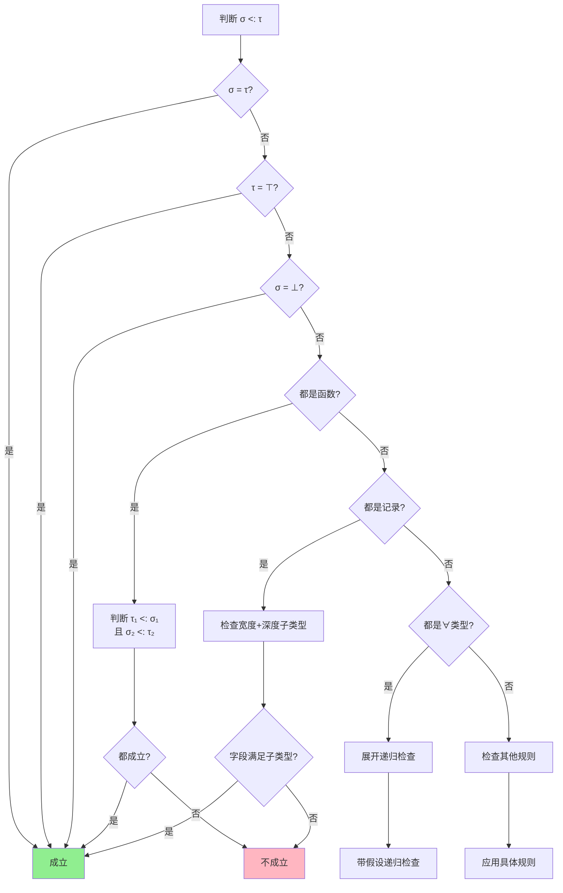
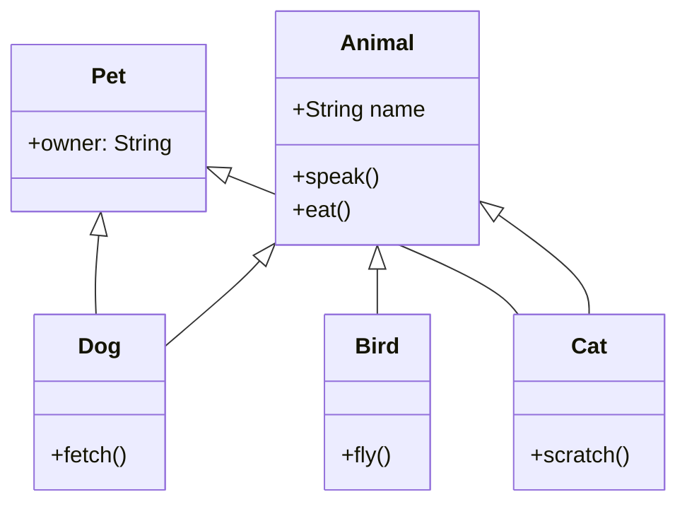

# 子类型理论 (Subtyping Theory)

> **所属单元**: 01-foundations | **前置依赖**: 05-type-theory.md | **形式化等级**: L2-L4

## 1. 概念定义

### 1.1 子类型概述

**Def-F-09-01: 子类型关系**

子类型关系（记作 $\sigma <: \tau$ 或 $\sigma \leq \tau$）是类型之间的二元关系，表示"任何需要类型 $\tau$ 的地方都可以安全地使用类型 $\sigma$ 的值"。

形式化定义：
$$\sigma <: \tau \iff \forall e.\ \Gamma \vdash e : \sigma \Rightarrow \Gamma \vdash e : \tau$$

**核心直觉**：子类型体现了"is-a"关系——$\sigma$ 的每个值都可以被视为 $\tau$ 的实例。

**Def-F-09-02: 子类型上下文**

子类型上下文 $\Delta$ 记录类型变量之间的子类型约束：
$$\Delta ::= \emptyset \mid \Delta, \alpha <: \tau$$

扩展类型判断形式为 $\Delta; \Gamma \vdash e : \tau$。

### 1.2 安全替换原则

**Def-F-09-03: Liskov替换原则 (LSP)**

Barbara Liskov (1987) 提出的替换原则[^1]：

> 若 $\sigma <: \tau$，则任何在类型 $\tau$ 上成立的性质 $P$ 对类型 $\sigma$ 的所有对象也成立。

形式化表达：
$$\sigma <: \tau \Rightarrow \forall P.\ P^\tau \subseteq P^\sigma$$

其中 $P^\tau$ 表示类型 $\tau$ 上性质 $P$ 的成立集合。

**Def-F-09-04: 行为子类型 (Behavioral Subtyping)**

更强的子类型要求保持行为一致性[^2]：

若 $\sigma <: \tau$，则对任意上下文 $C[\cdot]$：
$$C[e_\tau] \Downarrow v \Rightarrow \forall e_\sigma : \sigma.\ C[e_\sigma] \Downarrow v' \land v \approx v'$$

其中 $\approx$ 表示观察等价。

**Def-F-09-05: 替换性条件**

类型 $\sigma$ 可安全替换类型 $\tau$ 当满足：

1. **前置条件弱化**：$pre_\tau \Rightarrow pre_\sigma$
2. **后置条件强化**：$post_\sigma \Rightarrow post_\tau$
3. **不变式保持**：$inv_\tau \Rightarrow inv_\sigma$

### 1.3 变型性：协变、逆变与不变

**Def-F-09-06: 变型性 (Variance)**

变型性描述类型构造器如何保持或反转子类型关系：

设 $F$ 是类型构造器，$\sigma <: \tau$：

| 变型性 | 定义 | 条件 |
|--------|------|------|
| **协变 (Covariant)** | $F(\sigma) <: F(\tau)$ | 保持子类型方向 |
| **逆变 (Contravariant)** | $F(\tau) <: F(\sigma)$ | 反转子类型方向 |
| **不变 (Invariant)** | 无子类型关系 | 要求类型相等 |
| **双变 (Bivariant)** | 同时协变和逆变 | $F(\sigma) <: F(\tau)$ 和 $F(\tau) <: F(\sigma)$ |

**Def-F-09-07: 变型性位置规则**

类型中的每个位置都有变型性标注：

| 位置 | 变型性 | 说明 |
|------|--------|------|
| 返回值位置 | 协变 | 返回子类型更安全 |
| 参数位置 | 逆变 | 接受超类型更安全 |
| 可变字段 | 不变 | 读写均需类型相等 |
| 不可变字段 | 协变 | 只读可协变 |

**形式化定义**：

函数类型的变型性规则：
$$\frac{\sigma' <: \sigma \quad \tau <: \tau'}{\sigma \to \tau <: \sigma' \to \tau'}$$

参数位置逆变（需接受更大的输入集），返回位置协变（可返回更小的输出集）。

### 1.4 顶类型和底类型

**Def-F-09-08: 顶类型 (Top Type)**

顶类型 $\top$（也称 `Object`、`any`、`*`）是所有类型的超类型：
$$\forall \tau.\ \tau <: \top$$

性质：

- 无操作：$\top$ 上可执行的操作是所有类型共有的
- 信息损失：将值赋给 $\top$ 后丢失具体类型信息
- 运行时类型检查：通常需要向下转型才能使用

**Def-F-09-09: 底类型 (Bottom Type)**

底类型 $\bot$（也称 `Nothing`、`Never`）是所有类型的子类型：
$$\forall \tau.\ \bot <: \tau$$

性质：

- 无值：不存在类型为 $\bot$ 的值（在总体语言中）
- 发散：类型为 $\bot$ 的表达式永不返回（如异常、无限循环）
- 幂等：$\tau \to \bot$ 等价于 $\neg\tau$（否定）

**Def-F-09-10: 有界类型变量**

引入有界量化后，类型变量的范围受限：
$$\forall \alpha <: \tau.\ \sigma$$

其中 $\alpha$ 只能实例化为 $\tau$ 的子类型。

---

## 2. 子类型规则

### 2.1 基本子类型规则

**Def-F-09-11: 子类型关系公理**

| 规则 | 名称 | 形式 |
|------|------|------|
| 自反 | Refl | $\frac{}{\tau <: \tau}$ |
| 传递 | Trans | $\frac{\sigma <: \tau \quad \tau <: \rho}{\sigma <: \rho}$ |
| 顶类型 | Top | $\frac{}{\tau <: \top}$ |
| 底类型 | Bot | $\frac{}{\bot <: \tau}$ |

### 2.2 记录子类型

**Def-F-09-12: 记录类型**

记录类型是带标签的积类型：
$$\{l_1: \tau_1, \ldots, l_n: \tau_n\}$$

**宽度子类型 (Width Subtyping)**[^3]：

$$\frac{}{
\{l_1: \tau_1, \ldots, l_n: \tau_n, l_{n+1}: \tau_{n+1}, \ldots, l_m: \tau_m\} <:
\{l_1: \tau_1, \ldots, l_n: \tau_n\n}}
$$

**直观**：具有更多字段的记录是子类型（满足更多约束）。

**深度子类型 (Depth Subtyping)**：

$$\frac{\sigma_1 <: \tau_1 \quad \cdots \quad \sigma_n <: \tau_n}
{\{l_1: \sigma_1, \ldots, l_n: \sigma_n\} <: \{l_1: \tau_1, \ldots, l_n: \tau_n\}}
$$

**排列子类型 (Permutation Subtyping)**：

$$\frac{\pi \text{ 是 } \{1,\ldots,n\} \text{ 的排列}}
{\{l_1: \tau_1, \ldots, l_n: \tau_n\} <: \{l_{\pi(1)}: \tau_{\pi(1)}, \ldots, l_{\pi(n)}: \tau_{\pi(n)}\}}
$$

**Def-F-09-13: 宽度子类型的语义**

记录子类型对应于谓词的合取：
$$\{l_1: \tau_1, \ldots, l_n: \tau_n\} \sim P_1 \land \cdots \land P_n$$

添加字段是添加合取子句，使谓词更强（蕴涵关系）。

### 2.3 函数子类型

**Def-F-09-14: 函数子类型规则**

函数类型的子类型关系：

$$\frac{\sigma' <: \sigma \quad \tau <: \tau'}{\sigma \to \tau <: \sigma' \to \tau'}$$

**变型性分析**：

| 位置 | 变型性 | 原因 |
|------|--------|------|
| 参数类型 $\sigma$ | 逆变 | 接受更大的输入集更安全 |
| 返回类型 $\tau$ | 协变 | 返回更小的输出集更精确 |

**推导**：设 $f : \sigma \to \tau$，要在类型 $\sigma' \to \tau'$ 的上下文中使用：

- 输入：上下文可能传入 $\sigma'$ 的值，$f$ 需能处理，故 $\sigma' <: \sigma$（逆变）
- 输出：$f$ 返回 $\tau$，上下文期望 $\tau'$，故 $\tau <: \tau'$（协变）

**Def-F-09-15: 多参数函数**

多参数函数可柯里化为高阶函数：

$$\sigma_1 \to \sigma_2 \to \tau \quad \text{变型性: 逆变, 逆变, 协变}$$

### 2.4 引用子类型

**Def-F-09-16: 引用类型的变型性**

可变引用（可读写）的类型必须是**不变的**：

$$\frac{\sigma = \tau}{Ref\ \sigma <: Ref\ \tau}$$

**原因分析**：

- **协变问题**：若 $Ref\ \sigma <: Ref\ \tau$，可写超类型值破坏子类型值
- **逆变问题**：若 $Ref\ \tau <: Ref\ \sigma$，可读子类型值实际可能是超类型

**Def-F-09-17: 只读和只写引用**

| 引用类型 | 变型性 | 原因 |
|----------|--------|------|
| $ReadOnly\ \sigma$ | 协变 | 只读安全 |
| $WriteOnly\ \sigma$ | 逆变 | 只写安全 |
| $Ref\ \sigma$ | 不变 | 读写均需相等 |

### 2.5 数组和列表子类型

**Def-F-09-18: 数组子类型**

数组通常是不变的：

$$\frac{\sigma = \tau}{Array\ \sigma <: Array\ \tau}$$

**Java数组协变的历史问题**[^4]：

Java设计早期允许数组协变（`String[] <: Object[]`），导致运行时异常：

```java
String[] strs = new String[10];
Object[] objs = strs;  // 允许（协变）
objs[0] = 42;  // 运行时抛出 ArrayStoreException
```

**Def-F-09-19: 不可变列表子类型**

不可变列表可安全协变：

$$\frac{\sigma <: \tau}{List\ \sigma <: List\ \tau}$$

**Def-F-09-20: 变长数组与协变**

使用变型性标注的现代语言设计：

```
Array<+T>   // 协变数组（只读视图）
Array<-T>   // 逆变数组（只写视图）
Array<T>    // 不变数组（读写）
```

---

## 3. 有界量化

### 3.1 F<:系统

**Def-F-09-21: 有界多态系统 (System F<:)**[^5]

System F<: 是 System F 的扩展，引入有界类型变量：

$$
\begin{aligned}
\text{Types: } & \tau ::= \alpha \mid \tau \to \tau \mid \forall \alpha <: \tau.\ \tau \mid \top \\
\text{Terms: } & t ::= x \mid \lambda x:\tau.t \mid t\,t \mid \Lambda \alpha <: \tau.t \mid t[\tau]
\end{aligned}
$$

**Def-F-09-22: F<:的类型规则**

| 规则 | 形式 |
|------|------|
| 类型抽象 | $\frac{\Delta, \alpha <: \tau; \Gamma \vdash t : \sigma}{\Delta; \Gamma \vdash \Lambda \alpha <: \tau.\ t : \forall \alpha <: \tau.\ \sigma}$ |
| 类型应用 | $\frac{\Delta; \Gamma \vdash t : \forall \alpha <: \tau.\ \sigma \quad \Delta \vdash \rho <: \tau}{\Delta; \Gamma \vdash t[\rho] : \sigma[\rho/\alpha]}$ |
| 有界变量 | $\frac{\alpha <: \tau \in \Delta}{\Delta \vdash \alpha <: \tau}$ |

### 3.2 有界多态

**Def-F-09-23: 有界量化的语义**

有界量化 $\forall \alpha <: \tau.\ \sigma$ 表示：

> "对所有满足 $\alpha <: \tau$ 的类型 $\alpha$，$\sigma$ 成立"

这允许在实现中使用 $\tau$ 的接口，同时保留多态性。

**Def-F-09-24: F-有界多态 (F-bounded Polymorphism)**

处理递归类型约束：

$$\forall \alpha <: F(\alpha).\ \sigma$$

其中 $F$ 是类型函数。

**示例**：Java中的 `Comparable` 接口

```java
// [伪代码片段 - 不可直接运行] 仅展示核心逻辑
interface Comparable<T> {
    int compareTo(T other);
}

<T extends Comparable<T>> T max(T a, T b)  // F-有界
```

对应F<:表示：
$$max : \forall \alpha <: Comparable\langle\alpha\rangle.\ \alpha \to \alpha \to \alpha$$

### 3.3 约束满足

**Def-F-09-25: 约束系统**

子类型约束系统由一组不等式组成：

$$C ::= \emptyset \mid C \cup \{\sigma <: \tau\}$$

**约束满足**：替换 $\theta$ 满足 $C$ 当：
$$\forall (\sigma <: \tau) \in C.\ \theta(\sigma) <: \theta(\tau)$$

**Def-F-09-26: 约束求解算法**

输入：约束集 $C$
输出：最一般合一替换 $\theta$ 或失败

**步骤**：

1. 分解复合类型约束
2. 简化原子约束
3. 检查循环（递归类型）
4. 应用替换传播

### 3.4 类型推断

**Def-F-09-27: 有界量化类型推断**

带子类型的类型推断问题：

给定 $\Gamma$ 和 $e$，找到 $\tau$ 和约束 $C$ 使得：
$$\Gamma \vdash e : \tau \mid C$$

然后求解 $C$ 得到替换 $\theta$。

**Def-F-09-28: 局部类型推断 (Local Type Inference)**

Pierce & Turner (1998)[^6] 提出的实用方法：

1. **传播**：从已知类型信息推断未知类型
2. **匹配**：比较预期类型和实际类型生成约束

**算法**（局部推断）：

```
infer(Γ, x) = Γ(x)
infer(Γ, λx.e) = fresh(α) → infer(Γ, x:α, e)
infer(Γ, e1 e2) = let τ1 = infer(Γ, e1)
                   let τ2 = infer(Γ, e2)
                   match τ1 with
                   | σ → τ => add_constraint(τ2 <: σ); τ
                   | α => let β = fresh()
                         add_constraint(α ≡ τ2 → β); β
```

---

## 4. 类型系统

### 4.1 子类型判断算法

**Def-F-09-29: 语法导向的子类型判断**

判断 $\Delta \vdash \sigma <: \tau$ 的算法：

| 条件 | 结果 |
|------|------|
| $\sigma = \tau$ | 成立 |
| $\tau = \top$ | 成立 |
| $\sigma = \bot$ | 成立 |
| $\sigma = \{l_i: \sigma_i\}, \tau = \{l_j: \tau_j\}$ | 宽度+深度检查 |
| $\sigma = \sigma_1 \to \sigma_2, \tau = \tau_1 \to \tau_2$ | $\tau_1 <: \sigma_1$ 且 $\sigma_2 <: \tau_2$ |
| $\sigma = \forall \alpha <: \sigma_1.\ \sigma_2$ | 展开后递归检查 |

**Def-F-09-30: 递归类型处理 (Amber规则)**

对于递归类型 $\mu X.\ \tau$：

$$\frac{X <: Y \vdash \tau_X <: \tau_Y}{\mu X.\ \tau_X <: \mu Y.\ \tau_Y}$$

其中假设 $X <: Y$ 用于处理递归。

**Prop-F-09-01: 子类型判断的终止性**

对于有限展开深度的类型，子类型判断算法必然终止。

### 4.2 Meet和Join

**Def-F-09-31: Meet (最大下界)**

类型 $\sigma$ 和 $\tau$ 的 meet（记作 $\sigma \land \tau$ 或 $\sigma \sqcap \tau$）：

$$\sigma \sqcap \tau = \sup_{\rho <: \sigma, \rho <: \tau} \rho$$

即最大的公共子类型。

**Def-F-09-32: Join (最小上界)**

类型 $\sigma$ 和 $\tau$ 的 join（记作 $\sigma \lor \tau$ 或 $\sigma \sqcup \tau$）：

$$\sigma \sqcup \tau = \inf_{\sigma <: \rho, \tau <: \rho} \rho$$

即最小的公共超类型。

**Prop-F-09-02: Meet和Join的存在性**

在具有顶类型和底类型的系统中：

- 任意两个类型的 meet 存在（至少为 $\bot$）
- 任意两个类型的 join 存在（至多为 $\top$）

**Def-F-09-33: 记录类型的Meet/Join**

记录 meet（公共字段的 meet）：
$$\{l_1: \sigma_1, l_2: \sigma_2\} \sqcap \{l_1: \tau_1, l_3: \tau_3\} = \{l_1: \sigma_1 \sqcap \tau_1\}$$

记录 join（所有字段的 join）：
$$\{l_1: \sigma_1, l_2: \sigma_2\} \sqcup \{l_1: \tau_1, l_3: \tau_3\} = \{l_1: \sigma_1 \sqcup \tau_1, l_2: \sigma_2, l_3: \tau_3\}$$

### 4.3 类型转换

**Def-F-09-34: 向上转型 (Upcasting)**

将子类型值转为超类型值：
$$(up)\ \frac{\Gamma \vdash e : \sigma \quad \sigma <: \tau}{\Gamma \vdash e : \tau}$$

向上转型是安全的，不需要运行时检查。

**Def-F-09-35: 向下转型 (Downcasting)**

将超类型值转为子类型值：
$$(down)\ \frac{\Gamma \vdash e : \tau \quad \sigma <: \tau}{\Gamma \vdash e \text{ as } \sigma : \sigma}$$

向下转型需要运行时检查，可能失败。

**Def-F-09-36: 智能转换 (Smart Casts)**

在类型守卫后自动缩小类型：

```
if (e is String) {
    // 在此块中 e 的类型为 String
}
```

### 4.4 变型性检查

**Def-F-09-37: 变型性推断**

自动推断类型参数的变型性：

```
flip : ∀αβ. (α → β) → β → α  // 参数变型性: 逆变, 协变
```

**规则**：

- 类型参数在返回位置出现 → 协变
- 类型参数在参数位置出现 → 逆变
- 同时在返回和参数位置出现 → 不变

**Def-F-09-38: 变型性注解**

显式指定变型性（Scala、Kotlin、C#）：

```scala
class List[+A]        // 协变
class Comparator[-A]  // 逆变
class Array[A]        // 不变（默认）
```

---

## 5. 形式证明

### 5.1 子类型可靠性与传递性

**Thm-F-09-01: 子类型的可靠性 (Soundness of Subtyping)**

若 $\Delta \vdash \sigma <: \tau$，则对所有满足 $\Delta$ 的替换 $\theta$：
$$\forall v.\ \vdash v : \theta(\sigma) \Rightarrow \vdash v : \theta(\tau)$$

*证明概要*：对子类型推导进行结构归纳。

**基例**（自反）：$\tau <: \tau$ 显然保持类型。

**归纳步**：

- **传递情况**：由归纳假设，$\sigma <: \tau$ 和 $\tau <: \rho$ 都保持类型，故 $\sigma <: \rho$ 也保持。
- **函数情况**：设 $v : \sigma_1 \to \sigma_2$，需证 $v : \tau_1 \to \tau_2$。对任意 $e : \tau_1$，由逆变假设 $\tau_1 <: \sigma_1$，有 $e : \sigma_1$，故 $v\,e : \sigma_2$。由协变假设 $\sigma_2 <: \tau_2$，有 $v\,e : \tau_2$。∎

**Thm-F-09-02: 子类型的传递性**

若 $\sigma <: \tau$ 且 $\tau <: \rho$，则 $\sigma <: \rho$。

*形式证明*：

对推导深度进行归纳。

**引理 1**：若 $\sigma <: \tau$ 通过规则 $R_1$，$\tau <: \rho$ 通过规则 $R_2$，则可构造 $\sigma <: \rho$。

**情况分析**：

1. **自反情况**：若 $\tau <: \rho$ 是自反，则 $\tau = \rho$，直接有 $\sigma <: \tau = \rho$。

2. **函数类型**：
   - 设 $\sigma = \sigma_1 \to \sigma_2$，$\tau = \tau_1 \to \tau_2$，$\rho = \rho_1 \to \rho_2$
   - 已知：$\tau_1 <: \sigma_1$，$\sigma_2 <: \tau_2$
   - 已知：$\rho_1 <: \tau_1$，$\tau_2 <: \rho_2$
   - 由归纳假设：$\rho_1 <: \sigma_1$，$\sigma_2 <: \rho_2$
   - 应用函数规则得 $\sigma_1 \to \sigma_2 <: \rho_1 \to \rho_2$

3. **记录类型**：类似分析，宽度+深度子类型都保持传递性。

**结论**：所有情况的组合都保持传递性。∎

### 5.2 子类型与多态的结合

**Thm-F-09-03: 有界多态的类型安全性**

System F<: 满足类型安全性：

1. **保持性 (Preservation)**：若 $\Delta; \Gamma \vdash e : \tau$ 且 $e \to e'$，则 $\Delta; \Gamma \vdash e' : \tau$。

2. **进展性 (Progress)**：若 $\vdash e : \tau$ 且 $e$ 是闭项，则 $e$ 是值或存在 $e'$ 使得 $e \to e'$。

*证明概要*：

**保持性**：对归约规则归纳。

- 类型应用规约：$(\Lambda \alpha <: \tau.\ t)[\rho] \to t[\rho/\alpha]$
  - 由前提：$\Delta \vdash \rho <: \tau$
  - 由替换引理：类型正确保持

**进展性**：与 System F 类似，类型抽象和应用都有推进规则。∎

**Thm-F-09-04: 关系参数性的保持**

System F<: 保持 Reynolds 关系参数性[^7]：

对任意多态类型 $\forall \alpha <: \tau.\ \sigma$ 和满足边界的关系替换 $\eta$：

$$\mathcal{R}_{\forall \alpha <: \tau.\ \sigma, \eta} = \{(u, v) \mid \forall R \subseteq \llbracket \tau \rrbracket_\eta^2.\ (u_A, v_B) \in \mathcal{R}_{\sigma, \eta[\alpha \mapsto R]}\}$$

其中关系 $R$ 必须是边界类型的子关系。

*证明*：扩展 System F 的参数性证明，增加有界情况的归纳。∎

### 5.3 与类型系统的一致性

**Thm-F-09-05: 子类型与类型等价**

子类型关系与类型等价 $\equiv$ 兼容：
$$\sigma \equiv \tau \Rightarrow \sigma <: \tau \land \tau <: \sigma$$

*证明*：类型等价是结构同构，保持子类型关系。∎

**Thm-F-09-06: 子类型判断的可判定性**

对有限类型（无递归或递归良定义），子类型判断 $\sigma <: \tau$ 是可判定的。

*证明*：

1. 子类型算法终止（结构归纳）
2. 算法正确（可靠性定理）
3. 算法完备（相对完备性）

递归类型情况：使用 A-m-c 规则确保终止。∎

### 5.4 进阶：语义子类型

**Thm-F-09-07: 语义子类型的刻画**

对于交错类型（intersection types）和并类型（union types）：

$$\sigma_1 \land \sigma_2 <: \tau \iff \sigma_1 <: \tau \lor \sigma_2 <: \tau$$

$$\tau <: \sigma_1 \lor \sigma_2 \iff \tau <: \sigma_1 \lor \tau <: \sigma_2$$

这些规则扩展了传统语法子类型的表达能力。

---

## 6. 实例验证

### 6.1 面向对象中的子类型

**示例：类层次结构**

```java
// [伪代码片段 - 不可直接运行] 仅展示核心逻辑
class Animal {
    String name;
    void speak() { ... }
}

class Dog extends Animal {
    void fetch() { ... }  // 扩展方法
}

class Cat extends Animal {
    void scratch() { ... }
}
```

**子类型关系**：

- $Dog <: Animal$（宽度子类型：额外方法）
- $Cat <: Animal$

**LSP验证**：

- 期望 $Animal$ 的上下文可安全使用 $Dog$ 或 $Cat$
- `speak()` 方法在所有子类中保持语义

### 6.2 记录类型示例

**TypeScript 记录子类型**：

```typescript
interface Point { x: number; y: number; }
interface Point3D { x: number; y: number; z: number; }

// Point3D <: Point（宽度子类型）
const p3d: Point3D = { x: 1, y: 2, z: 3 };
const p2d: Point = p3d;  // 允许

// 深度子类型
interface NamedPoint { point: Point; name: string; }
interface NamedPoint3D { point: Point3D; name: string; }
// NamedPoint3D <: NamedPoint
```

### 6.3 接口和实现

**Rust trait 作为子类型约束**：

```rust
trait Drawable {
    fn draw(&self);
}

struct Circle { radius: f64 }
impl Drawable for Circle {
    fn draw(&self) { ... }
}

// 有界量化：T <: Drawable
fn render<T: Drawable>(shape: T) {
    shape.draw();
}
```

**Scala 变型性注解**：

```scala
// 协变：Container[Dog] <: Container[Animal]
trait Container[+A] {
  def get: A
}

// 逆变：Comparator[Animal] <: Comparator[Dog]
trait Comparator[-A] {
  def compare(a1: A, a2: A): Int
}

// 不变：Box[Dog] 与 Box[Animal] 无关
trait Box[A] {
  def get: A
  def set(a: A): Unit
}
```

### 6.4 函数子类型应用

**回调类型的逆变**：

```typescript
// 事件处理器类型
interface Event { timestamp: number; }
interface ClickEvent extends Event { x: number; y: number; }

type EventHandler<E extends Event> = (e: E) => void;

// 逆变：(e: Event) => void <: (e: ClickEvent) => void
const genericHandler: EventHandler<Event> = (e) => {
    console.log(e.timestamp);
};

const clickHandler: EventHandler<ClickEvent> = genericHandler;  // 允许
```

**原因**：处理通用事件的函数可以处理任何特定事件。

### 6.5 类型转换实践

**Kotlin 智能转换**：

```kotlin
fun process(obj: Any) {
    if (obj is String) {
        // obj 自动转为 String 类型
        println(obj.length)
    }
}
```

**Swift 可选类型与子类型**：

```swift
// 协变：T <: Optional<T>
let name: String = "Alice"
let optionalName: String? = name  // 向上转型

// 向下转型需要解包
if let definiteName = optionalName {
    // definiteName: String
}
```

### 6.6 实际语言中的子类型系统

**Go 接口实现**：

```go
// 隐式接口：无需显式声明实现
type Reader interface {
    Read(p []byte) (n int, err error)
}

type File struct { ... }
func (f *File) Read(p []byte) (n int, err error) { ... }

// *File <: Reader 自动成立
var r Reader = new(File)  // 允许
```

**C++ 模板约束（C++20 Concepts）**：

```cpp
template<typename T>
concept Comparable = requires(T a, T b) {
    { a < b } -> std::convertible_to<bool>;
};

// 有界量化：T <: Comparable
template<Comparable T>
T max(T a, T b) {
    return a < b ? b : a;
}
```

---

## 7. 可视化

### 7.1 子类型层次结构图

```mermaid
graph BT
    subgraph 子类型层次
    TOP[⊤ / Object<br/>所有类型的超类型]

    Animal[Animal<br/>name: String<br/>speak(): Unit]
    Drawable[Drawable<br/>draw(): Unit]
    Comparable[Comparable<br/>compareTo(): Int]

    Dog[Dog<br/>+fetch(): Unit]
    Cat[Cat<br/>+scratch(): Unit]
    Circle[Circle<br/>radius: Float<br/>draw(): Unit]
    String[String<br/>compareTo(): Int]

    BOT[⊥ / Nothing<br/>所有类型的子类型]

    TOP --- Animal
    TOP --- Drawable
    TOP --- Comparable

    Animal --- Dog
    Animal --- Cat
    Drawable --- Circle
    Comparable --- String

    Dog --- BOT
    Cat --- BOT
    Circle --- BOT
    String --- BOT
    end
```

**图说明**：展示子类型关系的层次结构。顶类型 $\top$ 是所有类型的超类型，底类型 $\bot$ 是所有类型的子类型。箭头表示子类型方向（从子类型指向超类型）。

### 7.2 变型性规则图

```mermaid
graph LR
    subgraph 变型性规则

    subgraph 函数类型变型性
    F[Function<br/>参数 → 返回]
    Param[参数位置<br/>逆变 Contravariant]
    Return[返回位置<br/>协变 Covariant]

    F -->|输入| Param
    F -->|输出| Return
    end

    subgraph 类型构造器变型性
    TC[类型构造器]
    Cov[+A 协变]
    Con[-A 逆变]
    Inv[A 不变]

    TC --> Cov
    TC --> Con
    TC --> Inv
    end

    subgraph 示例
    List[List[+A]<br/>协变]
    Comp[Comparator[-A]<br/>逆变]
    Array[Array[A]<br/>不变]

    Cov -.-> List
    Con -.-> Comp
    Inv -.-> Array
    end

    end
```

**图说明**：展示变型性的核心规则。函数类型的参数位置是逆变的（接受更大的输入集），返回位置是协变的（返回更小的输出集）。类型构造器可声明为协变(+)、逆变(-)或不变（无标注）。

### 7.3 子类型判断决策树



**图说明**：子类型判断算法的决策流程。算法按优先级尝试各种规则，包括自反、顶/底类型、函数类型、记录类型和量化类型的处理。

### 7.4 有界量化与约束系统

```mermaid
graph TB
    subgraph F<:系统结构

    TB[类型边界<br/>Type Bounds]
    UB[上界 τ<br/>α <: τ]
    LB[下界 τ<br/>τ <: α]

    TB --> UB
    TB --> LB

    CP[约束传播<br/>Constraint Propagation]
    UF[合一<br/>Unification]
    SS[子类型求解<br/>Subtyping Solver]

    UB --> CP
    LB --> CP
    CP --> UF
    CP --> SS

    EX[实例化<br/>Instantiation]
    Val[类型验证<br/>Validation]

    UF --> EX
    SS --> EX
    EX --> Val

    subgraph 示例
    EX1[∀α <: Animal. α → α]
    EX2[Dog <: Animal ✓]
    EX3[Result: Dog → Dog]

    EX1 -.-> EX2
    EX2 -.-> EX3
    end

    Val -.-> EX1

    end
```

**图说明**：展示有界量化系统中的约束处理流程。类型边界通过约束传播生成约束集，经过合一和子类型求解，最终完成类型实例化和验证。

### 7.5 面向对象继承与子类型关系



**图说明**：展示面向对象中的多重继承与子类型关系。`Dog` 同时继承自 `Animal` 和 `Pet`，体现了子类型的多继承特性。箭头表示继承/子类型方向。

---

## 8. 引用参考

[^1]: B. Liskov, "Data Abstraction and Hierarchy," *SIGPLAN Notices*, 23(5), 1987. 提出了Liskov替换原则，奠定了行为子类型的理论基础。

[^2]: B. Liskov and J. M. Wing, "A Behavioral Notion of Subtyping," *ACM Transactions on Programming Languages and Systems* (TOPLAS), 16(6), 1994. 形式化定义了行为子类型和替换性条件。

[^3]: L. Cardelli, "A Semantics of Multiple Inheritance," *Information and Computation*, 76, 1988. 首次系统研究了记录子类型的宽度、深度和排列规则。

[^4]: J. Gosling, B. Joy, and G. Steele, *The Java Language Specification*, Addison-Wesley, 1996. 详细说明了Java数组协变的设计决策及其运行时检查机制。

[^5]: B. C. Pierce, *Types and Programming Languages*, MIT Press, 2002. 第15章系统介绍了System F<:的语法、语义和类型安全性证明。（TAPL - 类型理论经典教材）

[^6]: B. C. Pierce and D. N. Turner, "Local Type Inference," *ACM Transactions on Programming Languages and Systems* (TOPLAS), 22(1), 2000. 提出了局部类型推断算法，平衡了类型推断能力和可预测性。

[^7]: J. C. Reynolds, "Types, Abstraction and Parametric Polymorphism," *IFIP Congress*, 1983. 首次提出关系参数性理论，建立了多态性的语义基础。
