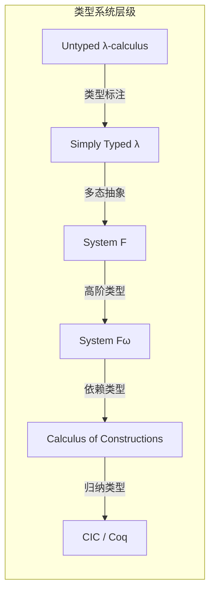
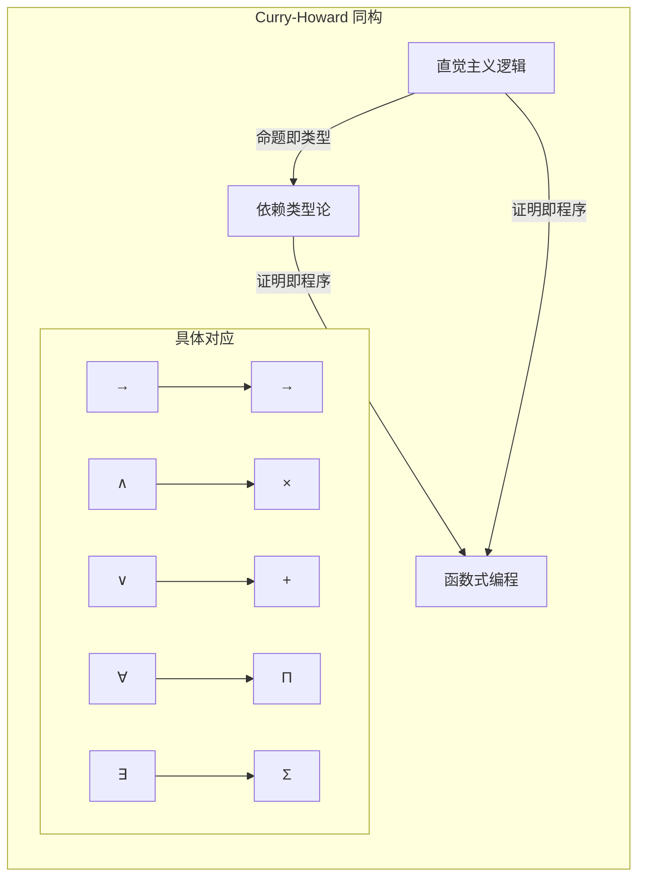
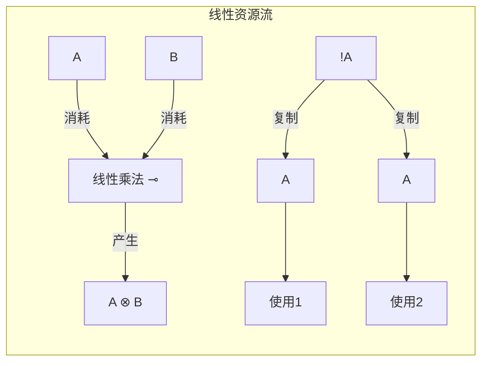
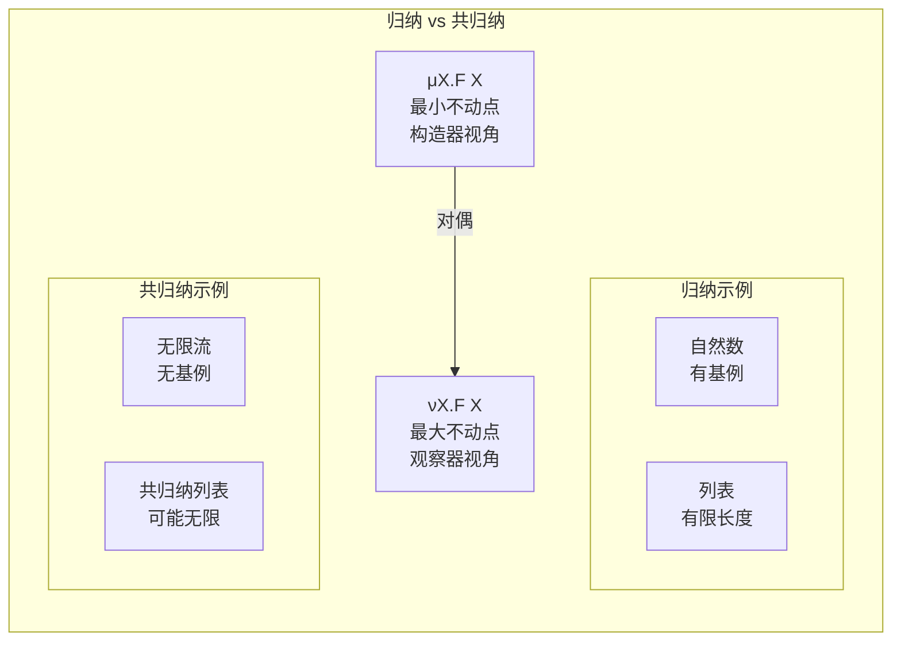

# CMU 15-712/15-814: 高级类型理论 (Advanced Type Theory)

> **所属阶段**: 01-foundations | **前置依赖**: [05-type-theory.md](./05-type-theory.md) | **形式化等级**: L5-L6
>
> **课程来源**: CMU 15-712 (Advanced Topics in Programming Languages) / 15-814 (Type Theory for Programming Languages)

## 1. 概念定义 (Definitions)

### 1.1 System Fω (高阶多态λ演算)

**Def-CMU-01-01: 类型构造器层级**

System Fω 通过引入**类型构造器**扩展 System F，形成类型层级：

$$\kappa ::= * \mid \kappa_1 \to \kappa_2$$

其中：

- $*$: 具体类型 (kind of types)，如 `Int`, `Bool`
- $\kappa_1 \to \kappa_2$: 类型构造器，如 `List`, `Tree`

**Def-CMU-01-02: System Fω 类型**

类型由以下文法生成：

$$\begin{aligned}
\sigma, \tau, A, B &::= x \mid \sigma \to \tau \mid \forall x:\kappa. \sigma \mid \Lambda x:\kappa. \sigma \mid \sigma\,\tau \\
\kappa &::= * \mid \kappa_1 \to \kappa_2
\end{aligned}$$

**Def-CMU-01-03: 类型运算与抽象**

- **类型构造器抽象**: 若 $\Gamma, X:\kappa \vdash \sigma : *$，则 $\Gamma \vdash \Lambda X:\kappa. \sigma : \kappa \to *$
- **类型构造器应用**: 若 $\Gamma \vdash \sigma : \kappa_1 \to \kappa_2$ 且 $\Gamma \vdash \tau : \kappa_1$，则 $\Gamma \vdash \sigma\,\tau : \kappa_2$

**Def-CMU-01-04: 高阶类型实例**

| 类型 | Kind | 说明 |
|------|------|------|
| `Int` | $*$ | 具体类型 |
| `List` | $* \to *$ | 一阶类型构造器 |
| `Functor` | $(* \to *) \to *$ | 高阶类型构造器 |
| `Monad` | $(* \to *) \to *$ | 高阶类型构造器 |
| `Fix` | $(* \to *) \to *$ | 递归类型构造器 |

### 1.2 依赖类型理论 (Dependent Type Theory)

**Def-CMU-01-05: 依赖函数类型 ($\Pi$-类型)**

$$\Pi x:A. B(x) \quad \text{(若 $x$ 不在 $B$ 中自由出现，退化为 $A \to B$)}$$

其中 $B(x)$ 是依赖于 $x:A$ 的类型族。

**Def-CMU-01-06: 依赖对类型 ($\Sigma$-类型)**

$$\Sigma x:A. B(x) = \{(a, b) \mid a:A, b:B(a)\}$$

投影运算：
- $\pi_1 : \Sigma x:A. B(x) \to A$
- $\pi_2 : \Pi p:(\Sigma x:A.B(x)). B(\pi_1(p))$

**Def-CMU-01-07: 归纳类型定义 (Inductive Families)**

归纳族 $P : A \to *$ 由构造器生成：

$$\text{Inductive } P : A \to * \text{ where } \{c_i : \Pi \vec{x}:\vec{T_i}. P(t_i[\vec{x}])\}_{i=1}^n$$

**Def-CMU-01-08: 共归纳类型 (Coinductive Types)**

共归纳类型由其观察器定义：

$$\text{CoInductive } C : * \text{ where } \{obs_i : C \to T_i\}_{i=1}^n$$

与归纳类型的对偶关系：
- 归纳 = 最小不动点 ($\mu$)
- 共归纳 = 最大不动点 ($\nu$)

### 1.3 逻辑框架 (Logical Framework, LF)

**Def-CMU-01-09: LF 类型层级**

LF (Edinburgh Logical Framework) 是一个依赖类型元语言：

| 层级 | 符号 | 说明 |
|------|------|------|
| Kind | Type | 类型范畴 |
| Type | kind | 对象级类型 |
| Object | obj | 证明/项 |

**Def-CMU-01-10: LF 判断即类型 (Judgments-as-Types)**

在 LF 中，判断 $J$ 编码为类型，证明编码为项：

$$\vdash_{\text{obj}} J \quad \Leftrightarrow \quad \vdash_{\text{LF}} M : \ulcorner J \urcorner$$

其中 $\ulcorner \cdot \urcorner$ 是编码函数。

**Def-CMU-01-11: 签名 (Signature)**

LF 签名 $\Sigma$ 是常数声明的集合：

$$\Sigma ::= \cdot \mid \Sigma, c:A \mid \Sigma, a:K$$

### 1.4 Curry-Howard 对应深入

**Def-CMU-01-12: 命题即类型 (Propositions as Types)**

| 逻辑构造 | 类型构造 | $\lambda$-项 |
|----------|----------|--------------|
| $A \Rightarrow B$ | $A \to B$ | $\lambda x:A. M$ |
| $A \land B$ | $A \times B$ | $(M, N)$ |
| $A \lor B$ | $A + B$ | $\text{inl } M \mid \text{inr } N$ |
| $\forall x:A. B(x)$ | $\Pi x:A. B(x)$ | $\lambda x:A. M$ |
| $\exists x:A. B(x)$ | $\Sigma x:A. B(x)$ | $(M, N)$ |
| $\neg A$ | $A \to \bot$ | - |
| $\top$ | $1$ (单位类型) | $()$ |
| $\bot$ | $0$ (空类型) | - |

**Def-CMU-01-13: 经典逻辑与构造性逻辑**

| 原理 | 经典 | 构造性 |
|------|------|--------|
| 排中律 | $A \lor \neg A$ | 不成立 (一般) |
| 双重否定消去 | $\neg\neg A \Rightarrow A$ | 不成立 (一般) |
| 选择公理 | 成立 | 与直觉主义兼容 |

### 1.5 线性逻辑 (Linear Logic)

**Def-CMU-01-14: 线性命题连接词**

| 连接词 | 符号 | 线性解释 |
|--------|------|----------|
| 多性合取 | $A \otimes B$ | 同时使用两者 |
| 多性析取 | $A \parr B$ | 资源选择 |
| 线性蕴含 | $A \multimap B$ | 消耗A产生B |
| 加性合取 | $A \& B$ | 外部选择 (and) |
| 加性析取 | $A \oplus B$ | 内部选择 (or) |
| 线性否定 | $A^\perp$ | 资源反转 |
| 当然(!) | $!A$ | 可复制资源 |
| 何必(?) | $?A$ | 可丢弃资源 |

**Def-CMU-01-15: 线性类型上下文**

线性类型判断：$\Gamma ; \Delta \vdash M : A$

其中：
- $\Gamma$: 直觉主义上下文 (可重复使用)
- $\Delta$: 线性上下文 (必须使用恰好一次)

**Def-CMU-01-16: 资源敏感计算**

资源解释：类型 $A$ 表示资源，项 $M : A$ 表示资源的变换过程。

线性类型规则确保：
- 每个线性变量恰好使用一次
- 资源不泄漏、不重复消耗

## 2. 属性推导 (Properties)

### 2.1 System Fω 的元理论

**Lemma-CMU-01-01: System Fω 的替换引理**

若 $\Gamma, X:\kappa \vdash \sigma : \kappa'$ 且 $\Gamma \vdash \tau : \kappa$，则 $\Gamma \vdash \sigma[\tau/X] : \kappa'$。

*证明概要*: 对 $\sigma$ 的推导进行结构归纳。

**Lemma-CMU-01-02: System Fω 的类型保持**

若 $\Gamma \vdash M : \sigma$ 且 $M \to_\beta M'$，则 $\Gamma \vdash M' : \sigma$。

**Lemma-CMU-01-03: System Fω 的强归约性**

所有良类型的 System Fω 项都是强归约的。

*证明要点*: 扩展 Tait-Girard 可约性候选集方法到高阶类型。

### 2.2 依赖类型的唯一性

**Lemma-CMU-01-04: 类型唯一性 (Uniqueness of Typing)**

若 $\Gamma \vdash M : A$ 且 $\Gamma \vdash M : B$，则 $A \equiv_\beta B$。

**Prop-CMU-01-01: 依赖类型的一致性**

纯构造演算 (CC) 是逻辑一致的：不存在闭项 $M$ 使得 $\vdash M : \Pi A:*. A$。

### 2.3 线性逻辑的切消

**Prop-CMU-01-02: 线性逻辑的切消定理**

线性序列演算具有切消性质：任何证明可转换为无切证明。

**Prop-CMU-01-03: 线性逻辑的表达能力**

线性逻辑可编码：
- 直觉主义逻辑：$A \to B \triangleq !A \multimap B$
- 经典逻辑：通过 $A^\perp$
- 模态逻辑：通过 $!$ 和 $?$ 算子

### 2.4 Curry-Howard 的完备性

**Prop-CMU-01-04: Curry-Howard 同构的完备性**

对于构造性命题逻辑：
$$A \vdash B \text{ (逻辑可证)} \Leftrightarrow \exists M. \vdash M : A \to B \text{ (类型可居)}$$

## 3. 关系建立 (Relations)

### 3.1 System Fω 与其他类型系统的关系

```
STLC ⊂ System F ⊂ System Fω ⊂ CC (Calculus of Constructions) ⊂ CIC (Coq)
```

**Prop-CMU-01-05: System Fω 表达 System F**

System F 是 System Fω 在 kind $*$ 上的片段。

**Prop-CMU-01-06: 与范畴论语义的对应**

| 类型论 | 范畴论 |
|--------|--------|
| $\Lambda X:\kappa. \sigma$ | 依赖积的右伴随 |
| $\sigma\,\tau$ | 求值态射 |
| 类型构造器 | 高阶函子 |
| 自然变换 | 多态函数 |

### 3.2 依赖类型与证明 assistants

| 系统 | 核心类型论 | 特点 |
|------|-----------|------|
| Coq | CIC (归纳构造演算) | 证明自动化强 |
| Agda | 依赖类型 MLTT | 依赖类型编程 |
| Lean | CIC + 类型类 | 数学形式化 |
| Idris | 依赖类型 + 线性类型 | 实用编程 |
| F* | 依赖类型 + SMT | 安全验证 |

### 3.3 线性逻辑与资源模型

**Prop-CMU-01-07: 线性类型与内存管理**

| 线性类型性质 | 编程语言实现 |
|-------------|-------------|
| 所有权唯一 | Rust 的所有权系统 |
| 借用检查 | Rust 的借用检查器 |
| 资源释放 | RAII 模式 |
| 无数据竞争 | Session Types |

### 3.4 LF 与逻辑嵌入

**Prop-CMU-01-08: LF 的通用性**

LF 可以嵌入：
- 一阶逻辑
- 高阶逻辑
- 模态逻辑
- 时序逻辑

通过适当的签名定义。

## 4. 论证过程 (Argumentation)

### 4.1 为什么需要 System Fω?

**多态抽象**: 在 System F 中无法定义高阶类型构造器如 `Functor`：

```haskell
-- System F: 无法表达
-- Functor 需要 kind (* -> *) -> *

-- System Fω:
Functor : (* -> *) -> *
Functor F = forall a. (a -> b) -> F a -> F b
```

**模块化**: 类型类 (Type Classes) 需要高阶多态。

### 4.2 依赖类型的实用性挑战

**优势**:
- 规范即类型
- 证明即程序
- 编译时保证

**挑战**:
| 问题 | 解决方案 |
|------|----------|
| 证明负担 | 自动化策略 (tactics) |
| 类型推断 | 显式标注 + 局部推断 |
| 编译时间 | 证明擦除 |

### 4.3 线性逻辑的工程价值

**Rust 的线性类型启发**:
- 所有权 = 线性资源
- 借用 = 暂时共享
- 生命周期 = 线性时序

**会话类型 (Session Types)**:
- 通信协议作为类型
- 线性确保协议完成

### 4.4 Curry-Howard 的工程意义

**类型驱动的开发**:
1. 先写类型 (规范)
2. 再实现 (构造证明)
3. 类型检查器验证正确性

## 5. 形式证明 / 工程论证 (Proof / Engineering Argument)

### 5.1 System Fω 的强归约性

**Thm-CMU-01-01: System Fω 强归约定理**

所有良类型的 System Fω 项都是强归约的。

*证明概要* (扩展 Girard 方法):

**步骤1**: 定义 kind 上的可约性候选集。

对于 $\kappa = *$: $\text{RED}_* = \{S \subseteq \Lambda^0 \mid S \text{ 是饱和的}\}$

对于 $\kappa = \kappa_1 \to \kappa_2$:
$$\text{RED}_{\kappa_1 \to \kappa_2} = \{F \mid \forall R \in \text{RED}_{\kappa_1}. F(R) \in \text{RED}_{\kappa_2}\}$$

**步骤2**: 定义类型 $\sigma$ 在赋值 $\eta$ 下的解释 $\llbracket \sigma \rrbracket_\eta$。

**步骤3**: 证明归约保持可约性。

**步骤4**: 证明所有良类型项都是可约的。

∎

### 5.2 构造演算的一致性

**Thm-CMU-01-02: 构造演算一致性**

不存在闭项 $M$ 使得 $\vdash_{CC} M : \Pi A:*. A$。

*证明概要*:

1. 由强归约性，所有项都有范式。
2. 假设存在这样的 $M$，则对任意类型 $\tau$:
   $$M\,\tau : \tau$$
3. $M\,\tau$ 必须归约到 $\tau$ 类型的值。
4. 但不同类型有不同值集合，矛盾。

∎

### 5.3 线性逻辑的切消

**Thm-CMU-01-03: 线性序列演算切消定理**

任何可证sequent都有无切证明。

*证明概要* (Gentzen 风格):

对切公式的复杂度进行归纳，将切规则逐步向上推，直到消去。

关键情况：
- $A \otimes B$ 与 $A^\perp \parr B^\perp$
- $!A$ 与 $?A^\perp$

∎

### 5.4 Curry-Howard 同构的形式化

**Thm-CMU-01-04: Curry-Howard 同构**

对于构造性命题逻辑 IPL 和简单类型 $\lambda$-演算 STLC：

$$\text{IPL} \cong \text{STLC}$$

形式化：

1. **命题 ↔ 类型**: 双射 $\ulcorner \cdot \urcorner : \text{Prop} \to \text{Type}$
2. **证明 ↔ 项**: 双射 $\llbracket \cdot \rrbracket : \text{Proof}(A) \to \text{Term}(\ulcorner A \urcorner)$
3. **证明归约 ↔ $\beta$-归约**: 保持结构

∎

## 6. 实例验证 (Examples)

### 6.1 System Fω: 类型构造器示例

**Functor 类型类编码**:

```
Functor : (* -> *) -> *
Functor F = forall a b. (a -> b) -> F a -> F b

fmap : forall F:*->*. Functor F -> forall a b. (a -> b) -> F a -> F b
fmap = ΛF:*->*. λdict:Functor F. Λa. Λb. λf. λx. dict a b f x

-- List 的 Functor 实例
listFunctor : Functor List
listFunctor = Λa. Λb. λf. λxs.
  xs [List b] (λx. λacc. cons (f x) acc) nil
```

**Monad 类型类编码**:

```
Monad : (* -> *) -> *
Monad M = Sigma
  { return : forall a. a -> M a
  ; bind   : forall a b. M a -> (a -> M b) -> M b
  }
```

### 6.2 依赖类型: 带长度的向量

```agda
-- 向量类型族
Vec : Type -> Nat -> Type
Vec A 0       = Unit
Vec A (S n)   = A × Vec A n

-- 安全的 head
head : {A : Type} -> {n : Nat} -> Vec A (S n) -> A
head (x :: _) = x

-- 类型保证不会调用 head on empty list

-- append 保持长度
append : {A : Type} -> {m n : Nat} -> Vec A m -> Vec A n -> Vec A (m + n)
append []        ys = ys
append (x :: xs) ys = x :: append xs ys
```

### 6.3 归纳-共归纳类型

**归纳类型 (自然数)**:

```coq
Inductive Nat : Type :=
  | O : Nat
  | S : Nat -> Nat.

Fixpoint plus (n m : Nat) : Nat :=
  match n with
  | O => m
  | S n' => S (plus n' m)
  end.
```

**共归纳类型 (无限流)**:

```coq
CoInductive Stream (A : Type) : Type :=
  | Cons : A -> Stream A -> Stream A.

CoFixpoint zeros : Stream Nat := Cons O zeros.

CoFixpoint map {A B} (f : A -> B) (s : Stream A) : Stream B :=
  match s with
  | Cons x xs => Cons (f x) (map f xs)
  end.
```

### 6.4 线性逻辑: 资源管理

**线性类型表示**:

```
-- 文件句柄: 必须关闭
openFile : String -> FileHandle
readFile : FileHandle ⊸ (String ⊗ FileHandle)
closeFile : FileHandle ⊸ 1  -- 返回 unit, 消耗 handle

-- 使用示例
processFile : String -> String
processFile path =
  let h = openFile path in
  let (content, h') = readFile h in
  let () = closeFile h' in
  content
```

### 6.5 LF: 逻辑嵌入示例

**一阶逻辑编码**:

```lf
type : type.
i : type.           -- 个体类型

-- 命题构造
and : o -> o -> o.
or : o -> o -> o.
imp : o -> o -> o.
forall : (i -> o) -> o.
exists : (i -> o) -> o.

-- 证明构造
conj_intro : pf A -> pf B -> pf (and A B).
conj_elim1 : pf (and A B) -> pf A.
imp_intro : (pf A -> pf B) -> pf (imp A B).
imp_elim : pf (imp A B) -> pf A -> pf B.
```

## 7. 可视化 (Visualizations)

### 类型系统层级演进



### Curry-Howard 同构详细映射



### System Fω 的 Kind 层级

```mermaid
graph TD
    subgraph Kind 层级
    Star[* 具体类型]
    StarArrow[* -> * 一阶构造器]
    HighOrder[(* -> *) -> * 高阶构造器]

    Star -->|List, Tree| StarArrow
    StarArrow -->|Functor, Monad| HighOrder
    end
```

### 线性逻辑资源流



### 归纳 vs 共归纳



## 8. 引用参考 (References)

[^1]: CMU 15-712 Lecture Notes, "Advanced Topics in Programming Languages", 2024. https://www.cs.cmu.edu/~rwh/courses/lp-07/

[^2]: CMU 15-814 Course Materials, "Type Theory for Programming Languages", 2024.

[^3]: J.-Y. Girard, "Proofs and Types", Cambridge University Press, 1989.

[^4]: B. Pierce, "Types and Programming Languages", MIT Press, 2002.

[^5]: R. Harper, "Practical Foundations for Programming Languages", Cambridge University Press, 2016.

[^6]: H. Barendregt, "Lambda Calculi with Types", Handbook of Logic in Computer Science, 1992.

[^7]: J.-Y. Girard, "Linear Logic", Theoretical Computer Science, 50:1-102, 1987.

[^8]: R. Milner et al., "A Proposal for Standard ML", 1990.

[^9]: R. Harper, F. Honsell, G. Plotkin, "A Framework for Defining Logics", Journal of the ACM, 40(1):143-184, 1993.

[^10]: U. Norell, "Dependently Typed Programming in Agda", AFP 2008.

[^11]: T. Coquand, G. Huet, "The Calculus of Constructions", Information and Computation, 76(2-3):95-120, 1988.

[^12]: C. McBride, "Epigram: Practical Programming with Dependent Types", LNCS 3622, 2004.
