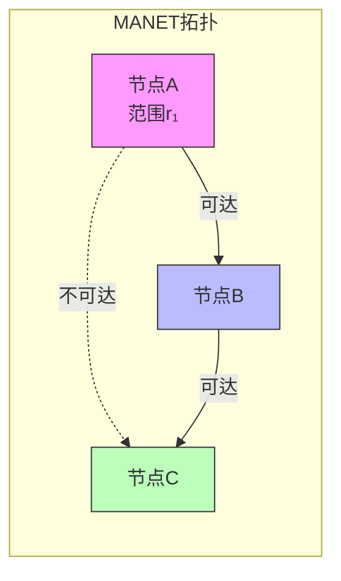
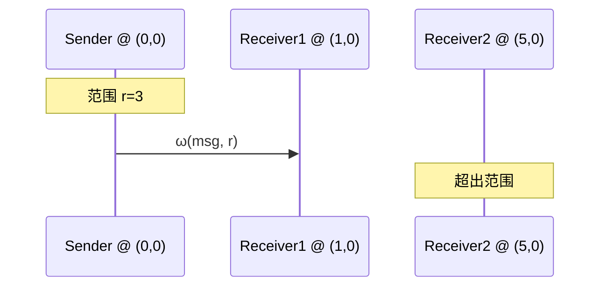

# ω-calculus: 移动自组织网络进程演算

> **所属单元**: 02-calculi | **前置依赖**: 01-foundations/02-category-theory.md | **形式化等级**: L3

## 1. 概念定义

### 1.1 ω-calculus 概述

**Def-C-01-01: ω-calculus**

由 Singh、Ramakrishnan 和 Smolka 提出的 ω-calculus 是 **π-calculus** 的保守扩展，专门用于形式化建模移动自组织网络（MANETs, Mobile Ad-hoc Networks）及其协议。

### 1.2 语法定义

**Def-C-01-02: ω-进程语法**

$$P, Q ::= 0 \mid \alpha.P \mid P + Q \mid P \mid Q \mid (\nu n)P \mid !P$$

其中动作 $\alpha$ 包括：
$$\alpha ::= a\langle \vec{b} \rangle \mid a(\vec{x}) \mid \tau \mid \omega(a, r)$$

**关键扩展**:

- $\omega(a, r)$: 在传输范围 $r$ 内通过通道 $a$ 广播

### 1.3 传输范围接口

**Def-C-01-03: ω-进程接口**

每个 ω-进程关联一个**传输范围接口** $\mathcal{I} = (R, \delta)$，其中：

- $R \subseteq \mathbb{R}^2$: 进程物理位置
- $\delta: R \to \mathbb{R}^+$: 传输范围函数

**Def-C-01-04: 可达性关系**

进程 $P$ 在位置 $l_P$ 可以到达进程 $Q$ 在位置 $l_Q$ 当且仅当：
$$d(l_P, l_Q) \leq \delta_P(l_P)$$

其中 $d$ 是欧氏距离。

## 2. 属性推导

### 2.1 广播语义

**Prop-C-01-01: 广播规则**

当进程 $P$ 执行 $\omega(a, r).P'$：

1. 所有在范围 $r$ 内的进程 $Q_1, \ldots, Q_n$ 可以接收消息
2. 接收进程演化：$Q_i \xrightarrow{a(\vec{x})} Q_i'$
3. 发送进程演化：$P \xrightarrow{\omega(a, r)} P'$

**与 π-calculus 的区别**:

| 特征 | π-calculus | ω-calculus |
|------|-----------|-----------|
| 通信 | 点对点 | 广播 |
| 拓扑 | 逻辑连接 | 物理位置+传输范围 |
| 移动性 | 名称传递 | 位置变化 |

### 2.2 Late Bisimulation

**Def-C-01-05: Late Bisimulation for ω-calculus**

关系 $R$ 是 late bisimulation，如果 $(P, Q) \in R$ 且 $P \xrightarrow{\alpha} P'$ 蕴含：

1. 若 $\alpha = \tau$: $\exists Q'. Q \xrightarrow{\tau} Q' \land (P', Q') \in R$
2. 若 $\alpha = a\langle b \rangle$: $\exists Q'. Q \xrightarrow{a\langle b \rangle} Q' \land (P', Q') \in R$
3. 若 $\alpha = a(x)$: $\exists Q'. Q \xrightarrow{a(x)} Q' \land \forall c. (P'\{c/x\}, Q'\{c/x\}) \in R$
4. 若 $\alpha = \omega(a, r)$: 考虑位置约束下的可达进程集

**Lemma-C-01-01: 同余性**

Late bisimulation 在 ω-calculus 中是同余关系。

## 3. 关系建立

### 3.1 与 π-calculus 的关系

**Prop-C-01-02: 保守扩展**

若忽略位置信息和广播语义，ω-calculus 退化为 π-calculus。

**形式化**: 存在从 π-calculus 到 ω-calculus 的忠实嵌入：
$$\llbracket P \rrbracket_\pi = P \text{ with } \delta(l) = \infty \text{ (全局范围)}$$

### 3.2 应用场景映射

| 应用场景 | 形式化元素 |
|----------|-----------|
| AODV路由协议 | 进程 = 节点，通道 = 控制消息 |
| VANET车辆网 | 位置 = GPS坐标，范围 = 通信半径 |
| 传感器网络 | 能量约束 → 传输范围动态变化 |

## 4. 论证过程

### 4.1 可达性可判定性

**关键结果**: 有限控制 ω-process 的状态可达性问题是**可判定的**。

**与 π-calculus 对比**:

- π-calculus: 可达性一般不可判定
- ω-calculus (有限控制): 可达性可判定

**原因**: ω-calculus 的广播语义限制了进程间的交互模式。

### 4.2 移动性建模

**节点移动**可以建模为：
$$P @ l \xrightarrow{\text{move}(l')} P @ l'$$

传输范围动态变化：
$$\delta_t(l) \to \delta_{t+1}(l')$$

## 5. 形式证明 / 工程论证

### 5.1 路由协议正确性

**Thm-C-01-01: AODV路由发现正确性**

在 ω-calculus 中建模的 AODV 协议满足：

1. **路由发现**: 若存在路径，则最终发现
2. **无环路**: 路由表不会形成环路
3. **新鲜性**: 使用序列号保证路由新鲜

*证明概要*:

使用 coinductive 方法证明路由表的单调性和有界性。

### 5.2 互模拟判定算法

**Thm-C-01-02: 有限 ω-进程的互模拟判定**

对有限状态 ω-进程，late bisimulation 可在多项式空间内判定。

*算法*: 修改的 Paige-Tarjan 算法，考虑位置约束。

## 6. 实例验证

### 6.1 示例：简单广播协议

```
Sender = ω(msg, r).Sender
Receiver(x) = msg(y).(Process(y) | Receiver(x))

System = (ν msg)(Sender @ (0,0) | Receiver @ (1,0) | Receiver @ (5,0))
```

假设 $r = 3$:

- $(0,0)$ 处的 Sender 可以到达 $(1,0)$ 处的 Receiver
- $(0,0)$ 处的 Sender **不能** 到达 $(5,0)$ 处的 Receiver

### 6.2 示例：移动节点

```
Node = move(x, y).Node + ω(heartbeat, r).Node

System = Node @ (0,0) | Node @ (10,0)
```

节点沿路径移动，动态改变网络拓扑。

## 7. 可视化

### ω-calculus 网络拓扑



### 广播通信模型



## 8. 引用参考
