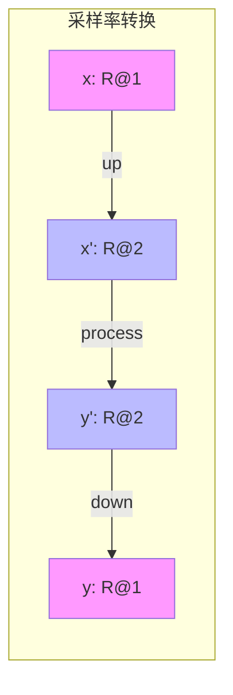

# W-calculus: 数字信号处理同步框架

> **所属单元**: 02-calculi | **前置依赖**: 01-foundations/01-order-theory.md | **形式化等级**: L3

## 1. 概念定义

### 1.1 W-calculus 概述

**Def-C-02-01: W-calculus**

由 Gallego Arias、Jouvelot 等人于 2021 年提出的 W-calculus 是 **call-by-value λ-calculus** 的同步语义扩展，专门用于数字信号处理（DSP）算法的验证建模。

### 1.2 语法定义

**Def-C-02-02: W-calculus 语法**

$$e ::= x \mid \lambda x.e \mid e_1 e_2 \mid c \mid \text{pre}(e) \mid e_1 \oplus e_2 \mid \text{rec } f(x) = e$$

**核心扩展**:

- $\text{pre}(e)$: 前一个采样时刻的值
- $\oplus$: 流操作（采样率敏感）
- $\text{rec}$: 递归定义

### 1.3 速率类型系统

**Def-C-02-03: 速率类型**

$$\tau ::= R@n \mid \tau_1 \to \tau_2$$

其中 $R@n$ 表示采样率为基准的 $n$ 倍的流：

- $R@1$: 基准采样率
- $R@2$: 两倍采样率
- $R@\frac{1}{2}$: 半采样率

**Def-C-02-04: 采样率关系**

$$R@m \text{ 与 } R@n \text{ 兼容} \Leftrightarrow \exists k. k \cdot m = n \lor k \cdot n = m$$

## 2. 属性推导

### 2.1 同步语义

**Prop-C-02-01: 同步执行模型**

W-calculus 采用**全局时钟**驱动的同步语义：

1. 每个时钟周期，所有流产生一个新值
2. 操作符在输入可用时立即计算
3. 无缓冲、无延迟（除非显式使用 pre）

**与异步流计算的对比**:

| 特征 | W-calculus | Kahn Process Networks |
|------|-----------|----------------------|
| 时间模型 | 离散全局时钟 | 数据驱动 |
| 采样率 | 显式多速率 | 单速率或上/下采样 |
| 延迟 | 显式 pre 算子 | 隐式于通道缓冲 |
| 适用领域 | 音频/DSP | 通用流处理 |

### 2.2 典型操作符类型规则

**Def-C-02-05: 操作符类型**

| 操作符 | 类型 | 语义 |
|--------|------|------|
| $\text{up}$ | $R@n \to R@2n$ | 上采样（插值） |
| $\text{down}$ | $R@2n \to R@n$ | 下采样（抽取） |
| $\text{pack}$ | $R@2n \to R2@n$ | 打包（并行化） |
| $\text{pre}$ | $R@n \to R@n$ | 单位延迟 |
| $\oplus$ | $R@n \to R@n \to R@n$ | 逐点运算 |

**类型规则示例**:

$$\frac{\Gamma \vdash e: R@n}{\Gamma \vdash \text{up}(e): R@2n}$$

$$\frac{\Gamma \vdash e: R@2n}{\Gamma \vdash \text{down}(e): R@n}$$

## 3. 关系建立

### 3.1 与 λ-calculus 的关系

**Prop-C-02-02: 保守扩展**

W-calculus 是 call-by-value λ-calculus 的保守扩展：

若程序 $e$ 不包含 $\text{pre}$ 或多速率操作，则其语义与标准 λ-calculus 一致。

### 3.2 与时序逻辑的关系

**Prop-C-02-03: 时序性质表达**

W-calculus 程序可以用时序逻辑描述性质：

- **有界响应**: $\square (\text{input} \to \Diamond_{\leq k} \text{output})$
- **稳定性**: $\Diamond \square (\text{output} = c)$

## 4. 论证过程

### 4.1 线性时不变性 (LTI)

**Def-C-02-06: 线性时不变系统**

系统 $S$ 是**线性的**，如果：
$$S(a \cdot x + b \cdot y) = a \cdot S(x) + b \cdot S(y)$$

系统 $S$ 是**时不变的**，如果：
$$S(x[t - \tau]) = S(x)[t - \tau]$$

**关键结果**: W-calculus 的受限语法子集保证 LTI 性质。

### 4.2 逻辑关系 (Logical Relations)

**Def-C-02-07: 逻辑关系**

定义类型索引的关系族 $\mathcal{R}_\tau \subseteq \llbracket \tau \rrbracket \times \llbracket \tau \rrbracket$：

- 基础类型: $\mathcal{R}_{R@n}(s_1, s_2) \Leftrightarrow \forall t. |s_1[t] - s_2[t]| \leq \epsilon$
- 函数类型: $\mathcal{R}_{\tau_1 \to \tau_2}(f, g) \Leftrightarrow \forall x, y. \mathcal{R}_{\tau_1}(x, y) \Rightarrow \mathcal{R}_{\tau_2}(f(x), g(y))$

## 5. 形式证明 / 工程论证

### 5.1 LTI 保持定理

**Thm-C-02-01: LTI 保持**

若 $e$ 是 W-calculus 的受限程序（无条件分支、无递归），则 $\llbracket e \rrbracket$ 是 LTI 系统。

*证明概要*:

对 $e$ 的结构归纳：

- 常量: 显然是 LTI
- $\text{pre}$: 保持 LTI（延迟是 LTI 操作）
- $\oplus$: LTI 系统的组合
- up/down: 采样率转换保持 LTI

### 5.2 类型安全性

**Thm-C-02-02: 类型安全**

若 $\Gamma \vdash e : \tau$，则：

1. **进展 (Progress)**: $e$ 是值或可规约
2. **保持 (Preservation)**: 若 $e \to e'$，则 $\Gamma \vdash e' : \tau$

*证明*: 标准类型安全证明，扩展多速率情况。

## 6. 实例验证

### 6.1 示例：低通滤波器

```
-- 一阶低通滤波器
lpf : R@1 → R@1
lpf(x) = rec f(y) = α * x + (1-α) * pre(f(y))
  where α = 0.1
```

**验证性质**: 直流增益 = 1，高频衰减。

### 6.2 示例：多速率音频处理

```
-- 上采样后滤波
process : R@1 → R@1
process(x) =
  let up_x = up(x)       -- R@1 → R@2
      filtered = fir(up_x)  -- R@2 → R@2
  in down(filtered)      -- R@2 → R@1
```

**类型检查**:

- $x: R@1$
- $\text{up}(x): R@2$
- $\text{fir}(\text{up}(x)): R@2$
- $\text{down}(\text{filtered}): R@1$ ✓

### 6.3 Coq 形式化

W-calculus 的语法和指称语义已在 **Coq** 证明助手中实现：

```coq
(* 类型定义 *)
Inductive type : Type :=
  | TStream : nat -> type  (* R@n *)
  | TArrow : type -> type -> type.

(* 语义 *)
Fixpoint denote (t : type) : Type :=
  match t with
  | TStream n => Stream R
  | TArrow t1 t2 => denote t1 -> denote t2
  end.
```

## 7. 可视化

### 采样率转换



### 时间线示意

```mermaid
gantt
    title 多速率流时间线
    dateFormat X
    axisFormat %s

    section R@1
    采样点       :0, 1
    采样点       :1, 2
    采样点       :2, 3
    采样点       :3, 4

    section R@2
    采样点       :0, 0.5
    采样点       :0.5, 1
    采样点       :1, 1.5
    采样点       :1.5, 2
    采样点       :2, 2.5
    采样点       :2.5, 3
    采样点       :3, 3.5
    采样点       :3.5, 4
```



## 8. 引用参考
