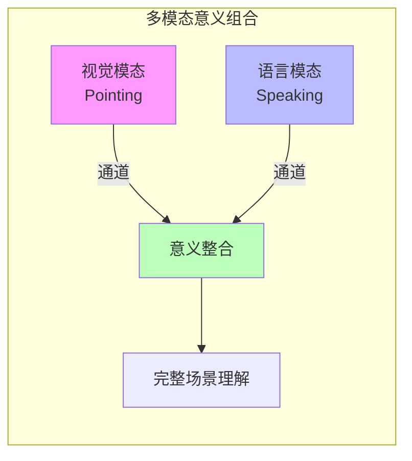
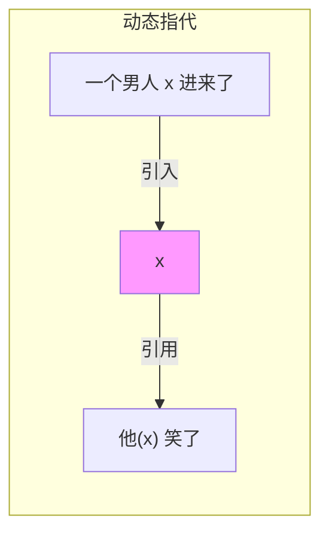

# w-calculus (小写): 多模态意义进程代数

> **所属单元**: 02-calculi | **前置依赖**: 02-pi-calculus/01-pi-calculus-basics.md | **形式化等级**: L2

## 1. 概念定义

### 1.1 w-calculus 概述

**Def-C-03-01: w-calculus (Linguistic)**

由 Bengtson 等人（2011）开发的 w-calculus（小写）属于进程代数家族，源自 Milner 的 π-calculus。在计算语言学中用于多模态意义表示（Multi-modal Meaning）。

> **注意**: 此 w-calculus **与工作流建模无关**，专注于自然语言处理中的语义表示。

### 1.2 语法定义

**Def-C-03-02: w-calculus 语法**

$$P, Q ::= 0 \mid \alpha.P \mid P + Q \mid P \mid Q \mid (\nu x)P \mid !P \mid \lambda x.M$$

其中：

- $\alpha$: 输入/输出动作（同 π-calculus）
- $\lambda x.M$: λ-term 传递
- $M, N$: λ-演算项

**关键特征**: 通过 i/o 通道传输 **typed λ-terms**。

### 1.3 多模态意义表示

**Def-C-03-03: 意义表示**

w-calculus 结合：

1. **输入/输出（i/o）算子**: 来自 π-calculus
2. **并发算子**: 并行组合 $|$
3. **λ-terms**: 通过通道传输的类型化 λ-项

**意义组合**:
$$\text{Meaning}(P \mid Q) = \text{Meaning}(P) \bowtie \text{Meaning}(Q)$$

其中 $\bowtie$ 是意义组合操作。

## 2. 属性推导

### 2.1 与 π-calculus 的对比

| 特征 | π-calculus | w-calculus (小写) |
|------|-----------|-------------------|
| 传递对象 | 通道名 | λ-terms |
| 应用领域 | 移动系统 | 计算语言学 |
| 类型系统 | 简单 | 依赖类型 |
| 语义焦点 | 行为等价 | 意义组合 |

### 2.2 类型系统

**Def-C-03-04: 类型**

$$\tau ::= \iota \mid \tau \to \tau \mid \Diamond \tau$$

其中：

- $\iota$: 基本类型（实体、真值等）
- $\tau \to \tau$: 函数类型
- $\Diamond \tau$: 可能类型（modal）

**类型规则**:

$$\frac{\Gamma \vdash P : \tau_1 \quad \Gamma \vdash Q : \tau_2}{\Gamma \vdash P \mid Q : \tau_1 \times \tau_2}$$

## 3. 关系建立

### 3.1 在计算语言学中的位置

```
形式语义学
├── Montague语义
├── 范畴语法 (Categorial Grammar)
├── 话语表示理论 (DRT)
└── 进程代数方法 ← w-calculus
```

### 3.2 与 Type-Theoretical 语义的关系

**Prop-C-03-01: 对应关系**

w-calculus 的 λ-terms 可以映射到 **Martin-Löf Type Theory** 的上下文：

| w-calculus | Type Theory |
|------------|-------------|
| 通道 | 上下文假设 |
| λ-term 传递 | 变量替换 |
| 并行组合 | 上下文合并 |

## 4. 论证过程

### 4.1 为什么要进程代数？

自然语言理解涉及**动态**和**交互**过程：

1. **指代消解 (Anaphora Resolution)**: 代词指代的动态确定
2. **预设投射 (Presupposition Projection)**: 上下文中信息的传递
3. **多模态交互**: 语言与手势、视觉的结合

进程代数提供**动态语义**的形式化框架。

### 4.2 多模态组合

**例**: "指着那只猫说'它睡着了'"

```
Pointing = νx.((point(x) | Cat(x)) | Gesture(x))
Speaking = νy.(say(y) | Sleep(y) | Anaphora(y, x))

Scene = Pointing | Speaking
```

## 5. 形式证明 / 工程论证

### 5.1 意义组合正确性

**Thm-C-03-01: 组合性**

若 $P$ 表示短语 $\phi$ 的意义，$Q$ 表示 $\psi$ 的意义，则 $P \mid Q$ 表示 $\phi \cdot \psi$ 的意义。

*证明*: 基于进程代数语义和 λ-calculus 的组合性。∎

### 5.2 与 Discourse Representation Theory 的等价性

**Thm-C-03-02: DRT 嵌入**

存在从 DRT 到 w-calculus 的忠实嵌入：
$$\llbracket \text{DRS} \rrbracket_{DRT} \cong \llbracket P \rrbracket_w$$

## 6. 实例验证

### 6.1 示例：量词范围歧义

```
"每个学生读了一本书"

宽范围解读:
EveryStudent = λP.∀x.(Student(x) → P(x))
ReadABook = λy.∃z.(Book(z) ∧ Read(y,z))

S1 = EveryStudent(ReadABook)

窄范围解读:
S2 = ∃z.(Book(z) ∧ ∀x.(Student(x) → Read(x,z)))
```

在 w-calculus 中，两种解读对应不同的进程结构。

### 6.2 示例：动态指代

```
"一个男人进来了。他笑了。"

P1 = νx.(Man(x) | Enter(x))
P2 = νy.(Anaphora(y,x) | Laugh(y))

Discourse = P1 | P2
```

**指代链**: $x$ 在 $P1$ 中引入，在 $P2$ 中通过 $Anaphora(y,x)$ 引用。

## 7. 可视化

### 意义组合示意



### 指代链



## 8. 引用参考
