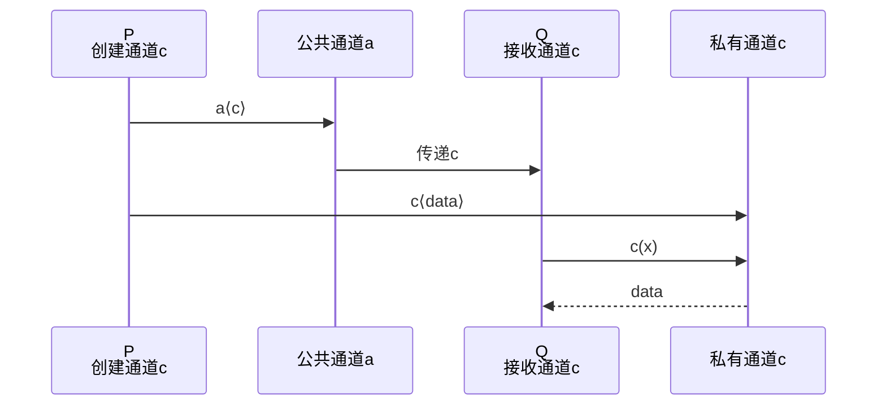

# π-calculus (Pi演算) 基础

> **所属单元**: 02-calculi | **前置依赖**: 01-foundations/02-category-theory.md | **形式化等级**: L2-L3

## 1. 概念定义

### 1.1 π-calculus 概述

**Def-C-04-01: π-calculus**

由 Robin Milner 等人（1992）提出的 π-calculus 是描述**移动并发系统**的进程代数。核心创新是通过 **name passing**（名称传递）实现动态拓扑变化。

### 1.2 语法定义

**Def-C-04-02: π-calculus 语法**

**进程 (Processes)**:
$$P, Q ::= 0 \mid \alpha.P \mid P + Q \mid P \mid Q \mid (\nu a)P \mid !P$$

**前缀动作 (Prefixes)**:
$$\alpha ::= a\langle b \rangle \mid a(x) \mid \tau \mid [x = y]$$

其中：

- $0$: 空进程 (nil)
- $\alpha.P$: 前缀组合
- $P + Q$: 非确定性选择
- $P \mid Q$: 并行组合
- $(\nu a)P$: 限制 (restriction，创建新通道)
- $!P$: 复制 (replication)
- $a\langle b \rangle$: 在通道 $a$ 上输出名称 $b$
- $a(x)$: 在通道 $a$ 上输入，绑定到 $x$
- $\tau$: 内部动作
- $[x = y]$: 名称匹配守卫

### 1.3 自由与约束名称

**Def-C-04-03: 自由名称 (fn)**

$$\begin{aligned}
fn(0) &= \emptyset \\
fn(\alpha.P) &= fn(\alpha) \cup fn(P) \\
fn(a\langle b \rangle) &= \{a, b\} \\
fn(a(x)) &= \{a\} \\
fn(\tau) &= \emptyset \\
fn(P + Q) &= fn(P) \cup fn(Q) \\
fn(P \mid Q) &= fn(P) \cup fn(Q) \\
fn((\nu a)P) &= fn(P) \setminus \{a\} \\
fn(!P) &= fn(P)
\end{aligned}$$

**Def-C-04-04: 约束名称 (bn)**

仅输入前缀和限制引入约束：
$$bn(a(x)) = \{x\}, \quad bn((\nu a)P) = \{a\} \cup bn(P)$$

**Def-C-04-05: 名称集合 (n)**
$$n(P) = fn(P) \cup bn(P)$$

## 2. 属性推导

### 2.1 操作语义 (Labeled Transition System)

**Prop-C-04-01: 结构化操作语义 (SOS)**

| 规则 | 名称 | 形式 |
|------|------|------|
| OUT | 输出 | $\overline{a\langle b \rangle.P \xrightarrow{a\langle b \rangle} P}$ |
| IN | 输入 | $\overline{a(x).P \xrightarrow{a(y)} P\{y/x\}}$ |
| TAU | 内部 | $\overline{\tau.P \xrightarrow{\tau} P}$ |
| SUM | 选择 | $\frac{P \xrightarrow{\alpha} P'}{P + Q \xrightarrow{\alpha} P'}$ |
| PAR | 并行 | $\frac{P \xrightarrow{\alpha} P'}{P \mid Q \xrightarrow{\alpha} P' \mid Q}$ (若 $bn(\alpha) \cap fn(Q) = \emptyset$) |
| COM | 通信 | $\frac{P \xrightarrow{a\langle b \rangle} P', Q \xrightarrow{a(x)} Q'}{P \mid Q \xrightarrow{\tau} P' \mid Q'\{b/x\}}$ |
| RES | 限制 | $\frac{P \xrightarrow{\alpha} P'}{(\nu a)P \xrightarrow{\alpha} (\nu a)P'}$ (若 $a \notin n(\alpha)$) |
| REP | 复制 | $\frac{P \mid !P \xrightarrow{\alpha} P'}{!P \xrightarrow{\alpha} P'}$ |

### 2.2 名称替换

**Def-C-04-06: 替换**

替换 $\sigma = \{b_1/a_1, \ldots, b_n/a_n\}$ 同时将所有 $a_i$ 替换为 $b_i$。

**避免捕获**: 替换时需 α-转换以避免名称冲突。

**例**: $(a(x).P)\{b/a\} = b(x).(P\{b/a\})$ (若 $x \neq b$)

## 3. 关系建立

### 3.1 与 CCS 的关系

**Prop-C-04-02: π-calculus 扩展 CCS**

| CCS | π-calculus |
|-----|-----------|
| 固定通道 | 动态通道创建/传递 |
| 无移动性 | 支持移动性 (name passing) |
| 有限拓扑 | 无限动态拓扑 |

CCS 是 π-calculus 的静态特例（无 name passing）。

### 3.2 与 λ-calculus 的对应

**Prop-C-04-03: 编码 λ-calculus**

存在从 λ-calculus 到 π-calculus 的编码：
$$\llbracket \lambda x.M \rrbracket_\pi = \ldots$$

关键洞察：函数应用 ↔ 通道通信。

## 4. 论证过程

### 4.1 为什么要移动性？

**静态系统的局限**:
- 固定连接拓扑
- 无法建模动态重配置

**移动性的力量**:
- 动态连接建立
- 代码迁移
- 服务发现与绑定

**例**: Web 服务编排中，服务端点动态传递。

### 4.2 名称 vs 值的区分

**名称 (Names)**:
- 可作为通道使用
- 可传递
- 一等公民

**值 (Values)**:
- 只能作为数据
- 不能作为通道

π-calculus 统一处理：所有值都是名称。

## 5. 形式证明 / 工程论证

### 5.1 同余定理

**Thm-C-04-01: 强互模拟同余**

强互模拟 $\sim$ 在 π-calculus 中是同余关系：

若 $P \sim Q$，则：
1. $\alpha.P \sim \alpha.Q$
2. $P + R \sim Q + R$
3. $P \mid R \sim Q \mid R$
4. $(\nu a)P \sim (\nu a)Q$
5. $!P \sim !Q$

*证明*: 构造适当的双模拟关系。∎

### 5.2 扩张定理 (Expansion Law)

**Thm-C-04-02: 并行展开**

$$P \mid Q \sim \sum_{i} \alpha_i.(P_i \mid Q) + \sum_{j} \beta_j.(P \mid Q_j) + \sum_{a\langle b \rangle, a(x)} \tau.(P' \mid Q'\{b/x\})$$

其中求和覆盖 $P$ 和 $Q$ 的所有可能迁移。

## 6. 实例验证

### 6.1 示例：简单通信

```
Sender = a⟨b⟩.0
Receiver = a(x).P

System = (νa)(Sender | Receiver)
```

**执行**:
$$System \xrightarrow{\tau} (\nu a)(0 \mid P\{b/x\})$$

### 6.2 示例：移动电话

```
Mobile = νc.(a⟨c⟩.c(y).0 | c⟨data⟩.0)
Receiver = a(x).x(z).Q

System = (νa)(Mobile | Receiver)
```

**执行**:
1. Mobile 创建私有通道 $c$
2. 通过 $a$ 发送 $c$ 给 Receiver
3. 双方在 $c$ 上通信

### 6.3 示例：共享计数器

```
Counter(n) = inc.Counter(n+1) + read⟨n⟩.Counter(n)

Client = νr.(inc.inc.read⟨r⟩.r(x).P)

System = (νinc,read)(Counter(0) | Client)
```

## 7. 可视化

### π-calculus 进程结构

```mermaid
graph TD
    subgraph 进程结构
    A[P | Q] --> B[并行]
    C[P + Q] --> D[选择]
    E[(νa)P] --> F[限制/新建]
    G[!P] --> H[复制]
    end
```

### 名称传递



## 8. 引用参考

[^1]: Milner, R., Parrow, J., & Walker, D. (1992). "A Calculus of Mobile Processes, I & II". *Information and Computation*, 100(1), 1-77.
[^2]: Milner, R. (1999). *Communicating and Mobile Systems: The π-calculus*. Cambridge University Press.
[^3]: Sangiorgi, D., & Walker, D. (2001). *The π-calculus: A Theory of Mobile Processes*. Cambridge University Press.
