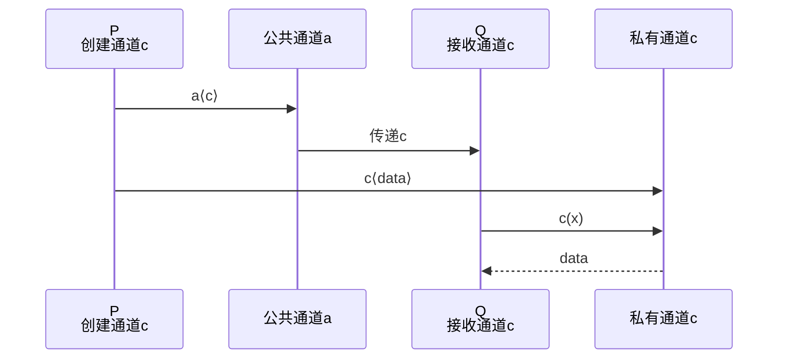
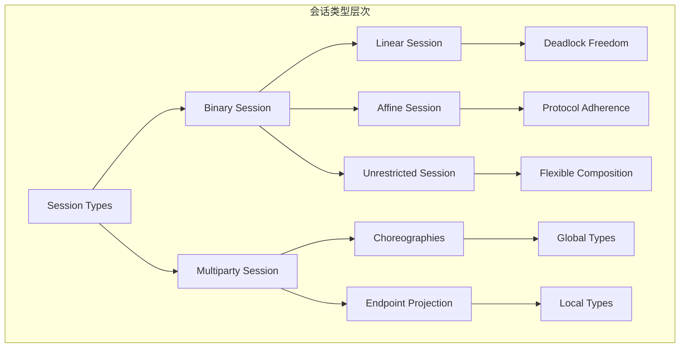
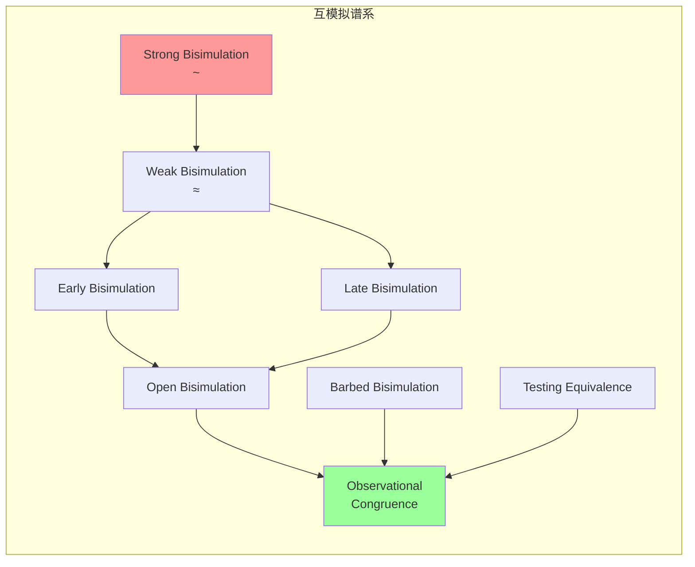
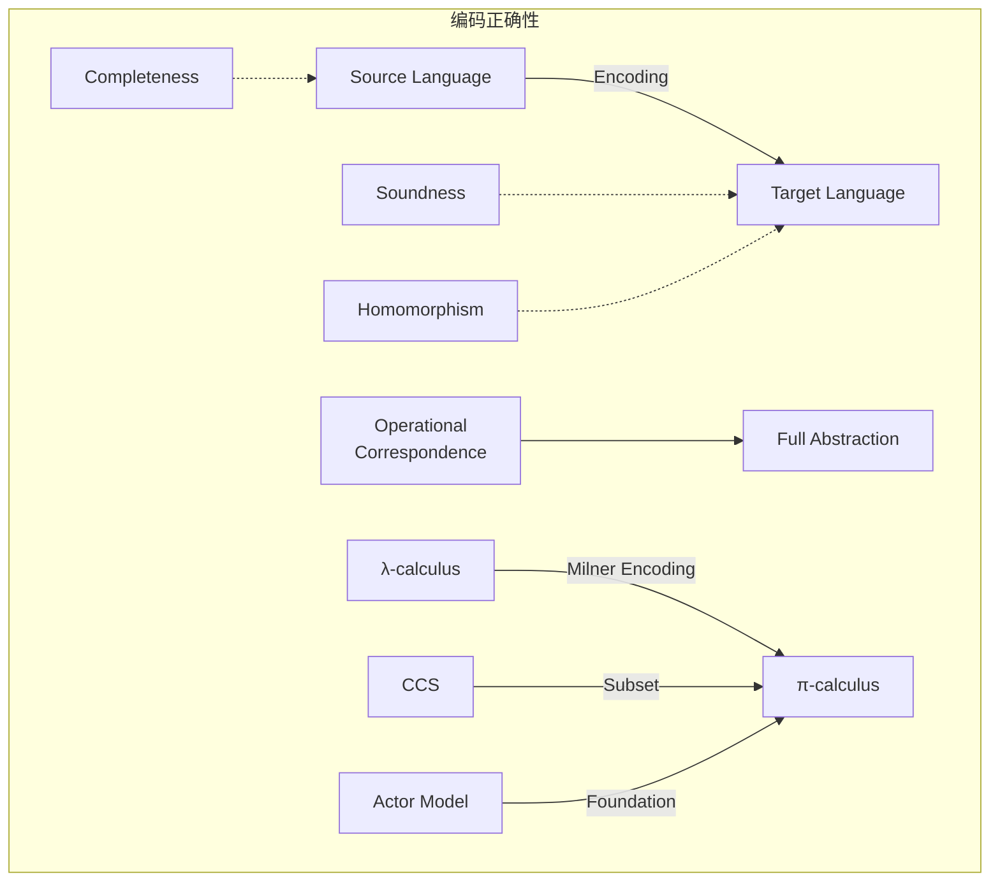
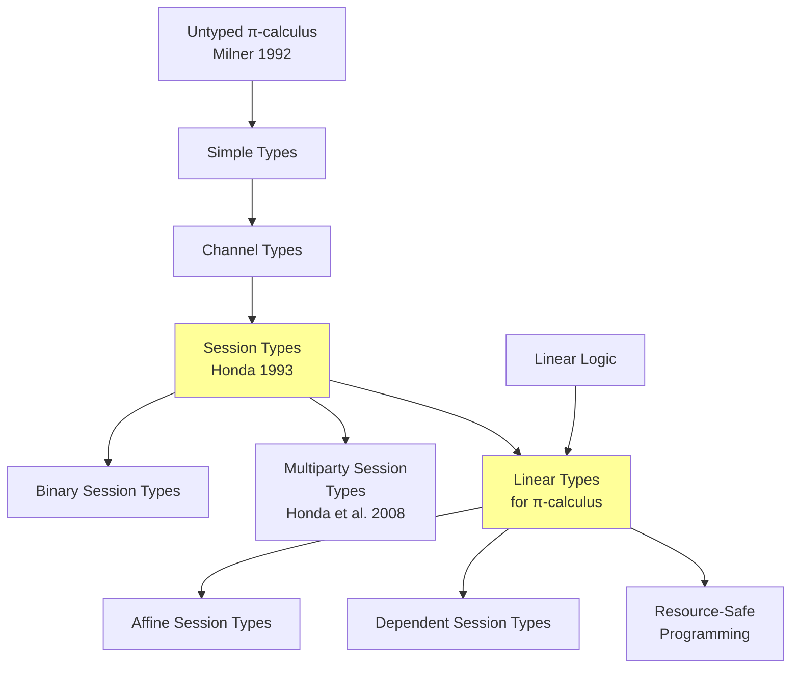

# π-calculus (Pi演算) 基础

> **所属单元**: 02-calculi | **前置依赖**: 01-foundations/02-category-theory.md | **形式化等级**: L2-L4

## 1. 概念定义

### 1.1 π-calculus 概述

**Def-C-04-01: π-calculus**

由 Robin Milner 等人（1992）提出的 π-calculus 是描述**移动并发系统**的进程演算。核心创新是通过 **name passing**（名称传递）实现动态拓扑变化。

### 1.2 语法定义

**Def-C-04-02: π-calculus 语法**

**进程 (Processes)**:
$$P, Q ::= 0 \mid \alpha.P \mid P + Q \mid P \mid Q \mid (\nu a)P \mid !P$$

**前缀动作 (Prefixes)**:
$$\alpha ::= a\langle b \rangle \mid a(x) \mid \tau \mid [x = y]$$

其中：

- $0$: 空进程 (nil)
- $\alpha.P$: 前缀组合
- $P + Q$: 非确定性选择
- $P \mid Q$: 并行组合
- $(\nu a)P$: 限制 (restriction，创建新通道)
- $!P$: 复制 (replication)
- $a\langle b \rangle$: 在通道 $a$ 上输出名称 $b$
- $a(x)$: 在通道 $a$ 上输入，绑定到 $x$
- $\tau$: 内部动作
- $[x = y]$: 名称匹配守卫

### 1.3 自由与约束名称

**Def-C-04-03: 自由名称 (fn)**

$$\begin{aligned}
fn(0) &= \emptyset \\
fn(\alpha.P) &= fn(\alpha) \cup fn(P) \\
fn(a\langle b \rangle) &= \{a, b\} \\
fn(a(x)) &= \{a\} \\
fn(\tau) &= \emptyset \\
fn(P + Q) &= fn(P) \cup fn(Q) \\
fn(P \mid Q) &= fn(P) \cup fn(Q) \\
fn((\nu a)P) &= fn(P) \setminus \{a\} \\
fn(!P) &= fn(P)
\end{aligned}$$

**Def-C-04-04: 约束名称 (bn)**

仅输入前缀和限制引入约束：
$$bn(a(x)) = \{x\}, \quad bn((\nu a)P) = \{a\} \cup bn(P)$$

**Def-C-04-05: 名称集合 (n)**
$$n(P) = fn(P) \cup bn(P)$$

### 1.4 类型化 π-calculus (Typed π-calculus)

**Def-C-04-06: 简单类型系统**

在 CMU 15-814 课程框架下，π-calculus 类型系统基于通道类型：

$$T ::= \text{chan}\langle T_1, \ldots, T_n \rangle \mid \text{unit} \mid \text{bool} \mid \ldots$$

其中 $\text{chan}\langle T_1, \ldots, T_n \rangle$ 表示传输 $n$ 个类型为 $T_1, \ldots, T_n$ 值的通道。

**类型环境 (Typing Context)**:
$$\Gamma ::= \emptyset \mid \Gamma, x : T$$

### 1.5 会话类型 (Session Types)

**Def-C-04-07: 会话类型**

会话类型描述双向通信协议的结构，是 CMU 15-814 的核心内容之一：

$$S ::= !T.S \mid ?T.S \mid \oplus\{l_1:S_1, \ldots, l_n:S_n\} \mid \&\{l_1:S_1, \ldots, l_n:S_n\} \mid \mu X.S \mid X \mid \text{end}$$

| 构造 | 含义 | 描述 |
|------|------|------|
| $!T.S$ | 输出 | 发送类型 $T$ 的值，继续为 $S$ |
| $?T.S$ | 输入 | 接收类型 $T$ 的值，继续为 $S$ |
| $\oplus\{\vec{l}:\vec{S}\}$ | 内部选择 | 进程选择标签 $l_i$，继续为 $S_i$ |
| $\&\{\vec{l}:\vec{S}\}$ | 外部选择 | 进程提供分支供对方选择 |
| $\mu X.S$ | 递归 | 递归类型定义 |
| $\text{end}$ | 结束 | 会话终止 |

**对偶性 (Duality)**: 会话类型的关键性质

$$\overline{!T.S} = ?T.\overline{S} \quad \overline{?T.S} = !T.\overline{S} \quad \overline{\oplus\{\vec{l}:\vec{S}\}} = \&\{\vec{l}:\overline{\vec{S}}\} \quad \overline{\text{end}} = \text{end}$$

### 1.6 线性类型 (Linear Types)

**Def-C-04-08: 线性 π-calculus**

线性类型确保资源被**恰好使用一次**，是 CMU 15-814 中线性逻辑的应用：

$$T^{\text{lin}} ::= T \multimap T' \mid \text{chan}^{\text{lin}}\langle T \rangle$$

**线性环境** $\Delta$ 跟踪线性资源，确保：
1. **线性资源**必须被使用（不能丢弃）
2. **线性资源**只能被使用一次（不能复制）

**Def-C-04-09: 线性 π-calculus 进程**

$$P ::= \bar{a}\langle b \rangle.P \mid a(x)^{\text{lin}}.P \mid (\nu a^{\text{lin}})P \mid \ldots$$

上标 $\text{lin}$ 标记线性通道，要求接收后必须释放或传递。

## 2. 属性推导

### 2.1 操作语义 (Labeled Transition System)

**Prop-C-04-01: 结构化操作语义 (SOS)**

| 规则 | 名称 | 形式 |
|------|------|------|
| OUT | 输出 | $\overline{a\langle b \rangle.P \xrightarrow{a\langle b \rangle} P}$ |
| IN | 输入 | $\overline{a(x).P \xrightarrow{a(y)} P\{y/x\}}$ |
| TAU | 内部 | $\overline{\tau.P \xrightarrow{\tau} P}$ |
| SUM | 选择 | $\frac{P \xrightarrow{\alpha} P'}{P + Q \xrightarrow{\alpha} P'}$ |
| PAR | 并行 | $\frac{P \xrightarrow{\alpha} P'}{P \mid Q \xrightarrow{\alpha} P' \mid Q}$ (若 $bn(\alpha) \cap fn(Q) = \emptyset$) |
| COM | 通信 | $\frac{P \xrightarrow{a\langle b \rangle} P', Q \xrightarrow{a(x)} Q'}{P \mid Q \xrightarrow{\tau} P' \mid Q'\{b/x\}}$ |
| RES | 限制 | $\frac{P \xrightarrow{\alpha} P'}{(\nu a)P \xrightarrow{\alpha} (\nu a)P'}$ (若 $a \notin n(\alpha)$) |
| REP | 复制 | $\frac{P \mid !P \xrightarrow{\alpha} P'}{!P \xrightarrow{\alpha} P'}$ |

### 2.2 名称替换

**Def-C-04-10: 替换**

替换 $\sigma = \{b_1/a_1, \ldots, b_n/a_n\}$ 同时将所有 $a_i$ 替换为 $b_i$。

**避免捕获**: 替换时需 α-转换以避免名称冲突。

**例**: $(a(x).P)\{b/a\} = b(x).(P\{b/a\})$ (若 $x \neq b$)

### 2.3 类型安全性定理

**Thm-C-04-03: 保持性 (Preservation)**

若 $\Gamma \vdash P : T$ 且 $P \xrightarrow{\alpha} P'$，则存在 $\Gamma' \supseteq \Gamma$ 使得 $\Gamma' \vdash P' : T$。

*证明概要*: 对迁移关系进行结构归纳，确保每次通信保持类型一致性。∎

**Thm-C-04-04: 进展性 (Progress) - 会话类型**

若 $\vdash P \triangleright \Delta$（$P$ 在空环境中有会话类型 $\Delta$），则：
- $P \equiv 0$（终止），或
- $P \xrightarrow{\tau} P'$（可进行内部迁移），或
- $P$ 处于等待外部输入的状态

*直观*: 类型良好的会话不会陷入死锁。∎

**Thm-C-04-05: 通信安全性**

类型良好的 π-calculus 进程满足：
1. **无类型错误**: 不会发送/接收类型不匹配的值
2. **无死锁**: 会话类型保证协议遵守（Pierce & Wadler, 2012）

### 2.4 类型推断规则

**Prop-C-04-02: 核心类型规则**

$$
\frac{}{
\Gamma, x : T \vdash x : T
}\text{(T-VAR)} \quad
\frac{
\Gamma \vdash a : \text{chan}\langle T \rangle \quad \Gamma \vdash b : T
}{
\Gamma \vdash \bar{a}\langle b \rangle.P : \text{unit}
}\text{(T-OUT)}
$$

$$
\frac{
\Gamma, x : T \vdash P : U \quad \Gamma \vdash a : \text{chan}\langle T \rangle
}{
\Gamma \vdash a(x).P : U
}\text{(T-IN)} \quad
\frac{
\Gamma, a : T \vdash P : U
}{
\Gamma \vdash (\nu a)P : U
}\text{(T-NEW)}
$$

$$
\frac{
\Gamma \vdash P : T \quad \Gamma \vdash Q : T
}{
\Gamma \vdash P \mid Q : T
}\text{(T-PAR)}
$$

## 3. 关系建立

### 3.1 与 CCS 的关系

**Prop-C-04-03: π-calculus 扩展 CCS**

| CCS | π-calculus |
|-----|-----------|
| 固定通道 | 动态通道创建/传递 |
| 无移动性 | 支持移动性 (name passing) |
| 有限拓扑 | 无限动态拓扑 |

CCS 是 π-calculus 的静态特例（无 name passing）。

### 3.2 与 λ-calculus 的对应

**Prop-C-04-04: 编码 λ-calculus**

存在从 λ-calculus 到 π-calculus 的编码：
$$\llbracket \lambda x.M \rrbracket_\pi = \ldots$$

关键洞察：函数应用 ↔ 通道通信。

### 3.3 互模拟理论谱系

**Def-C-04-11: 早期互模拟 (Early Bisimulation)**

关系 $\mathcal{R}$ 是早期互模拟，若 $(P, Q) \in \mathcal{R}$ 且 $P \xrightarrow{\alpha} P'$ 蕴含：
- 若 $\alpha$ 是输入 $a(x)$，则对所有 $b$，存在 $Q'$ 使得 $Q \xrightarrow{a(x)} Q'$ 且 $(P'\{b/x\}, Q'\{b/x\}) \in \mathcal{R}$

**Def-C-04-12: 晚期互模拟 (Late Bisimulation)**

$Q$ 的响应可以依赖于输入值：
- 若 $\alpha$ 是输入 $a(x)$，则存在 $Q'$ 使得 $Q \xrightarrow{a(x)} Q'$ 且对所有 $b$，$(P'\{b/x\}, Q'\{b/x\}) \in \mathcal{R}$

**关键区别**: 早期互模拟要求对所有可能的输入值同时响应；晚期互模拟允许根据具体输入值选择不同的响应。

**Prop-C-04-05: 早期 vs 晚期**

在 π-calculus 中，早期和晚期互模拟**不等价**。存在进程在早期互模拟意义下等价但在晚期互模拟意义下不等价。

**Def-C-04-13: 开放互模拟 (Open Bisimulation)**

开放互模拟允许替换 (substitution) 作为观察的一部分：

$P$ 和 $Q$ 开放互模拟，若对所有替换 $\sigma$，$P\sigma$ 和 $Q\sigma$ 在输入值替换后保持互模拟。

**Prop-C-04-06: 开放互模拟的优势**

- **同余性**: 开放互模拟是同余关系
- **完全抽象**: 相对于上下文等价

**Def-C-04-14: 观察同余 (Observational Congruence)**

$$P \approx Q \iff \forall C[\cdot]. C[P] \Downarrow \Leftrightarrow C[Q] \Downarrow$$

其中 $C[\cdot]$ 是求值上下文，$\Downarrow$ 表示可观察收敛。

**Thm-C-04-06: 完全抽象定理**

开放互模拟等于观察同余：
$$P \sim_{\text{open}} Q \iff P \approx Q$$

### 3.4 编码理论

**Def-C-04-15: 编码的正确性标准**

从语言 $\mathcal{L}_1$ 到 $\mathcal{L}_2$ 的编码 $[\![ - ]\!]$ 应满足：

1. **完备性 (Completeness)**: $P \rightarrow_1^* P'$ 蕴含 $[\![P]\!] \rightarrow_2^* [\![P']\!]$
2. **可靠性 (Soundness)**: $[\![P]\!] \rightarrow_2^* Q$ 蕴含存在 $P'$ 使得 $P \rightarrow_1^* P'$ 且 $Q \rightarrow_2^* [\![P']\!]$
3. **同态性**: 保持组合操作符的结构

**Prop-C-04-07: λ-calculus 到 π-calculus 的编码**

$$\llbracket x \rrbracket_r = \bar{r}\langle x \rangle$$
$$\llbracket \lambda x.M \rrbracket_r = (\nu f)(\bar{r}\langle f \rangle \mid !f(x, r').\llbracket M \rrbracket_{r'})$$
$$\llbracket M\,N \rrbracket_r = (\nu r_1, r_2)(\llbracket M \rrbracket_{r_1} \mid \llbracket N \rrbracket_{r_2} \mid r_1(f).r_2(x).\bar{f}\langle x, r \rangle)$$

**关键洞察**: 函数编码为通道，应用编码为通信。

**Thm-C-04-07: 编码的正确性**

上述编码满足完备性和可靠性，即：
$$M \rightarrow_\beta N \iff \llbracket M \rrbracket \rightarrow^* \llbracket N \rrbracket$$

## 4. 论证过程

### 4.1 为什么要移动性？

**静态系统的局限**:
- 固定连接拓扑
- 无法建模动态重配置

**移动性的力量**:
- 动态连接建立
- 代码迁移
- 服务发现与绑定

**例**: Web 服务编排中，服务端点动态传递。

### 4.2 名称 vs 值的区分

**名称 (Names)**:
- 可作为通道使用
- 可传递
- 一等公民

**值 (Values)**:
- 只能作为数据
- 不能作为通道

π-calculus 统一处理：所有值都是名称。

### 4.3 会话类型的协议保证

**协议兼容性的形式化**:

两个进程 $P$ 和 $Q$ 通过通道 $c$ 通信，类型环境分别为 $\Gamma \vdash P \triangleright c:S$ 和 $\Gamma \vdash Q \triangleright c:\overline{S}$，则通信安全得到保证。

**例**: 客户-服务器协议
```
Client: ?LoginRequest.!AuthToken.+{Success: !Request.?Response.end, Fail: end}
Server: !LoginRequest.?AuthToken.&{Success: ?Request.!Response.end, Fail: end}
```

### 4.4 线性类型与资源管理

**资源泄漏检测**:

线性类型确保文件句柄、网络连接等资源被正确关闭：

```
openFile : string → chan^lin⟨fileHandle⟩
readFile : chan^lin⟨fileHandle, contents⟩
closeFile : chan^lin⟨fileHandle⟩ → unit
```

不满足线性约束的进程将被类型系统拒绝。

## 5. 形式证明 / 工程论证

### 5.1 同余定理

**Thm-C-04-01: 强互模拟同余**

强互模拟 $\sim$ 在 π-calculus 中是同余关系：

若 $P \sim Q$，则：
1. $\alpha.P \sim \alpha.Q$
2. $P + R \sim Q + R$
3. $P \mid R \sim Q \mid R$
4. $(\nu a)P \sim (\nu a)Q$
5. $!P \sim !Q$

*证明*: 构造适当的互模拟关系。∎

### 5.2 扩张定理 (Expansion Law)

**Thm-C-04-02: 并行展开**

$$P \mid Q \sim \sum_{i} \alpha_i.(P_i \mid Q) + \sum_{j} \beta_j.(P \mid Q_j) + \sum_{a\langle b \rangle, a(x)} \tau.(P' \mid Q'\{b/x\})$$

其中求和覆盖 $P$ 和 $Q$ 的所有可能迁移。

### 5.3 会话类型安全性证明

**Thm-C-04-08: 会话保真度 (Session Fidelity)**

若 $\Gamma \vdash P \triangleright \Delta$ 且 $P \xrightarrow{\tau} P'$，则 $\Gamma \vdash P' \triangleright \Delta'$ 其中 $\Delta \rightarrow \Delta'$（会话环境演化）。

*证明*: 对迁移规则进行归纳，检查每个规则保持类型环境的一致性。

- **通信规则 (COM)**: 输入/输出类型互补，合并后环境一致
- **并行规则 (PAR)**: 各分支保持独立类型环境
- **限制规则 (RES)**: 新通道引入新的会话类型对偶

### 5.4 线性类型正确性

**Thm-C-04-09: 线性使用保证**

在线性 π-calculus 中，若 $\Delta \vdash P$ 且 $\Delta$ 只包含线性资源，则：
1. $P$ 不会丢弃线性资源（不使用即死锁）
2. $P$ 不会复制线性资源（两次使用即类型错误）

*证明*: 通过类型系统的设计，线性环境在类型规则中被严格跟踪。∎

## 6. 实例验证

### 6.1 示例：简单通信

```
Sender = a⟨b⟩.0
Receiver = a(x).P

System = (νa)(Sender | Receiver)
```

**执行**:
$$System \xrightarrow{\tau} (\nu a)(0 \mid P\{b/x\})$$

### 6.2 示例：移动电话

```
Mobile = νc.(a⟨c⟩.c(y).0 | c⟨data⟩.0)
Receiver = a(x).x(z).Q

System = (νa)(Mobile | Receiver)
```

**执行**:
1. Mobile 创建私有通道 $c$
2. 通过 $a$ 发送 $c$ 给 Receiver
3. 双方在 $c$ 上通信

### 6.3 示例：共享计数器

```
Counter(n) = inc.Counter(n+1) + read⟨n⟩.Counter(n)

Client = νr.(inc.inc.read⟨r⟩.r(x).P)

System = (νinc,read)(Counter(0) | Client)
```

### 6.4 会话类型示例：ATM 协议

```
ATMClient =
  νsession.(connect⟨session⟩.session⟨PIN⟩.
    session(case {
      Valid: session⟨Withdraw⟩.session(amount).
        session(case {Success: session⟨cash⟩.end, Fail: end}),
      Invalid: end
    }))

ATMServer =
  connect(s).s(pin).checkPIN(pin).
    s+{Valid: s(case {Withdraw: s(amt).dispense(amt).s+{Success: s⟨cash⟩.end, Fail: end}}),
       Invalid: s+{Invalid: end}}
```

**类型检查**:
- Client: $c : \text{!PIN}.\oplus\{\text{Valid}: \text{!Withdraw}.?\text{Amount}.\ldots, \text{Invalid}: \text{end}\}$
- Server: $c : ?\text{PIN}.\&\{\text{Valid}: \ldots, \text{Invalid}: \text{end}\}$

验证 $c$ 和 $\bar{c}$ 类型对偶，协议安全。

### 6.5 线性类型示例：文件处理

```
FileProcessor =
  νf.(openFile⟨filename, f⟩.f(handle).
    readFile⟨handle, f⟩.f(contents).
    process(contents).
    closeFile⟨handle⟩.0)
```

线性类型确保：
- `handle` 必须被使用（不能 `openFile` 后直接结束）
- `handle` 只能使用一次（不能 `readFile` 两次）

## 7. 实际应用

### 7.1 在编程语言设计中的应用

**Pict 语言**:

Pict 是会话类型化 π-calculus 的直接实现：
- 所有计算基于通道通信
- 静态类型系统保证无死锁
- 编译时协议验证

**Links 语言** (Pierce & Wadler):
- Web 应用中的会话类型
- 客户端-服务器通信类型安全
- 数据库交互协议验证

**Rust 中的线性类型**:
- `std::sync::mpsc` 通道类似 π-calculus
- 所有权系统保证线性使用
- 编译时数据竞争检测

### 7.2 在分布式协议验证中的应用

**分布式共识协议**:

使用会话类型验证 Raft/Paxos 协议的消息序列：

```
Leader = !VoteRequest.?VoteResponse.+{Elected: !Heartbeat.?Ack.end, Failed: end}
Follower = ?VoteRequest.!VoteResponse.&{Elected: ?Heartbeat.!Ack.end, Failed: end}
```

**安全通信协议** (TLS/SSL):

会话类型描述握手协议：
- ClientHello → ServerHello → Certificate → KeyExchange → Finished
- 类型系统确保消息顺序正确

**微服务编排**:

Saga 模式的会话类型描述：
```
Saga = !Order.?Confirm.+{Commit: !Payment.?Receipt.!Ship.?Deliver.end,
                          Cancel: !CancelOrder.?CancelConfirm.end}
```

### 7.3 工具支持

**Mobility Workbench (MWB)**:
- π-calculus 模型检测工具
- 自动互模拟检查
- 支持早期/晚期/开放互模拟

**Spi Calculus / ProVerif**:
- 安全协议验证
- 基于 π-calculus 扩展加密原语
- 自动化证明搜索

**Session Types 工具链**:
- **nuscr**: 多方会话类型验证
- **Scribble**: 协议描述语言到 π-calculus 的转换
- **Mungo**: Java 会话类型检查器

**CMU 15-814 课程工具**:
- **Twelf**: 逻辑框架中的 π-calculus 形式化
- **Agda/Coq**: 交互式定理证明

## 8. 可视化

### 8.1 π-calculus 进程结构

```mermaid
graph TD
    subgraph 进程结构
    A[P | Q] --> B[并行]
    C[P + Q] --> D[选择]
    E[(νa)P] --> F[限制/新建]
    G[!P] --> H[复制]
    end
```

### 8.2 名称传递



### 8.3 会话类型层次图



### 8.4 互模拟谱系图



### 8.5 编码理论框架



### 8.6 类型系统演化



## 9. 引用参考

[^1]: Milner, R., Parrow, J., & Walker, D. (1992). "A Calculus of Mobile Processes, I & II". *Information and Computation*, 100(1), 1-77.

[^2]: Milner, R. (1999). *Communicating and Mobile Systems: The π-calculus*. Cambridge University Press.

[^3]: Sangiorgi, D., & Walker, D. (2001). *The π-calculus: A Theory of Mobile Processes*. Cambridge University Press.

[^4]: **Pierce, B. C. (2002).** *Types and Programming Languages*. MIT Press. — CMU 15-814 核心教材，第 19-20 章涵盖并发类型系统。

[^5]: **Harper, R. (2016).** *Practical Foundations for Programming Languages* (2nd ed.). Cambridge University Press. — CMU 15-814 参考教材，第 39-41 章关于并发与分布。

[^6]: **Honda, K. (1993).** "Types for Dyadic Interaction". *CONCUR'93*. — 会话类型的奠基论文。

[^7]: **Honda, K., Yoshida, N., & Carbone, M. (2008).** "Multiparty Asynchronous Session Types". *POPL 2008*. — 多方会话类型。

[^8]: **Pierce, B. C., & Wadler, P. (2012).** "Operational Semantics for Session Types". — 会话类型操作语义。

[^9]: **Gay, S. J., & Hole, M. (2005).** "Subtyping for Session Types in the Pi-Calculus". *Acta Informatica*, 42(2-3), 191-225.

[^10]: **Caires, L., & Pfenning, F. (2010).** "Session Types as Intuitionistic Linear Propositions". *CONCUR 2010*. — 会话类型与线性逻辑对应。

[^11]: **Wadler, P. (2012).** "Propositions as Sessions". *ICFP 2012*. — 经典-直觉主义对应在并发中的体现。

[^12]: **Sangiorgi, D. (1996).** "A Theory of Bisimulation for the π-Calculus". *Acta Informatica*, 33(1), 69-97. — 互模拟理论的系统性阐述。

[^13]: **Parrow, J., & Victor, B. (1998).** "The Fusion Calculus: Expressiveness and Symmetry in Mobile Processes". *LICS 1998*. — π-calculus 变体与编码理论。

[^14]: **Victor, B., & Parrow, J. (1996).** "The Mobility Workbench — A Tool for the π-Calculus". *CAV 1996*. — MWB 工具介绍。

[^15]: **Blanchet, B. (2001).** "An Efficient Cryptographic Protocol Verifier Based on Prolog Rules". *CSFW 2001*. — ProVerif 工具。

[^16]: **Fowler, S., et al. (2019).** "Multi-Party Session Types". — 会话类型在分布式系统中的应用。

[^17]: **Kobayashi, N., et al. (1999).** "Statically Guaranteed Safety of File Accesses". — 线性类型在资源管理中的应用。

[^18]: **CMU 15-814 Course Notes** (Spring 2023). "Type Systems for Concurrency". https://www.cs.cmu.edu/~janh/courses/15814/ — CMU 课程讲义。

[^19]: R. Milner, "The Polyadic π-Calculus: A Tutorial", in Logic and Algebra of Specification, Springer, pp. 203-246, 1993. https://doi.org/10.1007/978-3-642-58041-3_6

[^20]: M. Boreale, R. De Nicola, R. Pugliese, "Asynchronous Calculi for Distribution and Mobility", in ICALP 1999, pp. 408-420. https://doi.org/10.1007/3-540-48523-6_37

[^21]: N. Yoshida, "Graph Types for Monadic Mobile Processes", in FSTTCS 1996, pp. 371-386. https://doi.org/10.1007/3-540-62034-6_58

[^22]: D. Sangiorgi, "A Theory of Bisimulation for the π-Calculus", Acta Informatica, 33(1), pp. 69-97, 1996. https://doi.org/10.1007/s002360050041

[^23]: P. Sewell, "Applied π–A Brief Tutorial", in SFM 2006, pp. 180-201. https://doi.org/10.1007/11759974_7

[^24]: K. Honda, N. Yoshida, "On Reduction-Based Process Semantics", Theoretical Computer Science, 151(2), pp. 437-486, 1995. https://doi.org/10.1016/0304-3975(95)00074-7

[^25]: L. Cardelli, A. D. Gordon, "Mobile Ambients", in FoSSaCS 1998, pp. 140-155. https://doi.org/10.1007/BFb0053547

[^26]: M. Hennessy, J. Riely, "Resource Access Control in Systems of Mobile Agents", in HLCL 1998. https://doi.org/10.1016/S1571-0661(05)82618-8
