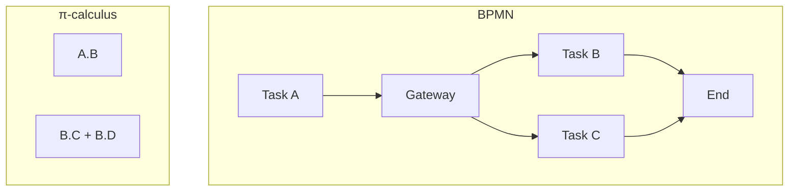
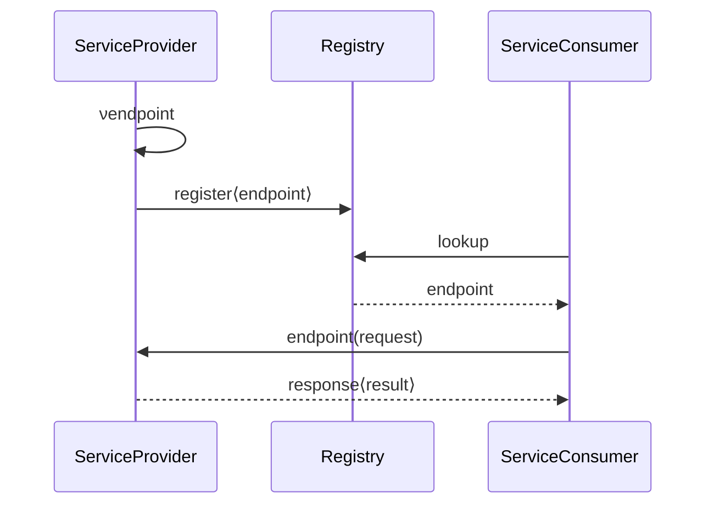

# π-calculus 在工作流建模中的应用

> **所属单元**: 02-calculi | **前置依赖**: 01-pi-calculus-basics.md | **形式化等级**: L3-L4

## 1. 概念定义

### 1.1 工作流形式化概述

**Def-C-05-01: 工作流形式化**

工作流是业务流程的计算抽象，形式化目标包括：

1. 精确语义定义
2. 正确性验证
3. 等价性检验
4. 优化支持

**Prop-C-05-01: π-calculus 适合工作流**

| 工作流特征 | π-calculus 对应 |
|-----------|----------------|
| 活动 | 进程 |
| 控制流 | 通道通信 |
| 数据流 | 名称传递 |
| 动态路由 | 移动性 (name passing) |

### 1.2 活动到进程的映射

**Def-C-05-02: 活动映射**

工作流活动 $A$ 映射为 π-calculus 进程：
$$\llbracket A \rrbracket = \text{pre}_A(x).P_A.\text{post}_A\langle y \rangle.0$$

其中：

- $\text{pre}_A$: 前置条件/输入通道
- $P_A$: 活动执行逻辑
- $\text{post}_A$: 后置条件/输出通道

## 2. 属性推导

### 2.1 控制流模式的形式化

**Puhlmann 和 Weske**（2005）系统地将工作流控制流模式映射到 π-calculus：

| 模式 | π-calculus 表示 |
|------|----------------|
| **顺序** | $P.Q$ |
| **并行拆分** | $\bar{a}\langle \rangle \mid \bar{b}\langle \rangle$ |
| **同步** | $a().b().P$ |
| **互斥选择** | $\tau.P + \tau.Q$ |
| **简单合并** | $a().P + b().P$ |
| **多实例** | $!P$ |

### 2.2 数据流建模

**Def-C-05-03: 数据对象映射**

工作流数据对象映射为通道：
$$\llbracket \text{Data Object } D \rrbracket = \text{channel } d_D$$

**数据读取**:
$$\llbracket \text{read}(D) \rrbracket = d_D(x).P$$

**数据写入**:
$$\llbracket \text{write}(D, v) \rrbracket = \bar{d}_D\langle v \rangle.P$$

## 3. 关系建立

### 3.1 与 BPMN 的关系

**Prop-C-05-02: BPMN 到 π-calculus**

存在从 BPMN 子集到 π-calculus 的编码：

| BPMN 元素 | π-calculus |
|-----------|-----------|
| Task | 进程 $P$ |
| Sequence Flow | 顺序组合 $.$ |
| Parallel Gateway | 并行组合 $\mid$ + 同步 |
| Exclusive Gateway | 选择 $+$ |
| Event | 输入/输出前缀 |

### 3.2 与 Petri 网的比较

| 维度 | Petri 网 | π-calculus |
|------|---------|-----------|
| 状态表示 | 显式（标记） | 隐式（进程项） |
| 组合性 | 弱（网融合复杂） | 强（代数组合） |
| 移动性 | 不支持 | 支持 |
| 验证工具 | 丰富（CPN Tools） | 较少 |
| 可视化 | 好 | 差 |

## 4. 论证过程

### 4.1 为什么要形式化？

**非形式化工作流的问题**:

- 语义模糊（BPMN 规范的歧义）
- 难以验证正确性
- 工具间互操作性差

**形式化的好处**:

- 精确语义
- 自动验证
- 等价性检验支持流程优化

### 4.2 Lazy Soundness

**Def-C-05-04: Lazy Soundness**

工作流 $W$ 是 lazy sound 的，如果：

1. 每个可达状态都可以到达终止状态
2. 终止状态唯一
3. 没有死任务

与经典 soundness 的区别：允许中间状态的"暂时堵塞"。

## 5. 形式证明 / 工程论证

### 5.1 死锁自由性

**Thm-C-05-01: 死锁检测**

对 π-calculus 编码的工作流 $W$，检查是否存在 deadlock 状态：
$$\exists S. W \to^* S \land S \not\to \land S \neq 0$$

*方法*: 使用类型系统或模型检测。

### 5.2 流程等价性

**Thm-C-05-02: 流程优化正确性**

若 $W_1 \approx W_2$（弱互模拟等价），则 $W_1$ 可以替换为 $W_2$ 而不改变外部可观察行为。

*应用*: 流程重构验证。

## 6. 实例验证

### 6.1 示例：订单处理流程

```
BPMN: Receive Order → [Check Credit] → [Process Order] → Ship
                           ↓
                    [Reject Order]

π-calculus:
Receive = order(x).(check⟨x⟩.0 | reject⟨x⟩.0)

CreditCheck = check(x).(
    if valid(x) then ok⟨x⟩.0
    else nok⟨x⟩.0
)

Process = ok(x).(process⟨x⟩.0 | ship⟨x⟩.0)
Reject = nok(x).notify⟨x⟩.0

System = (νorder,check,reject,ok,nok,ship,notify)(
    Receive | CreditCheck | Process | Reject
)
```

### 6.2 示例：动态服务编排

```
服务发现与绑定:

ServiceProvider = νendpoint.(
    register⟨endpoint⟩.0
    | endpoint(request).response⟨result⟩.0
)

ServiceConsumer = lookup(x).x(req).y(result).P

Registry = register(e).lookup⟨e⟩.Registry

System = (νregister,lookup)(
    ServiceProvider | ServiceConsumer | Registry
)
```

**移动性应用**: 服务端点动态传递。

### 6.3 工具支持：BPMN 到 π-calculus 转换

```python
# 伪代码：BPMN到π-calculus转换器
def bpmn_to_pi(bpmn_diagram):
    processes = []
    for element in bpmn_diagram.elements:
        if element.type == "Task":
            processes.append(translate_task(element))
        elif element.type == "Gateway":
            processes.append(translate_gateway(element))
        # ...
    return parallel_composition(processes)
```

## 7. 可视化

### 工作流到 π-calculus 映射



### 动态服务发现



## 8. 引用参考
