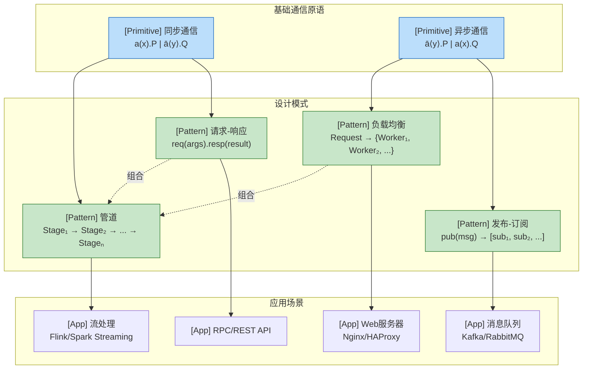
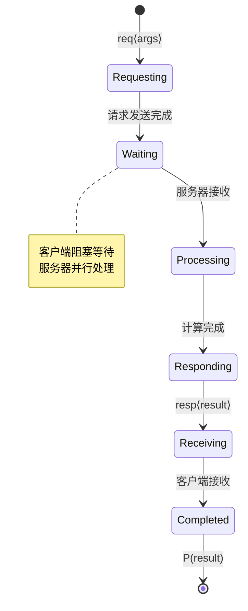

# π-Calculus 设计模式 (π-Calculus Design Patterns)

> 所属阶段: Struct | 前置依赖: [01.02-process-calculus-primer.md](../../../../Struct/01-foundation/01.02-process-calculus-primer.md) | 形式化等级: L3-L4

## 1. 概念定义 (Definitions)

### Def-C-02-03-01. 请求-响应模式 (Request-Reply Pattern)

**定义**: 请求-响应模式是一种同步通信模式，其中客户端进程发送请求并阻塞等待服务器进程的响应。

**π-演算形式化定义**:

```
Client(req, resp) = req⟨args⟩.resp(x).P(x)
Server(req, resp) = req(y).(compute(y) | resp⟨result⟩.Server(req, resp))
System = (ν req)(ν resp)(Client(req, resp) | Server(req, resp))
```

**结构要素**:

- `req`: 请求通道，用于发送请求参数
- `resp`: 响应通道，用于接收计算结果
- `args`: 请求参数
- `result`: 计算结果

**直观解释**: 客户端通过请求通道发送参数，然后阻塞等待响应通道上的结果。服务器接收请求，计算结果，然后通过响应通道返回结果。这种模式模拟了同步RPC调用。

---

### Def-C-02-03-02. 发布-订阅模式 (Publish-Subscribe Pattern)

**定义**: 发布-订阅模式是一种异步多播通信模式，其中发布者将消息发送给多个订阅者，而无需知道订阅者的具体身份。

**π-演算形式化定义**:

```
Publisher(pub, notify) = pub(x).notify⟨x⟩.Publisher(pub, notify)

Subscriber(notify, id, sub) = notify(y).sub⟨id, y⟩.Subscriber(notify, id, sub)

Broker(pub, notify, subs) =
  subs(s).Broker(pub, notify, s::subs)
  + pub(x).(ν n)(Multicast(n, notify, x, subs) | Broker(pub, notify, subs))

Multicast(n, notify, msg, []) = 0
Multicast(n, notify, msg, s::ss) = notify⟨msg⟩.Multicast(n, notify, msg, ss)

PubSubSystem = (ν pub)(ν notify)(ν subs)(
  Publisher(pub, notify)
  | Broker(pub, notify, [])
  | !Subscriber(notify, id₁, sub₁)
  | !Subscriber(notify, id₂, sub₂)
)
```

**结构要素**:

- `pub`: 发布通道，接收消息
- `notify`: 通知通道，向订阅者广播
- `subs`: 订阅管理通道，处理订阅/取消订阅

---

### Def-C-02-03-03. 管道模式 (Pipeline Pattern)

**定义**: 管道模式将数据处理分解为一系列顺序连接的阶段，每个阶段接收上一阶段的输出并产生下一阶段的输入。

**π-演算形式化定义**:

```
Stageᵢ(inᵢ, outᵢ, fᵢ) = inᵢ(x).outᵢ⟨fᵢ(x)⟩.Stageᵢ(inᵢ, outᵢ, fᵢ)

Pipeline = (ν c₁)(ν c₂)...(ν cₙ₋₁)(
  Stage₁(source, c₁, f₁)
  | Stage₂(c₁, c₂, f₂)
  | ...
  | Stageₙ(cₙ₋₁, sink, fₙ)
)
```

**结构要素**:

- `inᵢ/outᵢ`: 第i阶段的输入/输出通道
- `fᵢ`: 第i阶段的转换函数
- `cᵢ`: 阶段间连接通道

---

### Def-C-02-03-04. 负载均衡模式 (Load Balancer Pattern)

**定义**: 负载均衡模式将传入的请求分发给多个工作进程，以优化资源利用和响应时间。

**π-演算形式化定义**:

```
Worker(req, id, resp) = req(x).process(x, id).resp⟨result⟩.Worker(req, id, resp)

RoundRobinLB(in, workers, next) =
  in(x).workers[next]⟨x⟩.RoundRobinLB(in, workers, (next+1) mod |workers|)

LeastConnLB(in, workers, counts) =
  in(x).let i = argmin(counts) in
    workers[i]⟨x⟩.counts[i]++.LeastConnLB(in, workers, counts)

LoadBalancedSystem = (ν in)(ν resp)(
  (ν w₁)(ν w₂)(ν w₃)(
    Worker(w₁, 1, resp) | Worker(w₂, 2, resp) | Worker(w₃, 3, resp)
    | RoundRobinLB(in, [w₁, w₂, w₃], 0)
  )
)
```

**结构要素**:

- `in`: 请求入口通道
- `workers`: 工作进程通道列表
- `next/counts`: 调度状态（轮询位置或连接计数）

## 2. 属性推导 (Properties)

### Lemma-C-02-03-01. 请求-响应模式的顺序保证

**陈述**: 在请求-响应模式中，客户端必定在发送请求之后才能接收响应。

**证明**:

考虑客户端进程 `Client(req, resp) = req⟨args⟩.resp(x).P(x)`:

1. 客户端首先执行输出前缀 `req⟨args⟩`，发送请求参数
2. 根据π-演算语义，输出前缀完成后才能继续执行后续进程
3. 然后执行输入前缀 `resp(x)`，阻塞等待响应
4. 因此，响应接收必然发生在请求发送之后

形式化表示：`Client(req, resp) → resp(x).P(x) → P(v)`（其中v为接收值）

∎

---

### Lemma-C-02-03-02. 发布-订阅模式的多播正确性

**陈述**: 当发布者发送消息m时，所有当前已订阅的订阅者都会收到m。

**证明**:

1. 设订阅者列表为 `subs = [s₁, s₂, ..., sₙ]`
2. 发布者通过 `pub(x)` 发送消息
3. Broker触发多播：`Multicast(n, notify, msg, [s₁, s₂, ..., sₙ])`
4. 根据多播定义，对列表中的每个sᵢ执行 `notify⟨msg⟩`
5. 每个订阅者 `Subscriber(notify, id, sub)` 监听notify通道，因此都会接收消息

∎

---

### Prop-C-02-03-01. 管道模式的流保持性

**陈述**: 如果管道各阶段的转换函数都是全函数（total functions），则数据项必定从源端流动到汇端。

**推导**:

对于n阶段管道，设输入为d₀:

```
Stage₁(source, c₁, f₁): source(d₀) → c₁⟨f₁(d₀)⟩
Stage₂(c₁, c₂, f₂): c₁(d₁) → c₂⟨f₂(d₁)⟩ where d₁ = f₁(d₀)
...
Stageₙ(cₙ₋₁, sink, fₙ): cₙ₋₁(dₙ₋₁) → sink⟨fₙ(dₙ₋₁)⟩
```

由于每个fᵢ都是全函数，不存在未定义或无限循环的情况，数据必能流经所有阶段。

∎

---

### Prop-C-02-03-02. 负载均衡的工作分配均衡性

**陈述**: 在轮询负载均衡器中，当请求总数为N，工作进程数为W时，各工作进程处理的请求数差异不超过1。

**推导**:

轮询调度序列: w₀, w₁, ..., wₙ₋₁, w₀, w₁, ...

对于N个请求:

- 每个工作进程至少处理 ⌊N/W⌋ 个请求
- 前 N mod W 个进程额外处理1个请求
- 因此最大差异为1

∎

## 3. 关系建立 (Relations)

### 关系 1：请求-响应 ⊂ 同步通信原语

**论证**:

请求-响应模式可以直接映射到π-演算的基本同步通信原语。它本质上是两个连续的同步通信：

1. 请求发送 = 输出动作
2. 响应接收 = 输入动作

这与CSP中的同步握手语义等价，可以通过π-演算的 `[COMM]` 规则实现。

---

### 关系 2：发布-订阅 ↔ 多播通道

**论证**:

发布-订阅模式可以通过以下方式实现：

- **编码到π-演算**: 使用Broker进程管理订阅者列表，通过迭代发送实现多播
- **与多播π-演算的关系**: 多播π-演算（Polyadic π-calculus的扩展）原生支持一对多通信，可以直接表达发布-订阅

发布-订阅的异步特性与π-演算的非阻塞输出语义一致。

---

### 关系 3：管道模式 ↔ 函数复合

**论证**:

管道模式在函数式编程中对应函数复合 `fₙ ∘ fₙ₋₁ ∘ ... ∘ f₁`。在π-演算中：

- 各阶段的顺序连接对应函数复合的顺序性
- 通道 `cᵢ` 对应函数应用之间的中间结果传递
- 并行组合 `|` 对应惰性求值中的thunk并行创建

若所有阶段都是纯函数，则管道等价于函数复合的并行实现。

---

### 关系 4：负载均衡 ↔ 进程演算选择算子

**论证**:

负载均衡的调度决策对应进程演算中的选择：

- **轮询**: 确定性选择，基于计数器状态
- **随机**: 非确定性选择 `+` 或内部选择
- **最少连接**: 基于状态的条件选择

在CSP中，负载均衡可以表示为外部选择 `□` 的组合；在π-演算中，可以通过匹配守卫 `[cond]P` 实现条件路由。

## 4. 论证过程 (Argumentation)

### 论证 1：为什么请求-响应需要两个通道

考虑使用单通道实现请求-响应：

```
// 错误尝试
Client(chan) = chan⟨req⟩.chan(x).P(x)
Server(chan) = chan(y).chan⟨result⟩.Server(chan)
```

**问题**: 当多个客户端并发时，响应可能被错误的客户端接收，导致**响应混淆**（Response Mix-up）。

**解决方案**: 使用成对通道（请求通道 + 响应通道），其中响应通道是客户端私有的：

```
Client(req, resp) = (ν r)(req⟨args, r⟩.r(x).P(x))
Server(req) = req(y, ret).(compute(y) | ret⟨result⟩.Server(req))
```

这利用了π-演算的名字传递能力，动态创建私有响应通道。

---

### 论证 2：发布-订阅的扩展性边界

发布-订阅模式在订阅者数量增长时面临性能问题：

1. **线性多播复杂度**: Broker必须依次向每个订阅者发送消息，时间复杂度O(n)
2. **通道争用**: 所有订阅者监听同一通知通道，可能造成瓶颈
3. **内存开销**: Broker必须维护订阅者列表

**优化方向**:

- 分层Broker架构
- 使用多播通道原语（如果底层支持）
- 订阅者分组（Topic-based过滤）

---

### 论证 3：管道模式的背压问题

当管道各阶段处理速度不一致时，可能出现：

1. **快速生产者淹没慢速消费者**: 通道缓冲区溢出
2. **资源耗尽**: 中间数据堆积

**背压解决方案**:

- 使用有界通道（在类型系统中限制）
- 添加反压信号：当阶段i的缓冲区满时，暂停阶段i-1
- 在π-演算中，可以通过应答协议实现同步背压：

```
BackpressureStage(in, out, ack) =
  in(x).ack.(
    process(x)
    | out⟨result⟩.BackpressureStage(in, out, ack)
  )
```

---

### 论证 4：负载均衡策略的适用场景

| 策略 | 适用场景 | 不适用场景 |
|------|----------|-----------|
| 轮询 | 请求均匀、处理时间相似 | 请求大小不一 |
| 最少连接 | 长连接、状态保持 | 短连接、无状态 |
| 哈希 | 需要会话保持 | 需要动态扩展 |
| 随机 | 大量同质请求 | 需要确定性 |

在π-演算中，不同策略对应不同的状态管理和选择语义。

## 5. 形式证明 (Proofs)

### Thm-C-02-03-01. 请求-响应模式的类型安全

**陈述**: 在良类型的请求-响应系统中，客户端发送的请求类型与服务器期望的类型匹配，且服务器返回的响应类型与客户端期望的类型匹配。

**证明**:

设请求类型为T_req，响应类型为T_resp。

**类型上下文**:

```
Client(req: !T_req.?T_resp.end) = req⟨args:T_req⟩.resp(x:T_resp).P
Server(req: ?T_req.!T_resp.end) = req(y:T_req).resp⟨result:T_resp⟩.Server
```

**证明步骤**:

1. 客户端在通道req上输出类型为T_req的值
2. 服务器在通道req上输入，期望类型为T_req的值
3. 根据会话类型的对偶性，`!T_req` 与 `?T_req` 互补
4. 同理，服务器的 `!T_resp` 与客户端的 `?T_resp` 互补
5. 因此通信双方在每一步的类型都匹配

由会话类型的Progress定理，良类型的进程不会陷入死锁。

∎

---

### Thm-C-02-03-02. 管道模式的确定性输出

**陈述**: 对于确定的输入和确定的阶段函数，管道产生确定的输出。

**证明**:

设管道有n个阶段，输入为d₀，阶段函数为f₁, f₂, ..., fₙ。

**归纳证明**:

**基础**: n = 1

- Stage₁(source, sink, f₁) 接收d₀，输出f₁(d₀)
- 输出唯一确定

**归纳假设**: 假设n-1阶段管道对输入产生确定输出

**归纳步骤**: n阶段管道

- 前n-1阶段根据归纳假设产生确定输出dₙ₋₁ = fₙ₋₁(...f₁(d₀)...)
- 第n阶段接收dₙ₋₁，输出fₙ(dₙ₋₁)
- 因此最终输出唯一确定

由于π-演算中的通信是确定性的（无内部非确定性干扰时），管道输出完全由输入和函数决定。

∎

---

### Cor-C-02-03-01. 无环管道的无死锁性

**陈述**: 如果管道拓扑是无环的（数据单向流动），则管道不会死锁。

**证明**:

1. 无环管道构成有向无环图（DAG）
2. 数据流动方向与DAG的拓扑序一致
3. 每个阶段只在接收输入后才产生输出
4. 由于无环，不存在循环等待
5. 根据会话类型的死锁自由定理，线性使用通道的无环系统不会死锁

∎

## 6. 实例验证 (Examples)

### 示例 1：HTTP风格的请求-响应

```
// 客户端发送HTTP GET请求
HttpClient(req, resp) =
  req⟨"GET", "/api/data", "HTTP/1.1", r⟩.
  r(status, headers, body).
  if status = 200 then Process(body) else HandleError(status)

// 服务器处理请求
HttpServer(req) =
  req(method, path, version, ret).
  if method = "GET" ∧ path = "/api/data" then
    ret⟨200, "Content-Type: json", "{data: ...}"⟩.HttpServer(req)
  else
    ret⟨404, "", "Not Found"⟩.HttpServer(req)

HttpSystem = (ν req)(HttpClient(req) | HttpServer(req))
```

**执行轨迹**:

1. `HttpClient` 发送请求到 `req` 通道
2. `HttpServer` 接收请求，创建私有响应通道 `ret`
3. 服务器处理请求，发送响应到 `ret`
4. 客户端接收响应，根据状态码处理

---

### 示例 2：股票行情发布-订阅

```
// 股票行情发布者
StockPublisher(pub, notify) =
  StockFeed(feed).
  feed(price).notify⟨"AAPL", price⟩.StockPublisher(pub, notify)

// 行情订阅者
StockSubscriber(notify, symbol, handler) =
  notify(sym, price).
  if sym = symbol then
    handler⟨price⟩.StockSubscriber(notify, symbol, handler)
  else
    StockSubscriber(notify, symbol, handler)

// 行情Broker
StockBroker(pub, notify, registry) =
  pub⟨sym, price⟩.
  registry(sym, subs).
  MulticastNotify(notify, sym, price, subs).
  StockBroker(pub, notify, registry)

MulticastNotify(n, s, p, []) = 0
MulticastNotify(n, s, p, sub::subs) = n⟨s, p⟩.MulticastNotify(n, s, p, subs)

StockSystem = (ν pub)(ν notify)(
  StockPublisher(pub, notify)
  | StockBroker(pub, notify, Registry)
  | StockSubscriber(notify, "AAPL", Handler1)
  | StockSubscriber(notify, "GOOGL", Handler2)
)
```

---

### 示例 3：数据处理管道（Map-Reduce风格）

```
// 数据转换管道
Extract(in, out) = in(record).out⟨parse(record)⟩.Extract(in, out)
Transform(in, out) = in(data).out⟨enrich(data)⟩.Transform(in, out)
Load(in, out) = in(enriched).out⟨store(enriched)⟩.Load(in, out)

// 完整ETL管道
ETLPipeline = (ν c₁)(ν c₂)(
  Extract(source, c₁)
  | Transform(c₁, c₂)
  | Load(c₂, sink)
)

// 并行处理版本
ParallelETL = (ν c₁)(ν c₂)(
  Extract(source, c₁)
  | !Transform(c₁, c₂)  // 多个转换工作者
  | !Load(c₂, sink)      // 多个加载工作者
  | LoadBalancer(c₁, [t₁, t₂, t₃])  // 分发到转换工作者
  | LoadBalancer(c₂, [l₁, l₂])      // 分发到加载工作者
)
```

---

### 示例 4：Web服务器负载均衡

```
// Web工作者
WebWorker(req, id, resp) =
  req(path).
  (ν r)(
    FileSystem⟨path, r⟩.
    r(content).
    resp⟨200, content⟩.WebWorker(req, id, resp)
  )

// 轮询负载均衡器
WebLoadBalancer(in, workers, counter) =
  in(request).
  let target = workers[counter mod |workers|] in
    target⟨request⟩.
    WebLoadBalancer(in, workers, counter + 1)

// 健康检查
HealthChecker(workers, status) =
  CheckWorker(workers[0]).
  UpdateStatus(status, 0, result).
  HealthChecker(workers, status)

// 完整Web系统
WebSystem = (ν in)(ν resp)(
  (ν w₁)(ν w₂)(ν w₃)(
    WebWorker(w₁, 1, resp)
    | WebWorker(w₂, 2, resp)
    | WebWorker(w₃, 3, resp)
    | WebLoadBalancer(in, [w₁, w₂, w₃], 0)
    | HealthMonitor([w₁, w₂, w₃])
  )
  | Logger(resp)
)
```

---

### 反例 1：忘记创建私有响应通道导致的混淆

```
// 错误实现
BadClient(req) = req⟨args⟩.req(x).P(x)  // 使用同一通道
BadServer(req) = req(y).req⟨result⟩.BadServer(req)

// 问题场景
System = (ν req)(
  BadClient(req) | BadClient(req) | BadServer(req)
)
```

**分析**: 两个客户端都监听 `req` 通道，服务器发送的响应可能被任一客户端接收，导致响应混淆。

**修复**: 使用名字传递创建私有响应通道（见Def-C-02-03-01）。

---

### 反例 2：循环管道导致的死锁

```
// 危险：循环依赖
StageA(outA, inB) = outA⟨data⟩.inB(x).StageA(outA, inB)
StageB(outB, inA) = inA(y).outB⟨processed⟩.StageB(outB, inA)

DeadlockSystem = (ν c)(StageA(c, c) | StageB(c, c))  // 循环等待
```

**分析**: StageA等待StageB的输出，StageB等待StageA的输出，形成循环等待，导致死锁。

## 7. 可视化 (Visualizations)

### 设计模式关系图



### 请求-响应模式执行树



### 管道模式数据流图

```mermaid
graph LR
    Source["[Source]<br/>数据源"] -->|data₀| S1["Stage₁<br/>f₁(x)"]
    S1 -->|d₁=f₁(d₀)| S2["Stage₂<br/>f₂(x)"]
    S2 -->|d₂=f₂(d₁)| S3["Stage₃<br/>f₃(x)"]
    S3 -->|d₃=f₃(d₂)| Sink["[Sink]<br/>数据汇"]

    style Source fill:#fff3e0,stroke:#e65100
    style Sink fill:#fff3e0,stroke:#e65100
    style S1 fill:#e3f2fd,stroke:#1565c0
    style S2 fill:#e3f2fd,stroke:#1565c0
    style S3 fill:#e3f2fd,stroke:#1565c0
```

## 8. 引用参考 (References)
