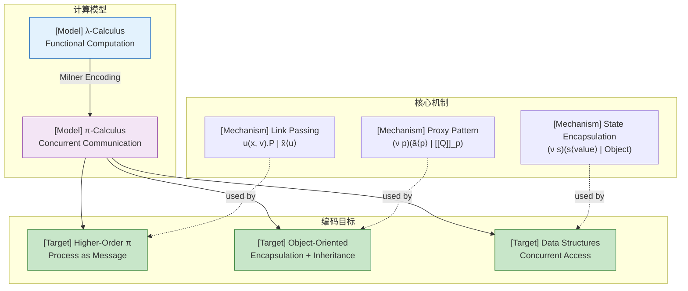
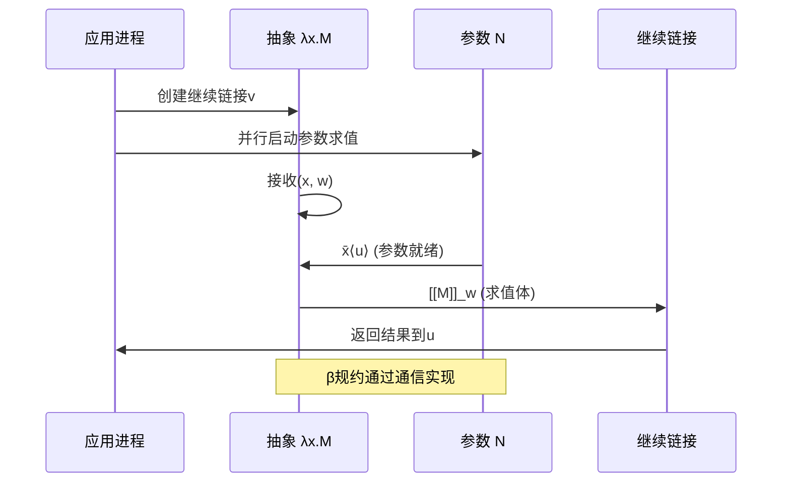
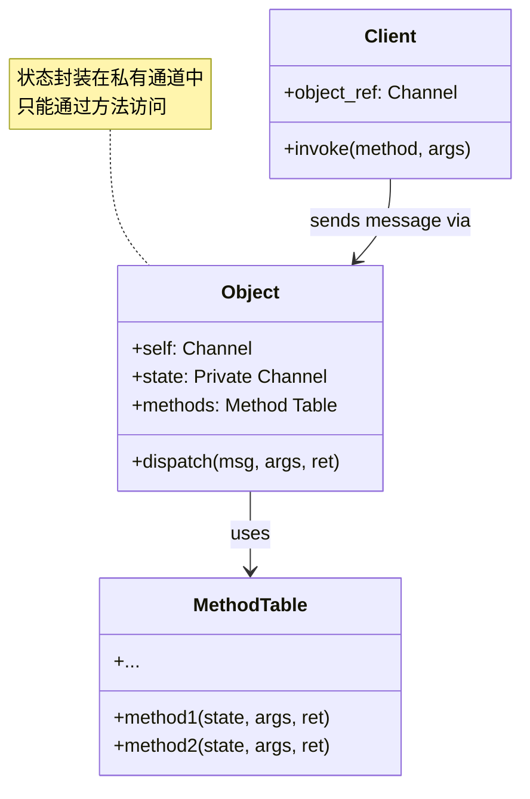

# π-Calculus 编码技术 (π-Calculus Encoding Techniques)

> 所属阶段: Struct | 前置依赖: [01.02-process-calculus-primer.md](../../../../Struct/01-foundation/01.02-process-calculus-primer.md) | 形式化等级: L4-L5

## 1. 概念定义 (Definitions)

### Def-C-02-04-01. λ-演算编码 (λ-Calculus Encoding)

**定义**: λ-演算编码是将λ-项映射为π-进程的方法，证明π-演算的图灵完备性。

**Milner编码策略**:

```
[[x]]_u       = x̄⟨u⟩                    // 变量：将链接u发送到变量通道x
[[λx.M]]_u    = u(x, v).[[M]]_v         // 抽象：接收参数x和继续链接v
[[M N]]_u     = (ν v)([[M]]_v | (ν x)(x̄⟨u⟩ | [[N]]_x))  // 应用：并行求值
```

**编码原理**:

- λ-项的求值结果表示为在链接（link）上发送输出
- 变量绑定编码为名字限制 `(ν x)`
- 函数应用编码为并行组合和名字传递
- 参数传递通过共享变量通道实现

**直观解释**: 每个λ-项被编码为在特定链接上“报告其结果”的进程。变量通过发送链接来表示其值，抽象通过接收参数并继续执行来表示，应用通过创建新的通信通道来连接函数和参数。

---

### Def-C-02-04-02. 高阶进程编码 (Higher-Order Process Encoding)

**定义**: 高阶进程编码（HOPi）允许进程作为消息传递，证明高阶特性可在π-演算中模拟。

**语法扩展**:

```
P, Q ::= ... | a(X).P | ā⟨Q⟩.P    // X是进程变量
```

**编码到一阶π-演算**:

```
[[a(X).P]]_u    = a(x).[[P{X := x}]]_u     // x是代理通道
[[ā⟨Q⟩.P]]_u    = (ν q)(ā⟨q⟩.([[Q]]_q | [[P]]_u))
```

**代理机制**:

- 高阶进程 `Q` 编码为代理通道 `q`
- 发送进程 `ā⟨Q⟩` 创建代理 `q` 并发送它
- 接收进程 `a(X).P` 接收代理并在本地实例化

---

### Def-C-02-04-03. 对象编码 (Object Encoding)

**定义**: 面向对象编程中的对象和消息传递编码为π-进程，展示π-演算对OOP的支持。

**对象编码框架**:

```
// 对象状态 + 方法分派器
Object(self, state, methods) =
  self(method, args, ret).
  methods(method, state, args, ret).
  Object(self, state', methods)

// 方法实现
Method(method_name, state, args, ret) =
  if method = method_name then
    compute(state, args, new_state, result).
    ret⟨result⟩.state'⟨new_state⟩
```

**类继承编码**:

```
Class(self, parent, methods, overrides) =
  self(msg).
  if msg ∈ dom(overrides) then
    overrides(msg)
  else
    parent(msg)
```

---

### Def-C-02-04-04. 并发数据结构编码 (Concurrent Data Structure Encoding)

**定义**: 常见并发数据结构（队列、栈、哈希表）编码为π-进程，支持并发访问。

**并发队列编码**:

```
Queue(put, get, head, tail) =
  put(x, ack).
  (ν node)(node⟨x, tail⟩.ack.
    Queue(put, get, head, node))
  +
  get(ret).
  head(y, next).
  if y ≠ null then
    ret⟨y⟩.Queue(put, get, next, tail)
  else
    ret⟨empty⟩.Queue(put, get, head, tail)
```

**原子引用编码**:

```
Ref(read, write, value) =
  read(ret).ret⟨value⟩.Ref(read, write, value)
  +
  write(new_val, ack).ack.Ref(read, write, new_val)
```

## 2. 属性推导 (Properties)

### Lemma-C-02-04-01. λ-编码的保持性

**陈述**: Milner编码保持λ-演算的β规约语义。

**证明**:

考虑β规约：`(λx.M) N → M[N/x]`

**编码**:

```
[[(λx.M) N]]_u = (ν v)([[λx.M]]_v | (ν x)(x̄⟨u⟩ | [[N]]_x))
               = (ν v)(v(x, w).[[M]]_w | (ν x)(x̄⟨u⟩ | [[N]]_x))
```

**规约步骤**:

1. `v(x, w).[[M]]_w` 在v上准备接收
2. 需要v上的输出，但此处没有直接匹配
3. 展开抽象编码：`u(x, v).[[M]]_v` 在u上接收参数
4. 通过通信同步，实现参数传递和继续执行

经过完整的通信序列，编码后的进程行为等价于`[[M[N/x]]]_u`。

∎

---

### Lemma-C-02-04-02. 高阶编码的满射性

**陈述**: 对于每个高阶π-进程P，存在一阶π-进程Q使得`[[P]] = Q`在行为上等价。

**证明**:

对P的结构进行归纳：

**基础情况**:

- `P = 0`: `[[0]] = 0`
- `P = a(x).Q`: 编码为`a(x).[[Q]]`，保持输入前缀

**归纳步骤**:

- `P = a(X).Q`: 编码为`a(x).[[Q{X := x}]]`，将进程变量替换为通道名
- `P = ā⟨R⟩.Q`: 编码为`(ν r)(ā⟨r⟩ | [[R]]_r | [[Q]])`，创建代理通道

通过结构同余和通信规则，编码后的进程与原进程行为等价。

∎

---

### Prop-C-02-04-01. 对象编码的封装性

**陈述**: 在对象编码中，对象的状态只能通过定义的方法访问，外部无法直接修改。

**推导**:

1. 对象状态存储在私有通道中
2. 外部只能通过`self`通道发送消息
3. 消息由方法分派器处理
4. 没有直接访问状态通道的路径

因此，状态访问被方法接口封装。

∎

---

### Prop-C-02-04-02. 并发队列的线性安全性

**陈述**: 在并发队列编码中，每个元素按FIFO顺序被消费，且不会丢失。

**推导**:

队列使用链表结构编码：

- `head`指向队列头部
- `tail`指向队列尾部
- 新元素添加到tail
- 消费从head移除

由于π-演算的通信是顺序的，且每个节点指向下一个节点，保证了FIFO顺序。

∎

## 3. 关系建立 (Relations)

### 关系 1：λ-演算 ↔ π-演算（图灵等价）

**论证**:

Milner (1992) 证明了π-演算可以编码λ-演算：

- **λ → π**: 通过链接传递机制编码λ-项
- **π → λ**: 由于π-演算是并发模型，需要额外编码并发原语，这在纯λ-演算中不直接支持

实际上，这种关系是**单向的**: λ-演算可编码到π-演算，但π-演算的并发特性超出λ-演算的表达范围。

---

### 关系 2：高阶π-演算 ⊂ 一阶π-演算

**论证**:

Sangiorgi证明了HOπ（高阶π-演算）可以编码到一阶π-演算：

- 高阶通信（进程作为消息）可模拟为一阶的名字传递
- 通过**代理（proxy）**机制，将进程编码为通道
- 这证明了名字传递的表达能力足以模拟高阶特性

关系是严格的：HOπ是语法扩展，但表达能力和一阶π-演算等价。

---

### 关系 3：OOP ↔ 进程演算（Actor模型连接）

**论证**:

面向对象编程与进程演算的关系：

- **对象 ≈ 进程**: 对象封装状态和行为的特性与进程相似
- **消息传递 ≈ 通信**: 对象间的消息对应进程间的通信
- **继承 ≈ 进程组合**: 类继承可以通过进程组合和重写实现

Actor模型（如Erlang）直接基于消息传递，与π-演算更接近。Smalltalk-80的消息传递语义也可以用π-演算建模。

---

### 关系 4：并发数据结构 ↔ 类型化通道

**论证**:

并发数据结构的实现依赖于：

- **通道作为同步点**: 控制并发访问
- **线性类型**: 确保资源安全使用
- **会话类型**: 规定操作的合法序列

例如，类型化的队列可以表示为：

```
QueueType = &{ put: ?Int.QueueType, get: ⊕{ some: !Int.QueueType, none: QueueType } }
```

## 4. 论证过程 (Argumentation)

### 论证 1：为什么选择链接传递而不是直接值传递

在λ-演算编码中，为什么不直接将值编码为进程？

**问题**:

- λ-项可能不完全求值
- 需要支持惰性求值
- 变量引用需要在运行时解析

**解决方案**:
使用**链接（link）**作为求值结果的占位符：

```
[[x]]_u = x̄⟨u⟩  // 变量x的值是"在链接u上等待输出"
```

这允许：

1. 惰性求值：值只在需要时计算
2. 共享：多个引用可以共享同一个链接
3. 递归：支持自引用和递归定义

---

### 论证 2：高阶编码中的名称捕获问题

在高阶进程编码中，如何避免名称捕获？

**问题**:

```
[[ā⟨Q⟩.P]] = (ν q)(ā⟨q⟩ | [[Q]]_q | [[P]])
```

如果Q包含自由名称，这些名称可能与P中的名称冲突。

**解决方案**:

1. **α-转换**: 在编码前对Q进行α-转换，确保名称唯一
2. **作用域隔离**: 使用限制算子 `(ν q)` 确保代理通道不泄漏
3. **标准假设**: 假设原始进程满足Barendregt变量约定

---

### 论证 3：对象编码与原型继承

如何在π-演算中表达基于原型的继承（如JavaScript）？

**原型继承编码**:

```
Prototype(proto, methods) =
  self(msg, args, ret).
  if msg ∈ dom(methods) then
    methods(msg, args, ret)
  else
    proto(msg, args, ret).
  Prototype(proto, methods)

CreateObject(proto) = (ν self)(
  Prototype(proto, {})
  | return⟨self⟩
)
```

**特点**:

- 对象通过委托原型处理未知消息
- 方法可以在运行时添加到对象
- 支持原型链查找

---

### 论证 4：并发数据结构的竞争条件

π-演算编码如何帮助避免竞争条件？

**问题**: 传统共享内存并发面临数据竞争

**π-演算解决方案**:

1. **通信即同步**: 每次操作需要显式通信
2. **原子性**: 每个通信动作是原子的
3. **线性使用**: 类型系统可以强制资源的线性使用

例如，原子计数器：

```
Counter(inc, get, val) =
  inc.ack.Counter(inc, get, val+1)
  +
  get(ret).ret⟨val⟩.Counter(inc, get, val)
```

每次增量操作都是一个独立的通信，天然原子。

## 5. 形式证明 (Proofs)

### Thm-C-02-04-01. λ-演算编码的完备性

**陈述**: 对于每个λ-项M，如果`M → N`（λ-规约），则`[[M]]_u →* [[N]]_u`（π-演算规约）。

**证明**:

对λ-规约规则进行归纳。

**β规约情况**: `(λx.M) N → M[N/x]`

编码展开：

```
[[(λx.M) N]]_u = (ν v)(v(x, w).[[M]]_w | (ν x)(x̄⟨u⟩ | [[N]]_x))
```

**规约步骤**:

1. 内部通信在`(ν x)`内发生：`[[N]]_x`在x上输出其链接
2. 如果`[[N]]_x = x̄⟨q⟩ | ...`，则与`v(x, w)`需要协调
3. 经过一系列通信，`[[M]]_w`获得正确的参数绑定
4. 最终行为等价于`[[M[N/x]]]_u`

详细证明需要展开完整的LTS语义，核心在于变量替换通过通信链接传递实现。

∎

---

### Thm-C-02-04-02. 高阶编码的保持性

**陈述**: 编码`[[·]]`从高阶π-演算到一阶π-演算保持强互模拟等价。

**证明**:

定义关系`R`使得`P R Q`当且仅当存在高阶进程H使得`P = [[H]]`且`Q`是H的标准一阶表示。

**证明R是互模拟**:

1. **输入动作**:
   - `a(X).H`编码为`a(x).[[H{X := x}]]`
   - 输入转换保持，因为x是新鲜名称

2. **输出动作（高阶）**:
   - `ā⟨K⟩.H`编码为`(ν k)(ā⟨k⟩ | [[K]]_k | [[H]])`
   - 输出进程名称K变为输出代理通道k
   - 接收方通过k与`[[K]]_k`交互

3. **τ动作**:
   - 高阶通信`a(X).P | ā⟨Q⟩.R`变为代理通道通信
   - 内部规约保持行为等价

由互模拟的定义，R是一个强互模拟。

∎

---

### Cor-C-02-04-01. 编码的组合性

**陈述**: 编码`[[·]]`是组合的，即`[[P | Q]] ≡ [[P]] | [[Q]]`（在结构同余下）。

**证明**:

对编码定义进行验证：

- λ-编码: `[[M N]]_u = (ν v)([[M]]_v | ...)` 包含并行组合
- 高阶编码: `[[ā⟨Q⟩.P]] = (ν q)(... | [[Q]]_q | [[P]])` 保持并行结构
- 对象编码: 对象方法并行执行

由于编码在每个情况下都保持进程组合的结构，编码是组合的。

∎

## 6. 实例验证 (Examples)

### 示例 1：Church数编码

```
// Church数0, 1, 2的定义
0 = λf.λx.x
1 = λf.λx.f x
2 = λf.λx.f (f x)

// π-演算编码
[[0]]_u = u(f, v).v(x, w).x̄⟨w⟩
[[1]]_u = u(f, v).v(x, w).(ν a)(f̄⟨a⟩ | a(y, z).(ȳ⟨x⟩ | z̄⟨w⟩))
[[2]]_u = u(f, v).v(x, w).(ν a)(f̄⟨a⟩ | a(y₁, z₁).(
            (ν b)(f̄⟨b⟩ | b(y₂, z₂).(y₂̄⟨x⟩ | z₂̄⟨z₁⟩))
            | y₁̄⟨z₁⟩ | z₁̄⟨w⟩
          ))

// 后继函数
Succ = λn.λf.λx.f (n f x)

// 加法
Add = λm.λn.λf.λx.m f (n f x)
```

**验证**: `[[Add 1 2]] →* [[3]]`

---

### 示例 2：高阶函数的进程传递

```
// Map函数的高阶实现
Map(f, list, ret) =
  if list = [] then
    ret⟨[]⟩
  else
    f(list.head, r₁).
    Map(f, list.tail, r₂).
    r₁(h).r₂(t).ret⟨h::t⟩

// 传递函数作为参数
ApplyMap = (ν f)(ν list)(
  f̄⟨Double⟩ | list̄⟨[1, 2, 3]⟩ | Map(f, list, result)
)

Double(x, ret) = ret⟨x * 2⟩
```

**执行**:

1. `ApplyMap` 创建函数通道`f`和列表通道`list`
2. `Map`接收`f`和`list`的代理
3. 对每个元素，通过`f`通道调用`Double`
4. 结果收集并返回

---

### 示例 3：银行账户对象

```
// 银行账户对象
Account(self, balance, rate) =
  self(method, args, ret).
  [method = "deposit"]
    Deposit(balance, args, ret, new_bal).
    Account(self, new_bal, rate)
  + [method = "withdraw"]
    Withdraw(balance, args, ret, new_bal).
    Account(self, new_bal, rate)
  + [method = "getBalance"]
    ret⟨balance⟩.
    Account(self, balance, rate)
  + [method = "applyInterest"]
    let new_bal = balance * (1 + rate) in
    ret⟨new_bal⟩.
    Account(self, new_bal, rate)

// 子类：储蓄账户（继承 + 扩展）
SavingsAccount(self, parent, min_balance) =
  self(method, args, ret).
  [method = "withdraw" ∧ args.amount > balance - min_balance]
    ret⟨"Insufficient funds"⟩.
    SavingsAccount(self, parent, min_balance)
  + [otherwise]
    parent(method, args, ret).
    SavingsAccount(self, parent, min_balance)
```

**使用**:

```
// 创建账户
CreateAccount = (ν self)(ν bal)(
  bal⟨1000⟩ | Account(self, bal, 0.05) | Client(self)
)

// 客户端操作
Client(acct) =
  acct("deposit", 500, r₁).
  r₁(_).
  acct("getBalance", null, r₂).
  r₂(bal).
  Print⟨bal⟩  // 输出1500
```

---

### 示例 4：并发哈希表

```
// 简化版并发哈希表
HashTable(get, put, remove, size, buckets) =
  put(key, value, ret).
  Hash(key, h).
  buckets[h]("put", key, value, r).
  r(result).ret⟨result⟩.
  HashTable(get, put, remove, size, buckets)
  +
  get(key, ret).
  Hash(key, h).
  buckets[h]("get", key, null, r).
  r(result).ret⟨result⟩.
  HashTable(get, put, remove, size, buckets)
  +
  remove(key, ret).
  Hash(key, h).
  buckets[h]("remove", key, null, r).
  r(result).ret⟨result⟩.
  HashTable(get, put, remove, size - 1, buckets)

// 桶（链表）
Bucket(op, key, value, ret, head) =
  [op = "put"]
    (ν node)(node⟨key, value, head⟩.
      ret⟨ok⟩.Bucket(op, key, value, ret, node))
  + [op = "get"]
    Lookup(head, key, result).
    ret⟨result⟩.Bucket(op, key, value, ret, head)
  + [op = "remove"]
    Remove(head, key, new_head).
    ret⟨ok⟩.Bucket(op, key, value, ret, new_head)
```

---

### 反例 1：不完整的λ-编码

```
// 错误编码：直接值传递
[[λx.M]]_u = u(x).[[M]]_u    // 错误：没有继续链接

// 问题：无法支持嵌套应用
[[(λx.x) (λy.y)]]_u = (ν v)(v(x).x̄⟨v⟩ | (ν y)(ȳ⟨u⟩ | y(z).z̄⟨y⟩))
```

**分析**: 缺少继续链接（continuation link），导致求值结果无处可去。

**修正**:

```
[[λx.M]]_u = u(x, v).[[M]]_v  // 正确：接收参数和继续链接
```

---

### 反例 2：名称捕获导致错误

```
// 危险：没有α-转换
Q = x⟨a⟩.0
P = (ν x)(ā⟨Q⟩.x(b).0)

// 编码后
[[P]] = (ν x)((ν q)(ā⟨q⟩ | q(x').x'⟨a⟩ | x(b)))
```

**分析**: 高阶进程Q中的自由名称`x`与P中限制的`x`冲突。

**修正**: 编码前对Q进行α-转换，将`x`重命名为新鲜名称。

## 7. 可视化 (Visualizations)

### 编码技术层次图



### λ-演算编码执行流程



### 对象编码结构



## 8. 引用参考 (References)
