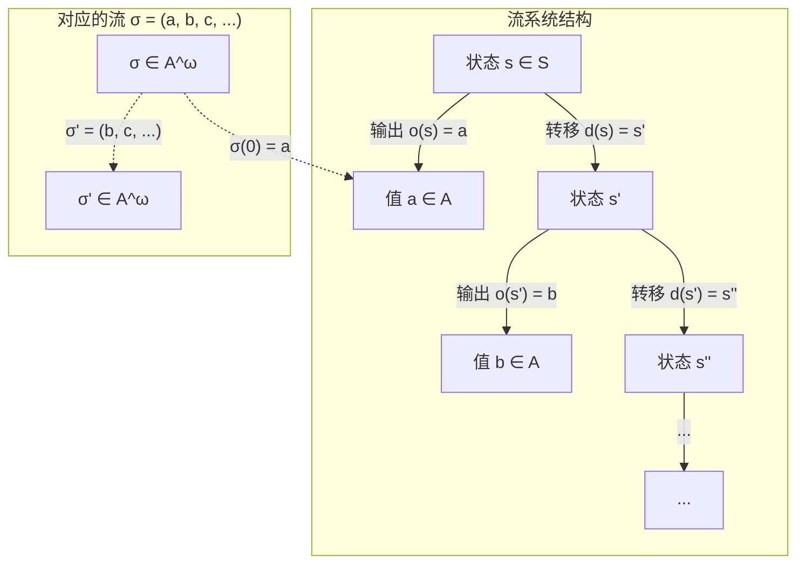
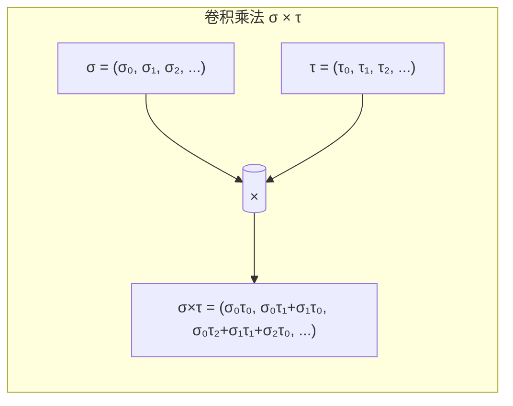
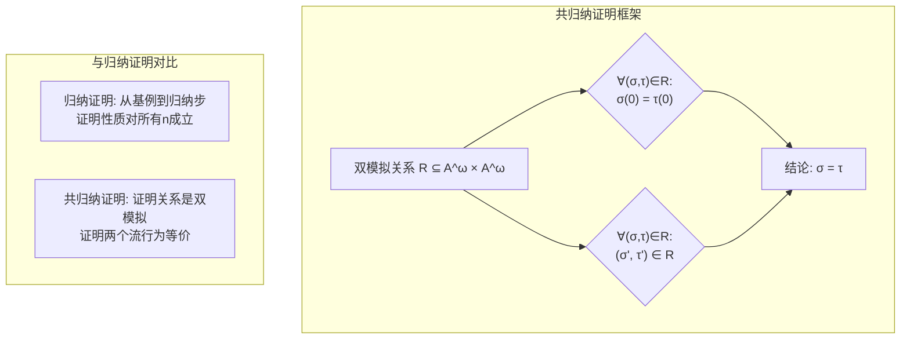
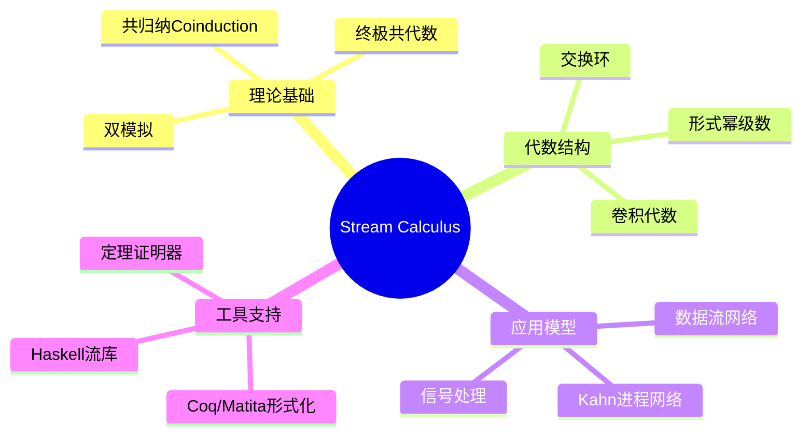

# Stream Calculus (流演算)

> **所属单元**: formal-methods/02-calculi/03-stream-calculus
> **前置依赖**: [01-coinduction.md](../02-coinduction/01-coinduction.md), [02-bisimulation.md](../02-coinduction/02-bisimulation.md)
> **形式化等级**: L5 (严格形式化，含完整证明)
> **作者**: Jan Rutten

## 1. 概念定义 (Definitions)

### 1.1 流的基本定义

**定义 Def-C-01-01 (流/Stream)**
设 $A$ 为任意集合，$A$ 上的**流** (stream) 是一个从自然数集到 $A$ 的函数：

$$\sigma: \mathbb{N} \to A$$

所有 $A$ 上流构成的集合记为 $A^\omega$。

**注记**: 流 $\sigma$ 可视为无限序列 $(\sigma(0), \sigma(1), \sigma(2), \ldots)$，其中 $\sigma(n)$ 表示流的第 $n$ 个元素。

---

**定义 Def-C-01-02 (流的初值与导数)**
对于流 $\sigma \in A^\omega$，定义：

1. **初值** (initial value):
   $$\sigma(0) \in A$$

2. **导数** (stream derivative):
   $$\sigma' = (\sigma(1), \sigma(2), \sigma(3), \ldots) \in A^\omega$$
   即 $\sigma'(n) = \sigma(n+1)$ 对所有 $n \in \mathbb{N}$ 成立。

**注记**: 初值和导数构成了流的**共归纳解构** (coinductive deconstructor)。

---

**定义 Def-C-01-03 (流系统/Stream System)**
一个**流系统**是三元组 $(S, \langle o, d \rangle)$，其中：

- $S$ 是状态集合
- $o: S \to A$ 是输出函数 (observation)
- $d: S \to S$ 是转移函数 (transition/derivative)

**注记**: 流 $(A^\omega, \langle (\cdot)(0), (\cdot)' \rangle)$ 是终极流系统 (final stream system)。

---

### 1.2 流的代数运算

**定义 Def-C-01-04 (逐点加法)**
设 $A$ 为交换环，对 $\sigma, \tau \in A^\omega$，定义**逐点加法**:

$$(\sigma + \tau)(n) = \sigma(n) + \tau(n)$$

---

**定义 Def-C-01-05 (卷积乘法/Convolution Product)**
对 $\sigma, \tau \in A^\omega$，**卷积乘法** $\sigma \times \tau$ (或 $\sigma \cdot \tau$) 定义为：

$$(\sigma \times \tau)(n) = \sum_{i=0}^{n} \sigma(i) \cdot \tau(n-i)$$

**注记**: 卷积乘法对应于形式幂级数的乘法运算。

---

**定义 Def-C-01-06 (Shuffle积/Shuffle Product)**
**Shuffle积** $\sigma \otimes \tau$ 递归定义为：

$$\sigma \otimes \tau = \sigma(0) \cdot \tau + X \times (\sigma' \otimes \tau + \sigma \otimes \tau')$$

其中 $X = (0, 1, 0, 0, \ldots)$ 是位置变量流。

---

**定义 Def-C-01-07 (形式幂级数表示)**
流 $\sigma$ 可表示为**形式幂级数**:

$$\sigma = \sum_{n=0}^{\infty} \sigma(n) \cdot X^n$$

其中 $X^n$ 表示 $n$ 个 $X$ 的卷积幂。

## 2. 属性推导 (Properties)

### 2.1 流演算基本引理

**引理 Lemma-C-01-01 (卷积乘法的初值与导数)**
对任意 $\sigma, \tau \in A^\omega$：

1. 初值: $(\sigma \times \tau)(0) = \sigma(0) \cdot \tau(0)$
2. 导数: $(\sigma \times \tau)' = \sigma' \times \tau + \sigma(0) \times \tau'$

**证明**:
(1) 由卷积定义直接可得。

(2) 对任意 $n \geq 0$：
$$\begin{aligned}
(\sigma \times \tau)'(n) &= (\sigma \times \tau)(n+1) \\
&= \sum_{i=0}^{n+1} \sigma(i) \cdot \tau(n+1-i) \\
&= \sigma(0) \cdot \tau(n+1) + \sum_{i=1}^{n+1} \sigma(i) \cdot \tau(n+1-i) \\
&= \sigma(0) \cdot \tau'(n) + \sum_{j=0}^{n} \sigma(j+1) \cdot \tau(n-j) \\
&= (\sigma(0) \times \tau')(n) + (\sigma' \times \tau)(n)
\end{aligned}$$
∎

---

**引理 Lemma-C-01-02 (流的展开公式)**
对任意流 $\sigma \in A^\omega$：

$$\sigma = \sigma(0) + (X \times \sigma')$$

其中常数流 $a = (a, a, a, \ldots)$，$X = (0, 1, 0, 0, \ldots)$。

**证明**: 对任意位置 $n$ 验证等式成立。
- 当 $n = 0$：左边 = $\sigma(0)$，右边 = $\sigma(0) + 0 = \sigma(0)$ ✓
- 当 $n \geq 1$：左边 = $\sigma(n)$，右边 = $0 + (X \times \sigma')(n) = \sigma'(n-1) = \sigma(n)$ ✓
∎

---

**引理 Lemma-C-01-03 (终极共代数性质)**
流系统 $(A^\omega, \langle (\cdot)(0), (\cdot)' \rangle)$ 是终极的 (final)：对任意流系统 $(S, \langle o, d \rangle)$，存在唯一的同态映射 $[-]: S \to A^\omega$。

**证明概要**: 定义 $[s](n) = o(d^n(s))$，验证这是唯一的同态。∎

### 2.2 代数结构性质

**命题 Prop-C-01-01 (流代数结构)**
$(A^\omega, +, \times, 0, 1)$ 构成**交换环**，其中：
- $0 = (0, 0, 0, \ldots)$ (零流)
- $1 = (1, 0, 0, \ldots)$ (单位流，即 $X^0$)

**证明概要**: 需验证：
1. $(A^\omega, +, 0)$ 是阿贝尔群
2. $(A^\omega, \times, 1)$ 是交换幺半群
3. 分配律成立

分配律验证（关键部分）：
$$\sigma \times (\tau + \rho) = (\sigma \times \tau) + (\sigma \times \rho)$$
使用共归纳证明原理（见第6节）。∎

## 3. 关系建立 (Relations)

### 3.1 与其他计算模型的关系

**关系映射表**:

| Stream Calculus | 对应概念 | 数学结构 |
|----------------|---------|---------|
| 流 $\sigma$ | 形式幂级数 | $A[[X]]$ |
| 初值 $\sigma(0)$ | 常数项 | 环元素 |
| 导数 $\sigma'$ | 形式导数 | 微分算子 |
| 卷积乘法 | 柯西乘积 | 级数乘法 |
| 共归纳证明 | 双模拟等价 | 终极共代数 |

### 3.2 与进程代数的关系

**定理 Thm-C-01-02 (流与确定型进程)**
流演算可视为**确定型进程**的迹语义 (trace semantics)：
- 状态转移: $s \xrightarrow{\sigma(0)} s'$，其中 $s'$ 对应 $\sigma'$
- 输出即为观察标签

**对比分析**:

| 特性 | Stream Calculus | CCS/CSP |
|-----|-----------------|---------|
| 确定性 | 完全确定 | 非确定 |
| 输出 | 每个状态都有输出 | 部分状态阻塞 |
| 等价 | 流相等 = 共归纳等价 | 互模拟等价 |
| 组合 | 卷积/Shuffle | 并行组合算子 |

### 3.3 与数据流网络的关系

流演算提供了数据流网络的形式语义基础：
- 网络节点 = 流变换器
- 边 = 流的传递
- 反馈回路 = 递归流方程

## 4. 论证过程 (Argumentation)

### 4.1 共归纳定义的合理性

**问题**: 为何采用共归纳而非归纳定义流？

**论证**:
1. **无限性**: 流是无限结构，归纳只能定义有限前缀
2. **行为观察**: 流的本质是可观察的行为，而非构造过程
3. **对偶性**: 归纳-共归纳对偶对应构造-观察对偶
4. **计算模型**: 数据流计算天然是共计算的 (co-computational)

**类比**:
- 归纳 $\approx$ 证明性质对所有自然数成立
- 共归纳 $\approx$ 证明两个系统行为等价

### 4.2 卷积 vs Shuffle 的选择

**卷积乘法**适用于：
- 线性时不变系统
- Z变换的对应运算
- 离散信号处理

**Shuffle积**适用于：
- 并发系统建模
- 交错语义
- 进程组合

**关系公式**:
$$\sigma \otimes \tau = \sum_{n=0}^{\infty} \binom{n}{k} \sigma(k) \tau(n-k) X^n$$

其中二项式系数反映了并发交错的可能性。

### 4.3 边界情况分析

**边界情况1: 有限流**
传统上流是无限的，但可以定义**有限流**为最终恒为零的流：
$$\exists N. \forall n \geq N. \sigma(n) = 0$$

有限流构成 $A^\omega$ 的子环，对应多项式环 $A[X]$。

**边界情况2: 部分流**
若允许 $\sigma(n)$ 未定义，则需要引入**严格性分析**和**惰性求值**。

## 5. 形式证明 / 工程论证 (Proof / Engineering Argument)

### 5.1 流展开基本定理

**定理 Thm-C-01-03 (流展开定理/Fundamental Theorem of Stream Calculus)**
对任意流 $\sigma \in A^\omega$：

$$\boxed{\sigma = \sigma(0) + (X \times \sigma')}$$

**形式证明**:
需证 $\forall n \in \mathbb{N}. \sigma(n) = (\sigma(0) + X \times \sigma')(n)$。

**情况1** ($n = 0$)：
$$\begin{aligned}
(\sigma(0) + X \times \sigma')(0)
&= \sigma(0)(0) + (X \times \sigma')(0) \\
&= \sigma(0) + X(0) \cdot \sigma'(0) \\
&= \sigma(0) + 0 \cdot \sigma(1) \\
&= \sigma(0)
\end{aligned}$$

**情况2** ($n \geq 1$)：
$$\begin{aligned}
(\sigma(0) + X \times \sigma')(n)
&= 0 + (X \times \sigma')(n) \\
&= \sum_{i=0}^{n} X(i) \cdot \sigma'(n-i) \\
&= X(1) \cdot \sigma'(n-1) \quad \text{($X(i)=0$ for $i \neq 1$)} \\
&= 1 \cdot \sigma(n) \\
&= \sigma(n)
\end{aligned}$$

因此等式对所有 $n$ 成立。∎

### 5.2 共归纳证明原理

**定理 Thm-C-01-04 (共归纳证明原理)**
设 $R \subseteq A^\omega \times A^\omega$ 是一个**双模拟关系**，即：

$$\forall (\sigma, \tau) \in R: \sigma(0) = \tau(0) \land (\sigma', \tau') \in R$$

则：$\forall (\sigma, \tau) \in R: \sigma = \tau$。

**证明**:
考虑终极共代数 $(A^\omega, \langle (\cdot)(0), (\cdot)' \rangle)$。

由终极性质，任意状态到流的映射是唯一的。由于 $R$ 是双模拟，投影 $\pi_1, \pi_2: R \to A^\omega$ 都是同态：
- $\pi_1(\sigma, \tau) = \sigma$
- $\pi_2(\sigma, \tau) = \tau$

验证 $\pi_1$ 是同态：
$$\begin{aligned}
\pi_1(\sigma, \tau)(0) &= \sigma(0) = \tau(0) = o(\sigma, \tau) \\
\pi_1(\sigma, \tau)' &= \sigma' = \pi_1(\sigma', \tau') = \pi_1(d(\sigma, \tau))
\end{aligned}$$

由终极性，$\pi_1 = \pi_2$，即 $\sigma = \tau$。∎

### 5.3 流等式的共归纳证明示例

**命题 Prop-C-01-02 (卷积结合律)**
$$(\sigma \times \tau) \times \rho = \sigma \times (\tau \times \rho)$$

**共归纳证明**:
定义关系 $R = \{((\sigma \times \tau) \times \rho, \sigma \times (\tau \times \rho)) : \sigma, \tau, \rho \in A^\omega\}$。

需证 $R$ 是双模拟：

**初值相等**:
$$\begin{aligned}
((\sigma \times \tau) \times \rho)(0)
&= (\sigma \times \tau)(0) \cdot \rho(0) \\
&= \sigma(0) \cdot \tau(0) \cdot \rho(0) \\
&= \sigma(0) \cdot (\tau \times \rho)(0) \\
&= (\sigma \times (\tau \times \rho))(0)
\end{aligned}$$

**导数保持关系**:
$$\begin{aligned}
((\sigma \times \tau) \times \rho)'
&= (\sigma \times \tau)' \times \rho + (\sigma \times \tau)(0) \times \rho' \\
&= (\sigma' \times \tau + \sigma(0) \times \tau') \times \rho + \sigma(0)\tau(0) \times \rho' \\
&\overset{*}{=} \sigma' \times (\tau \times \rho) + \sigma(0) \times (\tau \times \rho)'
\end{aligned}$$

其中 $(*)$ 利用分配律和归纳假设。

因此 $R$ 是双模拟，由共归纳原理得证。∎

## 6. 实例验证 (Examples)

### 6.1 基本流示例

**例1: 几何级数流**
设 $a \in A$，定义几何级数流：
$$\text{geo}(a) = (1, a, a^2, a^3, \ldots)$$

**验证展开公式**:
$$\begin{aligned}
\text{geo}(a) &= 1 + X \times (a, a^2, a^3, \ldots) \\
&= 1 + X \times (a \cdot \text{geo}(a)) \\
&= 1 + aX \times \text{geo}(a)
\end{aligned}$$

因此 $\text{geo}(a) = \frac{1}{1 - aX}$（形式幂级数意义下）。

---

**例2: 斐波那契流**
定义斐波那契流：
$$\text{fib} = (0, 1, 1, 2, 3, 5, 8, \ldots)$$

满足递推关系：
$$\text{fib}'' = \text{fib}' + \text{fib}$$

**流方程表示**:
$$\text{fib} = X + X^2 \times (\text{fib} + \text{fib}') = \frac{X}{1 - X - X^2}$$

---

**例3: 常数流与变量流运算**
设常数流 $\underline{a} = (a, a, a, \ldots)$，变量流 $X = (0, 1, 0, 0, \ldots)$。

验证：$\underline{a} \times X = (0, a, a, a, \ldots) = X \times \underline{a}$

证明：对 $n \geq 0$
$$(\underline{a} \times X)(n) = \sum_{i=0}^{n} a \cdot X(n-i) = a \cdot X(n) = \begin{cases} 0 & n = 0 \\ a & n = 1 \\ 0 & n \geq 2 \end{cases}$$

修正：实际上 $(\underline{a} \times X)(n) = a$ 当 $n=1$，否则为0，即 $(0, a, 0, 0, \ldots) = aX$。

### 6.2 共归纳证明实例

**例4: 证明 $X \times \text{geo}(1) = \text{geo}(1) - 1$**

定义关系 $R = \{(X \times \text{geo}(1), \text{geo}(1) - 1)\}$，验证其为双模拟：

**初值**:
- $(X \times \text{geo}(1))(0) = 0$
- $(\text{geo}(1) - 1)(0) = 1 - 1 = 0$ ✓

**导数**:
- $(X \times \text{geo}(1))' = \text{geo}(1)$ (由引理C-01-02)
- $(\text{geo}(1) - 1)' = \text{geo}(1)' = \text{geo}(1)$ ✓

由共归纳原理，等式成立。

### 6.3 应用实例：信号处理

**例5: 离散积分器**
在信号处理中，离散积分对应于与 $\text{ones} = (1, 1, 1, \ldots)$ 的卷积：

$$\text{integrate}(\sigma) = \sigma \times \text{ones}$$

计算：$(\sigma \times \text{ones})(n) = \sum_{i=0}^{n} \sigma(i)$，即前缀和。

**验证**: 利用展开定理
$$\sigma \times \text{ones} = \sigma(0) + X \times (\sigma' \times \text{ones} + \sigma(0) \times \text{ones}')$$

由于 $\text{ones}' = \text{ones}$，得递推关系：
$$I(n) = \sigma(n) + I(n-1), \quad I(0) = \sigma(0)$$

这正是积分定义。

## 7. 可视化 (Visualizations)

### 7.1 流的共代数结构

流系统作为共代数的直观表示：

### 7.2 流演算运算可视化

### 7.3 共归纳证明原理图示

### 7.4 Stream Calculus 与其他形式化方法的关系图

## 8. 引用参考 (References)

[^1]: J. J. M. M. Rutten, "Elements of Stream Calculus (An Extensive Exercise in Coinduction)", *Electronic Notes in Theoretical Computer Science*, Vol. 45, 2001. https://doi.org/10.1016/S1571-0661(04)80954-9

[^2]: J. J. M. M. Rutten, "A Coinductive Calculus of Streams", *Mathematical Structures in Computer Science*, Vol. 15, No. 1, pp. 93-147, 2005. https://doi.org/10.1017/S0960129504004517

[^3]: J. J. M. M. Rutten, "Universal Coalgebra: A Theory of Systems", *Theoretical Computer Science*, Vol. 249, No. 1, pp. 3-80, 2000. https://doi.org/10.1016/S0304-3975(00)00056-6

[^4]: B. Jacobs and J. J. M. M. Rutten, "A Tutorial on (Co)Algebras and (Co)Induction", *Bulletin of the European Association for Theoretical Computer Science*, Vol. 62, pp. 222-259, 1997.

[^5]: H. Barendregt and J. J. M. M. Rutten (Eds.), *The Lambek Festschrift: Mathematical Structures for Language and Thought*, special issue of *Cahiers du Centre de Logique*, Vol. 11, 1999.

[^6]: R. Milner, *Communication and Concurrency*, Prentice Hall, 1989.

[^7]: D. Park, "Concurrency and Automata on Infinite Sequences", *Proceedings of the 5th GI-Conference on Theoretical Computer Science*, LNCS Vol. 104, pp. 167-183, 1981.

[^8]: L. Lamport, "Time, Clocks, and the Ordering of Events in a Distributed System", *Communications of the ACM*, Vol. 21, No. 7, pp. 558-565, 1978.

---

*文档版本: v1.0*
*创建日期: 2026-04-09*
*最后更新: 2026-04-09*
*维护者: AnalysisDataFlow 项目团队*
