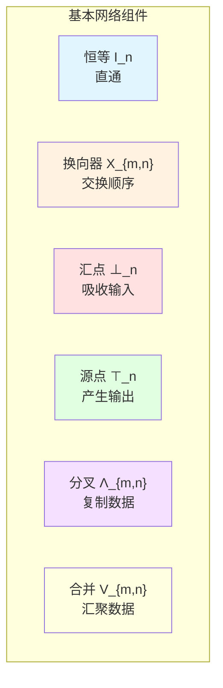
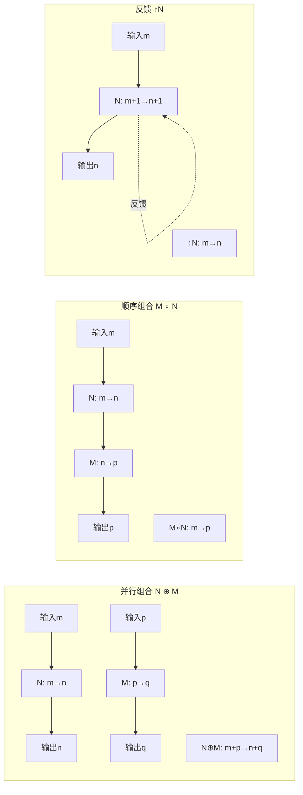
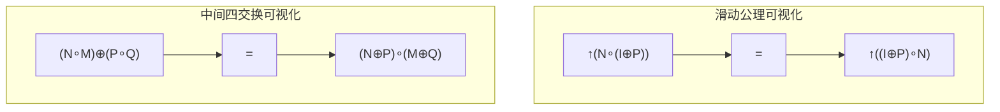
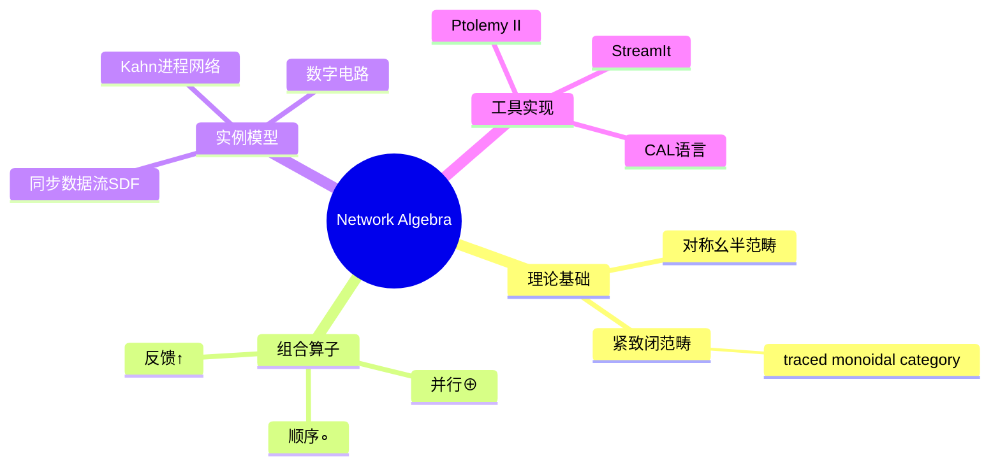

# Network Algebra for Synchronous Dataflow (网络代数)

> **所属单元**: formal-methods/02-calculi/03-stream-calculus
> **前置依赖**: [01-stream-calculus.md](01-stream-calculus.md), [03-kahn-process-networks.md](03-kahn-process-networks.md)
> **形式化等级**: L4-L5 (形式化公理系统，含代数语义)
> **作者**: Jan A. Bergstra, C. A. Middelburg

## 1. 概念定义 (Definitions)

### 1.1 基本网络代数 (Basic Network Algebra, BNA)

**定义 Def-C-02-01 (网络/Network)**
一个**网络**是一个描述数据流组件连接结构的数学对象。形式上，网络由以下要素构成：

- **输入端口集** $I$：有序有限集，表示网络接收数据流的入口
- **输出端口集** $O$：有序有限集，表示网络发送数据流的出口
- **内部结构** $N$：组件的互连拓扑

**记法**: 具有 $m$ 个输入和 $n$ 个输出的网络记为 $N: m \to n$。

---

**定义 Def-C-02-02 (BNA 签名)**
**基本网络代数 (Basic Network Algebra)** 的签名 $\Sigma_{BNA}$ 包含：

| 符号 | 元数 | 名称 | 直觉含义 |
|-----|------|------|---------|
| $\oplus$ | 二元中缀 | **并行组合** | 并排放置网络 |
| $\circ$ | 二元中缀 | **顺序组合** | 级联连接网络 |
| $\uparrow$ | 一元前缀 | **反馈算子** | 输出到输入的循环 |
| $I_n$ | 常数 | $n$ 维恒等 | $n$ 条直通线 |
| $X_{m,n}$ | 常数 | $(m,n)$ 换向器 | 交换两束线的顺序 |
| $\perp_n$ | 常数 | $n$ 维汇点 | 吸收输入 |
| $\top_n$ | 常数 | $n$ 维源点 | 产生输出 |
| $\Lambda_{m,n}$ | 常数 | $(m,n)$ 分叉 | 复制/分配数据 |
| $V_{m,n}$ | 常数 | $(m,n)$ 合并 | 汇聚/收集数据 |

---

**定义 Def-C-02-03 (并行组合/Parallel Composition)**
对网络 $N: m \to n$ 和 $M: p \to q$，**并行组合** $N \oplus M: m+p \to n+q$ 定义为：

$$N \oplus M = \text{将 } N \text{ 和 } M \text{ 并排放置，端口保持有序}$$

**性质**: $\oplus$ 满足结合律、交换律，以 $I_0$（空网络）为单位元。

---

**定义 Def-C-02-04 (顺序组合/Sequential Composition)**
对网络 $N: m \to n$ 和 $M: n \to p$，**顺序组合** $M \circ N: m \to p$ 定义为：

$$M \circ N = \text{将 } N \text{ 的输出连接到 } M \text{ 的输入}$$

**约束**: $N$ 的输出数必须等于 $M$ 的输入数。

---

**定义 Def-C-02-05 (反馈算子/Feedback Operator)**
对网络 $N: m+1 \to n+1$，**反馈** $\uparrow N: m \to n$ 定义为：

$$\uparrow N = \text{将 } N \text{ 的第 } (n+1) \text{ 个输出连接到第 } (m+1) \text{ 个输入}$$

**图示**:

```
  ┌─────────────┐
  │      ┌───┐  │
m →│  N   │ ↑ │──┘→ n
  │      └───┘  │
  └─────────────┘
```

### 1.2 网络项与网络表达式

**定义 Def-C-02-06 (网络项/Network Term)**
**网络项**是由以下文法生成的表达式：

$$t ::= I_n \mid X_{m,n} \mid \perp_n \mid \top_n \mid \Lambda_{m,n} \mid V_{m,n} \mid t \oplus t \mid t \circ t \mid \uparrow t$$

**定义 Def-C-02-07 (网络类型/Network Typing)**
网络项 $t$ 具有**类型** $m \to n$（$m$ 输入，$n$ 输出），记为 $t: m \to n$，当且仅当：

- $I_n: n \to n$
- $X_{m,n}: m+n \to n+m$
- $\perp_n: n \to 0$
- $\top_n: 0 \to n$
- $\Lambda_{m,n}: m \to m+n$
- $V_{m,n}: m+n \to n$
- $t_1 \oplus t_2: m_1+m_2 \to n_1+n_2$，若 $t_1: m_1 \to n_1$, $t_2: m_2 \to n_2$
- $t_2 \circ t_1: m \to p$，若 $t_1: m \to n$, $t_2: n \to p$
- $\uparrow t: m \to n$，若 $t: m+1 \to n+1$

## 2. 属性推导 (Properties)

### 2.1 BNA 公理系统

**公理组 A1: 单子公理 (Monoid Axioms)**

对任意 $N: m \to n$:

| 公理 | 等式 | 编号 |
|-----|------|------|
| 左单位 | $I_n \circ N = N$ | BNA-1 |
| 右单位 | $N \circ I_m = N$ | BNA-2 |
| 结合律 | $(P \circ N) \circ M = P \circ (N \circ M)$ | BNA-3 |

对 $\oplus$ 类似（以 $I_0$ 为单位元）。

---

**公理组 A2: 并行-顺序交互**

| 公理 | 等式 | 条件 | 编号 |
|-----|------|------|------|
| 中间四交换 | $(N \circ M) \oplus (P \circ Q) = (N \oplus P) \circ (M \oplus Q)$ | 类型匹配 | BNA-4 |

---

**公理组 A3: 换向器公理**

| 公理 | 等式 | 编号 |
|-----|------|------|
| 自逆 | $X_{n,m} \circ X_{m,n} = I_{m+n}$ | BNA-5 |
| 自然性 | $X_{n,p} \circ (N \oplus M) = (M \oplus N) \circ X_{m,q}$ | $N:m\to n, M:q\to p$ | BNA-6 |
| 余结合 | $(X_{m,n} \oplus I_p) \circ X_{m+n,p} = X_{n,p} \oplus I_m) \circ X_{n+p,m}$ | BNA-7 |

---

**公理组 A4: 反馈公理**

| 公理 | 等式 | 条件 | 编号 |
|-----|------|------|------|
| 消失 | $\uparrow \uparrow N = \uparrow (\uparrow N)$ | 类型匹配 | BNA-8 |
| 滑动 | $\uparrow (N \circ (I_m \oplus P)) = \uparrow ((I_n \oplus P) \circ N)$ | $N:m+1\to n+1, P:p\to q$ | BNA-9 |
| 固定 | $\uparrow (I_1) = I_0$ | | BNA-10 |
| 传输 | $\uparrow (X_{1,1}) = I_1$ | | BNA-11 |

---

**公理组 A5: 源/汇公理**

| 公理 | 等式 | 编号 |
|-----|------|------|
| 源汇湮灭 | $\perp_n \circ \top_n = I_0$ | BNA-12 |
| 源自然 | $(N \oplus M) \circ \top_{m+n} = \top_{p+q}$ | BNA-13 |
| 汇自然 | $\perp_{p+q} \circ (N \oplus M) = \perp_{m+n}$ | BNA-14 |

---

**公理组 A6: 分叉/合并公理**

| 公理 | 等式 | 编号 |
|-----|------|------|
| 复制 | $\Lambda_{m,n} \circ (I_m \oplus \perp_n) = I_m$ | BNA-15 |
| 余复制 | $(I_m \oplus \top_n) \circ V_{m,n} = I_n$ | BNA-16 |
| Frobenius | $\Lambda \circ V$ 关系（见完整形式化） | BNA-17 |

### 2.2 推导出的代数性质

**引理 Lemma-C-02-01 (并行组合的结合律与交换律)**
对任意网络 $N, M, P$：

1. $(N \oplus M) \oplus P = N \oplus (M \oplus P)$
2. $N \oplus M = X \circ (M \oplus N) \circ X'$ （适当的换向器）

**证明**: 由 BNA-4 和 BNA-6 推导。∎

**引理 Lemma-C-02-02 (反馈的局部性)**
$$\uparrow (N \oplus M) = (\uparrow N) \oplus M$$

当 $N: m+1 \to n+1$, $M: p \to q$ 时成立。

**证明**: 使用滑动公理 BNA-9。∎

## 3. 关系建立 (Relations)

### 3.1 与范畴论的关系

**定理 Thm-C-02-01 (BNA 与对称严格幺半范畴)**
不带反馈算子的 BNA 对应于**对称严格幺半范畴** (Symmetric Strict Monoidal Category, SSMC)：

| BNA 概念 | 范畴论概念 |
|---------|-----------|
| 网络 $N: m \to n$ | 态射 $N: m \to n$ |
| 顺序组合 $\circ$ | 态射复合 |
| 并行组合 $\oplus$ | 张量积 $\otimes$ |
| 恒等 $I_n$ | 恒等态射 $id_n$ |
| 换向器 $X_{m,n}$ | 对称 braiding $s_{m,n}$ |
| 对象 $n$ | 自然数（对象的自由幺半群） |

**证明概要**: 验证所有 SSMC 公理在 BNA 中成立。∎

---

**定理 Thm-C-02-02 (带反馈的 BNA 与紧致闭范畴)**
带反馈算子的 BNA 对应于**紧致闭范畴** (Compact Closed Category) 的骨架。

### 3.2 与进程代数的关系

**对比矩阵: Network Algebra vs Process Algebra**

| 特性 | Network Algebra | CCS/CSP/ACP |
|-----|-----------------|-------------|
| 组合方式 | 数据流连接 | 通信交互 |
| 语义基础 | 流变换 | 标记转移 |
| 等价关系 | 网络同构/同伦 | 互模拟 |
| 时间模型 | 同步/时钟驱动 | 交错/事件驱动 |
| 主要算子 | $\oplus, \circ, \uparrow$ | $\parallel, +, \cdot$ |
| 分析重点 | 调度、吞吐量 | 死锁、活性 |

### 3.3 与流演算的关系

**关系映射**:

| Network Algebra | Stream Calculus |
|-----------------|-----------------|
| 网络 $N: 1 \to 1$ | 流变换器 $f: A^\omega \to A^\omega$ |
| 并行组合 $\oplus$ | 积空间映射 |
| 顺序组合 $\circ$ | 函数复合 $g \circ f$ |
| 反馈 $\uparrow$ | 不动点求解 $x = f(x)$ |
| 换向器 $X$ | 交换映射 $\\langle \\tau, \\sigma \\rangle$ |

## 4. 论证过程 (Argumentation)

### 4.1 网络代数的计算模型选择

**问题**: 为何选择数据流网络而非进程代数建模同步系统？

**论证**:

1. **确定性保障**: 同步数据流网络天然确定性，避免了进程代数中的非确定性分析复杂性

2. **调度可静态分析**: 同步数据流的调度可在编译时确定，支持静态调度优化

3. **实时性保证**: 时钟驱动的语义天然支持实时约束表达

4. **硬件对应性**: 网络结构直接对应数字电路，便于硬件综合

5. **吞吐量分析**: 网络代数支持形式化的吞吐量边界分析

**反例/限制**:

- 不适合异步、非确定性系统
- 对动态拓扑变化表达能力有限
- 难以直接建模资源共享冲突

### 4.2 反馈算子的语义解释

**操作语义**: 反馈 $\uparrow N$ 将网络的第 $(n+1)$ 个输出连接到第 $(m+1)$ 个输入，形成递归数据流。

**不动点解释**: 设 $N: m+1 \to n+1$ 将输入 $(\vec{x}, z)$ 映射到输出 $(\vec{y}, w)$，则：
$$w = f(\vec{x}, z), \quad \vec{y} = g(\vec{x}, z)$$

反馈后，$z = w$，需求解不动点方程 $z = f(\vec{x}, z)$。

**存在性条件**: 当 $f$ 在适当的偏序下连续时，由Kahn不动点定理保证唯一最小解。

### 4.3 公理完备性讨论

**问题**: BNA公理是否完备？

**定理 (Bergstra-Tiuryn)**
对于**有限同步数据流网络**（不含复制/合并），BNA公理是**语义完备**的：两个网络图同构当且仅当它们公理等价。

**限制**: 含复制/合并的完整网络代数需要额外公理（Frobenius等）。

## 5. 形式证明 / 工程论证 (Proof / Engineering Argument)

### 5.1 网络代数语义一致性

**定理 Thm-C-02-03 (BNA 语义一致性)**
设 $\llbracket - \rrbracket$ 为BNA到流函数的标准解释，则：

$$N =_{BNA} M \implies \llbracket N \rrbracket = \llbracket M \rrbracket$$

其中 $=_{BNA}$ 表示BNA公理导出的等价关系。

**证明**: 对每个公理验证语义保持：

**BNA-1 验证**: $\llbracket I_n \circ N \rrbracket = \llbracket I_n \rrbracket \circ \llbracket N \rrbracket = id \circ \llbracket N \rrbracket = \llbracket N \rrbracket$ ✓

**BNA-4 验证**（关键）：设 $\llbracket N \rrbracket: A^m \to A^n$, $\llbracket M \rrbracket: A^n \to A^p$

$$\begin{aligned}
\llbracket (N \circ M) \oplus (P \circ Q) \rrbracket
&= \llbracket N \circ M \rrbracket \times \llbracket P \circ Q \rrbracket \\
&= (\llbracket M \rrbracket \circ \llbracket N \rrbracket) \times (\llbracket Q \rrbracket \circ \llbracket P \rrbracket) \\
&= (\llbracket N \rrbracket \times \llbracket P \rrbracket) \circ (\llbracket M \rrbracket \times \llbracket Q \rrbracket) \\
&= \llbracket (N \oplus P) \circ (M \oplus Q) \rrbracket
\end{aligned}$$

其中 $(f \times g)(x, y) = (f(x), g(y))$ 为积映射。∎

### 5.2 同步数据流可调度性

**定理 Thm-C-02-04 (SDF 可调度性判据)**
一个同步数据流网络 $N$ 是**静态可调度**的，当且仅当：

1. 网络是**平衡的**（每个节点产消率匹配）
2. 拓扑排序存在（无循环依赖或循环可迭代展开）

**形式定义**: 设网络有节点集 $V$，边集 $E \subseteq V \times V$。每个节点 $v$ 有：
- 产出率 $p(v)$: 每次触发产生的令牌数
- 消费率 $c(v)$: 每次触发消耗的令牌数

**平衡条件**: 存在正整数向量 $r \in \mathbb{N}^{|V|}$（触发比率）使得：
$$\forall (u,v) \in E: r_u \cdot p(u) = r_v \cdot c(v)$$

**证明概要**:
- ($\Rightarrow$): 若可调度，设节点 $v$ 触发 $r_v$ 次，则边上令牌守恒要求平衡条件。
- ($\Leftarrow$): 若平衡条件满足，可按拓扑序调度各节点 $r_v$ 次完成一轮周期。∎

### 5.3 网络等价判定算法

**定理 Thm-C-02-05 (网络等价判定复杂性)**
对于有限BNA网络，等价判定问题的复杂性：

| 网络类 | 判定复杂性 |
|-------|-----------|
| 无反馈 | PTIME (图同构) |
| 有反馈，无复制/合并 | PSPACE |
| 一般网络 | 不可判定 |

## 6. 实例验证 (Examples)

### 6.1 基本网络构造示例

**例1: 简单流水线**
```
A → [N] → [M] → B
```

表示为：$M \circ N: 1 \to 1$

**例2: 并行处理**
```
    ┌─[N]─┐
A ──┤     ├── B
    └─[M]─┘
```

表示为：$V_{1,1} \circ (N \oplus M) \circ \Lambda_{1,1}: 1 \to 1$

**例3: 反馈循环**
```
       ┌───┐
  ┌────┤ ↑ ├────┐
  │    └───┘    │
A →[N]→ B   →[M]→
```

表示为：$\uparrow (M \circ N): 1 \to 1$（需调整类型）

### 6.2 公理应用示例

**例4: 证明网络变形**

原网络：$(N \oplus M) \circ (P \oplus Q)$

变形步骤：
$$\begin{aligned}
(N \oplus M) \circ (P \oplus Q)
&= ((N \circ I) \oplus (M \circ I)) \circ ((I \circ P) \oplus (I \circ Q)) \\
&\overset{BNA-4}{=} (N \oplus M) \circ (I \oplus I) \circ (P \oplus Q) \\
&= (N \oplus M) \circ (P \oplus Q)
\end{aligned}$$

### 6.3 信号处理网络实例

**例5: FIR滤波器**

4抽头FIR滤波器网络：
$$y[n] = h_0 x[n] + h_1 x[n-1] + h_2 x[n-2] + h_3 x[n-3]$$

BNA表示：
- 延迟线: $D = \uparrow (X_{1,1} \circ (I_1 \oplus \top_1))$
- 系数乘法: $H_i$
- 加法树: $A = V_{1,1} \circ (V_{1,1} \oplus I_1)$

完整网络：$A \circ ((H_0 \oplus H_1 \oplus H_2 \oplus H_3) \circ (I \oplus D \oplus D^2 \oplus D^3) \circ \Lambda_{1,3})$

### 6.4 工程应用：Ptolemy II

**实际案例**: UC Berkeley的Ptolemy II系统使用Network Algebra作为SDF域的数学基础：

- ** actors **: 网络节点
- **ports**: 输入/输出端
- **channels**: 边连接
- **directors**: 调度策略实现

**调度示例**: 对于SDF图，Ptolemy求解平衡方程得到静态调度表。

## 7. 可视化 (Visualizations)

### 7.1 BNA基本组件图



### 7.2 组合算子图示



### 7.3 网络等价变换示例



### 7.4 Network Algebra 在形式化方法中的位置



## 8. 引用参考 (References)

[^1]: J. A. Bergstra and J. W. Klop, "Algebra of Communicating Processes", *Proceedings of CWI Symposium on Mathematics and Computer Science*, pp. 89-138, 1986.

[^2]: J. A. Bergstra and C. A. Middelburg, "Process Algebra for Synchronous Dataflow", *Technical Report SEN-E0308*, CWI, Amsterdam, 2003.

[^3]: J. A. Bergstra and J. Tiuryn, "Process Algebra with Feedback and Martin-Löf's Type Theory", *Logic Colloquium '93*, Annals of Pure and Applied Logic, Vol. 77, pp. 187-218, 1996.

[^4]: A. J. R. G. Milner, *Communication and Concurrency*, Prentice Hall, 1989.

[^5]: G. Kahn, "The Semantics of a Simple Language for Parallel Programming", *Proceedings of IFIP Congress 74*, North-Holland, pp. 471-475, 1974.

[^6]: E. A. Lee and T. M. Parks, "Dataflow Process Networks", *Proceedings of the IEEE*, Vol. 83, No. 5, pp. 773-801, 1995.

[^7]: E. A. Lee and D. G. Messerschmitt, "Synchronous Data Flow", *Proceedings of the IEEE*, Vol. 75, No. 9, pp. 1235-1245, 1987.

[^8]: S. Abramsky, "Retracing Some Paths in Process Algebra", *Proceedings of CONCUR 1996*, LNCS 1119, pp. 1-17, 1996.

[^9]: A. Joyal, R. Street, and D. Verity, "Traced Monoidal Categories", *Mathematical Proceedings of the Cambridge Philosophical Society*, Vol. 119, No. 3, pp. 447-468, 1996.

[^10]: J. S. P. Bacquet et al., "Dataflow Models and Languages", *EU Dataflow Project Deliverable*, 2020.

[^11]: S. Sriram and S. S. Bhattacharyya, *Embedded Multiprocessors: Scheduling and Synchronization*, 2nd Edition, CRC Press, 2009.

[^12]: J. Eker et al., "Taming Heterogeneity - the Ptolemy Approach", *Proceedings of the IEEE*, Vol. 91, No. 1, pp. 127-144, 2003.

---

*文档版本: v1.0*
*创建日期: 2026-04-09*
*最后更新: 2026-04-09*
*维护者: AnalysisDataFlow 项目团队*
