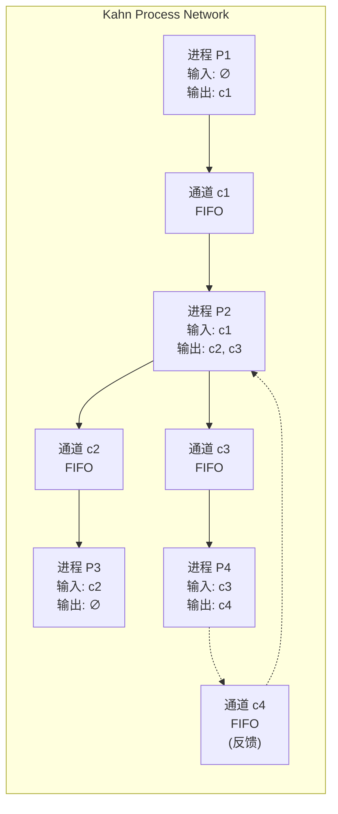
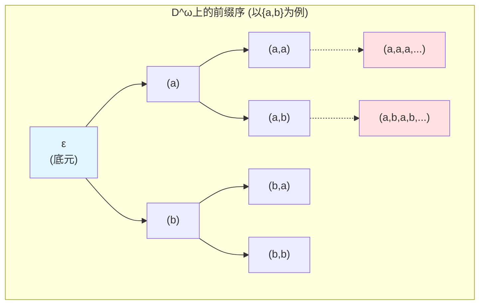
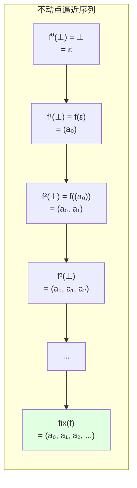
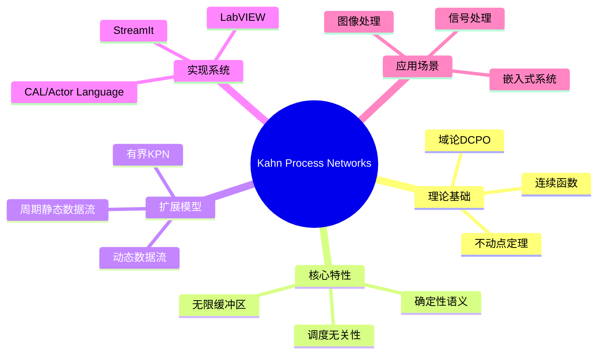

# Kahn Process Networks (Kahn进程网)

> **所属单元**: formal-methods/02-calculi/03-stream-calculus
> **前置依赖**: [01-domain-theory.md](../../01-foundations/01-domain-theory.md), [01-stream-calculus.md](01-stream-calculus.md)
> **形式化等级**: L5 (严格形式化，含不动点语义)
> **作者**: Gilles Kahn (1974)

## 1. 概念定义 (Definitions)

### 1.1 Kahn进程网的基本结构

**定义 Def-C-03-01 (Kahn进程网络/KPN)**
一个**Kahn进程网络**是一个四元组 $\mathcal{K} = (P, C, M, F)$，其中：

- $P = \{p_1, p_2, \ldots, p_n\}$：有限进程集合
- $C = \{c_1, c_2, \ldots, c_m\}$：有限有界通道集合
- $M: C \to (P \times \mathbb{N}) \cup (\mathbb{N} \times P)$：通道端点映射（源→目标）
- $F = \{f_1, f_2, \ldots, f_n\}$：进程语义函数集合

**网络拓扑**: KPN构成一个有向图 $G = (P \cup C, E)$，其中边 $E$ 由通道连接关系决定。

---

**定义 Def-C-03-02 (通道/Channel)**
通道 $c$ 是**先进先出** (FIFO) 的无限缓冲区，支持两种原子操作：

- **写入** $\text{put}(c, v)$: 将值 $v$ 追加到通道尾部
- **读取** $\text{get}(c)$: 从通道头部阻塞式读取值

**关键约束**: 读取操作在通道非空前阻塞，写入操作永不阻塞（假设无限缓冲区）。

---

**定义 Def-C-03-03 (进程/Process)**
进程 $p_i$ 是一个**顺序程序**，通过其输入/输出通道与网络交互。进程 $p$ 的**接口**是 $(I_p, O_p)$ 对：

- $I_p \subseteq C$: 输入通道集
- $O_p \subseteq C$: 输出通道集
- $I_p \cap O_p = \emptyset$

### 1.2 形式语义域

**定义 Def-C-03-04 (数据流域 $D^\omega$)**
设 $D$ 为**数据域**（值的集合），定义**有限和无限序列集合**：

$$D^\omega = D^* \cup D^\infty$$

其中：

- $D^* = \bigcup_{n \geq 0} D^n$: 有限序列（含空序列 $\epsilon$）
- $D^\infty = D^{\mathbb{N}}$: 无限序列

---

**定义 Def-C-03-05 (前缀序 $\sqsubseteq$/Prefix Order)**
在 $D^\omega$ 上定义**信息序** (information ordering)：

$$s \sqsubseteq t \iff \exists u \in D^\omega. s \cdot u = t$$

其中 $s \cdot u$ 表示序列连接。

**直观**: $s \sqsubseteq t$ 意味着 $s$ 是 $t$ 的前缀，$t$ 包含至少与 $s$ 相同的信息。

---

**定义 Def-C-03-06 (升链与有向集)**

- **升链** (ascending chain)：序列 $\{s_i\}_{i \in \mathbb{N}}$ 满足 $s_0 \sqsubseteq s_1 \sqsubseteq s_2 \sqsubseteq \cdots$
- **有向集** (directed set)：任意两元素有上界的集合

**定义 Def-C-03-07 (CPO与DCPO)**

- **完全偏序** (Complete Partial Order, CPO): 含最小元 $\bot$ 且所有升链有上确界的偏序
- **有向完全偏序** (Directed-Complete Partial Order, DCPO): 所有有向集有上确界的偏序

**定理**: $(D^\omega, \sqsubseteq)$ 是DCPO，以 $\epsilon$（空序列）为最小元。

### 1.3 连续性

**定义 Def-C-03-08 (单调函数/Monotonic Function)**
函数 $f: D^\omega \to D^\omega$ 是**单调的**，当：

$$s \sqsubseteq t \implies f(s) \sqsubseteq f(t)$$

---

**定义 Def-C-03-09 (连续函数/Continuous Function)**
函数 $f: D^\omega \to D^\omega$ 是**连续的**，当：

1. $f$ 是单调的
2. 对所有升链 $\{s_i\}$：$f(\bigsqcup_{i} s_i) = \bigsqcup_{i} f(s_i)$

其中 $\bigsqcup$ 表示上确界 (least upper bound)。

**直观**: 连续性保证无限计算可由有限逼近的极限得到。

---

**定义 Def-C-03-10 (逐点扩展)**
设 $f: D \to D$ 为函数，定义其**逐点扩展**到 $D^\omega$：

$$\hat{f}(s) = (f(s_0), f(s_1), f(s_2), \ldots)$$

**引理**: 若 $f: D \to D$ 是全函数，则 $\hat{f}: D^\omega \to D^\omega$ 是连续的。

## 2. 属性推导 (Properties)

### 2.1 前缀序的基本性质

**引理 Lemma-C-03-01 (前缀序是偏序)**
$(D^\omega, \sqsubseteq)$ 满足：

1. **自反性**: $\forall s. s \sqsubseteq s$
2. **反对称性**: $s \sqsubseteq t \land t \sqsubseteq s \implies s = t$
3. **传递性**: $s \sqsubseteq t \land t \sqsubseteq u \implies s \sqsubseteq u$

**证明**: 由序列连接的定义直接可得。∎

---

**引理 Lemma-C-03-02 (DCPO结构)**
$(D^\omega, \sqsubseteq, \epsilon)$ 是含底的DCPO。

**证明**:

- **最小元**: $\epsilon \sqsubseteq s$ 对所有 $s$ 成立
- **有向完备**: 设 $S$ 是有向集，定义 $t$ 为所有有限前缀的并：
  $$t(n) = s(n) \text{ 对某个 } s \in S \text{ 满足 } |s| > n$$
  由有向性保证良定义，且 $t = \bigsqcup S$。∎

### 2.2 连续函数的性质

**引理 Lemma-C-03-03 (连续函数复合)**
若 $f, g: D^\omega \to D^\omega$ 连续，则 $g \circ f$ 连续。

**证明**:

- 单调性：$s \sqsubseteq t \implies f(s) \sqsubseteq f(t) \implies g(f(s)) \sqsubseteq g(f(t))$
- 连续性：$g(f(\bigsqcup s_i)) = g(\bigsqcup f(s_i)) = \bigsqcup g(f(s_i))$ ∎

---

**引理 Lemma-C-03-04 (积与和的连续性)**
若 $f, g$ 连续，则：

1. $\langle f, g \rangle: x \mapsto (f(x), g(x))$ 连续
2. $[f, g]: (b, x) \mapsto \text{if } b \text{ then } f(x) \text{ else } g(x)$ 连续（适当条件下）

### 2.3 KPN语义的确定性

**引理 Lemma-C-03-05 (KPN语义函数连续性)**
每个Kahn进程的语义函数 $f_p: (D^\omega)^{|I_p|} \to (D^\omega)^{|O_p|}$ 是连续的。

**证明概要**:

- 进程按顺序读取输入，生成输出
- 读取操作对应前缀检测（单调）
- 输出生成对应序列扩展（连续）∎

## 3. 关系建立 (Relations)

### 3.1 与数据流网络的关系

**关系映射表**:

| KPN概念 | 数据流网络对应 |
|--------|--------------|
| 进程 | Actor/节点 |
| FIFO通道 | 有界/无限缓冲区 |
| 阻塞读取 | 数据驱动触发 |
| 无限缓冲区 | 解耦生产消费 |
| 确定性语义 | 调度无关性 |

**关键区别**:

| 特性 | KPN | SDF (同步数据流) |
|-----|-----|-----------------|
| 缓冲区 | 无限（抽象） | 有限（实际） |
| 触发 | 数据驱动 | 时钟驱动 |
| 调度 | 任意有效调度等价 | 静态调度 |
| 表达能力 | 图灵完备 | 有限状态 |

### 3.2 与进程代数的关系

**对比分析**:

| 特性 | KPN | CCS/CSP |
|-----|-----|---------|
| 通信模型 | 异步消息传递 | 同步握手 |
| 确定性 | 完全确定 | 可能非确定 |
| 时间模型 | 无时戳 | 可能含时间 |
| 语义基础 | 不动点/域论 | 标记转移 |
| 组合方式 | 图连接 | 算子组合 |

### 3.3 与流演算的关系

**定理 Thm-C-03-06 (KPN到流变换的映射)**
每个KPN $\mathcal{K}$ 对应唯一的流变换函数 $F_{\mathcal{K}}: (D^\omega)^m \to (D^\omega)^n$，其中 $m$ 为网络输入数，$n$ 为输出数。

**构造方法**: 将网络视为相互递归的流方程组，求解不动点。

## 4. 论证过程 (Argumentation)

### 4.1 为何选择无限缓冲区模型？

**论证**:

1. **语义简洁性**: 无限缓冲区消除了死锁分析的复杂性，专注于功能语义
2. **确定性保证**: 读写顺序由数据可用性决定，与执行速度无关
3. **延迟隐藏**: 生产者-消费者解耦，允许异步执行
4. **实现可逼近**: 实际系统可用有限缓冲区+反压机制逼近KPN语义

**反例/限制**:

- 内存无限假设不现实
- 需要额外机制处理缓冲区溢出
- 实时约束难以直接表达

### 4.2 调度无关性的意义

**核心定理**: KPN的语义与调度策略无关——任何满足数据依赖的调度产生相同结果。

**工程意义**:

1. **并行性提取**: 自动识别可并行执行的进程
2. **优化自由度**: 调度器可针对吞吐量、延迟、能耗优化
3. **可移植性**: 代码在不同并行架构上行为一致

**对比**: 一般并发程序（如多线程）的结果可能依赖于调度顺序。

### 4.3 从KPN到实现的逼近

**实现策略层次**:

```
KPN (无限缓冲区)
    ↓ 抽象细化
带反压的KPN (有限缓冲区+阻塞写入)
    ↓ 调度策略
静态调度数据流 (SDF, CSDF)
    ↓ 代码生成
特定平台实现 (多线程/FPGA/DSP)
```

**保真度**: 每层保持上层的功能语义，增加实现约束。

## 5. 形式证明 / 工程论证 (Proof / Engineering Argument)

### 5.1 Kahn不动点定理

**定理 Thm-C-03-07 (Kahn Fixpoint Theorem, 1974)**
设 $D$ 是含底元 $\bot$ 的DCPO，$f: D \to D$ 是连续函数，则：

1. $f$ 有**最小不动点** $\text{fix}(f) = \bigsqcup_{n \geq 0} f^n(\bot)$
2. 该不动点是**最小前不动点**: $\forall x. f(x) \sqsubseteq x \implies \text{fix}(f) \sqsubseteq x$

**证明**:

**步骤1**: 构造升链 $\{\bot, f(\bot), f^2(\bot), \ldots\}$

由单调性：

- $\bot \sqsubseteq f(\bot)$（$\bot$ 是最小元）
- 归纳：若 $f^n(\bot) \sqsubseteq f^{n+1}(\bot)$，则 $f^{n+1}(\bot) \sqsubseteq f^{n+2}(\bot)$（单调性）

因此 $\{f^n(\bot)\}$ 是升链。

**步骤2**: 定义 $x^* = \bigsqcup_{n \geq 0} f^n(\bot)$，证其为不动点

$$\begin{aligned}
f(x^*) &= f(\bigsqcup_{n} f^n(\bot)) \\
&= \bigsqcup_{n} f(f^n(\bot)) \quad \text{(连续性)} \\
&= \bigsqcup_{n} f^{n+1}(\bot) \\
&= \bigsqcup_{n} f^n(\bot) = x^*
\end{aligned}$$

**步骤3**: 证最小性

设 $f(x) \sqsubseteq x$，证 $x^* \sqsubseteq x$：
- $\bot \sqsubseteq x$
- 归纳：若 $f^n(\bot) \sqsubseteq x$，则 $f^{n+1}(\bot) = f(f^n(\bot)) \sqsubseteq f(x) \sqsubseteq x$
- 因此所有 $f^n(\bot) \sqsubseteq x$，故 $x^* = \bigsqcup f^n(\bot) \sqsubseteq x$

∎

---

**推论 Cor-C-03-01 (KPN语义良定义性)**
每个Kahn进程网络有唯一的**最小语义**（关于前缀序），由Kahn不动点定理保证。

**证明概要**: 将网络编码为流变换的方程组，对应连续函数的不动点。∎

### 5.2 多变量不动点定理

**定理 Thm-C-03-08 (Simultaneous Fixpoints)**
设 $f_1, \ldots, f_n: (D^\omega)^n \to D^\omega$ 连续，则方程组：

$$\begin{cases}
x_1 = f_1(x_1, \ldots, x_n) \\
x_2 = f_2(x_1, \ldots, x_n) \\
\vdots \\
x_n = f_n(x_1, \ldots, x_n)
\end{cases}$$

有唯一最小解 $(x_1^*, \ldots, x_n^*) \in (D^\omega)^n$。

**证明**: 定义积空间上的函数 $F(\vec{x}) = (f_1(\vec{x}), \ldots, f_n(\vec{x}))$，应用Kahn定理。∎

### 5.3 调度无关性的形式证明

**定理 Thm-C-03-09 (Scheduling Independence)**
设 $\mathcal{K}$ 是KPN，$S_1, S_2$ 是两个**有效调度**（始终满足数据依赖），则它们产生的输出序列相同。

**证明概要**:
1. 将调度视为进程执行的交错序列
2. 每个调度对应不动点计算的一种逼近序列
3. 由连续性，所有有效调度的极限相同
4. 因此最终输出相同 ∎

## 6. 实例验证 (Examples)

### 6.1 基本KPN构造

**例1: 简单流水线**
```
[A] --c1--> [B] --c2--> [C]
```

进程语义：
- A: 无限产生序列 $(0, 1, 2, 3, \ldots)$ 到 $c_1$
- B: 从 $c_1$ 读取 $x$，输出 $x^2$ 到 $c_2$
- C: 从 $c_2$ 读取并打印

**流方程**:
$$\begin{aligned}
c_1 &= (0, 1, 2, 3, \ldots) \\
c_2 &= \text{map}(\lambda x. x^2, c_1) = (0, 1, 4, 9, \ldots)
\end{aligned}$$

---

**例2: 反馈循环**
```
      ┌---c2---┐
      │        ↓
[A] --c1--> [B] --c3--> [C]
      ↑        |
      └---c4---┘
```

B进程: 从 $c_1$ 和 $c_4$ 读取，输出到 $c_2$ 和 $c_3$

**流方程**（设B为加法器）:
$$\begin{aligned}
c_1 &= \text{input} \\
c_4 &= c_2 \quad \text{(反馈)} \\
c_2 &= \text{zipWith}(+, c_1, c_4) \\
c_3 &= c_2
\end{aligned}$$

**不动点求解**:
设 $c_1 = (a_0, a_1, a_2, \ldots)$，则：
$$\begin{aligned}
c_2(0) &= a_0 + 0 = a_0 \\
c_2(1) &= a_1 + c_2(0) = a_1 + a_0 \\
c_2(2) &= a_2 + c_2(1) = a_2 + a_1 + a_0 \\
&\vdots \\
c_2(n) &= \sum_{i=0}^{n} a_i \quad \text{(前缀和)}
\end{aligned}$$

### 6.2 经典KPN示例

**例3: 斐波那契生成器**
```
        ┌---c2---┐
        ↓        │
[Init]--c1-->[Add]--c3-->(输出)
        ↑        │
        └---c4---┘
```

语义：
- Init: 产生 $(0, 1, \ldots)$，即 $c_1 = (0, 1)$
- Add: 从 $c_2$ 和 $c_4$ 读取，求和输出到 $c_3$ 和 $c_2$
- 反馈: $c_4 = c_3$（延迟一个单位）

**不动点**: $c_3 = (0, 1, 1, 2, 3, 5, 8, \ldots) = \text{斐波那契数列}$

---

**例4: 进程合并**
```
[A] --c1-->
          [Merge] --c3--> [C]
[B] --c2-->
```

Merge进程: 交替从 $c_1, c_2$ 读取，合并输出到 $c_3$

**语义**: 若 $c_1 = (a_0, a_1, \ldots)$, $c_2 = (b_0, b_1, \ldots)$，则：
$$c_3 = (a_0, b_0, a_1, b_1, a_2, b_2, \ldots)$$

### 6.3 工程实例：LabVIEW

**实际案例**: National Instruments的LabVIEW使用KPN作为其核心计算模型：

- **VI (Virtual Instrument)**: 对应Kahn进程
- **Wire**: 对应FIFO通道
- **数据流执行**: 节点在输入可用时自动触发

**调度**: LabVIEW运行时自动确定执行顺序，保证KPN语义。

## 7. 可视化 (Visualizations)

### 7.1 KPN结构图



### 7.2 前缀序与DCPO结构



### 7.3 Kahn不动点计算过程



### 7.4 KPN在流计算形式化方法中的位置



## 8. 引用参考 (References)

[^1]: G. Kahn, "The Semantics of a Simple Language for Parallel Programming", *Proceedings of IFIP Congress 74*, North-Holland, pp. 471-475, 1974.

[^2]: G. Kahn and D. B. MacQueen, "Coroutines and Networks of Parallel Processes", *Proceedings of IFIP Congress 77*, North-Holland, pp. 993-998, 1977.

[^3]: E. A. Lee and T. M. Parks, "Dataflow Process Networks", *Proceedings of the IEEE*, Vol. 83, No. 5, pp. 773-801, 1995.

[^4]: G. Berry and G. Gonthier, "The Esterel Synchronous Programming Language: Design, Semantics, Implementation", *Science of Computer Programming*, Vol. 19, No. 2, pp. 87-152, 1992.

[^5]: D. S. Scott, "Continuous Lattices", *Toposes, Algebraic Geometry and Logic*, LNM 274, Springer, pp. 97-136, 1972.

[^6]: B. A. Davey and H. A. Priestley, *Introduction to Lattices and Order*, 2nd Edition, Cambridge University Press, 2002.

[^7]: T. M. Parks, "Bounded Scheduling of Process Networks", Ph.D. Dissertation, EECS Department, University of California, Berkeley, 1995.

[^8]: M. Geilen and T. Basten, "Requirements on the Execution of Kahn Process Networks", *Proceedings of ESOP 2003*, LNCS 2618, pp. 319-334, 2003.

[^9]: H. Nikolov et al., "Efficient Automated Synthesis of Accelerators Using Dataflow Models of Computation", *Proceedings of DAC 2009*, pp. 837-840, 2009.

[^10]: J. Eker and J. W. Janneck, "CAL Language Report: Specification of the CAL Actor Language", *Technical Report UCB/ERL M03/48*, University of California, Berkeley, 2003.

[^11]: W. Thies, M. Karczmarek, and S. Amarasinghe, "StreamIt: A Language for Streaming Applications", *Proceedings of CC 2002*, LNCS 2304, pp. 179-196, 2002.

---

*文档版本: v1.0*
*创建日期: 2026-04-09*
*最后更新: 2026-04-09*
*维护者: AnalysisDataFlow 项目团队*
