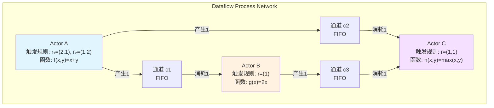
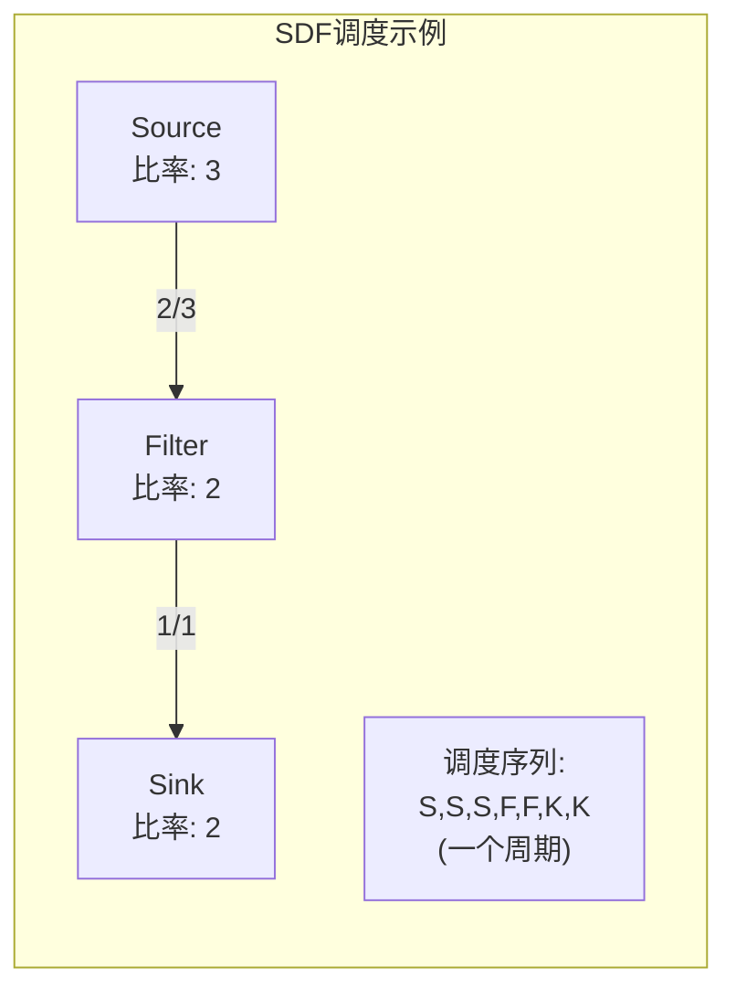
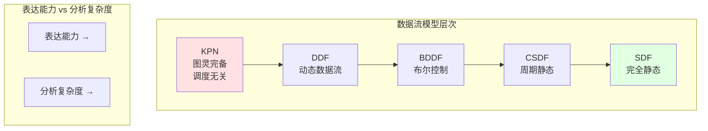
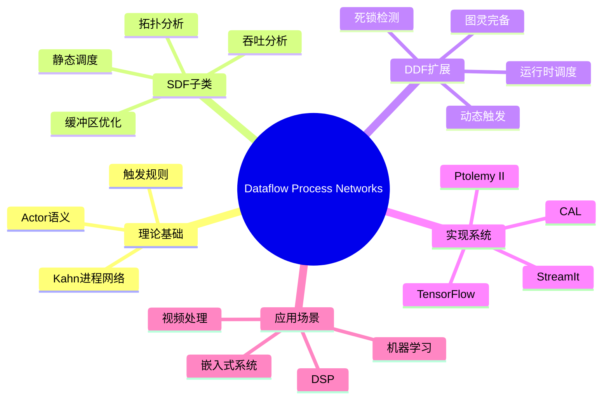

# Dataflow Process Networks (数据流进程网络)

> **所属单元**: formal-methods/02-calculi/03-stream-calculus  
> **前置依赖**: [03-kahn-process-networks.md](03-kahn-process-networks.md), [02-network-algebra.md](02-network-algebra.md)  
> **形式化等级**: L4 (形式化语义，工程导向)  
> **作者**: Edward A. Lee, Thomas M. Parks (1995)

## 1. 概念定义 (Definitions)

### 1.1 Dataflow Process Networks 概述

**定义 Def-C-04-01 (数据流进程网络/Dataflow Process Network, DPN)**  
一个**数据流进程网络**是一个计算模型，其中：
- **进程** (Actor/Process) 通过**单向FIFO通道**通信
- 进程在**输入令牌可用**时触发执行（数据驱动）
- 每次触发读取固定数量的输入令牌，产生固定数量的输出令牌

**DPN = KPN + 触发规则 (Firing Rules)**

---

**定义 Def-C-04-02 (Actor/Actor)**  
**Actor**是DPN的基本计算单元，定义为六元组 $(I, O, R, f, \tau, \sigma)$：
- $I = \{i_1, \ldots, i_m\}$: 输入端口集合
- $O = \{o_1, \ldots, o_n\}$: 输出端口集合
- $R \subseteq \mathbb{N}^m$: **触发模式集合** (firing rules)
- $f: D^{|r|} \to D^{|p|}$: **触发函数** (firing function)
- $\tau: R \to \mathbb{N}^m$: 每次触发消耗的令牌数
- $\sigma: R \to \mathbb{N}^n$: 每次触发产生的令牌数

---

**定义 Def-C-04-03 (触发规则/Firing Rule)**  
对于具有 $m$ 个输入的Actor，**触发规则**是一个 $m$ 元组 $r = (r_1, r_2, \ldots, r_m)$，其中：
- $r_i \in \mathbb{N} \cup \{*\}$
- $r_i \in \mathbb{N}$: 第 $i$ 个输入端口需要至少 $r_i$ 个可用令牌
- $r_i = *$: 不关心（通配符）

**触发条件**: Actor可以触发当且仅当：
$$\forall i. \text{available}(i) \geq r_i \text{ (若 } r_i \neq *)$$

---

**定义 Def-C-04-04 (触发/Firing)**  
Actor的**一次触发**是原子执行：
1. **检查**: 验证至少一个触发规则被满足
2. **消耗**: 从各输入端口消耗指定数量的令牌
3. **计算**: 执行触发函数 $f$
4. **产生**: 向各输出端口产生指定数量的令牌

### 1.2 同步数据流 (SDF)

**定义 Def-C-04-05 (同步数据流/Synchronous Dataflow, SDF)**  
**SDF**是DPN的受限形式，其中：
- 每个Actor有**唯一**的触发规则
- 触发时消耗的令牌数固定
- 触发时产生的令牌数固定

**SDF Actor表示**: $(I, O, \tau, \sigma, f)$，其中 $\tau, \sigma$ 是固定向量。

---

**定义 Def-C-04-06 (SDF图/SDF Graph)**  
**SDF图**是六元组 $G = (V, E, \text{src}, \text{dst}, \tau, \sigma)$：
- $V$: Actor顶点集
- $E$: 边集（FIFO通道）
- $\text{src}, \text{dst}: E \to V$: 边的源和目标
- $\tau: E \to \mathbb{N}^+$: 每次触发消耗的令牌数（边的消费率）
- $\sigma: E \to \mathbb{N}^+$: 每次触发产生的令牌数（边的生产率）

**注**: 在SDF图中，边的速率标注在源端（生产率）和目标端（消费率）。

---

**定义 Def-C-04-07 (拓扑矩阵/Topology Matrix)**  
对于SDF图 $G$，**拓扑矩阵** $\Gamma$ 是 $|E| \times |V|$ 矩阵：

$$\Gamma_{e,v} = \begin{cases}
\sigma(e) & \text{if } \text{src}(e) = v \\
-\tau(e) & \text{if } \text{dst}(e) = v \\
0 & \text{otherwise}
\end{cases}$$

**平衡方程**: 寻找向量 $q \in \mathbb{N}^{|V|}$（触发比率）使得：
$$\Gamma^T \cdot q = 0$$

### 1.3 动态数据流 (DDF)

**定义 Def-C-04-08 (动态数据流/Dynamic Dataflow, DDF)**  
**DDF**允许：
- 多个触发规则（非确定性选择）
- 数据依赖的令牌消耗/产生
- 控制依赖的Actor激活

**分类**:
- **Cyclo-Static DDF (CSDF)**: 周期性变化的触发模式
- **Boolean DDF (BDDF)**: 基于布尔值控制的数据流
- **General DDF**: 完全动态，图灵完备

## 2. 属性推导 (Properties)

### 2.1 SDF的可调度性

**引理 Lemma-C-04-01 (SDF可调度必要条件)**  
SDF图 $G$ 可静态调度当且仅当拓扑矩阵 $\Gamma$ 的零空间存在正整数解。

**证明概要**: 
- 每个边 $e$ 上令牌守恒要求：$q_{\text{src}(e)} \cdot \sigma(e) = q_{\text{dst}(e)} \cdot \tau(e)$
- 这正是 $\Gamma^T \cdot q = 0$ 的分量形式 ∎

---

**引理 Lemma-C-04-02 (SDF一致性)**  
设 $q$ 是平衡方程的解，则：
- 所有有效调度中各Actor触发次数之比等于 $q$ 的分量比
- 周期性调度周期为 $\text{lcm}(q_1, q_2, \ldots, q_n)$

### 2.2 有界性分析

**引理 Lemma-C-04-03 (SDF缓冲区有界性)**  
对于一致的SDF图，存在**最小缓冲区大小**使得系统无死锁运行。

**计算方法**: 
- 求解平衡方程得到触发比率 $q$
- 构造周期性调度表
- 模拟一个周期内的缓冲区占用
- 最大占用即为最小缓冲区大小

### 2.3 活性与死锁

**定义 Def-C-04-09 (活性/Liveness)**  
DPN是**活的** (live)，如果：
- 每个Actor可以被无限次触发（在无限输入假设下）
- 无**人工死锁** (artificial deadlock)：缓冲区未满但无Actor可触发

**引理 Lemma-C-04-04 (SDF活性条件)**  
一致的SDF图是活的，当且仅当：
1. 无**真死锁** (true deadlock)：循环依赖无法解开
2. 初始令牌放置正确

## 3. 关系建立 (Relations)

### 3.1 与KPN的关系

**包含关系**:
```
SDF ⊂ CSDF ⊂ BDDF ⊂ DDF ⊂ KPN
```

| 模型 | 触发规则 | 表达能力 | 调度复杂度 |
|-----|---------|---------|-----------|
| SDF | 单一固定 | 有限状态 | 多项式时间 |
| CSDF | 周期变化 | 有限状态 | 多项式时间 |
| BDDF | 布尔控制 | 无限状态 | PSPACE |
| DDF | 完全动态 | 图灵完备 | 不可判定 |
| KPN | 数据可用 | 图灵完备 | 调度无关 |

### 3.2 与工作流 (Workflow) 的对比

**对比表**:

| 特性 | Dataflow Networks | Business Workflow |
|-----|-------------------|-------------------|
| 驱动机制 | 数据可用性 | 事件/状态/人工 |
| 数据传递 | 流式 (连续) | 文档/消息 (离散) |
| 时间模型 | 逻辑时间/无时戳 | 实际时间截止 |
| 异常处理 | 类型系统约束 | 补偿事务 |
| 人员参与 | 无 | 有 |
| 可靠性 | 确定性重放 | 持久化+恢复 |

**工作流模式到数据流的映射**:

| 工作流模式 | 数据流实现 |
|-----------|-----------|
| 顺序 | 流水线连接 |
| 并行分支 | 分叉 (fork) |
| 同步 | 汇合 (join) |
| 选择 | 路由器Actor |
| 迭代 | 反馈循环 |
| 多实例 | 复制Actor |

### 3.3 与Actor模型的关系

**Lee的Actor分类**:

| Actor类型 | 触发条件 | 示例 |
|----------|---------|------|
| **Synchronous** | 所有输入有令牌 | 加法器、乘法器 |
| **Reactive** | 任意输入有令牌 | 合并器、选择器 |
| **Proactive** | 内部状态/时钟 | 源、定时器 |

**与Agha Actor模型的区别**:
- **DPN Actor**: 数据驱动，显式触发规则
- **Agha Actor**: 消息驱动，隐式消息处理

## 4. 论证过程 (Argumentation)

### 4.1 为何需要触发规则？

**问题**: KPN已经提供了确定性语义，为何引入复杂的触发规则？

**论证**:

1. **静态可分析性**: 触发规则允许编译时调度分析，KPN需要运行时调度
2. **资源可预测**: 可预先计算缓冲区需求，KPN可能无限增长
3. **实现效率**: 静态调度消除运行时开销
4. **时序分析**: 可推导吞吐量和延迟边界

**代价**:
- 表达能力下降（SDF不是图灵完备）
- 需要显式建模触发条件
- 某些算法难以直接表达

### 4.2 同步 vs 动态数据流的选择

**SDF适用场景**:
- 数字信号处理 (DSP)
- 图像/视频处理
- 固定速率的控制系统

**DDF适用场景**:
- 数据包处理（变长）
- 压缩/解压缩
- 自适应算法

**混合设计**: 现代系统（如Ptolemy II）支持多域建模，在SDF子图中使用静态调度，在DDF边界使用动态协调。

### 4.3 DPN与数据流编程语言

**代表性语言/框架**:

| 系统 | 模型 | 特点 |
|-----|------|------|
| **StreamIt** | SDF | 数组语言，编译优化 |
| **CAL** | DDF | Actor语言，标准定义 |
| **LabVIEW** | DDF | 图形化编程 |
| **TensorFlow** | DFG | 机器学习计算图 |
| **Apache Flink** | DFG | 分布式流处理 |

**语言设计原则**:
1. **显式数据依赖**: 通过连接表达
2. **无副作用**: Actor纯函数性
3. **可组合性**: 层次化网络构建
4. **类型安全**: 端口类型检查

## 5. 形式证明 / 工程论证 (Proof / Engineering Argument)

### 5.1 SDF可调度性定理

**定理 Thm-C-04-01 (SDF 可调度性判据)**  
设 $G$ 是SDF图，拓扑矩阵为 $\Gamma$，则：

$G$ 存在**无死锁的周期性调度** 当且仅当：
1. $\text{rank}(\Gamma) = |V| - 1$（图强连通时）
2. 存在正整数向量 $q$ 使得 $\Gamma^T \cdot q = 0$

**证明**: 

**($\Rightarrow$)**: 
若存在周期性调度，设各Actor在一个周期内触发次数为 $q$。由周期性，每条边上令牌守恒：
$$q_{\text{src}} \cdot \sigma(e) = q_{\text{dst}} \cdot \tau(e)$$
即 $\Gamma^T \cdot q = 0$。

强连通图的拓扑矩阵秩为 $|V| - 1$，零空间维数为1，解 $q$ 唯一（比例意义）。

**($\Leftarrow$)**: 
若存在正整数解 $q$，构造调度：
1. 计算各边延迟（初始令牌需求）
2. 按拓扑序安排Actor触发
3. 周期性重复

由平衡方程保证缓冲区有界。∎

### 5.2 缓冲区大小最小化

**定理 Thm-C-04-02 (最小缓冲区大小)**  
对于一致的SDF图 $G$ 和调度 $S$，边 $e$ 上的**最大缓冲区占用**为：

$$B_e = \max_{t} \left( \text{produced}_e(t) - \text{consumed}_e(t) + \text{initial}_e \right)$$

其中最大值取遍调度执行的所有时刻 $t$。

**优化问题**: 
$$
\begin{aligned}
\min_{S} \quad & \sum_{e \in E} B_e \\
\text{s.t.} \quad & \text{数据依赖约束} \\
& \text{无死锁约束}
\end{aligned}$$

**复杂性**: 缓冲区最小化是NP难问题。

### 5.3 DDF的图灵完备性

**定理 Thm-C-04-03 (通用DDF图灵完备)**  
带开关(Switch)和选择(Select) Actor的DDF是**图灵完备**的。

**证明概要**: 

构造通用图灵机模拟：

1. **Switch Actor**: 根据控制令牌将输入路由到不同输出
   - 输入: 数据 $d$, 控制 $c$
   - 输出: $T$ (若 $c=\text{true}$), $F$ (若 $c=\text{false}$)

2. **Select Actor**: 根据控制令牌从多个输入选择一个输出
   - 输入: $T$, $F$, 控制 $c$
   - 输出: $T$ (若 $c=\text{true}$), 否则 $F$

3. **组合**: 用Switch和Select实现条件分支和循环
4. **存储**: 用反馈循环实现无限存储

因此可模拟任意图灵机。∎

### 5.4 Actor语义一致性

**定理 Thm-C-04-04 (Actor组合确定性)**  
若所有Actor的触发函数是**纯函数**（无副作用），则DPN的语义仅依赖于网络拓扑和输入序列，与调度无关。

**证明概要**:
- 纯函数性质保证局部确定性
- FIFO通道保证消息顺序
- 数据驱动执行保证因果性
- 由Kahn原理推广到DPN ∎

## 6. 实例验证 (Examples)

### 6.1 SDF图实例

**例1: 简单信号处理链**
```
[Source:10] --2--> [Filter] --1--> [Sink]
              <--3--
```

Actor参数：
- Source: 每次产生2个令牌
- Filter: 每次消耗3个，产生1个
- Sink: 每次消耗1个

**平衡方程**:
$$\begin{cases}
2 \cdot q_{\text{Source}} = 3 \cdot q_{\text{Filter}} \\
1 \cdot q_{\text{Filter}} = 1 \cdot q_{\text{Sink}}
\end{cases}$$

**解**: $q = (3, 2, 2)$，即Source触发3次，Filter和Sink各触发2次。

---

**例2: 多速率采样系统**
```
[Source] --4--> [Decimate:4/1] --1--> [Process] --2--> [Output]
```

Decimate Actor: 4输入→1输出（降采样）

**平衡**: $q_{\text{Source}} : q_{\text{Decimate}} : q_{\text{Process}} = 1 : 4 : 2$

---

**例3: 反馈系统**
```
       ┌---2---┐
       ↓       │
[In]-->[Add]--1-->[Delay]-->[Out]
```

Delay Actor: 初始令牌数 = 1，消耗1产生1

**拓扑矩阵**:
$$\Gamma = \begin{bmatrix} 1 & -1 & 0 \\ 0 & 1 & -1 \\ -2 & 1 & 0 \end{bmatrix}$$

**解**: $q = (1, 1, 1)$，所有Actor每次循环触发1次。

### 6.2 触发规则示例

**例4: 选择器 (Switch)**
```
Input: 数据流
Control: 布尔流
       ┌--True--> Output1
Input--|
       └--False-> Output2
       ↑
    Control
```

**触发规则**: 
- $r_1 = (1, 1)$: 数据和Control各需1个令牌
- 消耗: (1, 1)
- 产生: 根据Control值，向对应输出产生1个令牌

---

**例5: 合并器 (Merge)**
```
Input1 --┐
         [Merge] --> Output
Input2 --┘
```

**触发规则**:
- $r_1 = (1, *)$: Input1有数据
- $r_2 = (*, 1)$: Input2有数据

**非确定性**: 多个规则满足时任选其一。

### 6.3 实际系统实例

**例6: Ptolemy II 中的SDF域**

```java
// SDF Actor 示例 (Java)
public class FIRFilter extends SDFTransformer {
    private double[] coefficients;
    
    @Override
    public void fire() throws IllegalActionException {
        double sum = 0.0;
        for (int i = 0; i < coefficients.length; i++) {
            sum += coefficients[i] * input.get(i);
        }
        output.send(0, sum);
    }
    
    @Override
    public void initialize() {
        // 设置消费/生产率
        input.setTokenConsumptionRate(coefficients.length);
        output.setTokenProductionRate(1);
    }
}
```

**例7: TensorFlow 计算图**

```python
# TensorFlow DFG 示例 (Python)
import tensorflow as tf

# 构建数据流图
a = tf.placeholder(tf.float32)
b = tf.placeholder(tf.float32)
c = tf.add(a, b)  # Actor: Add
d = tf.multiply(c, 2)  # Actor: Mul

# 执行（调度）
session = tf.Session()
result = session.run(d, feed_dict={a: 3.0, b: 4.0})
# result = 14.0
```

## 7. 可视化 (Visualizations)

### 7.1 DPN与Actor模型结构



### 7.2 SDF调度过程可视化



### 7.3 数据流模型层次关系



### 7.4 Dataflow Process Networks 完整架构



## 8. 引用参考 (References)

[^1]: E. A. Lee and T. M. Parks, "Dataflow Process Networks", *Proceedings of the IEEE*, Vol. 83, No. 5, pp. 773-801, 1995.

[^2]: E. A. Lee and D. G. Messerschmitt, "Synchronous Data Flow", *Proceedings of the IEEE*, Vol. 75, No. 9, pp. 1235-1245, 1987.

[^3]: T. M. Parks, "Bounded Scheduling of Process Networks", Ph.D. Dissertation, EECS Department, University of California, Berkeley, 1995.

[^4]: G. Bilsen et al., "Cyclo-Static Dataflow", *IEEE Transactions on Signal Processing*, Vol. 44, No. 2, pp. 397-408, 1996.

[^5]: S. S. Bhattacharyya, P. K. Murthy, and E. A. Lee, *Software Synthesis from Dataflow Graphs*, Kluwer Academic Publishers, 1996.

[^6]: S. Sriram and S. S. Bhattacharyya, *Embedded Multiprocessors: Scheduling and Synchronization*, 2nd Edition, CRC Press, 2009.

[^7]: J. Eker et al., "Taming Heterogeneity - the Ptolemy Approach", *Proceedings of the IEEE*, Vol. 91, No. 1, pp. 127-144, 2003.

[^8]: J. W. Janneck et al., "CAL Language Report", *Technical Report*, University of California, Berkeley, 2003.

[^9]: W. Thies, M. Karczmarek, and S. Amarasinghe, "StreamIt: A Language for Streaming Applications", *Proceedings of CC 2002*, LNCS 2304, pp. 179-196, 2002.

[^10]: G. Agha, *Actors: A Model of Concurrent Computation in Distributed Systems*, MIT Press, 1986.

[^11]: E. A. Lee, "The Problem with Threads", *IEEE Computer*, Vol. 39, No. 5, pp. 33-42, 2006.

[^12]: M. W. Wolf et al., "The ASTROLABE SDF Compiler", *Proceedings of EMSOFT 2018*, pp. 1-10, 2018.

[^13]: M. Geilen and S. Stuijk, "Worst-Case Performance Analysis of Synchronous Dataflow Scenarios", *Proceedings of CODES+ISSS 2010*, pp. 305-314, 2010.

---

*文档版本: v1.0*  
*创建日期: 2026-04-09*  
*最后更新: 2026-04-09*  
*维护者: AnalysisDataFlow 项目团队*
