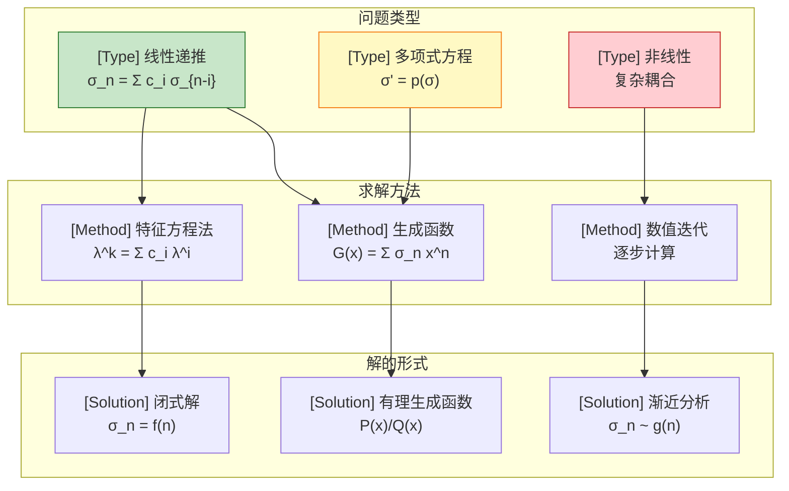
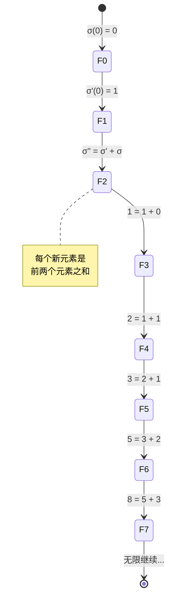
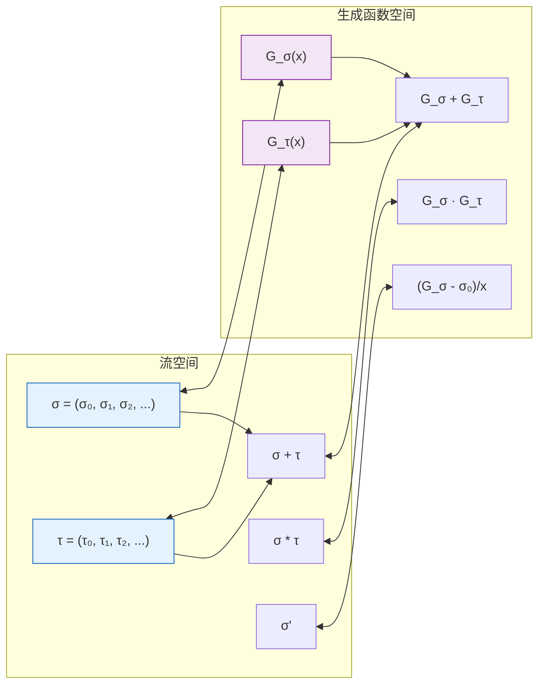

# 流方程求解 (Stream Equation Solving)

> 所属阶段: Struct | 前置依赖: [Unified Streaming Theory](../../../USTM-F-Reconstruction/archive/original-struct/01-foundation/01.01-unified-streaming-theory.md) | 形式化等级: L3-L4

## 1. 概念定义 (Definitions)

### Def-C-03-05-01. 流与流方程 (Streams and Stream Equations)

**定义**: 流是无限序列的数学抽象，流方程定义流的递归构造规则。

**形式化定义**:

流 `σ` 是类型为 `A^ω` 的无限序列:

```
σ = (σ₀, σ₁, σ₂, ...) ∈ A^ω
```

其中 `A` 是元素类型（通常是数域如ℝ或ℂ）。

**流方程基本形式**:

```
σ = f(σ₀, σ₁, ..., σ_{k-1}, σ')   // k阶流方程
```

其中:

- `σ' = (σ₁, σ₂, σ₃, ...)` 是流的导数（tail）
- `σ^{(n)}` 表示n阶导数

**流操作定义**:

```
Head(σ) = σ₀                    // 首元素
Tail(σ) = σ' = (σ₁, σ₂, ...)    // 尾部
Cons(a, σ) = (a, σ₀, σ₁, ...)   // 构造
```

**直观解释**: 流方程类似于微分方程，但变量是无限序列而非连续函数。通过定义首元素和尾部的关系，可以唯一确定一个流。

---

### Def-C-03-05-02. 流微分方程 (Stream Differential Equations)

**定义**: 流微分方程是定义流及其导数之间关系的方程系统。

**一阶流微分方程**:

```
σ(0) = a                         // 初始条件
σ' = f(σ)                        // 微分方程
```

**高阶流微分方程**:

```
σ(0) = a₀, σ'(0) = a₁, ..., σ^{(n-1)}(0) = a_{n-1}
σ^{(n)} = f(σ, σ', ..., σ^{(n-1)})
```

**流微分算子**:

```
Δσ = σ' - σ                      // 前向差分
∇σ = σ - σ^{(-1)}                // 后向差分
D(σ) = σ'                        // 流导数（核心算子）
```

**乘积法则**:

```
(σ × τ)' = σ' × τ + σ(0) × τ'
```

---

### Def-C-03-05-03. 生成函数方法 (Generating Functions)

**定义**: 生成函数将流编码为形式幂级数，将流操作转换为代数操作。

**普通生成函数 (OGF)**:

```
G_σ(x) = Σ_{n=0}^∞ σ_n x^n = σ₀ + σ₁x + σ₂x² + ...
```

**指数生成函数 (EGF)**:

```
E_σ(x) = Σ_{n=0}^∞ σ_n x^n/n! = σ₀ + σ₁x + σ₂x²/2! + ...
```

**流操作与生成函数的对应**:

| 流操作 | 生成函数操作 |
|--------|-------------|
| `Cons(a, σ)` | `a + x·G_σ(x)` |
| `Tail(σ)` | `(G_σ(x) - σ₀)/x` |
| `σ + τ` | `G_σ(x) + G_τ(x)` |
| `σ × τ`（卷积） | `G_σ(x) · G_τ(x)` |
| `σ'` | `(G_σ(x) - σ₀)/x` |

**直观解释**: 生成函数将离散的流转换为连续的代数对象，使得流方程可以通过代数操作求解。

---

### Def-C-03-05-04. 有理流与求解算法 (Rational Streams)

**定义**: 有理流是生成函数为有理函数的流，即 `G_σ(x) = P(x)/Q(x)`，其中P, Q为多项式。

**有理流判定条件**:

流σ是有理流当且仅当存在整数 `k ≥ 0` 和系数 `c₀, c₁, ..., c_{k-1}` 使得:

```
σ_{n+k} = c₀σ_n + c₁σ_{n+1} + ... + c_{k-1}σ_{n+k-1}   ∀n ≥ 0
```

**线性递推求解算法**:

**输入**: 初始值 `a₀, ..., a_{k-1}`，系数 `c₀, ..., c_{k-1}`
**输出**: 流σ的生成函数或闭式解

**步骤**:

1. 构造特征多项式: `p(λ) = λ^k - c_{k-1}λ^{k-1} - ... - c₁λ - c₀`
2. 求特征根 `λ₁, λ₂, ..., λ_k`
3. 通解形式: `σ_n = Σ_{i=1}^k A_i λ_i^n`
4. 用初始条件求解系数 `A_i`

## 2. 属性推导 (Properties)

### Lemma-C-03-05-01. 流微分方程解的存在唯一性

**陈述**: 给定初始条件 `σ(0) = a` 和尾部方程 `σ' = f(σ)`，若f是良定义的流函数，则存在唯一的流解。

**证明**:

**存在性**: 通过构造证明

```
σ₀ = a
σ₁ = Head(f(σ)) where σ starts with a
σ₂ = Head(f(σ')) where σ' starts with σ₁
...
```

通过归纳，可以构造无限序列 `(σ₀, σ₁, σ₂, ...)`。

**唯一性**: 假设有两个解 σ 和 τ

- `σ₀ = a = τ₀`（初始条件）
- 若 `σ_n = τ_n` 对所有 `n < k` 成立
- 由 `σ' = f(σ)` 和 `τ' = f(τ)`，且f是确定性的
- 则 `σ_k = Head(f(σ^{(k-1)})) = Head(f(τ^{(k-1)})) = τ_k`

由归纳法，σ = τ。

∎

---

### Lemma-C-03-05-02. 生成函数的卷积定理

**陈述**: 对于流σ和τ，其卷积流 `σ * τ` 的生成函数等于生成函数的乘积：`G_{σ*τ}(x) = G_σ(x) · G_τ(x)`。

**证明**:

卷积定义: `(σ * τ)_n = Σ_{k=0}^n σ_k τ_{n-k}`

生成函数乘积:

```
G_σ(x) · G_τ(x) = (Σ_{i=0}^∞ σ_i x^i) · (Σ_{j=0}^∞ τ_j x^j)
                = Σ_{n=0}^∞ (Σ_{k=0}^n σ_k τ_{n-k}) x^n
                = Σ_{n=0}^∞ (σ * τ)_n x^n
                = G_{σ*τ}(x)
```

∎

---

### Prop-C-03-05-01. 有理流的周期性特征

**陈述**: 有理流σ的生成函数 `G_σ(x) = P(x)/Q(x)`，其中 `deg(P) < deg(Q) = k`，则σ满足k阶线性递推关系。

**推导**:

由 `G_σ(x) = P(x)/Q(x)`:

```
Q(x) · G_σ(x) = P(x)
```

设 `Q(x) = 1 - c₁x - c₂x² - ... - c_k x^k`，展开:

```
(1 - c₁x - c₂x² - ... - c_k x^k)(σ₀ + σ₁x + σ₂x² + ...) = P(x)
```

比较x^n的系数（对n ≥ k）:

```
σ_n - c₁σ_{n-1} - c₂σ_{n-2} - ... - c_kσ_{n-k} = 0
```

即:

```
σ_n = c₁σ_{n-1} + c₂σ_{n-2} + ... + c_kσ_{n-k}
```

这是k阶线性递推关系。

∎

---

### Prop-C-03-05-02. 流微分方程的线性化

**陈述**: 非线性流微分方程可以通过引入辅助流转换为等价的线性系统。

**推导**:

考虑非线性方程: `σ' = σ × σ`

引入辅助流 `τ = σ × σ`，则:

```
τ' = (σ × σ)' = σ' × σ + σ(0) × σ' = τ × σ + σ(0) × τ
```

这仍然是卷积形式。通过生成函数:

```
G_{σ'}(x) = (G_σ(x) - σ₀)/x = G_σ(x)²
```

得到: `G_σ(x) = σ₀ + x G_σ(x)²`

这是二次方程，可用求根公式解。

∎

## 3. 关系建立 (Relations)

### 关系 1：流微分方程 ↔ 常微分方程（ODE）

**论证**:

流微分方程与ODE的类比:

| 概念 | ODE | 流微分方程 |
|------|-----|-----------|
| 变量 | 连续函数 f(t) | 离散流 σ |
| 导数 | df/dt | Tail(σ) = σ' |
| 方程 | f' = F(f) | σ' = f(σ) |
| 求解 | 积分 | 生成函数/递推 |

关键区别:

- ODE在连续域，流在离散域
- 流操作涉及卷积而非普通乘法
- 流导数是精确的位移操作

---

### 关系 2：生成函数 ↔ Z变换

**论证**:

生成函数与Z变换的关系:

```
G_σ(x) = Σ σ_n x^n      // 生成函数
Z{σ}(z) = Σ σ_n z^{-n}  // Z变换（单边）
```

关系: `G_σ(x) = Z{σ}(1/x)`

因此:

- 生成函数收敛域: |x| < R
- Z变换收敛域: |z| > R

生成函数的极点对应Z变换的极点，决定流的渐近行为。

---

### 关系 3：有理流 ↔ 线性时不变系统（LTI）

**论证**:

在信号处理中，LTI系统的脉冲响应可以表示为有理流:

- 系统传递函数 `H(z) = B(z)/A(z)` 是有理函数
- 对应的脉冲响应 `h[n]` 满足线性递推关系
- 这正是有理流的定义

因此，有理流分析与数字信号处理中的系统分析等价。

---

### 关系 4：流方程求解 ↔ 形式语言理论

**论证**:

流与形式语言的关系:

- 正则语言 ↔ 有理流（生成函数为有理函数）
- 上下文无关语言 ↔ 代数流（生成函数满足代数方程）

Chomsky-Schützenberger定理建立了这种对应关系。

## 4. 论证过程 (Argumentation)

### 论证 1：为什么流导数是位移操作

在流微积分中，`σ' = Tail(σ) = (σ₁, σ₂, ...)`。

**动机**:

- 连续导数 `df/dt = lim_{h→0} (f(t+h) - f(t))/h` 涉及极限
- 离散设置中没有极限概念
- 自然的离散导数是前向差分: `Δσ = (σ₁ - σ₀, σ₂ - σ₁, ...)`

**为什么使用尾部而非差分**:

1. **代数简洁性**: 尾部操作在生成函数中对应 `x^{-1}(G(x) - G(0))`
2. **卷积结构保持**: 尾部与卷积兼容
3. **组合意义**: 尾部对应流的"剩余部分"

**关系**: `Δσ = σ' - σ`，差分可以通过尾部和减法定义。

---

### 论证 2：生成函数方法的适用边界

生成函数方法适用于:

- 线性流方程
- 卷积型非线性方程
- 多项式型递推

**不适用场景**:

1. **非有理生成函数**: 如 `σ_n = n!` 的EGF是 `1/(1-x)`，但OGF无闭式
2. **非代数方程**: 涉及超越函数的递推
3. **非均匀递推**: 系数依赖于n的递推

对于边界情况，需要：

- 渐近分析
- 数值方法
- 特殊函数

---

### 论证 3：特征根重数的处理

当特征多项式有重根时，通解形式需要修改。

**情况**: 特征根 `λ` 的重数为 `m`

**通解贡献**:

```
(A₀ + A₁n + A₂n² + ... + A_{m-1}n^{m-1}) λ^n
```

**示例**: Fibonacci流的特征方程 `λ² = λ + 1` 有不同根 `φ` 和 `ψ`。

若改为 `σ_n = 2σ_{n-1} - σ_{n-2}`，特征方程 `(λ-1)² = 0` 有重根1。

通解: `σ_n = (A + Bn) · 1^n = A + Bn`

这是等差数列，符合直觉。

---

### 论证 4：流方程的数值稳定性

**问题**: 计算流的前N项时，数值误差如何传播？

**分析**:

对于递推 `σ_n = c₁σ_{n-1} + ... + c_kσ_{n-k}`:

误差传播由特征根决定:

- 若 `|λ_max| > 1`: 误差指数增长（不稳定）
- 若 `|λ_max| < 1`: 误差指数衰减（稳定）
- 若 `|λ_max| = 1`: 误差保持或线性增长

**稳定计算策略**:

1. 使用前向递推（而非后向）
2. 对于不稳定系统，使用生成函数的连分数展开
3. 符号计算避免舍入误差

## 5. 形式证明 (Proofs)

### Thm-C-03-05-01. 有理流的生成函数特征

**陈述**: 流σ是有理流当且仅当其生成函数 `G_σ(x)` 是有理函数。

**证明**:

**(⇒) 有理流 ⇒ 有理生成函数**:

设σ满足k阶线性递推:

```
σ_{n+k} = c₀σ_n + c₁σ_{n+1} + ... + c_{k-1}σ_{n+k-1}
```

两边乘以 `x^{n+k}` 并对n求和:

```
Σ_{n=0}^∞ σ_{n+k} x^{n+k} = c₀ Σ_{n=0}^∞ σ_n x^{n+k} + ... + c_{k-1} Σ_{n=0}^∞ σ_{n+k-1} x^{n+k}
```

左边: `G_σ(x) - (σ₀ + σ₁x + ... + σ_{k-1}x^{k-1})`
右边: `x^k c₀ G_σ(x) + x^{k-1} c₁ (G_σ(x) - σ₀) + ...`

整理得:

```
G_σ(x) = P(x) / (1 - c_{k-1}x - c_{k-2}x² - ... - c₀x^k)
```

其中P(x)是次数 < k 的多项式。

**(⇐) 有理生成函数 ⇒ 有理流**:

设 `G_σ(x) = P(x)/Q(x)`，其中 `deg(P) < deg(Q) = k`。

由Prop-C-03-05-01，σ满足由Q决定的k阶线性递推。

∎

---

### Thm-C-03-05-02. 流微分方程的代数求解

**陈述**: 对于多项式流微分方程系统，存在算法构造其生成函数满足的代数方程。

**证明**:

考虑方程 `σ' = p(σ)`，其中p是多项式。

**步骤1**: 将p(σ)展开为卷积形式

- 乘法对应卷积: `(σ × σ)_n = Σ_{k=0}^n σ_k σ_{n-k}`
- 加法对应逐点加

**步骤2**: 转换为生成函数方程

- `G_{σ'}(x) = (G_σ(x) - σ₀)/x`
- `G_{σ×τ}(x) = G_σ(x) · G_τ(x)`

**步骤3**: 得到代数方程

```
(G_σ(x) - σ₀)/x = p(G_σ(x))
```

其中p作为多项式在生成函数上求值。

**示例**: `σ' = σ²`

```
(G - σ₀)/x = G²
xG² - G + σ₀ = 0
```

解得: `G(x) = (1 ± √(1 - 4σ₀x))/(2x)`

取使 `G(0) = σ₀` 的分支。

∎

---

### Cor-C-03-05-01. Catalan流的代数结构

**陈述**: 由 `σ' = σ², σ(0) = 1` 定义的流是Catalan数流。

**证明**:

由Thm-C-03-05-02的解:

```
G_σ(x) = (1 - √(1 - 4x))/(2x)
```

展开 `√(1-4x)`:

```
√(1-4x) = 1 - 2x - 2x² - 4x³ - 10x⁴ - ...
```

因此:

```
G_σ(x) = 1 + x + 2x² + 5x³ + 14x⁴ + ... = Σ_{n=0}^∞ C_n x^n
```

其中 `C_n = (2n choose n)/(n+1)` 是第n个Catalan数。

验证递推: `C_{n+1} = Σ_{k=0}^n C_k C_{n-k}`，符合 `σ' = σ²`。

∎

## 6. 实例验证 (Examples)

### 示例 1：斐波那契流 (Fibonacci Stream)

**定义**:

```
F = (0, 1, 1, 2, 3, 5, 8, 13, ...)
F_n = F_{n-1} + F_{n-2},  F₀ = 0, F₁ = 1
```

**流微分方程**:

```
F(0) = 0, F'(0) = 1
F'' = F' + F
```

**生成函数求解**:

```
G_F(x) = Σ F_n x^n = 0 + x + x² + 2x³ + 3x⁴ + ...
```

由递推:

```
G_F(x) - x = x(G_F(x) - 0) + x² G_F(x)
G_F(x)(1 - x - x²) = x
G_F(x) = x / (1 - x - x²)
```

**特征方程**:

```
λ² = λ + 1
λ = (1 ± √5)/2 = {φ, ψ}
```

其中 `φ = (1+√5)/2 ≈ 1.618`（黄金比例），`ψ = (1-√5)/2 ≈ -0.618`。

**闭式解（Binet公式）**:

```
F_n = (φ^n - ψ^n)/√5
```

**渐近行为**:

```
F_n ~ φ^n/√5   (当 n → ∞)
```

---

### 示例 2：阶乘流 (Factorial Stream)

**定义**:

```
Fact = (1, 1, 2, 6, 24, 120, 720, ...)
Fact_n = n! = n × (n-1)!
```

**流微分方程**:

```
Fact(0) = 1
Fact' = (1, 2, 6, 24, ...) = (n+1) × Fact
```

注意：这不是常系数递推，Fact_n = n × Fact_{n-1}的系数依赖于n。

**指数生成函数**:

```
E_Fact(x) = Σ n! x^n/n! = Σ x^n = 1/(1-x)
```

**普通生成函数**:

```
G_Fact(x) = Σ n! x^n
```

这不是有理函数，没有简单的闭式。

渐近分析使用Stirling公式:

```
n! ~ √(2πn) (n/e)^n
```

收敛半径为0，说明这是"超指数"增长。

---

### 示例 3：几何流 (Geometric Stream)

**定义**:

```
Geo = (1, r, r², r³, ...) where r ∈ ℝ
Geo_n = r^n
```

**流微分方程**:

```
Geo(0) = 1
Geo' = r × Geo
```

**生成函数**:

```
G_Geo(x) = Σ r^n x^n = Σ (rx)^n = 1/(1 - rx)
```

有理函数形式: `G_Geo(x) = 1/(1-rx)`

特征方程: `λ = r`，一阶递推。

---

### 示例 4：幂流与调和流

**自然数流**:

```
Nat = (0, 1, 2, 3, 4, ...)
Nat_n = n
```

生成函数: `G_Nat(x) = x/(1-x)²`

**平方数流**:

```
Sq = (0, 1, 4, 9, 16, ...)
Sq_n = n²
```

生成函数: `G_Sq(x) = x(1+x)/(1-x)³`

**调和流**:

```
Harm = (0, 1, 1+1/2, 1+1/2+1/3, ...)
Harm_n = H_n = Σ_{k=1}^n 1/k
```

没有简单的有理生成函数，涉及对数函数:

```
G_Harm(x) = -ln(1-x)/(1-x)
```

---

### 反例 1：无理性的素数流

**定义**:

```
Prime = (2, 3, 5, 7, 11, 13, ...)  // 素数序列
```

**分析**: 素数流不是有理流，因为:

1. 没有有限阶线性递推能生成所有素数
2. 生成函数 `Σ p_n x^n` 不是有理函数
3. 这是数论中的深刻结果

---

### 反例 2：初始条件不足的方程

```
σ' = σ × σ
```

没有指定 `σ(0)` 时，解不唯一。

若 `σ(0) = 1`: Catalan流
若 `σ(0) = 0`: 零流 `(0, 0, 0, ...)`

两个完全不同的解！

## 7. 可视化 (Visualizations)

### 流方程求解方法层次图



### 斐波那契流生成过程



### 生成函数与流操作对应



## 8. 引用参考 (References)
