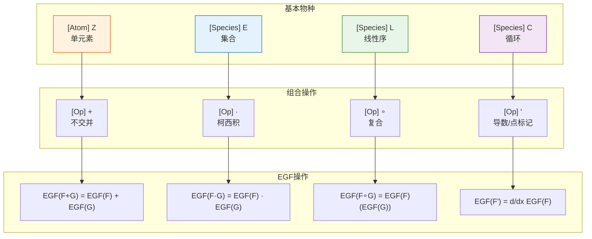
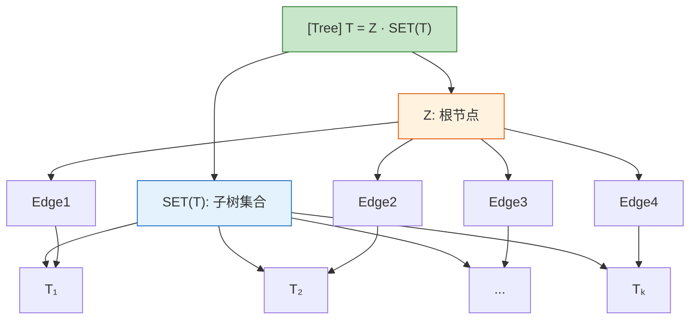
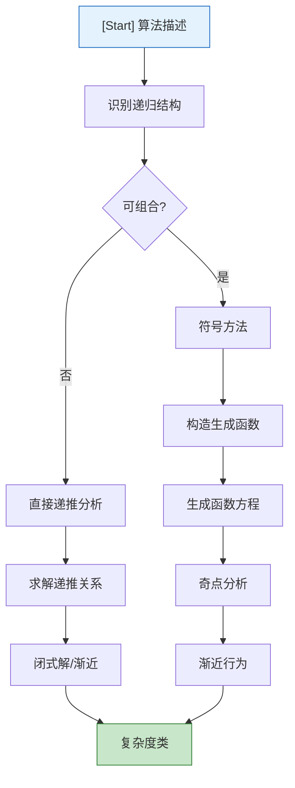

# 组合流 (Combinatorial Streams)

> 所属阶段: Struct | 前置依赖: [05-stream-equations.md](05-stream-equations.md) | 形式化等级: L3-L4

## 1. 概念定义 (Definitions)

### Def-FM-03-06-01. 组合物种 (Combinatorial Species)

**定义**: 组合物种是组合结构的函子化描述，将有限集合映射到该集合上的结构集合。

**形式化定义**:

组合物种是函子 `F: B → Set`，其中 `B` 是有限集合与双射的范畴:

- 对象: 有限集合 `U, V, ...`
- 态射: 双射函数 `σ: U → V`

对于每个有限集合 `U`，`F[U]` 是U上的F-结构集合。

**物种操作**:

| 操作 | 定义 | 组合意义 |
|------|------|----------|
| 和 `(F + G)[U]` | `F[U] ⊔ G[U]` | 不交并 |
| 积 `(F · G)[U]` | `Σ_{U₁⊔U₂=U} F[U₁] × G[U₂]` | 分割组合 |
| 组合 `(F ∘ G)[U]` | `Σ_{π∈Part(U)} F[π] × Π_{B∈π} G[B]` | 集合的集合 |
| 导数 `F'` | `F'[U] = F[U + {*}]` | 添加特殊点 |

**示例物种**:

```
0[U] = ∅                           // 空物种
1[U] = {U} if U=∅ else ∅          // 单位物种
X[U] = {U} if |U|=1 else ∅        // 单元素
E[U] = {U}                         // 集合（唯一结构）
L[U] = U!                          // 线性序（排列）
C[U] = (|U|-1)! if U≠∅ else ∅     // 循环序
```

**直观解释**: 物种提供了一种统一的语法来描述组合结构（如树、图、排列），并允许通过代数操作组合这些结构。

---

### Def-FM-03-06-02. 流的组合操作 (Combinatorial Operations on Streams)

**定义**: 流的组合操作是将物种的代数结构提升到流（无限序列）上的操作。

**基本操作**:

**和流（Sum）**:

```
(σ + τ)_n = σ_n + τ_n
```

**柯西积（Cauchy Product）**:

```
(σ · τ)_n = Σ_{k=0}^n σ_k τ_{n-k}    // 卷积
```

**Hadamard积（逐点积）**:

```
(σ ⊙ τ)_n = σ_n × τ_n
```

**流的组合（Composition）**:

```
(σ ∘ τ)_n = Σ_{k=0}^∞ σ_k · B_{n,k}(τ₁, τ₂, ..., τ_{n-k+1})
```

其中 `B_{n,k}` 是部分Bell多项式。

**流导数（Derivative）**:

```
σ' = (σ₁, σ₂, σ₃, ...) = Tail(σ)
```

**积分（Integral）**:

```
∫σ = (0, σ₀, σ₁, σ₂, ...)
```

---

### Def-FM-03-06-03. 物种的计数序列 (Counting Sequences)

**定义**: 物种F的计数序列是 `(f₀, f₁, f₂, ...)`，其中 `f_n = |F[n]|` 是n元集合上的F-结构数量。

**指数生成函数（EGF）**:

```
F(x) = Σ_{n=0}^∞ f_n x^n/n!
```

**普通生成函数（OGF）**:

```
F̃(x) = Σ_{n=0}^∞ f_n x^n
```

**操作与生成函数的对应**:

| 物种操作 | EGF操作 | OGF操作 |
|----------|---------|---------|
| `F + G` | `F(x) + G(x)` | `F̃(x) + G̃(x)` |
| `F · G` | `F(x) · G(x)` | 卷积（复杂） |
| `F ∘ G` | `F(G(x))` （G常数项为0） | 复合（复杂） |
| `F'` | `dF/dx` | - |

---

### Def-FM-03-06-04. 在算法分析中的应用 (Applications in Algorithm Analysis)

**定义**: 组合流方法用于分析算法的期望复杂度、平均情况行为和概率分布。

**生成函数在算法分析中的作用**:

1. **递推关系求解**: 将算法的时间复杂度递推转换为生成函数方程
2. **渐近分析**: 通过生成函数的奇点分析得到渐近行为
3. **随机算法**: 分析随机算法的期望行为和方差

**分析方法**:

**符号方法（Symbolic Method）**:

```
A = SEQ(B)    ⇒    A(x) = 1/(1 - B(x))
A = SET(B)    ⇒    A(x) = exp(B(x))
A = CYC(B)    ⇒    A(x) = log(1/(1 - B(x)))
```

其中 `SEQ` 是序列构造器，`SET` 是集合构造器，`CYC` 是循环构造器。

## 2. 属性推导 (Properties)

### Lemma-FM-03-06-01. 物种和与积的计数

**陈述**: 对于物种F和G，它们的和与积的计数满足:

```
|(F + G)[n]| = |F[n]| + |G[n]|
|(F · G)[n]| = Σ_{k=0}^n C(n,k) |F[k]| |G[n-k]|
```

**证明**:

**和物种**: 由定义 `(F + G)[U] = F[U] ⊔ G[U]`，不交并的基数等于基数之和。

**积物种**:

```
(F · G)[n] = Σ_{S⊆[n]} F[S] × G[[n]\\S]
```

对每个k，选择k元子集S有 `C(n,k)` 种方式。
因此:

```
|(F · G)[n]| = Σ_{k=0}^n C(n,k) |F[k]| |G[n-k]|
```

∎

---

### Lemma-FM-03-06-02. 流柯西积的生成函数

**陈述**: 对于流σ和τ，柯西积 `σ · τ` 的普通生成函数等于生成函数的乘积: `G_{σ·τ}(x) = G_σ(x) · G_τ(x)`。

**证明**: 见Lemma-FM-03-05-02。

---

### Prop-FM-03-06-01. 指数公式（Exponential Formula）

**陈述**: 若 `F = SET(G)`，则:

```
F(x) = exp(G(x)) = exp(Σ_{n≥1} g_n x^n/n!)
```

**推导**:

集合构造将结构分解为连通分量的集合。
若 `C` 表示连通结构，`S` 表示一般结构:

```
S = SET(C)
```

则:

```
S(x) = exp(C(x))
```

取对数:

```
C(x) = log(S(x))
```

这允许从一般结构计数推导连通结构计数，反之亦然。

∎

---

### Prop-FM-03-06-02. 拉格朗日反演（Lagrange Inversion）

**陈述**: 若 `y = x φ(y)`，则:

```
[x^n] y(x) = (1/n) [t^{n-1}] φ(t)^n
```

其中 `[x^n]` 表示提取x^n的系数。

**应用**: 对于隐式定义的物种（如树结构），拉格朗日反演提供了系数提取的显式公式。

∎

## 3. 关系建立 (Relations)

### 关系 1：物种代数 ↔ 生成函数代数

**论证**:

物种的代数操作与生成函数操作之间存在函子性对应:

```
F ↦ F(x) = Σ |F[n]| x^n/n!
```

这个映射保持:

- 加法: `(F + G)(x) = F(x) + G(x)`
- 乘法: `(F · G)(x) = F(x) · G(x)`
- 导数: `F'(x) = dF/dx`
- 复合: `(F ∘ G)(x) = F(G(x))` （条件适用）

这允许使用代数操作分析组合结构。

---

### 关系 2：组合流 ↔ 解析组合学

**论证**:

Flajolet和Sedgewick的解析组合学建立了:

- 组合构造 ↔ 生成函数方程
- 生成函数奇点 ↔ 渐近行为

**转移定理（Transfer Theorem）**:

```
若 A(x) ~ C/(1-x/ρ)^α 当 x → ρ
则 a_n ~ C n^{α-1} / Γ(α) · ρ^{-n}
```

这为算法复杂度分析提供了系统方法。

---

### 关系 3：流微积分 ↔ 物种微积分

**论证**:

流微积分的导数 `σ'` 对应物种的点标记（pointing）:

```
F'[U] = F[U + {*}]
```

点标记识别结构中的一个特殊元素，对应流的"头部"操作。

积分操作对应于添加一个最小元素并连接结构。

---

### 关系 4：组合计数 ↔ 概率分布

**论证**:

归一化的生成函数定义概率分布:

```
P(X = n) = a_n x^n / A(x)
```

这是Boltzmann分布，在随机算法和统计物理中有应用。

期望和方差可以通过生成函数的导数计算:

```
E[X] = x A'(x) / A(x)
Var[X] = x d/dx (x A'(x) / A(x))
```

## 4. 论证过程 (Argumentation)

### 论证 1：为什么使用指数生成函数

对于标记结构（labelled structures），为什么EGF比OGF更自然？

**标记结构**: 元素是可区分的（如顶点标记的图）

**计数**: 对于n个标记元素，结构数量为 `n!` 乘以无标记版本。

**EGF的优势**:

1. **SET构造**: `SET(F)` 的EGF是 `exp(F(x))`，而OGF无简单形式
2. **CYC构造**: `CYC(F)` 的EGF是 `log(1/(1-F(x)))`
3. **复合**: `F ∘ G` 的EGF是 `F(G(x))`（当G(0)=0）

**直觉**: `x^n/n!` 反映了标记对称性，使得组合操作保持简洁。

---

### 论证 2：树结构的递归分解

树是算法分析中最常见的结构，其递归分解是什么？

**有根树（Rooted Trees）**:

```
T = Z · SET(T)
```

一棵有根树是一个根节点（Z）加上子树的集合。

**EGF方程**:

```
T(x) = x · exp(T(x))
```

**拉格朗日反演**:

```
t_n = n^{n-1}
```

这是Cayley公式，n个标记顶点的有根树数量。

---

### 论证 3：平均情况分析 vs 最坏情况分析

**最坏情况分析**: 寻找使算法运行时间最大的输入
**平均情况分析**: 在所有可能输入上求期望

**组合方法**: 使用生成函数计算期望:

```
E[T] = Σ_n P(n) · T(n)
```

其中 `P(n)` 是输入大小为n的概率（由组合物种计数）。

**示例**: 快速排序的平均比较次数

```
C_n = 2(n+1)H_n - 4n
```

其中 `H_n` 是调和数，来自积分分析。

---

### 论证 4：符号方法的适用边界

符号方法适用于"可分解"的组合类:

- 可递归定义的结构
- 可通过基本构造器（SEQ, SET, CYC等）描述的结构

**不适用**:

- 全局约束（如"连通图"的补集）
- 复杂交叉约束
- 需要复杂包含-排除的结构

对于这些情况，需要:

- 显式容斥原理
- 渐进方法
- 概率方法

## 5. 形式证明 (Proofs)

### Thm-FM-03-06-01. 指数公式与连通结构

**陈述**: 设 `S = SET(C)`，其中C是连通结构物种，则:

```
S(x) = exp(C(x))
C(x) = log(S(x))
```

**证明**:

**组合论证**:

每个S-结构是C-结构的集合。将n元集合划分为k个块，每个块赋予C-结构:

```
S_n = Σ_{k=0}^n (1/k!) Σ_{(n₁,...,n_k)} C(n; n₁,...,n_k) c_{n₁} ... c_{n_k}
```

其中 `C(n; n₁,...,n_k)` 是多项式系数。

**EGF验证**:

```
exp(C(x)) = Π_{n≥1} exp(c_n x^n/n!)
          = Π_{n≥1} Σ_{k≥0} (c_n x^n/n!)^k / k!
```

展开后，x^n/n!的系数正是S_n的定义。

反之，取对数得到C(x) = log(S(x))。

∎

---

### Thm-FM-03-06-02. 拉格朗日反演公式

**陈述**: 若 `y = x φ(y)` 且 φ(0) ≠ 0，则:

```
[x^n] y(x) = (1/n) [t^{n-1}] φ(t)^n
```

**证明**:

使用留数定理和变量替换。

设 `y(x)` 满足 `y = x φ(y)`，则:

```
[x^n] y(x) = (1/2πi) ∮ y(x) dx/x^{n+1}
```

替换 `x = y/φ(y)`，`dx = (φ(y) - yφ'(y))/φ(y)² dy`:

```
= (1/2πi) ∮ y · (φ(y) - yφ'(y))/φ(y)² · φ(y)^{n+1}/y^{n+1} dy
= (1/2πi) ∮ (φ(y)^n/y^n - φ(y)^{n-1}φ'(y)/y^{n-1}) dy/y
```

第一项给出 `(1/n) [y^{n-1}] φ(y)^n`。
第二项是某个函数的导数，积分为0。

∎

---

### Cor-FM-03-06-01. Cayley树计数公式

**陈述**: n个标记顶点的有根树数量为 `n^{n-1}`。

**证明**:

由 `T = Z · SET(T)`，EGF方程为 `T(x) = x exp(T(x))`。

令 `φ(t) = exp(t)`，应用拉格朗日反演:

```
t_n/n! = [x^n] T(x) = (1/n) [t^{n-1}] exp(nt) = (1/n) · n^{n-1}/(n-1)! = n^{n-1}/n!
```

因此 `t_n = n^{n-1}`。

∎

## 6. 实例验证 (Examples)

### 示例 1：排列与循环分解

**排列**: `Perm = SET(CYC)`，排列是循环的集合

**EGF**:

```
P(x) = exp(C(x)) = exp(log(1/(1-x))) = 1/(1-x) = Σ_{n≥0} n! x^n/n!
```

**计数**: `|Perm[n]| = n!`，符合。

**循环数分布**:
排列中循环数的期望: `H_n ≈ ln n`
方差: `H_n - Σ_{k=1}^n 1/k² ≈ ln n`

---

### 示例 2：二叉树的组合分析

**无标记二叉树**:

```
B = 1 + Z · B²    // 空树 或 （根，左子树，右子树）
```

**OGF**:

```
B(x) = 1 + x B(x)²
B(x) = (1 - √(1-4x))/(2x) = Σ_{n≥0} C_n x^n
```

其中 `C_n = (2n choose n)/(n+1)` 是Catalan数。

**渐近**: `C_n ~ 4^n / (n^{3/2} √π)`

**平均高度**: `Θ(√n)`

---

### 示例 3：快速排序的平均复杂度

**递推**:

```
C_n = (n-1) + (1/n) Σ_{k=1}^n (C_{k-1} + C_{n-k})
```

**生成函数方法**:

乘以 `nx^n` 并求和:

```
Σ n C_n x^n = Σ n(n-1) x^n + 2 Σ_{n} Σ_{k=1}^n C_{k-1} x^n
```

令 `C(x) = Σ C_n x^n`:

```
x C'(x) = 2x²/(1-x)³ + 2 C(x) · x/(1-x)
```

**解**:

```
C_n = 2(n+1)H_n - 4n ≈ 2n ln n
```

其中 `H_n` 是第n个调和数。

---

### 示例 4：散列表的冲突分析

**生日问题**: n个人中至少两人生日相同的概率

**等价**: n个球投入m个箱子，至少一个箱子有≥2个球的概率

**EGF**:

```
P(无冲突) = m!/(m-n)! / m^n = Π_{k=0}^{n-1} (1 - k/m)
```

**阈值**: 当 `n ≈ √(2m ln 2) ≈ 1.177√m` 时，冲突概率约50%

对于 `m = 365`，`n ≈ 23`。

---

### 示例 5：图的连通分量

**所有图**: `G = SET(V · V)`，边可以选择存在或不存在

```
|G[n]| = 2^{C(n,2)}
```

**连通图**: 由指数公式

```
G(x) = exp(C(x))
C(x) = log(G(x)) = log(Σ_{n≥0} 2^{C(n,2)} x^n/n!)
```

**渐近**: 几乎所有大图都是连通的，因为:

```
c_n/g_n → 1 当 n → ∞
```

---

### 反例 1：非可分解结构

**平面图**: 不能简单地用SEQ, SET, CYC构造

**问题**: 平面性是一个全局约束，不能局部验证。

**解决方法**: 需要专门的组合分析（如Tutte的方法）。

---

### 反例 2：大偏差分析失败

当考虑远离均值的稀有事件时，标准生成函数方法可能失效。

**需要**: 大偏差理论（Large Deviation Theory）

- Cramér定理
- Gärtner-Ellis定理

## 7. 可视化 (Visualizations)

### 组合物种操作关系图



### 树结构递归分解



### 算法分析流程



## 8. 引用参考 (References)
