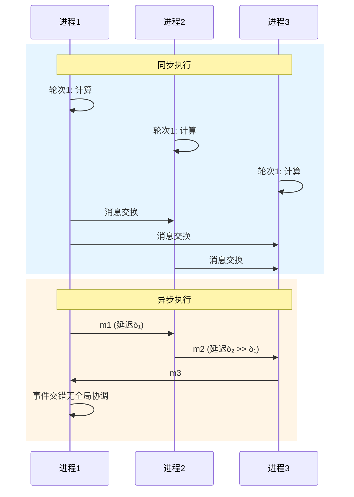
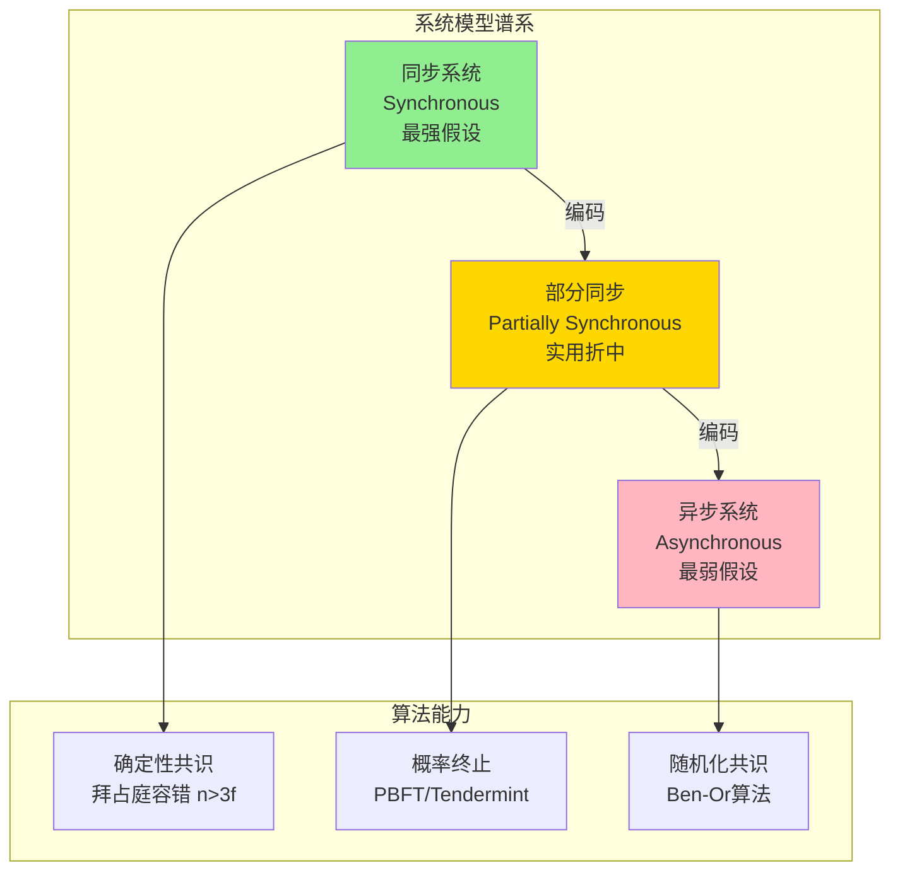
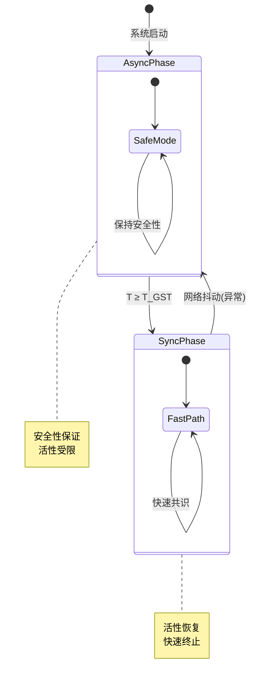

# 同步/异步系统模型

> **所属单元**: formal-methods/03-model-taxonomy/01-system-models | **前置依赖**: [02-foundations/01-formal-systems](../../02-foundations/01-formal-systems.md) | **形式化等级**: L4-L5

## 1. 概念定义 (Definitions)

### Def-M-01-01-01 同步系统 (Synchronous System)

同步系统 $\mathcal{S}_{sync}$ 是一个五元组：

$$\mathcal{S}_{sync} = (P, \mathcal{C}, \Delta, \delta_{max}, \mathcal{G})$$

其中：

- $P = \{p_1, p_2, ..., p_n\}$：进程集合
- $\mathcal{C}$：全局时钟或轮次计数器
- $\Delta: P \times \mathcal{C} \to \mathcal{A}$：状态转移函数
- $\delta_{max} \in \mathbb{R}^+$：最大消息延迟上界
- $\mathcal{G}$：全局同步原语集合

**关键特性**：所有进程在离散时间步上同步执行，消息延迟有确定上界。

### Def-M-01-01-02 异步系统 (Asynchronous System)

异步系统 $\mathcal{S}_{async}$ 是一个六元组：

$$\mathcal{S}_{async} = (P, \mathcal{E}, \prec, \lambda, \tau, \mathcal{M})$$

其中：

- $P$：进程集合
- $\mathcal{E}$：事件集合（局部计算事件或通信事件）
- $\prec \subseteq \mathcal{E} \times \mathcal{E}$：Happens-before关系（偏序）
- $\lambda: \mathcal{E} \to P$：事件到进程的映射
- $\tau: \mathcal{E} \to \mathbb{R}^+$：局部时间戳函数（仅用于分析）
- $\mathcal{M}$：消息通道集合（无延迟保证）

**关键特性**：无全局时钟，事件仅通过Happens-before关系部分排序，消息延迟无界。

### Def-M-01-01-03 部分同步系统 (Partially Synchronous System)

部分同步系统 $\mathcal{S}_{ps}$ 引入时间不确定性边界：

$$\mathcal{S}_{ps} = (\mathcal{S}_{async}, T_{GST}, \Delta_{unknown}, \Phi)$$

其中：

- $\mathcal{S}_{async}$：基础异步系统
- $T_{GST}$：全局稳定时间（Global Stabilization Time）
- $\Delta_{unknown}$：未知但存在的时间上界
- $\Phi \in \{0, 1\}$：同步标志（$T \geq T_{GST}$ 时 $\Phi = 1$）

**Dwork-Lynch-Stockmeyer模型**：系统最终进入同步期，但 $T_{GST}$ 和 $\Delta$ 均未知。

### Def-M-01-01-04 轮次复杂度 (Round Complexity)

对于同步算法 $\mathcal{A}$，其轮次复杂度定义为：

$$RC(\mathcal{A}) = \max_{I \in \mathcal{I}} \min\{r : \text{所有进程在轮次 } r \text{ 后终止}\}$$

其中 $\mathcal{I}$ 为所有合法初始配置的集合。

## 2. 属性推导 (Properties)

### Lemma-M-01-01-01 同步系统的确定性执行

在同步系统中，给定初始配置 $C_0$，执行序列 $\sigma = C_0 \xrightarrow{r_1} C_1 \xrightarrow{r_2} ...$ 是确定性的。

**证明概要**：每轮所有进程同时执行，消息在轮次边界交换，无交错不确定性。∎

### Lemma-M-01-01-02 异步系统的执行交错

异步系统具有指数级执行交错可能性。对于 $n$ 个进程各执行 $k$ 个事件：

$$|\mathcal{E}_{valid}| = \frac{(nk)!}{\prod_{i=1}^{n}(k!)} \cdot \frac{1}{\text{约束因子}}$$

### Prop-M-01-01-01 同步下拜占庭容错界限

在同步系统中，拜占庭容错算法可容忍 $f < n/2$ 故障节点；异步系统中，FLP不可能性结果表明确定性共识在即使 $f=1$ 时亦不可能。

**形式化**：

$$\text{Sync-BFT: } n > 2f \Rightarrow \exists \text{ 共识算法}$$
$$\text{Async-BFT: } \forall n, f \geq 1, \nexists \text{ 确定性异步共识}$$

### Prop-M-01-01-02 部分同步的实用优势

部分同步模型在 $T < T_{GST}$ 时提供异步安全性，在 $T \geq T_{GST}$ 时提供同步活性。

$$\forall t < T_{GST}: \text{Safety}(\mathcal{S}_{ps}, t) = \text{Safety}(\mathcal{S}_{async})$$
$$\forall t \geq T_{GST}: \text{Liveness}(\mathcal{S}_{ps}, t) \approx \text{Liveness}(\mathcal{S}_{sync})$$

## 3. 关系建立 (Relations)

### 模型层次关系

```
同步系统 ⊂ 部分同步系统 ⊂ 异步系统
（最强假设）    （实用折中）      （最弱假设）
```

**编码关系**：

- 同步算法可通过 $\Delta$-计时器模拟于部分同步系统
- 任何异步算法可直接运行于同步系统（保守执行）

### 与故障模型的交叉

| 系统类型 | Fail-Stop | Omission | Byzantine |
|---------|-----------|----------|-----------|
| 同步 | $n > f$ | $n > 2f$ | $n > 3f$ |
| 部分同步 | $n > 2f$ | $n > 3f$ | $n > 3f$ (随机化) |
| 异步 | $n > 2f$ (随机化) | 不可能 | 不可能 (确定性) |

## 4. 论证过程 (Argumentation)

### FLP不可能性定理重述

**Thm-M-01-01-01 (FLP不可能性)**：在异步系统中，若存在至少一个故障进程，则不存在确定性算法能够同时满足：

1. 终止性（Termination）
2. 一致性（Agreement）
3. 有效性（Validity）

**证明框架**（Fischer-Lynch-Paterson, 1985）：

1. 定义**双价配置**（Bivalent Configuration）：存在两种可能的共识值
2. 证明初始配置是双价的
3. 证明从双价配置可达的每个配置保持双价性
4. 构造无限执行避免终止

### 部分同步的算法设计原则

**Paxos类算法**利用部分同步：

- 阶段1：安全地探测当前视图
- 阶段2：在同步期快速提交
- 超时机制：指数退避适应未知 $\Delta$

## 5. 形式证明 / 工程论证 (Proof / Engineering Argument)

### Thm-M-01-01-02 同步系统共识存在性

**定理**：对于 $n$ 个进程的同步系统，若故障数 $f < n/3$（Byzantine）或 $f < n/2$（Fail-Stop），则存在确定性共识算法。

**证明**（以Byzantine为例）：

**算法**（Lamport-Shostak-Pease）:

1. 每轮：指挥官广播值，副官接收
2. 递归调用 $OM(f-1)$ 验证副官间的值
3. 多数投票决定最终值

**正确性论证**：

- **一致性**：诚实节点在 $f+1$ 轮后持有相同向量
- **有效性**：若指挥官诚实，所有诚实副官采用其值
- **容错界限**：$n > 3f$ 确保诚实多数

$$\text{递归深度: } f \Rightarrow \text{消息复杂度: } O(n^{f+1})$$

**工程实现**：PBFT、Tendermint采用此核心思想，优化消息复杂度至 $O(n^2)$。

## 6. 实例验证 (Examples)

### 实例1：简单同步广播协议

```
轮次1: 发起者广播消息 m
轮次2-3: 各节点转发接收到的消息
决策: 收到 ≥ 2f+1 个相同 m' 则接受
```

**容错分析**：$n = 4, f = 1$ 时可容忍1个Byzantine节点。

### 实例2：异步系统中的Chandra-Toueg

使用**最终完美故障检测器** $\diamond P$：

- 弱完备性：最终所有故障被怀疑
- 强准确性：无诚实节点被永久怀疑

```python
class EventuallyPerfectFD:
    def __init__(self, timeout):
        self.timeout = timeout
        self.suspected = set()

    def heartbeat_received(self, process):
        if process in self.suspected:
            self.suspected.remove(process)
            self.timeout *= 2  # 适应性增长

    def check_timeout(self, process, last_heard):
        if now() - last_heard > self.timeout:
            self.suspected.add(process)
```

## 7. 可视化 (Visualizations)

### 同步/异步执行对比



### 模型能力层次图



### 部分同步状态转移



## 8. 引用参考 (References)
