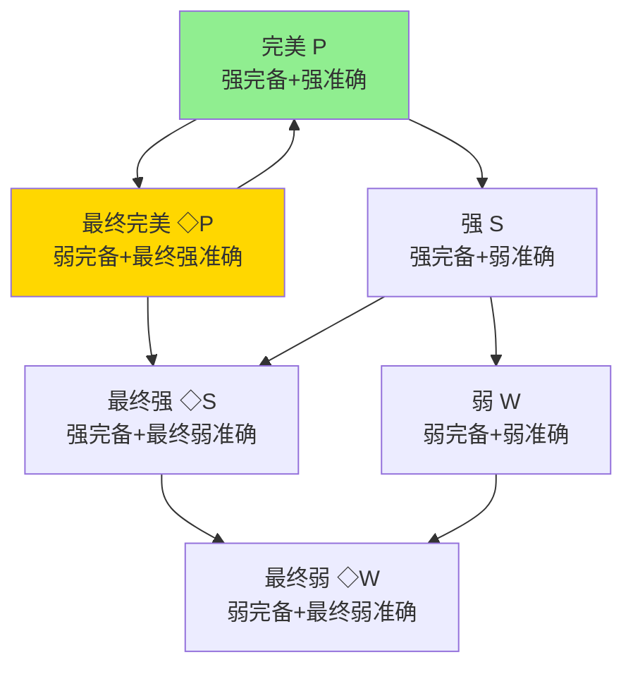
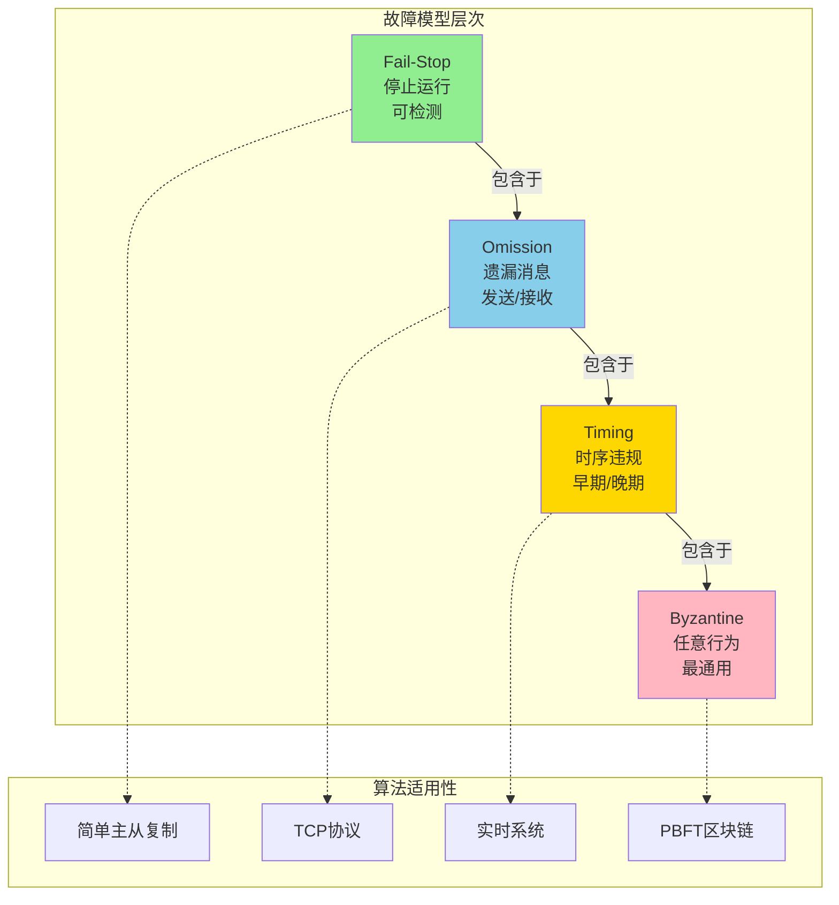
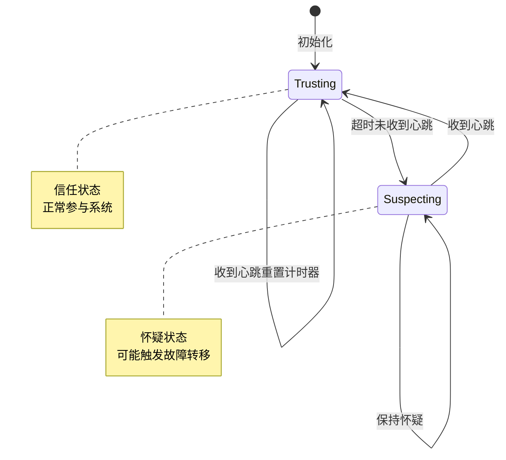
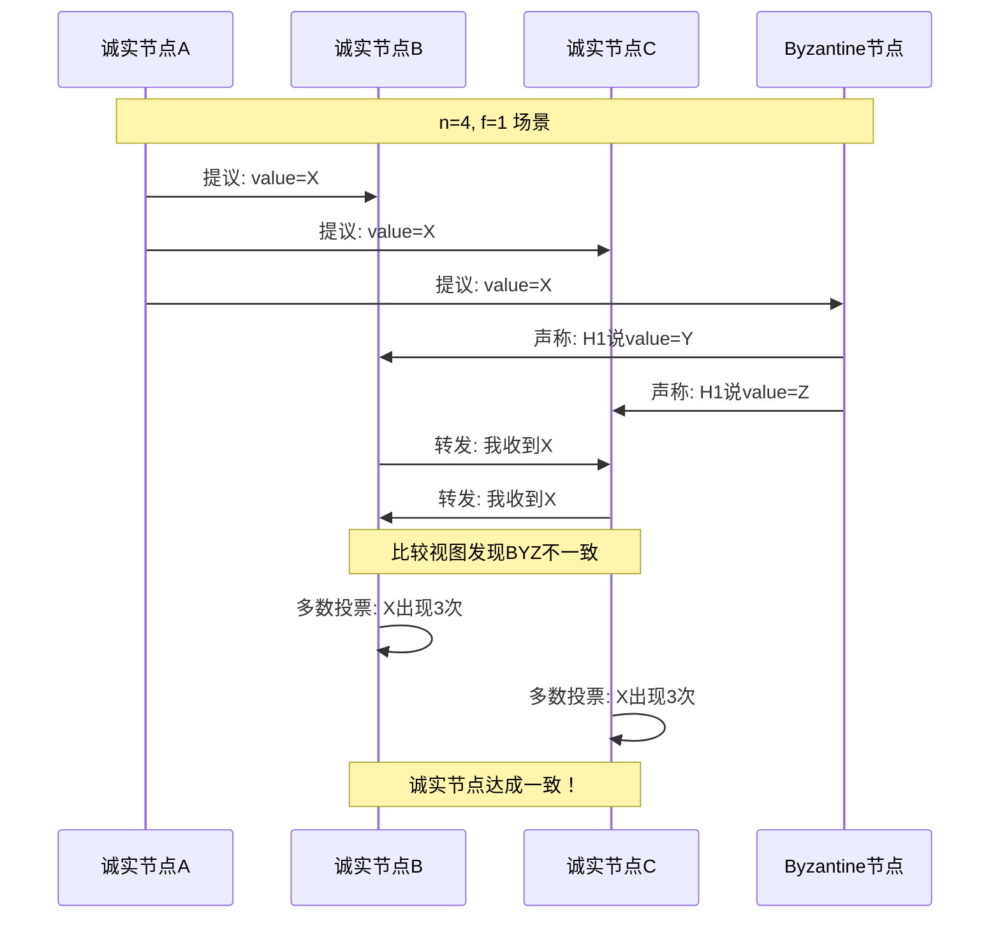

# 故障模型

> **所属单元**: formal-methods/03-model-taxonomy/01-system-models | **前置依赖**: [01-sync-async](01-sync-async.md) | **形式化等级**: L4-L5

## 1. 概念定义 (Definitions)

### Def-M-01-02-01 故障模式 (Failure Pattern)

故障模式 $F$ 是时间到故障状态的映射：

$$F: \mathbb{T} \to 2^P \times \mathcal{F}_{type}$$

其中：

- $\mathbb{T}$：时间域（离散或连续）
- $P$：进程集合
- $\mathcal{F}_{type} = \{crash, omission, timing, byzantine\}$：故障类型

### Def-M-01-02-02 Crash-Stop (Fail-Stop) 故障

进程 $p$ 在时刻 $t$ 发生Crash-Stop故障当且仅当：

$$\forall t' \geq t: \neg\text{send}(p, t') \land \neg\text{receive}(p, t') \land \neg\text{compute}(p, t')$$

且该故障**可被检测**：存在故障检测器 $D$ 使得

$$\exists t_d \geq t: D(p, t_d) = \text{FAILED}$$

**特性**：停止后不再参与系统，行为可预测。

### Def-M-01-02-03 Omission 故障

Omission故障进程可能遗漏发送或接收消息：

$$\text{Omit-Send}(p, m, t) \triangleq \text{intend-send}(p, m, t) \land \neg\text{actual-send}(p, m, t)$$

$$\text{Omit-Receive}(p, m, t) \triangleq \text{deliver}(q, m, p, t) \land \neg\text{accept}(p, m, t)$$

**子类型**：

- **发送遗漏**（Send Omission）：仅遗漏发送
- **接收遗漏**（Receive Omission）：仅遗漏接收
- **通用遗漏**（General Omission）：两者皆可能

### Def-M-01-02-04 Timing 故障

定时故障表现为消息或计算的时序违规：

$$\text{Timing}(p, \delta, \Delta) \triangleq \exists t: \text{response-time}(p, t) \notin [\delta, \Delta]$$

**分类**：

- 性能故障（Performance）：响应慢但正确
- 定时故障（Timing）：响应时序违规
- 任意定时（Arbitrary Timing）：无界延迟

### Def-M-01-02-05 Byzantine (任意) 故障

Byzantine故障是最通用的故障模型，进程可表现任意行为：

$$\text{Byzantine}(p) \triangleq \forall t: \text{behavior}(p, t) \in \mathcal{B}_{arbitrary}$$

其中 $\mathcal{B}_{arbitrary}$ 包含：

- 发送错误消息
- 发送冲突消息给不同接收者
- 与其他故障节点合谋

**形式化约束**：诚实节点比例须满足

$$\frac{|H|}{n} > \frac{f}{n - f}$$

其中 $H$ 为诚实节点集合，$f$ 为故障节点数。

### Def-M-01-02-06 故障检测器 (Failure Detector)

故障检测器 $\mathcal{FD}$ 是一个分布式 oracle：

$$\mathcal{FD} = (M, \Sigma, T, \text{suspect}, \text{trust})$$

其中：

- $M$：监控消息集合
- $\Sigma$：怀疑状态集合
- $T: P \times \mathbb{T} \to \{\text{suspect}, \text{trust}\}$：时变输出

**完备性分类**：

- **强完备性**（Strong Completeness）：最终每个故障进程被所有诚实进程怀疑
- **弱完备性**（Weak Completeness）：最终每个故障进程被某个诚实进程怀疑

**准确性分类**：

- **强准确性**（Strong Accuracy）：诚实进程永不被怀疑
- **弱准确性**（Weak Accuracy）：至少一个诚实进程永不被怀疑
- **最终强准确性**（Eventual Strong Accuracy）：存在某时刻后，诚实进程永不被怀疑

## 2. 属性推导 (Properties)

### Lemma-M-01-02-01 故障模型层次包含

$$\text{Fail-Stop} \subset \text{Omission} \subset \text{Timing} \subset \text{Byzantine}$$

即：容忍Byzantine的算法必然容忍其他故障；反之不然。

**证明**：每个更严格的故障模型均可编码为更通用模型的子集。∎

### Lemma-M-01-02-02 故障检测器不可能性

在纯异步系统中，同时满足强完备性和强准确性的故障检测器不存在。

$$\nexists \mathcal{FD}: \text{Strong-Completeness}(\mathcal{FD}) \land \text{Strong-Accuracy}(\mathcal{FD})$$

**推论**：实际系统采用**最终完美故障检测器** $\diamond P$（弱完备性 + 最终强准确性）。

### Prop-M-01-02-01 容错阈值下界

设 $n$ 为总节点数，$f$ 为故障节点数：

| 故障类型 | 同步系统 | 异步系统 |
|---------|---------|---------|
| Fail-Stop | $n > f$ | $n > 2f$ (随机化) |
| Omission | $n > 2f$ | $n > 3f$ (随机化) |
| Byzantine | $n > 3f$ | $n > 3f$ + 密码学假设 |

### Prop-M-01-02-02 故障检测器复杂度

对于最终完美故障检测器 $\diamond P$：

- **消息复杂度**：$O(n^2 \cdot \log(\Delta/\delta))$，其中 $\Delta$ 为实际最大延迟，$\delta$ 为初始超时
- **时间复杂度**：期望 $O(\Delta)$ 时间达成稳定检测

## 3. 关系建立 (Relations)

### 故障模型与系统模型的组合

```
                    Fail-Stop    Omission    Byzantine
同步 + 确定性          ✓            ✓            ✓
部分同步 + 确定性      ✓            ✓            ✓
异步 + 确定性          ✗            ✗            ✗
异步 + 随机化          ✓            ✓            ✓ (密码学)
```

### 故障检测器类别



## 4. 论证过程 (Argumentation)

### 故障模型的实际对应

| 故障模型 | 典型场景 | 检测难度 |
|---------|---------|---------|
| Fail-Stop | 进程崩溃、机器断电 | 容易 |
| Omission | 网络丢包、缓冲区溢出 | 中等 |
| Timing | 网络抖动、GC暂停 | 困难 |
| Byzantine | 恶意攻击、软件Bug | 极难 |

### 故障检测的误报与漏报权衡

定义检测器质量：

$$Q(\mathcal{FD}) = \alpha \cdot (1 - \text{FPR}) + \beta \cdot (1 - \text{FNR})$$

其中 FPR 为假阳性率，FNR 为假阴性率。异步系统中无法同时最小化两者。

## 5. 形式证明 / 工程论证 (Proof / Engineering Argument)

### Thm-M-01-02-01 Byzantine容错下界定理

**定理**：同步系统中，确定性共识算法若要容忍 $f$ 个Byzantine故障，必须满足 $n \geq 3f + 1$。

**证明**（Lamport-Shostak-Pease）：

**情形1：$n = 3, f = 1$ 的不可能性**

考虑三将军问题：指挥官 $C$ 和两个副官 $L_1, L_2$，其中一个是叛徒。

情况A：$C$ 忠诚，发送值 $v$ 给 $L_1, L_2$；$L_1$ 是叛徒，告诉 $L_2$ 收到 $v'$。

```
C --v--> L1(叛徒)
C --v--> L2
L1 --v'--> L2
```

$L_2$ 无法区分：

- $C$ 忠诚发送 $v$，$L_1$ 撒谎
- $C$ 是叛徒发送不同值

因此 $L_2$ 无法做出一致决策。

**情形2：$n = 3f$ 的广义不可能性**

将 $n$ 个节点划分为三组，每组大小 $f$。若故障节点在各组间制造混淆视图，诚实节点无法达成共识。

**工程意义**：

- PBFT、Tendermint 均采用 $n = 3f + 1$ 配置
- 实际系统常配置 $f = 1$（$n = 4$）或 $f = 2$（$n = 7$）

### Thm-M-01-02-02 Chandra-Toueg故障检测器分类

**定理**：故障检测器可按完备性和准确性正交分类，形成8个类别，其中 $\diamond P$ 在异步系统中可实现且足够支持共识。

**证明概要**：

1. 构造心跳协议实现弱完备性
2. 适应性超时实现最终准确性
3. 通过转发怀疑实现完备性传播

## 6. 实例验证 (Examples)

### 实例1：简单心跳故障检测器

```python
class HeartbeatFailureDetector:
    """
    实现 ◇P (Eventually Perfect) 故障检测器
    """
    def __init__(self, initial_timeout=1000):
        self.timeout = initial_timeout
        self.last_heard = {}  # process -> timestamp
        self.suspected = set()
        self.delta = 1.5      # 超时增长因子

    def heartbeat(self, process, timestamp):
        """接收心跳消息"""
        self.last_heard[process] = timestamp
        if process in self.suspected:
            self.suspected.remove(process)
            # 适应性调整：网络稳定时减小超时
            self.timeout = max(100, self.timeout * 0.9)

    def check_suspects(self, current_time):
        """检查超时进程"""
        for p, last in self.last_heard.items():
            if p not in self.suspected:
                if current_time - last > self.timeout:
                    self.suspected.add(p)
                    # 适应性增长：避免频繁误报
                    self.timeout *= self.delta
        return self.suspected
```

### 实例2：Byzantine容错场景模拟

```
场景：4节点系统 (n=4, f=1)，节点B为Byzantine故障

轮次1:
  节点A(诚实) 提议: value=7
  节点B(Byzantine) 广播给C: value=7, 广播给D: value=8
  节点C(诚实) 接收: [7, 7]
  节点D(诚实) 接收: [7, 8]

轮次2 (PREPARE阶段):
  各节点交换准备消息
  C看到: A→7, B→7 → 多数为7
  D看到: A→7, B→8 → 冲突，需第三轮

轮次3 (COMMIT阶段):
  C广播COMMIT(7), D接收到足够确认后提交7

结果：尽管B试图分裂视图，诚实节点仍达成一致
```

## 7. 可视化 (Visualizations)

### 故障模型层次图



### 故障检测器状态机



### Byzantine故障场景



## 8. 关系建立 (Relations)

### 与分布式计算的关系

故障模型是分布式计算理论的核心组成部分。分布式系统的设计和分析必须考虑各种故障场景，故障模型提供了形式化的方法来描述和推理这些场景。

- 详见：[分布式计算](../../98-appendices/wikipedia-concepts/11-distributed-computing.md)

分布式计算中的关键故障相关概念：

- **FLP不可能性**: 异步系统中确定性共识的不可能性
- **容错阈值**: 不同故障模型下的最小副本数要求
- **故障检测器**: 在异步系统中实现最终完美检测

### 故障模型与系统模型的组合

```
                    Fail-Stop    Omission    Byzantine
同步 + 确定性          ✓            ✓            ✓
部分同步 + 确定性      ✓            ✓            ✓
异步 + 确定性          ✗            ✗            ✗
异步 + 随机化          ✓            ✓            ✓ (密码学)
```

---

## 9. 引用参考 (References)
