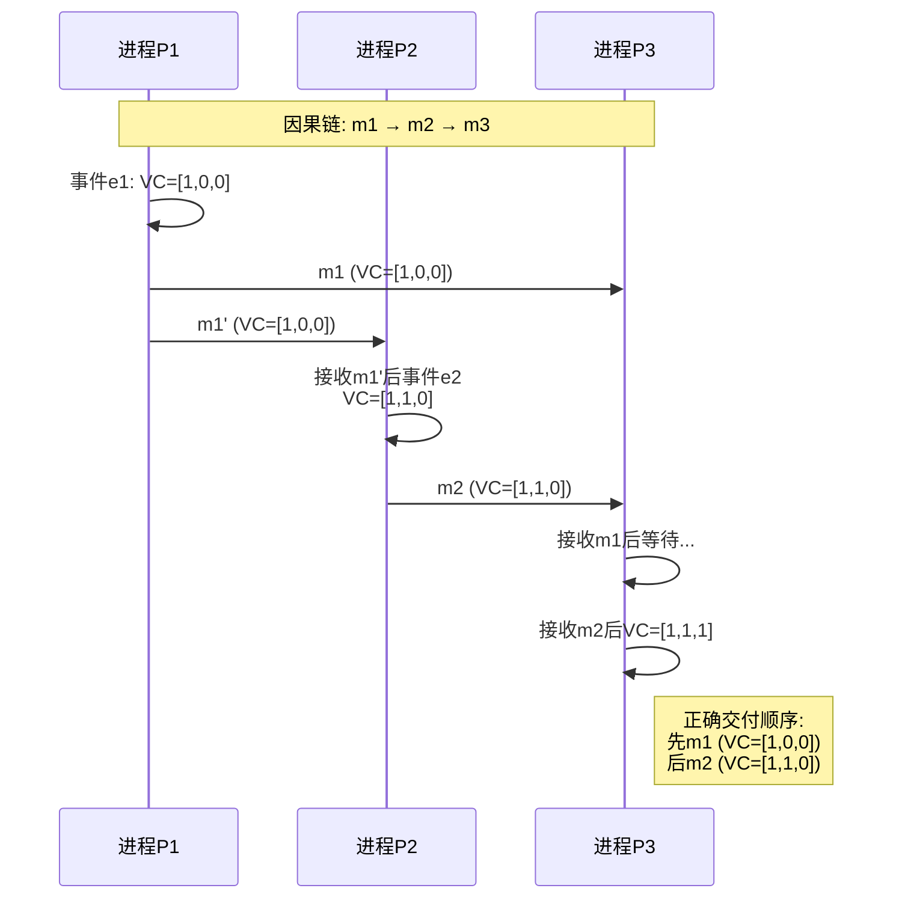

# 通信模型

> **所属单元**: formal-methods/03-model-taxonomy/01-system-models | **前置依赖**: [02-failure-models](02-failure-models.md) | **形式化等级**: L4-L5

## 1. 概念定义 (Definitions)

### Def-M-01-03-01 消息传递系统 (Message Passing System)

消息传递系统 $\mathcal{MP}$ 定义为：

$$\mathcal{MP} = (P, C, M, \text{send}, \text{deliver}, \mathcal{L})$$

其中：

- $P = \{p_1, ..., p_n\}$：进程集合
- $C \subseteq P \times P$：通道关系
- $M$：消息空间
- $\text{send}: P \times P \times M \times \mathbb{T} \to \{\top, \bot\}$：发送操作
- $\text{deliver}: P \times P \times M \times \mathbb{T} \to \{\top, \bot\}$：交付操作
- $\mathcal{L} \subseteq \{\text{FIFO}, \text{causal}, \text{total}\}$：通道性质标签

### Def-M-01-03-02 共享内存系统 (Shared Memory System)

共享内存系统 $\mathcal{SM}$ 定义为：

$$\mathcal{SM} = (P, V, R, W, \mathcal{M}, \mathcal{O})$$

其中：

- $P$：进程集合
- $V = \{v_1, ..., v_m\}$：共享变量集合
- $R: P \times V \times \mathbb{T} \to \text{Val}$：读操作
- $W: P \times V \times \text{Val} \times \mathbb{T} \to \{\top, \bot\}$：写操作
- $\mathcal{M}: V \to \{\text{atomic}, \text{regular}, \text{safe}\}$：变量一致性模型
- $\mathcal{O}$：操作调度器

### Def-M-01-03-03 FIFO通道 (FIFO Channel)

通道 $c = (p_i, p_j)$ 满足FIFO性质当且仅当：

$$\forall m_1, m_2 \in M: (p_i \xrightarrow{m_1} p_j \prec p_i \xrightarrow{m_2} p_j) \Rightarrow (\text{deliver}(p_j, m_1) \prec \text{deliver}(p_j, m_2))$$

其中 $\prec$ 表示Happens-before关系。

**性质**：发送顺序 = 接收顺序（点对点）。

### Def-M-01-03-04 因果序 (Causal Order)

消息 $m_1$ 因果先于 $m_2$（记为 $m_1 \to m_2$）当且仅当满足以下任一条件：

1. **同进程**：$\text{send}(m_1) \prec \text{send}(m_2)$ 且同一发送进程
2. **传递闭包**：$\text{send}(m_1) \prec \text{deliver}(m_2)$（$m_2$ 的发送依赖于 $m_1$ 的接收）
3. **传递性**：$\exists m_3: m_1 \to m_3 \land m_3 \to m_2$

**因果交付**：若 $m_1 \to m_2$ 且两者目标相同，则 $\text{deliver}(m_1) \prec \text{deliver}(m_2)$。

### Def-M-01-03-05 全序广播 (Total Order Broadcast)

全序广播满足以下性质：

$$\text{Validity}: \text{若 } p \text{ 广播 } m \text{ 且 } p \text{ 正确，则所有正确进程最终交付 } m$$

$$\text{Agreement}: \text{若正确进程 } p \text{ 交付 } m \text{，则所有正确进程最终交付 } m$$

$$\text{Integrity}: \text{每个进程对每条消息最多交付一次}$$

$$\text{Total\ Order}: \forall p, q \in P_{correct}, m_1, m_2:$$
$$\text{deliver}_p(m_1) \prec \text{deliver}_p(m_2) \Leftrightarrow \text{deliver}_q(m_1) \prec \text{deliver}_q(m_2)$$

### Def-M-01-03-06 同步通信 (Synchronous Communication)

同步通信要求发送方和接收方同时就绪：

$$\text{Synchronous-Send}(p, q, m) \triangleq p \xrightarrow{m} q \text{ 阻塞直至 } q \text{ 执行接收}$$

**CSP模型**：$p \ ! \ m \ /\ \!\ \! \ ? \ m \to p$（输出/输入同步）

## 2. 属性推导 (Properties)

### Lemma-M-01-03-01 FIFO蕴含局部因果序

若所有通道均为FIFO，则同发送者到同接收者的消息满足因果序。

$$\text{FIFO-All} \Rightarrow \forall p_i, p_j: \text{Causal-Order}(p_i \to p_j)$$

**证明**：直接由FIFO定义得出，同发送者的发送顺序定义了因果序。∎

### Lemma-M-01-03-02 因果序不可由FIFO单独保证

即使所有通道为FIFO，不同发送者的消息仍可能以违反因果序的方式交付。

**反例**：

- $p_1$ 发送 $m_1$ 给 $p_3$
- $p_1$ 发送 $m_2$ 给 $p_2$
- $p_2$ 接收 $m_2$ 后发送 $m_3$ 给 $p_3$
- 若 $m_3$ 先于 $m_1$ 到达 $p_3$，违反因果序（$m_1 \to m_2 \to m_3$）但满足FIFO

### Prop-M-01-03-01 通信模型的表达能力等价

在异步系统中，消息传递和共享内存（带读写锁）在计算能力上等价：

$$\mathcal{MP}_{async} \sim_{Turing} \mathcal{SM}_{async}$$

**构造**：

- 共享内存 → 消息传递：模拟缓存一致性协议
- 消息传递 → 共享内存：每个变量由管理者进程维护

### Prop-M-01-03-02 全序广播的复杂度下界

在异步系统中，全序广播的消息复杂度下界为 $O(n^2)$（无故障）或 $O(n^3)$（Byzantine故障）。

## 3. 关系建立 (Relations)

### 消息序层次

```
基础消息传递（无序）
    ↓ 添加约束
FIFO（点对点有序）
    ↓ 添加约束
因果序（全局偏序）
    ↓ 添加约束
全序（全局线性序）
```

**实现成本**：

- FIFO：无额外开销（底层TCP）
- 因果序：向量时钟 $O(n)$ 空间/消息
- 全序：共识协议 $O(n^2)$ 消息

### 通信模型对比

| 特性 | 消息传递 | 共享内存 |
|-----|---------|---------|
| 耦合度 | 低（显式发送） | 高（隐式共享）|
| 延迟模型 | 网络延迟 | 缓存/内存延迟 |
| 容错 | 消息丢失可检测 | 数据损坏难定位 |
| 扩展性 | 好（地理分布） | 差（缓存一致性开销）|
| 典型应用 | 微服务、分布式数据库 | 多线程程序、NUMA系统 |

## 4. 论证过程 (Argumentation)

### 向量时钟的必要性

为实现因果序交付，进程维护向量时钟 $VC_i[1..n]$：

$$VC_i[i] \leftarrow VC_i[i] + 1 \text{ （本地事件）}$$
$$VC_i[j] \leftarrow \max(VC_i[j], VC_{msg}[j]) \text{ （接收消息）}$$

**比较规则**：

- $VC_1 < VC_2$：若 $\forall k: VC_1[k] \leq VC_2[k]$ 且 $\exists k: VC_1[k] < VC_2[k]$
- $VC_1 \parallel VC_2$（并发）：若不满足 $<$ 且不满足 $>$ 关系

### 共享内存一致性模型谱系

```
线性一致性（Linearizable）
    ↓ 放松
顺序一致性（Sequential）
    ↓ 放松
因果一致性（Causal）
    ↓ 放松
处理器一致性（Processor）
    ↓ 放松
最终一致性（Eventual）
```

## 5. 形式证明 / 工程论证 (Proof / Engineering Argument)

### Thm-M-01-03-01 全序广播等价于共识

**定理**：在异步系统中，全序广播问题与共识问题在归约意义上等价。

**证明**：

**方向1：共识 → 全序广播**

1. 进程提出消息序列作为提案值
2. 运行共识算法确定下一个交付的消息
3. 重复执行实现全序

**方向2：全序广播 → 共识**

1. 每个进程广播其提案值
2. 取全序广播的第一个消息作为共识值
3. 一致性由全序性质保证

**工程推论**：FLP不可能性适用于全序广播，因此需要：

- 随机化算法（如Ben-Or的随机化共识）
- 部分同步假设（如Paxos）
- 故障检测器（如Chandra-Toueg）

### Thm-M-01-03-02 因果序实现正确性

**定理**：使用向量时钟的协议实现了因果序交付。

**证明**：

**协议**：进程 $p_i$ 仅在 $\forall k: VC_{msg}[k] \leq VC_i[k] + \delta_{ik}$ 时交付消息 $m$，其中 $\delta_{ik} = 1$ 若 $k=i$ 否则 $0$。

**完备性**：若 $m_1 \to m_2$ 且 $p_j$ 是目标，则 $VC_{m_1} < VC_{m_2}$。

当 $p_j$ 满足 $m_2$ 的交付条件时，$VC_j \geq VC_{m_2} > VC_{m_1}$，因此 $m_1$ 已交付或可同时交付。

**安全性**：不会过早交付（等待直到所有因果前驱满足）。

## 6. 实例验证 (Examples)

### 实例1：向量时钟协议实现

```python
class VectorClock:
    def __init__(self, num_processes, my_id):
        self.vc = [0] * num_processes
        self.my_id = my_id
        self.pending = []  # 等待交付的消息队列

    def local_event(self):
        """记录本地事件"""
        self.vc[self.my_id] += 1

    def send_message(self, content):
        """发送消息（附带向量时钟）"""
        self.vc[self.my_id] += 1
        return {'content': content, 'vc': self.vc.copy()}

    def receive_message(self, msg):
        """接收消息，尝试交付"""
        self.pending.append(msg)
        self.try_deliver()

    def try_deliver(self):
        """尝试交付满足因果序的消息"""
        delivered = True
        while delivered:
            delivered = False
            for msg in self.pending[:]:
                if self.can_deliver(msg):
                    self.deliver(msg)
                    self.pending.remove(msg)
                    delivered = True

    def can_deliver(self, msg):
        """检查是否满足因果前驱条件"""
        for k in range(len(self.vc)):
            expected = self.vc[k] + (1 if k == self.my_id else 0)
            if msg['vc'][k] > expected:
                return False
        return True

    def deliver(self, msg):
        """交付消息并更新向量时钟"""
        for k in range(len(self.vc)):
            self.vc[k] = max(self.vc[k], msg['vc'][k])
        print(f"P{self.my_id} delivered: {msg['content']} @ VC={self.vc}")
```

### 实例2：CSP风格同步通信

```python
import asyncio

class CSPChannel:
    """CSP风格同步通道"""
    def __init__(self):
        self.sender_ready = asyncio.Event()
        self.receiver_ready = asyncio.Event()
        self.message = None

    async def send(self, msg):
        """发送（阻塞直到接收方就绪）"""
        self.message = msg
        self.sender_ready.set()
        await self.receiver_ready.wait()
        self.sender_ready.clear()
        self.receiver_ready.clear()

    async def receive(self):
        """接收（阻塞直到发送方就绪）"""
        await self.sender_ready.wait()
        msg = self.message
        self.receiver_ready.set()
        return msg

# 使用示例
async def producer(ch):
    for i in range(3):
        await ch.send(f"msg-{i}")
        print(f"Sent: msg-{i}")

async def consumer(ch):
    for _ in range(3):
        msg = await ch.receive()
        print(f"Received: {msg}")
```

## 7. 可视化 (Visualizations)

### 消息序层次对比

```mermaid
graph TB
    subgraph "消息序层次"
        UNORDERED[基础传递<br/>Unordered<br/>无保证]
        FIFO2[FIFO<br/>点对点有序<br/>同发送者顺序保持]
        CAUSAL[因果序<br/>Causal Order<br/>全局偏序]
        TOTAL[全序<br/>Total Order<br/>全局线性序]
    end

    UNORDERED -->|添加顺序约束| FIFO2
    FIFO2 -->|添加跨进程约束| CAUSAL
    CAUSAL -->|添加全序决策| TOTAL

    subgraph "实现机制"
        UN_IMPL[UDP / 基础TCP]
        FIFO_IMPL[TCP流]
        CAUSAL_IMPL[向量时钟<br/>VC[1..n]]
        TOTAL_IMPL[共识协议<br/>Paxos/Raft]
    end

    UNORDERED -.-> UN_IMPL
    FIFO2 -.-> FIFO_IMPL
    CAUSAL -.-> CAUSAL_IMPL
    TOTAL -.-> TOTAL_IMPL

    style UNORDERED fill:#FFB6C1
    style FIFO2 fill:#FFD700
    style CAUSAL fill:#87CEEB
    style TOTAL fill:#90EE90
```

### 因果序示例



### 通信模型架构对比

```mermaid
graph TB
    subgraph "消息传递"
        P1[进程P1]
        P2[进程P2]
        NET[网络层]
        P1 -->|send(m)| NET
        NET -->|deliver(m)| P2
    end

    subgraph "共享内存"
        P3[进程P3]
        P4[进程P4]
        MEM[(共享内存)]
        P3 -->|write(x)| MEM
        MEM -->|read(x)| P4
    end

    subgraph "同步通信 CSP"
        P5[进程P5<br/>发送方]
        P6[进程P6<br/>接收方]
        CHAN[同步通道]
        P5 -.->|!m 阻塞| CHAN
        P6 -.->|?m 阻塞| CHAN
        CHAN -.->|双方就绪| P5
        CHAN -.->|完成交换| P6
    end
```

## 8. 引用参考 (References)
