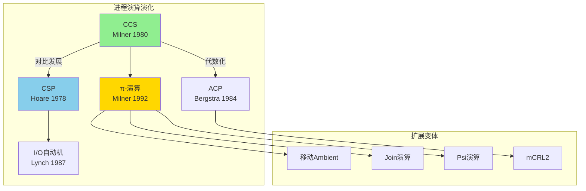
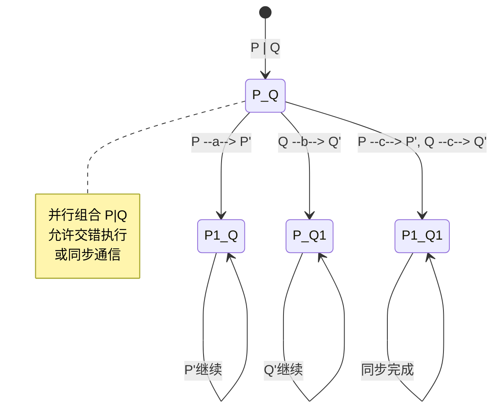
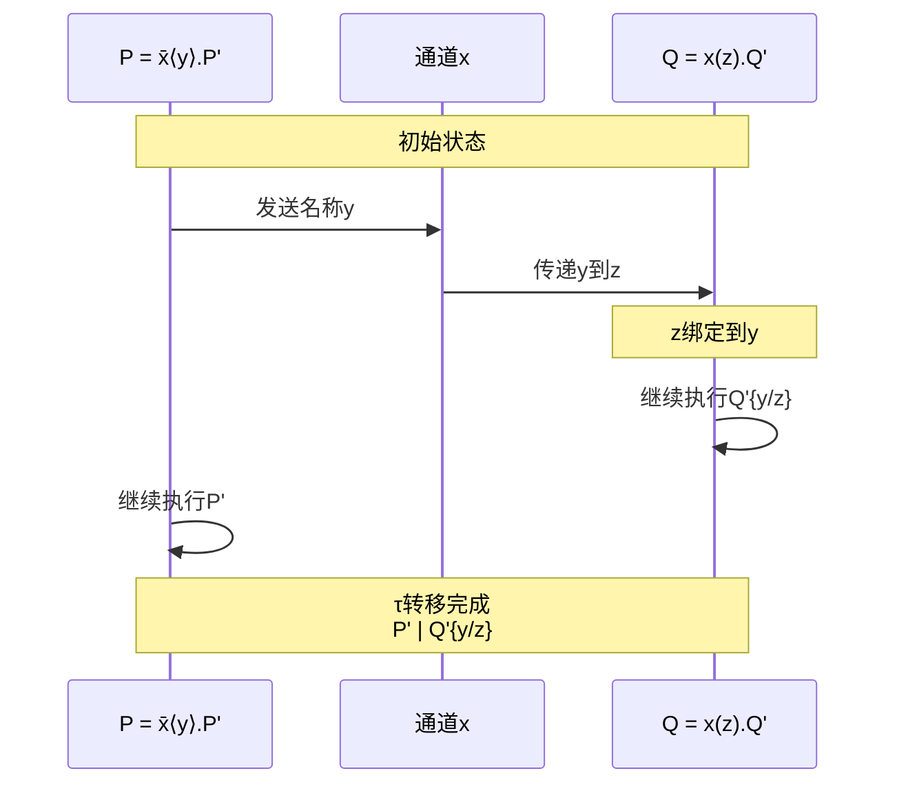

# 进程演算家族

> **所属单元**: formal-methods/03-model-taxonomy/02-computation-models | **前置依赖**: [01-system-models/03-communication-models](../01-system-models/03-communication-models.md) | **形式化等级**: L5-L6

## 1. 概念定义 (Definitions)

### Def-M-02-01-01 进程演算 (Process Algebra)

进程演算是一个形式框架 $\mathcal{PA} = (\mathcal{P}, \mathcal{A}, \mathcal{O}, \sim, \vdash)$，其中：

- $\mathcal{P}$：进程表达式集合
- $\mathcal{A}$：动作集合（可见动作 + 内部动作 $\tau$）
- $\mathcal{O}$：操作符集合（并行、选择、限制等）
- $\sim \subseteq \mathcal{P} \times \mathcal{P}$：行为等价关系
- $\vdash \subseteq \mathcal{P} \times \mathcal{F}$：满足关系（进程满足公式）

### Def-M-02-01-02 CCS (Calculus of Communicating Systems)

CCS由Milner提出，其语法为：

$$P, Q ::= 0 \ | \ a.P \ | \ \bar{a}.P \ | \ \tau.P \ | \ P + Q \ | \ P | Q \ | \ P \setminus L \ | \ P[f]$$

其中：

- $0$：空进程（终止）
- $a.P, \bar{a}.P$：前缀（输入/输出）
- $\tau.P$：内部动作
- $P + Q$：非确定性选择
- $P | Q$：并行组合
- $P \setminus L$：限制（隐藏动作集 $L$）
- $P[f]$：重命名（$f$ 为动作映射）

**转移规则**（SOS风格）：

$$\frac{}{a.P \xrightarrow{a} P} \text{(Act)} \quad \frac{P \xrightarrow{\alpha} P'}{P + Q \xrightarrow{\alpha} P'} \text{(Sum-L)}$$

$$\frac{P \xrightarrow{a} P', Q \xrightarrow{\bar{a}} Q'}{P | Q \xrightarrow{\tau} P' | Q'} \text{(Com)}$$

### Def-M-02-01-03 CSP (Communicating Sequential Processes)

CSP由Hoare提出，强调同步通信：

$$P, Q ::= STOP \ | \ SKIP \ | \ a \to P \ | \ P \sqcap Q \ | \ P \sqcup Q \ | \ P \parallel_A Q \ | \ P \setminus A$$

**关键特性**：

- $\sqcap$：内部选择（非确定性）
- $\sqcup$：外部选择（环境决定）
- $\parallel_A$：同步并行（在 $A$ 上同步）

**迹语义**（Trace Semantics）：

$$\text{traces}(a \to P) = \{\langle\rangle\} \cup \{\langle a \rangle ^\frown t \mid t \in \text{traces}(P)\}$$

$$\text{traces}(P \parallel_A Q) = \{t \mid t \downarrow_A \in \text{traces}(P) \land t \downarrow_A \in \text{traces}(Q)\}$$

### Def-M-02-01-04 π-演算 (π-Calculus)

π-演算扩展CCS支持 mobility（名称传递）：

$$P, Q ::= 0 \ | \ \bar{x}\langle y \rangle.P \ | \ x(z).P \ | \ \tau.P \ | \ P + Q \ | \ P | Q \ | \ (\nu x)P$$

**核心创新**：

- $\bar{x}\langle y \rangle.P$：在通道 $x$ 上发送名称 $y$
- $x(z).P$：在通道 $x$ 上接收，绑定到 $z$
- $(\nu x)P$：名称限制（私有通道创建）

**名称传递示例**：

$$\bar{x}\langle y \rangle.P \ | \ x(z).Q \xrightarrow{\tau} P \ | \ Q\{y/z\}$$

### Def-M-02-01-05 ACP (Algebra of Communicating Processes)

ACP由Bergstra和Klop提出，强调代数公理化：

**签名**：$\Sigma_{ACP} = (P, +, \cdot, \parallel, \|, \mid, \partial_H, \tau_I, \rho_f)$

**核心公理**：

- **A1-A5**：选择公理（交换、结合、分配等）
- **CM1-CM9**：合并公理（并行展开）
- **CF1-CF2**：通信函数

**并行展开**（Expansion Theorem）：

$$x \parallel y = x \| y + y \| x + x \mid y$$

其中：

- $x \| y$：$x$ 先执行一步，然后与 $y$ 并行
- $x \mid y$：$x$ 和 $y$ 通信

### Def-M-02-01-06 I/O自动机 (I/O Automata)

I/O自动机由Lynch等提出，适合分布式算法建模：

$$\mathcal{A} = (S, s_0, \text{sig}, \Delta)$$

其中：

- $S$：状态集合
- $s_0 \in S$：初始状态
- $\text{sig} = (\text{in}, \text{out}, \text{int})$：签名（输入/输出/内部动作）
- $\Delta \subseteq S \times \text{acts} \times S$：转移关系

**组合操作**：

- 两个自动机 $A_1, A_2$ 可组合当输入输出动作无冲突
- 共享动作同步执行（输出 = 输入匹配）

### Def-M-02-01-07 标记转移系统 (Labeled Transition System)

LTS是进程语义的基础模型：

$$\mathcal{T} = (S, L, \rightarrow, s_0)$$

其中：

- $S$：状态集合
- $L$：标签集合（动作）
- $\rightarrow \subseteq S \times L \times S$：转移关系
- $s_0 \in S$：初始状态

**进程语义**：每个进程表达式对应一个LTS状态，动作对应转移标签。

### Def-M-02-01-08 双模拟 (Bisimulation)

**强双模拟**：关系 $R \subseteq S \times S$ 是强双模拟，当且仅当对所有 $(p, q) \in R$：

- 若 $p \xrightarrow{a} p'$，则存在 $q'$ 使得 $q \xrightarrow{a} q'$ 且 $(p', q') \in R$
- 若 $q \xrightarrow{a} q'$，则存在 $p'$ 使得 $p \xrightarrow{a} p'$ 且 $(p', q') \in R$

**双模拟等价**：$p \sim q$ 当且仅当存在双模拟 $R$ 使得 $(p, q) \in R$。

## 2. 属性推导 (Properties)

### Lemma-M-02-01-01 CCS的互模拟

强互模拟 $\sim$ 是满足以下条件的最大关系 $R$：

$$P \sim Q \Leftrightarrow \forall a:$$
$$(P \xrightarrow{a} P' \Rightarrow \exists Q': Q \xrightarrow{a} Q' \land P' \sim Q') \land$$
$$(Q \xrightarrow{a} Q' \Rightarrow \exists P': P \xrightarrow{a} P' \land P' \sim Q')$$

**同余性**：$\sim$ 是CCS表达式上的同余关系。

### Lemma-M-02-01-02 π-演算的表达能力

π-演算可编码：

- λ-演算（高阶函数）
- CCS（作为子集）
- 各种数据类型和结构

**表达能力定理**：π-演算是图灵完备的。

### Prop-M-02-01-01 进程演算比较

| 特性 | CCS | CSP | π-演算 | ACP | I/O自动机 |
|-----|-----|-----|--------|-----|----------|
| 通信风格 | 异步 | 同步 | 异步 | 混合 | 同步 |
| Mobility | 无 | 无 | 有 | 无 | 无 |
| 等价关系 | 互模拟 | 迹/失败 | 互模拟 | 互模拟 | 轨迹包含 |
| 语义风格 | 操作 | 指称 | 操作 | 代数 | 操作 |
| 典型应用 | 协议验证 | 系统设计 | 移动计算 | 协议分析 | 分布式算法 |

### Prop-M-02-01-02 等价关系层次

$$\text{同构} \subset \text{强互模拟} \subset \text{弱互模拟} \subset \text{迹等价} \subset \text{测试等价}$$

## 3. 关系建立 (Relations)

### 进程演算编码关系

```
π-演算
  ├── 编码 → CCS
  ├── 编码 → λ-演算
  └── 编码 → 高阶进程

CCS
  └── 子集 → CSP（通过转换）

ACP
  └── 扩展 → μCRL（含数据）
```

### 与自动机的联系

- **CCS** ↔ **LTS**（标记转移系统）
- **CSP** ↔ **接受树/失败集**
- **I/O自动机** ↔ **细化/前序关系**

## 4. 论证过程 (Argumentation)

### 互模拟的合理性

为什么互模拟是合适的等价概念？

1. **上下文封闭性**：等价进程在任何上下文中可互换
2. **观察能力**：仅通过外部观察无法区分
3. **代数性质**：支持等式推理和重写

**反例**：迹等价不足以捕获分支结构差异

$$a.(b + c) \neq a.b + a.c \text{（迹等价但不同）}$$

### Mobility的重要性

π-演算的 mobility 允许建模：

- 动态链接建立（如TCP连接）
- 代理迁移（如移动代码）
- 资源重新配置

## 5. 形式证明 / 工程论证 (Proof / Engineering Argument)

### Thm-M-02-01-01 并行展开定理（ACP）

**定理**：对于任意进程 $p_1, ..., p_n$，其并行组合可展开为交错和通信项的和。

**证明**（归纳法）：

**基例**（$n = 2$）：由定义 $x \parallel y = x \| y + y \| x + x \mid y$

**归纳步骤**：假设对 $n-1$ 成立，则

$$\parallel_{i=1}^n p_i = (\parallel_{i=1}^{n-1} p_i) \parallel p_n$$

展开右侧：
$$= (\parallel_{i=1}^{n-1} p_i) \| p_n + p_n \| (\parallel_{i=1}^{n-1} p_i) + (\parallel_{i=1}^{n-1} p_i) \mid p_n$$

由归纳假设，每项可进一步展开为交错序列。

### Thm-M-02-01-02 π-演算编码λ-演算

**定理**：存在从λ-演算到π-演算的忠实编码 $[\![ \cdot ]\!]$，保持归约语义。

**编码方案**：

$$[\![ x ]\!] = x\langle p \rangle \quad \text{（变量：发送参数到通道）}$$

$$[\![ \lambda x.M ]\!] = p(x).[\![ M ]\!] \quad \text{（抽象：输入通道）}$$

$$[\![ M N ]\!] = (\nu c)([\![ M ]\!]\{c/p\} \ | \ c(y).(\bar{y}\langle [\![ N ]\!] \rangle \ | \ [\![ N ]\!]))$$

**验证**：β-归约对应π-演算通信：

$$[\![ (\lambda x.M) N ]\!] \xrightarrow{\tau}^* [\![ M\{N/x\} ]\!]$$

## 6. 实例验证 (Examples)

### 实例1：CCS描述通信协议

```
* 简单请求-响应协议

Server = request.(process.Response.ack.Server)
Client = request.ack.Client

System = (Server | Client) \ {request, ack}

* 展开执行:
* 1. Client --request--> Server
* 2. Server --process--> Response
* 3. Server --ack--> Client
* 4. 回到初始状态
```

**等价验证**：

- `System ~ Response.System`（每轮后等价于自身）

### 实例2：π-演算建模移动代理

```
* 移动代理：可在节点间迁移

Node(x) = x(agent).(agent | Node(x))  * 接收代理并继续

Agent = go\langle target \rangle.Continue  * 发送迁移请求

Migrate(go, target, cont) = go(dest).(\nu c)(\bar{dest}\langle c \rangle.c\langle cont \rangle)

* 系统组合
System = (\nu go)(Node(go) | Agent | Migrate(go, target, Continue))
```

### 实例3：CSP风格的死锁自由分析

```csp
* 哲学家就餐问题（简化）

PHIL(i) = think -> pickL(i) -> pickR(i) -> eat -> dropL(i) -> dropR(i) -> PHIL(i)

FORK(i) = pickL(i) -> dropL(i) -> FORK(i)
          | pickR(i) -> dropR(i) -> FORK(i)

* 资源分配顺序（避免死锁）
ORDERED_PHIL(0) = think -> pickR(0) -> pickL(0) -> eat -> ...
ORDERED_PHIL(i) = think -> pickL(i) -> pickR(i) -> eat -> ...  (i > 0)

* 证明：ORDERED系统无死锁
```

## 7. 可视化 (Visualizations)

### 进程演算家族谱系



### CCS并行组合转移图



### π-演算名称传递



## 8. 引用参考 (References)
