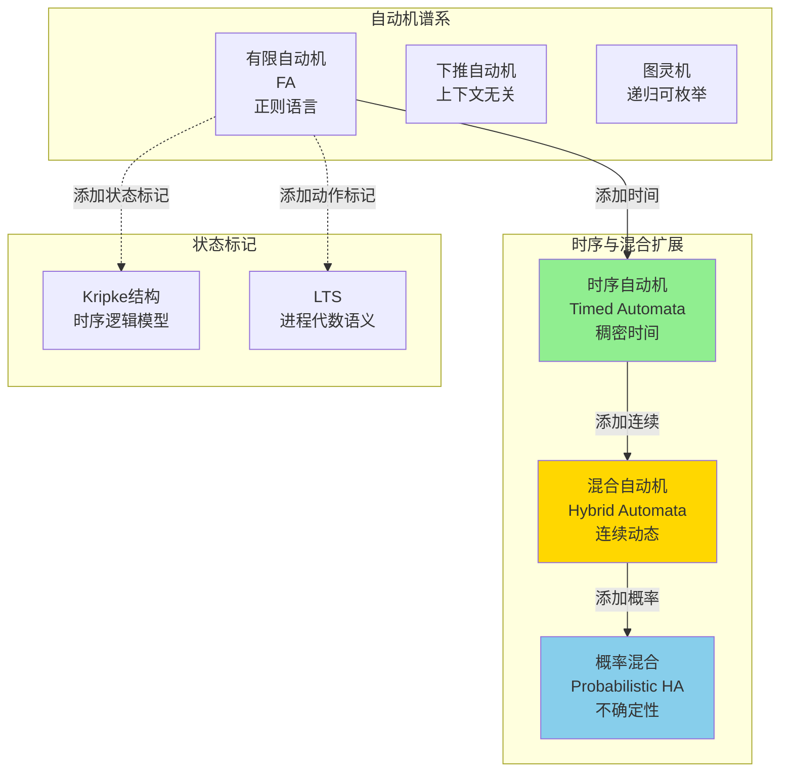
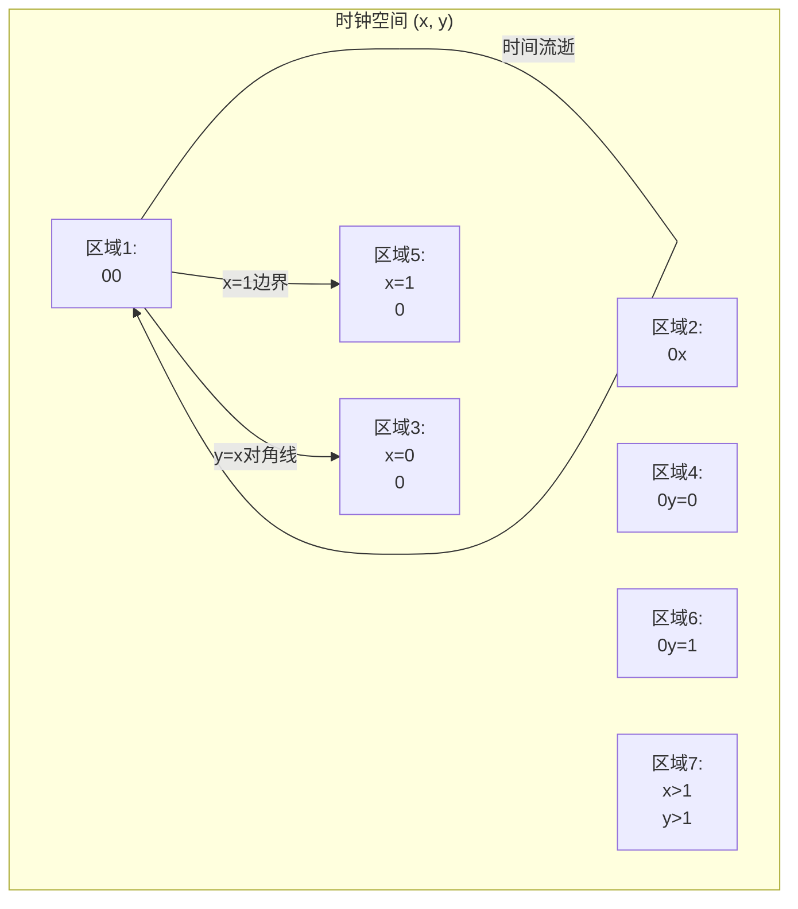
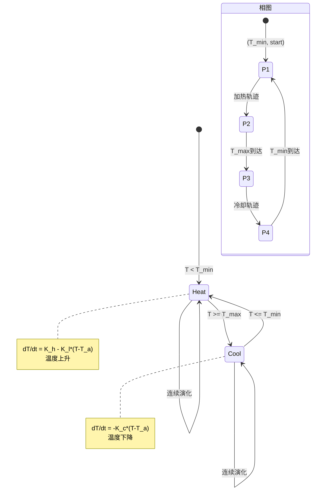

# 自动机模型

> **所属单元**: formal-methods/03-model-taxonomy/02-computation-models | **前置依赖**: [01-process-algebras](01-process-algebras.md) | **形式化等级**: L5-L6

## 1. 概念定义 (Definitions)

### Def-M-02-02-01 标记转移系统 (Labeled Transition System, LTS)

LTS是一个四元组 $\mathcal{T} = (S, A, \rightarrow, s_0)$：

- $S$：状态集合（可数无限）
- $A$：动作标签集合
- $\rightarrow \subseteq S \times A \times S$：标记转移关系
- $s_0 \in S$：初始状态

**记号**：$(s, a, s') \in \rightarrow$ 写作 $s \xrightarrow{a} s'$

### Def-M-02-02-02 Kripke结构 (Kripke Structure)

Kripke结构是带状态标记的自动机 $\mathcal{K} = (S, S_0, R, L, AP)$：

- $S$：状态集合
- $S_0 \subseteq S$：初始状态集合
- $R \subseteq S \times S$：全转移关系（$\forall s \exists s': (s, s') \in R$）
- $L: S \to 2^{AP}$：状态标记函数（$AP$为原子命题集）
- $AP$：原子命题集合

**与LTS关系**：Kripke结构是无动作标签的LTS变体，用于时序逻辑模型检验。

### Def-M-02-02-03 时序自动机 (Timed Automaton)

时序自动机 $\mathcal{A} = (L, l_0, C, A, E, I)$：

- $L$：位置（状态）集合
- $l_0 \in L$：初始位置
- $C$：时钟变量集合
- $A$：动作集合
- $E \subseteq L \times A \times \mathcal{G}(C) \times 2^C \times L$：带约束的边
  - $\mathcal{G}(C)$：时钟约束（如 $x \leq 5$）
  - $2^C$：重置时钟集合
- $I: L \to \mathcal{G}(C)$：位置不变式

**时钟约束语法**：

$$\phi ::= x \sim c \ | \ x - y \sim c \ | \ \phi \land \phi \ | \ \text{true} \quad (\sim \in \{<, \leq, =, \geq, >\})$$

**语义**：状态为 $(l, v)$，其中 $v: C \to \mathbb{R}^+$ 为时钟估值。

### Def-M-02-02-04 混合自动机 (Hybrid Automaton)

混合自动机扩展时序自动机支持连续动态：

$$\mathcal{H} = (L, l_0, V, A, E, F, Inv)$$

其中：

- $V = X \cup Y$：变量集合（离散 $X$ + 连续 $Y$）
- $E$：离散转移（带卫式和重置）
- $F: L \times \mathbb{R}^{|Y|} \to \mathbb{R}^{|Y|}$：流函数（微分包含）
- $Inv: L \to 2^{\mathbb{R}^{|Y|}}$：位置不变式（连续约束）

**轨迹**：交替的连续演化（流）和离散跳跃（转移）。

### Def-M-02-02-05 区域等价 (Region Equivalence)

对于时序自动机，定义时钟等价关系 $\cong$：

$$v \cong v' \Leftrightarrow \forall x \in C:$$

- $\lfloor v(x) \rfloor = \lfloor v'(x) \rfloor$（整数部分相同）
- $\text{fr}(v(x)) = 0 \Leftrightarrow \text{fr}(v'(x)) = 0$（小数部分零性一致）
- $\forall x, y: \text{fr}(v(x)) \leq \text{fr}(v(y)) \Leftrightarrow \text{fr}(v'(x)) \leq \text{fr}(v'(y))$（相对顺序）

**区域**（Region）：等价类 $[v]_{\cong}$。

## 2. 属性推导 (Properties)

### Lemma-M-02-02-01 区域自动机的有限性

对于 $k$ 个时钟、最大常量 $c_{max}$ 的时序自动机，区域数量为：

$$|Regions| \leq k! \cdot 2^k \cdot (2c_{max} + 2)^k$$

**意义**：时序自动机的可达性问题是可判定的（区域图构造）。

### Lemma-M-02-02-02 Kripke结构与LTS的互编码

- Kripke结构 → LTS：添加自环转移、动作标签为状态命题变化
- LTS → Kripke结构：展开动作为状态转换，原子命题标记源/目标

**复杂度**：状态空间最多指数级膨胀。

### Prop-M-02-02-01 时序自动机可达性复杂度

时序自动机可达性问题是 PSPACE-完全的。

- **上界**：区域图大小指数级，可在多项式空间遍历
- **下界**：从线性有界自动机归约

### Prop-M-02-02-02 混合自动机的不可判定性

混合自动机可达性问题通常是不可判定的（即使简单动力学）。

**可判定子类**：

- 初始化矩形自动机（Initialized Rectangular）
- 斜时钟自动机（Skewed Clock）
- timed automata（无时钟导数变化）

## 3. 关系建立 (Relations)

### 自动机层次

```
有限自动机 (FA)
    ↓ 添加时间
时序自动机 (TA)
    ↓ 添加连续动态
混合自动机 (HA)
    ↓ 添加概率
概率混合自动机 (PHA)
```

**表达能力**：

- TA ⊊ HA（混合自动机严格更强大）
- 可达性：TA可判定，HA不可判定

### 与进程代数的对应

| 进程代数概念 | 自动机对应 |
|------------|-----------|
| 进程 | 状态 |
| 动作前缀 | 标记转移 |
| 并行组合 | 乘积自动机 |
| 互模拟 | 互模拟等价 |
| 死锁 | 死状态（无出边）|

## 4. 论证过程 (Argumentation)

### 为什么需要时序扩展？

经典自动机（如LTS）无法表达：

- 实时约束（如"在5秒内响应"）
- 超时行为
- 性能要求验证

**时序自动机的优势**：

- 稠密时间模型（比离散时间更精确）
- 区域图抽象保持可判定性
- 工业级工具支持（UPPAAL）

### 混合自动机的应用

**建模场景**：

- 汽车控制系统（连续速度 + 离散档位）
- 温控系统（连续温度 + 离散开关）
- 网络协议（连续拥塞窗口 + 离散事件）

## 5. 形式证明 / 工程论证 (Proof / Engineering Argument)

### Thm-M-02-02-01 区域图正确性

**定理**：时序自动机 $\mathcal{A}$ 的区域图 $\mathcal{R}(\mathcal{A})$ 与原自动机满足相同的 TCTL 公式。

**证明概要**：

**构造**：

- 区域图状态：$(l, [v]_{\cong})$，$l$ 为位置，$[v]_{\cong}$ 为时钟等价类
- 边：$(l, r) \to (l, r')$（时间流逝）或 $(l, r) \xrightarrow{a} (l', r')$（离散转移）

**关键引理**：同一区域内所有估值满足相同的时钟约束，且导致相同的未来行为。

**双模拟**：定义区域状态与原自动机状态间的互模拟关系，证明：
$$((l, v), (l, [v]_{\cong})) \in \mathcal{B}$$

### Thm-M-02-02-02 混合自动机安全验证

**定理**：对于简单矩形混合自动机（所有流为 $x \in [a, b]$），有界时间可达性是可判定的。

**算法**（可达性分析）：

1. 计算离散后继（Post_d）
2. 计算连续后继（Post_c）：流管近似
3. 迭代直到不动点或超时

**近似技术**：

- 多面体计算
- 椭球近似
- 支持函数表示

**工具**：SpaceEx、Flow*、HyTech

## 6. 实例验证 (Examples)

### 实例1：互斥协议（LTS建模）

```
* 两个进程竞争临界区

状态: (pc1, pc2, turn)
- pc_i ∈ {N(非临界), T(尝试), C(临界)}
- turn ∈ {1, 2}

转移:
(N, pc2, t) --try1--> (T, pc2, t)
(T, pc2, 1) --enter1--> (C, pc2, 1)  if turn=1
(C, pc2, t) --exit1--> (N, pc2, 2)

* 验证性质:
* 1. 安全性: ¬(C, C, t)  互斥
* 2. 活性: T --> <> C    最终进入
```

### 实例2：火车门控制器（时序自动机）

```
* UPPAAL风格建模

template Train() {
    clock x;

    state Near, In, Far;
    state Open, Closing, Closed, Opening;

    init Near, Open;

    trans
        Near -> In { guard x >= 10; },
        In -> Far { guard x >= 5; },
        Far -> Near { guard x >= 20; },

        Open -> Closing { guard x >= 2; sync approach?; },
        Closing -> Closed { guard x >= 1; },
        Closed -> Opening { guard x >= 0; sync leave?; },
        Opening -> Open { guard x >= 2; };

    invariant
        Near: x <= 15,    // 接近信号后最多15单位进入
        Closing: x <= 2,  // 关门最多2单位
        In: x <= 7;       // 在区域内最多7单位
}

* 验证: A[] Train(0).In imply Train(0).Closed
* （火车在区域内时门必须关闭）
```

### 实例3：温控系统（混合自动机）

```
* 简单温控：加热/冷却模式

变量:
- T: 温度 (连续)
- mode: {HEAT, COOL} (离散)

动力学:
- HEAT: dT/dt = K_h * (T_target - T) - K_loss * (T - T_ambient)
- COOL: dT/dt = -K_c * (T - T_ambient)

转移:
- HEAT -> COOL when T >= T_max
- COOL -> HEAT when T <= T_min

* 验证: T_min <= T <= T_max 始终成立
* 验证: 温度在T_target附近震荡
```

## 7. 可视化 (Visualizations)

### 自动机层次与能力



### 时序自动机区域划分



### 混合自动机轨迹示例



## 8. 引用参考 (References)
