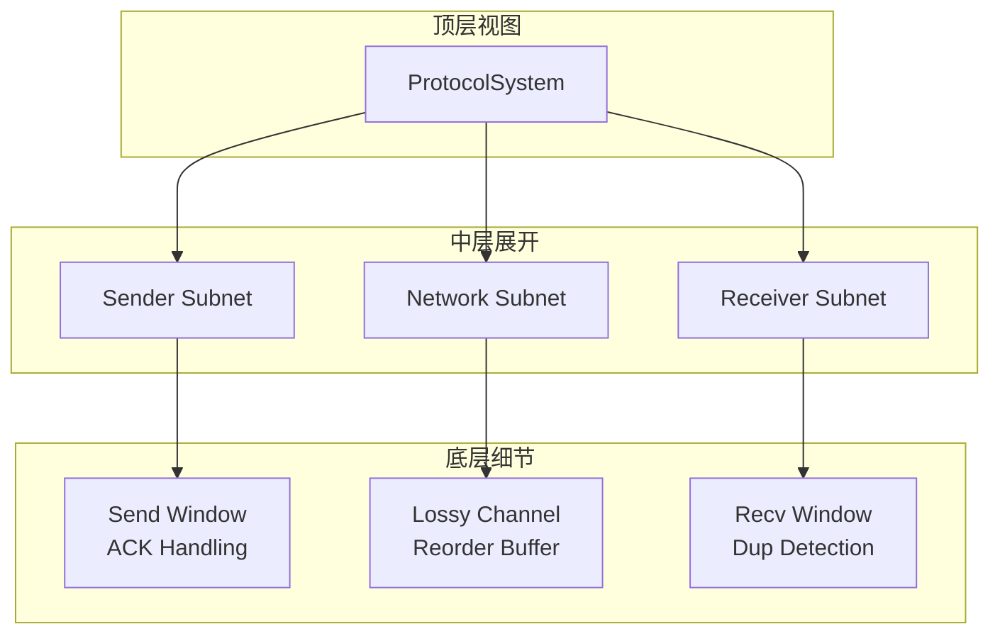
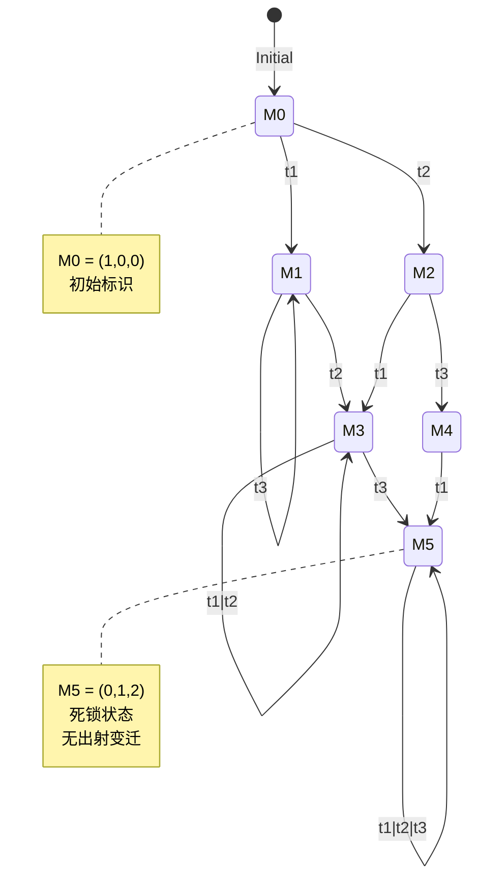

# 网模型

> **所属单元**: formal-methods/03-model-taxonomy/02-computation-models | **前置依赖**: [02-automata](02-automata.md) | **形式化等级**: L5-L6

## 1. 概念定义 (Definitions)

### Def-M-02-03-01 Petri网 (Petri Net)

Petri网是一个五元组 $\mathcal{N} = (P, T, F, W, M_0)$：

- $P = \{p_1, ..., p_m\}$：库所（Place）集合，表示状态/条件
- $T = \{t_1, ..., t_n\}$：变迁（Transition）集合，表示事件/动作
- $F \subseteq (P \times T) \cup (T \times P)$：流关系（弧）
- $W: F \to \mathbb{N}^+$：弧权重函数
- $M_0: P \to \mathbb{N}$：初始标识（Marking）

**图形表示**：库所为圆圈，变迁为矩形/条形，令牌为黑点。

### Def-M-02-03-02 变迁使能规则

变迁 $t \in T$ 在标识 $M$ 下使能（记为 $M[t\rangle$）当且仅当：

$$\forall p \in {}^\bullet t: M(p) \geq W(p, t)$$

其中 ${}^\bullet t = \{p \mid (p, t) \in F\}$ 为 $t$ 的输入库所。

**变迁发射**（Firing）：$M[t\rangle M'$ 产生新标识：

$$M'(p) = M(p) - W(p, t) + W(t, p)$$

（约定：无弧时权重为0）

### Def-M-02-03-03 可达性 (Reachability)

标识 $M'$ 从 $M$ 可达（记为 $M \xrightarrow{*} M'$）当且仅当：

$$\exists t_1, ..., t_k: M[t_1\rangle M_1[t_2\rangle ... [t_k\rangle M'$$

**可达集**：$R(\mathcal{N}, M_0) = \{M \mid M_0 \xrightarrow{*} M\}$

### Def-M-02-03-04 有色Petri网 (Colored Petri Net, CPN)

CPN扩展了带类型的令牌：

$$\mathcal{CPN} = (P, T, F, \Sigma, V, C, G, E, I)$$

其中：

- $\Sigma$：颜色集（数据类型）
- $V$：变量集合
- $C: P \to \Sigma$：库所颜色函数
- $G: T \to \text{Expr}_V$：变迁卫式（布尔表达式）
- $E: F \to \text{Expr}_V$：弧表达式
- $I: P \to \text{Expr}$：初始化表达式

**展开**：CPN可展开为普通Petri网（状态空间指数级增长）。

### Def-M-02-03-05 时序Petri网 (Timed Petri Net)

时序Petri网为变迁或令牌附加时间约束：

**变迁级时序**：

- 变迁 $t$ 有触发时间区间 $[efts(t), lfts(t)]$
- 强使能后需等待 $efts$ 才能发射，$lfts$ 前必须发射

**令牌级时序（TPN）**：

- 每个令牌携带时间戳
- 变迁仅当所有输入令牌"足够老"时使能

### Def-M-02-03-06 递归ECATNets (Rewriting Logic)

ECATNets（Extended Concurrent Algebraic Term Nets）结合重写逻辑：

$$\mathcal{E} = (\Sigma, E, R, P_{token}, P_{msg})$$

- $\Sigma$：签名（操作符声明）
- $E$：等式公理
- $R$：重写规则（条件式 $l \to r \ \text{if} \ c$）
- $P_{token}, P_{msg}$：令牌/消息库所

**语义**：并发重写，支持高阶建模。

## 2. 属性推导 (Properties)

### Lemma-M-02-03-01 可达性问题的可判定性

对于**普通Petri网**（无 inhibitors、无优先级），可达性问题是可判定的（Mayr-Kosaraju算法）。

**复杂度**：非原始递归（Ackermann函数级别）。

**不可判定扩展**：

- 带 inhibitor 弧的Petri网
- 带零测试的Petri网
- 带传递弧的Petri网

### Lemma-M-02-03-02 有界性判定

库所 $p$ 是**有界的**当且仅当：

$$\exists k \in \mathbb{N}: \forall M \in R(\mathcal{N}, M_0): M(p) \leq k$$

**判定算法**：

1. 构造覆盖树（Karp-Miller树）
2. 检查是否存在 $\omega$ 节点
3. 若无$\omega$，则有界

### Prop-M-02-03-01 活性层次

变迁活性分类（从强到弱）：

1. **L4-活性（活）**：$\forall M \in R(M_0), \exists M' \in R(M): M'[t\rangle$
2. **L3-活性（反复）**：$t$ 无限次使能
3. **L2-活性（准活）**：$\exists M \in R(M_0): M[t\rangle$
4. **L1-活性（使能）**：$M_0[t\rangle$（仅初始）

**关系**：L4 → L3 → L2 → L1

### Prop-M-02-03-02 CPN的状态空间压缩

CPN通过颜色折叠实现状态压缩：

$$\text{压缩比} = \frac{|R(\text{unfolded})|}{|R(\text{CPN})|} = O(k^{|P|})$$

其中 $k$ 为颜色数，$|P|$ 为库所数。

## 3. 关系建立 (Relations)

### Petri网与自动机的对应

- **Petri网 ↔ 向量加法系统**（VAS）：等价计算模型
- **有界Petri网 ↔ 有限自动机**：可达图构造
- **含抑制弧的Petri网 ↔ 图灵机**：图灵完备

### 建模范式对比

| 特性 | Petri网 | 进程演算 | 自动机 |
|-----|---------|---------|--------|
| 状态表示 | 分布式（令牌分布） | 代数项 | 集中式（单一状态） |
| 并发建模 | 原生支持 | 并行组合 | 乘积构造 |
| 同步机制 | 变迁同步 | 握手通信 | 状态同步 |
| 分析工具 | 不变量、可达图 | 互模拟检验 | 模型检测 |
| 典型应用 | 工作流、协议 | 软件设计 | 硬件验证 |

## 4. 论证过程 (Argumentation)

### 为什么Petri网适合分布式系统？

1. **分布式状态**：无全局状态变量，状态分布在各库所
2. **真并发**：非交错语义，可同时发射多个无关变迁
3. **可视化**：直观的图形表示便于通信
4. **丰富分析**：可达性、不变量、同步距离等

### CPN vs. 普通Petri网

**CPN优势**：

- 数据抽象（高阶令牌）
- 层次化建模（融合/替换变迁）
- 与函数式编程结合

**CPN劣势**：

- 状态空间展开复杂
- 分析工具较少（相对普通Petri网）

## 5. 形式证明 / 工程论证 (Proof / Engineering Argument)

### Thm-M-02-03-01 状态方程的必要条件

**定理**：若 $M' \in R(\mathcal{N}, M_0)$，则存在非负整数解 $\vec{x}$ 满足：

$$M' = M_0 + \mathbf{A}^T \cdot \vec{x}$$

其中 $\mathbf{A}$ 为关联矩阵：$A_{ij} = W(t_j, p_i) - W(p_i, t_j)$

**证明**：每次变迁发射对应列向量相加。

**非充分性**：某些解可能不可达（由于发射顺序约束）。

### Thm-M-02-03-02 库所/变迁不变量

**P-不变量（库所不变量）**：

向量 $\mathbf{y} \geq 0$ 满足 $\mathbf{y}^T \cdot \mathbf{A} = 0$，则：

$$\forall M \in R(M_0): \mathbf{y}^T \cdot M = \mathbf{y}^T \cdot M_0$$

**T-不变量（变迁不变量）**：

向量 $\mathbf{x} \geq 0$ 满足 $\mathbf{A} \cdot \mathbf{x} = 0$，表示可重复发射序列。

**应用**：

- **资源守恒**：P-不变量验证资源不泄漏
- **循环检测**：T-不变量识别重复行为

**计算**：Farkas算法、单纯形法。

## 6. 实例验证 (Examples)

### 实例1：生产者-消费者（Petri网）

```
* 经典同步问题

库所:
  P_produce (生产者就绪)
  P_buffer  (缓冲区，容量N)
  P_consume (消费者就绪)
  P_full    (缓冲区计数)

变迁:
  T_produce: P_produce --> P_produce, P_buffer
             (生产者产生一个物品)

  T_consume: P_buffer, P_consume --> P_consume
             (消费者取走物品)

* 初始标识: M0 = (1, 0, 1, 0)
* 不变量分析:
*   P_produce = 1 (始终一个生产者)
*   P_consume = 1 (始终一个消费者)
*   P_buffer <= N (缓冲区容量限制)
```

### 实例2：CPN建模通信协议

```cpn
* CPN Tools 风格

颜色集:
  colset DATA = int;
  colset PACKET = record seq: INT * data: DATA;
  colset ACK = INT;

变量:
  var n: INT; var d: DATA; var p: PACKET;

库所:
  Sender (颜色: PACKET)
  Network (颜色: PACKET union ACK)
  Receiver (颜色: PACKET)

变迁:
  Send:
    输入: Sender (p)
    输出: Network (p)
    卫式: p.seq < MAX_SEQ

  Receive:
    输入: Network (p)
    输出: Receiver (p)
    输出: Network (ACK(p.seq))

  Ack:
    输入: Network (ACK(n))
    动作: 更新发送窗口
```

### 实例3：时序Petri网分析实时系统

```
* 实时任务调度

库所:
  Ready      (就绪任务)
  Running    (执行中任务)
  Completed  (已完成)
  Resource   (资源可用)

带时序变迁:
  Arrive [0,0]:  * 立即到达
    () --> Ready

  Dispatch [0,0]:
    Ready, Resource --> Running

  Execute [5,10]:  * 执行时间5-10单位
    Running --> Completed, Resource

  Deadline [0,20]:  * 截止时间20单位
    Ready --> Error  if age(Ready) > 20

* 验证: A[] not Error (无超时)
* 验证: A<> Completed (最终完成)
```

## 7. 可视化 (Visualizations)

### Petri网基本结构

```mermaid
graph LR
    subgraph "Petri网元素"
        P1((P1<br/>库所))
        P2((P2))
        P3((P3))
        T1[T1<br/>变迁]
        T2[T2]
    end

    P1 -->|W=2| T1
    P2 -->|W=1| T1
    T1 -->|W=1| P3
    P3 -->|W=1| T2

    subgraph "标识示例"
        P1_((●●))  * 2个令牌
        P2_((●))   * 1个令牌
        P3_(( ))   * 空
    end

    style P1 fill:#90EE90
    style P2 fill:#FFD700
    style P3 fill:#87CEEB
```

### CPN层次建模



### 可达图示例



## 8. 引用参考 (References)
