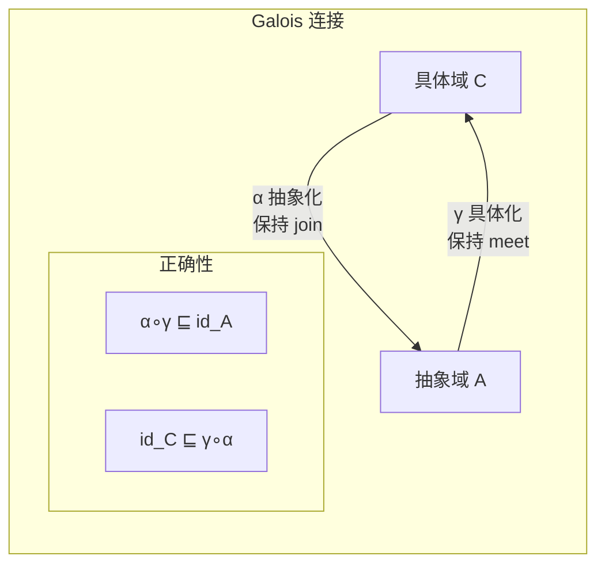
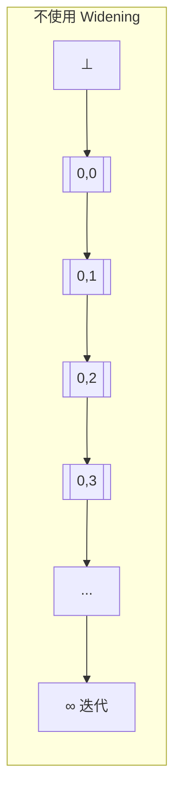
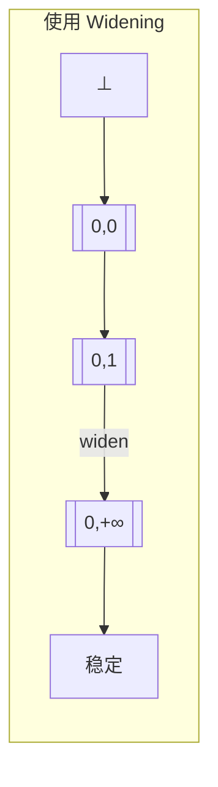
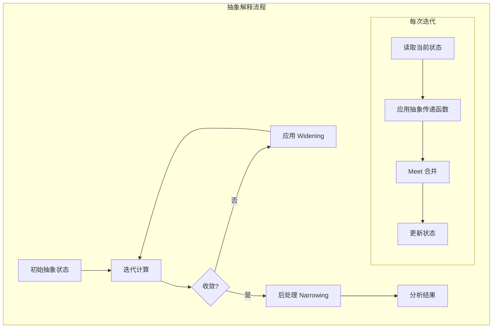
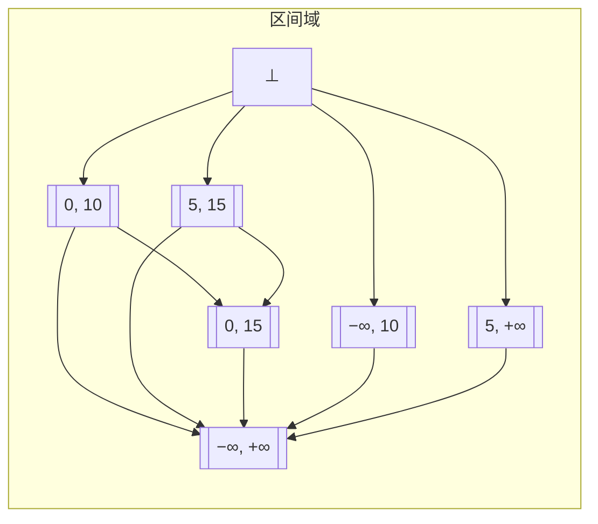

# 抽象解释理论 (Abstract Interpretation Theory)

> **所属阶段**: 03-model-taxonomy/02-computation-models | **前置依赖**: [01-order-theory.md](../../01-foundations/01-order-theory.md), [dataflow-analysis-formal.md](./dataflow-analysis-formal.md) | **形式化等级**: L5-L6

## 1. 概念定义 (Definitions)

### 1.1 Galois 连接

**Def-F-AI-01: Galois 连接**

设 $(C, \sqsubseteq_C)$ 和 $(A, \sqsubseteq_A)$ 是两个偏序集。函数对 $(\alpha, \gamma)$ 构成 Galois 连接，记作：
$$(C, \sqsubseteq_C) \xtofrom[\gamma]{\alpha} (A, \sqsubseteq_A)$$

当且仅当满足以下等价条件之一：

1. **主要定义**: $\forall c \in C, a \in A: \alpha(c) \sqsubseteq_A a \Leftrightarrow c \sqsubseteq_C \gamma(a)$
2. **伴随性质**: $\alpha$ 和 $\gamma$ 都是单调的，且 $\alpha \circ \gamma \sqsubseteq \text{id}_A$，$\text{id}_C \sqsubseteq \gamma \circ \alpha$
3. **抽象化是最优上近似**: $\alpha(c) = \sqcap\{a \in A \mid c \sqsubseteq \gamma(a)\}$
4. **具体化是最优下近似**: $\gamma(a) = \sqcup\{c \in C \mid \alpha(c) \sqsubseteq a\}$

**Def-F-AI-02: Galois 插入 (Insertion)**

当 $\alpha \circ \gamma = \text{id}_A$ 时，称为 Galois 插入，此时抽象域没有冗余：
$$\forall a \in A: \alpha(\gamma(a)) = a$$

**Def-F-AI-03: Galois 连接的组合**

给定两个 Galois 连接：
$$(C) \xtofrom[\gamma_1]{\alpha_1} (A_1) \xtofrom[\gamma_2]{\alpha_2} (A_2)$$

其组合为：
$$(C) \xtofrom[\gamma_1 \circ \gamma_2]{\alpha_2 \circ \alpha_1} (A_2)$$

### 1.2 抽象域设计

**Def-F-AI-04: 抽象域 (Abstract Domain)**

抽象域是一个四元组 $(A, \sqsubseteq_A, \bot_A, \top_A)$，其中：

- $A$: 抽象值集合
- $\sqsubseteq_A$: 偏序关系 (信息序)
- $\bot_A$: 最小元 (无信息)
- $\top_A$: 最大元 (不确定)

**Def-F-AI-05: 常见抽象域**

| 抽象域 | 描述 | 用途 |
|--------|------|------|
| 符号域 | $\{\bot, -, 0, +, \top\}$ | 符号分析 |
| 常量域 | $\mathbb{C} \cup \{\bot, \top\}$ | 常量传播 |
| 区间域 | $[l, u]$ 其中 $l, u \in \mathbb{Z} \cup \{-\infty, +\infty\}$ | 范围分析 |
| 八边形域 | $\pm x_i \pm x_j \leq c$ | 关系分析 |
| 多面体域 | 线性不等式约束 | 线性关系分析 |
| 指针域 | 指向集合 | 别名分析 |

**Def-F-AI-06: 区间抽象域 (Interval Domain)**

区间域定义为：
$$\text{Interval} = \{[l, u] \mid l \in \mathbb{Z} \cup \{-\infty\}, u \in \mathbb{Z} \cup \{+\infty\}, l \leq u\} \cup \{\bot\}$$

序关系：$[l_1, u_1] \sqsubseteq [l_2, u_2] \Leftrightarrow l_2 \leq l_1 \land u_1 \leq u_2$

Meet 运算：$[l_1, u_1] \sqcap [l_2, u_2] = [\max(l_1, l_2), \min(u_1, u_2)]$ (若有效)

Join 运算：$[l_1, u_1] \sqcup [l_2, u_2] = [\min(l_1, l_2), \max(u_1, u_2)]$

### 1.3 Widening 与 Narrowing

**Def-F-AI-07: Widening 算子 ($\nabla$)**

Widening 算子 $\nabla: A \times A \to A$ 满足：

1. **外延性**: $\forall a, b: a \sqsubseteq a \nabla b$ 且 $b \sqsubseteq a \nabla b$
2. **终止性**: 对任何递增序列 $(a_n)$，序列 $b_0 = a_0$, $b_{n+1} = b_n \nabla a_{n+1}$ 在有限步后稳定

**Def-F-AI-08: 标准区间 Widening**

对区间域，标准 widening：
$$[l_1, u_1] \nabla [l_2, u_2] = [\text{widen}_L(l_1, l_2), \text{widen}_U(u_1, u_2)]$$

其中：
$$\text{widen}_L(l_1, l_2) = \begin{cases} l_1 & \text{if } l_1 \leq l_2 \\ -\infty & \text{if } l_2 < l_1 \end{cases}$$

$$\text{widen}_U(u_1, u_2) = \begin{cases} u_1 & \text{if } u_2 \leq u_1 \\ +\infty & \text{if } u_1 < u_2 \end{cases}$$

**Def-F-AI-09: Narrowing 算子 ($\Delta$)**

Narrowing 算子 $\Delta: A \times A \to A$ 满足：

1. **内延性**: $\forall a, b: a \Delta b \sqsubseteq a$
2. **保持性**: 若 $b \sqsubseteq a$，则 $a \Delta b \sqsupseteq b$
3. **终止性**: 对递减序列稳定

**Def-F-AI-10: 标准区间 Narrowing**

$$[l_1, u_1] \Delta [l_2, u_2] = [\text{narrow}_L(l_1, l_2), \text{narrow}_U(u_1, u_2)]$$

其中：
$$\text{narrow}_L(l_1, l_2) = \begin{cases} l_2 & \text{if } l_1 = -\infty \\ l_1 & \text{otherwise} \end{cases}$$

$$\text{narrow}_U(u_1, u_2) = \begin{cases} u_2 & \text{if } u_1 = +\infty \\ u_1 & \text{otherwise} \end{cases}$$

### 1.4 抽象解释的安全性

**Def-F-AI-11: 最佳抽象 (Best Abstract)**

函数 $f^\#: A \to A$ 是 $f: C \to C$ 的**最佳抽象**，当且仅当：
$$f^\# = \alpha \circ f \circ \gamma$$

**Def-F-AI-12: 正确抽象 (Correct Abstract)**

$f^\#$ 是 $f$ 的**正确抽象**，当且仅当：
$$\alpha \circ f \sqsubseteq f^\# \circ \alpha$$

或等价地：
$$f \circ \gamma \sqsubseteq \gamma \circ f^\#$$

**Def-F-AI-13: 计算抽象 (Computational Abstract)**

抽象解释的三要素：

1. **值抽象**: $\alpha_V: \text{具体值} \to \text{抽象值}$
2. **操作抽象**: 每个具体操作 $op$ 有抽象版本 $op^\#$
3. **控制流抽象**: 循环、条件等控制结构的抽象

## 2. 属性推导 (Properties)

### 2.1 Galois 连接的基本性质

**Lemma-F-AI-01: Galois 连接的基本性质**

对 Galois 连接 $(C) \xtofrom[\gamma]{\alpha} (A)$：

1. $\alpha$ 保持上确界 (join): $\alpha(\sqcup_C S) = \sqcup_A \{\alpha(c) \mid c \in S\}$
2. $\gamma$ 保持下确界 (meet): $\gamma(\sqcap_A T) = \sqcap_C \{\gamma(a) \mid a \in T\}$
3. $\alpha$ 是满射 $\Leftrightarrow$ $\gamma$ 是单射 $\Leftrightarrow$ 是 Galois 插入

*证明概要*: 由 Galois 连接的定义和伴随性质直接推导。∎

**Lemma-F-AI-02: 抽象函数的唯一性**

给定 $\alpha$，对应的 $\gamma$ 唯一：
$$\gamma(a) = \sqcup\{c \in C \mid \alpha(c) \sqsubseteq a\}$$

类似地，给定 $\gamma$，$\alpha$ 也唯一。

### 2.2 抽象解释的正确性

**Lemma-F-AI-03: 最佳抽象的正确性**

最佳抽象 $f^\# = \alpha \circ f \circ \gamma$ 总是正确的。

*证明*:
$$\alpha \circ f \sqsubseteq \alpha \circ f \circ \gamma \circ \alpha = f^\# \circ \alpha$$

由 $\text{id} \sqsubseteq \gamma \circ \alpha$。∎

**Prop-F-AI-01: 正确抽象的传递**

若 $f^\#$ 正确抽象 $f$，$g^\#$ 正确抽象 $g$，则 $g^\# \circ f^\#$ 正确抽象 $g \circ f$。

### 2.3 Widening 的性质

**Lemma-F-AI-04: Widening 保证收敛**

对任何递增序列 $a_0 \sqsubseteq a_1 \sqsubseteq \cdots$，由 widening 构造的序列：
$$b_0 = a_0, \quad b_{n+1} = b_n \nabla a_{n+1}$$

在有限步后稳定。

**Prop-F-AI-02: Widening 引入的过近似**

Widening 可能引入过近似：
$$\text{lfp}(f) \sqsubseteq \text{lfp}_\nabla(f^\#)$$

其中 $\text{lfp}_\nabla$ 表示使用 widening 计算的不动点。

### 2.4 抽象域的精度比较

**Prop-F-AI-03: 抽象域的精度层级**

不同抽象域的精度关系：

$$\text{Sign} \prec \text{Constant} \prec \text{Interval} \prec \text{Octagon} \prec \text{Polyhedron} \prec \text{Congruence}$$

其中 $\prec$ 表示"比...粗糙"。

**Prop-F-AI-04: 精度-效率权衡**

| 抽象域 | 精度 | 计算复杂度 | 应用场景 |
|--------|------|-----------|----------|
| 符号域 | 低 | O(1) | 快速粗略分析 |
| 区间域 | 中 | O(n) | 数组边界检查 |
| 八边形域 | 中高 | O(n²) | 简单关系分析 |
| 多面体域 | 高 | 指数级 | 精确线性关系 |

## 3. 关系建立 (Relations)

### 3.1 抽象解释与数据流分析

**Prop-F-AI-05: 数据流分析是抽象解释的特例**

数据流分析框架：

- 具体域: 程序状态集合的幂集
- 抽象域: 数据流格 $L$
- 抽象化: 聚合等价状态
- 合并: 路径聚合的抽象

### 3.2 抽象解释与类型系统

**Prop-F-AI-06: 类型即抽象解释**

| 类型系统 | 抽象解释对应 |
|----------|-------------|
| 类型 | 抽象值 |
| 类型推导 | 抽象计算 |
| 类型检查 | 正确性验证 |
| 子类型 | 偏序关系 |
| 多态 | 参数化抽象 |

### 3.3 不同抽象域的关系

**Prop-F-AI-07: 抽象域的约化积 (Reduced Product)**

给定抽象域 $A_1$ 和 $A_2$，其约化积 $A_1 \times_r A_2$ 是：

$$A_1 \times_r A_2 = \{(a_1, a_2) \mid \gamma_1(a_1) \cap \gamma_2(a_2) \neq \emptyset\}$$

约化操作消除不一致的组合。

### 3.4 抽象解释在验证中的应用

| 应用领域 | 使用的抽象域 | 工具 |
|----------|-------------|------|
| 数组越界检查 | 区间域 | Astree |
| 除零检查 | 区间域 | Polyspace |
| 空指针检查 | 指针域 | Infer |
| 资源泄漏 | 线性类型 | Rust 编译器 |
| 并发安全 | 形状分析 | Facebook Infer |

## 4. 论证过程 (Argumentation)

### 4.1 为什么需要抽象解释?

**问题**: 程序分析通常是不可判定的 (停机问题)。

**解决方案**: 抽象解释提供：

1. **系统化的近似方法**
2. **可调精度的分析**
3. **保证 soundness**

### 4.2 Galois 连接的重要性

**最优近似**: Galois 连接保证抽象化是最佳上近似，具体化是最佳下近似。

**可组合性**: Galois 连接可以组合，支持分层抽象。

### 4.3 Widening 的设计考量

**设计原则**:

1. **快速收敛**: 减少迭代次数
2. **保持精度**: 不过度过近似
3. **通用性**: 适用于不同程序模式

**常见策略**:

- 阈值 widening: 在预定义阈值处展开
- 延迟 widening: 延迟若干次迭代后使用
- 选择性 widening: 只在循环头使用

### 4.4 抽象域选择策略

**选择维度**:

1. **精度需求**: 需要证明的性质
2. **性能预算**: 时间和空间限制
3. **程序特征**: 数值计算、指针操作等

**组合策略**:

- 使用简单抽象域快速排除不可能路径
- 对关键路径使用精细抽象域

## 5. 形式证明 / 工程论证 (Proof / Engineering Argument)

### 5.1 抽象解释的安全性定理

**Thm-F-AI-01: 抽象解释的安全性**

设 $(\alpha, \gamma)$ 是 Galois 连接，$f^\#$ 是 $f$ 的正确抽象，则：
$$\forall c \in C: \alpha(f(c)) \sqsubseteq f^\#(\alpha(c))$$

*证明*:

由正确抽象定义：$\alpha \circ f \sqsubseteq f^\# \circ \alpha$

对任意 $c \in C$：
$$\alpha(f(c)) \sqsubseteq f^\#(\alpha(c))$$

这正是安全性条件。∎

**推论**: 若 $f^\#(a) \sqsubseteq a'$，则 $f(\gamma(a)) \sqsubseteq \gamma(a')$。

### 5.2 Widening 的终止性

**Thm-F-AI-02: Widening 保证终止**

设 $(A, \sqsubseteq)$ 是有限高度或满足 ACC (升链条件) 的完全格，$\nabla$ 是 widening 算子。

对任何递增序列 $a_0 \sqsubseteq a_1 \sqsubseteq \cdots$，构造：
$$b_0 = a_0, \quad b_{n+1} = b_n \nabla a_{n+1}$$

则存在 $N$ 使得 $\forall n \geq N: b_n = b_N$。

*证明概要*:

由 widening 的终止性定义，序列 $(b_n)$ 必须稳定。

标准证明使用超限归纳：

- 若 $a_{n+1} \sqsubseteq b_n$，则 $b_{n+1} = b_n \nabla a_{n+1} = b_n$
- 若 $a_{n+1} \not\sqsubseteq b_n$，则 $b_n \sqsubset b_{n+1}$
- 由升链条件，严格增长序列有限

∎

### 5.3 最佳抽象的存在性

**Thm-F-AI-03: 最佳抽象的存在性**

对任何具体函数 $f: C \to C$ 和 Galois 连接 $(\alpha, \gamma)$，最佳抽象：
$$f^\# = \alpha \circ f \circ \gamma$$

存在且唯一。

*证明*:

**存在性**: 由函数复合定义。

**唯一性**: 假设 $g^\#$ 也是最佳抽象，则：
$$g^\# = \alpha \circ f \circ \gamma = f^\#$$

**最优性**: 对任何正确抽象 $h^\#$：
$$f^\# = \alpha \circ f \circ \gamma \sqsubseteq h^\# \circ \alpha \circ \gamma \sqsubseteq h^\#$$

∎

### 5.4 区间分析的 Soundness

**Thm-F-AI-04: 区间分析的 Soundness**

区间抽象是 sound 的：若区间分析推断变量 $x$ 的值为 $[l, u]$，则运行时 $x$ 的实际值 $v$ 满足 $l \leq v \leq u$。

*证明概要*:

对基本操作验证：

1. **常量**: $\alpha(c) = [c, c]$
2. **加法**: $[l_1, u_1] +^\# [l_2, u_2] = [l_1 + l_2, u_1 + u_2]$
   - 若 $v_1 \in [l_1, u_1]$，$v_2 \in [l_2, u_2]$，则 $v_1 + v_2 \in [l_1 + l_2, u_1 + u_2]$
3. **乘法**: 考虑符号情况

由归纳，所有操作保持 soundness。∎

## 6. 实例验证 (Examples)

### 6.1 符号抽象示例

**符号域**: $\{\bot, -, 0, +, \top\}$

抽象化：

```
α(n) = ⊥  if n is undefined
α(n) = -  if n < 0
α(n) = 0  if n = 0
α(n) = +  if n > 0
α(n) = ⊤  if unknown
```

**操作抽象** (加法):

```
- + - = -
- + 0 = -
- + + = ⊤
0 + x = x
...
```

### 6.2 区间分析示例

```
1: x = [0, 0]
2: y = [10, 10]
3: while (x < y)
4:   x = x + 1
5: return x
```

迭代过程：

| 迭代 | x (进入循环) | x (退出循环) |
|------|-------------|--------------|
| 0 | ⊥ | ⊥ |
| 1 | [0, 0] | [1, 1] |
| 2 | [0, 1] | [1, 2] |
| ... | ... | ... |
| ∞ | [0, 10] | [1, 11] |

使用 Widening 后加速收敛到 [0, +∞]。

### 6.3 Widening 应用示例

**不加 Widening**:

```
x = 0
while (true):
  x = x + 1
```

迭代: [0,0], [0,1], [0,2], [0,3], ... 永不收敛

```

**使用 Widening**:
```

b₀ = [0, 0]
b₁ = [0, 0] ∇ [0, 1] = [0, 1]
b₂ = [0, 1] ∇ [0, 2] = [0, 2]  ̸
     = [0, +∞)  (upper bound widens to +∞)

```

两步后收敛到 [0, +∞]。

### 6.4 数组越界检查示例

```c
void process(int n) {
  int arr[100];
  for (int i = 0; i < n; i++) {
    arr[i] = i;  // 需要证明 i ∈ [0, 99]
  }
}
```

区间分析：

- $i$ 在循环入口: [0, n-1]
- $n$ 的范围: 若 $n \leq 100$，则安全
- 分析可推断: 若 $n \leq 100$，无越界

### 6.5 多抽象域组合示例

```
使用符号域快速判断: x 为正数
使用区间域精确计算: x ∈ [10, 100]
使用八边形域推断关系: x - y ≤ 5
```

组合结果: $x \in [10, 100]$, $x > 0$, $y \geq x - 5$

## 7. 可视化 (Visualizations)

### Galois 连接结构



### 抽象域精度层级

```mermaid
graph BT
    subgraph 抽象域精度层级
    Sign[符号域<br/>{-,0,+}]
    Const[常量域<br/>{c₁,c₂,...}]
    Interval[区间域<br/>[l,u]]
    Octagon[八边形域<br/>±xᵢ±xⱼ≤c]
    Poly[多面体域<br/>线性约束]

    Sign --> Const
    Const --> Interval
    Interval --> Octagon
    Octagon --> Poly
    end
```

### Widening 效果示意图





### 抽象解释计算流程



### 区间域结构



## 8. 引用参考 (References)
