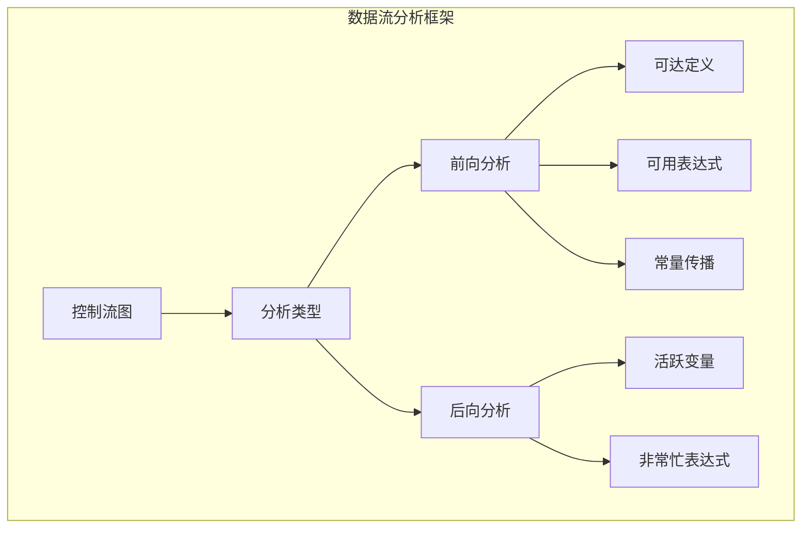
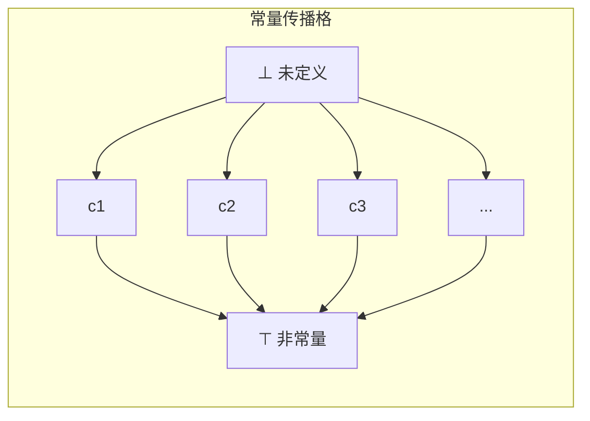

# Stanford CS240: 数据流分析形式化 (Dataflow Analysis Formalization)

> **所属阶段**: 03-model-taxonomy/02-computation-models | **前置依赖**: [01-order-theory.md](../../01-foundations/01-order-theory.md) | **形式化等级**: L4-L5
>
> **课程来源**: Stanford CS240 (Advanced Topics in Operating Systems) - Program Analysis Module

## 1. 概念定义 (Definitions)

### 1.1 数据流分析框架

**Def-Stanford-02-01: 控制流图 (Control Flow Graph, CFG)**

程序 $P$ 的控制流图是一个四元组 $G = (N, E, n_{entry}, n_{exit})$：

- $N$: 基本块 (basic blocks) 的有限集合
- $E \subseteq N \times N$: 控制流边
- $n_{entry} \in N$: 唯一入口节点
- $n_{exit} \in N$: 唯一出口节点

**Def-Stanford-02-02: 数据流问题实例**

数据流问题是一个五元组 $(G, L, \wedge, F, M)$：

| 组件 | 类型 | 说明 |
|------|------|------|
| $G = (N, E)$ | CFG | 控制流图 |
| $L$ | 完全格 | 数据流值的集合 |
| $\wedge: L \times L \to L$ | 交运算 | 聚合多个前驱的信息 |
| $F: L \to L$ | 传递函数族 | 沿边的信息变换 |
| $M: N \to (L \to L)$ | 节点标记 | 每个节点的传递函数 |

**Def-Stanford-02-03: 前向 vs 后向分析**

| 分析方向 | 信息流 | 约束方程形式 |
|----------|--------|-------------|
| 前向 | 沿控制流 | $\text{OUT}[n] = f_n(\wedge_{p \in pred(n)} \text{OUT}[p])$ |
| 后向 | 逆控制流 | $\text{IN}[n] = f_n(\wedge_{s \in succ(n)} \text{IN}[s])$ |

### 1.2 单调框架理论

**Def-Stanford-02-04: 单调数据流框架**

数据流框架 $(L, \wedge, F)$ 是**单调的**，当且仅当：

1. $(L, \sqsubseteq)$ 是完全格，其中 $x \sqsubseteq y \Leftrightarrow x \wedge y = x$
2. $F \subseteq L \to L$ 中的每个函数 $f$ 都是单调的：
   $$x \sqsubseteq y \Rightarrow f(x) \sqsubseteq f(y)$$

**Def-Stanford-02-05: 分配性 (Distributivity)**

函数 $f: L \to L$ 是**分配的**，当且仅当：
$$f(x \wedge y) = f(x) \wedge f(y)$$

框架是分配框架 $\Leftrightarrow$ 所有 $f \in F$ 都是分配的。

**Def-Stanford-02-06: 数据流方程系统**

对于前向分析：

$$\begin{aligned}
\text{OUT}[n] &= f_n(\text{IN}[n]) \\
\text{IN}[n] &= \bigwedge_{p \in pred(n)} \text{OUT}[p]
\end{aligned}$$

边界条件：$\text{IN}[n_{entry}] = \text{INIT}$ (初始值)

### 1.3 抽象解释基础

**Def-Stanford-02-07: 具体域与抽象域**

| 概念 | 符号 | 说明 |
|------|------|------|
| 具体域 | $(C, \sqsubseteq_C)$ | 实际程序状态集合 |
| 抽象域 | $(A, \sqsqsubseteq_A)$ | 抽象性质的集合 |
| 抽象化 | $\alpha: C \to A$ | 具体 → 抽象 |
| 具体化 | $\gamma: A \to C$ | 抽象 → 具体 |

**Def-Stanford-02-08: Galois 连接**

$(\alpha, \gamma)$ 构成 Galois 连接，当且仅当：
$$\forall c \in C, a \in A: \alpha(c) \sqsubseteq_A a \Leftrightarrow c \sqsubseteq_C \gamma(a)$$

等价形式：$c \sqsubseteq \gamma(\alpha(c))$ 且 $\alpha(\gamma(a)) \sqsubseteq a$

**Def-Stanford-02-09: 抽象解释的正确性**

抽象语义 $f^\#: A \to A$ 是具体语义 $f: C \to C$ 的**正确抽象**：
$$\alpha \circ f \sqsubseteq f^\# \circ \alpha$$

或等价地：
$$f \circ \gamma \sqsubseteq \gamma \circ f^\#$$

### 1.4 经典数据流分析实例

**Def-Stanford-02-10: 可达定义分析 (Reaching Definitions)**

| 组件 | 定义 |
|------|------|
| 数据流值 | 程序点处可达的定义集合 |
| 格 | $(2^D, \subseteq)$，$D$ 是所有定义的集合 |
| 交运算 | $\cup$ (并集) |
| 传递函数 | $\text{gen}[n]$ 生成新定义，$\text{kill}[n]$ 杀死旧定义 |
| 方程 | $\text{OUT}[n] = \text{gen}[n] \cup (\text{IN}[n] \setminus \text{kill}[n])$ |

**Def-Stanford-02-11: 活跃变量分析 (Live Variables)**

| 组件 | 定义 |
|------|------|
| 数据流值 | 程序点处活跃的变量集合 |
| 格 | $(2^V, \subseteq)$，$V$ 是所有变量的集合 |
| 交运算 | $\cup$ (并集) - 后向分析 |
| 传递函数 | 变量在 $n$ 中被使用 → 活跃 |
| 方程 | $\text{IN}[n] = \text{use}[n] \cup (\text{OUT}[n] \setminus \text{def}[n])$ |

**Def-Stanford-02-12: 可用表达式分析 (Available Expressions)**

| 组件 | 定义 |
|------|------|
| 数据流值 | 程序点处可用的表达式集合 |
| 格 | $(2^E, \supseteq)$ - 必须所有路径都可用 |
| 交运算 | $\cap$ (交集) |
| 传递函数 | 表达式被计算 → 可用；操作数被修改 → 不可用 |
| 方程 | $\text{OUT}[n] = \text{gen}[n] \cup (\text{IN}[n] \setminus \text{kill}[n])$ |

**Def-Stanford-02-13: 常量传播 (Constant Propagation)**

| 组件 | 定义 |
|------|------|
| 数据流值 | $V \to (\mathbb{C} \cup \{\top, \bot\})$ |
| 格 | 映射格，每个变量的值：常量 $c$ / 非常量 $\top$ / 未定义 $\bot$ |
| 交运算 | 逐点 meet：$c \wedge c = c$，$c_1 \wedge c_2 = \top$ (若 $c_1 \neq c_2$) |
| 传递函数 | 常量赋值 → 映射更新；非常量赋值 → 映射清除 |
| 方向 | 前向分析 |

常量格结构：
```
        ⊤
       /|\
      / | \
     c1 c2 c3 ...
      \ | /
        ⊥
```

## 2. 属性推导 (Properties)

### 2.1 单调框架的基本性质

**Lemma-Stanford-02-01: 单调性保持**

若 $f, g: L \to L$ 都是单调的，则：
1. $f \circ g$ 是单调的
2. $\lambda x. f(x) \wedge g(x)$ 是单调的

*证明*: 直接由单调性定义可得。∎

**Lemma-Stanford-02-02: 不动点存在性**

对单调数据流框架，最大解存在且唯一。

*证明概要*: 由 Tarski 不动点定理，单调函数在完全格上有最大和最小不动点。∎

### 2.2 迭代算法收敛性

**Lemma-Stanford-02-03: 迭代收敛**

对单调框架，迭代算法：

```
初始化：所有 OUT[n] = ⊥ (或 T)
重复：
  对每个节点 n:
    IN[n] = ∧_{p∈pred(n)} OUT[p]
    OUT_new[n] = f_n(IN[n])
直到所有 OUT[n] 不再变化
```

必定在有限步内收敛。

*证明概要*:
- 每次迭代产生单调递增 (或递减) 序列
- 完全格上升 (下降) 链有限

### 2.3 分配性与 MOP 解

**Prop-Stanford-02-01: 分配性蕴含 MOP = MFP**

若框架是分配的，则最大不动点解 (MFP) 等于合并所有路径解 (MOP)：
$$\text{MFP} = \text{MOP} = \bigwedge_{p \in paths} f_p(\text{INIT})$$

其中 $f_p$ 是路径 $p$ 上所有传递函数的复合。

**Prop-Stanford-02-02: 非分配框架**

常量传播框架不是分配的：

反例：若 $x = 1$ 沿一条路径，$x = 2$ 沿另一条路径，则：
$$f(x \wedge y) \neq f(x) \wedge f(y)$$

### 2.4 抽象解释的安全性

**Prop-Stanford-02-03: 抽象解释的安全性保证**

若抽象语义正确，则：
$$\text{分析结果} \sqsupseteq \text{实际可能值}$$

即分析是保守的 (sound)，可能过近似但不过近似。

## 3. 关系建立 (Relations)

### 3.1 数据流分析与抽象解释

**Prop-Stanford-02-04: 数据流分析是抽象解释的特例**

数据流框架 $(L, \wedge, F)$ 对应抽象解释：
- 抽象域 $A = L$
- 抽象操作 $f^\# = f \in F$
- 合并操作 $\wedge$ 对应路径聚合

### 3.2 不同类型分析的对比

| 分析 | 方向 | 格运算 | 分配性 | 精度 |
|------|------|--------|--------|------|
| 可达定义 | 前向 | $\cup$ | 是 | 精确 |
| 活跃变量 | 后向 | $\cup$ | 是 | 精确 |
| 可用表达式 | 前向 | $\cap$ | 是 | 精确 |
| 常量传播 | 前向 | 特殊 | 否 | 近似 |
| 指针分析 | 前向 | $\cup$ | 否 | 高度近似 |

### 3.3 编译器优化应用

| 分析类型 | 驱动的优化 |
|----------|-----------|
| 可达定义 | 复制传播、无用赋值消除 |
| 活跃变量 | 寄存器分配、死代码消除 |
| 可用表达式 | 公共子表达式消除 |
| 常量传播 | 常量折叠、死代码消除 |
| 区间分析 | 数组边界检查消除 |

### 3.4 与类型系统的关系

**Prop-Stanford-02-05: 类型即抽象解释**

类型系统可视为抽象解释的特例：
- 抽象域 = 类型集合
- 抽象化 = 类型推导
- 安全性 = 类型安全性

## 4. 论证过程 (Argumentation)

### 4.1 为什么需要单调框架?

**数学基础**: 单调性保证不动点存在和迭代收敛。

**算法保证**: Worklist 算法在单调框架上总能终止。

### 4.2 分配性的重要性

**优势**: 分配框架下，MFP = MOP，分析更精确。

**现实**: 许多有用分析 (常量传播、指针分析) 不是分配的。

**权衡**: 精度 vs 可计算性。

### 4.3 抽象解释的工程设计

**设计空间**:
1. **抽象域选择**: 粒度 vs 效率
2. ** widening**: 保证终止但损失精度
3. ** narrowing**: 恢复部分精度

**实际考虑**:
- 程序规模
- 期望精度
- 时间预算

### 4.4 常量传播的特殊性

常量传播是**非分配**但**有用**的典型例子：

```
      x = 1
     /     \
x = 2       x = 3
     \     /
      y = x + 1
```

在汇合点，$x$ 的值是 $\top$ (非常量)，导致 $y$ 也是 $\top$。

虽然损失了精度，但仍是 sound 的。

## 5. 形式证明 / 工程论证 (Proof / Engineering Argument)

### 5.1 迭代算法的正确性

**Thm-Stanford-02-01: 迭代算法收敛性**

对有限高度完全格上的单调框架，迭代算法在至多 $h \cdot |N|$ 步内收敛，其中 $h$ 是格高度。

*证明*:

**步骤1**: 证明序列单调。
- 初始值 $\bot$ (或 $\top$)
- 每次迭代值单调递增 (递减)

**步骤2**: 证明有上界 (下界)。
- 不动点是上界
- 完全格保证存在最小上界

**步骤3**: 由有限高度保证有限收敛。

∎

### 5.2 MOP 与 MFP 的关系

**Thm-Stanford-02-02: 分配框架的 MOP=MFP**

若框架是分配的，则迭代算法得到的 MFP 等于 MOP。

*证明概要*:

设路径 $p = n_1 \to n_2 \to \cdots \to n_k$，$f_p = f_{n_k} \circ \cdots \circ f_{n_1}$。

由分配性：
$$f_n(\wedge_{p \in pred(n)} f_p(\text{INIT})) = \wedge_{p \in pred(n)} f_n(f_p(\text{INIT}))$$

这表明节点级 meet 与路径级 meet 可交换，因此 MFP = MOP。∎

### 5.3 抽象解释的安全性

**Thm-Stanford-02-03: 抽象解释安全性**

若 $(\alpha, \gamma)$ 是 Galois 连接，$f^\#$ 是 $f$ 的正确抽象，则：
$$\alpha(f(c)) \sqsubseteq f^\#(\alpha(c))$$

即抽象计算保守地过近似具体计算。

*证明*:

由正确抽象定义：$\alpha \circ f \sqsubseteq f^\# \circ \alpha$

直接展开即得。∎

### 5.4 常量传播分析的 Soundness

**Thm-Stanford-02-04: 常量传播的 Soundness**

常量传播分析是 sound 的：若分析推断变量 $x$ 在程序点 $p$ 的值为常量 $c$，则实际执行中 $x$ 在 $p$ 确实等于 $c$。

*证明概要*:

1. 抽象域定义了正确的过近似
2. 每个传递函数保持 soundness
3. meet 操作保持 soundness
4. 由归纳，整个分析是 sound 的

注意：分析可能报告 $\top$ (非常量) 即使实际是常量，这是 precision 问题而非 soundness 问题。∎

## 6. 实例验证 (Examples)

### 6.1 可达定义分析示例

```
1: x = 5
2: y = x + 1
3: x = 10
4: z = x + y
```

分析结果：
| 点 | IN | OUT |
|----|-----|-----|
| 1 | {} | {x=5} |
| 2 | {x=5} | {x=5, y=6} |
| 3 | {x=5, y=6} | {x=10, y=6} |
| 4 | {x=10, y=6} | {x=10, y=6, z=16} |

### 6.2 活跃变量分析示例

```
1: x = a + b
2: y = x * 2
3: z = y + 1
4: return z
```

后向分析：
| 点 | OUT | IN |
|----|-----|-----|
| 4 | {} | {z} |
| 3 | {z} | {y} |
| 2 | {y} | {x} |
| 1 | {x} | {a, b} |

变量 $x, y$ 在退出后不再活跃，可重用寄存器。

### 6.3 常量传播分析示例

```
1: x = 5
2: y = 10
3: if (cond)
4:   x = 20
5: z = x + y
```

分析结果 (非分配)：
| 点 | x | y | z |
|----|---|---|---|
| 1 | 5 | ⊤ | ⊥ |
| 2 | 5 | 10 | ⊥ |
| 3 | ⊤ | 10 | ⊥ |
| 4 | 20 | 10 | ⊥ |
| 5 | ⊤ | 10 | ⊤ |

由于 $x$ 在不同路径上取值不同 (5 vs 20)，汇合后为 ⊤。

### 6.4 Galois 连接示例

**符号抽象 (Sign Abstraction)**:

具体域: 整数 $C = \mathbb{Z}$
抽象域: $A = \{\bot, -, 0, +, \top\}$

抽象化：
- $\alpha(n) = -$ if $n < 0$
- $\alpha(n) = 0$ if $n = 0$
- $\alpha(n) = +$ if $n > 0$

具体化：
- $\gamma(\bot) = \emptyset$
- $\gamma(-) = \{n \mid n < 0\}$
- $\gamma(0) = \{0\}$
- $\gamma(+) = \{n \mid n > 0\}$
- $\gamma(\top) = \mathbb{Z}$

抽象操作 (加法):
| + | ⊥ | - | 0 | + | ⊤ |
|---|---|---|---|---|---|
| ⊥ | ⊥ | ⊥ | ⊥ | ⊥ | ⊥ |
| - | ⊥ | - | - | ⊤ | ⊤ |
| 0 | ⊥ | - | 0 | + | ⊤ |
| + | ⊥ | ⊤ | + | + | ⊤ |
| ⊤ | ⊥ | ⊤ | ⊤ | ⊤ | ⊤ |

### 6.5 Worklist 算法示例

```python
# Worklist 算法伪代码
def worklist_algorithm(cfg, transfer_functions, meet):
    IN = {n: ⊥ for n in cfg.nodes}
    OUT = {n: ⊥ for n in cfg.nodes}
    worklist = set(cfg.nodes)

    while worklist:
        n = worklist.pop()

        # 计算新的 IN
        if n == cfg.entry:
            new_in = INIT
        else:
            new_in = meet([OUT[p] for p in pred(n)])

        # 计算新的 OUT
        new_out = transfer_functions[n](new_in)

        # 如果变化，加入后继节点
        if new_out ≠ OUT[n]:
            OUT[n] = new_out
            worklist.add(succ(n))

    return IN, OUT
```

## 7. 可视化 (Visualizations)

### 数据流分析概览



### 单调框架结构

```mermaid
graph BT
    subgraph 单调数据流框架
    L[完全格 L]
    Meet[Meet 运算 ∧]
    F[传递函数集 F]

    L --> Meet
    L --> F

    subgraph 关键性质
    P1[单调性: x⊑y ⇒ f(x)⊑f(y)]
    P2[不动点存在性]
    P3[迭代收敛性]
    end
    end
```

### 常量传播格结构



### 抽象解释框架

```mermaid
graph LR
    subgraph Galois 连接
    C[具体域 C]
    A[抽象域 A]

    C -->|α 抽象化| A
    A -->|γ 具体化| C

    subgraph 正确性条件
    E1[α ∘ f ⊑ f# ∘ α]
    E2[α(c) ⊑ a ⇔ c ⊑ γ(a)]
    end
    end
```

### 前向分析数据流

```mermaid
graph LR
    subgraph 前向数据流
    P1[OUT[p1]] --> Meet[∧]
    P2[OUT[p2]] --> Meet
    Meet --> IN[n]
    IN --> Transfer[fn]
    Transfer --> OUT[n]
    OUT --> Succ[后继节点]
    end
```

## 8. 引用参考 (References)

[^1]: Stanford CS240 Lecture Notes, "Advanced Topics in Operating Systems", 2024. https://web.stanford.edu/class/cs240/

[^2]: M. S. Hecht, "Flow Analysis of Computer Programs", Elsevier North-Holland, 1977.

[^3]: K. Kennedy, "A Survey of Data Flow Analysis Techniques", IBM Research Report, 1978.

[^4]: P. Cousot, R. Cousot, "Abstract Interpretation: A Unified Lattice Model for Static Analysis", POPL 1977.

[^5]: P. Cousot, R. Cousot, "Systematic Design of Program Analysis Frameworks", POPL 1979.

[^6]: F. Nielson, H. R. Nielson, C. Hankin, "Principles of Program Analysis", Springer, 1999.

[^7]: M. N. Wegman, F. K. Zadeck, "Constant Propagation with Conditional Branches", TOPLAS 1991.

[^8]: B. Steensgaard, "Points-to Analysis in Almost Linear Time", POPL 1996.

[^9]: A. Aho, M. Lam, R. Sethi, J. Ullman, "Compilers: Principles, Techniques, and Tools" (Dragon Book), 2nd Edition, 2006.

[^10]: S. Muchnick, "Advanced Compiler Design and Implementation", Morgan Kaufmann, 1997.
