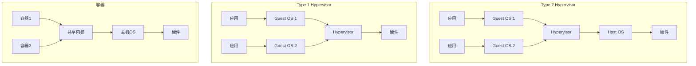
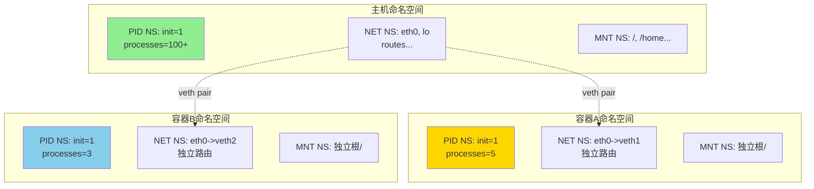

# 虚拟化形式化

> **所属单元**: formal-methods/03-model-taxonomy/03-resource-deployment | **前置依赖**: [02-computation-models/03-net-models](../02-computation-models/03-net-models.md) | **形式化等级**: L4-L5

## 1. 概念定义 (Definitions)

### Def-M-03-01-01 虚拟化抽象 (Virtualization Abstraction)

虚拟化是从物理资源到虚拟资源的映射函数：

$$\mathcal{V}: \mathcal{P} \to 2^{\mathcal{V}_{res}} \times \mathcal{M}_{map}$$

其中：

- $\mathcal{P}$：物理资源集合（CPU、内存、I/O）
- $\mathcal{V}_{res}$：虚拟资源集合
- $\mathcal{M}_{map}$：映射策略（分区/时分/空分复用）

### Def-M-03-01-02 Hypervisor (虚拟机监控器)

Hypervisor是管理虚拟机的软件层 $\mathcal{H} = (VM, \mathcal{S}, \mathcal{P}, \mathcal{D})$：

- $VM = \{vm_1, ..., vm_n\}$：虚拟机集合
- $\mathcal{S} = \{mode_{host}, mode_{guest}\}$：执行模式
- $\mathcal{P}: VM \to \mathcal{P}_{physical}$：资源分配函数
- $\mathcal{D}$：调度策略（时间片、优先级）

**类型**：

- **Type 1（裸金属）**：直接运行于硬件
- **Type 2（托管）**：运行于主机操作系统之上

### Def-M-03-01-03 虚拟机隔离 (VM Isolation)

虚拟机 $vm_i$ 和 $vm_j$ 满足强隔离当且仅当：

$$\forall r \in \mathcal{R}_{vm_i}, r' \in \mathcal{R}_{vm_j}: \text{Access}(r, r') = \emptyset$$

其中 $\mathcal{R}_{vm}$ 表示分配给 $vm$ 的资源集合。

**隔离级别**：

- **内存隔离**：独立地址空间，无共享页（除非显式）
- **CPU隔离**：时间片调度，无直接干扰
- **I/O隔离**：虚拟设备抽象，无直接硬件访问

### Def-M-03-01-04 命名空间 (Namespace)

Linux命名空间是进程可见性的分区机制：

$$\mathcal{NS} = (PID, NET, IPC, MNT, UTS, USER, CGROUP, TIME)$$

每个命名空间类型 $\tau \in \mathcal{NS}$ 定义独立的资源视图：

$$\text{View}(p, \tau) = \{r \mid \text{visible}_\tau(p, r)\}$$

**进程命名空间层级**：形成树结构，子命名空间对父命名空间部分可见。

### Def-M-03-01-05 Cgroups (控制组)

Cgroups是资源限制和统计机制：

$$\mathcal{C} = (H, R_{limit}, R_{acct}, C_{controller})$$

- $H$：层次结构（树形组织的cgroup）
- $R_{limit}: cgroup \to \mathbb{R}^+$：资源限制函数
- $R_{acct}: cgroup \to \text{UsageStats}$：资源统计
- $C_{controller} \subseteq \{cpu, memory, blkio, pids, devices\}$：控制器集合

**资源限制类型**：

- **硬限制**（Hard）：不可超出的上限
- **软限制**（Soft）：可超额但优先回收
- **权重**（Weight）：相对分配比例

### Def-M-03-01-06 容器运行时 (Container Runtime)

容器运行时 $\mathcal{RT}$ 提供OCI规范实现：

$$\mathcal{RT} = (Spec, Rootfs, NS, Cgroup, Hooks, State)$$

- $Spec$：OCI运行时规范配置
- $Rootfs$：根文件系统（联合挂载/overlay）
- $NS$：命名空间配置
- $Cgroup$：资源限制路径
- $Hooks$：生命周期回调
- $State$：容器状态机

## 2. 属性推导 (Properties)

### Lemma-M-03-01-01 命名空间隔离性

若进程 $p$ 位于独立的PID、NET、IPC命名空间，则：

$$\forall q \notin \text{NS}(p): \neg\text{can_signal}(q, p) \land \neg\text{can_network}(q, p) \land \neg\text{can_ipc}(q, p)$$

**证明**：命名空间边界阻止跨边界标识符解析。∎

### Lemma-M-03-01-02 Cgroups资源限制完备性

对于激活的控制器集合 $C$，cgroup的进程集合 $P_{cg}$ 满足：

$$\forall p \in P_{cg}, r \in C: \text{Usage}_r(p) \leq R_{limit}(cg, r)$$

**例外**：短暂超额（burst）在配置允许范围内。

### Prop-M-03-01-01 虚拟化开销模型

虚拟化开销 $O_v$ 可分解为：

$$O_v = O_{trap} + O_{shadow} + O_{emulation}$$

- $O_{trap}$：特权指令陷入开销
- $O_{shadow}$：影子页表/嵌套页表开销
- $O_{emulation}$：设备模拟开销

**硬件辅助虚拟化**（Intel VT-x, AMD-V）：将 $O_{trap}$ 降至接近原生。

### Prop-M-03-01-02 容器 vs VM 隔离对比

| 特性 | 容器 | VM |
|-----|------|-----|
| 隔离机制 | 内核命名空间 + cgroups | 硬件虚拟化 |
| 启动时间 | 毫秒级 | 秒级 |
| 资源开销 | 低（共享内核） | 高（独立OS） |
| 安全边界 | 内核漏洞风险 | 硬件级隔离 |
| 内核定制 | 不可行 | 可行 |

## 3. 关系建立 (Relations)

### 虚拟化层次栈

```
应用层
    ↓
容器运行时 (runC/containerd)
    ↓
Linux内核 (namespaces, cgroups)
    ↓
Hypervisor (KVM/Xen) 或 主机OS
    ↓
物理硬件 (CPU VT-x, IOMMU)
```

### 容器与VM的交集

```
Kata Containers / gVisor
    ↓
容器接口 + VM级隔离
    ↓
轻量级VM (microVM)
```

## 4. 论证过程 (Argumentation)

### 容器安全边界分析

**威胁模型**：

1. **容器逃逸**：利用内核漏洞突破命名空间
2. **资源耗尽**：绕过cgroups限制
3. **信息泄露**：侧信道攻击（缓存、计时）

**缓解措施**：

- Seccomp：系统调用过滤
- AppArmor/SELinux：强制访问控制
- Capability：细粒度权限
- User Namespaces：非特权容器

### 虚拟化与云计算

虚拟化是云计算的基石：

- **IaaS**：提供VM抽象
- **CaaS**：提供容器抽象
- **Serverless**：更高级抽象（函数运行时）

## 5. 形式证明 / 工程论证 (Proof / Engineering Argument)

### Thm-M-03-01-01 Hypervisor隔离正确性

**定理**：正确实现的Type 1 Hypervisor保证虚拟机间强隔离。

**证明框架**：

**状态机建模**：

- 物理状态：$S_{phys} = (CPU_{mode}, MEM_{map}, IO_{dev})$
- 虚拟状态：$S_{vm_i} = (CPU_{guest}, MEM_{guest}, IO_{virt})$

**不变式**：
$$\forall i \neq j: \text{MEM}_{vm_i} \cap \text{MEM}_{vm_j} = \emptyset$$
$$\text{CPU}_{vm_i} \text{仅在 } vm_i \text{ 被调度时执行}$$

**VMExit/VMEntry**：

- 敏感指令触发VMExit，控制权移交Hypervisor
- Hypervisor验证操作合法性后模拟或转发
- VMEntry恢复虚拟状态，继续执行

### Thm-M-03-01-02 Cgroups资源限制定理

**定理**：若cgroup $cg$ 配置了资源限制 $L_r$ 且控制器 $r$ 激活，则：

$$\sum_{p \in P_{cg}} \text{Usage}_r(p, T) \leq L_r \cdot T + \epsilon$$

其中 $T$ 为时间窗口，$\epsilon$ 为配置误差容限。

**证明**：

1. 每个记账周期检查用量
2. 超出限制时触发节流（throttle）或OOM
3. 节流机制确保长期平均 $\leq L_r$

**工程实现**：

- CPU：CFS调度器分配时间片
- Memory：页回收或OOM Killer
- Block I/O：CFQ/IOPS限制

## 6. 实例验证 (Examples)

### 实例1：Namespace隔离验证

```bash
# 创建独立命名空间
unshare --pid --net --ipc --uts --fork /bin/bash

# 验证PID隔离
echo $$  # 显示1（新命名空间的init）
ps aux   # 仅看到当前命名空间进程

# 验证网络隔离
ip link  # 仅看到lo设备（除非配置veth）

# 验证UTS隔离
hostname isolated-container
hostname  # 显示isolated-container，不影响主机
```

### 实例2：Cgroups资源限制配置

```bash
# 创建cgroup并配置限制
cd /sys/fs/cgroup/memory/mycontainer

echo 100000000 > memory.limit_in_bytes      # 100MB内存限制
echo 0 > memory.swappiness                   # 禁用交换
echo 1 > memory.oom_control                  # 启用OOM通知

cd /sys/fs/cgroup/cpu/mycontainer
echo 50000 > cpu.cfs_quota_us               # 50% CPU限制（100ms周期）
echo 100000 > cpu.cfs_period_us

# 将进程加入cgroup
echo $PID > /sys/fs/cgroup/memory/mycontainer/tasks
echo $PID > /sys/fs/cgroup/cpu/mycontainer/tasks
```

### 实例3：OCI运行时规范配置

```json
{
  "ociVersion": "1.0.2",
  "process": {
    "terminal": false,
    "user": { "uid": 1000, "gid": 1000 },
    "args": ["python", "app.py"],
    "env": ["PATH=/usr/bin", "PYTHONUNBUFFERED=1"],
    "cwd": "/app"
  },
  "root": {
    "path": "rootfs",
    "readonly": true
  },
  "hostname": "container-app",
  "linux": {
    "namespaces": [
      {"type": "pid"},
      {"type": "network"},
      {"type": "ipc"},
      {"type": "uts"},
      {"type": "mount"},
      {"type": "cgroup"}
    ],
    "cgroupsPath": "/mycontainers/app1",
    "resources": {
      "memory": {
        "limit": 268435456,
        "reservation": 134217728
      },
      "cpu": {
        "shares": 512,
        "quota": 50000,
        "period": 100000
      }
    },
    "seccomp": {
      "defaultAction": "SCMP_ACT_ERRNO",
      "syscalls": [
        {"names": ["write", "read", "exit"], "action": "SCMP_ACT_ALLOW"}
      ]
    }
  }
}
```

## 7. 可视化 (Visualizations)

### 虚拟化层次架构



### 命名空间隔离模型



### cgroups层次结构

```mermaid
graph TB
    ROOT[/sys/fs/cgroup]

    ROOT --> CG_SYS[system.slice]
    ROOT --> CG_USER[user.slice]
    ROOT --> CG_DOCKER[docker]

    CG_SYS --> CG_SVC1[nginx.service]
    CG_SYS --> CG_SVC2[postgresql.service]

    CG_DOCKER --> CG_C1[container-a<br/>cpu: 50%<br/>mem: 100MB]
    CG_DOCKER --> CG_C2[container-b<br/>cpu: 100%<br/>mem: 200MB]
    CG_DOCKER --> CG_C3[container-c<br/>cpu: 30%<br/>mem: 50MB]

    CG_C1 --> P1[进程1]
    CG_C1 --> P2[进程2]
    CG_C2 --> P3[进程3]

    style CG_C1 fill:#90EE90
    style CG_C2 fill:#FFD700
    style CG_C3 fill:#87CEEB
```

## 8. 引用参考 (References)
