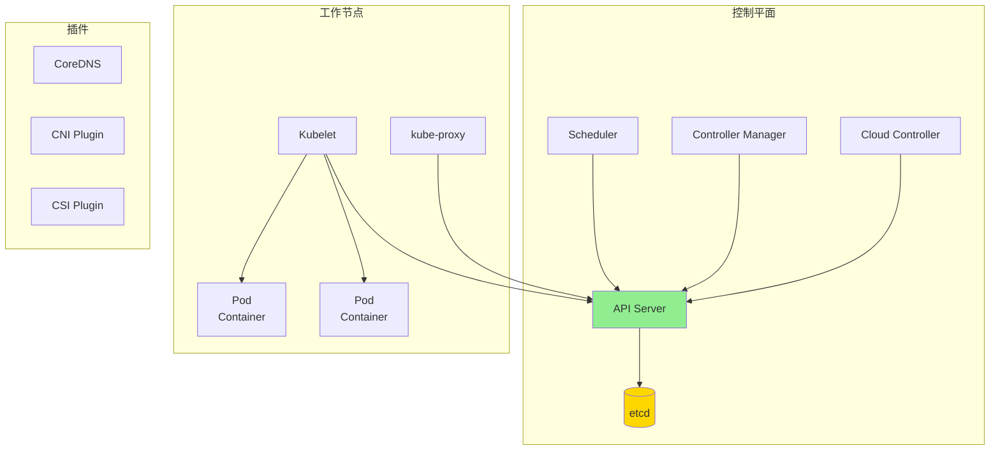
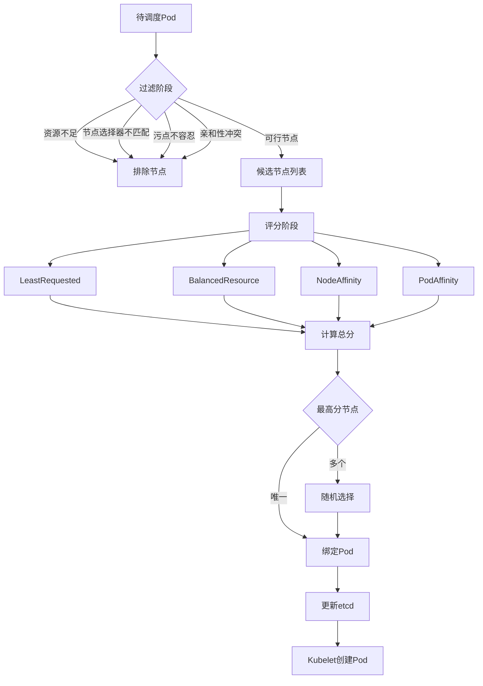
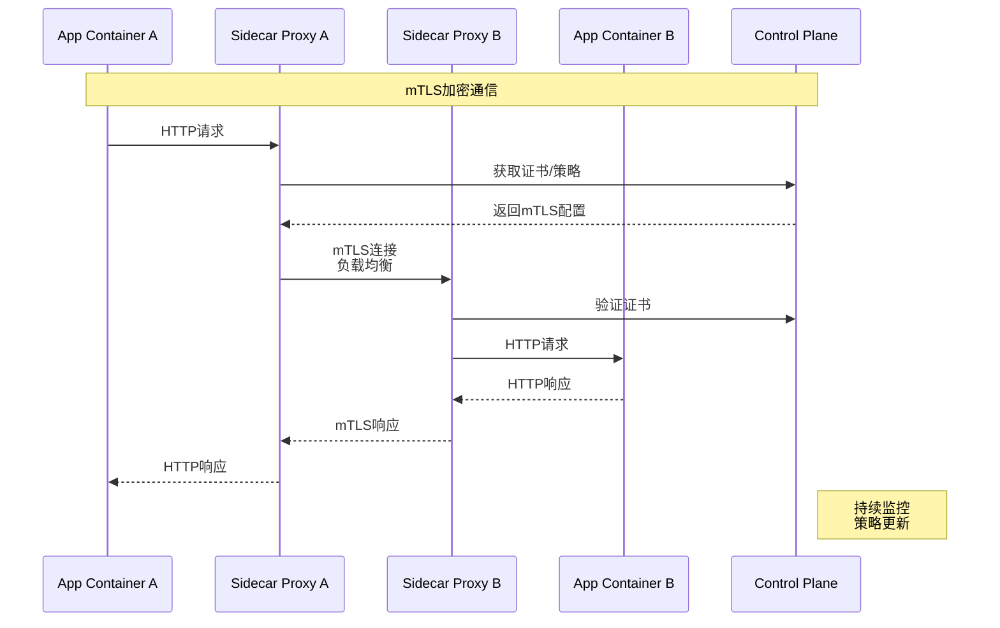

# 容器编排形式化

> **所属单元**: formal-methods/03-model-taxonomy/03-resource-deployment | **前置依赖**: [01-virtualization](01-virtualization.md) | **形式化等级**: L4-L5

## 1. 概念定义 (Definitions)

### Def-M-03-02-01 编排系统 (Orchestration System)

编排系统 $\mathcal{O}$ 管理分布式容器化应用的生命周期：

$$\mathcal{O} = (C, N, R, S, D, \mathcal{M})$$

- $C = \{c_1, ..., c_m\}$：容器集合
- $N = \{n_1, ..., n_n\}$：节点（主机）集合
- $R$：资源类型（CPU、内存、GPU、存储）
- $S$：服务/应用规格
- $D: C \to N$：部署映射（调度决策）
- $\mathcal{M}$：管理机制（扩展、恢复、更新）

### Def-M-03-02-02 Kubernetes对象模型

Kubernetes核心对象构成层次结构：

$$\mathcal{K8s} = (Pod, RS, Deployment, SVC, PVC, ConfigMap)$$

**对象关系**：

- **Pod**：最小部署单元（1+容器）
- **ReplicaSet**：确保Pod副本数
- **Deployment**：声明式更新（滚动/重建）
- **Service**：网络抽象（ClusterIP/NodePort/LoadBalancer）
- **PVC**：持久卷声明
- **ConfigMap/Secret**：配置分离

### Def-M-03-02-03 调度约束 (Scheduling Constraints)

调度问题是一个约束满足问题（CSP）：

$$\text{Schedule}(Pod, Node) \Leftrightarrow \forall c \in \text{Constraints}: \text{sat}(c, Pod, Node)$$

**约束类型**：

- **资源约束**：$\sum_{p \in Pods_{node}} \text{req}(p, r) \leq \text{cap}(node, r)$
- **节点选择器**：$\text{labels}(node) \supseteq \text{selector}(pod)$
- **亲和性/反亲和性**：$\text{affinity}(pod_1, pod_2) \in \{required, preferred\}$
- **污点和容忍**：$\text{taint}(node) \land \neg\text{toleration}(pod) \Rightarrow \neg\text{schedulable}$
- **拓扑分布**：$\text{skew}(topology) \leq \text{maxSkew}$

### Def-M-03-02-04 声明式配置 (Declarative Configuration)

声明式配置定义**期望状态** $S_{desired}$，系统通过**控制循环**收敛：

$$\mathcal{Controller}: (S_{current}, S_{desired}) \to \Delta_{actions}$$

**收敛条件**：

$$S_{current} = S_{desired} \Rightarrow \Delta_{actions} = \emptyset$$

**控制循环**（Reconciliation Loop）：

1. 观察当前状态
2. 与期望状态比较
3. 计算差异并执行动作
4. 重复直到一致

### Def-M-03-02-05 服务网格 (Service Mesh)

服务网格是应用网络层的抽象：

$$\mathcal{SM} = (DataPlane, ControlPlane, SRE)$$

- **Data Plane**：Sidecar代理（Envoy/Istio-proxy）
  - 流量拦截、负载均衡、TLS
- **Control Plane**：策略和配置管理（Istiod/Linkerd-control）
  - 服务发现、mTLS证书分发
- **SRE**：可观测性（指标、日志、追踪）

**Sidecar模式**：每个Pod注入代理容器，形成透明拦截层。

## 2. 属性推导 (Properties)

### Lemma-M-03-02-01 调度可行性

若总资源请求 $\sum_i \text{req}(pod_i) \leq \sum_j \text{cap}(node_j)$ 且无硬约束冲突，则可行调度存在。

**证明**：这是装箱问题的变体，NP-hard但实践中启发式有效。∎

### Lemma-M-03-02-02 声明式收敛

在有限动作空间和确定性控制器下，声明式系统最终达到期望状态（若可达）。

**证明框架**：

- 定义距离度量 $d(S_{current}, S_{desired})$
- 每次调和减少 $d$ 或保持不变（单调性）
- 有限状态保证终止

### Prop-M-03-02-01 调度算法复杂度

Kubernetes默认调度器采用两阶段算法：

1. **过滤**（Filtering）：$O(|Nodes| \cdot |Constraints|)$
2. **评分**（Scoring）：$O(|Feasible| \cdot |Priorities|)$

总复杂度：$O(n \cdot m)$，其中 $n$ 为节点数，$m$ 为约束数。

### Prop-M-03-02-02 服务网格延迟开销

Sidecar代理引入额外跳数：

$$\text{Latency}_{with\ mesh} = \text{Latency}_{direct} + 2 \cdot L_{proxy} + L_{tls}$$

典型值：$L_{proxy} \approx 1-3$ms（Envoy）。

## 3. 关系建立 (Relations)

### 编排系统对比

| 特性 | Kubernetes | Docker Swarm | Nomad | Mesos |
|-----|-----------|--------------|-------|-------|
| 架构 | Master-Worker | Manager-Worker | Client-Server | Master-Slave |
| 服务发现 | DNS/CoreDNS | DNS | Consul | ZooKeeper |
| 存储 | CSI插件 | Volume | Host + CSI | Framework |
| 网络 | CNI插件 | Overlay | CNI | Framework |
| 扩展性 | 5000节点 | 1000节点 | 10000节点 | 10000节点 |
| 适用场景 | 通用 | 简单 | 多工作负载 | 大规模 |

### 控制循环层次

```
Kubelet: Pod生命周期
    ↓
Controller Manager: ReplicaSet/Deployment
    ↓
Scheduler: Pod到Node映射
    ↓
API Server: 状态存储和事件分发
    ↓
etcd: 一致性存储
```

## 4. 论证过程 (Argumentation)

### 声明式 vs 命令式

**声明式优势**：

- 自修复：自动从故障恢复
- 版本控制：配置即代码
- 幂等性：重复应用无副作用

**命令式残余**：

- 一次性操作（调试、紧急修复）
- 有状态操作（kubectl exec/logs）

### 服务网格的演进

**第一代**：Linkerd（Twitter），基于Scala/JVM
**第二代**：Istio（Google/IBM/Lyft），Envoy + Control Plane
**第三代**：eBPF-based（Cilium），内核级优化

**趋势**：延迟更低、资源更少、功能更强。

## 5. 形式证明 / 工程论证 (Proof / Engineering Argument)

### Thm-M-03-02-01 调度约束可满足性

**定理**：给定Pod集合 $P$、节点集合 $N$、约束集合 $C$，判断可行调度是NP-完全的。

**证明**：

**NP成员性**：给定调度方案，可在多项式时间验证所有约束。

**NP困难性**：从**多维装箱问题**（MD-BP）归约：

- 物品 → Pod（多维资源请求）
- 箱子 → Node（多维容量）
- 装箱约束 → 资源约束

**实用近似**：Kubernetes采用贪心+启发式，获得良好非最优解。

### Thm-M-03-02-02 声明式配置一致性

**定理**：在etcd一致性保证下，Kubernetes集群对所有观察者的状态视图最终一致。

**证明框架**：

**etcd保证**：

- Raft共识算法提供线性一致性
- 写操作：$W$ 在确认前持久化到多数节点
- 读操作：$R$ 从Leader或带租约的Follower读取

**Kubernetes保证**：

- 所有状态变更通过API Server写入etcd
- Controller通过Watch机制订阅变更
- 调和循环确保最终状态收敛

**不变式**：
$$\forall t > t_{commit}: \text{read}(key, t) = write(key, t_{commit})$$

## 6. 实例验证 (Examples)

### 实例1：Kubernetes Deployment配置

```yaml
apiVersion: apps/v1
kind: Deployment
metadata:
  name: web-app
spec:
  replicas: 3
  selector:
    matchLabels:
      app: web
  strategy:
    type: RollingUpdate
    rollingUpdate:
      maxSurge: 1
      maxUnavailable: 0
  template:
    metadata:
      labels:
        app: web
    spec:
      containers:
      - name: nginx
        image: nginx:1.21
        resources:
          requests:
            memory: "128Mi"
            cpu: "100m"
          limits:
            memory: "256Mi"
            cpu: "200m"
        ports:
        - containerPort: 80
      affinity:
        podAntiAffinity:
          preferredDuringSchedulingIgnoredDuringExecution:
          - weight: 100
            podAffinityTerm:
              labelSelector:
                matchExpressions:
                - key: app
                  operator: In
                  values: [web]
              topologyKey: kubernetes.io/hostname
```

### 实例2：复杂调度约束场景

```yaml
apiVersion: v1
kind: Pod
metadata:
  name: gpu-training
spec:
  nodeSelector:
    accelerator: nvidia-tesla-v100
  tolerations:
  - key: "dedicated"
    operator: "Equal"
    value: "gpu"
    effect: "NoSchedule"
  containers:
  - name: trainer
    image: tensorflow/tensorflow:latest-gpu
    resources:
      limits:
        nvidia.com/gpu: 2
        memory: "32Gi"
        cpu: "8"
  topologySpreadConstraints:
  - maxSkew: 1
    topologyKey: zone
    whenUnsatisfiable: DoNotSchedule
    labelSelector:
      matchLabels:
        app: gpu-training
```

### 实例3：Istio服务网格配置

```yaml
apiVersion: networking.istio.io/v1beta1
kind: VirtualService
metadata:
  name: reviews-route
spec:
  hosts:
  - reviews
  http:
  - match:
    - headers:
        end-user:
          exact: jason
    route:
    - destination:
        host: reviews
        subset: v2
  - route:
    - destination:
        host: reviews
        subset: v1
      weight: 75
    - destination:
        host: reviews
        subset: v3
      weight: 25
---
apiVersion: security.istio.io/v1beta1
kind: PeerAuthentication
metadata:
  name: default
spec:
  mtls:
    mode: STRICT
```

## 7. 可视化 (Visualizations)

### Kubernetes架构概览



### 调度决策流程



### 服务网格数据流



## 8. 引用参考 (References)
