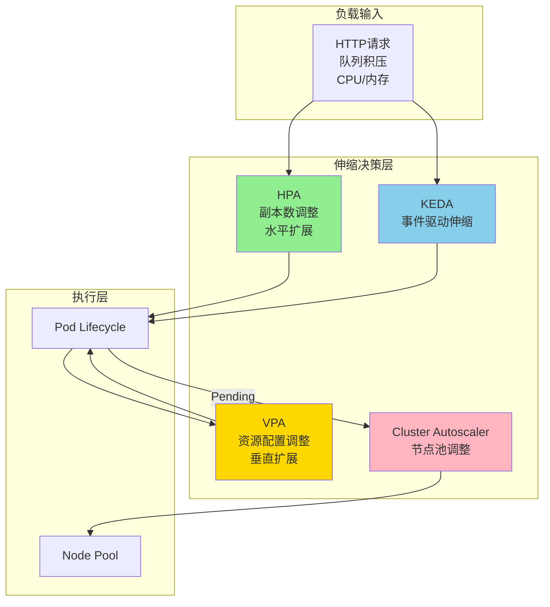
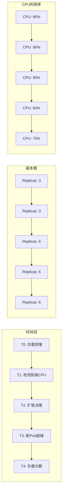

# 弹性伸缩形式化

> **所属单元**: formal-methods/03-model-taxonomy/03-resource-deployment | **前置依赖**: [02-container-orchestration](02-container-orchestration.md) | **形式化等级**: L4-L5

## 1. 概念定义 (Definitions)

### Def-M-03-03-01 弹性伸缩 (Elasticity)

弹性伸缩是系统根据负载动态调整资源容量的能力：

$$\mathcal{E}: (Load(t), Policy) \to Resource(t + \Delta)$$

其中：

- $Load(t)$：时刻 $t$ 的工作负载
- $Policy$：伸缩策略（阈值、预测、事件驱动）
- $\Delta$：伸缩延迟（检测+执行+预热）
- $Resource$：资源数量（Pod副本、CPU核数等）

### Def-M-03-03-02 水平伸缩 (HPA - Horizontal Pod Autoscaler)

HPA基于指标动态调整Pod副本数：

$$\text{Replicas}_{desired} = \left\lceil \frac{\text{CurrentMetric}}{\text{TargetMetric}} \times \text{CurrentReplicas} \right\rceil$$

**约束**：

- $\text{MinReplicas} \leq \text{Replicas}_{desired} \leq \text{MaxReplicas}$
- 缩放窗口（Cooldown）：防止抖动

**指标类型**：

- 资源指标：CPU利用率、内存使用率
- 自定义指标：QPS、队列深度、业务指标
- 外部指标：Pub/Sub订阅积压、外部API延迟

### Def-M-03-03-03 垂直伸缩 (VPA - Vertical Pod Autoscaler)

VPA动态调整Pod的资源请求和限制：

$$\text{Request}_{new} = f(\text{HistoricalUsage}, \text{Confidence}, \text{SafetyMargin})$$

**模式**：

- **Off**：仅建议，不执行
- **Initial**：仅在创建时设置
- **Auto**：实时更新（需重启Pod）
- **Recreate**：更新时重建Pod

**公式**（指数衰减加权平均）：

$$\text{Recommendation} = \max_{t \in window} (\text{Usage}_t) + \text{SafetyMargin}$$

### Def-M-03-03-04 集群伸缩 (Cluster Autoscaler)

集群 autoscaler 管理节点池规模：

$$\text{Nodes}_{action} = \begin{cases}
\text{ScaleUp} & \text{if } \exists \text{ pending pods} \\
\text{ScaleDown} & \text{if } \exists \text{ underutilized nodes} \\
\text{NoOp} & \text{otherwise}
\end{cases}$$

**扩容条件**：
- Pod无法调度（资源不足）
- 新节点可在预算内提供

**缩容条件**：
- 节点利用率低于阈值（默认50%）持续10分钟
- Pod可迁移到其他节点
- 不影响PodDisruptionBudget

### Def-M-03-03-05 资源约束Petri网 (RCPN)

RCPN将资源约束融入Petri网模型：

$$\mathcal{RCPN} = (P, T, F, W, M_0, R, C, U)$$

- $R$：资源类型集合
- $C: P \to \mathbb{N}^{|R|}$：库所资源容量
- $U: T \times R \to \mathbb{N}$：变迁资源消耗函数

**使能条件扩展**：
$$M[t\rangle \Leftrightarrow \forall p \in {}^\bullet t: M(p) \geq W(p,t) \land \forall r: \text{Available}(r) \geq U(t,r)$$

## 2. 属性推导 (Properties)

### Lemma-M-03-03-01 HPA稳定性条件

若负载变化率 $\frac{dL}{dt}$ 满足：

$$\left|\frac{dL}{dt}\right| \leq \frac{\text{TargetMetric} \times \text{ScaleUpDelay}}{\text{CurrentReplicas}}$$

则HPA可避免过度振荡。

### Lemma-M-03-03-02 VPA与HPA互斥性

同时启用VPA（Auto模式）和HPA（基于相同资源）可能导致冲突：

$$\text{VPA increases request} \Rightarrow \text{HPA sees lower utilization}$$
$$\Rightarrow \text{HPA scales down replicas}$$
$$\Rightarrow \text{Higher load per pod}$$
$$\Rightarrow \text{VPA increases request further}$$

**解决方案**：HPA基于外部指标或VPA使用Initial模式。

### Prop-M-03-03-01 伸缩延迟分解

总伸缩延迟 $T_{elastic}$ 由以下组成：

$$T_{elastic} = T_{metric} + T_{decision} + T_{provision} + T_{startup}$$

| 组件 | HPA | VPA | Cluster |
|-----|-----|-----|---------|
| $T_{metric}$ | 15s（默认） | 历史数据 | 实时 |
| $T_{decision}$ | 5s | 分批处理 | 30s |
| $T_{provision}$ | 0（已有节点） | Pod重启 | 2-5min（云） |
| $T_{startup}$ | 应用依赖 | 应用依赖 | 系统初始化 |

### Prop-M-03-03-02 成本优化目标

弹性伸缩的成本优化可建模为：

$$\min_{R(t)} \int_0^T \left( \text{Cost}(R(t)) + \lambda \cdot \text{SLA}_{violation}(Load(t), R(t)) \right) dt$$

约束：$R(t) \geq \text{MinCapacity}$

## 3. 关系建立 (Relations)

### 伸缩策略层次

```
应用层
    ↓
HPA（Pod副本）
    ↓
VPA（Pod资源）
    ↓
Cluster Autoscaler（节点）
    ↓
云厂商（VM/物理机）
```

**协调机制**：
- HPA与CA：CA在Pod Pending时扩容
- VPA与HPA：避免同时基于CPU伸缩
- 多云：Cluster API统一管理

### 预测式vs响应式

| 特性 | 响应式（Reactive） | 预测式（Predictive） |
|-----|-------------------|---------------------|
| 输入 | 当前指标 | 历史模式 + 预测模型 |
| 延迟 | 滞后 | 提前 |
| 准确性 | 高（当前负载） | 依赖预测质量 |
| 适用 | 突发流量 | 周期性负载 |
| 工具 | K8s HPA | KEDA + ML预测 |

## 4. 论证过程 (Argumentation)

### 伸缩抖动问题

**问题**：频繁扩缩容导致：
- 系统不稳定
- 资源浪费（冷启动成本）
- 应用性能抖动

**缓解策略**：
- 缩放窗口（--horizontal-pod-autoscaler-cooldown）
-  hysteresis：扩容阈值 ≠ 缩容阈值
- 预测式伸缩提前准备

### 多维资源约束

实际应用中资源相互影响：
- CPU限制 → 处理延迟增加 → 内存积压
- 内存限制 → OOM Kill → 请求重试 → CPU飙升

**建模**：多维时间序列联合预测。

## 5. 形式证明 / 工程论证 (Proof / Engineering Argument)

### Thm-M-03-03-01 HPA收敛条件

**定理**：在负载变化有界且伸缩延迟有限的情况下，HPA最终收敛到满足目标利用率的副本数。

**证明框架**：

**假设**：
1. 负载函数 $L(t)$ 分段连续
2. 伸缩延迟 $\Delta$ 有界
3. 应用表现出线性扩展性

**收敛分析**：
设目标利用率为 $U_{target}$，当前利用率为 $U_t$。

**缩放决策**：
$$N_{t+1} = N_t \cdot \frac{U_t}{U_{target}}$$

**不动点**：当 $U_t = U_{target}$ 时，$N_{t+1} = N_t$，系统稳定。

**稳定性**：若 $|U_t - U_{target}| < \epsilon$，则伸缩量小于1，受整数约束保持当前副本。

### Thm-M-03-03-02 资源约束Petri网活性

**定理**：在RCPN中，资源约束可能引入新的死锁（资源死锁）。

**证明**：

**场景**：两个变迁 $t_1, t_2$ 竞争资源 $r$：
- $t_1$ 需要 $r$ 量 $a$
- $t_2$ 需要 $r$ 量 $b$
- 可用资源 $< \max(a, b)$ 但 $\geq \min(a, b)$

**死锁条件**：
- $t_1$ 等待更多资源完成
- $t_2$ 等待更多资源完成
- 无变迁可发射（资源不足）

**检测**：扩展可达性分析，检查资源约束后的状态空间。

## 6. 实例验证 (Examples)

### 实例1：HPA配置与行为分析

```yaml
apiVersion: autoscaling/v2
kind: HorizontalPodAutoscaler
metadata:
  name: api-server-hpa
spec:
  scaleTargetRef:
    apiVersion: apps/v1
    kind: Deployment
    name: api-server
  minReplicas: 2
  maxReplicas: 50
  metrics:
  - type: Resource
    resource:
      name: cpu
      target:
        type: Utilization
        averageUtilization: 70
  - type: Pods
    pods:
      metric:
        name: http_requests_per_second
      target:
        type: AverageValue
        averageValue: "1000"
  behavior:
    scaleDown:
      stabilizationWindowSeconds: 300
      policies:
      - type: Percent
        value: 10
        periodSeconds: 60
    scaleUp:
      stabilizationWindowSeconds: 0
      policies:
      - type: Percent
        value: 100
        periodSeconds: 15
      - type: Pods
        value: 4
        periodSeconds: 15
      selectPolicy: Max
```

### 实例2：VPA配置与资源优化

```yaml
apiVersion: autoscaling.k8s.io/v1
kind: VerticalPodAutoscaler
metadata:
  name: web-vpa
spec:
  targetRef:
    apiVersion: apps/v1
    kind: Deployment
    name: web-app
  updatePolicy:
    updateMode: "Auto"  # 也可选择 Off, Initial, Recreate
  resourcePolicy:
    containerPolicies:
    - containerName: '*'
      minAllowed:
        cpu: 50m
        memory: 100Mi
      maxAllowed:
        cpu: 2
        memory: 2Gi
      controlledResources: ["cpu", "memory"]
      controlledValues: RequestsAndLimits
```

**行为分析**：
```
观测窗口: 8天
历史峰值CPU: 850m
推荐request: 900m + 15%安全边际 = 1035m
原始request: 500m
优化效果: 避免OOM，减少节流(throttling)
```

### 实例3：KEDA事件驱动伸缩

```yaml
apiVersion: keda.sh/v1alpha1
kind: ScaledObject
metadata:
  name: queue-worker-scaler
spec:
  scaleTargetRef:
    name: queue-worker
  pollingInterval: 5
  cooldownPeriod: 30
  minReplicaCount: 0      # 可缩容到0
  maxReplicaCount: 100
  triggers:
  # Kafka分区积压触发
  - type: kafka
    metadata:
      bootstrapServers: kafka:9092
      consumerGroup: my-group
      topic: orders
      lagThreshold: "100"
  # 定时扩容（促销时段）
  - type: cron
    metadata:
      timezone: Asia/Shanghai
      start: 0 9 * * 1-5   # 工作日9点
      end: 0 18 * * 1-5    # 工作日18点
      desiredReplicas: "10"
```

## 7. 可视化 (Visualizations)

### 弹性伸缩层次



### HPA缩放行为



### RCPN资源约束示例

```mermaid
graph TB
    subgraph "资源约束Petri网"
        P1((P1: 任务等待))
        P2((P2: 处理中))
        P3((P3: 完成))
        T1[获取资源<br/>消耗: CPU=1, Mem=2]
        T2[释放资源<br/>归还: CPU=1, Mem=2]

        RES[(资源池<br/>CPU: 4<br/>Mem: 8)]
    end

    P1 -->|令牌| T1
    T1 --> P2
    P2 --> T2
    T2 --> P3

    RES -.->|使能条件| T1
    T2 -.->|归还| RES

    note right of RES
        变迁T1需要
        足够资源才能发射
        体现资源约束
    end note
```

## 8. 引用参考 (References)

[^1]: Kubernetes Authors, "Horizontal Pod Autoscaling," https://kubernetes.io/docs/tasks/run-application/horizontal-pod-autoscale/

[^2]: Kubernetes Authors, "Vertical Pod Autoscaling," https://github.com/kubernetes/autoscaler/tree/master/vertical-pod-autoscaler

[^3]: M. Mao and M. Humphrey, "Auto-scaling to minimize cost and meet application deadlines in cloud workflows," *Proceedings of SC 2011*, pp. 1-12, 2011.

[^4]: S. Han, B. Guo, and H. Chen, "Elastic resource management in cloud computing: A survey," *IEEE Communications Surveys & Tutorials*, 20(3), pp. 2108-2131, 2018.

[^5]: KEDA Authors, "Kubernetes Event-driven Autoscaling," https://keda.sh/

[^6]: A. N. Tantawi and D. Towsley, "Optimal static load balancing in distributed computer systems," *Journal of the ACM*, 32(2), pp. 445-465, 1985.

[^7]: B. Urgaonkar, G. Pacifici, P. Shenoy, M. Spreitzer, and A. Tantawi, "An analytical model for multi-tier internet services and its applications," *Proceedings of ACM SIGMETRICS*, pp. 291-302, 2005.
