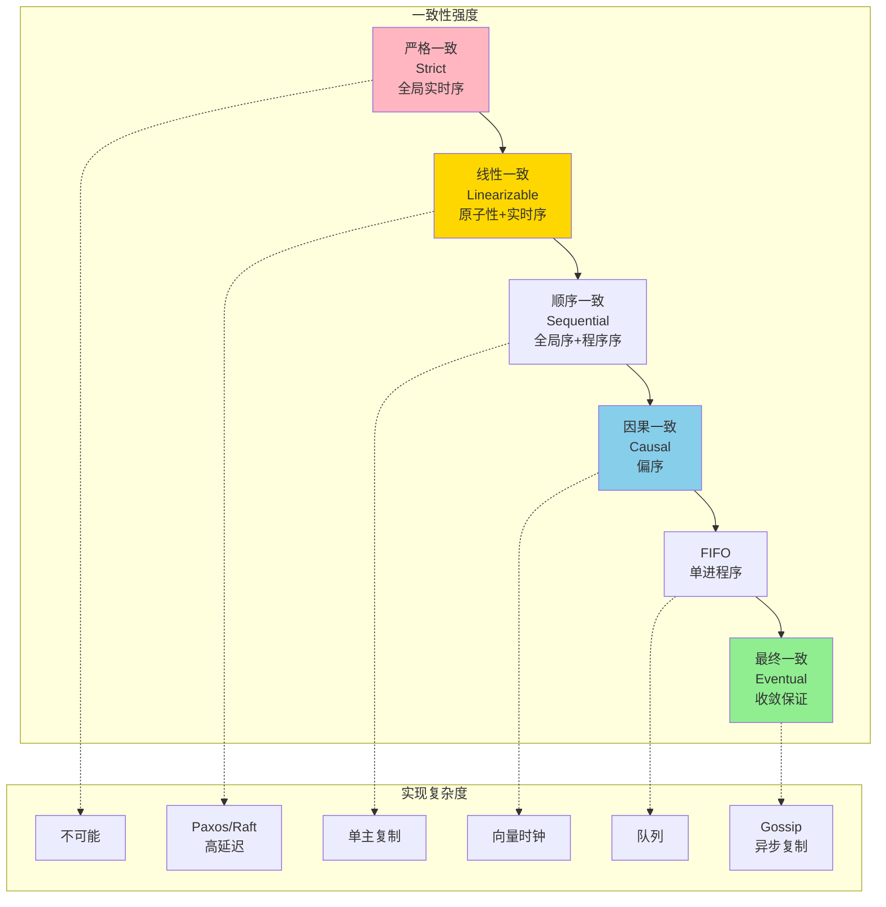
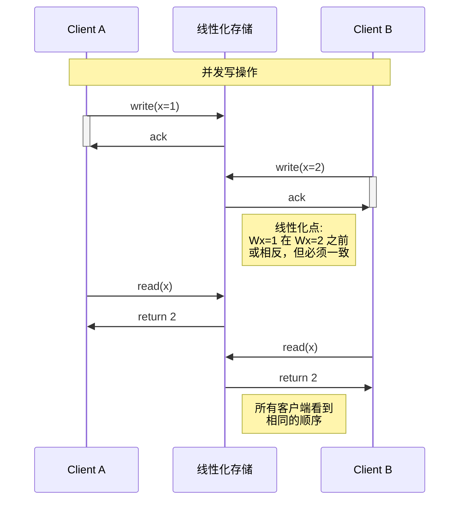

# 一致性谱系

> **所属单元**: formal-methods/03-model-taxonomy/04-consistency | **前置依赖**: [03-resource-deployment/03-elasticity](../03-resource-deployment/03-elasticity.md) | **形式化等级**: L5-L6

## 1. 概念定义 (Definitions)

### Def-M-04-01-01 一致性模型 (Consistency Model)

一致性模型是分布式存储系统提供给客户端的**读写操作可见性契约**：

$$\mathcal{C}: (H_{ops}, \prec_{session}) \to \prec_{visibility}$$

其中：

- $H_{ops} = \{read_i(k), write_j(k, v)\}$：操作历史
- $\prec_{session}$：会话序（程序序）
- $\prec_{visibility}$：可见序（哪些写对读可见）

### Def-M-04-01-02 严格一致性 (Strict Consistency)

严格一致性要求所有操作按**全局实时序**排序：

$$\forall r, w: \text{time}(r) > \text{time}(w) \Rightarrow \text{read}(r) = \text{value}(w) \lor \exists w': w \prec w' \prec r$$

**关键特性**：

- 绝对时间作为唯一参考
- 任何读都返回最近写
- **不可能实现**（分布式系统中无时钟同步）

### Def-M-04-01-03 线性一致性 (Linearizability)

线性一致性要求操作等价于某个**原子执行**，且与实时序一致：

$$\exists \prec_{lin}: \text{TotalOrder}(\prec_{lin}) \land \prec_{realtime} \subseteq \prec_{lin}$$

**形式化**：每个操作在调用和返回之间存在一个**线性化点**，系统状态在该点瞬间改变。

**与严格一致性区别**：线性一致性接受操作并发，只需存在某种全序。

### Def-M-04-01-04 顺序一致性 (Sequential Consistency)

顺序一致性要求存在**全局操作序**满足：

1. 与每个处理器的程序序一致
2. 读返回最近写的值

$$\exists \prec_{seq}: \text{TotalOrder}(\prec_{seq}) \land (\bigcup_i \prec_{program}^i) \subseteq \prec_{seq}$$

**与线性一致性区别**：不强制全局实时序，允许重排序并发操作。

### Def-M-04-01-05 因果一致性 (Causal Consistency)

因果一致性仅要求**因果相关操作**有序：

$$\forall o_1, o_2: o_1 \xrightarrow{hb} o_2 \Rightarrow \forall p: \text{order}_p(o_1) < \text{order}_p(o_2)$$

其中 $\xrightarrow{hb}$ 为Happens-before关系：

- 同一进程的程序序
- 写-读依赖（读看到某写则该写先于后续操作）

**并发操作**：无因果关系的操作可不同进程以不同顺序观察。

### Def-M-04-01-06 FIFO一致性 (FIFO/PRAM)

FIFO一致性要求**单进程写操作**按发出顺序被观察：

$$\forall p, w_1, w_2: w_1 \prec_{program}^p w_2 \Rightarrow \forall q: \text{order}_q(w_1) < \text{order}_q(w_2)$$

**特性**：不保证跨进程写的顺序。

### Def-M-04-01-07 最终一致性 (Eventual Consistency)

最终一致性保证**若写停止，副本最终收敛**：

$$\forall k: (\text{writes stop at } t) \Rightarrow \exists t': \forall t'' > t', \forall p: read_p(k, t'') = v_{final}$$

**BASE特性**：

- **B**asically **A**vailable：基本可用
- **S**oft state：软状态（允许临时不一致）
- **E**ventual consistency：最终一致

## 2. 属性推导 (Properties)

### Lemma-M-04-01-01 一致性层次包含关系

$$\text{Strict} \subset \text{Linearizable} \subset \text{Sequential} \subset \text{Causal} \subset \text{FIFO} \subset \text{Eventual}$$

**证明**：每个更强的一致性施加更多约束。∎

### Lemma-M-04-01-02 线性一致性可组合性

若对象 $A$ 和 $B$ 各自线性一致，则组合 $(A, B)$ 也线性一致。

**注意**：顺序一致性**不可组合**。

### Prop-M-04-01-01 一致性延迟权衡

一致性强度与延迟存在固有权衡：

| 一致性 | 读延迟 | 写延迟 | 可用性 |
|-------|-------|-------|--------|
| Linearizable | 高（多数派） | 高（同步复制） | 低（分区时不可写） |
| Causal | 中（向量时钟） | 中 | 高 |
| Eventual | 低（本地读） | 低（异步复制） | 高（始终可用） |

### Prop-M-04-01-02 冲突解决策略

最终一致性系统需要冲突解决：

- **Last-Write-Wins (LWW)**：时间戳最大者胜
- **向量时钟**：检测并发冲突
- **CRDT**：无冲突复制数据类型（合并函数保证收敛）
- **应用层解决**：版本向量，用户介入

## 3. 关系建立 (Relations)

### 一致性模型与应用场景

```
金融交易 ──→ Linearizable (强一致性必需)
    ↓
社交状态 ──→ Causal (因果相关需有序)
    ↓
购物车 ──→ Eventual + Session (可用性优先)
    ↓
CDN缓存 ──→ Eventual (性能优先)
```

### 实现机制对比

| 机制 | 支持的一致性 | 开销 |
|-----|------------|------|
| 单主复制 | Sequential+ | 低 |
| 多主复制 | Causal/Eventual | 中 |
| Paxos/Raft | Linearizable | 高 |
| Quorum (N/R+W) | 可调 | 可调 |
| Gossip | Eventual | 低 |

## 4. 论证过程 (Argumentation)

### 为什么严格一致性不可能？

**问题**：绝对全局时间需要光速无限或时钟完美同步。

**实际限制**：

- 光速延迟：$1ms \approx 300km$
- 时钟漂移：即使原子钟也有误差
- 网络分区：无法区分延迟和故障

**解决方案**：放弃绝对时间，接受逻辑时钟或部分序。

### 因果一致性的实用价值

**满足大多数应用需求**：

- 评论应看到其回复的帖子（因果）
- 不强制全局顺序（允许并发）
- 可用性高于线性一致

**典型系统**：COPS、Eiger、Bolt-on因果一致性。

## 5. 形式证明 / 工程论证 (Proof / Engineering Argument)

### Thm-M-04-01-01 线性一致性验证

**定理**：执行历史 $H$ 是线性一致的，当且仅当存在线性化点函数 $lp$ 使得：

$$\forall o_1, o_2: lp(o_1) < lp(o_2) \land o_1 \parallel o_2 \Rightarrow \text{valid}(H, lp)$$

**验证算法**（模型检测）：

1. 枚举所有可能的线性化点分配
2. 检查每个分配是否满足：
   - 操作原子性
   - 程序序保持
   - 读返回最近写

**复杂度**：NP-完全（等价于拓扑排序约束满足）。

**工程工具**：Knossos（Clojure）、Jepsen（分布式测试）。

### Thm-M-04-01-02 因果一致性实现

**定理**：向量时钟可实现因果一致性。

**向量时钟定义**：
每个进程 $p_i$ 维护向量 $VC_i[1..n]$：

- 本地事件：$VC_i[i] \leftarrow VC_i[i] + 1$
- 发送消息：附带当前 $VC_i$
- 接收消息：$VC_i[j] \leftarrow \max(VC_i[j], VC_{msg}[j])$ 对所有 $j$

**因果序判定**：
$$e_1 \xrightarrow{causal} e_2 \Leftrightarrow VC(e_1) < VC(e_2)$$

**证明**：

- **完备性**：若 $e_1$ 先于 $e_2$，则 $VC(e_1)[i] \leq VC(e_2)[i]$ 对所有 $i$，且存在 $j$ 使严格小于
- **安全性**：若 $VC_1 < VC_2$，则存在因果链 $e_1 \to ... \to e_2$

**工程优化**：

- 版本向量（Version Vectors）处理复制
- 区间树时钟（Interval Tree Clocks）处理动态成员

## 6. 实例验证 (Examples)

### 实例1：线性一致性分析

```
场景：两个客户端操作共享寄存器

时间线:
Client A:  [Wx=1]       [Rx=?]
Client B:         [Wx=2]       [Rx=?]
           ────────────────────────────→ t

线性一致的历史:
- 情况1: Wx=1 线性化于 Wx=2 之前
  A: Rx=2 (看到最新值)
  B: Rx=2 (自己写的值)

- 情况2: Wx=2 线性化于 Wx=1 之前
  A: Rx=1 (自己写的值)
  B: Rx=1 (看到最新值)

非线性一致的历史:
  A: Rx=1, B: Rx=2
  （无法构造线性化点解释此结果）
```

### 实例2：因果一致性示例

```
场景：社交网络评论系统

进程P1 (发帖):
  write(post_id="P1", content="Hello")
  → VC = [1, 0, 0]

进程P2 (评论):
  read(post_id="P1")  // 看到P1的帖子
  write(comment_id="C1", reply_to="P1", content="Hi!")
  → VC = [1, 1, 0]  // 继承P1的时钟

进程P3 (查看):
  read(post_id="P1")      // VC至少[1,0,0]
  read(comment_id="C1")   // VC至少[1,1,0]

  // 因果一致性保证: 若看到C1，必已看到P1
  // 因为 VC(C1) > VC(P1)
```

### 实例3：CRDT计数器实现

```python
class GCounter:
    """
    G-Counter (Grow-only Counter) - 状态CRDT
    支持合并操作，保证最终一致性
    """
    def __init__(self, node_id, num_nodes):
        self.node_id = node_id
        self.P = [0] * num_nodes  # 每个节点的计数

    def increment(self):
        """本地增加"""
        self.P[self.node_id] += 1

    def query(self):
        """查询总值"""
        return sum(self.P)

    def merge(self, other):
        """合并两个副本（取逐元素最大值）"""
        for i in range(len(self.P)):
            self.P[i] = max(self.P[i], other.P[i])
        return self

class PNCounter:
    """
    PN-Counter (Increment/Decrement) - 两个G-Counter组合
    """
    def __init__(self, node_id, num_nodes):
        self.P = GCounter(node_id, num_nodes)  # 增加计数
        self.N = GCounter(node_id, num_nodes)  # 减少计数

    def increment(self):
        self.P.increment()

    def decrement(self):
        self.N.increment()

    def query(self):
        return self.P.query() - self.N.query()

    def merge(self, other):
        self.P.merge(other.P)
        self.N.merge(other.N)
        return self
```

## 7. 可视化 (Visualizations)

### 一致性层次谱系



### 线性一致性示例



### 向量时钟传播

```mermaid
graph TB
    subgraph "向量时钟演进"
        P1_0[P1: [1,0,0]]
        P1_1[P1: [2,0,0]]
        P1_2[P1: [2,2,1]]

        P2_0[P2: [0,1,0]]
        P2_1[P2: [2,2,0]]

        P3_0[P3: [0,0,1]]
    end

    P1_0 -->|本地事件| P1_1
    P1_1 -->|发送m1| P2_1
    P2_0 -->|接收m1<br/>max([0,1,0],[2,0,0])| P2_1
    P2_1 -->|发送m2| P1_2
    P3_0 -->|接收m2| P1_2

    note right of P1_2
        因果序判定:
        [1,0,0] < [2,0,0] < [2,2,0] < [2,2,1]
        P1的初始事件因果先于最终结果
    end note
```

## 8. 关系建立 (Relations)

### 与线性一致性的关系

一致性谱系中的线性一致性（Linearizability）是强一致性的关键级别。它要求所有操作看起来在调用和响应之间的某个瞬间原子执行，且与全局实时顺序一致。

- 详见：[线性一致性](../../98-appendices/wikipedia-concepts/15-linearizability.md)

线性一致性的核心特性：

- **原子性**: 每个操作在某个瞬间生效
- **实时性**: 遵守全局时间顺序
- **可组合性**: 多个线性一致的对象组合后仍保持线性一致

### 一致性模型与应用场景

```
金融交易 ──→ Linearizable (强一致性必需)
    ↓
社交状态 ──→ Causal (因果相关需有序)
    ↓
购物车 ──→ Eventual + Session (可用性优先)
    ↓
CDN缓存 ──→ Eventual (性能优先)
```

### 实现机制对比

| 机制 | 支持的一致性 | 开销 |
|-----|------------|------|
| 单主复制 | Sequential+ | 低 |
| 多主复制 | Causal/Eventual | 中 |
| Paxos/Raft | Linearizable | 高 |
| Quorum (N/R+W) | 可调 | 可调 |
| Gossip | Eventual | 低 |

---

## 9. 引用参考 (References)
