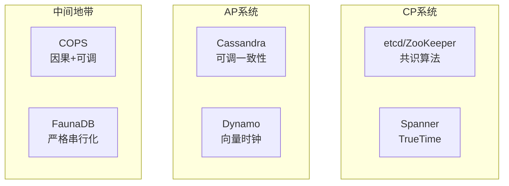
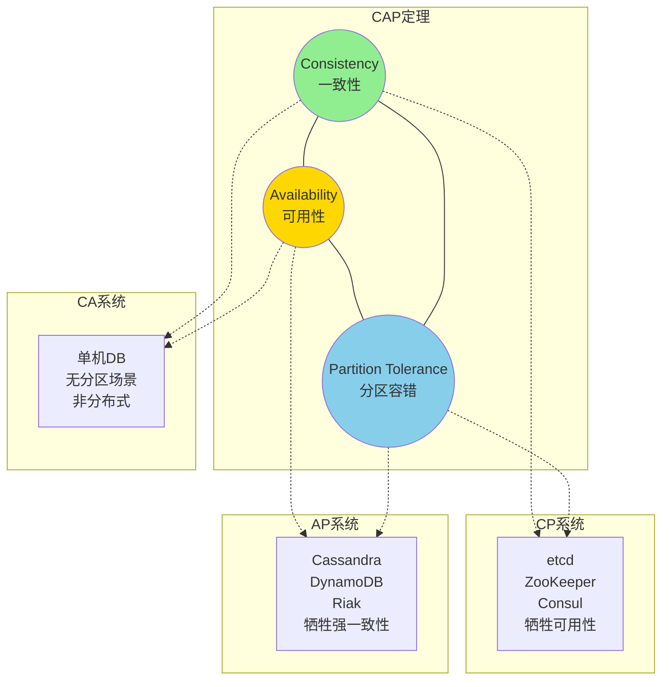
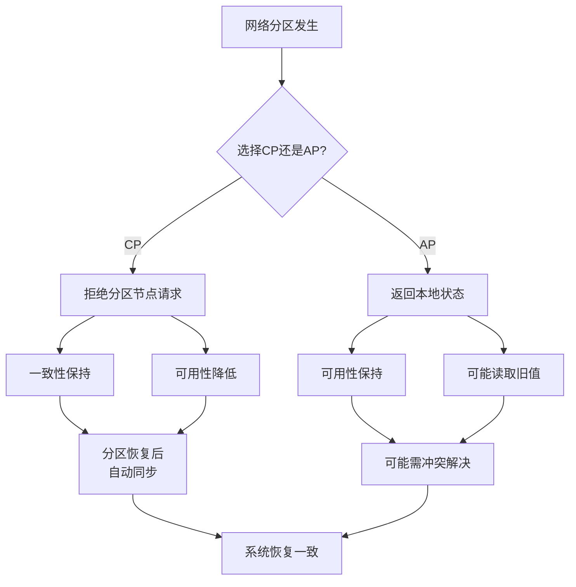
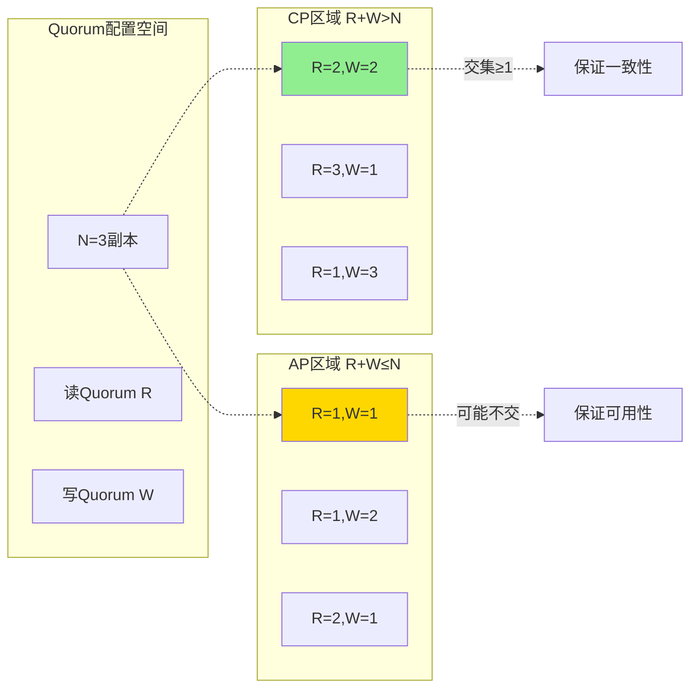

# CAP定理

> **所属单元**: formal-methods/03-model-taxonomy/04-consistency | **前置依赖**: [01-consistency-spectrum](01-consistency-spectrum.md) | **形式化等级**: L5-L6

## 1. 概念定义 (Definitions)

### Def-M-04-02-01 CAP定理陈述

CAP定理指出：在分布式数据存储系统中，**一致性（Consistency）、可用性（Availability）、分区容错性（Partition Tolerance）** 三者不可兼得，最多同时满足两项。

$$\forall \mathcal{S}: \neg(C(\mathcal{S}) \land A(\mathcal{S}) \land P(\mathcal{S}))$$

### Def-M-04-02-02 一致性 (Consistency)

在CAP语境下，一致性指**线性一致性**（强一致性）：

$$C(\mathcal{S}) \triangleq \forall r: \text{read}(r) = \text{latest-write-before}(r)$$

即所有节点在同一时间看到相同的数据状态。

### Def-M-04-02-03 可用性 (Availability)

可用性要求**每个请求最终收到非错误响应**：

$$A(\mathcal{S}) \triangleq \forall req: \Diamond \text{ response}(req) \land \neg\text{error}(response)$$

注意：响应可能不是最新值（弱一致性下）。

### Def-M-04-02-04 分区容错性 (Partition Tolerance)

分区容错性要求系统在**任意网络分区**下继续运行：

$$P(\mathcal{S}) \triangleq \forall partition: \mathcal{S} \text{ continues to operate}$$

**网络分区定义**：节点间通信丢失，形成两个或多个无法互通的分区。

### Def-M-04-02-05 CAP组合系统

| 组合 | 特性 | 代表系统 |
|-----|------|---------|
| CP | 一致 + 分区容错 | HBase, MongoDB(配置), etcd |
| AP | 可用 + 分区容错 | Cassandra, DynamoDB, Riak |
| CA | 一致 + 可用 | 单机数据库（无分区场景）|

**注意**：CA系统在分区发生时必须放弃一致性或可用性之一。

## 2. 属性推导 (Properties)

### Lemma-M-04-02-01 分区容错是必选项

在现代分布式系统中，网络分区**不可避免**：

$$\text{Distributed} \Rightarrow P$$

因此实际选择仅在CP和AP之间。

### Lemma-M-04-02-02 CAP权衡的渐进性

CAP不是二元选择，而是**连续谱系**：

- **延迟一致性**：多数派读写（Quorum）
- **会话一致性**：保证同一会话内一致
- **最终一致性**：异步复制

### Prop-M-04-02-01 PACELC定理扩展

PACELC扩展CAP：

- **P**artition时：选择 **A**vailability 或 **C**onsistency
- **E**lse（无分区）：选择 **L**atency 或 **C**onsistency

$$\text{PACELC}: \text{If P then (A or C) else (L or C)}$$

### Prop-M-04-02-02 实际系统的CAP选择

| 场景 | 选择 | 理由 |
|-----|------|------|
| 分布式锁 | CP | 安全优先 |
| 用户配置 | AP | 可用优先 |
| 支付系统 | CP | 数据一致性关键 |
| 社交Feed | AP | 最终可接受 |

## 3. 关系建立 (Relations)

### CAP与一致性谱系

```
CAP-C (强一致)
    ├── 线性一致性
    └── 顺序一致性

CAP-A (可用)
    ├── 因果一致性
    ├── 会话一致性
    └── 最终一致性
```

### 系统分类



## 4. 论证过程 (Argumentation)

### CAP证明直觉

**场景**：网络分区将系统分为 $G_1$ 和 $G_2$

**写操作发生在 $G_1$**：

- **CP选择**：拒绝 $G_2$ 的读请求（牺牲可用性）
- **AP选择**：$G_2$ 返回旧值（牺牲一致性）

**无法同时满足**：

- 若返回新值给 $G_2$：需要跨分区通信（不可能）
- 若拒绝请求：牺牲可用性

### 为什么CAP常被误解？

**常见误解**：

1. "必须放弃三选二" → 实际是"分区时"的选择
2. "系统必须是CP或AP" → 可分区感知动态调整
3. "AP系统无一致性" → 最终一致性仍是一致性

**正确理解**：

- 分区时权衡（Partition-time trade-off）
- 不同操作可不同选择
- 细粒度CAP（per-record, per-request）

## 5. 形式证明 / 工程论证 (Proof / Engineering Argument)

### Thm-M-04-02-01 CAP定理形式证明

**定理**：分布式系统无法同时满足一致性、可用性和分区容错性。

**证明**（Gilbert-Lynch形式化）：

**系统模型**：

- 共享寄存器系统（read/write操作）
- 异步网络（无全局时钟）
- 网络分区可发生

**反证法**：
假设系统 $S$ 同时满足C、A、P。

**构造执行**：

1. 初始值：$v_0$
2. 节点 $n_1$ 执行 $write(v_1)$
3. 网络分区：$n_1$ 与 $n_2$ 隔离
4. $n_2$ 执行 $read()$

**分析**：

- 由P：系统必须在分区下运行
- 由A：$n_2$ 的读必须返回响应
- 响应只能是 $v_0$（无法与 $n_1$ 通信）或 $v_1$（若假设缓存）
  - 若返回 $v_0$：违反C（未看到最新写）
  - 若返回 $v_1$：违反A（$n_2$ 必须阻塞等待分区恢复）

**矛盾**：假设不成立，三者不可兼得。∎

### Thm-M-04-02-02 Quorum系统的CAP边界

**定理**：在 $N$ 个副本的系统中，读写Quorum满足 $R + W > N$ 时提供CP特性，$R + W \leq N$ 时提供AP特性。

**证明**：

**CP情况**（$R + W > N$）：

- 任意读Quorum与写Quorum交集非空
- 读必然看到最新写
- 分区导致少数派不可用（牺牲A）

**AP情况**（$R + W \leq N$）：

- Quorum可能不交
- 分区时读写可在少数派完成
- 可能读到旧值（牺牲C）

**工程实例**：

- Dynamo：$N=3, R=1, W=1$（AP）
- Cassandra：可调，$R + W > N$ 为CP模式

## 6. 实例验证 (Examples)

### 实例1：分区场景分析

```
场景：两节点分布式KV存储

正常状态:
    Node A  ←───→  Node B
    [x=10]         [x=10]

分区发生:
    Node A  ──X──  Node B

写操作:
    Client → Node A: write(x=20)
    Node A 接受并确认 [x=20]

读操作:
    Client → Node B: read(x)

CP选择:
    Node B: "分区中，无法确定最新值，返回错误"
    → 一致性保持，但不可用

AP选择:
    Node B: "返回本地值 x=10"
    → 可用，但可能不一致
```

### 实例2：Dynamo的AP设计

```python
class DynamoNode:
    """
    Dynamo风格AP系统
    N=3, R=1, W=1（最低延迟配置）
    """
    def __init__(self):
        self.data = {}
        self.vector_clocks = {}

    def write(self, key, value, context=None):
        """写入（总是成功）"""
        vc = self.increment_vc(context)
        self.data[key] = (value, vc, time.time())
        # 异步复制到其他N-1节点
        self.async_replicate(key, value, vc)
        return "OK", vc

    def read(self, key):
        """读取（总是返回）"""
        if key in self.data:
            value, vc, ts = self.data[key]
            return value, vc
        # 可能返回空或旧值
        return None, None

    def read_repair(self, key):
        """后台读取修复"""
        # 联系R个节点，合并版本
        versions = self.gather_versions(key)
        if len(versions) > 1:
            # 发现冲突，应用层解决
            resolved = self.resolve_conflicts(versions)
            self.data[key] = resolved
```

### 实例3：etcd的CP设计

```python
class EtcdNode:
    """
    etcd风格CP系统（Raft共识）
    """
    def __init__(self):
        self.raft = RaftConsensus()
        self.state_machine = {}

    def write(self, key, value):
        """写入需多数派确认"""
        entry = LogEntry(op='write', key=key, value=value)
        # Raft: 复制到多数派
        if self.raft.propose(entry):
            # 提交后才确认
            self.state_machine[key] = value
            return "OK"
        else:
            # 分区或无法达成多数派
            return "Error: No consensus"

    def read(self, key):
        """读取可本地执行（线性化读需额外确认）"""
        if self.raft.is_leader():
            return self.state_machine.get(key)
        else:
            # 转发到Leader确保一致性
            return self.forward_to_leader('read', key)

    def on_partition(self, isolated_nodes):
        """分区处理"""
        if self.node_id in isolated_nodes:
            if len(isolated_nodes) <= len(nodes) // 2:
                # 少数派：停止服务
                self.enter_readonly_mode()
            else:
                # 多数派：继续服务
                self.continue_serving()
```

## 7. 可视化 (Visualizations)

### CAP定理三角



### 分区场景决策树



### Quorum系统CAP边界



## 8. 引用参考 (References)
