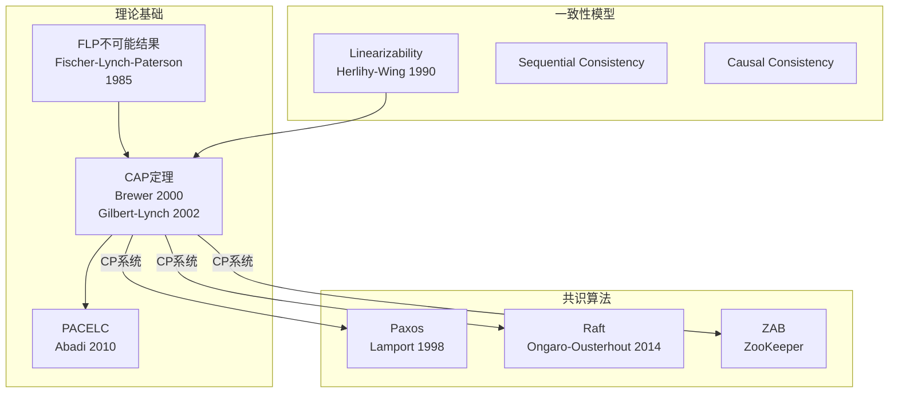
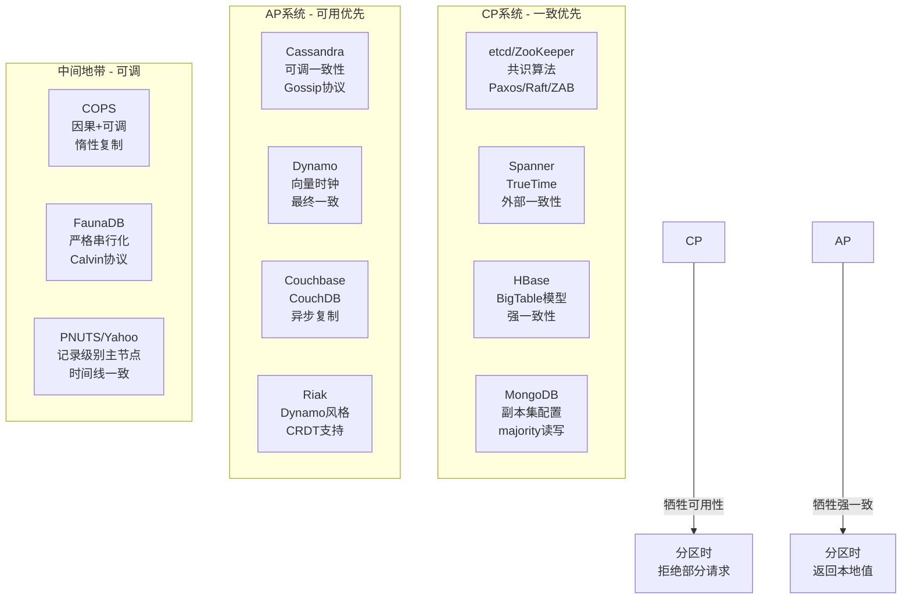
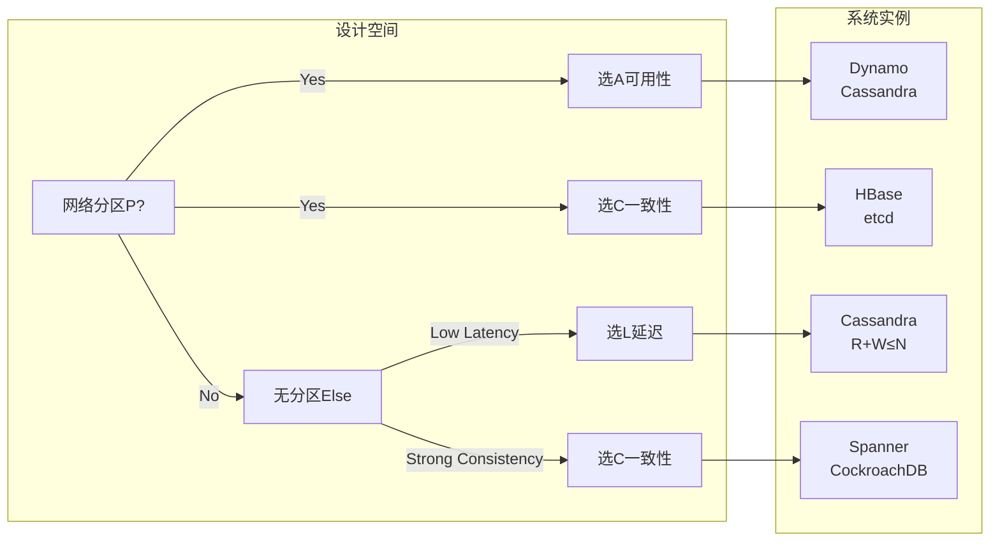
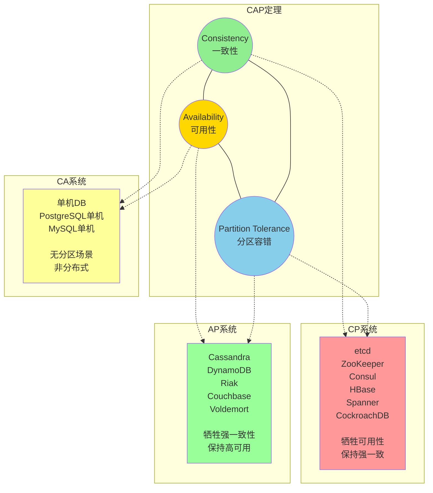
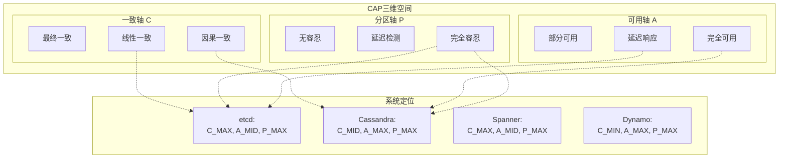
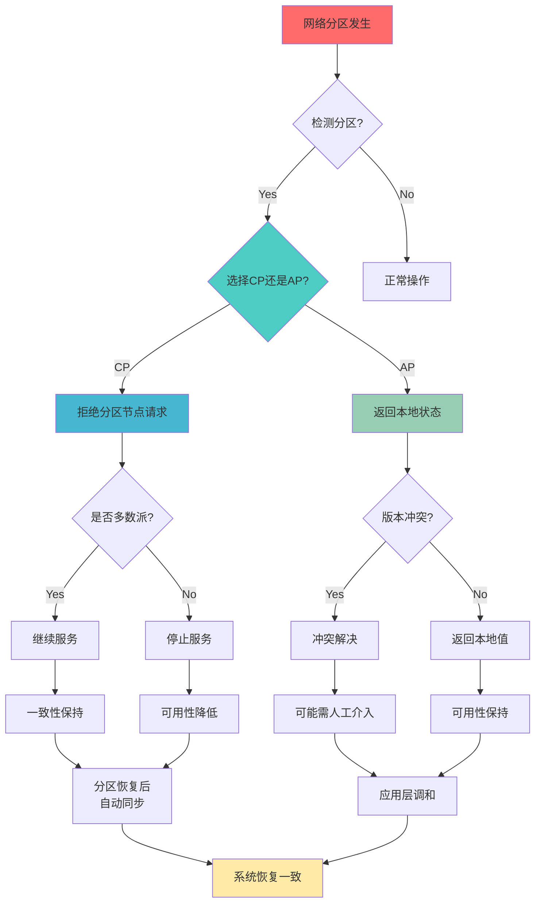
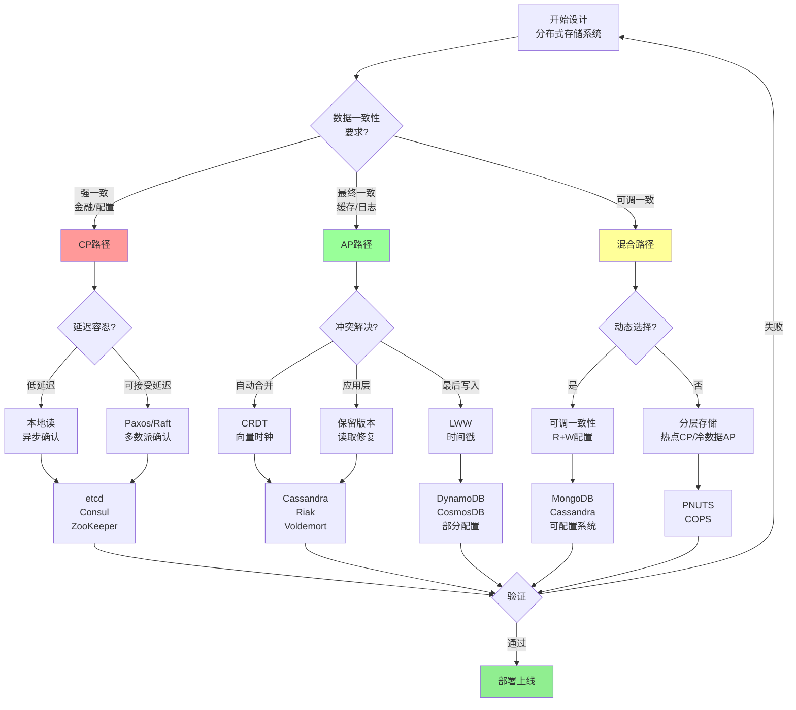
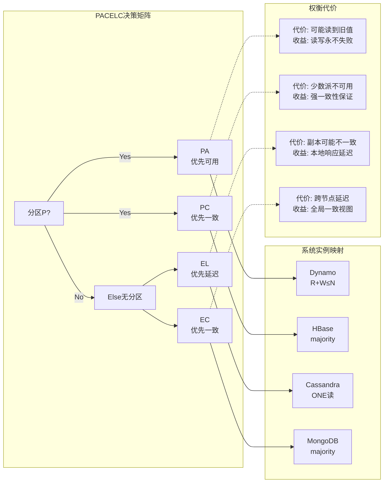
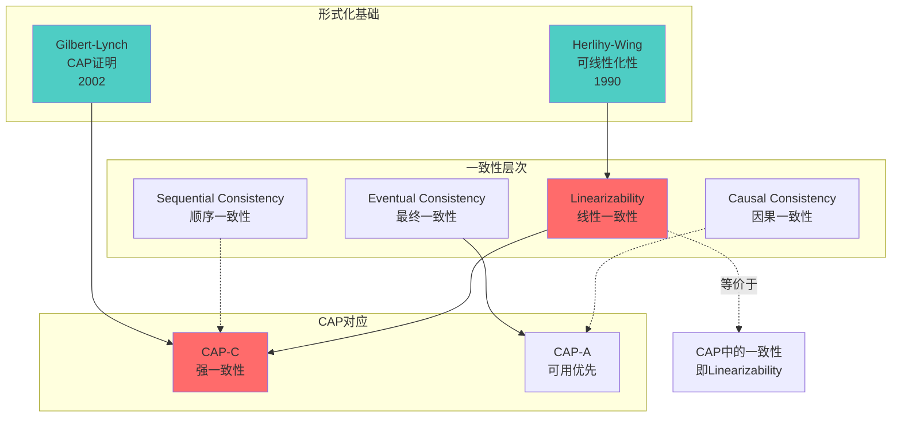
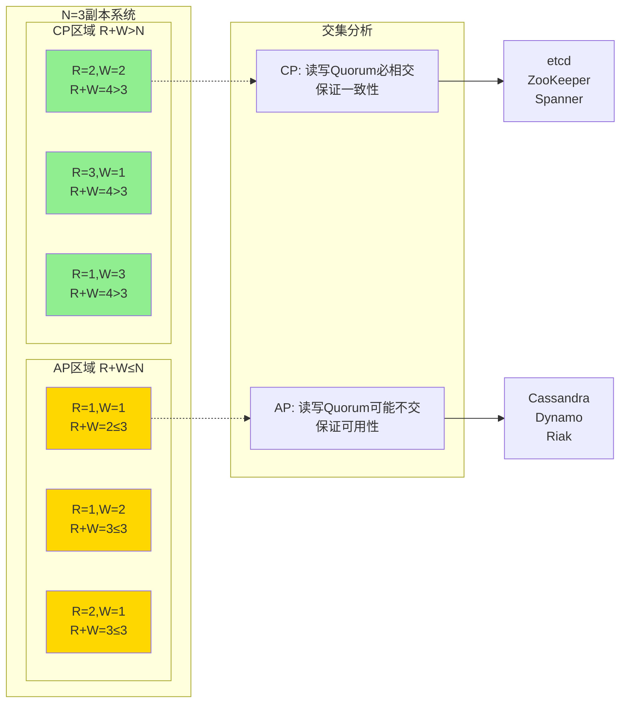

# CAP定理

> **所属单元**: formal-methods/03-model-taxonomy/04-consistency | **前置依赖**: [01-consistency-spectrum](01-consistency-spectrum.md) | **形式化等级**: L5-L6

## 1. 概念定义 (Definitions)

### Def-M-04-02-01 CAP定理陈述

CAP定理指出：在分布式数据存储系统中，**一致性（Consistency）、可用性（Availability）、分区容错性（Partition Tolerance）** 三者不可兼得，最多同时满足两项。

$$\forall \mathcal{S}: \neg(C(\mathcal{S}) \land A(\mathcal{S}) \land P(\mathcal{S}))$$

### Def-M-04-02-02 一致性 (Consistency)

在CAP语境下，一致性指**线性一致性**（Linearizability，强一致性）：

$$C(\mathcal{S}) \triangleq \forall r: \text{read}(r) = \text{latest-write-before}(r)$$

即所有节点在同一时间看到相同的数据状态。更严格地说，对于任何操作的历史，都存在一个等价的顺序执行历史满足实时性约束。

### Def-M-04-02-03 可用性 (Availability)

可用性要求**每个请求最终收到非错误响应**：

$$A(\mathcal{S}) \triangleq \forall req: \Diamond \text{ response}(req) \land \neg\text{error}(response)$$

其中 $\Diamond$ 表示"最终"（时序逻辑中的eventually）。注意：响应可能不是最新值（弱一致性下），但不能超时或返回明确的错误。

### Def-M-04-02-04 分区容错性 (Partition Tolerance)

分区容错性要求系统在**任意网络分区**下继续运行：

$$P(\mathcal{S}) \triangleq \forall \pi \in \text{Partitions}: \mathcal{S} \text{ continues to operate}$$

**网络分区定义**：节点间通信丢失，形成两个或多个无法互通的分区。

$$\text{Partition}(G_1, G_2) \triangleq \forall n_1 \in G_1, n_2 \in G_2: \neg\diamondsuit(n_1 \leadsto n_2)$$

其中 $n_1 \leadsto n_2$ 表示从 $n_1$ 到 $n_2$ 的消息传递在有限时间内完成。

### Def-M-04-02-05 Gilbert-Lynch 异步网络模型

根据Gilbert & Lynch (2002)的原始证明，我们定义异步网络模型：

**异步系统假设**：

- **A1**: 网络延迟无上界（no bounded delay guarantee）
- **A2**: 本地时钟无法保证同步
- **A3**: 消息可能丢失、重复或乱序
- **A4**: 无法区分慢网络与故障节点

**共享寄存器系统**：

- 操作集合 $\mathcal{O} = \{\text{read}, \text{write}\}$
- 每个寄存器具有单一值域 $\mathcal{V}$
- 操作具有原子性假设（atomicity assumption）

**执行（Execution）**：
$$E = (O, \xrightarrow{hb})$$

其中 $O$ 是操作集合，$\xrightarrow{hb}$ 是happen-before偏序关系。

### Def-M-04-02-06 CAP组合系统

| 组合 | 特性 | 代表系统 | 适用场景 |
|-----|------|---------|---------|
| CP | 一致 + 分区容错 | HBase, MongoDB(配置), etcd, ZooKeeper, Consul | 配置管理、分布式锁、金融交易 |
| AP | 可用 + 分区容错 | Cassandra, DynamoDB, Riak, Couchbase, Voldemort | 内容缓存、社交网络、日志收集 |
| CA | 一致 + 可用 | 单机数据库（无分区场景）| 非分布式场景、单机部署 |

**注意**：CA系统在分区发生时必须放弃一致性或可用性之一。在分布式环境中，$P$ 是必选项，因此实际仅在CP和AP之间选择。

### Def-M-04-02-07 PACELC定理

PACELC扩展CAP定理，引入延迟与一致性的权衡：

$$\text{PACELC}: \text{If P then (A or C) else (L or C)}$$

形式化表述：

- **P**artition发生时：选择 **A**vailability 或 **C**onsistency
- **E**lse（无分区时）：选择 **L**atency 或 **C**onsistency

**延迟-一致性权衡的形式化**：

$$L_{total} = L_{network} + L_{consensus}$$

$$C_{level} \propto \frac{1}{L_{consensus}}$$

即一致性级别与达成共识所需的延迟成反比。

### Def-M-04-02-08 CAP与Linearizability的等价性

在CAP定理的严格形式化中，一致性（C）等价于Linearizability：

$$C_{CAP} \equiv \text{Linearizability}$$

**Linearizability定义**：
对于并发执行历史 $H$，如果存在一个全序 $<$ 满足：

1. **顺序等价**：$<$ 扩展了 $H$ 的实时序（real-time order）
2. **原子性**：每个操作在 $<$ 中表现为原子性瞬间执行
3. **一致性**：读操作返回值等于该读之前的最新写值

则 $H$ 是linearizable的。

### Def-M-04-02-09 Herlihy-Wing可线性化性

Herlihy & Wing (1990)提出可线性化性的形式化定义：

**历史（History）**：事件序列 $H = e_1, e_2, ..., e_n$，每个事件为 $\langle \text{inv}, \text{resp} \rangle$ 对

**可线性化性条件**：
$$\exists \text{顺序} S: \forall op \in H:$$

1. $S$ 保持 $H$ 的实时序：$op_1 \xrightarrow{rt} op_2 \Rightarrow op_1 <_S op_2$
2. $S$ 满足顺序规范：每个读返回最近的写值

**与CAP的联系**：
$$C_{CAP} \Rightarrow \text{Linearizability} \Rightarrow \text{Sequential Consistency}$$

## 2. 属性推导 (Properties)

### Lemma-M-04-02-01 分区容错是必选项

在现代分布式系统中，网络分区**不可避免**：

$$\text{Distributed} \Rightarrow P$$

**证明**：

- 分布式系统定义：节点分布在不同网络位置
- 网络故障是常态（Fallacies of Distributed Computing）
- 因此任何分布式系统必须处理分区或停止服务

因此实际选择仅在CP和AP之间。

### Lemma-M-04-02-02 CAP权衡的渐进性

CAP不是二元选择，而是**连续谱系**：

| 一致性级别 | 延迟代价 | 可用性 | 实现方式 |
|-----------|---------|-------|---------|
| 线性一致性 | 高（RTT × 2）| 低 | Paxos/Raft |
| 顺序一致性 | 中（RTT）| 中 | 主从复制 |
| 因果一致性 | 低（本地）| 高 | 向量时钟 |
| 会话一致性 | 低（本地）| 高 | 客户端缓存 |
| 最终一致性 | 极低 | 极高 | 异步复制 |

### Lemma-M-04-02-03 分区时的消息丢失引理

**引理**：在异步网络分区期间，跨分区的消息必然丢失或无限延迟。

**形式化**：
$$\text{Partition}(G_1, G_2) \Rightarrow \forall m \in \text{Messages}(G_1 \to G_2): \Box\neg\diamondsuit(\text{deliver}(m))$$

其中 $\Box$ 表示"总是"，$\diamondsuit$ 表示"最终"。

**证明**：

1. 分区定义：$G_1$ 与 $G_2$ 之间所有通信链路中断
2. 异步网络假设：无可靠消息传递保证
3. 因此跨分区消息要么丢失，要么延迟至无穷
4. 无法区分消息丢失与慢网络

### Prop-M-04-02-01 PACELC定理扩展

PACELC完整形式化表述：

$$\text{PACELC}(S) \triangleq \begin{cases}
A(S) \oplus C(S) & \text{if } P(S) \\
L(S) \oplus C(S) & \text{otherwise}
\end{cases}$$

其中 $\oplus$ 表示异或选择（必须且只能选其一）。

**延迟-一致性边界**：

| 系统类型 | 分区时 | 无分区时 | 代表 |
|---------|-------|---------|------|
| PA/EL | 优先可用性 | 优先延迟 | Dynamo, Cassandra |
| PA/EC | 优先可用性 | 优先一致性 | PNUTS |
| PC/EL | 优先一致性 | 优先延迟 | 无典型代表 |
| PC/EC | 优先一致性 | 优先一致性 | HBase, BigTable |

### Prop-M-04-02-02 实际系统的CAP选择

| 场景 | 选择 | 理由 | 容错策略 |
|-----|------|------|---------|
| 分布式锁 | CP | 安全优先，必须互斥 | 少数派拒绝服务 |
| 用户配置 | AP | 可用优先，可接受最终一致 | 本地缓存+后台同步 |
| 支付系统 | CP | 数据一致性关键，避免双花 | 两阶段提交/Paxos |
| 社交Feed | AP | 最终可接受，可用性优先 | 异步复制+冲突解决 |
| 库存系统 | CP | 超卖不可接受 | 分布式事务 |
| 日志收集 | AP | 丢失可接受，延迟敏感 | 本地写入+批量发送 |

### Prop-M-04-02-03 Herlihy-Wing与CAP的对应关系

Herlihy-Wing定理建立了Linearizability与CAP-C的等价映射：

$$\text{Linearizable}(H) \Leftrightarrow C_{CAP}(H)$$

**对应关系**：
- Linearizability的实时序 $\xrightarrow{rt}$ ↔ CAP的"同时看到"
- Linearizability的原子性假设 ↔ CAP的原子写操作
- Linearizability的顺序一致性 ↔ CAP的所有节点相同视图

**重要推论**：
$$\neg\text{Linearizable}(H) \Rightarrow \neg C_{CAP}(H)$$

即如果执行历史不可线性化，则系统不满足CAP一致性。

## 3. 关系建立 (Relations)

### CAP与一致性谱系

```
CAP-C (强一致)
    ├── 线性一致性 (Linearizability)
    │   └── Herlihy-Wing 可线性化
    └── 顺序一致性 (Sequential Consistency)
        └── Lamport 顺序一致性

CAP-A (可用)
    ├── 因果一致性 (Causal Consistency)
    │   └── 潜在因果序 (Potential Causality)
    ├── 会话一致性 (Session Consistency)
    │   └── 读写一致性 (Read-Your-Writes)
    └── 最终一致性 (Eventual Consistency)
        └── Δ-一致性 (Delta Consistency)
```

### CAP与分布式系统理论的关系



### 系统分类



### PACELC与系统设计空间



## 4. 论证过程 (Argumentation)

### CAP证明直觉

**场景**：网络分区将系统分为 $G_1$ 和 $G_2$

**写操作发生在 $G_1$**：

- **CP选择**：拒绝 $G_2$ 的读请求（牺牲可用性）
- **AP选择**：$G_2$ 返回旧值（牺牲一致性）

**无法同时满足**：

- 若返回新值给 $G_2$：需要跨分区通信（不可能）
- 若拒绝请求：牺牲可用性

### Gilbert-Lynch形式化证明详解

**Gilbert & Lynch (2002)** 提供了CAP定理的第一个严格形式化证明。

**定理重述**：
> 在异步网络模型中，不存在同时满足一致性、可用性和分区容错性的分布式共享对象算法。

**证明策略**：反证法 + 场景构造

**证明步骤**：

**步骤1 - 系统模型设定**：
- 假设存在算法 $A$ 同时满足C、A、P
- 系统包含至少两个节点 $n_1, n_2$
- 共享寄存器初始值为 $v_0$

**步骤2 - 构造执行场景**：
```
时间线:
T0: 系统初始化，寄存器值 = v0
T1: 客户端C1向n1发起 write(v1)
T2: 网络分区：n1 ∈ G1, n2 ∈ G2，G1与G2断连
T3: 客户端C2向n2发起 read()
```

**步骤3 - 分析可能性**：

由可用性（A）：$n_2$ 的读操作必须返回响应（不能无限等待）

响应只能是：
- **情况1**：返回 $v_0$（旧值）
  - 违反一致性（C）：$v_1$ 已在 $n_1$ 写入，$n_2$ 应看到 $v_1$

- **情况2**：返回 $v_1$（新值）
  - 要求 $n_2$ 与 $n_1$ 通信获取 $v_1$
  - 但分区使通信不可能
  - 若 $n_2$ "猜测" $v_1$，违反确定性

- **情况3**：返回错误/超时
  - 违反可用性（A）

**步骤4 - 矛盾导出**：

无论哪种响应，都违反C、A、P中的至少一个。

这与步骤1的假设矛盾。∎

**形式化表达**：

$$\begin{aligned}
&\text{Assume: } \exists A: C(A) \land A(A) \land P(A) \\
&\text{Construct execution } E: \\
&\quad \text{write}_1(v_1) \to \text{partition} \to \text{read}_2() \\
&\text{By A: } \text{read}_2() \text{ returns } v \in \{v_0, v_1, \text{error}\} \\
&\text{Case } v = v_0: \neg C(A) \text{ (violates consistency)} \\
&\text{Case } v = v_1: \text{impossible without } G_1 \leftrightarrow G_2 \\
&\text{Case } v = \text{error}: \neg A(A) \text{ (violates availability)} \\
&\text{Therefore: } \neg\exists A: C(A) \land A(A) \land P(A) \quad\square
\end{aligned}$$

### 为什么CAP常被误解？

**常见误解**：

1. "必须放弃三选二" → 实际是"分区时"的选择
2. "系统必须是CP或AP" → 可分区感知动态调整
3. "AP系统无一致性" → 最终一致性仍是一致性
4. "CA系统不存在" → 单机系统就是CA

**正确理解**：

- 分区时权衡（Partition-time trade-off）
- 不同操作可不同选择
- 细粒度CAP（per-record, per-request）
- PACELC更准确地描述现实

### CAP与FLP不可能结果的联系

**FLP不可能结果**（Fischer, Lynch, Paterson, 1985）：
> 在异步系统中，即使只有一个故障节点，也不存在确定性的共识算法。

**联系**：
- CAP是FLP的工程推论
- 分区 $\approx$ 通信故障
- CAP中的CP选择需要共识 → 面临FLP限制
- 实际系统使用超时（牺牲"纯异步"）绕过FLP

## 5. 形式证明 / 工程论证 (Proof / Engineering Argument)

### Thm-M-04-02-01 CAP定理形式证明（Gilbert-Lynch风格）

**定理**：分布式系统无法同时满足一致性、可用性和分区容错性。

**证明**（完整Gilbert-Lynch形式化）：

**系统模型**（共享寄存器系统）：

$$\mathcal{S} = (N, O, \mathcal{V}, \delta)$$

- $N$：节点集合，$|N| \geq 2$
- $O = \{\text{read}, \text{write}\}$：操作集合
- $\mathcal{V}$：值域，含初始值 $v_0$
- $\delta: N \times O \times \mathcal{V} \to N \times \mathcal{V} \times \text{Response}$：转移函数

**异步网络模型假设**：
- **A1**：消息延迟无上界 $\forall t: \exists \Delta > t$
- **A2**：消息可能丢失 $\exists m: \neg\diamondsuit\text{deliver}(m)$
- **A3**：无全局时钟
- **A4**：无法区分慢节点与故障节点

**形式化定义**：

$$C(\mathcal{S}) \triangleq \forall \text{执行} E: \forall r \in \text{reads}(E):$$
$$\text{value}(r) = \text{value}\left(\max_{<_E}\{w \in \text{writes}(E): w <_{rt} r\}\right)$$

$$A(\mathcal{S}) \triangleq \forall \text{请求} req: \Diamond\text{response}(req) \land \neg\text{error}(\text{response})$$

$$P(\mathcal{S}) \triangleq \forall \pi = (G_1, G_2): \mathcal{S}\text{在}G_1\text{和}G_2\text{上继续运行}$$

**反证法**：

假设系统 $\mathcal{S}$ 同时满足C、A、P。

**构造执行**：

$$E = \langle S_0, \xrightarrow{e_1}, S_1, \xrightarrow{e_2}, ..., S_n \rangle$$

其中：
1. $S_0$：初始状态，寄存器值 $= v_0$
2. $e_1 = \text{inv}_1(\text{write}(v_1))$：节点 $n_1$ 接收写请求
3. $e_2 = \text{resp}_1(\text{ack})$：写确认完成
4. $e_3 = \text{partition}(n_1, n_2)$：网络分区发生
5. $e_4 = \text{inv}_2(\text{read}())$：节点 $n_2$ 接收读请求
6. $e_5 = ?$：读响应

**分析**：

由可用性（A），$e_5$ 必须是 $\text{resp}_2(v)$，其中 $v \in \{v_0, v_1, \bot\}$

- **情况1**：$v = v_0$
  - 违反C：$v_1$ 在 $n_1$ 已成功写入且发生在读之前（$e_2 <_{rt} e_4$），$n_2$ 应看到 $v_1$

- **情况2**：$v = v_1$
  - $n_2$ 必须与 $n_1$ 通信获取 $v_1$
  - 但分区使 $n_1 \not\leftrightarrow n_2$
  - 由异步假设A2，消息可能丢失
  - 若 $n_2$ "预知" $v_1$，违反确定性
  - 若 $n_2$ 等待，违反A（无界等待）

- **情况3**：$v = \bot$（错误或超时）
  - 直接违反A

**矛盾导出**：

所有情况都违反至少一个性质，与假设矛盾。∎

### Lemma-M-04-02-04 异步网络中CA不可能引理

**引理**：在异步网络模型中，无法同时满足一致性和可用性。

**证明**：

考虑异步系统的关键特性：无法区分以下两种情况：
1. 节点故障
2. 网络延迟无限大

**构造场景**：
- 客户端向节点 $n_1$ 写入值 $v_1$
- 随后立即向节点 $n_2$ 读取

**情况分析**：

$n_2$ 如何响应？

- **等待 $n_1$ 的复制**：
  - 若 $n_1$ 故障或网络延迟无限：永远等待
  - 违反可用性（A）

- **立即返回本地值**：
  - 可能返回旧值（复制未完成）
  - 违反一致性（C）

- **超时后返回**：
  - 违反可用性（A）：非错误响应要求

**形式化**：

$$\text{Asynchronous} \Rightarrow \neg(C \land A)$$

$$\because \forall t: \exists \text{延迟} > t \Rightarrow \diamondsuit\text{response} \text{ 不保证}$$

### Corollary-M-04-02-01 必须选择CP或AP

**推论**：在分布式系统中，必须选择CP或AP架构。

**证明**：

1. 分布式系统 $\Rightarrow$ P（分区不可避免）
2. CAP定理：$\neg(C \land A \land P)$
3. 由(1)：$P = \text{true}$
4. 代入(2)：$\neg(C \land A \land \text{true}) = \neg(C \land A)$
5. 德摩根律：$\neg C \lor \neg A$
6. 即：必须牺牲C或A
7. 若保持P和C → CP系统
8. 若保持P和A → AP系统

**分类**：

$$\forall \text{分布式系统} S: CP(S) \oplus AP(S)$$

### Thm-M-04-02-02 Quorum系统的CAP边界

**定理**：在 $N$ 个副本的系统中，读写Quorum满足 $R + W > N$ 时提供CP特性，$R + W \leq N$ 时提供AP特性。

**证明**：

**定义**：
- $N$：副本总数
- $W$：写操作需确认的副本数
- $R$：读操作需联系的副本数

**CP情况**（$R + W > N$）：

由鸽巢原理：
$$|W\text{-quorum}| + |R\text{-quorum}| > N$$
$$\Rightarrow |W\text{-quorum} \cap R\text{-quorum}| \geq 1$$

即任意读Quorum与写Quorum交集非空：
$$\forall W_Q, R_Q: W_Q \cap R_Q \neq \emptyset$$

因此读必然看到最新写 → 满足C

但分区时，若某分区包含少于 $W$ 个节点：
- 无法完成写操作
- 若某分区包含少于 $R$ 个节点：
- 无法完成读操作

→ 牺牲A

**AP情况**（$R + W \leq N$）：

$$|W\text{-quorum} \cap R\text{-quorum}| \geq 0$$

Quorum可能不交 → 可能读到旧值 → 牺牲C

但分区时：
- 即使少数派分区（1个节点）
- 若 $R \leq |\text{partition}|$ 且 $W \leq |\text{partition}|$
- 操作可在该分区完成

→ 保持A

**工程实例**：

| 系统 | N | R | W | R+W | 类型 |
|-----|---|---|---|-----|------|
| Dynamo | 3 | 1 | 1 | 2 | AP |
| Cassandra | 3 | 1 | 1 | 2 | AP（可配） |
| Cassandra | 3 | 2 | 2 | 4 | CP |
| MongoDB | 3 | majority | majority | >3 | CP |
| etcd | 3/5 | 1（Leader）| majority | >N | CP |

### Thm-M-04-02-03 PACELC形式化定理

**定理**：在无分区的正常操作中，存在延迟与一致性的基本权衡。

**形式化**：

$$\neg P \Rightarrow (L \oplus C)$$

其中：
- $L$：低延迟（本地响应）
- $C$：强一致性（复制后响应）

**证明**：

**场景**：写操作完成后立即读

**情况1 - 追求低延迟（L）**：
- 读操作立即返回本地值
- 可能复制尚未完成
- 若读在写之前副本：返回旧值
- → 违反C

**情况2 - 追求一致性（C）**：
- 读操作需确认所有副本或多数派
- 需等待网络RTT
- → 违反L

**形式化表达**：

$$L \triangleq \text{response\_time} < \delta_{local}$$
$$C \triangleq \forall \text{replicas}: \text{synced}$$

$$\text{synced} \Rightarrow \text{wait}(RTT) \Rightarrow \neg L$$

$$\neg\text{synced} \Rightarrow \exists \text{stale read} \Rightarrow \neg C$$

因此 $L \oplus C$。∎

## 6. 实例验证 (Examples)

### 实例1：分区场景分析

```
场景：两节点分布式KV存储

正常状态:
    Node A  ←───→  Node B
    [x=10]         [x=10]

客户端操作:
    C1: write(x=20) → Node A
    C2: read(x) → Node B

分区发生:
    Node A  ──X──  Node B
    [x=20]         [x=10]  (待同步)

写操作 (C1 → Node A):
    Node A 接受: x=20
    Node A 确认: ACK
    [但无法复制到Node B]

读操作 (C2 → Node B):

CP选择:
    Node B: "检测到分区，无法确定最新值"
    Node B: 返回错误/超时
    → 一致性保持（看不到20，也不返回旧值）
    → 但可用性降低（请求失败）

AP选择:
    Node B: "返回本地值 x=10"
    → 可用（返回响应）
    → 但可能不一致（没看到20）

分区恢复后:
    CP: Node A 同步 x=20 到 Node B
    AP: 冲突检测，可能需应用层解决
```

### 实例2：Dynamo的AP设计（向量时钟）

```python
from typing import Dict, Tuple, Optional, List
import time

class VectorClock:
    """向量时钟实现因果追踪"""
    def __init__(self):
        self.clock: Dict[str, int] = {}

    def increment(self, node_id: str):
        self.clock[node_id] = self.clock.get(node_id, 0) + 1

    def merge(self, other: 'VectorClock'):
        for node, count in other.clock.items():
            self.clock[node] = max(self.clock.get(node, 0), count)

    def compare(self, other: 'VectorClock') -> Optional[str]:
        """返回: 'before', 'after', 'concurrent', 'equal'"""
        dominates = False
        dominated = False

        all_nodes = set(self.clock.keys()) | set(other.clock.keys())
        for node in all_nodes:
            v1 = self.clock.get(node, 0)
            v2 = other.clock.get(node, 0)
            if v1 > v2:
                dominates = True
            elif v2 > v1:
                dominated = True

        if dominates and dominated:
            return 'concurrent'
        elif dominates:
            return 'after'
        elif dominated:
            return 'before'
        return 'equal'

class DynamoNode:
    """
    Dynamo风格AP系统
    N=3, R=1, W=1（最低延迟配置）
    """
    def __init__(self, node_id: str, n: int = 3, r: int = 1, w: int = 1):
        self.node_id = node_id
        self.N = n  # 副本数
        self.R = r  # 读quorum
        self.W = w  # 写quorum
        self.data: Dict[str, List[Tuple]] = {}  # key -> [(value, vc, ts)]

    def write(self, key: str, value, context: Optional[VectorClock] = None) -> Tuple[str, VectorClock]:
        """写入（总是成功 - AP特性）"""
        vc = VectorClock()
        if context:
            vc.clock = context.clock.copy()
        vc.increment(self.node_id)

        timestamp = time.time()

        # 本地存储
        if key not in self.data:
            self.data[key] = []
        self.data[key].append((value, vc, timestamp))

        # 异步复制到其他N-1节点
        self.async_replicate(key, value, vc, timestamp)

        return "OK", vc

    def read(self, key: str) -> Tuple[Optional, Optional[VectorClock]]:
        """读取（总是返回 - AP特性）"""
        versions = self.data.get(key, [])
        if not versions:
            return None, None

        # 返回最新版本（可能不是全局最新）
        latest = max(versions, key=lambda x: x[2])  # 按时间戳
        return latest[0], latest[1]

    def async_replicate(self, key: str, value, vc: VectorClock, ts: float):
        """后台异步复制"""
        # 实际实现会发送到其他N-1个节点
        pass

    def read_repair(self, key: str, versions: List[Tuple]):
        """后台读取修复 - 解决冲突"""
        if len(versions) <= 1:
            return versions[0] if versions else None

        # 检查版本关系
        concurrent = []
        for v in versions:
            is_concurrent = True
            for other in versions:
                if v != other:
                    cmp = v[1].compare(other[1])
                    if cmp == 'before':
                        is_concurrent = False
                        break
            if is_concurrent:
                concurrent.append(v)

        if len(concurrent) == 1:
            # 存在最新版本，修复其他节点
            return concurrent[0]
        else:
            # 存在并发冲突，需要应用层解决
            return self.resolve_conflicts(concurrent)

    def resolve_conflicts(self, versions: List[Tuple]):
        """应用层冲突解决 - 例如：最后写入获胜(LWW)"""
        return max(versions, key=lambda x: x[2])  # 时间戳最新者获胜
```

### 实例3：etcd的CP设计（Raft共识）

```python
from enum import Enum
from typing import Optional, List, Dict

class NodeState(Enum):
    FOLLOWER = "follower"
    CANDIDATE = "candidate"
    LEADER = "leader"

class LogEntry:
    def __init__(self, term: int, index: int, op: str, key: str, value):
        self.term = term
        self.index = index
        self.op = op
        self.key = key
        self.value = value

class EtcdNode:
    """
    etcd风格CP系统（Raft共识）
    分区时，少数派停止服务
    """
    def __init__(self, node_id: str, peers: List[str]):
        self.node_id = node_id
        self.peers = peers
        self.state = NodeState.FOLLOWER
        self.current_term = 0
        self.voted_for = None

        # 日志和状态机
        self.log: List[LogEntry] = []
        self.state_machine: Dict[str, any] = {}
        self.commit_index = 0
        self.last_applied = 0

        # 领导者状态
        self.next_index: Dict[str, int] = {}
        self.match_index: Dict[str, int] = {}

    def write(self, key: str, value) -> str:
        """写入需多数派确认 - CP特性"""
        if self.state != NodeState.LEADER:
            # 转发到Leader
            return self.forward_to_leader('write', key, value)

        # 创建日志条目
        entry = LogEntry(
            term=self.current_term,
            index=len(self.log) + 1,
            op='write',
            key=key,
            value=value
        )

        # 追加到本地日志
        self.log.append(entry)

        # 复制到多数派
        if self.replicate_to_majority(entry):
            # 提交并应用
            self.commit_index = entry.index
            self.apply_to_state_machine(entry)
            return "OK"
        else:
            # 无法达成多数派（可能分区）
            return "Error: No consensus - partition detected"

    def replicate_to_majority(self, entry: LogEntry) -> bool:
        """复制到多数派，返回是否成功"""
        success_count = 1  # 自己

        for peer in self.peers:
            if self.send_append_entries(peer, entry):
                success_count += 1

        # 多数派 = 超过半数
        majority = (len(self.peers) + 1) // 2 + 1
        return success_count >= majority

    def read(self, key: str, linearizable: bool = True):
        """读取 - 线性化读需额外确认"""
        if linearizable:
            # 线性化读：向Leader确认自己仍是Leader
            if not self.verify_leadership():
                return self.forward_to_leader('read', key)

            # 确保所有已提交条目已应用
            while self.last_applied < self.commit_index:
                self.apply_to_state_machine(self.log[self.last_applied])

        return self.state_machine.get(key)

    def verify_leadership(self) -> bool:
        """验证自己仍是Leader（防止分区时脑裂）"""
        # 发送心跳到多数派确认
        acks = 1
        for peer in self.peers:
            if self.send_heartbeat(peer):
                acks += 1

        majority = (len(self.peers) + 1) // 2 + 1
        return acks >= majority

    def on_partition(self, partition_nodes: List[str]):
        """分区处理 - CP核心逻辑"""
        if self.node_id in partition_nodes:
            partition_size = len(partition_nodes)
            total_size = len(self.peers) + 1

            if partition_size <= total_size // 2:
                # 少数派：停止服务（牺牲可用性）
                self.enter_readonly_mode()
                print(f"Node {self.node_id}: 少数派分区，进入只读模式")
            else:
                # 多数派：继续服务（保持一致性）
                if self.state == NodeState.LEADER:
                    self.continue_serving()
                    print(f"Node {self.node_id}: 多数派分区，继续服务")
                else:
                    # 可能触发Leader选举
                    self.start_election()

    def enter_readonly_mode(self):
        """进入只读模式 - 拒绝写操作"""
        self.readonly = True

    def continue_serving(self):
        """继续正常服务"""
        self.readonly = False

    def apply_to_state_machine(self, entry: LogEntry):
        """应用日志到状态机"""
        if entry.op == 'write':
            self.state_machine[entry.key] = entry.value
        self.last_applied += 1

    def forward_to_leader(self, op: str, key: str, value=None):
        """转发请求到Leader"""
        # 实际实现会找到Leader并转发
        return f"Forwarded: {op} {key}={value} to leader"

    def send_append_entries(self, peer: str, entry: LogEntry) -> bool:
        """发送追加条目RPC"""
        # RPC实现
        return True

    def send_heartbeat(self, peer: str) -> bool:
        """发送心跳"""
        # RPC实现
        return True

    def start_election(self):
        """开始Leader选举"""
        self.state = NodeState.CANDIDATE
        self.current_term += 1
        self.voted_for = self.node_id
```

### 实例4：工业系统CAP分类详表

**CP系统详细列表（一致优先）**：

| 系统 | 共识算法 | 复制模型 | 分区行为 | 典型场景 |
|-----|---------|---------|---------|---------|
| **etcd** | Raft | 主从复制 | 少数派停止 | 服务发现、配置中心 |
| **ZooKeeper** | ZAB | 主从复制 | 少数派拒绝 | 分布式锁、协调 |
| **Consul** | Raft | 多数据中心 | 分区隔离 | 服务网格、KV存储 |
| **HBase** | ZooKeeper协调 | Region复制 | 依赖ZooKeeper | 大数据存储 |
| **MongoDB**（配置）| Raft（v4.0+）| 副本集 | 配置为majority | 文档存储（强一致） |
| **Spanner** | Paxos | 多版本 | 外部一致性 | 全球数据库 |
| **CockroachDB** | Multi-Raft | 分布式 | 线性一致 | 分布式SQL |
| **TiDB** | Raft | TiKV存储 | 强一致 | HTAP |

**AP系统详细列表（可用优先）**：

| 系统 | 复制协议 | 冲突解决 | 最终一致保证 | 典型场景 |
|-----|---------|---------|-------------|---------|
| **Cassandra** | Gossip + 反熵 | 时间戳/LWW | Hinted Handoff | 时序数据、日志 |
| **DynamoDB** | 多主复制 | 最后写入获胜 | 可配置 | 电商、会话存储 |
| **Riak** | Dynamo风格 | 向量时钟/CRDT | 可配置 | 内容缓存 |
| **Couchbase** | 主从+XDCR | 版本向量 | 跨数据中心 | 移动后端 |
| **Voldemort** | 主从 | 向量时钟 | 异步复制 | LinkedIn场景 |
| **Cassandra（LWT）**| Paxos（轻量）| Compare-and-Set | 线性化写 | 需要CAS的操作 |

### 实例5：PACELC实际应用

```
场景：电商购物车系统

PACELC分析：

P（分区发生时）:
    选择A（可用性）> C（一致性）
    原因：购物车添加商品不能因为网络问题失败
    实现：本地写入 + 异步同步

E（无分区时）:
    选择L（延迟）> C（一致性）
    原因：用户期望即时响应
    实现：本地读，后台修复

系统配置：
    N=3, R=1, W=1  → PA/EL

冲突解决：
    - 同一商品多次添加：合并数量
    - 并发修改不同商品：独立处理
    - 并发删除：应用层业务规则
```

## 7. 可视化 (Visualizations)

### CAP定理三角



### CAP三维空间表征



### 分区场景决策树



### 系统设计决策流程图



### PACELC权衡矩阵



### Linearizability与CAP关系图



### Quorum系统CAP边界可视化



## 8. 引用参考 (References)

[^1]: Seth Gilbert and Nancy Lynch. "Brewer's conjecture and the feasibility of consistent, available, partition-tolerant web services." ACM SIGACT News, 33(2):51-59, 2002. https://dl.acm.org/doi/10.1145/564585.564601

[^2]: Eric A. Brewer. "Towards robust distributed systems." PODC 2000 keynote. https://people.eecs.berkeley.edu/~brewer/cs262b-2004/PODC-keynote.pdf

[^3]: Eric A. Brewer. "CAP twelve years later: How the 'rules' have changed." Computer, 45(2):23-29, 2012. https://ieeexplore.ieee.org/document/6133253

[^4]: Daniel J. Abadi. "Consistency tradeoffs in modern distributed database system design: CAP is only part of the story." Computer, 45(2):37-42, 2012. (PACELC定理) https://ieeexplore.ieee.org/document/6133254

[^5]: Maurice P. Herlihy and Jeannette M. Wing. "Linearizability: A correctness condition for concurrent objects." ACM Transactions on Programming Languages and Systems, 12(3):463-492, 1990. https://dl.acm.org/doi/10.1145/78969.78972

[^6]: Michael J. Fischer, Nancy A. Lynch, and Michael S. Paterson. "Impossibility of distributed consensus with one faulty process." Journal of the ACM, 32(2):374-382, 1985. (FLP不可能结果) https://dl.acm.org/doi/10.1145/3149.214121

[^7]: Leslie Lamport. "Time, clocks, and the ordering of events in a distributed system." Communications of the ACM, 21(7):558-565, 1978. https://dl.acm.org/doi/10.1145/359545.359563

[^8]: Giuseppe DeCandia et al. "Dynamo: Amazon's highly available key-value store." SOSP 2007. https://dl.acm.org/doi/10.1145/1294261.1294281

[^9]: Avinash Lakshman and Prashant Malik. "Cassandra: A decentralized structured storage system." ACM SIGOPS Operating Systems Review, 44(2):35-40, 2010. https://dl.acm.org/doi/10.1145/1773912.1773922

[^10]: Diego Ongaro and John Ousterhout. "In search of an understandable consensus algorithm." USENIX ATC 2014. (Raft) https://www.usenix.org/conference/atc14/technical-sessions/presentation/ongaro

[^11]: Patrick Hunt et al. "ZooKeeper: Wait-free coordination for Internet-scale systems." USENIX ATC 2010. https://www.usenix.org/conference/atc10/zookeeper-wait-free-coordination-internet-scale-systems

[^12]: James C. Corbett et al. "Spanner: Google's globally distributed database." ACM Transactions on Computer Systems, 31(3):1-22, 2013. https://dl.acm.org/doi/10.1145/2491245

[^13]: Martin Kleppmann. "Designing Data-Intensive Applications." O'Reilly Media, 2017. Chapter 9: Consistency and Consensus.

[^14]: Peter Bailis and Ali Ghodsi. "Eventual consistency today: Limitations, extensions, and beyond." Communications of the ACM, 56(5):55-63, 2013. https://dl.acm.org/doi/10.1145/2447976.2447992

[^15]: Fay Chang et al. "Bigtable: A distributed storage system for structured data." ACM Transactions on Computer Systems, 26(2):1-26, 2008. https://dl.acm.org/doi/10.1145/1365815.1365816
