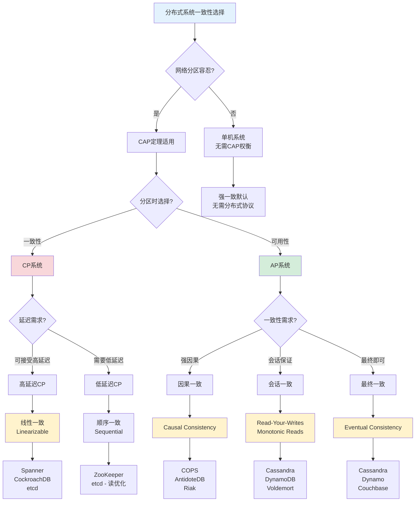
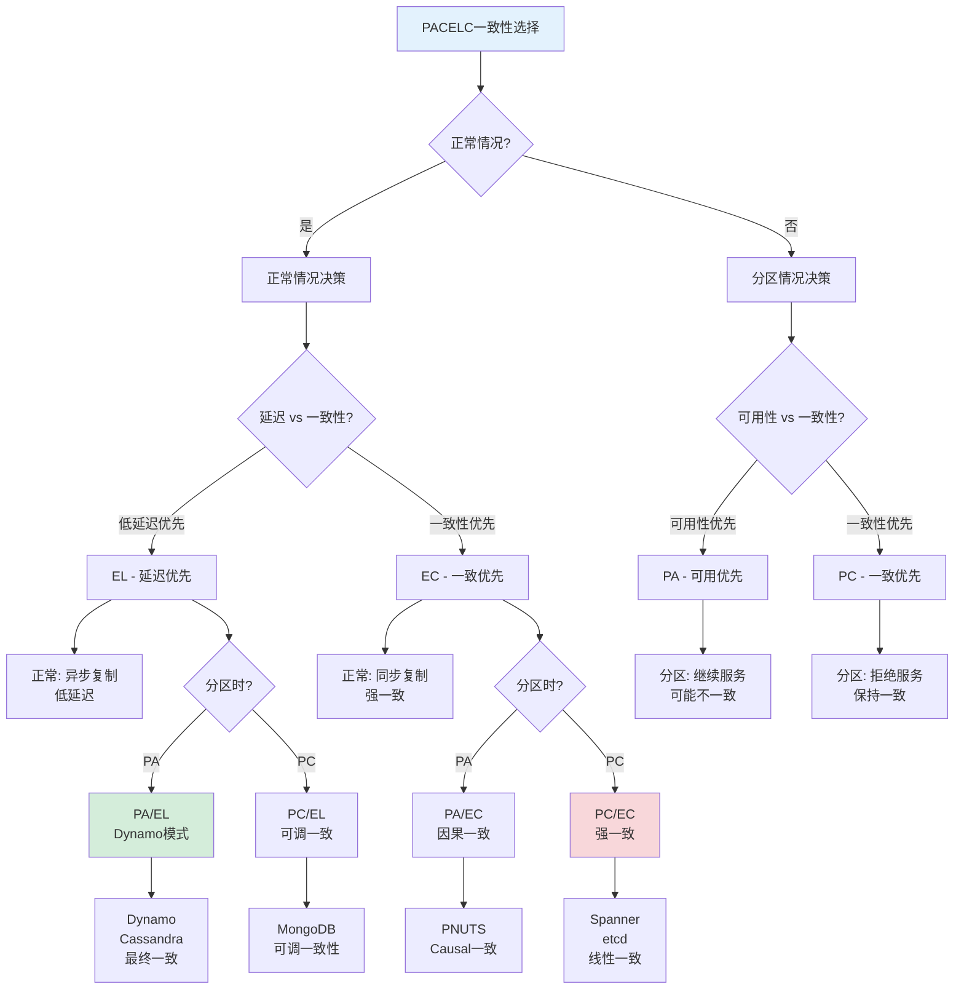
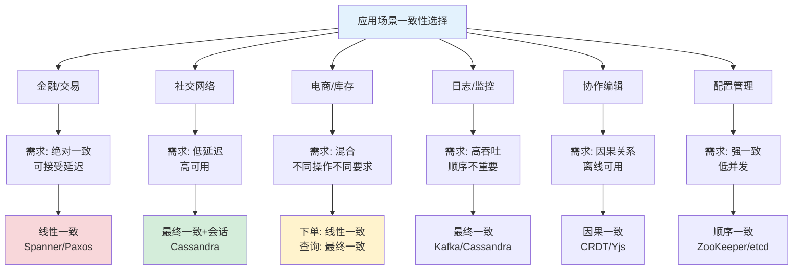
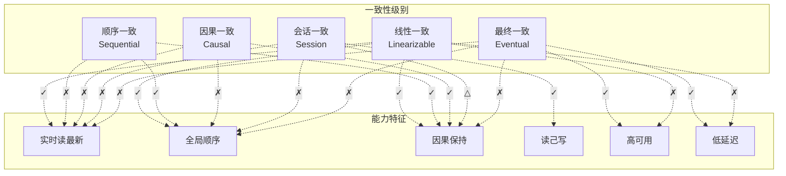
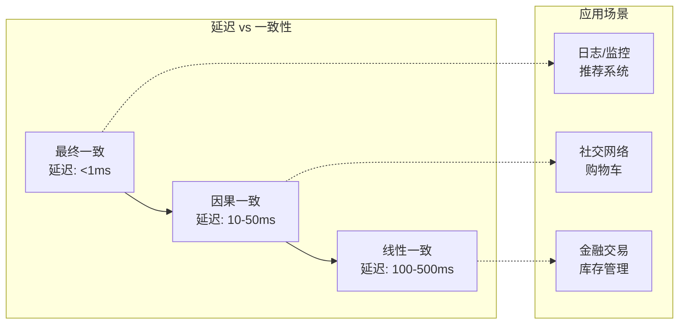
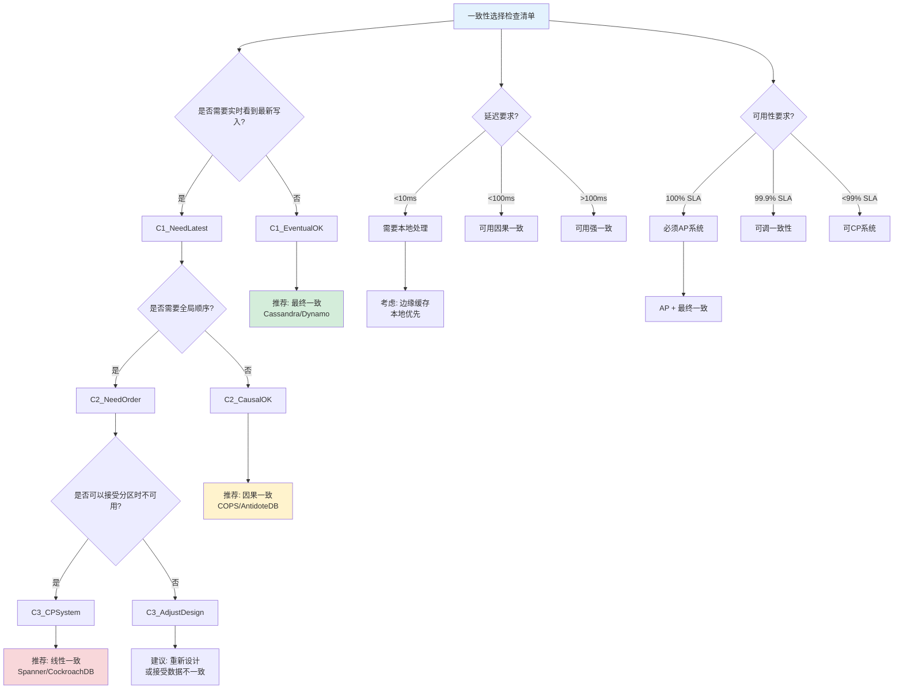

# 一致性级别选择决策树

> 所属阶段: formal-methods/03-model-taxonomy/04-consistency/ | 前置依赖: [01-consistency-spectrum.md](01-consistency-spectrum.md), [02-cap-theorem.md](02-cap-theorem.md) | 形式化等级: L4

## 1. 概念定义 (Definitions)

### 1.1 一致性选择决策树

**定义 Def-M-04-CDT-01**: 一致性级别选择决策树是分布式存储系统一致性模型选择的层次化决策框架，基于 CAP 定理、PACELC 模型和延迟-可用性权衡，指导工程师从系统需求出发选择合适的一致性保证。

**形式化表示**:

$$\mathcal{T}_{cons} = (N, E, \mathcal{C}, n_0, \delta)$$

其中：

- $N$: 决策节点集合
- $E \subseteq N \times N$: 决策分支关系
- $\mathcal{C} = \{\text{强一致}, \text{最终一致}, \text{因果一致}, \text{会话一致}\}$: 一致性级别
- $n_0$: 根节点（一致性需求分析）
- $\delta: N \rightarrow \mathcal{P}(ConsistencyModel)$: 节点到一致性模型集合的映射

### 1.2 选择维度

**定义 Def-M-04-CDT-02**: 一致性选择的三大核心维度：

| 维度 | 决策问题 | 典型选项 |
|------|---------|---------|
| **CAP 权衡** | 分区容忍性下的选择 | CP vs AP |
| **延迟需求** | 可接受的读写延迟 | 强一致延迟 vs 最终一致延迟 |
| **可用性需求** | 可接受的不可用时间 | 100% 可用 vs 可容忍故障 |

### 1.3 一致性级别层次

**定义 Def-M-04-CDT-03**: 一致性强度层次（从强到弱）：

$$\text{线性一致} \succ \text{顺序一致} \succ \text{因果一致} \succ \text{PRAM} \succ \text{读己写} \succ \text{单调读} \succ \text{最终一致}$$

**形式化定义**: 基于 [01-consistency-spectrum.md](01-consistency-spectrum.md) 中的形式化语义。

## 2. 属性推导 (Properties)

### 2.1 一致性选择的完备性

**引理 Lemma-M-04-CDT-01** [选择维度完备性]:
CAP 权衡、延迟需求和可用性需求三个维度覆盖了分布式系统一致性选择的主要决策因素。

**证明概要**:
根据 Gilbert 和 Lynch 的 CAP 定理[^1]，分布式系统必须在一致性(C)、可用性(A)和分区容忍性(P)中选择。延迟和可用性是 CAP 的工程细化：

- 延迟需求：强一致性通常需要同步通信，增加延迟
- 可用性需求：强一致性在分区期间可能需要拒绝服务

因此三个维度构成完备的决策空间。∎

### 2.2 一致性级别特征

**引理 Lemma-M-04-CDT-02** [一致性级别延迟特征]:

| 一致性级别 | 读延迟 | 写延迟 | 分区行为 |
|-----------|-------|-------|---------|
| 线性一致 | 高 | 高 | 不可用 |
| 因果一致 | 中 | 中 | 降级可用 |
| 最终一致 | 低 | 低 | 完全可用 |

## 3. 关系建立 (Relations)

### 3.1 一致性级别到应用场景的映射

| 一致性级别 | 典型应用 | 代表系统 |
|-----------|---------|---------|
| 线性一致 | 金融交易、库存管理 | etcd, ZooKeeper, Spanner |
| 顺序一致 | 分布式锁、配置管理 | ZooKeeper, etcd |
| 因果一致 | 社交网络、协作编辑 | COPS, AntidoteDB |
| 读己写 | 用户会话、购物车 | Dynamo, Cassandra |
| 最终一致 | 日志、监控、推荐 | Cassandra, DynamoDB |

### 3.2 PACELC 扩展关系

PACELC 模型[^2]扩展了 CAP，引入延迟与一致性的权衡：

- **PA**: 分区时选择可用性（AP 系统）
- **PC**: 分区时选择一致性（CP 系统）
- **EL**: 正常时选择低延迟
- **EC**: 正常时选择一致性

决策树整合了 PACELC 的四种组合：

- **PA/EL**: Dynamo, Cassandra（最终一致，低延迟）
- **PA/EC**: PNUTS（因果一致，中等延迟）
- **PC/EL**: MongoDB（可调一致性）
- **PC/EC**: Spanner, etcd（强一致，高延迟）

## 4. 论证过程 (Argumentation)

### 4.1 决策路径设计原则

**原则 1: 从业务需求出发**

- 首先确定是否需要强一致性（如金融交易）
- 其次确定延迟容忍度（如实时性要求）
- 最后确定可用性要求（如 SLA 承诺）

**原则 2: 渐进降级**
推荐路径：强一致 → 因果一致 → 最终一致
只在必要时降级，避免过早优化。

**原则 3: 混合策略**
对于复杂系统，不同数据子集可采用不同一致性级别：

- 关键数据：线性一致
- 用户数据：因果一致
- 日志数据：最终一致

### 4.2 反例分析

**反例 1**: 电商库存系统

- 直觉选择: 线性一致（避免超卖）
- 问题: 高峰期延迟过高，用户体验差
- 实际方案:
  - 下单时：预留库存（线性一致）
  - 查询时：缓存库存（最终一致）
  - 支付时：确认库存（线性一致）
- 教训: 不同操作采用不同一致性级别

**反例 2**: 全球分布式数据库

- 场景: 跨大洲数据复制
- 问题: 强一致性导致写入延迟 > 200ms
- 解决方案: 采用因果一致 + 向量时钟
- 验证: 业务逻辑无因果关系依赖，因果一致足够

## 5. 形式证明 / 工程论证 (Proof / Engineering Argument)

### 5.1 CAP 决策定理

**定理 Thm-M-04-CDT-01** [CAP 不可兼得]:
在异步网络模型中，不存在同时满足以下三个性质的分布式数据存储：

1. **一致性 (C)**: 所有节点看到相同的数据视图
2. **可用性 (A)**: 每个请求都收到非错误响应
3. **分区容忍性 (P)**: 系统在任意网络分区下继续运行

**证明概要**:
假设存在满足 CAP 的系统。考虑两节点网络分区场景：

- 节点1接收写请求
- 节点2接收读请求
- 网络分区使两节点无法通信

为保持一致性，节点2必须等待节点1的写操作（或拒绝服务）。

- 如果等待 → 违反可用性
- 如果拒绝 → 违反可用性
- 如果返回旧值 → 违反一致性

矛盾。∎

### 5.2 一致性级别蕴含关系

**定理 Thm-M-04-CDT-02** [一致性层级蕴含]:
一致性级别满足以下蕴含关系：

$$\text{Linearizable} \Rightarrow \text{Sequential} \Rightarrow \text{Causal} \Rightarrow \text{PRAM} \Rightarrow \text{Read-Your-Writes}$$

**工程论证**: 更强的保证蕴含更弱的保证，但代价是更高的延迟和更低的可用性。决策树通过引导用户在需求-代价权衡中找到最优平衡点。

### 5.3 延迟下界定理

**定理 Thm-M-04-CDT-03** [一致性延迟下界]:
在网络延迟为 $d$ 的分布式系统中，实现线性一致的读写操作至少需要 $2d$ 的延迟。

**证明概要**:
读操作必须确认没有并发的写操作，需要与多数副本通信。写操作必须确认持久化到多数副本。最少需要两次网络往返。∎

## 6. 实例验证 (Examples)

### 6.1 金融交易系统选型

**需求分析**:

- 数据类型: 账户余额、交易记录
- 一致性要求: 绝对精确，不允许不一致
- 延迟要求: < 1s（可接受）
- 可用性要求: 99.99%（可容忍短暂不可用）

**决策路径**:

```
分区容忍性: 必须（分布式系统）
└── CAP选择: 一致性优先（CP）
    └── 延迟可接受 → 线性一致
        └── 系统选择: Spanner / CockroachDB
```

**验证**: 使用 Jepsen 测试验证线性一致性[^3]。

### 6.2 社交网络动态流选型

**需求分析**:

- 数据类型: 用户动态、点赞、评论
- 一致性要求: 用户看到自己的操作即可
- 延迟要求: < 100ms（严格）
- 可用性要求: 100%（不接受不可用）

**决策路径**:

```
分区容忍性: 必须
└── CAP选择: 可用性优先（AP）
    └── 低延迟要求 → 最终一致
        └── 增强: 会话一致（Read-Your-Writes）
            └── 系统选择: Cassandra / DynamoDB
```

**验证**: 使用向量时钟验证因果一致性。

### 6.3 协作编辑器选型

**需求分析**:

- 数据类型: 文档操作（CRDT）
- 一致性要求: 操作因果关系保持
- 延迟要求: < 50ms（实时协作）
- 可用性要求: 离线可用

**决策路径**:

```
分区容忍性: 必须（支持离线）
└── CAP选择: 可用性优先（AP）
    └── 因果要求 → 因果一致
        └── 实现: CRDT + 向量时钟
            └── 系统选择: Yjs / Automerge
```

## 7. 可视化 (Visualizations)

### 7.1 一致性选择决策树（主决策树）



### 7.2 PACELC 扩展决策树



### 7.3 应用场景快速决策图



### 7.4 一致性级别能力矩阵



### 7.5 延迟-一致性权衡图



### 7.6 一致性选择检查清单



## 8. 引用参考 (References)

[^1]: S. Gilbert and N. Lynch, "Brewer's Conjecture and the Feasibility of Consistent, Available, Partition-Tolerant Web Services", ACM SIGACT News, 2002.
[^2]: D. J. Abadi, "Consistency Tradeoffs in Modern Distributed Database System Design", IEEE Computer, 2012.
[^3]: K. Kingsbury, "Jepsen: Distributed Systems Safety Analysis", <https://jepsen.io>, 2013-2025.
