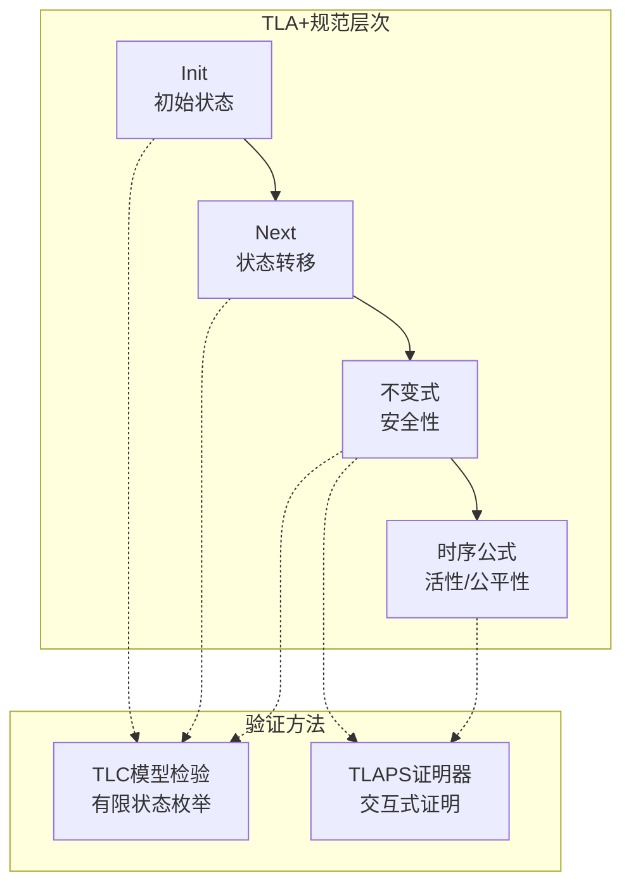
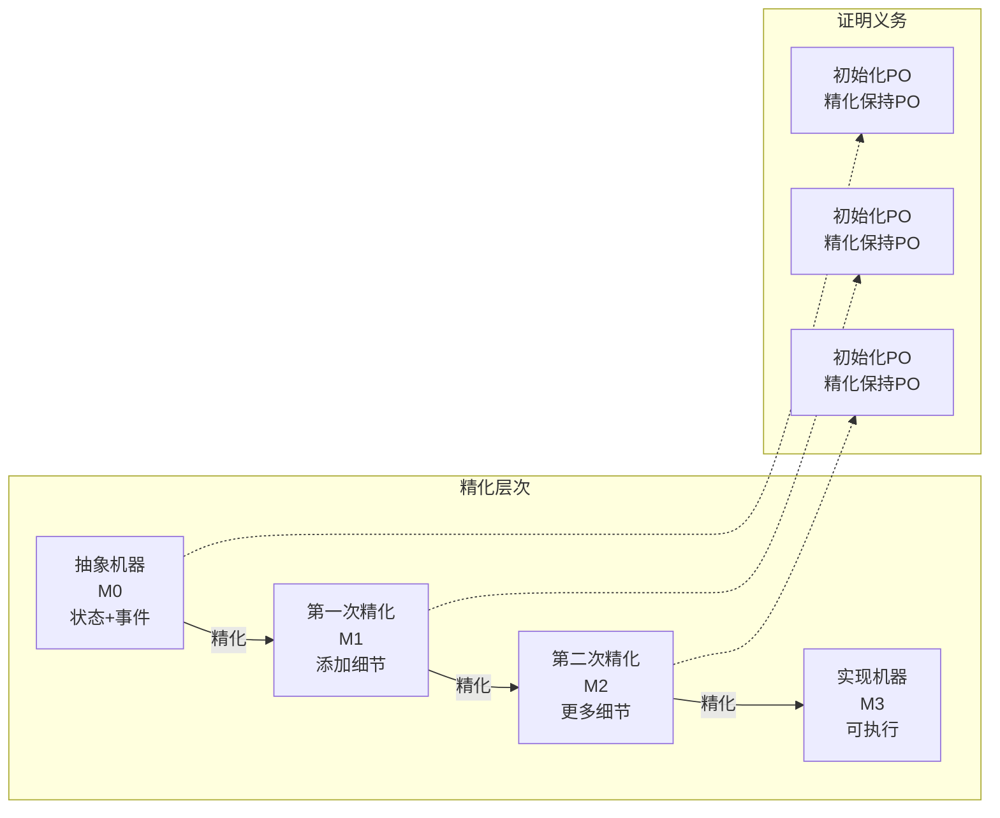
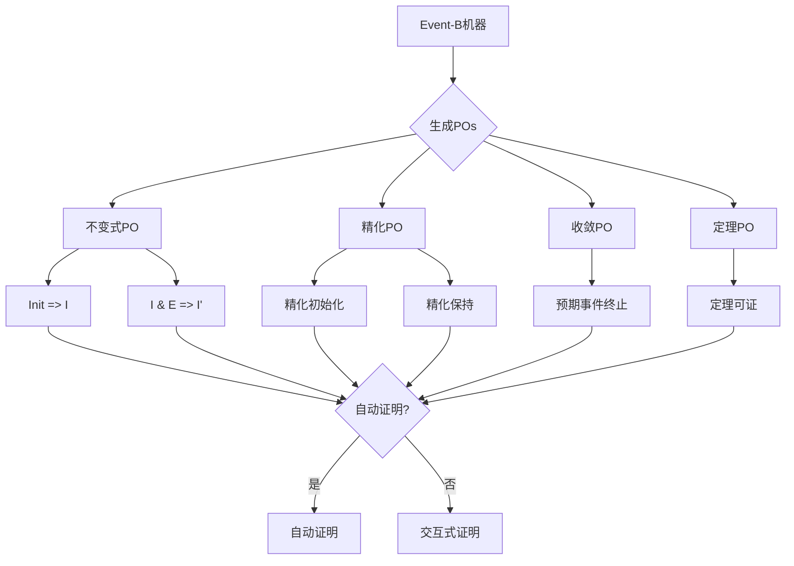

# 逻辑方法

> **所属单元**: formal-methods/03-model-taxonomy/05-verification-methods | **前置依赖**: [04-consistency/02-cap-theorem](../../04-consistency/02-cap-theorem.md) | **形式化等级**: L5-L6

## 1. 概念定义 (Definitions)

### Def-M-05-01-01 形式化规范语言

形式化规范语言 $\mathcal{L}$ 提供数学化精确描述：

$$\mathcal{L} = (\mathcal{S}, \mathcal{F}, \mathcal{P}, \mathcal{T}, \vdash)$$

- $\mathcal{S}$：语法（合法公式集合）
- $\mathcal{F}$：语义函数（公式到含义的映射）
- $\mathcal{P}$：证明系统（推导规则）
- $\mathcal{T}$：类型系统（良构性检查）
- $\vdash$：可证明性关系

### Def-M-05-01-02 TLA+ (Temporal Logic of Actions)

TLA+是Leslie Lamport设计的时序逻辑规范语言：

$$\text{Spec} = Init \land \Box[Next]_{vars} \land Liveness$$

**核心组件**：

- **状态函数**：$x, x', y, ...$（变量和 primed 变量）
- **动作公式**：描述状态转移，如 $x' = x + 1$
- **时序算子**：$\Box$（always）、$\Diamond$（eventually）
- **公平性条件**：WF（弱公平）、SF（强公平）

**规范结构**：

```tla
---- MODULE MySpec ----
EXTENDS Naturals, Sequences

VARIABLES x, y

Init == x = 0 /\ y = 0

Next ==
  \/ /\ x < 10
     /\ x' = x + 1
     /\ y' = y
  \/ /\ x >= 10
     /\ y' = y + 1
     /\ x' = x

Spec == Init /\ [][Next]_<<x, y>> /\ WF_<<x, y>>(Next)
====
```

### Def-M-05-01-03 Event-B方法

Event-B是B方法的演进，强调**精化**（Refinement）：

$$\mathcal{M} = (C, S, V, E, I, A)$$

- $C$：上下文（Context，静态元素）
- $S$：机器（Machine，动态行为）
- $V$：变量
- $E$：事件（带卫式和动作）
- $I$：不变式
- $A$：公理和定理

**精化关系**：

$$M_1 \sqsubseteq M_0 \Leftrightarrow \exists r: r(I_1) \Rightarrow I_0 \land r(E_1) \subseteq E_0$$

其中 $r$ 为精化映射（抽象到具体）。

### Def-M-05-01-04 不变式 (Invariant)

不变式 $I$ 是在所有可达状态下成立的谓词：

$$\text{Invariant}(I) \triangleq \forall s \in \text{Reachable}: s \models I$$

**证明义务**（POs）：

1. **初始化**：$Init \Rightarrow I$
2. **保持**：$I \land Action \Rightarrow I'$

### Def-M-05-01-05 时序逻辑公式 (TLA)

时序逻辑公式分类：

| 公式类型 | 符号 | 含义 | 示例 |
|---------|------|------|------|
| 状态谓词 | $P$ | 单状态性质 | $x = 5$ |
| 动作公式 | $\mathcal{A}$ | 状态转移 | $x' = x + 1$ |
| 时序公式 | $\Box F$ | 总是F | 安全性 |
| 时序公式 | $\Diamond F$ | 最终F | 活性 |
| 时序公式 | $F \leadsto G$ | F导致G | $x = 5 \leadsto x = 10$ |

## 2. 属性推导 (Properties)

### Lemma-M-05-01-01 TLA+规范的实现关系

若 $Implementation \Rightarrow Specification$，则实现满足规范。

**证明策略**：

1. 构造实现的状态机
2. 证明每个实现转移对应规范动作
3. 验证初始状态蕴含规范初始条件

### Lemma-M-05-01-02 Event-B精化保持性质

若 $M_1 \sqsubseteq M_0$ 且 $I_0$ 是 $M_0$ 的不变式，则 $r(I_0)$ 是 $M_1$ 的不变式。

### Prop-M-05-01-01 证明义务复杂度

对于含 $n$ 个变量、$m$ 个事件的Event-B机器：

- 不变式保持POs：$O(m \cdot |I|)$
- 精化POs：$O(|E_{concrete}| \cdot |E_{abstract}|)$
- 自动证明率：通常70-90%（Rodin平台）

### Prop-M-05-01-02 逻辑方法对比

| 特性 | TLA+ | Event-B | Z | VDM |
|-----|------|---------|---|-----|
| 验证方式 | 模型检验+证明 | 精化+证明 | 证明 | 证明 |
| 工具支持 | TLC, TLAPS | Rodin | Z/EVES | VDMTools |
| 应用领域 | 分布式算法 | 嵌入式系统 | 软件规范 | 复杂系统 |
| 学习曲线 | 中等 | 较陡 | 陡 | 中等 |

## 3. 关系建立 (Relations)

### 精化层次

```
抽象规范
    ↓ 精化
设计规范
    ↓ 精化
实现规范
```

**正确性保证**：每层精化保持上层性质。

### 与模型检验的关系

- **TLA+**：TLC模型检验器枚举状态空间
- **Event-B**：ProB模型检验器动画演示
- **混合方法**：小状态空间用模型检验，大状态空间用证明

## 4. 论证过程 (Argumentation)

### 为什么选择形式化方法？

**传统测试的局限**：

- 只能证明存在错误，不能证明不存在
- 覆盖所有路径不现实

**形式化方法优势**：

- 数学证明覆盖所有可能执行
- 在实现前发现设计缺陷
- 文档化精确语义

**成本效益**：

- 前期投入高，后期维护成本低
- 适用于安全关键系统

### 精化 vs 直接实现

**精化优势**：

- 逐步降低抽象层次
- 每步可验证
- 错误定位更容易

**挑战**：

- 需要经验判断精化粒度
- 工具支持复杂

## 5. 形式证明 / 工程论证 (Proof / Engineering Argument)

### Thm-M-05-01-01 TLA+安全性证明

**定理**：若 $Spec = Init \land \Box[Next]_{vars}$ 且 $Init \Rightarrow I$、$I \land [Next]_{vars} \Rightarrow I'$，则 $Spec \Rightarrow \Box I$。

**证明**：

**归纳法**：

- **基例**：$Init \Rightarrow I$（给定）
- **归纳步**：假设 $I$ 在当前状态成立
  - $[Next]_{vars}$ 包含两种情况：
    1. $Next$ 为真：由 $I \land Next \Rightarrow I'$，$I'$ 成立
    2. $vars' = vars$（无变化）：$I' = I$，成立
- 因此，$I \land [Next]_{vars} \Rightarrow I'$

**时序推理**：
由归纳法，$I$ 在所有可达状态成立，即 $\Box I$。∎

### Thm-M-05-01-02 Event-B精化正确性

**定理**：若 $M_1 \sqsubseteq M_0$ 通过所有精化POs，则 $M_1$ 实现 $M_0$ 的规范。

**证明义务详述**：

1. **精化初始化**：$Init_1 \Rightarrow \exists v_0: Init_0 \land J$
   - 具体初始化蕴含抽象初始化

2. **精化保持**：$J \land E_1 \Rightarrow \exists E_0: E_0 \land J'$
   - 具体事件对应抽象事件

3. **收敛**：$E_1$ 必须终止（对于预期事件）

4. **不变式保持**：精化不变式在具体机器中保持

**正确性传递**：
$$M_1 \text{ correct} \land M_1 \sqsubseteq M_0 \Rightarrow M_0 \text{ satisfied by } M_1$$

## 6. 实例验证 (Examples)

### 实例1：TLA+二阶段提交规范

```tla
---- MODULE TwoPhaseCommit ----
EXTENDS Naturals, FiniteSets, Sequences

CONSTANTS RM,          \* 资源管理器集合
          TM           \* 事务管理器

VARIABLES rmState,     \* RM状态函数
          tmState,     \* TM状态
          msgs          \* 消息集合

Init ==
  /\ rmState = [r \in RM |-> "working"]
  /\ tmState = "init"
  /\ msgs = {}

TMRcvPrepared(r) ==
  /\ tmState = "init"
  /\ [type |-> "Prepared", rm |-> r] \in msgs
  /\ tmState' = "init"  \* 继续收集
  /\ UNCHANGED <<rmState, msgs>>

TMCommit ==
  /\ tmState = "init"
  /\ \A r \in RM: [type |-> "Prepared", rm |-> r] \in msgs
  /\ tmState' = "committed"
  /\ msgs' = msgs \union {[type |-> "Commit"]}
  /\ UNCHANGED rmState

RMPrepare(r) ==
  /\ rmState[r] = "working"
  /\ rmState' = [rmState EXCEPT ![r] = "prepared"]
  /\ msgs' = msgs \union {[type |-> "Prepared", rm |-> r]}
  /\ UNCHANGED tmState

RMChooseToAbort(r) ==
  /\ rmState[r] = "working"
  /\ rmState' = [rmState EXCEPT ![r] = "aborted"]
  /\ UNCHANGED <<tmState, msgs>>

Next ==
  \/ TMCommit
  \/ \E r \in RM: TMRcvPrepared(r) \/ RMPrepare(r) \/ RMChooseToAbort(r)

Spec == Init /\ [][Next]_<<rmState, tmState, msgs>>

\* 安全性：已提交的RM不能中止
Consistency ==
  \A r1, r2 \in RM:
    (rmState[r1] = "committed" /\ rmState[r2] = "aborted") => FALSE
====
```

### 实例2：Event-B交通灯控制器

```event-b
CONTEXT TrafficLightCtx
SETS
  COLOR = {RED, YELLOW, GREEN}
CONSTANTS
  nextColor
AXIOMS
  axm1: nextColor ∈ COLOR ↣ COLOR
  axm2: nextColor(RED) = GREEN
  axm3: nextColor(GREEN) = YELLOW
  axm4: nextColor(YELLOW) = RED
END

MACHINE TrafficLightMch
SEES TrafficLightCtx
VARIABLES
  currentColor
INVARIANTS
  inv1: currentColor ∈ COLOR
EVENTS
  INITIALISATION
    THEN
      act1: currentColor := RED
    END

  ChangeColor
    ANY c
    WHERE
      grd1: c = nextColor(currentColor)
    THEN
      act1: currentColor := c
    END
END
```

### 实例3：TLA+活性证明

```tla
\* 活性：最终所有RM进入committed或aborted
Termination ==
  <>(\A r \in RM: rmState[r] \in {"committed", "aborted"})

\* 公平性假设
Fairness ==
  /\ WF_<<vars>>(TMCommit)
  /\ \A r \in RM: WF_<<vars>>(RMPrepare(r))

\* 完整规范
CompleteSpec == Spec /\ Fairness
```

## 7. 可视化 (Visualizations)

### TLA+规范结构



### Event-B精化链



### 证明义务生成



## 8. 引用参考 (References)
